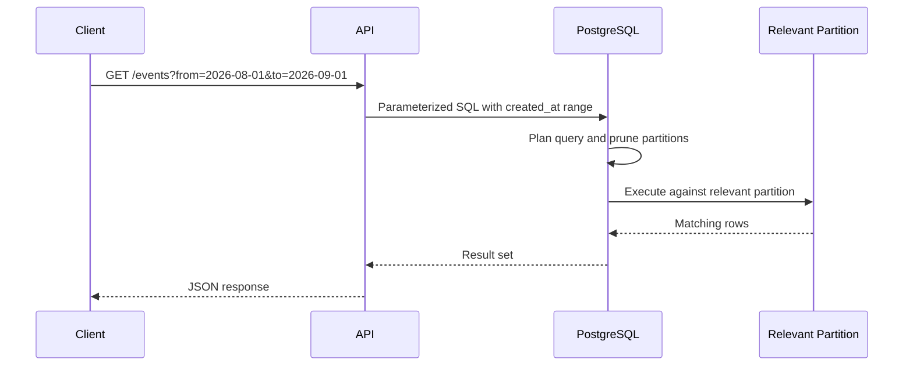

# 04- Range Partitioning

## Overview

Range partitioning divides a logical table into partitions based on contiguous, non-overlapping ranges of a partition key.

It is particularly effective when the data has a naturally ordered dimension such as:

- Timestamp or date.
- Sequential numeric ID.
- Tenant/account ID ranges.
- Measurement intervals.
- Version or sequence ranges.

The database routes a row to the partition whose range contains the partition-key value.

For example:

```text
orders
├── orders_2026_01   → created_at >= 2026-01-01 AND < 2026-02-01
├── orders_2026_02   → created_at >= 2026-02-01 AND < 2026-03-01
├── orders_2026_03   → created_at >= 2026-03-01 AND < 2026-04-01
└── orders_2026_04   → created_at >= 2026-04-01 AND < 2026-05-01
```

For large time-oriented workloads, range partitioning can improve query performance through partition pruning and simplify operational tasks such as retention, archival, and partition-level maintenance.

Range partitioning is not automatically a performance optimization. Its effectiveness depends heavily on query patterns, partition-key selectivity, partition sizing, and the database engine's ability to prune irrelevant partitions.

## What Range Partitioning Is

Range partitioning maps values to partitions using ordered lower and upper boundaries.

Conceptually:

```text
Partition 1       Partition 2       Partition 3
[0, 1000)        [1000, 2000)      [2000, 3000)
     │                 │                  │
     ▼                 ▼                  ▼
 rows 0-999      rows 1000-1999      rows 2000-2999
```

The notation `[start, end)` means:

- `start` is included.
- `end` is excluded.

This boundary convention is especially useful for dates because adjacent partitions can be defined without overlapping ranges.

For example:

```text
January:
[2026-01-01, 2026-02-01)

February:
[2026-02-01, 2026-03-01)
```

There is no gap and no overlap between the two partitions.

## Why Range Partitioning Exists

Very large tables can become expensive to manage even when individual queries are well indexed.

A table containing billions of historical records may have:

- Large indexes.
- Long maintenance operations.
- Expensive vacuuming or cleanup.
- Large backup footprints.
- Slow historical deletion.
- Increasing storage and I/O pressure.

Range partitioning can divide this workload into manageable physical units.

For example:

```text
events
├── 2024
├── 2025
└── 2026
```

An application querying recent events does not necessarily need to inspect historical partitions.

This can reduce the amount of data considered by the query planner and executor.

## When to Use Range Partitioning

Range partitioning is a strong candidate when:

| Workload characteristic | Suitability |
|---|---|
| Queries filter by time range | Excellent |
| Data grows continuously over time | Excellent |
| Old data has retention requirements | Excellent |
| Historical data is rarely accessed | Excellent |
| Large sequential ID ranges | Good |
| Queries rarely use the partition key | Poor |
| Workload is evenly distributed by arbitrary values | Consider hash partitioning |
| Very small table | Usually unnecessary |
| Random lookups dominate | Often unnecessary |

Typical backend use cases include:

- Audit logs.
- Application events.
- Financial transactions.
- IoT measurements.
- Metrics.
- Order history.
- API request logs.
- Data warehouse staging tables.

## How Range Partitioning Works

A partitioned table provides one logical interface:

```text
Application
     │
     ▼
Logical table
     │
     ▼
Query planner
     │
     ▼
Partition pruning
     │
     ├── Partition A
     ├── Partition B
     └── Partition C
```

For a query such as:

```sql
SELECT COUNT(*)
FROM events
WHERE created_at >= TIMESTAMP '2026-08-01 00:00:00'
  AND created_at < TIMESTAMP '2026-09-01 00:00:00';
```

the optimizer can determine that only the August partition is relevant if the table is partitioned by `created_at`.

The important performance property is **partition pruning**.

Partitioning does not eliminate the need for indexes. The database may still need an index within the selected partition.

## Range Partitioning in PostgreSQL

PostgreSQL provides declarative partitioning using `PARTITION BY RANGE`.

Example:

```sql
CREATE TABLE events (
    id BIGINT NOT NULL,
    tenant_id BIGINT NOT NULL,
    event_type TEXT NOT NULL,
    payload JSONB NOT NULL,
    created_at TIMESTAMPTZ NOT NULL
) PARTITION BY RANGE (created_at);
```

Create monthly partitions:

```sql
CREATE TABLE events_2026_08
PARTITION OF events
FOR VALUES FROM ('2026-08-01 00:00:00+00')
             TO ('2026-09-01 00:00:00+00');

CREATE TABLE events_2026_09
PARTITION OF events
FOR VALUES FROM ('2026-09-01 00:00:00+00')
             TO ('2026-10-01 00:00:00+00');
```

Applications can continue querying the parent table:

```sql
SELECT id, tenant_id, event_type, created_at
FROM events
WHERE tenant_id = 42
  AND created_at >= TIMESTAMPTZ '2026-09-01 00:00:00+00'
  AND created_at < TIMESTAMPTZ '2026-10-01 00:00:00+00';
```

PostgreSQL can prune partitions outside the requested time range.

## Partition Bounds

Partition boundaries must be designed carefully.

A common production convention is:

```text
FROM inclusive
TO   exclusive
```

For monthly partitions:

```text
2026-08-01 <= created_at < 2026-09-01
2026-09-01 <= created_at < 2026-10-01
```

This is preferable to manually encoding the final timestamp of each month.

Avoid definitions such as:

```text
2026-08-01 through 2026-08-31 23:59:59
```

because timestamp precision can introduce boundary bugs.

Use half-open intervals instead:

```text
[2026-08-01, 2026-09-01)
```

## Choosing the Partition Key

The partition key should be chosen from actual access patterns rather than simply selecting a frequently populated column.

A strong candidate usually has:

- Frequent filtering in queries.
- Natural ordering.
- Predictable growth.
- Meaningful lifecycle boundaries.
- Reasonably selective ranges.

For event data:

```sql
created_at
```

is often a natural candidate.

For sequential records:

```sql
id
```

may be appropriate.

For example:

```text
id 0       - 999999
id 1000000 - 1999999
id 2000000 - 2999999
```

However, if almost every query filters by `tenant_id` and rarely filters by `created_at`, time-based partitioning may provide limited benefit.

## Partition Granularity

Granularity determines how much data belongs in each partition.

Common choices include:

| Granularity | Typical use |
|---|---|
| Hourly | Extremely high-volume event streams |
| Daily | High-volume logs and telemetry |
| Weekly | Moderate event workloads |
| Monthly | Common general-purpose time-series design |
| Quarterly | Lower-volume historical data |
| Yearly | Very large historical periods with low operational churn |

There is no universal optimal partition size.

Too few partitions:

```text
2020-2026
└── One huge partition
```

can reduce the benefits of partitioning.

Too many partitions:

```text
Every hour
└── Thousands of partitions
```

can increase planning and operational overhead.

The correct granularity depends on:

- Row volume.
- Query patterns.
- Retention requirements.
- Index size.
- Maintenance workload.
- Database version and planner behavior.
- Operational tooling.

## Monthly Partitioning Example

For an audit-event system:

```text
events
├── events_2026_01
├── events_2026_02
├── events_2026_03
├── events_2026_04
├── events_2026_05
├── events_2026_06
├── events_2026_07
├── events_2026_08
└── events_2026_09
```

A monthly query:

```sql
SELECT COUNT(*)
FROM events
WHERE created_at >= TIMESTAMPTZ '2026-08-01'
  AND created_at < TIMESTAMPTZ '2026-09-01';
```

can be reduced to the relevant partition rather than scanning all historical partitions.

## Partition Pruning

Partition pruning is one of the primary performance benefits of range partitioning.

Without partitioning:

```text
Query
  │
  ▼
Large table
  │
  ├── Historical rows
  ├── Recent rows
  └── Future rows
```

With effective pruning:

```text
Query: August 2026
       │
       ▼
Partition pruning
       │
       └── events_2026_08
```

The optimizer determines which partitions can contain qualifying rows.

To benefit from pruning, predicates should expose the partition key clearly.

Good:

```sql
WHERE created_at >= $1
  AND created_at < $2
```

Potentially problematic designs include expressions that make partition-bound reasoning harder or queries that omit the partition key entirely.

Always verify actual behavior using an execution plan.

## Verifying Partition Pruning

In PostgreSQL:

```sql
EXPLAIN (ANALYZE, BUFFERS)
SELECT COUNT(*)
FROM events
WHERE created_at >= TIMESTAMPTZ '2026-08-01 00:00:00+00'
  AND created_at < TIMESTAMPTZ '2026-09-01 00:00:00+00';
```

Look for the plan accessing only relevant partitions.

A healthy plan should demonstrate that irrelevant partitions are excluded rather than simply proving that the table is partitioned.

`EXPLAIN ANALYZE` executes the query, so use caution with expensive production queries. For read-only queries it is generally safe from a data-modification perspective, but it still consumes real database resources.

## Indexes on Range Partitions

Partitioning and indexing solve different problems.

Partitioning answers:

> Which physical partitions could contain the data?

Indexes answer:

> How can the database find rows efficiently inside those partitions?

For example:

```sql
CREATE INDEX events_2026_08_tenant_created_idx
ON events_2026_08 (tenant_id, created_at);
```

If the application commonly queries:

```sql
SELECT *
FROM events
WHERE tenant_id = $1
  AND created_at >= $2
  AND created_at < $3;
```

a composite index may be appropriate within each partition.

The exact index design should be based on real query patterns.

## Locality of Indexes

Partitioning can make indexes smaller because each partition has its own physical index.

Instead of:

```text
One huge table
    │
    └── One huge index
```

you may have:

```text
Partition A ── Index A
Partition B ── Index B
Partition C ── Index C
```

Benefits can include:

- Smaller index structures.
- Better cache locality.
- Faster partition-level maintenance.
- Easier index rebuilding or replacement.

However, the total size of all partition indexes may still be large.

Partitioning does not magically reduce the total amount of indexed data.

## Retention and Data Deletion

Range partitioning is particularly useful for time-based retention.

Suppose the requirement is:

> Keep audit events for 12 months.

Without partitioning:

```sql
DELETE FROM events
WHERE created_at < CURRENT_TIMESTAMP - INTERVAL '12 months';
```

This can generate substantial:

- WAL.
- CPU usage.
- I/O.
- Table bloat.
- Locking pressure.
- Vacuum work.

With time-based partitions, old data can be removed at the partition level.

For example:

```sql
DROP TABLE events_2025_08;
```

or, where appropriate, detach the partition first:

```sql
ALTER TABLE events
DETACH PARTITION events_2025_08;
```

Then the detached table can be archived or dropped separately.

The exact operational procedure should account for database version, locking behavior, backup requirements, replication, and application dependencies.

## Partition Lifecycle Management

Time-based partitioning requires lifecycle automation.

A production system should typically maintain:

```text
Current partitions
    │
    ├── Current
    ├── Next
    └── Future

Lifecycle
    │
    ├── Create future partition
    ├── Write data
    ├── Retain
    ├── Archive
    └── Drop expired partition
```

Do not wait until midnight on the first day of a month to discover that the next partition does not exist.

A scheduled job can create future partitions ahead of time.

For example, a Celery or Kubernetes CronJob workflow might:

1. Determine the next required partition.
2. Create it if missing.
3. Verify its boundary.
4. Alert on failure.

The database should remain the source of truth for whether the partition exists.

## Default Partitions

Some systems create a default partition to catch rows that do not match an explicit range.

Conceptually:

```text
events
├── 2026-08
├── 2026-09
└── DEFAULT
```

This can protect ingestion from failures caused by missing future partitions.

However, a default partition can hide partition-management problems because unexpected rows may silently accumulate there.

If using a default partition:

- Monitor its row count.
- Alert when it becomes non-empty.
- Investigate why rows did not match expected ranges.
- Move rows into the correct partition when appropriate.

A default partition should be a safety mechanism, not a replacement for lifecycle automation.

## Handling Late-Arriving Data

Time-based partitioning must account for events arriving after their logical timestamp.

For example:

```text
Current date: 2026-09-15

Incoming event:
created_at = 2026-07-20
```

The database must route the row to the July partition.

If July has already been archived or dropped, ingestion may fail or require a separate late-data workflow.

Production systems should explicitly define:

- Maximum expected event delay.
- How long historical partitions remain writable.
- Whether archived partitions can be restored.
- How late events are processed.
- Whether ingestion uses event time or processing time.

## Time Zones and Partitioning

Timestamp partitioning requires deliberate timezone handling.

For distributed backend systems, `TIMESTAMPTZ` in PostgreSQL is often preferable when the timestamp represents an absolute point in time.

Partition boundaries should be defined consistently.

For example:

```sql
FOR VALUES FROM ('2026-09-01 00:00:00+00')
             TO ('2026-10-01 00:00:00+00');
```

Avoid allowing application servers in different time zones to independently determine partition boundaries.

A centralized UTC-based policy is easier to reason about operationally.

## NULL Values

A range partitioning strategy must account for `NULL` values.

Depending on the database implementation, `NULL` may not belong to ordinary range partitions.

If the partition key can be null, define an explicit strategy:

- Make the partition key `NOT NULL`.
- Provide a default partition.
- Define appropriate database-specific handling.

For event tables, making the timestamp required is often the cleanest design:

```sql
created_at TIMESTAMPTZ NOT NULL
```

## Composite Partitioning

Some workloads benefit from combining partitioning strategies.

For example:

```text
Range by created_at
        │
        ├── August 2026
        │      ├── Hash bucket 0
        │      ├── Hash bucket 1
        │      └── Hash bucket 2
        │
        └── September 2026
               ├── Hash bucket 0
               ├── Hash bucket 1
               └── Hash bucket 2
```

PostgreSQL supports multi-level partitioning.

A time range can be the first level, with another partitioning strategy applied underneath.

This can be useful when:

- Time provides lifecycle boundaries.
- Another key creates significant write or query skew.
- Individual time partitions become too large.

However, multi-level partitioning increases schema and operational complexity.

Do not introduce it without measured justification.

## Range Partitioning vs Other Partitioning Strategies

| Strategy | Partition key | Strong use case | Main concern |
|---|---|---|---|
| Range | Ordered ranges | Time-series and lifecycle data | Choosing boundaries |
| List | Explicit values | Regions, tenants, categories | Large value sets |
| Hash | Hash of key | Even distribution | Poor lifecycle management |
| Composite | Multiple levels | Complex high-volume workloads | Operational complexity |

Range partitioning is usually the most natural choice when the data has a strong temporal lifecycle.

## Query Patterns

The partition key should appear naturally in common queries.

Good:

```sql
SELECT id, event_type, created_at
FROM events
WHERE tenant_id = $1
  AND created_at >= $2
  AND created_at < $3
ORDER BY created_at DESC
LIMIT 100;
```

Less beneficial for partition pruning:

```sql
SELECT id, event_type, created_at
FROM events
WHERE tenant_id = $1
ORDER BY created_at DESC
LIMIT 100;
```

The second query may need to consider many partitions because no time boundary limits the search.

This illustrates an important point:

> A partitioning strategy should be evaluated against the application's actual query workload, not against the table schema alone.

## ORM Considerations

Django and SQLAlchemy can query partitioned PostgreSQL tables because partitioning is generally exposed through the logical parent table.

For example, Django can continue to use a model representing the parent table:

```python
events = Event.objects.filter(
    tenant_id=tenant_id,
    created_at__gte=start,
    created_at__lt=end,
).order_by("-created_at")
```

The database still performs partition routing and pruning.

However, ORM abstractions can make partitioning behavior less obvious.

Production teams should verify:

- Generated SQL.
- Query predicates.
- Index usage.
- Partition pruning.
- Migration behavior.
- Partition creation automation.

Do not assume that an ORM-generated query will always produce the desired execution plan.

## Application Request Flow

A typical API request might follow:



The application does not normally need to know the physical partition name.

This separation is valuable because physical storage organization remains a database concern.

## Production Considerations

### Partition Creation

Create future partitions before they are needed.

Recommended pattern:

```text
Create N future partitions
        │
        ▼
Monitor partition existence
        │
        ▼
Application writes normally
```

Do not make successful application writes dependent on a just-in-time partition creation operation.

### Partition Size

Monitor both:

- Number of rows.
- Physical size.

A partition that is technically valid may still be operationally too large.

### Maintenance

Partition-level maintenance can simplify:

- Vacuuming.
- Index management.
- Archival.
- Retention.
- Reindexing.

But every partition still consumes database metadata and operational attention.

### Backups and Recovery

Partitioning does not eliminate backup requirements.

A disaster-recovery strategy should preserve the complete logical dataset and schema, including:

- Parent table.
- Partition definitions.
- Partition indexes.
- Constraints.
- Historical partitions.

If old partitions are archived externally, restoration procedures should be tested.

## Monitoring

Useful metrics include:

| Metric | Why it matters |
|---|---|
| Partition size | Detect unexpected growth |
| Rows per partition | Detect skew |
| Partition count | Detect metadata growth |
| Missing future partitions | Prevent ingestion failures |
| Default partition rows | Detect routing failures |
| Query latency by time range | Validate pruning strategy |
| Index size per partition | Detect index growth |
| Partition creation failures | Detect lifecycle problems |
| Retention lag | Detect cleanup failures |

Application observability should also include query latency and database wait metrics.

For PostgreSQL, tools such as:

```sql
EXPLAIN (ANALYZE, BUFFERS)
```

and database statistics can help determine whether partitioning is producing the intended execution behavior.

## Scalability

Range partitioning can improve scalability within a single database by making large datasets easier to manage.

It does not provide unlimited horizontal scaling.

The architecture remains approximately:

```text
                PostgreSQL
                    │
             Logical table
                    │
        ┌───────────┼───────────┐
        ▼           ▼           ▼
    Partition A Partition B Partition C
```

If the database instance itself reaches CPU, memory, I/O, or storage limits, partitioning alone may not solve the problem.

At that point, evaluate other mechanisms such as:

- Vertical scaling.
- Read replicas.
- Caching.
- Workload isolation.
- Archival.
- Sharding.
- Specialized storage systems.

## Reliability Considerations

Partition lifecycle automation should be designed as production infrastructure.

A failure to create a future partition can become an ingestion outage.

A useful safety model is:

```text
Partition lifecycle controller
            │
            ├── Create future partition
            ├── Verify boundaries
            ├── Verify ownership
            ├── Monitor default partition
            └── Alert on failures
```

Operations should also define:

- What happens when partition creation fails.
- How ingestion is recovered.
- How late data is handled.
- How archived partitions are restored.
- How partition definitions are deployed through CI/CD.

## Security Considerations

Partitioning itself is not a security boundary.

Do not assume:

```text
Partition = tenant isolation
```

If the application is multi-tenant, enforce authorization explicitly.

For example:

```sql
SELECT id, event_type, created_at
FROM events
WHERE tenant_id = $1
  AND created_at >= $2
  AND created_at < $3;
```

Use parameterized queries rather than dynamically constructing SQL from user-controlled partition keys or timestamps.

If tenant isolation requires stronger guarantees, database authorization mechanisms such as PostgreSQL Row-Level Security may be appropriate in addition to application-level authorization.

## Cost Considerations

Range partitioning can reduce operational cost when it enables:

- Efficient retention.
- Faster maintenance.
- Reduced query work.
- Smaller indexes per partition.
- Efficient archival.

However, partitioning also introduces costs:

- More schema objects.
- More indexes.
- More migration complexity.
- Partition lifecycle automation.
- Monitoring requirements.
- Planner/metadata overhead.

The objective should be lower total system cost, not simply a higher partition count.

## Common Mistakes and Pitfalls

### Partitioning Without a Partition-Aware Workload

If most queries do not filter on the partition key, pruning provides little benefit.

Measure real query patterns before choosing the key.

### Creating Too Many Partitions

Thousands of tiny partitions can introduce planning and operational overhead.

Choose a granularity based on actual data volume and maintenance requirements.

### Creating Partitions Too Late

If an incoming row falls outside all defined ranges, insertion may fail.

Create future partitions proactively.

### Using Inclusive Upper Bounds

Definitions such as:

```text
>= 2026-08-01
<= 2026-08-31 23:59:59
```

are error-prone.

Prefer:

```text
>= 2026-08-01
<  2026-09-01
```

### Ignoring Late-Arriving Data

Event time and ingestion time are not necessarily identical.

Design explicitly for delayed records.

### Assuming Partitioning Replaces Indexes

Partition pruning narrows the physical search space; indexes can still be necessary inside each selected partition.

### Ignoring Default Partition Growth

A default partition containing unexpected rows may indicate a broken partition lifecycle.

Monitor it aggressively if one exists.

### Partitioning by a Mutable Column

Changing a partition key can require moving a row between partitions.

Prefer stable partition keys, especially for high-write tables.

### Using Application-Generated Partition Names

Applications should normally query the logical parent table rather than construct physical partition names from user input.

### Treating Partitioning as Sharding

Partitioning does not distribute workload across independent database servers.

If the single database node is the bottleneck, another scaling strategy may be required.

## Production Checklist

- [ ] Identify queries that can benefit from partition pruning.
- [ ] Select a stable, workload-aligned partition key.
- [ ] Use half-open range boundaries.
- [ ] Choose partition granularity based on measured volume.
- [ ] Create future partitions proactively.
- [ ] Define a late-arriving-data strategy.
- [ ] Make the partition key `NOT NULL` where appropriate.
- [ ] Design indexes for queries within partitions.
- [ ] Verify pruning with `EXPLAIN`.
- [ ] Automate partition lifecycle management.
- [ ] Monitor partition sizes and growth.
- [ ] Monitor default-partition usage if applicable.
- [ ] Test retention and archival workflows.
- [ ] Include partition definitions in CI/CD and disaster-recovery procedures.
- [ ] Benchmark before and after partitioning.

## Interview Perspective

A strong senior-level explanation should connect range partitioning to both query execution and data lifecycle management.

A concise answer is:

> **Range partitioning divides a logical table into contiguous value ranges, commonly by time. The database can use the partition key to prune partitions that cannot contain matching rows, reducing the amount of data considered by the query. It is especially useful for large time-series or append-heavy tables with predictable retention boundaries. The design must account for partition size, query patterns, indexes, future partition creation, late-arriving data, and operational lifecycle management.**

Common follow-up questions include:

- Why use range partitioning for time-series data?
- What is partition pruning?
- How do you choose partition granularity?
- What happens if a future partition does not exist?
- Why use `[start, end)` boundaries?
- Does partitioning eliminate indexes?
- How do you delete old data efficiently?
- What happens to late-arriving records?
- Can partitioning replace sharding?
- How would you verify that partition pruning is actually occurring?
- What are the drawbacks of having thousands of partitions?

The strongest answer emphasizes that partitioning is a physical data-layout strategy whose value must be validated against actual workload behavior.

## Key Takeaways

- **Range partitioning divides a logical table into ordered, non-overlapping ranges and is especially effective for time-oriented data.**
- **Partition pruning is the primary query-performance benefit, but indexes are still important within selected partitions.**
- **Use half-open boundaries such as `[start, end)` and automate future partition creation to avoid boundary and ingestion failures.**
- **Partition granularity must balance query pruning and lifecycle management against partition-count and planner overhead.**
- **Range partitioning improves single-database manageability and performance but does not replace horizontal scaling mechanisms such as sharding.**