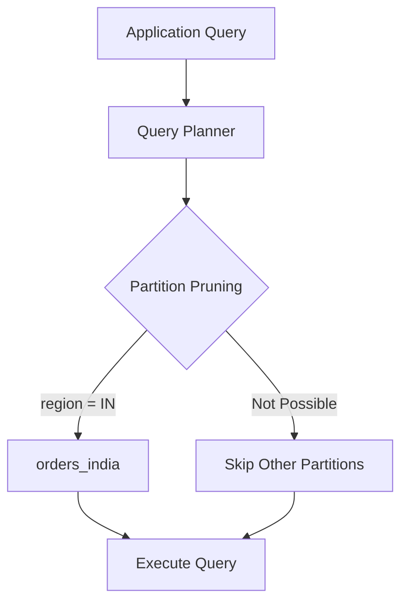
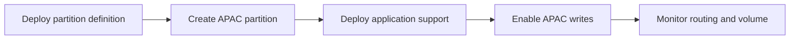

# 05- List Partitioning

## Overview

List partitioning divides a logical table into partitions based on a discrete set of explicitly defined values.

Instead of defining continuous ranges such as dates or numeric intervals, each partition owns one or more specific values of the partition key.

For example, an orders table could be partitioned by region:

```text
orders
├── orders_india       → region = 'IN'
├── orders_us          → region = 'US'
├── orders_europe      → region IN ('DE', 'FR', 'GB')
└── orders_other       → remaining regions
```

List partitioning is useful when the partition key represents a relatively small, stable set of categorical values and queries frequently filter by that key.

Typical examples include:

- Region or country.
- Business unit.
- Environment.
- Product category.
- Tenant groups.
- Data lifecycle classes.
- Regulatory or residency zones.

List partitioning is primarily a **data-layout and management strategy**. It can improve query performance through partition pruning, but it should not be introduced merely because a column contains categorical values.

## What List Partitioning Is

List partitioning maps specific partition-key values to specific partitions.

Conceptually:

```text
                 orders
                    │
          partition key: region
                    │
       ┌────────────┼────────────┐
       ▼            ▼            ▼
     'IN'         'US'       'DE','FR','GB'
       │            │            │
       ▼            ▼            ▼
   India data    US data    Europe data
```

Unlike range partitioning:

```text
[0, 100)
[100, 200)
[200, 300)
```

list partitioning uses explicit value membership:

```text
('IN')
('US')
('DE', 'FR', 'GB')
```

A row is routed to the partition whose value list contains the partition-key value.

## Why List Partitioning Exists

A large table may contain natural categorical boundaries that are useful operationally.

Consider:

```text
transactions
├── India
├── United States
├── United Kingdom
├── Germany
├── France
└── other countries
```

If most application queries filter by country or region, separating those values can allow the database to eliminate irrelevant partitions.

List partitioning can also support operational requirements such as:

- Regional data management.
- Different retention policies.
- Region-specific maintenance.
- Tenant-group isolation at the storage-layout level.
- Moving or archiving selected categories.
- Workload management.

The key requirement is that the values have meaningful operational or query characteristics.

## When to Use List Partitioning

List partitioning is a good candidate when:

| Characteristic | Suitability |
|---|---|
| Small, known set of categorical values | Excellent |
| Queries frequently filter by the category | Excellent |
| Categories have different lifecycle requirements | Excellent |
| Categories map to operational boundaries | Excellent |
| Number of values grows rapidly | Poor |
| Every value requires its own partition | Often problematic |
| Queries rarely filter by the partition key | Poor |
| Values are naturally ordered by time | Prefer range partitioning |
| Even distribution is the primary goal | Consider hash partitioning |

Common backend examples include:

- Orders partitioned by sales region.
- Regulatory records partitioned by residency zone.
- SaaS data grouped into tenant tiers.
- Logs separated by environment.
- Large datasets separated by business unit.

## PostgreSQL List Partitioning

PostgreSQL supports declarative list partitioning using:

```sql
PARTITION BY LIST
```

Example:

```sql
CREATE TABLE orders (
    id BIGINT NOT NULL,
    customer_id BIGINT NOT NULL,
    region TEXT NOT NULL,
    status TEXT NOT NULL,
    total_amount NUMERIC(12, 2) NOT NULL,
    created_at TIMESTAMPTZ NOT NULL
) PARTITION BY LIST (region);
```

Create partitions for specific regions:

```sql
CREATE TABLE orders_india
PARTITION OF orders
FOR VALUES IN ('IN');

CREATE TABLE orders_us
PARTITION OF orders
FOR VALUES IN ('US');

CREATE TABLE orders_europe
PARTITION OF orders
FOR VALUES IN ('DE', 'FR', 'GB');
```

The application can continue querying the parent table:

```sql
SELECT id, customer_id, total_amount
FROM orders
WHERE region = 'IN'
  AND status = 'pending';
```

PostgreSQL can prune partitions that cannot contain rows matching `region = 'IN'`.

## Multiple Values per Partition

A list partition can own multiple values.

For example:

```sql
CREATE TABLE orders_europe
PARTITION OF orders
FOR VALUES IN ('DE', 'FR', 'GB', 'IT', 'ES');
```

This can be preferable to creating one partition per country when those countries share:

- Similar workload.
- Similar retention.
- Similar operational requirements.
- Similar data residency requirements.

The partitioning design should reflect operational boundaries rather than blindly creating the smallest possible partitions.

## Default Partition

PostgreSQL supports a default partition for rows that do not match explicitly defined values.

Example:

```sql
CREATE TABLE orders_other
PARTITION OF orders
DEFAULT;
```

The resulting structure becomes:

```text
orders
├── orders_india
├── orders_us
├── orders_europe
└── orders_other
```

The default partition can prevent inserts from failing when a value has not yet been assigned to an explicit partition.

However, it can also hide partition-management problems.

For example, a new region:

```text
'BR'
```

may silently enter `orders_other` instead of failing loudly.

Production systems should monitor the default partition and treat unexpected growth as an operational signal.

## Partition Pruning

Partition pruning is the main query-performance mechanism associated with list partitioning.

Suppose the database contains:

```text
orders_india
orders_us
orders_europe
orders_asia
```

A query:

```sql
SELECT *
FROM orders
WHERE region = 'IN';
```

allows the optimizer to reason that only:

```text
orders_india
```

can contain matching rows.

Conceptually:



This can reduce:

- Rows considered.
- Indexes accessed.
- Disk I/O.
- CPU spent scanning irrelevant partitions.

The actual benefit depends on the query plan and workload.

## Queries That Benefit

A direct equality predicate is an ideal case:

```sql
SELECT id, total_amount
FROM orders
WHERE region = 'IN';
```

A predicate covering several known values may also allow pruning:

```sql
SELECT id, total_amount
FROM orders
WHERE region IN ('IN', 'US');
```

The planner can potentially restrict execution to:

```text
orders_india
orders_us
```

Queries that do not constrain the partition key may need to consider every partition:

```sql
SELECT id, total_amount
FROM orders
WHERE status = 'pending';
```

Partitioning does not make this query inherently efficient.

## Verifying Partition Pruning

Never assume partition pruning is occurring.

Use PostgreSQL execution plans:

```sql
EXPLAIN (ANALYZE, BUFFERS)
SELECT id, total_amount
FROM orders
WHERE region = 'IN'
  AND status = 'pending';
```

Inspect the plan to determine which partitions are actually accessed.

A partitioned table is not automatically a faster table.

The goal is to prove that the query workload benefits from the partitioning strategy.

## Indexes on List Partitions

Partitioning and indexing solve different problems.

Partition pruning determines:

> Which partitions can contain the required rows?

Indexes determine:

> How can rows be located efficiently inside those partitions?

For example:

```sql
CREATE INDEX orders_india_status_idx
ON orders_india (status);

CREATE INDEX orders_us_status_idx
ON orders_us (status);

CREATE INDEX orders_europe_status_idx
ON orders_europe (status);
```

A query such as:

```sql
SELECT id, customer_id, total_amount
FROM orders
WHERE region = 'IN'
  AND status = 'pending';
```

can benefit from both:

```text
region = IN
     │
     ▼
Partition pruning
     │
     ▼
orders_india
     │
     ▼
status index
     │
     ▼
Matching rows
```

Do not treat partitioning as a replacement for appropriate indexes.

## Choosing the Partition Key

The partition key should be selected based on query patterns and operational requirements.

A strong candidate typically has:

- A relatively small set of meaningful values.
- Stable value semantics.
- Frequent filtering in queries.
- Clear operational boundaries.
- Predictable partition membership.

For example:

```text
region
```

may be appropriate when an application consistently queries:

```sql
WHERE region = $1
```

and regions have independent operational characteristics.

A column with millions of distinct values is generally a poor candidate for straightforward list partitioning.

For example:

```text
user_id
```

with millions of users could result in an impractical number of list partitions.

Hash partitioning may be more appropriate when the objective is even distribution.

## Partition Cardinality

Partition cardinality refers to the number of distinct partition values or groups.

A design such as:

```text
orders
├── IN
├── US
├── GB
├── DE
└── FR
```

is manageable.

A design such as:

```text
orders
├── customer_000001
├── customer_000002
├── customer_000003
├── ...
└── customer_50000000
```

is generally operationally inappropriate.

Too many partitions can cause:

- Larger schema metadata.
- More indexes to manage.
- More complicated migrations.
- More expensive planning.
- More difficult backups and maintenance.
- More complex monitoring.

Partition count should be treated as an architectural constraint.

## Uneven Data Distribution

List partitioning does not guarantee balanced partitions.

For example:

```text
orders_india     → 500 million rows
orders_us        → 300 million rows
orders_europe    → 150 million rows
orders_other     → 5 million rows
```

The logical partitioning strategy may be correct, but the physical distribution can still be highly skewed.

This matters because the largest partition may become:

- The dominant I/O consumer.
- The largest index holder.
- The slowest partition to maintain.
- A hotspot for writes.

If balancing workload is the primary goal, hash partitioning may be more appropriate.

## Partition Skew

Partition skew occurs when one or more partitions contain disproportionately more data or receive disproportionately more traffic.

For example:

```text
              Write traffic

IN     ████████████████████
US     ███████████████
EU     ███████
OTHER  ██
```

List partitioning preserves business boundaries but does not inherently solve skew.

If `IN` becomes dominant, possible strategies include:

- Subpartitioning the India partition.
- Splitting the region into more meaningful groups.
- Moving to a different partition key.
- Using composite partitioning.
- Scaling the database independently.
- Introducing workload isolation.

These decisions should be based on measured bottlenecks.

## List Partitioning vs Range Partitioning

| Characteristic | List Partitioning | Range Partitioning |
|---|---|---|
| Partition key | Discrete values | Ordered intervals |
| Typical key | Region, category | Date, timestamp, ID range |
| Boundary management | Explicit values | Lower/upper bounds |
| Natural retention support | Limited | Excellent |
| Data lifecycle | Category-based | Time/range-based |
| Pruning | Equality/value membership | Range predicates |
| Value growth concern | High | Usually lower |
| Best use case | Stable categories | Ordered data |

Use list partitioning when category membership matters.

Use range partitioning when ordered boundaries matter.

## List Partitioning vs Hash Partitioning

| Characteristic | List | Hash |
|---|---|---|
| Distribution | Explicit | Algorithmically distributed |
| Business meaning | Strong | Weak |
| Predictable partition | Yes | Based on hash |
| Lifecycle management | Good for categories | Usually less convenient |
| Balancing | Manual | Generally better |
| Typical key | Region | Tenant/user ID |
| Operational grouping | Excellent | Limited |

If you need:

> "All European data should be managed together"

list partitioning is a natural fit.

If you need:

> "Distribute millions of tenants approximately evenly"

hash partitioning is usually more appropriate.

## Multi-Level Partitioning

PostgreSQL supports partitioning a partition itself.

For example:

```text
orders
│
├── India
│    ├── Hash bucket 0
│    ├── Hash bucket 1
│    └── Hash bucket 2
│
├── US
│    ├── Hash bucket 0
│    ├── Hash bucket 1
│    └── Hash bucket 2
│
└── Europe
     ├── Hash bucket 0
     ├── Hash bucket 1
     └── Hash bucket 2
```

This can address cases where:

- Business grouping requires list partitioning.
- Individual categories become very large.
- A secondary key has severe distribution requirements.

However, every additional partitioning level increases:

- Schema complexity.
- Migration complexity.
- Query-planning complexity.
- Operational overhead.

Use multi-level partitioning only when measured workload characteristics justify it.

## Tenant Partitioning

List partitioning can appear attractive in multi-tenant systems:

```text
tenant_id
├── enterprise
├── business
└── free
```

However, partitioning by individual tenant is usually inappropriate when the tenant count is large.

A more practical strategy may be to group tenants into stable operational classes:

```text
tenant_tier
├── enterprise
├── business
└── standard
```

Even then, partitioning should not be confused with authorization.

A partition is not a security boundary by itself.

## Data Residency Example

Consider a service subject to regional data residency requirements.

A logical table might be:

```text
customer_events
├── eu
├── us
└── apac
```

PostgreSQL:

```sql
CREATE TABLE customer_events (
    id BIGINT NOT NULL,
    customer_id BIGINT NOT NULL,
    region TEXT NOT NULL,
    event_type TEXT NOT NULL,
    payload JSONB NOT NULL,
    created_at TIMESTAMPTZ NOT NULL
) PARTITION BY LIST (region);

CREATE TABLE customer_events_eu
PARTITION OF customer_events
FOR VALUES IN ('EU');

CREATE TABLE customer_events_us
PARTITION OF customer_events
FOR VALUES IN ('US');

CREATE TABLE customer_events_apac
PARTITION OF customer_events
FOR VALUES IN ('APAC');
```

This can make regional data management easier, but the physical location of data depends on the database architecture.

Simply creating partitions does **not** automatically place each partition on a different AWS region, availability zone, or database server.

For cross-region residency or isolation, the architecture may require separate database instances or services.

## Application and ORM Considerations

Applications generally query the parent table rather than physical partition names.

For Django:

```python
orders = Order.objects.filter(
    region="IN",
    status="pending",
).order_by("-created_at")
```

The database remains responsible for partition routing and pruning.

For SQLAlchemy or other Python database layers, the same principle applies:

```python
query = """
    SELECT id, customer_id, total_amount
    FROM orders
    WHERE region = :region
      AND status = :status
"""

result = connection.execute(
    text(query),
    {"region": "IN", "status": "pending"},
)
```

Production considerations include:

- Generated SQL.
- Parameterization.
- Partition pruning.
- Index selection.
- Migration behavior.
- New-value onboarding.
- Default-partition monitoring.

The ORM should not be responsible for manually selecting partition names unless there is a specific architectural reason.

## Adding New Values

List partitioning requires operational handling when a new value appears.

Suppose the system initially supports:

```text
IN
US
EU
```

and later introduces:

```text
APAC
```

A production rollout might be:



The order matters.

Application writes should not begin using a new partition value before the database is ready to accept it.

CI/CD migrations should therefore treat partition definitions as part of the database deployment lifecycle.

## Default Partition Migration

If a default partition exists, introducing a new explicit partition requires care.

Suppose:

```text
orders_other
```

currently contains `APAC` rows.

Before creating:

```text
orders_apac
```

those existing rows may need to be moved out of the default partition.

The migration must account for:

- Existing rows.
- Partition constraints.
- Locks.
- Transaction duration.
- Replication impact.
- WAL volume.
- Application traffic.

Large production migrations should be tested against realistic data volumes before execution.

## Constraints and Uniqueness

Partitioned tables introduce important considerations around uniqueness.

In PostgreSQL, a unique or primary-key constraint defined on a partitioned table has restrictions tied to the partition key. A globally unique identifier must be designed so that uniqueness can be enforced across the complete partitioned table.

For example, if:

```text
id
```

is globally unique, ensure the schema and key strategy are compatible with the database's partitioning constraints.

A UUID or globally generated sequence-backed identifier can help avoid application-level collisions, but the exact constraint design still needs to satisfy PostgreSQL's rules.

Do not assume that a constraint on an individual partition automatically provides global uniqueness.

## Security Considerations

List partitioning does not provide authorization.

For a multi-tenant API:

```sql
SELECT id, total_amount
FROM orders
WHERE tenant_id = $1
  AND region = $2;
```

the application must ensure that the supplied `tenant_id` belongs to the authenticated principal.

Use:

- Parameterized queries.
- Application-level authorization.
- Database roles where appropriate.
- Row-Level Security when stronger database enforcement is required.

Never construct SQL from user-controlled partition names:

```python
# Avoid dynamically interpolating user input into identifiers.
```

Physical partition names should generally remain an internal database implementation detail.

## Scalability Considerations

List partitioning can improve scalability within a database by reducing the amount of data considered by individual queries and making large datasets easier to manage.

It does not inherently provide:

- Multiple database servers.
- Automatic horizontal scaling.
- Cross-region failover.
- Independent compute capacity per partition.

A common architecture is:

```text
API
 │
 ▼
Connection Pool
 │
 ▼
PostgreSQL
 │
 ├── Region A partition
 ├── Region B partition
 └── Region C partition
```

If PostgreSQL itself becomes the bottleneck, evaluate:

- Read replicas.
- Vertical scaling.
- Workload isolation.
- Caching.
- Sharding.
- Separate databases.
- Specialized data stores.

Partitioning and sharding solve different scaling problems.

## Reliability and Operations

Partition lifecycle should be treated as infrastructure.

Operational procedures should define:

- How new values are introduced.
- Who owns partition creation.
- How default partitions are monitored.
- How large partitions are detected.
- How partitions are backed up.
- How partitions are restored.
- How migrations are rolled back.
- How unexpected values are handled.

A useful operational workflow is:

```text
New category requested
        │
        ▼
Review workload and lifecycle
        │
        ▼
Create partition
        │
        ▼
Deploy application support
        │
        ▼
Monitor
        │
        ▼
Review size and traffic
```

Avoid allowing developers to create production partitions manually without an auditable deployment process.

## Monitoring

Monitor both the logical partitioning strategy and physical behavior.

Useful metrics include:

| Metric | Purpose |
|---|---|
| Rows per partition | Detect data skew |
| Partition size | Detect storage growth |
| Query latency by partition key | Validate workload behavior |
| Partition pruning | Verify expected execution |
| Default partition size | Detect unknown values |
| Rows inserted by partition | Detect traffic changes |
| Index size per partition | Detect maintenance growth |
| Partition count | Detect schema complexity |
| Migration duration | Detect operational risk |
| Database I/O by workload | Identify partition hotspots |

For PostgreSQL, combine execution plans with database statistics rather than relying only on application latency.

## Cost Considerations

List partitioning can reduce cost when it:

- Reduces unnecessary query I/O.
- Simplifies category-level archival.
- Reduces maintenance scope.
- Improves operational efficiency.

But it can also increase cost through:

- Additional indexes.
- Additional schema objects.
- Migration complexity.
- Monitoring requirements.
- Increased operational overhead.

If every category receives a separate partition, the number of partitions can become an operational liability.

Partition only when the resulting workload or lifecycle benefits justify the complexity.

## Common Mistakes and Pitfalls

### Partitioning by a High-Cardinality Column

Using millions of customers as individual list partitions creates an unmanageable schema.

Use list partitioning for relatively small, meaningful categories.

### Assuming Partitions Automatically Balance Data

List partitioning follows business categories. If one category becomes dominant, that partition can become a hotspot.

Monitor partition skew.

### Ignoring New Values

New categories can cause inserts to fail if no matching partition exists.

Automate partition creation or define an explicitly monitored default partition.

### Letting the Default Partition Hide Problems

A default partition can silently accumulate unexpected values.

Alert when it contains rows that should have been assigned explicitly.

### Assuming Partitioning Replaces Indexes

Partition pruning narrows the set of partitions. Indexes may still be required inside each selected partition.

### Creating One Partition per Tenant

This often becomes operationally expensive as tenant count grows.

For large tenant populations, consider hash partitioning or tenant grouping instead.

### Using Partitioning as a Security Boundary

A partition does not enforce authorization.

Use proper database and application security controls.

### Ignoring Data Skew

One partition may contain most of the rows or traffic.

Measure partition size and workload distribution.

### Manually Selecting Physical Partitions

Application code should normally query the logical parent table.

Hard-coding partition names tightly couples application code to database storage layout.

### Adding New Partitions Without Migration Planning

Adding a new category may require moving rows from a default partition and can involve significant locks or data movement.

Test the migration with production-scale data.

## Production Checklist

- [ ] Confirm the partition key is categorical and relatively stable.
- [ ] Validate that common queries filter by the partition key.
- [ ] Estimate the expected number of partitions.
- [ ] Check expected data distribution across partitions.
- [ ] Define a strategy for unknown or new values.
- [ ] Decide whether a default partition is appropriate.
- [ ] Monitor default-partition growth if used.
- [ ] Design indexes independently for queries within partitions.
- [ ] Verify partition pruning with `EXPLAIN`.
- [ ] Automate partition creation and schema changes.
- [ ] Test migrations involving existing default-partition rows.
- [ ] Define operational ownership for partition lifecycle.
- [ ] Monitor partition size, row count, traffic, and query latency.
- [ ] Include partition definitions in CI/CD.
- [ ] Test backup and disaster-recovery procedures.
- [ ] Reassess the strategy when partition cardinality or data skew changes significantly.

## Interview Perspective

A strong senior-level explanation should distinguish list partitioning from range and hash partitioning.

A concise answer is:

> **List partitioning divides a logical table according to explicit categorical values. For example, orders can be partitioned by region, with one partition containing `IN`, another `US`, and another a group of European countries. Queries that filter on the partition key can benefit from partition pruning. The main design concerns are partition cardinality, data skew, handling new values, default partitions, indexes, and operational lifecycle management.**

Common follow-up questions include:

- When would you choose list partitioning over range partitioning?
- How does partition pruning work?
- What happens when a new partition-key value appears?
- Why can a default partition be dangerous?
- Why is one partition per tenant usually a bad idea?
- Does list partitioning guarantee balanced data?
- Does partitioning replace indexes?
- Can list partitions provide tenant isolation?
- When would hash partitioning be better?
- Can list partitioning replace sharding?
- How would you monitor partition skew?

A strong answer should emphasize that list partitioning is best when categorical boundaries have real query or operational meaning, not simply because a column contains a finite set of values.

## Key Takeaways

- **List partitioning maps explicit categorical values to partitions and is well suited to stable dimensions such as regions, business units, or environments.**
- **Partition pruning can reduce query work, but indexes are still required when efficient row lookup inside selected partitions matters.**
- **High-cardinality partition keys and one-partition-per-tenant designs can create significant planning and operational overhead.**
- **New values, default partitions, data skew, and partition lifecycle automation must be treated as production concerns.**
- **List partitioning improves data organization within a database but does not provide the horizontal scaling or isolation characteristics of sharding.**