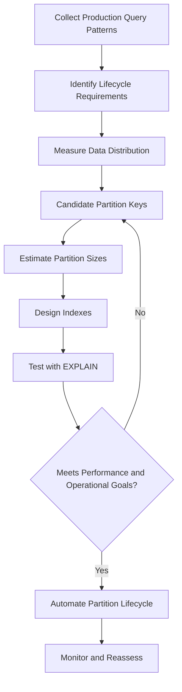

# 08- Partition Keys

## Overview

A partition key is the column or expression a database uses to determine which partition should contain a row.

Partition-key selection is one of the most important decisions in table partitioning because it directly affects:

- Partition pruning.
- Query performance.
- Data distribution.
- Partition size.
- Retention and archival workflows.
- Write distribution.
- Index size.
- Operational complexity.

A good partition key aligns the physical organization of data with the application's dominant access patterns.

For example, an event table commonly uses:

```text
created_at → RANGE partitioning
```

because most queries and lifecycle operations are time-oriented.

A multi-tenant workload may additionally use:

```text
tenant_id → HASH subpartitioning
```

when data distribution across tenants is important.

Partitioning should therefore be designed from **workload characteristics**, not simply from whichever column appears most frequently in the schema.

## What a Partition Key Is

A partition key is the value used by the partitioning mechanism to determine the target partition.

For range partitioning:

```sql
PARTITION BY RANGE (created_at)
```

the database evaluates `created_at` against partition boundaries.

For list partitioning:

```sql
PARTITION BY LIST (region)
```

the database evaluates the discrete value of `region`.

For hash partitioning:

```sql
PARTITION BY HASH (tenant_id)
```

the database hashes `tenant_id` and maps the result to a partition.

Conceptually:

```text
                 INSERT
                    │
                    ▼
             Partitioned Table
                    │
             Evaluate Key
                    │
       ┌────────────┼────────────┐
       ▼            ▼            ▼
     Range         List         Hash
       │            │            │
       ▼            ▼            ▼
   Partition    Partition    Partition
```

The partition key is therefore part of the table's physical data-layout strategy.

## Why Partition Keys Matter

Partitioning is useful only when the chosen key creates boundaries that are useful to the workload.

Suppose an events table contains:

```text
5 billion rows
20 TB storage
3 years of history
```

If most queries look like:

```sql
WHERE created_at >= $1
  AND created_at < $2
```

then `created_at` is a strong partition-key candidate.

The database can potentially eliminate partitions outside the requested time range.

If instead the table is partitioned by an unrelated column:

```sql
PARTITION BY HASH (event_type)
```

a time-based query may still need to inspect many partitions.

The physical layout and query workload are misaligned.

## Properties of a Good Partition Key

A strong partition key usually has several useful properties.

| Property | Why It Matters |
|---|---|
| Frequently used in filters | Enables partition pruning |
| Predictable distribution | Prevents severe partition skew |
| Stable value | Avoids routing and lifecycle complications |
| Appropriate cardinality | Produces useful partition boundaries |
| Supports lifecycle operations | Simplifies retention and archival |
| Matches workload | Aligns storage with access patterns |
| Scales with data growth | Prevents future partition imbalance |

No single column needs to satisfy every property.

The correct choice depends on the partitioning strategy.

## Partition Key and Query Pruning

The strongest performance benefit of partitioning usually comes from **partition pruning**.

Consider:

```sql
CREATE TABLE orders (
    id BIGINT NOT NULL,
    customer_id BIGINT NOT NULL,
    created_at TIMESTAMPTZ NOT NULL,
    total_amount NUMERIC(12, 2) NOT NULL
) PARTITION BY RANGE (created_at);
```

Partitions:

```text
orders_2026_01
orders_2026_02
orders_2026_03
```

A query such as:

```sql
SELECT id, total_amount
FROM orders
WHERE created_at >= '2026-02-01'
  AND created_at < '2026-03-01';
```

gives the optimizer information that can eliminate unrelated partitions.

Conceptually:

```text
Query
 │
 │ created_at = February
 ▼
Partition pruning
 │
 ├── January  ✗
 ├── February ✓
 └── March    ✗
       │
       ▼
     Scan
```

This is why query predicates should be evaluated when selecting a partition key.

## Partition Key vs Index Key

Partition keys and index keys solve different problems.

### Partition Key

Determines **which partition contains the row**.

```sql
PARTITION BY RANGE (created_at)
```

### Index Key

Determines **how rows are organized within an index**.

```sql
CREATE INDEX orders_customer_created_idx
ON orders (customer_id, created_at);
```

A partition key does not eliminate the need for indexes.

A common production design is:

```text
Partition key:
created_at

Index:
(customer_id, created_at)
```

This allows:

```text
created_at
    ↓
partition pruning
    ↓
customer_id + created_at index
    ↓
small row set
```

Partitioning reduces the amount of data that needs to be considered.

Indexes optimize access within the selected partitions.

## Choosing a Range Partition Key

Range partitioning is appropriate when values have a meaningful ordering.

Common candidates include:

- `created_at`
- `event_time`
- `order_date`
- `transaction_date`
- `sequence_number`
- Geographic or numeric ranges

Time is the most common production use case.

Example:

```sql
CREATE TABLE audit_logs (
    id BIGINT NOT NULL,
    tenant_id BIGINT NOT NULL,
    action TEXT NOT NULL,
    created_at TIMESTAMPTZ NOT NULL
) PARTITION BY RANGE (created_at);
```

Monthly partitions:

```sql
CREATE TABLE audit_logs_2026_01
PARTITION OF audit_logs
FOR VALUES FROM ('2026-01-01') TO ('2026-02-01');

CREATE TABLE audit_logs_2026_02
PARTITION OF audit_logs
FOR VALUES FROM ('2026-02-01') TO ('2026-03-01');
```

This works well when queries and retention policies are time-based.

## Choosing a Hash Partition Key

Hash partitioning is useful when the primary requirement is even distribution.

Common candidates include:

- `tenant_id`
- `customer_id`
- `account_id`
- `device_id`
- `user_id`

Example:

```sql
CREATE TABLE tenant_events (
    id BIGINT NOT NULL,
    tenant_id BIGINT NOT NULL,
    event_type TEXT NOT NULL,
    created_at TIMESTAMPTZ NOT NULL
) PARTITION BY HASH (tenant_id);
```

Create four partitions:

```sql
CREATE TABLE tenant_events_p0
PARTITION OF tenant_events
FOR VALUES WITH (MODULUS 4, REMAINDER 0);

CREATE TABLE tenant_events_p1
PARTITION OF tenant_events
FOR VALUES WITH (MODULUS 4, REMAINDER 1);

CREATE TABLE tenant_events_p2
PARTITION OF tenant_events
FOR VALUES WITH (MODULUS 4, REMAINDER 2);

CREATE TABLE tenant_events_p3
PARTITION OF tenant_events
FOR VALUES WITH (MODULUS 4, REMAINDER 3);
```

The database determines the target partition from the hash of `tenant_id`.

## Choosing a List Partition Key

List partitioning is appropriate when values represent explicit business categories.

For example:

```sql
CREATE TABLE customer_orders (
    id BIGINT NOT NULL,
    customer_id BIGINT NOT NULL,
    region TEXT NOT NULL,
    created_at TIMESTAMPTZ NOT NULL
) PARTITION BY LIST (region);
```

Partitions might represent:

```text
IN
US
EU
APAC
```

This is useful when each category has meaningful operational or business boundaries.

It is generally not appropriate for columns with thousands or millions of distinct values.

## Cardinality Matters

Cardinality describes how many distinct values a column contains.

The partition key's useful cardinality depends on the partitioning strategy.

### Very Low Cardinality

Example:

```text
status = pending | completed | failed
```

Only three values may exist.

Hash or list partitioning may create little useful separation.

### Very High Cardinality

Example:

```text
request_id
```

Millions or billions of unique values make direct list partitioning impractical.

### Moderate or Structured Cardinality

Example:

```text
created_at
```

can naturally be grouped into:

```text
day
month
quarter
year
```

This is often well suited to range partitioning.

## Partition Key Selectivity Is Not the Same as Index Selectivity

A common misconception is:

> "The most selective column should be the partition key."

That is not generally correct.

For an index, high selectivity can make an index lookup highly effective.

For partitioning, the goal is to create **useful physical boundaries**.

For example:

```text
created_at
```

may not be highly selective for a single query, but it can still be an excellent partition key because it enables:

- Time-based pruning.
- Retention.
- Archival.
- Smaller partitions.
- Operational isolation.

Partition-key selection is therefore about **workload alignment**, not simply selectivity.

## Partition Key and Data Distribution

A good partition key should avoid severe data skew when distribution matters.

Consider hash partitioning by:

```text
tenant_id
```

with four partitions.

If tenant traffic is:

```text
Tenant A → 70%
Tenant B → 10%
Tenant C → 5%
Other    → 15%
```

hashing may still leave one or more partitions disproportionately large depending on how tenant IDs map to partitions.

Hashing distributes keys, not individual rows uniformly when the key itself is skewed.

This distinction is especially important in multi-tenant systems.

## Hot Keys

A hot key is a partition-key value that receives disproportionate traffic or data.

For example:

```text
tenant_id = 42
```

may represent a very large enterprise customer.

With:

```sql
PARTITION BY HASH (tenant_id)
```

all rows for tenant 42 map to the same hash partition.

The partition can become:

```text
Partition P2
├── normal tenants
└── tenant 42 → extremely high volume
```

Partitioning does not automatically solve hot-key problems.

Possible solutions include:

- Higher-level range partitioning.
- Hashing by a more granular key.
- Composite partitioning.
- Application-level workload isolation.
- Sharding for sufficiently large systems.

The right solution depends on the actual bottleneck.

## Time-Based Partition Keys

Time-based partitioning is one of the most common production patterns.

A typical event table:

```text
events
├── 2026-01
├── 2026-02
├── 2026-03
└── 2026-04
```

The key:

```sql
created_at
```

provides several benefits.

### Query Pruning

Queries with time predicates can scan fewer partitions.

### Retention

Old partitions can be detached, archived, or dropped.

### Operational Isolation

Indexes and maintenance operations are scoped to smaller data sets.

### Predictable Growth

New partitions can be created as time progresses.

## Time Zone Considerations

Timestamp partition keys require careful handling.

Prefer a consistent representation such as:

```sql
created_at TIMESTAMPTZ NOT NULL
```

when using PostgreSQL for globally distributed applications.

Queries should use explicit time boundaries:

```sql
WHERE created_at >= '2026-09-01T00:00:00Z'
  AND created_at < '2026-10-01T00:00:00Z'
```

Avoid ambiguous local-time boundaries in partition definitions and application queries.

Time-zone mistakes can cause:

- Rows routed unexpectedly.
- Incorrect query results.
- Partition-pruning failures.
- Retention bugs.

## Functions on Partition Keys

Query expressions can affect the optimizer's ability to reason about partition boundaries.

Prefer:

```sql
WHERE created_at >= '2026-09-01'
  AND created_at < '2026-10-01'
```

over unnecessarily transforming the partition key:

```sql
WHERE DATE(created_at) = '2026-09-01'
```

The first form directly expresses a range over the partition key.

The second applies a function to the column and may make optimization less straightforward depending on the database and query.

For production workloads, verify behavior with `EXPLAIN`.

## Partition Key and Application Queries

Applications should expose the partition key when it naturally belongs to the query.

For example, an API:

```http
GET /events?from=2026-09-01&to=2026-09-02
```

naturally provides a time range.

The backend can translate this into:

```sql
SELECT id, event_type, created_at
FROM events
WHERE tenant_id = $1
  AND created_at >= $2
  AND created_at < $3
ORDER BY created_at DESC
LIMIT $4;
```

This is preferable to making the application aware of physical partition names.

The application should know the **logical filtering model**, not the physical database topology.

## Partition Key in Django

Django models should generally represent the logical table:

```python
class Event(models.Model):
    tenant_id = models.BigIntegerField()
    event_type = models.CharField(max_length=100)
    created_at = models.DateTimeField()
    payload = models.JSONField()
```

Application queries should include natural partition predicates:

```python
events = (
    Event.objects
    .filter(
        tenant_id=tenant_id,
        created_at__gte=start_time,
        created_at__lt=end_time,
    )
    .order_by("-created_at")
)
```

The ORM should not require developers to select:

```text
events_2026_09
```

manually.

Partition management belongs in the database and deployment layer.

## Partition Key in FastAPI

A FastAPI endpoint can accept query boundaries:

```python
from datetime import datetime

from fastapi import FastAPI, Query

app = FastAPI()


@app.get("/events")
def list_events(
    tenant_id: int,
    start: datetime = Query(...),
    end: datetime = Query(...),
):
    ...
```

The data-access layer can then issue a parameterized query using both:

```text
tenant_id
created_at
```

This makes partition-aware access a consequence of the application's domain query rather than an explicit partition-routing mechanism.

## Composite Partition Keys

Some database systems allow multiple columns to participate in a partitioning expression.

For example:

```sql
PARTITION BY HASH (tenant_id, account_id)
```

This is different from hierarchical partitioning:

```text
RANGE(created_at)
    └── HASH(tenant_id)
```

The first uses one partitioning operation over multiple values.

The second uses multiple levels.

Choose based on the physical and operational behavior required.

## Composite Partitioning and Partition Keys

A common production architecture is:

```text
created_at
    │
    ▼
RANGE partition
    │
    ▼
tenant_id
    │
    ▼
HASH subpartition
```

This allows each key to serve a different purpose.

| Key | Purpose |
|---|---|
| `created_at` | Time pruning and lifecycle |
| `tenant_id` | Distribution within time ranges |

A query containing both predicates can potentially benefit from both levels:

```sql
WHERE tenant_id = $1
  AND created_at >= $2
  AND created_at < $3
```

This pattern is particularly useful for large SaaS event and audit-log systems.

## Partition Key and Retention

If data expires according to a predictable lifecycle, the partition key should often reflect that lifecycle.

For example:

```text
Retention = 12 months
Partition key = created_at
```

allows operations such as:

```text
2025-09 → expire
2025-10 → retain
...
2026-09 → active
```

Partition-level lifecycle operations can be substantially more efficient than:

```sql
DELETE FROM events
WHERE created_at < $1;
```

over billions of rows.

This is one of the strongest reasons to choose a time-based partition key even when other columns are heavily queried.

## Partition Key and Foreign Keys

Foreign keys introduce additional design considerations.

For example:

```text
orders
  └── customer_id
```

does not mean `customer_id` should automatically become the partition key.

Partitioning should be driven by workload and lifecycle requirements.

If orders are primarily queried by:

```text
customer_id + created_at
```

a possible design is:

```text
Partition key → created_at
Index → (customer_id, created_at)
```

This often provides a better separation of responsibilities than partitioning directly by `customer_id`.

## Partition Key and Primary Keys

Partitioning can affect primary-key and uniqueness design.

A primary key such as:

```sql
PRIMARY KEY (id)
```

may have database-specific restrictions when used with partitioned tables.

Some systems require partition-key columns to participate in unique constraints defined on the partitioned table.

For example:

```sql
PRIMARY KEY (id, created_at)
```

may be structurally appropriate in some designs, but changing the key model has application-level implications.

Do not alter primary keys solely to satisfy partitioning without evaluating:

- Foreign keys.
- ORM behavior.
- API identifiers.
- Index size.
- Uniqueness semantics.
- Existing application assumptions.

## Partition Key and Ordering

Partitioning does not guarantee row ordering.

If the application requires:

```text
newest events first
```

the query should explicitly request it:

```sql
SELECT id, event_type, created_at
FROM events
WHERE tenant_id = $1
  AND created_at >= $2
  AND created_at < $3
ORDER BY created_at DESC
LIMIT 100;
```

Do not rely on partition order or physical row layout.

Partitioning controls data placement, not result ordering.

## Partition Key and Pagination

A good partition key can make time-based pagination more efficient.

For example:

```sql
SELECT id, created_at, event_type
FROM events
WHERE tenant_id = $1
  AND created_at < $2
ORDER BY created_at DESC, id DESC
LIMIT 100;
```

Here:

```text
tenant_id
created_at
```

provide both partition and index opportunities.

A suitable index might be:

```sql
CREATE INDEX events_tenant_created_id_idx
ON events (tenant_id, created_at DESC, id DESC);
```

This is generally preferable to deep offset pagination across a large partitioned dataset.

## Partition Key and Partition Size

Partition keys determine how data is physically grouped.

For range partitioning:

```text
Daily:
365 partitions/year

Monthly:
12 partitions/year

Yearly:
1 partition/year
```

There is no universally correct partition interval.

Choose based on:

- Rows per partition.
- Storage per partition.
- Query patterns.
- Retention granularity.
- Index size.
- Maintenance requirements.
- Planning overhead.

A partition that is too large loses much of the physical-management benefit.

A partition that is too small creates excessive metadata and operational complexity.

## Partition Interval Selection

| Interval | Advantages | Limitations |
|---|---|---|
| Hourly | Very fine pruning and lifecycle control | Extremely high partition count |
| Daily | Good for high-volume event data | More objects and automation |
| Monthly | Good general-purpose balance | Less granular lifecycle |
| Quarterly | Low management overhead | Larger partitions |
| Yearly | Very simple | Often too large for high-volume tables |

For many production workloads, monthly partitions are a reasonable starting point, but the correct choice must be based on measured data volume and workload behavior.

## Monitoring Partition-Key Health

Monitor whether the selected key continues to behave as expected.

Useful metrics include:

- Rows per partition.
- Storage per partition.
- Partition growth rate.
- Query latency by partition range.
- Partition pruning effectiveness.
- Largest-to-average partition size.
- Hot partition traffic.
- Index size per partition.
- Vacuum and maintenance duration.

A useful skew metric is:

```text
Skew ratio =
largest partition size / average partition size
```

Large persistent skew indicates that the chosen key or partitioning strategy may no longer match the workload.

## Verifying the Partition Key

Do not validate a partition-key decision using table size alone.

Use representative production-like queries:

```sql
EXPLAIN (ANALYZE, BUFFERS)
SELECT id, event_type
FROM events
WHERE tenant_id = 42
  AND created_at >= '2026-09-01'
  AND created_at < '2026-10-01';
```

Evaluate:

```text
Planning Time
Execution Time
Partitions scanned
Rows removed
Index usage
Buffer reads
Actual vs estimated rows
```

The most important question is:

> Does the partition key cause the database to eliminate data that the workload does not need?

## Common Partition-Key Mistakes

### Choosing the Most Frequently Queried Column

The most frequently filtered column is not automatically the best partition key.

A column may be heavily queried but provide poor physical boundaries.

### Choosing a Highly Unique Column for List Partitioning

Using:

```text
request_id
```

as a list partition key can create an impractical number of partitions.

### Ignoring Retention Requirements

A system may partition by tenant because queries filter by tenant, then later discover that deleting old data requires touching every tenant partition.

If retention is important, lifecycle requirements should influence the first partitioning dimension.

### Ignoring Query Patterns

Partitioning by:

```text
region
```

is not useful for a workload that almost always filters by:

```text
created_at
```

unless region has an independent operational purpose.

### Assuming Hashing Solves All Skew

Hashing spreads distinct keys across partitions, but one dominant key can remain hot.

### Using Too Many Partitions

A highly granular partition key can create:

```text
thousands of partitions
```

with corresponding:

- Indexes.
- Metadata.
- Planning overhead.
- Monitoring requirements.
- Maintenance operations.

### Hard-Coding Partition Names

Avoid:

```python
table = f"events_{year}_{month}"
```

in application code.

This tightly couples application behavior to physical schema layout.

### Applying Functions to the Partition Key

Avoid unnecessarily hiding partition boundaries behind expressions:

```sql
WHERE DATE(created_at) = $1
```

Prefer direct range predicates where practical:

```sql
WHERE created_at >= $1
  AND created_at < $2
```

Then verify pruning with `EXPLAIN`.

### Assuming Partitioning Replaces Indexes

Partition pruning and indexing solve different problems.

A well-partitioned table may still require carefully designed indexes.

## Production Design Process

Use a workload-first process.



The process should be iterative.

Partitioning is a physical design decision and should be validated against realistic data volumes.

## Partition-Key Decision Matrix

| Requirement | Candidate Key |
|---|---|
| Time-based queries | `created_at` |
| Time-based retention | `created_at` |
| Multi-tenant distribution | `tenant_id` |
| Customer isolation | `customer_id` |
| Explicit business categories | `region`, `status`, etc. |
| Even key distribution | `tenant_id`, `account_id`, etc. |
| High-volume event storage | Usually time-based |
| Time + tenant workload | `created_at` + `tenant_id` |
| Geographic lifecycle | `region` + time |
| Large-scale telemetry | `event_time` + device/tenant |

These are starting points, not universal rules.

## Production Checklist

- [ ] Identify the dominant query predicates.
- [ ] Identify retention and archival requirements.
- [ ] Measure current and projected data volume.
- [ ] Measure key distribution and potential skew.
- [ ] Determine appropriate partitioning strategy.
- [ ] Estimate rows and storage per partition.
- [ ] Check expected partition count over several years.
- [ ] Validate time-zone semantics for timestamp keys.
- [ ] Design indexes independently from partitioning.
- [ ] Test partition pruning with `EXPLAIN`.
- [ ] Test queries that omit the partition key.
- [ ] Test high-volume or hot-key scenarios.
- [ ] Automate future partition creation where required.
- [ ] Automate retention and archival workflows.
- [ ] Monitor partition growth and skew.
- [ ] Keep application code independent of physical partition names.
- [ ] Test migrations against production-scale datasets.
- [ ] Reassess the partition key as workload characteristics evolve.

## Interview Perspective

A strong senior-level answer should focus on **workload alignment** rather than simply saying that a partition key determines where rows are stored.

A concise answer is:

> **A partition key is the column or expression used to route rows into partitions. The right key is selected based on query pruning, data distribution, lifecycle requirements, and operational characteristics. Time-based keys such as `created_at` are common because they support both range pruning and retention, while hash keys such as `tenant_id` are useful for distributing data. Partition-key selection should be validated with realistic execution plans and production workload characteristics.**

Common interview traps include:

- "The highest-cardinality column is always the best partition key."
- "The most frequently queried column should always be the partition key."
- "Hash partitioning guarantees equal-sized partitions."
- "Partitioning replaces indexes."
- "Partitioning by tenant automatically provides tenant isolation."
- "More partitions always mean better performance."
- "Partitioning is equivalent to sharding."
- "Partition order does not matter."
- "Partitioning automatically solves hot keys."

The senior-level answer is to explain the trade-offs and connect the key to actual workload behavior.

## Key Takeaways

- **Choose partition keys from query patterns, lifecycle requirements, and data distribution—not simply from cardinality or query frequency.**
- **Time-based keys are especially valuable when partition pruning and retention must work together.**
- **Hash keys can distribute distinct values, but they do not automatically eliminate skew or hot-key problems.**
- **Partition keys and indexes solve different problems; effective production designs commonly use both.**
- **Validate partition-key choices with realistic data, `EXPLAIN`, partition-pruning behavior, and long-term operational projections.**