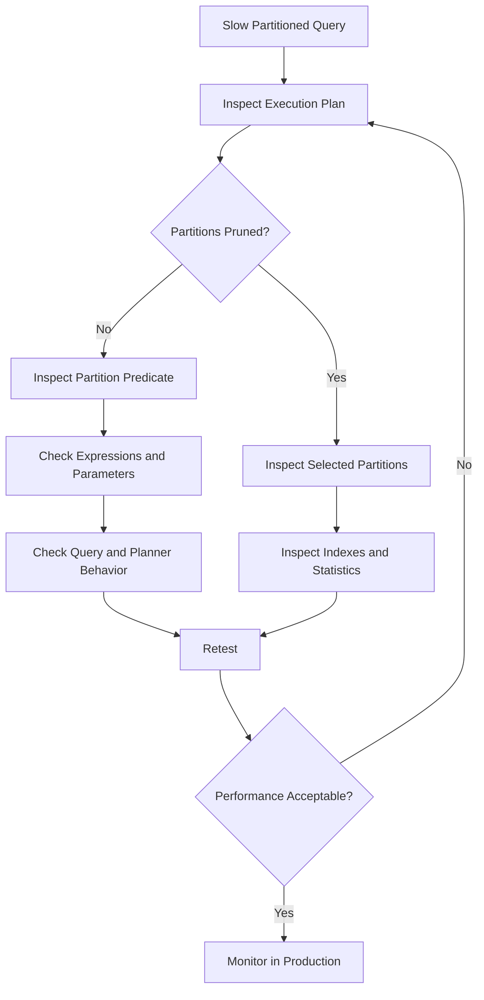

# 09- Partition Pruning

## Overview

Partition pruning is the database optimizer's ability to eliminate partitions that cannot contain rows matching a query.

It is one of the primary performance benefits of table partitioning. Partitioning divides a large logical table into smaller physical partitions, while pruning ensures that a query does not unnecessarily scan all of them.

For example, consider a table partitioned by month:

```text
events
├── events_2026_01
├── events_2026_02
├── events_2026_03
├── events_2026_04
├── ...
└── events_2026_12
```

A query restricted to March should ideally access only:

```text
events_2026_03
```

instead of scanning all twelve partitions.

Partition pruning therefore connects three design decisions:

```text
Partition key
      │
      ▼
Partition boundaries
      │
      ▼
Query predicates
      │
      ▼
Partition pruning
      │
      ▼
Less data scanned
```

Partitioning without effective pruning can add operational complexity without delivering the expected query-performance benefits.

## What Partition Pruning Is

Partition pruning is the process of determining which partitions are relevant to a query and excluding the others from execution.

Suppose a PostgreSQL table is partitioned by:

```sql
PARTITION BY RANGE (created_at)
```

with partitions:

```text
January  → [2026-01-01, 2026-02-01)
February → [2026-02-01, 2026-03-01)
March    → [2026-03-01, 2026-04-01)
```

A query such as:

```sql
SELECT id, event_type
FROM events
WHERE created_at >= '2026-03-01'
  AND created_at < '2026-04-01';
```

provides enough information for the optimizer to determine that only the March partition can contain matching rows.

Conceptually:

```text
Query predicate
created_at >= March 1
created_at <  April 1
          │
          ▼
Partition boundary analysis
          │
    ┌─────┼─────┐
    ▼     ▼     ▼
 January Feb   March
   ✗      ✗      ✓
                 │
                 ▼
             Execute scan
```

## Why Partition Pruning Matters

Without pruning, partitioning can behave like a collection of tables that the database still needs to inspect.

With pruning:

```text
10 TB logical table
        │
        ▼
100 partitions
        │
        ▼
Query matches 2 partitions
        │
        ▼
Only relevant partitions are scanned
```

This can reduce:

- Disk I/O.
- Buffer reads.
- CPU consumption.
- Index pages visited.
- Rows examined.
- Query execution time.
- Memory pressure.
- Infrastructure cost.

The improvement depends heavily on the workload. Partition pruning is most valuable when queries consistently restrict the partition key enough to eliminate a significant portion of the table.

## Partition Pruning vs Indexing

Partition pruning and indexes operate at different levels.

| Mechanism | Optimization Level | Primary Purpose |
|---|---|---|
| Partition pruning | Partition/table level | Eliminate irrelevant partitions |
| Index scan | Within selected partitions | Locate matching rows efficiently |
| Table scan | Within selected partitions | Read rows sequentially |
| Covering/index-only access | Within selected partitions | Reduce heap/table access |

For example:

```sql
SELECT id, total_amount
FROM orders
WHERE customer_id = $1
  AND created_at >= $2
  AND created_at < $3;
```

A useful execution strategy may be:

```text
created_at predicate
        │
        ▼
Partition pruning
        │
        ▼
Relevant partitions
        │
        ▼
(customer_id, created_at) index
        │
        ▼
Matching rows
```

Partition pruning does not make an index unnecessary.

Likewise, a highly selective index does not eliminate the value of pruning when a table contains many irrelevant partitions.

## Static Partition Pruning

Static pruning occurs when the optimizer can determine the relevant partitions from query information available during planning.

For example:

```sql
SELECT *
FROM events
WHERE created_at >= '2026-03-01'
  AND created_at < '2026-04-01';
```

The boundaries are constants known during planning.

The optimizer can determine:

```text
January → exclude
February → exclude
March → scan
April → exclude
```

This is generally the easiest pruning case for the database.

## Runtime Partition Pruning

Runtime pruning occurs when the relevant partition cannot be fully determined until execution.

This is common with prepared statements, parameters, joins, and execution-time values.

For example:

```sql
PREPARE events_by_range (timestamptz, timestamptz) AS
SELECT id, event_type
FROM events
WHERE created_at >= $1
  AND created_at < $2;
```

The actual parameter values are supplied later.

The database can use those values to determine which partitions are relevant during execution.

Conceptually:

```text
Prepare statement
      │
      ▼
Execution starts
      │
      ▼
Parameter values available
      │
      ▼
Runtime pruning
      │
      ▼
Relevant partitions
```

Runtime pruning is particularly important for application workloads because Django, SQLAlchemy, async drivers, and other database clients commonly use parameterized queries.

## Partition Pruning and Parameterized Queries

Parameterized queries are desirable for security and query-plan reuse.

For example:

```sql
SELECT id, event_type
FROM events
WHERE created_at >= $1
  AND created_at < $2;
```

Do not replace parameters with string interpolation merely to attempt to improve pruning:

```python
# Do not construct SQL this way.
query = f"""
SELECT id, event_type
FROM events
WHERE created_at >= '{start}'
  AND created_at < '{end}'
"""
```

Parameterized SQL provides:

- SQL injection protection.
- Better separation of data and SQL.
- Better driver integration.
- More predictable application behavior.

If pruning behavior matters, verify the actual execution plan rather than assuming that parameterization prevents pruning.

## Partition Pruning with Range Partitioning

Range partitioning is the most natural pruning model for ordered predicates.

Example:

```sql
CREATE TABLE orders (
    id BIGINT NOT NULL,
    customer_id BIGINT NOT NULL,
    created_at TIMESTAMPTZ NOT NULL,
    total_amount NUMERIC(12, 2) NOT NULL
) PARTITION BY RANGE (created_at);
```

Create monthly partitions:

```sql
CREATE TABLE orders_2026_01
PARTITION OF orders
FOR VALUES FROM ('2026-01-01') TO ('2026-02-01');

CREATE TABLE orders_2026_02
PARTITION OF orders
FOR VALUES FROM ('2026-02-01') TO ('2026-03-01');

CREATE TABLE orders_2026_03
PARTITION OF orders
FOR VALUES FROM ('2026-03-01') TO ('2026-04-01');
```

A query over March:

```sql
SELECT id, customer_id, total_amount
FROM orders
WHERE created_at >= '2026-03-01'
  AND created_at < '2026-04-01';
```

can prune January and February.

## Partition Pruning with List Partitioning

List partitioning can prune partitions when the query constrains the list partition key.

Example:

```sql
CREATE TABLE orders_by_region (
    id BIGINT NOT NULL,
    region TEXT NOT NULL,
    created_at TIMESTAMPTZ NOT NULL
) PARTITION BY LIST (region);
```

Partitions:

```sql
CREATE TABLE orders_india
PARTITION OF orders_by_region
FOR VALUES IN ('IN');

CREATE TABLE orders_us
PARTITION OF orders_by_region
FOR VALUES IN ('US');

CREATE TABLE orders_eu
PARTITION OF orders_by_region
FOR VALUES IN ('EU');
```

Query:

```sql
SELECT id, created_at
FROM orders_by_region
WHERE region = 'IN';
```

can eliminate the US and EU partitions.

List partitioning therefore works well when queries naturally constrain a small set of explicit categories.

## Partition Pruning with Hash Partitioning

Hash partitioning can also use the partition key to limit execution, but the pruning behavior and benefits differ from range partitioning.

Example:

```sql
CREATE TABLE tenant_events (
    id BIGINT NOT NULL,
    tenant_id BIGINT NOT NULL,
    event_type TEXT NOT NULL
) PARTITION BY HASH (tenant_id);
```

Partitions:

```sql
CREATE TABLE tenant_events_p0
PARTITION OF tenant_events
FOR VALUES WITH (MODULUS 4, REMAINDER 0);

CREATE TABLE tenant_events_p1
PARTITION OF tenant_events
FOR VALUES WITH (MODULUS 4, REMAINDER 1);

CREATE TABLE tenant_events_p2
PARTITION OF tenant_events
FOR VALUES WITH (MODULUS 4, REMAINDER 2);

CREATE TABLE tenant_events_p3
PARTITION OF tenant_events
FOR VALUES WITH (MODULUS 4, REMAINDER 3);
```

A predicate such as:

```sql
WHERE tenant_id = 42
```

provides a concrete hash-key value that can allow the database to identify the relevant partition.

However, a query such as:

```sql
WHERE tenant_id > 42
```

does not correspond to one contiguous hash range.

Hash partitioning is therefore generally more useful for equality-based access patterns than range-based access patterns.

## The Partition Key Must Appear in the Query

The strongest pruning opportunity exists when the query constrains the partition key.

For example:

```sql
PARTITION BY RANGE (created_at)
```

and:

```sql
WHERE created_at >= $1
  AND created_at < $2
```

is naturally pruning-friendly.

A query that only filters:

```sql
WHERE customer_id = $1
```

does not tell the database which `created_at` partition contains the rows.

The optimizer may therefore need to consider many or all partitions.

This is a critical design constraint:

> A partitioned table performs best when important queries provide useful predicates on the partition key.

## Queries That Cannot Prune Effectively

Suppose the table is partitioned by:

```sql
created_at
```

A query such as:

```sql
SELECT *
FROM events
WHERE event_type = 'payment';
```

does not constrain `created_at`.

The database cannot infer which time partition contains payment events.

Conceptually:

```text
event_type = 'payment'
        │
        ▼
No created_at boundary
        │
        ▼
Potentially inspect many partitions
```

An index on `event_type` may still make the query efficient within each partition, but partition pruning itself provides little benefit.

## Functions on Partition Keys

Expressions involving the partition key require careful attention.

For example:

```sql
WHERE DATE(created_at) = '2026-03-15'
```

is less direct than:

```sql
WHERE created_at >= '2026-03-15T00:00:00Z'
  AND created_at < '2026-03-16T00:00:00Z'
```

The second predicate explicitly describes a range on the partition key.

This makes the intended partition boundaries obvious to the optimizer and avoids unnecessary transformation of the column.

For production systems, do not assume a function prevents pruning in every database or version. Verify the actual plan.

## Correct Range Predicates

Prefer half-open time ranges:

```sql
WHERE created_at >= $1
  AND created_at < $2
```

instead of:

```sql
WHERE created_at BETWEEN $1 AND $2
```

Half-open intervals map naturally to partition boundaries:

```text
[2026-03-01, 2026-04-01)
```

They also avoid ambiguity around timestamps at the upper boundary.

This is particularly important when adjacent partitions use:

```text
FROM lower_bound TO upper_bound
```

because the upper boundary belongs to the next range.

## Partition Pruning and `EXPLAIN`

Never assume pruning is occurring.

Verify it using the database's execution-plan tools.

For PostgreSQL:

```sql
EXPLAIN (ANALYZE, BUFFERS)
SELECT id, event_type
FROM events
WHERE created_at >= '2026-03-01'
  AND created_at < '2026-04-01';
```

Look for evidence that only relevant partitions were accessed.

Depending on PostgreSQL version and plan shape, the output may contain:

```text
Append
  -> Seq Scan on events_2026_03
```

rather than scans of every partition.

The exact plan depends on:

- PostgreSQL version.
- Statistics.
- Cost settings.
- Query shape.
- Index availability.
- Partition count.
- Parameterization.
- Join structure.

## Example Execution-Plan Reasoning

Suppose a table has:

```text
120 monthly partitions
```

and a query requests one month.

A good plan should resemble:

```text
Append
└── Index Scan on events_2026_06
```

A suspicious plan might resemble:

```text
Append
├── Index Scan on events_2026_01
├── Index Scan on events_2026_02
├── Index Scan on events_2026_03
├── ...
└── Index Scan on events_2026_06
```

Even if each individual index scan is fast, touching dozens or hundreds of partitions can introduce:

- Planning overhead.
- Executor overhead.
- Additional metadata processing.
- More buffer activity.
- More index operations.

Partition pruning should therefore be evaluated at the whole-query level.

## Planning Time Matters

Partitioning does not only affect execution time.

With a very high partition count, the optimizer may need to reason about many possible child relations.

For example:

```text
12 partitions
```

and:

```text
5,000 partitions
```

can have dramatically different planning characteristics.

A query that scans one partition may still experience meaningful planning overhead if the database must inspect a large partition hierarchy.

This is why:

> More partitions does not automatically mean better performance.

Partition count should be treated as an operational and query-planning constraint.

## Partition Pruning and Joins

Pruning becomes more complex when the partition key is obtained from another relation.

Example:

```sql
SELECT e.id
FROM events e
JOIN tenants t
  ON t.id = e.tenant_id
WHERE t.id = $1;
```

If the table is partitioned by:

```sql
tenant_id
```

the optimizer may be able to exploit the join condition and available restrictions, depending on the database and plan.

However, pruning behavior is query-plan dependent.

For important production queries:

```sql
EXPLAIN (ANALYZE, BUFFERS)
...
```

should be the source of truth.

Do not infer pruning solely from the SQL text.

## Partition Pruning and OR Conditions

Complex predicates can make pruning less straightforward.

For example:

```sql
WHERE created_at >= $1
   OR customer_id = $2
```

The second condition does not constrain the time partition.

The database may need to consider a much larger portion of the partition hierarchy.

When query performance matters, evaluate complex predicates using actual execution plans rather than relying on simple partition-key heuristics.

## Partition Pruning and `IN`

Equality conditions over a list of partition-key values can provide useful pruning.

For example:

```sql
SELECT *
FROM orders_by_region
WHERE region IN ('IN', 'EU');
```

If the table is list-partitioned by `region`, the optimizer can potentially restrict execution to the corresponding partitions.

For hash partitioning:

```sql
WHERE tenant_id IN (10, 42, 91)
```

may allow the optimizer to identify the corresponding hash partitions, although multiple partitions may still be required.

## Partition Pruning in Multi-Tenant Systems

Consider:

```text
RANGE(created_at)
    └── HASH(tenant_id)
```

A query:

```sql
SELECT id, event_type
FROM tenant_events
WHERE tenant_id = $1
  AND created_at >= $2
  AND created_at < $3;
```

provides two dimensions of information:

```text
created_at
    │
    ▼
Select relevant time partition
    │
    ▼
tenant_id
    │
    ▼
Select relevant hash partition
    │
    ▼
Scan data
```

This can be highly effective for large multi-tenant event systems.

However, hierarchical partitioning also increases:

- Number of physical relations.
- Index count.
- Maintenance complexity.
- Migration complexity.
- Monitoring requirements.

Use it only when the workload justifies the additional complexity.

## Partition Pruning in Django

The application does not need to reference partition names.

A Django query such as:

```python
events = (
    Event.objects
    .filter(
        tenant_id=tenant_id,
        created_at__gte=start_time,
        created_at__lt=end_time,
    )
    .order_by("-created_at")
)
```

generates a logical query against the parent table.

The database optimizer determines which partitions should be accessed.

This is preferable to application-level routing such as:

```python
# Avoid coupling application code to physical partitions.
table_name = f"events_{year}_{month}"
```

The physical partition topology should remain a database concern whenever possible.

## Partition Pruning in FastAPI

A FastAPI endpoint can expose natural query boundaries:

```python
from datetime import datetime

from fastapi import FastAPI, Query

app = FastAPI()


@app.get("/events")
def list_events(
    tenant_id: int,
    start: datetime = Query(...),
    end: datetime = Query(...),
):
    # Data-access layer uses tenant_id and the time range.
    ...
```

The API does not need to know that the underlying table is partitioned.

The database receives predicates such as:

```sql
WHERE tenant_id = $1
  AND created_at >= $2
  AND created_at < $3
```

and performs pruning if supported by the execution plan.

## Partition Pruning and Prepared Statements

Prepared statements introduce an important production consideration.

Applications frequently execute:

```sql
SELECT ...
FROM events
WHERE created_at >= $1
  AND created_at < $2;
```

with different values over time.

Depending on the database and execution strategy, the optimizer may use:

- Custom plans.
- Generic plans.
- Runtime pruning.
- Other plan-dependent mechanisms.

Do not assume that a parameterized query behaves exactly like a query containing literal values.

If there is a performance discrepancy between:

```sql
WHERE created_at >= '2026-03-01'
```

and:

```sql
WHERE created_at >= $1
```

investigate the actual prepared-statement plan and database behavior.

## Partition Pruning and Statistics

Statistics influence query planning.

A database needs accurate information about:

- Row counts.
- Value distributions.
- Partition sizes.
- Index selectivity.
- Data changes.

For PostgreSQL, regular `ANALYZE` and autovacuum activity help maintain planner statistics.

A partitioned table with rapidly changing data can suffer from poor plans if statistics are stale.

Operationally:

```text
Data changes
     │
     ▼
Statistics maintenance
     │
     ▼
Better cardinality estimates
     │
     ▼
Better plan selection
     │
     ▼
More predictable performance
```

Partition pruning itself is based primarily on partition boundaries, but statistics influence what the optimizer does after and around pruning.

## Default Partitions

Default partitions deserve special attention.

For example:

```sql
CREATE TABLE events_default
PARTITION OF events DEFAULT;
```

A default partition captures rows that do not match existing partition boundaries.

This can be useful for:

- Safety.
- Preventing failed inserts.
- Handling unexpected values.

However, an incorrectly managed default partition can become a large catch-all partition.

If a query's target range overlaps data that remains in the default partition, the database may need to consider it.

Production systems should monitor:

```text
default partition row count
default partition growth
```

and investigate unexpected rows promptly.

## Missing Future Partitions

Time-based systems must create future partitions before they are needed.

For example:

```text
Current month → events_2026_09
Next month    → events_2026_10
```

If the application starts writing October data before the partition exists, inserts may:

- Fail.
- Fall into a default partition.
- Trigger operational incidents.

Partition lifecycle automation should therefore be treated as production infrastructure.

A common strategy is to provision several future partitions ahead of time:

```text
Current + 3 months
Current + 6 months
```

The exact horizon depends on deployment and operational practices.

## Partition Pruning and Retention

One of the strongest benefits of time-based partitioning is that pruning and lifecycle operations align.

Suppose:

```text
Partition key = created_at
Retention = 12 months
```

A query for recent data naturally prunes old partitions.

Retention operations can also operate at partition granularity:

```text
Old partition
     │
     ├── detach
     ├── archive
     └── drop
```

This is generally preferable to repeatedly executing large row-level deletes when the lifecycle is naturally partition-aligned.

## Partition Pruning and Index Design

A common production pattern is:

```sql
CREATE INDEX events_tenant_created_idx
ON events (tenant_id, created_at DESC);
```

for each partition.

The execution strategy becomes:

```text
Query
 │
 ├── created_at predicate
 │
 ▼
Partition pruning
 │
 ▼
Small number of partitions
 │
 ▼
tenant_id + created_at index
 │
 ▼
Matching rows
```

The best index depends on the actual query shape.

Do not blindly create the same large index on every partition without evaluating:

- Query frequency.
- Index size.
- Write overhead.
- Maintenance cost.
- Index selectivity.
- Whether smaller or specialized indexes are appropriate.

## Measuring Pruning Effectiveness

Track more than total query latency.

Useful measurements include:

| Metric | Why It Matters |
|---|---|
| Planning time | Detects excessive partition overhead |
| Execution time | Measures end-to-end query cost |
| Partitions accessed | Direct evidence of pruning |
| Rows scanned | Shows residual work |
| Buffer hits | Measures memory activity |
| Buffer reads | Measures storage I/O |
| Rows removed by filter | Indicates unnecessary scanning |
| Index usage | Validates within-partition access |
| Partition size | Identifies growth problems |

For PostgreSQL, use:

```sql
EXPLAIN (ANALYZE, BUFFERS)
SELECT ...
```

for representative workloads.

## Monitoring Production Pruning

Partition pruning is primarily a query-plan property, so monitoring should combine database-level and application-level signals.

Monitor:

- Latency percentiles.
- Query execution plans for critical queries.
- Planning time.
- Number of partitions.
- Partition growth.
- Largest partitions.
- Default-partition growth.
- Missing-partition incidents.
- Index size per partition.
- Autovacuum and analyze activity.

For critical queries, periodically inspect plans after:

- Major schema changes.
- Database upgrades.
- Large data growth.
- Index changes.
- Partition-boundary changes.
- Significant workload changes.

## Performance Trade-Offs

| Design | Pruning Potential | Operational Complexity | Typical Use |
|---|---:|---:|---|
| No partitioning | None | Low | Small/moderate tables |
| Range partitioning | High for range predicates | Moderate | Time-series and retention |
| List partitioning | High for category predicates | Moderate | Finite business categories |
| Hash partitioning | Useful for equality predicates | Moderate | Distribution by tenant/account |
| Composite partitioning | Potentially very high | High | Very large workloads with multiple access dimensions |

Partitioning should be introduced when the performance or lifecycle benefits justify its operational cost.

## Common Mistakes

### Assuming Partitioning Automatically Makes Queries Faster

Partitioning provides the physical structure.

Pruning is what eliminates irrelevant partitions.

If important queries cannot constrain the partition key, partitioning may provide little query-performance benefit.

### Forgetting the Partition Key in Application Queries

A query such as:

```sql
WHERE customer_id = $1
```

cannot exploit time-based pruning if `created_at` is the partition key.

Where the business query naturally has a time boundary, include it.

### Applying Functions Unnecessarily

Avoid:

```sql
WHERE DATE(created_at) = $1
```

when a direct range is possible:

```sql
WHERE created_at >= $1
  AND created_at < $2
```

### Assuming an Index Guarantees Pruning

An index can make scans within partitions fast while the database still touches many partitions.

Always distinguish:

```text
partition elimination
```

from:

```text
index lookup
```

### Creating Excessive Partitions

Thousands of tiny partitions can increase planning and operational overhead.

Partition granularity should be justified by:

- Data volume.
- Query patterns.
- Retention requirements.
- Maintenance needs.

### Ignoring Default Partitions

A default partition can silently accumulate unexpected data and undermine the intended partition layout.

Monitor it.

### Ignoring Prepared-Statement Behavior

Application drivers commonly use parameters.

Verify pruning and plan behavior using the actual production query path.

### Hard-Coding Partition Names

Application code should normally query the logical parent table.

Physical partition names should not become part of the API or service contract.

## Production Troubleshooting Workflow

When a partitioned query is unexpectedly slow:

1. Capture the exact production query shape.
2. Run `EXPLAIN (ANALYZE, BUFFERS)`.
3. Determine how many partitions were accessed.
4. Verify whether the partition key is constrained.
5. Check whether expressions obscure the partition boundary.
6. Check prepared-statement behavior.
7. Check partition sizes and data distribution.
8. Inspect indexes within selected partitions.
9. Check statistics freshness.
10. Compare planning time with execution time.
11. Validate behavior with production-scale data.
12. Fix the root cause and re-measure.

A useful mental model is:



## Production Best Practices

- Choose partition keys that important queries naturally constrain.
- Prefer direct predicates over unnecessary expressions on partition keys.
- Use half-open time ranges for time-based partitioning.
- Validate pruning with actual execution plans.
- Keep application code independent of physical partition names.
- Maintain accurate statistics.
- Automate future-partition creation.
- Monitor default partitions.
- Monitor partition count and partition size.
- Avoid excessive partition granularity.
- Design indexes independently from partitioning.
- Test prepared statements using the same database access pattern as production.
- Reassess pruning after major workload or schema changes.
- Use partition-level retention operations when the data lifecycle aligns with partitions.

## Interview Perspective

A strong senior-level explanation should distinguish **partitioning**, **pruning**, and **indexing**.

A concise answer is:

> **Partitioning divides a logical table into physical partitions. Partition pruning is the optimizer's ability to eliminate partitions that cannot satisfy a query predicate. The partition key must align with important query predicates for pruning to provide meaningful benefits. Indexes then optimize access within the partitions that remain. In production, pruning should be verified with execution plans rather than assumed from the schema.**

Important interview traps include:

- "Partitioning automatically improves every query."
- "An index on the partition key is the same as partition pruning."
- "Queries always scan only one partition."
- "Prepared statements prevent partition pruning."
- "More partitions always improve performance."
- "A partitioned table does not need indexes."
- "Partition pruning is purely an application-level optimization."

The senior-level answer focuses on **optimizer behavior, query predicates, execution plans, partition count, parameterization, and operational trade-offs**.

## Key Takeaways

- **Partition pruning eliminates partitions that cannot satisfy a query, making it one of the main performance benefits of partitioning.**
- **Queries should constrain the partition key whenever possible; partitioning does not compensate for workload patterns that cannot exploit pruning.**
- **Partition pruning and indexing are complementary: pruning reduces the number of partitions, while indexes optimize access within selected partitions.**
- **Use `EXPLAIN (ANALYZE, BUFFERS)` and production-like queries to verify actual pruning behavior rather than relying on assumptions.**
- **Excessive partition counts, stale statistics, default partitions, and poorly managed partition lifecycles can turn a well-designed partitioning strategy into an operational liability.**