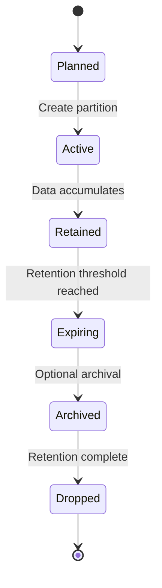
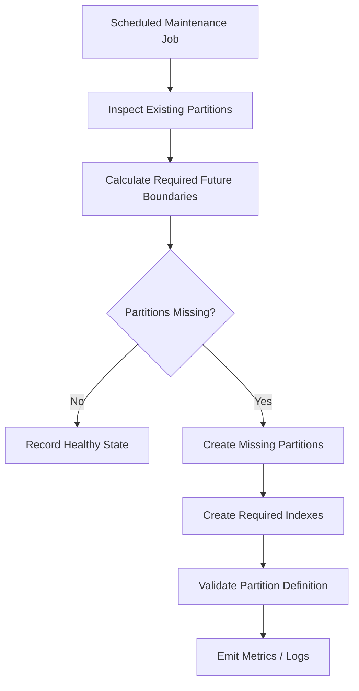
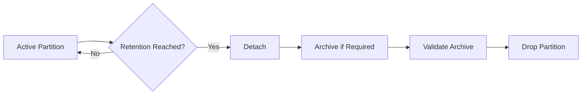
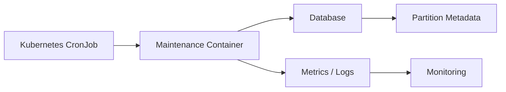

# 10- Partition Maintenance

## Overview

Partition maintenance is the operational work required to keep a partitioned table correct, performant, and manageable over its lifetime.

Partitioning changes the physical structure of a database. Instead of maintaining one large table, the database maintains a parent table plus multiple child partitions. This introduces additional lifecycle responsibilities:

- Creating future partitions.
- Validating partition boundaries.
- Managing indexes and constraints.
- Maintaining statistics.
- Vacuuming and analyzing partitions.
- Detaching or dropping expired partitions.
- Managing default partitions.
- Monitoring partition growth.
- Handling schema changes.
- Backing up and restoring partitioned data.
- Preventing operational drift.

For a time-partitioned table, maintenance is often predictable:

```text
Create future partition
        │
        ▼
Write production data
        │
        ▼
Monitor partition health
        │
        ▼
Retain data for required period
        │
        ▼
Detach/archive expired partition
        │
        ▼
Drop after retention requirements are satisfied
```

The goal is not simply to have partitions. The goal is to operate the partition lifecycle safely while preserving query performance, data integrity, and availability.

## Why Partition Maintenance Matters

Partitioning can reduce query cost and make large-scale data lifecycle operations easier, but every additional partition creates database objects that must be managed.

For example:

```text
1 logical table
    │
    ├── 120 monthly partitions
    ├── 120 sets of indexes
    ├── statistics
    ├── constraints
    └── maintenance activity
```

Without automation, common failures include:

- Inserts failing because a future partition does not exist.
- Data accumulating in a default partition.
- Expired data remaining indefinitely.
- Partition sizes becoming highly unbalanced.
- Autovacuum failing to keep up with write-heavy partitions.
- Schema changes becoming difficult to coordinate.
- Planning overhead increasing as partition count grows.

Partition maintenance should therefore be treated as part of database infrastructure rather than occasional manual administration.

## Partition Lifecycle

A production partition commonly moves through several states:



A mature system defines this lifecycle explicitly.

| Stage | Typical Operation |
|---|---|
| Planned | Determine future boundary |
| Created | Create partition and indexes |
| Active | Accept application writes |
| Maintained | Vacuum, analyze, monitor |
| Expiring | Reach retention boundary |
| Archived | Export or move data if required |
| Detached | Remove from active partition hierarchy |
| Dropped | Permanently delete data |

The exact lifecycle depends on compliance, backup, disaster-recovery, and archival requirements.

## Creating Future Partitions

Time-based partitioning requires future partitions to exist before data arrives.

For example:

```sql
CREATE TABLE events_2026_10
PARTITION OF events
FOR VALUES FROM ('2026-10-01') TO ('2026-11-01');
```

If October data arrives before this partition exists, the insert may fail unless a suitable default partition is present.

A production system should create partitions ahead of time.

A common policy is:

```text
Create partitions:
    current month
    + 3 future months
```

or:

```text
current + 6 months
```

depending on deployment frequency and operational risk tolerance.

### Why Create Ahead of Time?

Pre-creating partitions:

- Prevents write failures.
- Keeps deployment independent from partition creation.
- Allows indexes to be created before traffic arrives.
- Makes operational failures easier to detect.
- Reduces emergency production changes.

Partition creation should generally be automated through:

- Database migrations.
- Scheduled jobs.
- Infrastructure automation.
- Database administration tooling.
- CI/CD workflows.

## Automated Partition Creation

A maintenance process can periodically inspect the partition horizon and create missing partitions.

Conceptually:



The automation should be:

- Idempotent.
- Observable.
- Safe to retry.
- Transactionally controlled where appropriate.
- Tested against the production database version.

Avoid relying on a single developer manually remembering to create next month's partition.

## Partition Naming

Consistent naming simplifies operations.

A common time-based convention is:

```text
events_2026_01
events_2026_02
events_2026_03
```

The name should encode enough information for operators to identify the partition quickly.

Good naming helps with:

- Incident response.
- Monitoring.
- Backup operations.
- Archival scripts.
- Capacity analysis.
- Troubleshooting.
- SQL administration.

Do not make application behavior dependent on these names.

## Partition Boundaries

Partition boundaries must be unambiguous.

For monthly range partitioning:

```sql
FOR VALUES FROM ('2026-03-01') TO ('2026-04-01')
```

represents:

```text
[2026-03-01, 2026-04-01)
```

The lower boundary is inclusive and the upper boundary is exclusive.

Adjacent partitions therefore fit together:

```text
January: [Jan 1, Feb 1)
February: [Feb 1, Mar 1)
March: [Mar 1, Apr 1)
```

This avoids gaps and overlaps.

Partition maintenance automation should validate that:

- Boundaries are contiguous where intended.
- No unexpected gaps exist.
- No overlapping definitions exist.
- The partition key matches the intended lifecycle policy.

## Detecting Missing Partitions

A maintenance system should periodically verify the expected partition set.

For example:

```text
Expected:
2026_09
2026_10
2026_11
2026_12

Actual:
2026_09
2026_10
2026_12
```

The missing `2026_11` partition should trigger an alert before production traffic reaches it.

This is more reliable than waiting for an application insert to fail.

## Default Partition Maintenance

A default partition catches rows that do not match explicitly defined partitions.

For example:

```sql
CREATE TABLE events_default
PARTITION OF events DEFAULT;
```

It can protect applications from immediate insert failures, but it should not become a permanent storage location for unexpected data.

Monitor:

```text
default partition row count
default partition size
default partition growth rate
```

Unexpected growth usually indicates:

- Missing future partitions.
- Incorrect partition boundaries.
- Invalid partition-key values.
- Time-zone mistakes.
- Application bugs.
- Maintenance failures.

A default partition should be treated as a safety mechanism, not a substitute for correct partition management.

## Moving Data Out of a Default Partition

If data has accumulated in a default partition, creating the missing partition may require resolving the existing rows first.

A safe workflow is:

1. Identify rows belonging to the new partition.
2. Validate their partition-key values.
3. Move those rows to the intended partition.
4. Create or validate the required partition.
5. Confirm that the default partition contains only expected rows.

For large datasets, avoid assuming that moving millions of rows in one transaction is operationally safe.

Evaluate:

- Lock duration.
- WAL generation.
- Replication lag.
- Disk usage.
- Transaction duration.
- Application traffic.

## Dropping Expired Partitions

One of the strongest benefits of partitioning is efficient retention management.

Instead of:

```sql
DELETE FROM events
WHERE created_at < '2025-09-01';
```

a time-partitioned table can remove an entire expired partition.

For example:

```sql
DROP TABLE events_2025_08;
```

The exact operation depends on whether the partition is still attached and whether archival or other dependencies exist.

Dropping a partition is typically much more efficient than deleting millions or billions of rows individually.

## Detaching Before Dropping

For controlled lifecycle management, detaching can separate a partition from the active table before permanent deletion.

Conceptually:

```text
Attached partition
       │
       ▼
Detach
       │
       ├── Archive
       ├── Validate
       └── Drop
```

This can be useful when the organization requires an intermediate archival or validation stage.

For example:

```sql
ALTER TABLE events
DETACH PARTITION events_2025_08;
```

After detachment, the table is no longer part of the active partition hierarchy.

The exact locking behavior and syntax should be checked against the PostgreSQL version used in production.

## Retention Policies

Retention should be expressed as an explicit business and operational rule.

Example:

```text
Keep active event data: 12 months
Archive: next 6 months
Delete: after archival validation
```

This is better than implementing arbitrary deletion based only on table size.

A production retention process might be:



Retention must also account for:

- Legal requirements.
- Compliance requirements.
- Backup retention.
- Disaster recovery.
- Customer deletion requirements.
- Data residency.
- Security policies.

## Partition Archival

For large historical datasets, an organization may archive partitions instead of immediately dropping them.

Possible destinations include:

- Object storage such as Amazon S3.
- Separate archival database.
- Lower-cost storage tier.
- Data lake.
- Long-term backup infrastructure.

A robust archival process should validate the transfer before deleting the source partition.

Example:

```text
Production DB
     │
     ▼
Detach partition
     │
     ▼
Export/archive
     │
     ▼
Validate archived data
     │
     ▼
Record archival metadata
     │
     ▼
Drop production partition
```

Archival is not automatically a backup. It must have explicit integrity, retention, security, and recovery guarantees.

## Index Maintenance

Partitioned tables commonly have indexes defined on individual partitions.

For example:

```sql
CREATE INDEX events_2026_09_tenant_created_idx
ON events_2026_09 (tenant_id, created_at DESC);
```

When creating a new partition, ensure required indexes are also created.

The maintenance process should detect:

```text
Partition exists
        +
Required index exists
        =
Partition ready for production
```

Missing indexes can cause a newly created partition to behave differently from older partitions.

## Index Consistency Across Partitions

A useful operational check is:

| Partition | Required Index | Present | Status |
|---|---|---:|---|
| `events_2026_09` | `(tenant_id, created_at)` | Yes | Healthy |
| `events_2026_10` | `(tenant_id, created_at)` | Yes | Healthy |
| `events_2026_11` | `(tenant_id, created_at)` | No | Alert |

Do not assume that creating an index on the partitioned parent automatically means every future operational scenario is handled correctly.

Validate the resulting physical indexes and migration behavior.

## Vacuum and Analyze

Partitioning does not eliminate ordinary database maintenance.

Each partition can experience different workloads.

For example:

```text
Current partition:
heavy INSERT/UPDATE workload

Recent partition:
mostly reads

Historical partition:
almost immutable
```

These partitions may require different maintenance behavior.

Autovacuum and `ANALYZE` should be monitored at the partition level.

For PostgreSQL, useful maintenance considerations include:

- Dead tuple accumulation.
- Vacuum frequency.
- Analyze frequency.
- Table bloat.
- Index bloat.
- Autovacuum thresholds.
- Autovacuum scale factors.
- Long-running transactions.

## Statistics Maintenance

The query planner depends on statistics to estimate row counts and selectivity.

Rapidly changing partitions may need frequent statistics updates.

For example:

```sql
ANALYZE events_2026_09;
```

can refresh statistics for a specific partition.

This is especially relevant when:

- A new partition receives a large data load.
- Data distribution changes significantly.
- Bulk imports occur.
- A partition changes from empty to heavily populated.

Poor statistics can lead to poor plans even when partition pruning itself is working correctly.

## Hot and Cold Partitions

Not every partition has the same workload.

A typical time-series system might look like:

```text
2026_09 → Hot
2026_08 → Warm
2026_07 → Warm
2025_09 → Cold
```

### Hot Partitions

Hot partitions receive:

- Frequent inserts.
- Recent updates.
- High read traffic.
- Frequent index changes.

They require close monitoring of:

- Lock contention.
- WAL generation.
- Autovacuum.
- Index growth.
- Disk throughput.

### Cold Partitions

Cold partitions are mostly read-only.

They may require:

- Less frequent maintenance.
- Archival.
- Compression where supported.
- Lower-cost storage strategies.
- Reduced operational priority.

Partitioning makes these lifecycle differences easier to express.

## Schema Changes

Schema changes require careful planning because a partitioned table has both a parent definition and physical partitions.

Examples include:

```sql
ALTER TABLE events
ADD COLUMN source TEXT;
```

Depending on the database and operation, changes may propagate to partitions or require additional work.

Before applying production DDL, verify:

- Lock behavior.
- Whether existing partitions are affected.
- Whether new partitions inherit the change.
- Index implications.
- Constraint implications.
- Replication behavior.
- Application compatibility.

Do not assume that a schema change against the parent table is operationally equivalent to changing a small unpartitioned table.

## Partition Constraints

Partition boundaries act as constraints defining which rows belong in a partition.

Maintenance procedures should preserve these invariants.

For example:

```text
events_2026_09
[2026-09-01, 2026-10-01)
```

must not contain:

```text
2026-10-03
```

The database normally enforces partition routing when rows are inserted through the partitioned parent, but direct operations against detached or standalone partitions require additional care.

## Partition Maintenance and Locks

DDL operations can acquire locks.

Examples include:

- Creating partitions.
- Attaching partitions.
- Detaching partitions.
- Dropping partitions.
- Altering partition definitions.

In a high-traffic system, an operation that is harmless on a development database can create production latency or blocked requests.

Before executing maintenance:

```text
Check traffic
    │
    ▼
Understand required locks
    │
    ▼
Estimate operation duration
    │
    ▼
Execute during an appropriate window
    │
    ▼
Monitor blocked sessions
```

For critical systems, test DDL behavior against a production-sized environment before rollout.

## Attaching Existing Tables

An existing table can sometimes be attached as a partition after ensuring that its rows satisfy the target partition constraint.

For example, an existing table representing September data might be prepared and then attached to a partitioned parent.

The important operational requirement is:

> The existing table must satisfy the partition boundary.

If the database must scan a large table to validate that constraint, the operation may be expensive.

Where supported, adding an appropriate constraint ahead of time can help the database validate the relationship more efficiently.

## Monitoring Partition Health

A production monitoring system should track partition-level metrics.

| Metric | Why It Matters |
|---|---|
| Partition count | Detects unexpected growth |
| Partition size | Identifies capacity imbalance |
| Row count | Detects abnormal data volume |
| Growth rate | Predicts capacity problems |
| Default partition size | Detects routing failures |
| Index size | Detects index growth |
| Dead tuples | Indicates vacuum pressure |
| Last analyze time | Indicates statistics freshness |
| Last vacuum time | Indicates maintenance health |
| Query latency by partition | Detects hot partitions |
| Replication lag during maintenance | Detects operational impact |

Alert thresholds should reflect workload characteristics rather than arbitrary global values.

## Detecting Uneven Partition Growth

Partitioning assumes some predictable relationship between partitions.

For monthly event data:

```text
Expected:
September → 1.2 TB
October   → 1.3 TB
November  → 1.4 TB

Observed:
September → 1.2 TB
October   → 1.3 TB
November  → 8.9 TB
```

The November anomaly could indicate:

- Traffic growth.
- Duplicate events.
- Incorrect timestamps.
- Application bugs.
- Data ingestion problems.

Partition-level monitoring makes these anomalies easier to detect.

## Backup and Disaster Recovery

Partition maintenance must integrate with the database's backup strategy.

Dropping a partition is destructive.

Before dropping data, confirm:

- Required backup retention.
- Archival requirements.
- Recovery requirements.
- Replication status.
- Legal retention requirements.
- Customer-data deletion requirements.

A partition should not be dropped simply because its age exceeds an application-level retention value.

The organization should know:

```text
Can this partition be recovered?
From where?
For how long?
Who can authorize recovery?
```

## Replication Considerations

Large partition maintenance operations can affect replication.

Potential impacts include:

- WAL volume.
- Replica lag.
- Storage pressure.
- Replication slot growth.
- Longer recovery times.

Dropping a partition is often much cheaper than deleting its rows individually from a WAL perspective, but it still produces catalog and DDL changes that replicas must process.

Monitor replica health during maintenance operations.

## Maintenance Windows

Not every maintenance task requires a dedicated maintenance window.

A useful classification is:

| Operation | Typical Risk |
|---|---|
| Create empty future partition | Low |
| Analyze partition | Low to moderate |
| Vacuum partition | Low to moderate |
| Create large index | Moderate to high |
| Attach large existing table | High |
| Detach busy partition | Moderate to high |
| Drop partition | High if data recovery is required |
| Large data migration | High |

The actual risk depends on database version, workload, lock behavior, data volume, and infrastructure.

## Idempotent Maintenance

Maintenance automation should be safe to run repeatedly.

Bad automation:

```text
Create partition
Create partition
Create partition
```

where repeated execution fails because the object already exists.

Better automation:

```text
Inspect desired state
       │
       ▼
Compare actual state
       │
       ▼
Create only missing objects
       │
       ▼
Validate final state
```

This makes scheduled maintenance resilient to:

- Retries.
- Deployment failures.
- Worker restarts.
- Duplicate scheduler executions.
- Partial failures.

## Failure Handling

Partition maintenance should fail safely.

Suppose a job needs to create:

```text
2026_12
2027_01
2027_02
```

and creation of `2027_01` fails.

The system should:

- Record the failure.
- Alert operators.
- Preserve already successful work.
- Retry safely.
- Avoid corrupting partition definitions.
- Ensure the missing partition is recreated before data arrives.

Do not build maintenance automation that assumes every operation succeeds.

## CI/CD Integration

Partition maintenance can be managed through database migrations, but high-frequency partition creation does not always belong in application deployment migrations.

For example:

```text
Application deployment
        │
        ├── Schema migrations
        │
        └── Application release

Scheduled database maintenance
        │
        ├── Future partitions
        ├── Retention
        └── Statistics
```

Separating long-running operational lifecycle tasks from application deployment can reduce deployment risk.

The correct division depends on the organization and database architecture.

## Django and Application Integration

Django models generally represent the logical table:

```python
class Event(models.Model):
    tenant_id = models.BigIntegerField()
    created_at = models.DateTimeField()
    event_type = models.CharField(max_length=100)
```

The partition lifecycle can remain a database/infrastructure concern.

Application code should continue querying:

```python
Event.objects.filter(
    created_at__gte=start,
    created_at__lt=end,
)
```

rather than explicitly selecting:

```text
events_2026_09
```

This keeps the application decoupled from the physical partition topology.

## FastAPI and Background Maintenance

A FastAPI service should generally not perform partition maintenance inside normal request handlers.

Avoid:

```text
HTTP request
   │
   ▼
Create next month's partition
   │
   ▼
Return response
```

Instead use:

```text
Scheduler
   │
   ▼
Maintenance worker
   │
   ▼
Database
```

Celery, Kubernetes CronJobs, or another operational scheduler can execute maintenance independently of user traffic.

## Kubernetes CronJob Pattern

A Kubernetes-based architecture can run partition maintenance as a scheduled workload:



The maintenance container should use:

- Least-privilege database credentials.
- Secure secret management.
- Explicit timeouts.
- Structured logging.
- Retry handling.
- Idempotent operations.

Do not grant the maintenance job unrestricted database privileges if narrower permissions are sufficient.

## Security Considerations

Partition maintenance has destructive capabilities and should be treated as privileged infrastructure.

Recommended controls:

- Use dedicated database roles.
- Grant only required DDL permissions.
- Protect maintenance credentials.
- Store secrets in a managed secret store.
- Audit partition creation and deletion.
- Require explicit authorization for destructive retention operations.
- Avoid constructing partition identifiers directly from untrusted user input.
- Separate archival and deletion permissions where practical.

Partition names should be generated from validated system-controlled values, not raw API parameters.

## Cost Considerations

Partitioning can reduce query and lifecycle costs but increases operational overhead.

Potential cost drivers include:

- Additional indexes.
- Additional database objects.
- Storage for historical partitions.
- Backup storage.
- Archival storage.
- Maintenance compute.
- Monitoring overhead.
- Increased planning overhead with excessive partition counts.

For AWS-hosted systems, consider the complete storage lifecycle:

```text
Hot production storage
        │
        ▼
Older partitions
        │
        ▼
Lower-cost archival storage
        │
        ▼
Expired data
        │
        ▼
Deletion
```

The optimal strategy depends on access frequency, recovery requirements, and compliance.

## Common Mistakes

### Creating Partitions Manually

Manual creation does not scale and is vulnerable to human error.

**Better:** automate future partition creation and alert before the partition horizon is exhausted.

### Creating Partitions Only When Inserts Fail

This turns predictable maintenance into a production incident.

**Better:** create partitions proactively.

### Letting the Default Partition Grow Unchecked

A default partition can hide partition-routing problems.

**Better:** monitor its size and alert on unexpected growth.

### Deleting Rows Instead of Dropping Expired Partitions

Large row-level deletes can generate significant I/O, WAL, vacuum work, and locking pressure.

**Better:** align retention with partition boundaries where possible.

### Ignoring Indexes on New Partitions

A new partition may have a different execution profile if required indexes are missing.

**Better:** validate partition indexes automatically.

### Ignoring Statistics

Newly populated partitions may have poor planner statistics.

**Better:** ensure appropriate `ANALYZE` activity.

### Creating Excessive Partitions

Very fine-grained partitions can increase planning and administrative overhead.

**Better:** select partition granularity based on data volume, query patterns, and retention requirements.

### Running DDL Without Understanding Locks

Partition operations can block production activity.

**Better:** understand lock behavior and test maintenance against production-scale data.

### Treating Archival as Backup

An archived copy may not satisfy backup or disaster-recovery requirements.

**Better:** explicitly define archival integrity, retention, and recovery procedures.

### Hard-Coding Partition Names in Application Code

This couples business logic to database internals.

**Better:** query the partitioned parent table.

## Production Maintenance Checklist

Before deploying a partitioned table:

- [ ] Partition key is aligned with major query patterns.
- [ ] Partition boundaries are documented.
- [ ] Future partitions are created automatically.
- [ ] Required indexes are created for new partitions.
- [ ] Default-partition behavior is defined.
- [ ] Default-partition growth is monitored.
- [ ] Retention policy is explicit.
- [ ] Archival requirements are documented.
- [ ] Expired-partition handling is automated.
- [ ] Backup and recovery requirements are validated.
- [ ] Statistics maintenance is monitored.
- [ ] Autovacuum behavior is understood.
- [ ] Partition growth metrics are available.
- [ ] DDL lock behavior has been tested.
- [ ] Maintenance failures trigger alerts.
- [ ] Maintenance operations are idempotent.
- [ ] Destructive operations have appropriate authorization.
- [ ] Application code remains independent of physical partition names.

## Interview Perspective

A strong senior-level answer should describe partition maintenance as a lifecycle problem rather than simply a collection of SQL commands.

A concise answer is:

> **Partition maintenance is the operational lifecycle management of partitions: creating future partitions, maintaining indexes and statistics, monitoring growth, handling default partitions, and retiring old partitions according to retention and archival policies. In production, this should be automated, observable, idempotent, and designed around lock behavior, replication, backups, and failure recovery.**

Important interview topics include:

- How do you prevent inserts from failing when a future partition is missing?
- How do you automate partition creation?
- What is the role of a default partition?
- How do you implement retention efficiently?
- Why is dropping a partition preferable to deleting millions of rows?
- How do indexes and statistics affect new partitions?
- What risks do `ATTACH`, `DETACH`, and `DROP` operations introduce?
- How do partition maintenance operations affect replicas?
- How would you recover from a failed maintenance job?
- How do you prevent excessive partition growth?
- How would you monitor partition health?

The senior-level focus is **automation, lifecycle management, observability, failure handling, locking, retention, recovery, and operational safety**.

## Key Takeaways

- **Partition maintenance is a lifecycle discipline covering creation, validation, indexing, statistics, monitoring, retention, archival, and deletion.**
- **Automate future-partition creation and make maintenance idempotent so predictable partition lifecycle events do not become production incidents.**
- **Align retention with partition boundaries to make large-scale data expiration efficient, while validating backup, archival, and recovery requirements before destructive operations.**
- **Monitor partition-level health, including size, growth, default-partition usage, indexes, statistics, vacuum activity, and replication impact.**
- **Treat partition DDL and destructive operations as privileged production changes with explicit lock, security, observability, and failure-recovery controls.**