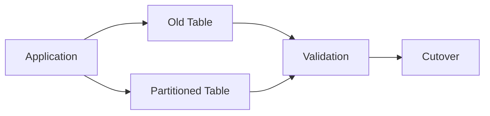
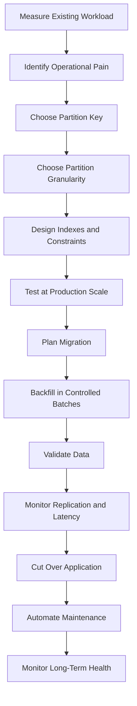

# 11- Partitioning Large Tables

## Overview

Partitioning large tables is a physical data-management strategy that divides one logical table into smaller physical partitions while preserving a single logical interface for application queries.

For large production tables, partitioning is primarily useful when table size creates operational or performance problems that conventional indexing and query optimization cannot adequately address.

Typical candidates include:

- Event and audit tables.
- Time-series data.
- Transaction histories.
- Application logs.
- IoT measurements.
- Large multi-tenant datasets.
- Tables with predictable data-retention requirements.

A 5 TB table containing years of event data may be difficult to vacuum, index, back up, archive, restore, and delete from efficiently. Partitioning can turn that one operational problem into many smaller, independently manageable units.

The important engineering principle is:

> Partitioning does not make an inefficient query efficient by itself. It changes the physical organization of data so the database can scan, maintain, archive, and remove subsets of that data more efficiently.

## Why Large Tables Become an Operational Problem

As a table grows, several costs increase:

| Concern | Effect of a Very Large Table |
|---|---|
| Sequential scans | More pages must be read |
| Index size | More storage and cache pressure |
| Vacuum | More maintenance work |
| `ANALYZE` | More statistics to maintain |
| Updates/deletes | More I/O and dead tuples |
| Bloat | More storage and inefficient scans |
| Retention | Large row-level deletes become expensive |
| Backups | Larger backup footprint |
| Restore | Longer recovery time |
| Index creation | Longer maintenance operations |
| Operational changes | Larger blast radius |

Indexes remain essential, but indexes do not eliminate the operational consequences of maintaining a massive relation.

Partitioning provides another dimension of control.

## Logical Table vs Physical Partitions

Applications generally continue to interact with one logical table:

```text
Application
    │
    │ SELECT / INSERT / UPDATE
    ▼
events
    │
    ├── events_2026_09
    ├── events_2026_10
    ├── events_2026_11
    └── events_2026_12
```

The database routes rows to the appropriate physical partition according to the partition key.

This allows application code to remain relatively unaware of the physical layout.

For example, Django can continue using:

```python
events = Event.objects.filter(
    tenant_id=tenant_id,
    created_at__gte=start,
    created_at__lt=end,
)
```

The application does not need to query `events_2026_09` directly.

## When Partitioning Large Tables Makes Sense

Partitioning is most useful when there is a strong partitioning dimension and queries naturally restrict it.

Good candidates often have:

- A large or continuously growing dataset.
- A high-cardinality or naturally ordered partition key.
- Time-based retention requirements.
- Queries that frequently filter by the partition key.
- Large historical data that becomes read-only.
- Operational requirements to archive or delete data in chunks.

Examples:

| Workload | Potential Partition Key |
|---|---|
| Audit events | `created_at` |
| Orders | `created_at` or business region |
| IoT measurements | `recorded_at` |
| Kafka-ingested events | event timestamp |
| Multi-tenant SaaS | `tenant_id` in selected architectures |
| Application logs | timestamp |
| Financial history | transaction date |

Partitioning is less useful when queries rarely restrict the partition key or when the table is not large enough to justify the added operational complexity.

## Partitioning Does Not Automatically Improve Every Query

Consider:

```sql
SELECT *
FROM events
WHERE event_type = 'LOGIN';
```

If the table is partitioned by:

```text
created_at
```

and the query does not restrict `created_at`, the database may need to inspect many or all partitions.

Compare that with:

```sql
SELECT *
FROM events
WHERE event_type = 'LOGIN'
  AND created_at >= '2026-09-01'
  AND created_at < '2026-10-01';
```

The second query provides information that can allow partition pruning.

Therefore:

> The usefulness of partitioning depends heavily on query patterns.

## Partitioning Strategy for Large Tables

Common strategies include:

| Strategy | Best Fit | Primary Benefit |
|---|---|---|
| Range | Time or ordered values | Retention and pruning |
| List | Discrete categories | Isolated logical groups |
| Hash | Even distribution | Balanced partition sizes |
| Composite | Multiple dimensions | More precise physical organization |

For continuously growing event data, range partitioning by timestamp is often the most operationally convenient.

Example:

```sql
CREATE TABLE events (
    id BIGINT NOT NULL,
    tenant_id BIGINT NOT NULL,
    event_type TEXT NOT NULL,
    created_at TIMESTAMPTZ NOT NULL,
    payload JSONB
) PARTITION BY RANGE (created_at);
```

Then:

```sql
CREATE TABLE events_2026_09
PARTITION OF events
FOR VALUES FROM ('2026-09-01') TO ('2026-10-01');

CREATE TABLE events_2026_10
PARTITION OF events
FOR VALUES FROM ('2026-10-01') TO ('2026-11-01');
```

## Partition Granularity

A critical design decision is how large each partition should be.

Possible choices:

```text
Daily
Weekly
Monthly
Quarterly
Yearly
```

There is no universal optimal size.

| Granularity | Advantages | Limitations |
|---|---|---|
| Daily | Fine-grained pruning and retention | Many partitions |
| Weekly | Good balance for some workloads | Less precise than daily |
| Monthly | Simple lifecycle management | Larger partitions |
| Quarterly | Few database objects | Less granular maintenance |
| Yearly | Very low partition count | Large individual partitions |

A useful engineering objective is:

> Make partitions large enough to avoid excessive partition-management overhead, but small enough to provide meaningful pruning and operational isolation.

Do not choose daily partitions merely because they provide more granularity.

## Estimating Partition Size

Partition size should be based on actual workload characteristics.

Consider:

```text
Rows per day
×
Average row size
×
Indexes
×
Expected growth
```

For example:

```text
500 million events/month
≈ 16.7 million events/day
```

If a monthly partition becomes several hundred gigabytes while daily queries are common, smaller partitions may be worth considering.

Conversely, if a table receives only a few million rows per month, daily partitions may create unnecessary catalog and operational overhead.

Benchmark using realistic data volumes.

## Migrating an Existing Large Table

Partitioning an existing large table is significantly more difficult than designing a partitioned table from the beginning.

A common migration problem is:

```text
Existing:
events
└── 5 TB

Target:
events
├── events_2026_01
├── events_2026_02
├── ...
└── events_2026_09
```

A naive migration may require copying the entire table while production traffic continues.

Potential risks include:

- Long-running transactions.
- Heavy disk I/O.
- Large WAL generation.
- Replica lag.
- Lock contention.
- Extended migration duration.
- Temporary storage requirements.
- Application inconsistency.

Treat large-table partitioning as a migration project rather than a simple DDL change.

## Migration Approaches

Common approaches include:

### Dual-Write Migration

Application writes go to both the old and new structures during migration.



Advantages:

- Supports gradual migration.
- Allows validation while production remains online.

Limitations:

- Application complexity.
- Potential write inconsistencies.
- Higher write load.
- Requires reconciliation logic.

### Backfill and Cutover

Another approach is:

```text
Create partitioned structure
        │
        ▼
Backfill historical data
        │
        ▼
Validate counts/checksums
        │
        ▼
Synchronize recent changes
        │
        ▼
Short cutover
        │
        ▼
Switch application to new structure
```

This can minimize downtime but requires careful synchronization.

### Native Database Migration

Some database versions and architectures provide ways to attach existing tables as partitions.

The migration still requires careful consideration of:

- Partition constraints.
- Existing indexes.
- Locking.
- Foreign keys.
- Application traffic.
- Data validation.

Do not assume that native partitioning features eliminate migration planning.

## Large-Table Backfills

Backfilling billions of rows in one transaction is dangerous.

Avoid:

```sql
INSERT INTO events_new
SELECT *
FROM events_old;
```

for a massive production table unless the environment and operational constraints explicitly support it.

Prefer bounded batches:

```text
Batch 1 → IDs 1–1,000,000
Batch 2 → IDs 1,000,001–2,000,000
Batch 3 → IDs 2,000,001–3,000,000
...
```

Batching allows:

- Progress tracking.
- Controlled resource usage.
- Retryability.
- Pause/resume behavior.
- Better replication management.

For time-partitioned data, processing one time range at a time can also be effective.

## Monitoring a Large-Table Migration

Track at least:

- Rows copied.
- Rows remaining.
- Copy throughput.
- Database CPU.
- Disk I/O.
- WAL generation.
- Replica lag.
- Lock waits.
- Error rate.
- Application latency.
- Disk capacity.

A migration dashboard might conceptually look like:

```text
Migration Progress       72%
Backfill Throughput      185k rows/s
Replica Lag              4s
Database CPU              61%
Disk Free                 31%
Application p95           180ms
```

A migration should have explicit stop conditions.

For example:

```text
Stop if:
replica lag > 60 seconds
OR
disk free < 15%
OR
API p95 > defined threshold
```

## Indexing Large Partitions

Each partition may require indexes corresponding to production query patterns.

For example:

```sql
CREATE INDEX events_2026_09_tenant_created_idx
ON events_2026_09 (tenant_id, created_at DESC);
```

Indexes should be designed around queries, not simply copied blindly.

For example:

```sql
WHERE tenant_id = ?
  AND created_at >= ?
ORDER BY created_at DESC
LIMIT 100
```

may benefit from:

```sql
(tenant_id, created_at DESC)
```

Partitioning and indexing solve different problems:

```text
Partitioning
→ reduces the physical data scope

Indexing
→ reduces the rows/pages searched within that scope
```

They are complementary rather than interchangeable.

## Partitioned Index Strategy

For a large production table, consider:

```text
Parent logical table
       │
       ├── Partition A → Indexes
       ├── Partition B → Indexes
       ├── Partition C → Indexes
       └── Partition D → Indexes
```

A new partition must receive the indexes required for its workload.

Automated partition creation should therefore include index validation.

## Vacuum and Bloat

Large tables can accumulate dead tuples from updates and deletes.

Partitioning can reduce the scope of maintenance.

Instead of:

```text
One 5 TB table
```

the system may maintain:

```text
20 × 250 GB partitions
```

A vacuum operation can work on individual partitions rather than always dealing with the full logical dataset.

This does not eliminate bloat. It makes maintenance more localized.

Write-heavy partitions deserve particular attention.

## Hot and Cold Data

Large tables frequently contain data with different access patterns.

For example:

```text
Current month
→ high writes + high reads

Previous 3 months
→ mostly reads

Older than 12 months
→ archival / retention
```

Partitioning provides physical boundaries that align naturally with these lifecycle stages.

A production architecture can therefore separate:

```text
Hot
 │
 ├── frequent writes
 ├── frequent reads
 └── aggressive maintenance

Warm
 │
 ├── read-heavy
 └── limited writes

Cold
 │
 ├── mostly immutable
 └── archival / deletion
```

## Retention at Large Scale

Large-table retention is one of the strongest reasons to partition.

Without partitioning:

```sql
DELETE FROM events
WHERE created_at < NOW() - INTERVAL '12 months';
```

A large delete can cause:

- Heavy I/O.
- WAL generation.
- Dead tuples.
- Vacuum pressure.
- Long-running transactions.
- Lock contention.
- Temporary performance degradation.

With time partitions, an expired partition can instead be detached and eventually dropped.

```text
12-month retention
       │
       ▼
Expired partition
       │
       ▼
Detach / archive
       │
       ▼
Drop
```

The operation is primarily metadata-oriented compared with deleting every row individually.

## Partition Pruning

Large tables benefit most when queries restrict the partition key.

For example:

```sql
SELECT id, tenant_id, event_type
FROM events
WHERE created_at >= '2026-09-01'
  AND created_at < '2026-10-01';
```

The optimizer can potentially eliminate partitions outside the requested range.

Conceptually:

```text
Query
 │
 ▼
Partition bounds
 │
 ├── Aug → skip
 ├── Sep → scan
 ├── Oct → skip
 └── Nov → skip
```

This can significantly reduce I/O.

However, pruning effectiveness depends on the database optimizer, query structure, partition key, data types, and runtime values.

Always verify with `EXPLAIN`.

## Parameterized Application Queries

Backend applications frequently use parameters.

For example:

```sql
SELECT *
FROM events
WHERE created_at >= $1
  AND created_at < $2;
```

Parameterized queries are desirable for security and plan reuse.

The database must still be able to reason about the parameter values appropriately for partition pruning.

Do not replace parameterization with dynamically constructed SQL merely to force partition selection.

## Large Tables and ORM Queries

Django and SQLAlchemy-style applications can accidentally hide inefficient access patterns.

For example:

```python
Event.objects.filter(
    event_type="LOGIN"
)
```

does not necessarily provide the partition key.

Prefer queries that reflect the application's known time boundaries when the business operation naturally has them:

```python
Event.objects.filter(
    event_type="LOGIN",
    created_at__gte=start,
    created_at__lt=end,
)
```

The ORM should generate SQL that allows the database optimizer to use the physical design.

## Partitioning and Multi-Tenancy

Tenant-based partitioning can be useful in some systems:

```text
events
├── tenant_a
├── tenant_b
├── tenant_c
└── ...
```

But using one partition per tenant is often problematic at large tenant counts.

If a SaaS platform has:

```text
100,000 tenants
```

creating:

```text
100,000 partitions
```

may create substantial operational and planning overhead.

Alternatives include:

- Hash partitioning.
- Range partitioning by tenant groups.
- Time + tenant composite partitioning.
- Conventional indexing on `tenant_id`.

Partitioning strategy must consider tenant cardinality and workload distribution.

## Composite Partitioning for Very Large Tables

Large systems sometimes use multiple partitioning levels.

Conceptually:

```text
events
├── 2026_09
│   ├── hash_0
│   ├── hash_1
│   ├── hash_2
│   └── hash_3
└── 2026_10
    ├── hash_0
    ├── hash_1
    ├── hash_2
    └── hash_3
```

This can combine:

- Time-based pruning.
- More even distribution within a time period.

However, each additional level increases complexity and partition count.

Use composite partitioning only when the workload justifies it.

## Partition Count

More partitions are not automatically better.

Potential consequences of excessive partition counts include:

- More catalog objects.
- More indexes.
- More statistics.
- Higher planning overhead.
- More maintenance operations.
- More complex backups.
- More complicated migrations.
- Increased operational failure surface.

A design should optimize for the smallest partition count that provides meaningful operational and query benefits.

## Large-Table Partitioning and Availability

Production availability depends on minimizing disruptive operations.

Before changing a multi-terabyte table:

1. Test the operation against production-scale data.
2. Understand lock acquisition and duration.
3. Measure expected WAL generation.
4. Verify replica capacity.
5. Check available disk space.
6. Establish rollback procedures.
7. Monitor application latency.
8. Execute incrementally where possible.

Do not assume that an operation that completes in seconds on a 1 GB development database will behave similarly on a multi-terabyte production table.

## High Availability Considerations

Partition maintenance interacts with replication and failover.

Monitor:

- Primary CPU.
- Primary disk I/O.
- Replica lag.
- WAL volume.
- Replication slots.
- Replica disk capacity.
- Failover readiness.

Large migrations can consume resources needed for normal replication.

A migration that eventually succeeds but causes replicas to fall hours behind is not operationally successful.

## Disaster Recovery

Large-table partitioning should be reflected in recovery procedures.

Document:

- Which partitions are active.
- Which are archived.
- Which are eligible for deletion.
- How archived partitions are restored.
- How partition metadata is reconstructed.
- How application traffic is redirected after recovery.

Test recovery with realistic partition counts and data volumes.

Partition metadata is part of the database schema and must be included in the recovery process.

## Security Considerations

Large-table migrations often require elevated database permissions.

Use:

- Dedicated migration roles.
- Short-lived credentials where possible.
- Least-privilege permissions.
- Audit logging for destructive DDL.
- Protected database connections.
- Controlled access to archived data.

Retention operations can permanently delete customer or regulated information, so deletion authorization should be explicit and auditable.

## Cost Considerations

Partitioning can reduce operational costs when it enables:

- Efficient retention.
- Smaller active working sets.
- Better cache locality.
- Cheaper archival.
- Reduced maintenance scope.

But it also introduces costs:

- Additional indexes.
- More metadata.
- More operational automation.
- Additional storage during migrations.
- Archival infrastructure.
- Monitoring and administration.

During an existing-table migration, temporary storage can be substantial.

Plan capacity for:

```text
Existing data
+
New partitioned copy
+
Indexes
+
WAL
+
Temporary migration overhead
```

Never begin a large-table migration with only enough disk space for the final dataset.

## Common Mistakes

### Partitioning Because the Table Is Large

Size alone does not justify partitioning.

**Why it fails:** A large table with poorly aligned queries may gain complexity without meaningful query improvements.

**Better:** Start with workload analysis, query patterns, retention requirements, and operational pain points.

### Choosing the Wrong Partition Key

Partitioning by a column rarely used in predicates limits pruning.

**Better:** Select a key that aligns with major access and lifecycle patterns.

### Creating Too Many Partitions

Fine-grained partitions can create administrative and planning overhead.

**Better:** Choose granularity based on actual data volume and query behavior.

### Using One Partition Per Tenant at Huge Scale

Large tenant counts can produce an excessive number of partitions.

**Better:** Consider hash partitioning, tenant groups, or conventional indexing.

### Ignoring Partition Size

Tiny partitions increase overhead, while enormous partitions reduce the operational benefit.

**Better:** Monitor actual partition growth and revisit granularity when workload characteristics change.

### Migrating Everything in One Transaction

A massive transaction can generate huge WAL and create operational pressure.

**Better:** Use controlled batches or time-based migration units.

### Ignoring Replication During Backfill

A high-throughput backfill can overwhelm replicas.

**Better:** Monitor and throttle based on replica lag and production load.

### Forgetting Indexes on New Partitions

New partitions without expected indexes can produce sudden query regressions.

**Better:** Automate index creation and validation.

### Assuming Partitioning Replaces Indexes

Partition pruning only narrows the partitions considered.

**Better:** Use partitioning and indexes together according to query patterns.

### Hard-Coding Partition Names

Application code should not depend on physical partition names.

**Better:** Query the logical parent table.

## Production Workflow

A mature large-table partitioning project typically follows this workflow:



This separates database design from migration and long-term operations.

## Practical PostgreSQL Inspection

For large partitioned tables, operational visibility is essential.

List relations:

```sql
SELECT
    schemaname,
    relname,
    pg_size_pretty(pg_total_relation_size(relid)) AS total_size
FROM pg_catalog.pg_statio_user_tables
ORDER BY pg_total_relation_size(relid) DESC;
```

Inspect the execution plan:

```sql
EXPLAIN (ANALYZE, BUFFERS)
SELECT id, tenant_id, event_type
FROM events
WHERE created_at >= '2026-09-01'
  AND created_at < '2026-10-01';
```

Look for evidence that irrelevant partitions were excluded and examine actual buffer usage and execution time.

Do not optimize partitioning based only on theoretical expectations. Measure the actual plan.

## Production Decision Framework

Use partitioning when several of these conditions are true:

| Question | If Yes |
|---|---|
| Is the table continuously growing? | Strong candidate |
| Is there a natural partition key? | Strong candidate |
| Do major queries filter by that key? | Strong candidate |
| Is retention based on that key? | Strong candidate |
| Are large deletes operationally expensive? | Strong candidate |
| Do different data ages have different workloads? | Strong candidate |
| Is operational maintenance becoming difficult? | Strong candidate |
| Would partition count remain manageable? | Required |
| Can the team automate partition lifecycle? | Strongly recommended |

If most answers are **No**, conventional indexing, query optimization, archiving, or data-model changes may be more appropriate.

## Interview Perspective

A strong senior-level answer should distinguish partitioning from simply splitting a table.

A concise answer is:

> **For very large tables, partitioning provides physical boundaries that can reduce query scope through pruning and make maintenance operations such as retention, vacuuming, indexing, and archival more manageable. The key design decisions are the partition key, partition granularity, partition count, query alignment, and lifecycle automation. For an existing multi-terabyte table, migration must also account for backfill throughput, WAL, replication lag, locks, disk capacity, validation, and cutover strategy.**

Common interview traps include:

- Assuming partitioning automatically makes every query faster.
- Choosing a partition key without examining query patterns.
- Creating thousands of tiny partitions.
- Confusing partitioning with sharding.
- Ignoring indexes within partitions.
- Ignoring partition pruning.
- Migrating a large table without considering WAL and replicas.
- Treating partition creation and retention as manual tasks.
- Ignoring the operational cost of partition count.

The senior-level perspective is to evaluate partitioning as a **query-performance, data-lifecycle, and operational scalability strategy**, not merely as a database feature.

## Key Takeaways

- **Partition large tables when physical data boundaries align with query patterns, retention policies, or operational maintenance requirements.**
- **Choose partition keys and granularity from real workload characteristics; excessive or poorly aligned partitions can increase complexity without improving performance.**
- **Combine partitioning with appropriate indexes and verify actual partition pruning and execution behavior using `EXPLAIN (ANALYZE, BUFFERS)`.**
- **Treat existing multi-terabyte table partitioning as a controlled migration involving batching, validation, WAL, replication, disk capacity, locking, and application cutover.**
- **Automate partition creation, maintenance, monitoring, archival, and retention so the system remains operationally manageable as data continues to grow.**