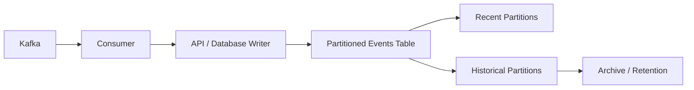

# 12- Partitioning by Date

## Overview

Date-based partitioning organizes a large table into partitions according to a temporal column such as `created_at`, `event_time`, or `transaction_date`.

It is one of the most practical partitioning strategies for backend systems because many production datasets have an inherent time dimension:

- Application events.
- Audit records.
- Transactions.
- Orders.
- Logs.
- Metrics.
- IoT measurements.
- Kafka-ingested events.
- Historical snapshots.

A typical design might partition an `events` table monthly:

```text
events
├── events_2026_07
├── events_2026_08
├── events_2026_09
├── events_2026_10
└── events_2026_11
```

The application still queries the logical `events` table. The database determines which physical partitions contain relevant rows.

Date partitioning is especially valuable when **queries filter by time and data has a time-based lifecycle**. It can enable partition pruning, simplify retention, reduce the scope of maintenance operations, and make archival workflows more manageable.

## Why Partition by Date

Time is a particularly strong partitioning dimension because data often has predictable temporal behavior.

For example:

```text
New data
   │
   ▼
Current month
   │
   ├── frequent writes
   ├── frequent reads
   └── active indexes
        │
        ▼
Older months
   │
   ├── mostly reads
   ├── fewer writes
   └── archival candidates
        │
        ▼
Retention boundary
   │
   ▼
Archive / Drop
```

This aligns physical storage with the lifecycle of the data.

### Primary Benefits

| Benefit | Explanation |
|---|---|
| Partition pruning | Queries with date predicates can avoid irrelevant partitions |
| Retention | Old partitions can be detached, archived, or dropped |
| Maintenance | Vacuum, analyze, and index operations can be scoped to partitions |
| Operational isolation | Current data can be managed independently from historical data |
| Predictable growth | New partitions can be created as time advances |
| Archival | Historical partitions can be moved through a defined lifecycle |

Date partitioning is therefore both a **query optimization technique** and a **data lifecycle management strategy**.

## Choosing the Date Column

The partition key should represent the temporal dimension that best matches the workload.

Common candidates include:

| Column | Typical Use |
|---|---|
| `created_at` | Records created by the application |
| `event_time` | Time at which an event occurred |
| `occurred_at` | Business event timestamp |
| `transaction_date` | Financial or transactional data |
| `recorded_at` | Telemetry or measurement data |
| `ingested_at` | Data ingestion pipelines |

The important question is not simply:

> Which column contains a date?

Instead ask:

> Which temporal dimension determines how the data is queried and managed?

For example, an analytics system may ingest an event today whose actual event time was three months ago. Partitioning by `ingested_at` and partitioning by `event_time` produce very different operational and query characteristics.

## Date Partitioning with PostgreSQL

PostgreSQL supports declarative partitioning.

A typical range-partitioned table is:

```sql
CREATE TABLE events (
    id BIGINT NOT NULL,
    tenant_id BIGINT NOT NULL,
    event_type TEXT NOT NULL,
    created_at TIMESTAMPTZ NOT NULL,
    payload JSONB
) PARTITION BY RANGE (created_at);
```

Monthly partitions can then be created:

```sql
CREATE TABLE events_2026_09
PARTITION OF events
FOR VALUES FROM ('2026-09-01 00:00:00+00')
             TO   ('2026-10-01 00:00:00+00');

CREATE TABLE events_2026_10
PARTITION OF events
FOR VALUES FROM ('2026-10-01 00:00:00+00')
             TO   ('2026-11-01 00:00:00+00');
```

The upper bound is exclusive.

Therefore:

```text
2026-09-01 <= created_at < 2026-10-01
```

belongs to the September partition.

## Why Range Partitioning Fits Dates

Dates have a natural ordering:

```text
January < February < March < ...
```

Range partitioning maps naturally to this structure.

For example:

```text
events
│
├── Jan 2026
│   01 <= date < 02
│
├── Feb 2026
│   02 <= date < 03
│
├── Mar 2026
│   03 <= date < 04
│
└── ...
```

This makes range partitions particularly suitable for:

- Monthly partitions.
- Weekly partitions.
- Daily partitions.
- Quarterly partitions.
- Yearly partitions.

## Partition Granularity

The most important design choice after selecting the partition key is the partition interval.

Common choices are:

| Granularity | Typical Use |
|---|---|
| Hourly | Extremely high-volume telemetry |
| Daily | Very high-volume event streams |
| Weekly | Moderate-to-high volume |
| Monthly | Common general-purpose choice |
| Quarterly | Large historical datasets with lower query precision |
| Yearly | Relatively low-volume historical data |

There is no universally correct interval.

A useful decision is based on:

```text
Rows per interval
+
Partition size
+
Query patterns
+
Retention operations
+
Partition count
```

### Monthly Partitioning

Monthly partitions are often a good default for large application tables.

```text
events_2026_01
events_2026_02
events_2026_03
...
```

Advantages:

- Simple lifecycle management.
- Predictable partition creation.
- Manageable partition count.
- Natural alignment with monthly retention.

Limitations:

- A single month may still be very large.
- Queries spanning a small number of days may still touch a relatively large partition.

### Daily Partitioning

Daily partitions provide finer-grained pruning:

```text
events_2026_09_01
events_2026_09_02
events_2026_09_03
...
```

This can work well for very high-volume event systems.

However, creating hundreds or thousands of partitions can increase:

- Catalog metadata.
- Index count.
- Maintenance operations.
- Planning overhead.
- Automation complexity.

Do not choose daily partitioning simply because it sounds more optimized.

## Partition Size

Partition size should be driven by actual workload characteristics.

For example:

```text
10 million rows/day
×
30 days
=
~300 million rows/month
```

If a monthly partition becomes several hundred gigabytes, daily partitioning may provide useful operational benefits.

Conversely:

```text
100,000 rows/day
×
30 days
=
3 million rows/month
```

Daily partitions may add unnecessary complexity.

Measure:

- Rows per day.
- Average row size.
- Index size.
- Read/write volume.
- Retention frequency.
- Query latency.
- Maintenance duration.

## Partition Pruning

Partition pruning is one of the primary performance benefits of date partitioning.

Consider:

```sql
SELECT id, tenant_id, event_type
FROM events
WHERE created_at >= '2026-09-01'
  AND created_at < '2026-10-01';
```

The optimizer can determine that only the September partition is relevant.

Conceptually:

```text
Query
  │
  ▼
created_at range
  │
  ├── July   → skip
  ├── August → skip
  ├── September → scan
  ├── October → skip
  └── November → skip
```

Without pruning, the database may need to consider many more partitions.

Always verify actual behavior:

```sql
EXPLAIN (ANALYZE, BUFFERS)
SELECT id, tenant_id, event_type
FROM events
WHERE created_at >= '2026-09-01'
  AND created_at < '2026-10-01';
```

The important production principle is:

> Partitioning only helps queries when the database can eliminate irrelevant partitions.

## Queries That Do Not Use the Date

Consider:

```sql
SELECT *
FROM events
WHERE tenant_id = 123;
```

If the table is partitioned by `created_at`, this query does not provide a temporal restriction.

The database may need to inspect many or all partitions.

This does not mean date partitioning is wrong. It means partitioning and indexing address different dimensions.

A common design is:

```text
Partition by created_at
+
Index by tenant_id
```

For example:

```sql
CREATE INDEX events_2026_09_tenant_idx
ON events_2026_09 (tenant_id);
```

## Time Predicates Should Be Sargable

Prefer half-open ranges:

```sql
WHERE created_at >= '2026-09-01'
  AND created_at < '2026-10-01'
```

This is generally safer than constructing an inclusive end-of-day timestamp.

Avoid expressions that obscure the partition key when possible:

```sql
WHERE DATE(created_at) = '2026-09-15'
```

Prefer:

```sql
WHERE created_at >= '2026-09-15'
  AND created_at < '2026-09-16'
```

The range form expresses the exact interval and is generally friendlier to indexes and partition pruning.

## Time Zones

Time zones are a major production concern for date partitioning.

Avoid designing partition boundaries around application-local calendar days unless the business requirement explicitly requires it.

A common approach is to store timestamps consistently in UTC:

```sql
created_at TIMESTAMPTZ NOT NULL
```

Then define partition boundaries in UTC.

For example:

```sql
FOR VALUES FROM ('2026-09-01 00:00:00+00')
             TO   ('2026-10-01 00:00:00+00');
```

Application-level time zones can then be applied when presenting or interpreting data.

### Why This Matters

Suppose users operate across:

```text
India
Europe
US
Australia
```

A partition based on one local timezone can produce confusing boundaries for global workloads.

Using a consistent temporal representation simplifies:

- Partition creation.
- Query boundaries.
- Retention.
- Data ingestion.
- Cross-region processing.

## Late-Arriving Data

Date-partitioned systems must handle events that arrive after their logical time period.

Example:

```text
Current date: 2026-09-20

Incoming event:
event_time = 2026-06-15
```

If the table is partitioned by `event_time`, the row belongs to the June partition.

This creates an operational requirement:

> Historical partitions cannot always be treated as immutable.

Possible strategies include:

- Allow writes to recent historical partitions.
- Keep a configurable late-arrival window.
- Route very old events through a controlled ingestion path.
- Use `ingested_at` instead when operational ingestion time is more important than event time.
- Reconcile late-arriving records asynchronously.

The correct choice depends on the business semantics.

## Default Partitions

A default partition can capture rows that do not match an explicitly created partition.

For example:

```sql
CREATE TABLE events_default
PARTITION OF events DEFAULT;
```

This can prevent inserts from failing when partition management temporarily falls behind.

However, it should not become a permanent dumping ground.

Monitor it:

```text
Expected:
events_default = 0 rows

Problem:
events_default = 2.4 million rows
```

A growing default partition usually indicates a partition lifecycle failure.

## Missing Future Partitions

Suppose the application reaches:

```text
2026-12-01
```

but the December partition was never created.

An insert may fail if no partition accepts the row.

This makes future partition provisioning a reliability concern.

A production system should create partitions ahead of time.

For example:

```text
Current month: September

Pre-created:
October
November
December
January
```

The exact safety window depends on the workload.

## Automating Partition Creation

Partition lifecycle management should be automated.

Possible mechanisms include:

- Scheduled jobs.
- Database administration jobs.
- CI/CD migrations.
- Kubernetes CronJobs.
- Celery tasks.
- Managed database automation.

A simple SQL operation might be:

```sql
CREATE TABLE events_2026_11
PARTITION OF events
FOR VALUES FROM ('2026-11-01 00:00:00+00')
             TO   ('2026-12-01 00:00:00+00');
```

The automation should also verify:

- Partition does not already exist.
- Correct bounds are configured.
- Required indexes exist.
- Monitoring is configured.
- Retention metadata is correct.

## Retention and Date Partitions

Date partitioning becomes especially powerful when retention is time-based.

Suppose the requirement is:

```text
Retain events for 12 months.
```

With row-level deletion:

```sql
DELETE FROM events
WHERE created_at < NOW() - INTERVAL '12 months';
```

a large delete can generate substantial I/O and WAL and create dead tuples.

With partitions:

```text
Expired partition
       │
       ▼
Detach
       │
       ├── Archive
       │
       └── Drop
```

For example:

```sql
DROP TABLE events_2025_08;
```

Dropping an expired partition can be dramatically cheaper than deleting millions or billions of individual rows.

The exact retention workflow should account for backup, compliance, legal hold, and archival requirements before destructive operations.

## Detaching Partitions for Archival

A useful lifecycle is:

```text
Active
  │
  ▼
Historical
  │
  ▼
Retention threshold
  │
  ▼
Detach
  │
  ▼
Archive
  │
  ▼
Delete after policy
```

Detaching a partition allows the application to stop treating it as part of the active logical table while preserving the physical data for archival processing.

This is useful when historical data must be retained outside the primary workload.

## Indexes on Date Partitions

Partitioning does not eliminate the need for indexes.

Suppose the query is:

```sql
SELECT id, event_type
FROM events
WHERE tenant_id = 123
  AND created_at >= '2026-09-01'
  AND created_at < '2026-10-01'
ORDER BY created_at DESC
LIMIT 100;
```

The partition key provides temporal pruning.

An index can then efficiently locate rows within the remaining partition:

```sql
CREATE INDEX events_2026_09_tenant_created_idx
ON events_2026_09 (tenant_id, created_at DESC);
```

This creates two levels of optimization:

```text
Partition pruning
        │
        ▼
Relevant partition(s)
        │
        ▼
Index scan
        │
        ▼
Small set of matching rows
```

## Primary Keys and Uniqueness

Partitioned tables introduce additional design considerations for uniqueness.

In PostgreSQL, a unique or primary key constraint on a partitioned table generally needs to include the partition key so uniqueness can be enforced across partitions.

For example:

```sql
PRIMARY KEY (id, created_at)
```

may be structurally different from the application's conceptual desire for globally unique `id`.

A common production design is to generate globally unique identifiers independently, such as:

- UUIDs.
- Application-generated IDs.
- Sequence-based IDs with appropriate database design.

Do not assume that a partitioned table behaves exactly like a non-partitioned table for global uniqueness enforcement.

## Foreign Keys

Partitioning can affect constraint design and migrations.

Before partitioning a heavily referenced table, verify:

- Primary key requirements.
- Foreign key compatibility.
- ORM assumptions.
- Cascade behavior.
- Migration support.
- Application-generated identifiers.

Django migrations and other ORM migration systems may not expose every database-specific partitioning capability cleanly.

For complex partitioned schemas, database-level migrations may need to complement ORM migrations.

## Date Partitioning with Django

Django can continue querying the logical table:

```python
events = Event.objects.filter(
    created_at__gte=start,
    created_at__lt=end,
).order_by("-created_at")[:100]
```

The application does not need to know that the table is physically partitioned.

This is desirable because partitioning should generally remain an infrastructure/database concern.

However, application developers still need to understand partition-aware query patterns.

A service that consistently knows the relevant time window should include it in the query.

## Date Partitioning with FastAPI

A FastAPI endpoint might expose a date range:

```python
from datetime import datetime

from fastapi import FastAPI, Query

app = FastAPI()


@app.get("/events")
def list_events(
    start: datetime = Query(...),
    end: datetime = Query(...),
):
    # The repository should translate this into a bounded SQL query.
    return repository.list_events(start=start, end=end)
```

The repository layer should produce a parameterized query:

```sql
SELECT id, tenant_id, event_type, created_at
FROM events
WHERE tenant_id = $1
  AND created_at >= $2
  AND created_at < $3
ORDER BY created_at DESC
LIMIT $4;
```

This preserves:

- SQL injection protection.
- Clear temporal boundaries.
- Partition pruning opportunities.
- Predictable query behavior.

## Date Partitioning in Event-Driven Systems

Date partitioning works naturally with event ingestion pipelines.

For example:



A Kafka consumer may continuously insert events into the current partition.

The operational challenge is ensuring that partition creation stays ahead of ingestion.

A partition lifecycle controller can run independently:

```text
Partition Manager
       │
       ├── Create future partitions
       ├── Validate bounds
       ├── Validate indexes
       ├── Detect default partition growth
       └── Retire expired partitions
```

## Partitioning and Batch Processing

Date partitions can also improve batch workloads.

Instead of processing:

```sql
SELECT *
FROM events;
```

a batch job can process:

```sql
SELECT *
FROM events
WHERE created_at >= $1
  AND created_at < $2;
```

For example:

```text
Celery job
   │
   ├── Process September 1
   ├── Process September 2
   ├── Process September 3
   └── ...
```

This can improve:

- Retryability.
- Work isolation.
- Operational control.
- Parallel processing.
- Failure recovery.

The partition boundary should still be treated as a physical optimization rather than a substitute for application-level batching.

## Monitoring

A production partitioning system should monitor both performance and partition health.

Useful metrics include:

| Metric | Why It Matters |
|---|---|
| Partition size | Detect abnormal growth |
| Rows per partition | Capacity planning |
| Query latency | Detect regressions |
| Partition count | Detect uncontrolled growth |
| Default partition rows | Detect missing bounds |
| Index size | Track storage consumption |
| Vacuum duration | Detect maintenance pressure |
| Dead tuples | Detect write/delete pressure |
| Replica lag | Detect replication impact |
| Disk utilization | Prevent capacity incidents |
| Partition creation failures | Prevent ingestion failures |

For PostgreSQL, inspect table sizes with:

```sql
SELECT
    schemaname,
    relname,
    pg_size_pretty(pg_total_relation_size(relid)) AS total_size
FROM pg_catalog.pg_statio_user_tables
ORDER BY pg_total_relation_size(relid) DESC;
```

## Verifying Partition Pruning

Use:

```sql
EXPLAIN (ANALYZE, BUFFERS)
SELECT id, event_type
FROM events
WHERE created_at >= '2026-09-01'
  AND created_at < '2026-10-01';
```

When diagnosing performance, inspect:

- Number of partitions accessed.
- Actual execution time.
- Planning time.
- Buffer hits.
- Buffer reads.
- Rows returned.
- Index vs sequential scan behavior.

Do not conclude that partitioning works merely because the table has partitions.

## Partition Maintenance

Date-partitioned tables require ongoing maintenance.

A production maintenance process should:

1. Create future partitions.
2. Verify partition bounds.
3. Verify indexes.
4. Monitor current partition growth.
5. Analyze active partitions.
6. Detect default-partition rows.
7. Archive expired partitions where required.
8. Enforce retention policies.
9. Remove expired partitions safely.

This should be automated rather than performed manually.

## Handling the Current Partition

The current partition usually receives the majority of writes.

For example:

```text
events_2026_09
      │
      ├── high INSERT rate
      ├── frequent SELECTs
      ├── active vacuum
      └── growing indexes
```

Older partitions may be mostly read-only.

This difference matters operationally.

A production system can monitor the current partition more aggressively because it is often the hottest physical object.

## Hot Partition Problems

Date partitioning does not automatically distribute write load.

If all current writes target:

```text
events_2026_09
```

then that partition becomes the hot partition.

Potential effects include:

- High index-write activity.
- Lock contention.
- Increased WAL.
- Increased vacuum work.
- Disk I/O concentration.

If the workload is extremely write-heavy, consider whether another partitioning dimension, such as hash subpartitioning, is justified.

Do not introduce composite partitioning prematurely.

## Partitioning by Event Time vs Ingestion Time

This is a common architecture decision.

| Partition Key | Advantage | Risk |
|---|---|---|
| Event time | Matches business/event queries | Late-arriving events |
| Ingestion time | Predictable write location | Event-time queries may touch more partitions |
| Creation time | Simple application semantics | May not match analytical queries |
| Transaction date | Strong business alignment | Backdated transactions require care |

Choose based on the dominant workload.

For analytics systems where queries are almost always based on when an event occurred, `event_time` may be appropriate.

For ingestion pipelines where operational processing is based on arrival time, `ingested_at` may be better.

## Common Mistakes

### Using Local Time for Global Data

Partition boundaries based on application-local time can create inconsistent behavior across regions.

**Better:** Use UTC-based timestamps unless business requirements explicitly demand another timezone.

### Choosing the Wrong Timestamp

Partitioning by `created_at` while almost every analytical query uses `event_time` can reduce pruning effectiveness.

**Better:** Analyze real query predicates before selecting the partition key.

### Creating Too Many Daily Partitions

Daily partitions may sound efficient but can create excessive metadata and maintenance overhead.

**Better:** Choose the largest practical interval that still provides meaningful pruning and lifecycle benefits.

### Forgetting Future Partitions

If ingestion reaches a timestamp for which no partition exists, inserts may fail.

**Better:** Create partitions ahead of time and monitor creation failures.

### Relying Permanently on a Default Partition

A default partition can hide partition-management failures.

**Better:** Alert when rows enter the default partition and investigate immediately.

### Using Functions on the Partition Key

Queries such as:

```sql
WHERE DATE(created_at) = '2026-09-01'
```

can make optimization harder.

**Better:**

```sql
WHERE created_at >= '2026-09-01'
  AND created_at < '2026-09-02'
```

### Ignoring Late-Arriving Events

Historical events may need to be inserted into old partitions.

**Better:** Define an explicit late-arrival policy.

### Assuming Partitioning Replaces Indexes

Partition pruning only narrows the physical search space.

**Better:** Design indexes for the queries executed inside each partition.

### Hard-Coding Partition Names in Application Code

Application code such as:

```python
table = "events_2026_09"
```

couples business logic to physical storage.

**Better:** Query the logical parent table.

### Deleting Old Rows Instead of Dropping Partitions

Large row-level deletes can create unnecessary I/O and vacuum pressure.

**Better:** Align retention with partition boundaries whenever possible.

## Production Checklist

Before deploying date partitioning, verify:

- [ ] The partition key matches real query and lifecycle requirements.
- [ ] Timestamp semantics are clearly defined.
- [ ] Time zone behavior is documented.
- [ ] Partition granularity is justified by data volume.
- [ ] Future partitions are created automatically.
- [ ] Required indexes exist on new partitions.
- [ ] Partition pruning is verified with `EXPLAIN`.
- [ ] Late-arriving data has an explicit strategy.
- [ ] Default partition usage is monitored if one exists.
- [ ] Retention and archival workflows are automated.
- [ ] Partition count is monitored.
- [ ] Disk growth is monitored.
- [ ] Replica impact is understood.
- [ ] Migration procedures are tested at realistic scale.
- [ ] ORM behavior has been validated.
- [ ] Backup and restore procedures include partition metadata.
- [ ] Destructive retention operations are auditable.

## Interview Perspective

A strong senior-level explanation should connect date partitioning to both query execution and operations.

A concise answer is:

> **Date partitioning divides a large table into time-based ranges, usually using range partitioning on a timestamp or date column. It is particularly effective when queries filter by time and data has time-based retention or archival requirements. The database can prune irrelevant partitions, while operations such as retention, vacuuming, indexing, and archival can be performed on smaller physical units. Production design must account for partition granularity, UTC boundaries, late-arriving data, future partition creation, indexes, partition count, and monitoring.**

Common interview traps include:

- Saying date partitioning automatically makes all queries faster.
- Ignoring partition pruning.
- Using application-local time without considering time zones.
- Forgetting future partition creation.
- Ignoring late-arriving events.
- Assuming a default partition solves lifecycle management.
- Creating one partition per day without considering partition count.
- Treating partitioning as a replacement for indexing.
- Ignoring retention and archival workflows.

The senior-level perspective is to treat date partitioning as a **physical data-layout and lifecycle strategy whose effectiveness depends on workload alignment and disciplined operational automation**.

## Key Takeaways

- **Date partitioning is most effective when query predicates and data lifecycle policies naturally follow time.**
- **Use well-defined half-open time ranges and consistent timezone semantics, typically UTC, to make partition boundaries predictable.**
- **Choose partition granularity from actual data volume, query patterns, maintenance cost, and acceptable partition count rather than defaulting to daily or monthly partitions.**
- **Automate future partition creation, index provisioning, pruning validation, retention, archival, and monitoring to prevent operational failures.**
- **Treat late-arriving data, hot current partitions, default partitions, and replication impact as first-class production concerns.**