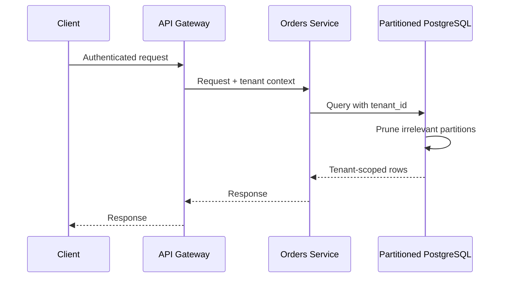
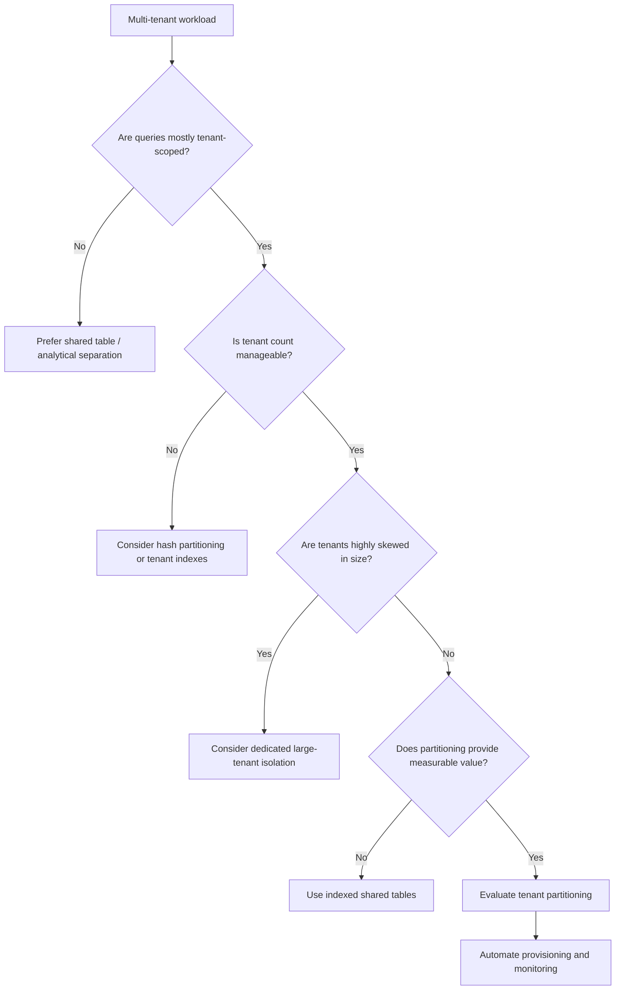

# 13- Partitioning by Tenant

## Overview

Tenant-based partitioning organizes a multi-tenant table according to `tenant_id`, so rows belonging to different tenants are stored in different partitions.

For example:

```text
orders
├── tenant_001
├── tenant_002
├── tenant_003
└── ...
```

The strategy is attractive in SaaS and multi-tenant systems because many application queries naturally include a tenant predicate:

```sql
SELECT id, status, created_at
FROM orders
WHERE tenant_id = 42
  AND status = 'pending';
```

When the database can use `tenant_id` for partition pruning, a tenant-scoped query can avoid inspecting unrelated partitions.

Tenant partitioning also creates operational boundaries that can be useful for:

- Large-tenant isolation.
- Tenant-specific archival.
- Tenant migration.
- Data lifecycle management.
- Tenant-specific maintenance.
- Capacity planning.

However, partitioning by tenant is not automatically the correct design for multi-tenancy. The number of tenants, tenant-size distribution, query patterns, schema constraints, operational tooling, and growth model must all be considered.

## Multi-Tenant Data Models

Before choosing tenant partitioning, distinguish the common multi-tenancy models.

| Model | Data Layout | Isolation | Operational Complexity |
|---|---|---|---|
| Shared table | All tenants share one table | Logical | Low |
| Shared table + indexes | All tenants share table with tenant indexes | Logical | Low |
| Partition by tenant | Separate partition per tenant | Physical within database | Medium |
| Partition by time + tenant | Composite partitioning | Stronger physical separation | High |
| Database per tenant | Separate database | Strong | High |
| Schema per tenant | Separate schema | Strong | High |

For many SaaS systems, a shared table with an index such as:

```sql
CREATE INDEX orders_tenant_created_idx
ON orders (tenant_id, created_at DESC);
```

is sufficient.

Tenant partitioning becomes more compelling when tenants are large enough that physical separation provides measurable performance or operational benefits.

## Why Partition by Tenant

The primary reason is workload isolation.

Suppose a SaaS application has:

```text
Tenant A → 500 million orders
Tenant B → 20 million orders
Tenant C → 2 million orders
Tenant D → 500,000 orders
```

A single shared table can become dominated by the largest tenants.

Partitioning can create a physical boundary:

```text
orders
│
├── tenant_a
│   └── 500M rows
│
├── tenant_b
│   └── 20M rows
│
├── tenant_c
│   └── 2M rows
│
└── tenant_d
    └── 500K rows
```

A query for Tenant C can potentially operate only on Tenant C's partition.

## How Tenant Partitioning Works

A database partitioned by tenant commonly uses list partitioning.

```sql
CREATE TABLE orders (
    id BIGINT NOT NULL,
    tenant_id BIGINT NOT NULL,
    status TEXT NOT NULL,
    created_at TIMESTAMPTZ NOT NULL,
    total_amount NUMERIC(12, 2) NOT NULL
) PARTITION BY LIST (tenant_id);
```

Partitions can then be created:

```sql
CREATE TABLE orders_tenant_42
PARTITION OF orders
FOR VALUES IN (42);

CREATE TABLE orders_tenant_84
PARTITION OF orders
FOR VALUES IN (84);
```

The logical application table remains:

```text
orders
```

while the database stores rows in tenant-specific partitions.

## Query Flow

A tenant-scoped query can follow this conceptual path:


The critical step is partition pruning.

If the query contains:

```sql
WHERE tenant_id = 42
```

the optimizer has the information needed to identify the relevant partition.

## Partition Pruning

Consider:

```sql
SELECT id, status, created_at
FROM orders
WHERE tenant_id = 42
  AND status = 'pending';
```

Conceptually:

```text
orders
│
├── tenant_1  → skip
├── tenant_2  → skip
├── tenant_42 → scan
├── tenant_43 → skip
└── tenant_44 → skip
```

Verify actual behavior rather than assuming it:

```sql
EXPLAIN (ANALYZE, BUFFERS)
SELECT id, status, created_at
FROM orders
WHERE tenant_id = 42
  AND status = 'pending';
```

A partitioned table can still perform poorly if the query does not provide a usable partition restriction.

## Tenant-Scoped Queries Are Critical

Tenant partitioning is most effective when the application consistently scopes database operations by tenant.

Good:

```sql
SELECT id, status
FROM orders
WHERE tenant_id = $1
  AND id = $2;
```

Risky:

```sql
SELECT id, status
FROM orders
WHERE id = $1;
```

The second query may require consideration of many partitions.

More importantly, in a multi-tenant system, omitting `tenant_id` can become a **data-isolation vulnerability**, not merely a performance problem.

## Tenant Isolation and Security

Tenant partitioning must never be treated as the primary authorization mechanism.

The application should establish tenant identity from trusted authentication context:

```text
Request
   │
   ▼
Authentication
   │
   ▼
User identity
   │
   ▼
Authorized tenant
   │
   ▼
Repository query
   │
   ▼
tenant_id = authorized_tenant
```

Do not trust a client-provided tenant identifier without authorization validation.

For example, this request:

```http
GET /orders?tenant_id=84
```

must not automatically grant access to tenant 84.

The service should determine whether the authenticated principal is authorized for that tenant.

## Application-Level Tenant Scoping

A repository layer can make tenant scoping explicit:

```python
from typing import Any


class OrderRepository:
    def list_orders(
        self,
        *,
        tenant_id: int,
        status: str | None = None,
    ) -> list[dict[str, Any]]:
        query = """
            SELECT id, status, created_at, total_amount
            FROM orders
            WHERE tenant_id = %(tenant_id)s
        """

        params: dict[str, Any] = {"tenant_id": tenant_id}

        if status is not None:
            query += " AND status = %(status)s"
            params["status"] = status

        query += " ORDER BY created_at DESC LIMIT 100"

        return self.db.fetch_all(query, params)
```

The important design property is that `tenant_id` is part of the repository contract rather than an optional filter added by individual callers.

## PostgreSQL Row-Level Security

For stronger defense-in-depth, PostgreSQL Row-Level Security (RLS) can complement tenant-aware application code.

Conceptually:

```text
Application authorization
        │
        ▼
Tenant context
        │
        ▼
SQL query
        │
        ▼
PostgreSQL RLS
        │
        ▼
Partition / rows
```

For example:

```sql
ALTER TABLE orders ENABLE ROW LEVEL SECURITY;
```

A policy can restrict rows based on a database session setting:

```sql
CREATE POLICY tenant_isolation
ON orders
USING (
    tenant_id = current_setting('app.tenant_id')::bigint
);
```

The exact session-management strategy must be carefully designed for connection pooling.

RLS is a defense-in-depth mechanism. It does not remove the need for correct authentication, authorization, connection management, and application-level tenant context.

## Tenant Count Is the Critical Constraint

Tenant partitioning has an important scaling problem:

> Number of tenants can be much larger than the number of practical partitions.

Suppose the system has:

```text
10 tenants
```

Creating 10 partitions may be straightforward.

But:

```text
100,000 tenants
```

means:

```text
100,000 partitions
```

This can create substantial database metadata and operational complexity.

Potential consequences include:

- Larger system catalogs.
- More indexes.
- Higher planning overhead.
- More complex migrations.
- More complicated backups.
- Slower administrative operations.
- Difficult partition lifecycle management.

Therefore, partition-per-tenant is generally better suited to workloads with a manageable number of tenants or a small set of very large tenants.

## Tenant Size Distribution

Tenant size matters as much as tenant count.

Consider:

```text
Tenant A → 900 GB
Tenant B → 50 GB
Tenant C → 1 MB
Tenant D → 800 KB
...
```

Creating a dedicated partition for every tiny tenant may not provide meaningful value.

A more sophisticated architecture can distinguish between:

- Small tenants.
- Medium tenants.
- Large tenants.
- Enterprise tenants.

For example:

```text
Shared partition
├── small tenant 1
├── small tenant 2
└── small tenant 3

Dedicated partitions
├── enterprise tenant A
├── enterprise tenant B
└── enterprise tenant C
```

This can provide better operational economics than one partition per tenant.

## Hash Partitioning for Large Tenant Populations

When there are many tenants, hash partitioning can provide a bounded number of partitions.

```sql
CREATE TABLE orders (
    id BIGINT NOT NULL,
    tenant_id BIGINT NOT NULL,
    status TEXT NOT NULL,
    created_at TIMESTAMPTZ NOT NULL
) PARTITION BY HASH (tenant_id);
```

For example:

```sql
CREATE TABLE orders_p0
PARTITION OF orders
FOR VALUES WITH (MODULUS 16, REMAINDER 0);

CREATE TABLE orders_p1
PARTITION OF orders
FOR VALUES WITH (MODULUS 16, REMAINDER 1);
```

The resulting structure is:

```text
orders
│
├── hash partition 0
│   ├── tenant 12
│   ├── tenant 48
│   └── ...
│
├── hash partition 1
│   ├── tenant 7
│   ├── tenant 31
│   └── ...
│
└── ...
```

This provides a bounded partition count.

However, a tenant query is no longer necessarily mapped to one dedicated partition in the same way as list partitioning.

## Tenant Partitioning vs Tenant Indexing

For many systems, the first optimization should be an index:

```sql
CREATE INDEX orders_tenant_created_idx
ON orders (tenant_id, created_at DESC);
```

Compare the approaches:

| Approach | Main Benefit | Main Cost |
|---|---|---|
| Shared table | Simple operations | Large shared structures |
| Tenant index | Efficient tenant filtering | Index can become very large |
| Tenant partitions | Physical tenant isolation | Partition management |
| Hash partitions | Bounded partition count | Less direct tenant isolation |
| Database per tenant | Strong isolation | High operational cost |

Partitioning should be introduced when indexing and query optimization no longer address the actual bottleneck or when physical tenant isolation provides operational value.

## Indexes Within Tenant Partitions

Partitioning does not eliminate indexes.

Suppose:

```sql
CREATE TABLE orders_tenant_42
PARTITION OF orders
FOR VALUES IN (42);
```

The partition may need:

```sql
CREATE INDEX orders_tenant_42_status_created_idx
ON orders_tenant_42 (status, created_at DESC);
```

Because every row already belongs to tenant 42, an index on `tenant_id` alone may provide little value inside the partition.

The useful indexes should target the remaining query dimensions.

For example:

```sql
CREATE INDEX orders_tenant_42_status_created_idx
ON orders_tenant_42 (status, created_at DESC);
```

This produces:

```text
Tenant pruning
      │
      ▼
Tenant 42 partition
      │
      ▼
(status, created_at) index
      │
      ▼
Matching rows
```

## Primary Keys and Global IDs

Tenant partitioning raises questions about primary keys and uniqueness.

Suppose:

```sql
id BIGINT
```

is globally unique across all tenants.

The application may use:

- Database sequences.
- UUIDs.
- UUIDv7.
- Application-generated identifiers.
- Another globally unique ID strategy.

A globally unique identifier is often operationally simpler than requiring IDs to be unique only within a tenant.

If IDs are only tenant-scoped:

```text
tenant 42 → order 100
tenant 84 → order 100
```

then every application lookup must preserve tenant context:

```sql
WHERE tenant_id = $1
  AND id = $2
```

This can be valid, but the security and repository design must consistently enforce the tenant boundary.

## Tenant Partitioning and Foreign Keys

Relationships require careful schema design.

Consider:

```text
tenants
   │
   └── orders
         │
         └── order_items
```

If `orders` is partitioned by tenant, related tables need compatible access patterns.

For example:

```sql
SELECT oi.*
FROM order_items oi
JOIN orders o ON o.id = oi.order_id
WHERE o.tenant_id = $1;
```

The database may need to access multiple physical structures depending on the schema.

At large scale, carefully evaluate:

- Foreign key constraints.
- Join patterns.
- Primary key design.
- ORM behavior.
- Migration support.
- Cross-tenant administrative queries.

Partitioning a parent table without considering its dependent tables can produce an awkward architecture.

## Cross-Tenant Queries

Tenant partitioning is optimized for tenant-scoped workloads.

Administrative queries often have the opposite requirement:

```sql
SELECT COUNT(*)
FROM orders
WHERE created_at >= CURRENT_DATE - INTERVAL '30 days';
```

This query intentionally spans tenants.

If there are many tenant partitions, the database may need to access many of them.

Typical cross-tenant workloads include:

- Platform-wide reporting.
- Billing.
- Global analytics.
- Fraud detection.
- Operations dashboards.
- Compliance reporting.

If cross-tenant analytics is a major workload, consider moving analytical workloads to a separate system rather than forcing the transactional database to serve both patterns.

Potential destinations include:

- Amazon Redshift.
- Amazon Athena.
- Object storage such as Amazon S3.
- Dedicated analytical databases.
- Streaming pipelines.

## Large Tenant Isolation

A particularly useful strategy is to isolate exceptionally large tenants.

For example:

```text
Shared workload
│
├── Small tenants
├── Medium tenants
└── Standard tenants

Dedicated
│
├── Enterprise Tenant A
├── Enterprise Tenant B
└── Enterprise Tenant C
```

This can reduce noisy-neighbor effects.

Large tenants can receive:

- Dedicated partitions.
- Dedicated indexes.
- Separate database instances.
- Separate read replicas.
- Separate workloads.

This is often more scalable than partitioning every tenant.

## Tenant Migration

Tenant partitioning can simplify some migration operations.

For example, a tenant's partition can become a logical operational unit:

```text
Tenant 42
    │
    ▼
Partition
    │
    ├── Validate
    ├── Copy
    ├── Verify
    └── Migrate
```

However, moving a partition between databases or clusters is not automatically a trivial operation.

A production migration should address:

- Writes during migration.
- Consistency.
- Foreign keys.
- Sequences.
- Indexes.
- Application routing.
- Cutover.
- Rollback.
- Verification.

Tenant partitioning can make the **data boundary** clearer, but it does not automatically solve distributed data movement.

## Tenant Archival

If tenants have independent retention policies, tenant partitions can help operationally.

For example:

```text
Active tenant
      │
      ▼
Retention policy
      │
      ▼
Archive tenant data
      │
      ▼
Cold storage
```

However, if retention is primarily time-based, date partitioning may be more appropriate.

This is an important architectural distinction:

```text
Tenant lifecycle → tenant-oriented partitioning
Time lifecycle   → date-oriented partitioning
```

If both dimensions matter strongly, composite partitioning may be appropriate.

## Composite Tenant and Date Partitioning

A system might first partition by tenant and then by date:

```text
orders
│
├── tenant_42
│   ├── 2026_07
│   ├── 2026_08
│   └── 2026_09
│
└── tenant_84
    ├── 2026_07
    ├── 2026_08
    └── 2026_09
```

This can provide:

- Tenant isolation.
- Time-based pruning.
- Time-based retention.
- Smaller indexes.
- Independent tenant lifecycle management.

But it multiplies operational complexity.

For example:

```text
1,000 tenants × 12 monthly partitions
=
12,000 partitions
```

Composite partitioning should therefore be introduced only when both dimensions provide enough measurable value to justify the additional complexity.

## Tenant Partitioning with Django

Django applications can continue querying the logical parent table:

```python
orders = (
    Order.objects
    .filter(
        tenant_id=tenant_id,
        status="pending",
    )
    .order_by("-created_at")[:100]
)
```

The ORM does not need to select:

```text
orders_tenant_42
```

directly.

This is preferable because physical partition names should remain a database implementation detail.

However, Django's migration and schema tooling may require database-specific migration operations for advanced partitioning strategies.

## Tenant Context in FastAPI

A FastAPI service should derive tenant context from authenticated identity rather than trusting arbitrary request parameters.

Conceptually:

```python
from dataclasses import dataclass


@dataclass(frozen=True)
class TenantContext:
    tenant_id: int
    user_id: int
```

The service layer can then require it explicitly:

```python
def list_orders(context: TenantContext):
    return repository.list_orders(
        tenant_id=context.tenant_id,
    )
```

This makes tenant scope part of the service contract.

## Microservices and Tenant Routing

In a microservice architecture, tenant identity should propagate across service boundaries.

For example:



The tenant identifier may also be propagated through:

- gRPC metadata.
- Authenticated JWT claims.
- Internal service context.
- Kafka message metadata.

Do not rely solely on HTTP headers supplied by untrusted clients.

## Kafka and Tenant Partitioning

Event-driven systems often already partition Kafka topics by tenant:

```text
Kafka partitioning
        │
        ▼
tenant_id
        │
        ▼
Consumer
        │
        ▼
PostgreSQL tenant partition
```

This can provide useful locality, but Kafka partitioning and database partitioning are independent mechanisms.

Matching the two can simplify operational reasoning, but it should not be forced if their scalability requirements differ.

Kafka may require a bounded number of partitions, while PostgreSQL list partitioning might otherwise create one partition per tenant.

## Operational Challenges

Tenant partitioning introduces additional operational work.

### Provisioning

When a tenant is created:

```text
Tenant created
    │
    ▼
Create partition
    │
    ▼
Create indexes
    │
    ▼
Validate
    │
    ▼
Enable writes
```

This process should be automated and idempotent.

### Tenant Deletion

Deleting a tenant can become a physical operation if the partition is dedicated:

```sql
DROP TABLE orders_tenant_42;
```

But this should only happen after:

- Retention requirements are satisfied.
- Legal holds are checked.
- Backups are understood.
- Dependent data is handled.
- Deletion is authorized.
- Audit requirements are satisfied.

### Tenant Rebalancing

With dedicated partitions, a very large tenant may grow beyond the desired size.

Possible strategies include:

- Move the tenant to a dedicated database.
- Introduce subpartitioning.
- Split the workload by date.
- Use a separate storage tier.

This should be considered during architecture design rather than after capacity problems appear.

## Monitoring

Monitor tenant distribution, not just total database size.

Useful metrics include:

| Metric | Purpose |
|---|---|
| Rows per tenant | Identify dominant tenants |
| Storage per tenant | Capacity planning |
| Query latency by tenant | Detect noisy neighbors |
| Query rate by tenant | Workload analysis |
| Writes per tenant | Detect hot tenants |
| Index size per partition | Storage planning |
| Partition count | Operational complexity |
| Cross-tenant query latency | Detect reporting pressure |
| Lock contention | Identify hot partitions |
| Replica lag | Detect workload pressure |
| Partition creation failures | Detect provisioning failures |

A particularly useful operational metric is the ratio between the largest tenant and median tenant.

For example:

```text
Largest tenant: 800 GB
Median tenant:  200 MB

Ratio: 4,000×
```

Such skew is a strong signal that uniform partitioning may not be the best architecture.

## Cost Considerations

Partitioning does not inherently reduce database cost.

It may reduce operational cost by:

- Making retention cheaper.
- Reducing maintenance scope.
- Improving tenant-level lifecycle management.
- Isolating large tenants.

But it can increase costs through:

- More indexes.
- More metadata.
- More operational automation.
- Higher migration complexity.
- Additional monitoring.
- Dedicated infrastructure for large tenants.

Evaluate total system cost rather than query latency alone.

## High Availability and Disaster Recovery

Partitioned tables remain part of the database's availability and recovery architecture.

Verify that:

- Replicas correctly replicate partitioned tables.
- Backup tools preserve partition definitions and data.
- Restore procedures recreate the complete partition hierarchy.
- Tenant-specific recovery requirements are documented.
- Partition provisioning is reproducible.
- Schema changes apply consistently to new partitions.

For tenant-specific disaster recovery, partitioning may simplify identifying the data boundary, but restoring a tenant independently still requires a tested recovery workflow.

## Common Mistakes

### Creating One Partition Per Tenant Without Measuring Tenant Count

This works for a small number of tenants but can become operationally expensive at large tenant counts.

**Better:** Estimate tenant growth over several years before selecting list partitioning.

### Assuming Partitioning Provides Authorization

A partition boundary is not an authorization boundary.

**Better:** Enforce tenant authorization in the application and consider database-level RLS as defense in depth.

### Trusting `tenant_id` from the Request

A client could attempt:

```http
GET /orders?tenant_id=999
```

**Better:** Resolve tenant membership from authenticated identity and authorization rules.

### Omitting Tenant Predicates

Queries such as:

```sql
SELECT *
FROM orders
WHERE status = 'pending';
```

may touch many partitions and may also violate intended tenant isolation.

**Better:** Make tenant scope mandatory in repository and service interfaces.

### Partitioning Every Tiny Tenant

A large number of tiny partitions can create more complexity than value.

**Better:** Consider shared partitions for small tenants and dedicated treatment for large tenants.

### Ignoring Cross-Tenant Queries

Reporting and billing workloads may need data across every tenant partition.

**Better:** Separate analytical workloads when cross-tenant scans become significant.

### Assuming Tenant Partitioning Solves Noisy Neighbors

Two tenants can still compete for the same database CPU, memory, storage, WAL, and I/O.

**Better:** Use workload isolation, resource controls, replicas, or dedicated databases when strong isolation is required.

### Forgetting Indexes

Partition pruning only identifies the relevant partition.

**Better:** Design indexes for the remaining query predicates.

### Hard-Coding Partition Names

Application code should not depend on:

```text
orders_tenant_42
```

**Better:** Query the logical parent table.

### Ignoring Tenant Growth

A tenant that is small today may become the largest tenant later.

**Better:** Monitor tenant growth and establish migration paths for large tenants.

## When Tenant Partitioning Is a Good Fit

Tenant partitioning is a strong candidate when:

- Queries are consistently tenant-scoped.
- Tenant count is manageable.
- A small number of tenants dominate storage or traffic.
- Tenant-level maintenance is valuable.
- Tenant-level archival is required.
- Noisy-neighbor mitigation is important.
- Physical data boundaries simplify operations.

## When It Is Usually the Wrong Choice

Prefer simpler designs when:

- There are very large numbers of small tenants.
- Tenant-specific physical isolation provides little benefit.
- Most queries are cross-tenant.
- A composite partitioning scheme would create excessive partition counts.
- A well-designed `(tenant_id, ...)` index already solves the workload.
- The team lacks automation for partition lifecycle management.

## Decision Framework

Use the following sequence before introducing tenant partitioning:



The key decision is not:

> Can the database partition by tenant?

It is:

> Does physical tenant partitioning solve a measurable performance, isolation, lifecycle, or operational problem that simpler designs cannot solve?

## Production Checklist

Before deploying tenant-based partitioning:

- [ ] Tenant count and expected growth have been measured.
- [ ] Tenant size distribution has been analyzed.
- [ ] Real query patterns have been reviewed.
- [ ] Tenant predicates are mandatory where appropriate.
- [ ] Tenant authorization is enforced independently of partitioning.
- [ ] Partition pruning has been verified with `EXPLAIN`.
- [ ] Required indexes are defined for each partition.
- [ ] Tenant provisioning is automated and idempotent.
- [ ] Large-tenant growth is monitored.
- [ ] Cross-tenant queries are identified and tested.
- [ ] RLS has been evaluated for defense in depth.
- [ ] ORM behavior has been validated.
- [ ] Migration and rollback procedures are tested.
- [ ] Backup and restore procedures include partition metadata.
- [ ] Tenant deletion and retention procedures are auditable.
- [ ] Partition count and database catalog growth are monitored.
- [ ] Noisy-neighbor behavior is measured.
- [ ] A path exists for moving exceptionally large tenants to stronger isolation.

## Interview Perspective

A strong senior-level explanation is:

> **Tenant partitioning physically organizes a multi-tenant table by tenant identity, commonly using list partitioning. It can improve tenant-scoped query pruning and provide useful operational boundaries for large tenants, migration, archival, and maintenance. However, one partition per tenant does not scale indefinitely because partition count and metadata grow with the tenant population. For many SaaS systems, a shared table with tenant-aware indexes is simpler, while very large or highly skewed tenants may justify dedicated partitions or databases. Tenant partitioning must also be separated from authorization: partitioning is a storage and query-optimization mechanism, not a security boundary.**

Common interview traps include:

- Claiming partitioning automatically improves every tenant query.
- Ignoring tenant count.
- Ignoring tenant-size skew.
- Treating partitions as authorization boundaries.
- Forgetting indexes within partitions.
- Ignoring cross-tenant reporting.
- Assuming tenant partitioning eliminates noisy neighbors.
- Confusing database partitioning with database-per-tenant architecture.
- Ignoring tenant growth and migration strategy.

At senior level, the important trade-off is **physical tenant isolation versus partition-management complexity**. A good design starts with query patterns and tenant distribution, then compares tenant-aware indexing, bounded hash partitioning, dedicated partitions, and separate databases.

## Key Takeaways

- **Tenant partitioning can improve tenant-scoped workloads, but partition-per-tenant does not scale indefinitely with tenant count.**
- **Tenant authorization must remain independent of partitioning; storage boundaries are not security boundaries.**
- **Analyze tenant-size skew, query patterns, and cross-tenant workloads before choosing list partitioning.**
- **For large tenant populations, tenant-aware indexes or bounded hash partitioning are often more practical than one partition per tenant.**
- **Treat tenant provisioning, growth, migration, archival, monitoring, and disaster recovery as part of the partitioning design.**