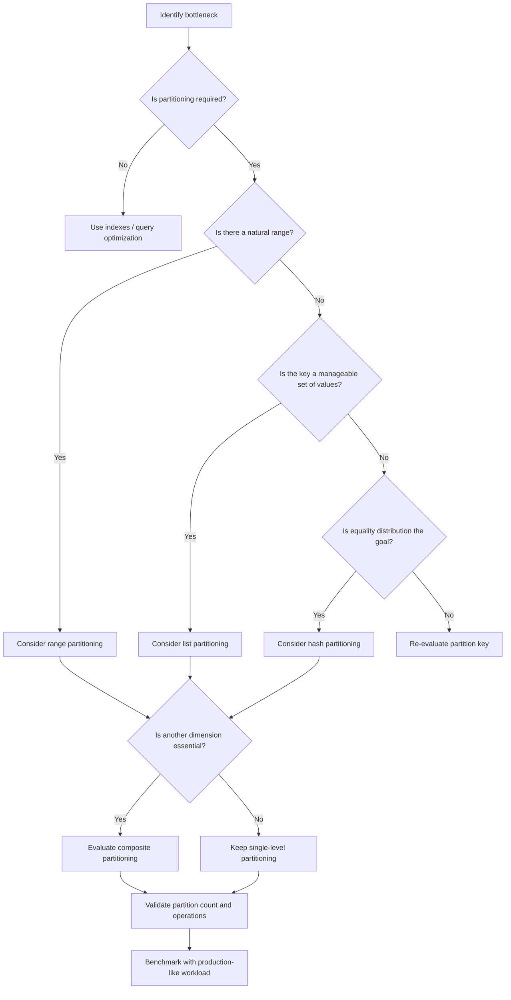

# 14- Choosing a Partition Strategy

## Overview

Partitioning is a physical data-layout strategy used to divide one logical SQL table into smaller physical partitions while preserving a single logical table interface.

The difficult part is not knowing how to create a partition. The difficult part is choosing **which partitioning strategy matches the workload**.

The primary strategies are:

| Strategy | Partition Key | Typical Use Case |
|---|---|---|
| Range | Ordered value or interval | Time-series and lifecycle-based data |
| List | Explicit discrete values | Tenant, region, status, category |
| Hash | Hash of a key | Large, relatively uniform datasets |
| Composite | Multiple partitioning dimensions | Workloads requiring multiple pruning dimensions |

A good partitioning design starts from query patterns, data growth, retention requirements, and operational constraints rather than from the size of the table alone.

## Why Partition Strategy Matters

Partitioning can improve performance by reducing the amount of data that must be considered for a query.

For example:

```sql
SELECT id, total_amount
FROM orders
WHERE created_at >= '2026-08-01'
  AND created_at < '2026-09-01';
```

With monthly range partitions, the database can potentially prune partitions outside August 2026.

The same principle applies to tenant-based partitioning:

```sql
SELECT id, status
FROM orders
WHERE tenant_id = 42;
```

With appropriate tenant partitioning, unrelated partitions can be excluded.

However, partitioning introduces additional complexity:

- More database objects.
- More indexes to maintain.
- More complicated schema changes.
- Partition lifecycle management.
- More complex backup and restore considerations.
- Potential query-planning overhead.
- Risk of excessive partition counts.

Partitioning should therefore solve a measurable problem.

## The Core Decision

A useful mental model is:

```text
Workload
   │
   ├── How are rows queried?
   ├── How do rows grow?
   ├── How are rows deleted?
   ├── How are rows distributed?
   └── What must be isolated?
           │
           ▼
    Choose partition key
           │
           ▼
    Choose partition method
           │
           ▼
    Design partition size
           │
           ▼
    Design lifecycle automation
```

The partition key should normally correspond to a value that appears frequently in selective query predicates or strongly influences data lifecycle operations.

## Partitioning Strategy Comparison

| Characteristic | Range | List | Hash | Composite |
|---|---|---|---|---|
| Key type | Ordered | Discrete values | Hash-derived | Multiple dimensions |
| Best for | Time / ranges | Tenants / categories | Uniform distribution | Multiple pruning needs |
| Pruning | Excellent for ranges | Excellent for exact values | Good for hash equality | Potentially excellent |
| Retention management | Excellent | Good | Poor | Excellent when time is included |
| Handles unknown values | Requires partition/default strategy | Requires partition/default strategy | Naturally distributes values | Depends on strategy |
| Partition count | Usually predictable | Can grow with values | Fixed and bounded | Can grow rapidly |
| Operational complexity | Low–medium | Medium | Medium | High |
| Common backend use | Events, orders, logs | Tenants, regions | High-volume entities | Tenant + time |

## Start With the Query Workload

Partitioning should begin with query analysis.

Consider a large `events` table:

```sql
CREATE TABLE events (
    id BIGINT NOT NULL,
    tenant_id BIGINT NOT NULL,
    event_type TEXT NOT NULL,
    created_at TIMESTAMPTZ NOT NULL,
    payload JSONB NOT NULL
);
```

Suppose the dominant query is:

```sql
SELECT id, event_type, created_at
FROM events
WHERE created_at >= $1
  AND created_at < $2
ORDER BY created_at DESC
LIMIT 1000;
```

Range partitioning by `created_at` is a natural candidate.

If the dominant query instead is:

```sql
SELECT id, event_type, created_at
FROM events
WHERE tenant_id = $1;
```

tenant-oriented partitioning may be more appropriate.

The important question is:

> Which attribute consistently allows the database to eliminate large amounts of irrelevant data?

## Range Partitioning

Range partitioning divides rows according to ordered ranges.

A common PostgreSQL design is:

```sql
CREATE TABLE events (
    id BIGINT NOT NULL,
    tenant_id BIGINT NOT NULL,
    event_type TEXT NOT NULL,
    created_at TIMESTAMPTZ NOT NULL
) PARTITION BY RANGE (created_at);
```

Monthly partitions might look like:

```sql
CREATE TABLE events_2026_08
PARTITION OF events
FOR VALUES FROM ('2026-08-01') TO ('2026-09-01');

CREATE TABLE events_2026_09
PARTITION OF events
FOR VALUES FROM ('2026-09-01') TO ('2026-10-01');
```

### When to Use Range Partitioning

Range partitioning is a strong choice when:

- Data has a natural ordering.
- Queries frequently use ranges.
- Data grows continuously over time.
- Old data is archived or deleted.
- Retention policies are time-based.
- Partition lifecycle can follow predictable intervals.

Typical examples:

- Application events.
- Audit logs.
- Financial transactions.
- Metrics.
- Orders.
- Sensor data.
- Kafka-ingested event tables.

### Advantages

- Excellent time-range pruning.
- Predictable partition lifecycle.
- Easy archival of old partitions.
- Easy retention management.
- Natural alignment with time-series workloads.

### Limitations

- Poor fit when queries are primarily unrelated to the range key.
- Partition boundaries must be maintained.
- Incorrect partition granularity can create too many or excessively large partitions.
- Current/future partitions require provisioning.

## List Partitioning

List partitioning maps explicit values to partitions.

Example:

```sql
CREATE TABLE orders (
    id BIGINT NOT NULL,
    tenant_id BIGINT NOT NULL,
    status TEXT NOT NULL,
    created_at TIMESTAMPTZ NOT NULL
) PARTITION BY LIST (tenant_id);
```

A tenant-specific partition can be created:

```sql
CREATE TABLE orders_tenant_42
PARTITION OF orders
FOR VALUES IN (42);
```

### When to Use List Partitioning

List partitioning works well when the partition key represents a manageable set of discrete values.

Examples:

- Tenants.
- Regions.
- Business units.
- Data classifications.
- Carefully controlled categories.

### Advantages

- Direct mapping between values and partitions.
- Strong pruning for equality predicates.
- Useful physical boundaries.
- Can simplify tenant-specific operations.

### Limitations

The major limitation is partition-count growth.

If there are:

```text
100,000 tenants
```

a partition-per-tenant design can create an operationally expensive number of partitions.

List partitioning is therefore more attractive when:

- The value cardinality is controlled.
- A small number of values dominate workload.
- Dedicated physical boundaries have operational value.

## Hash Partitioning

Hash partitioning distributes rows according to a hash of the partition key.

Example:

```sql
CREATE TABLE events (
    id BIGINT NOT NULL,
    tenant_id BIGINT NOT NULL,
    event_type TEXT NOT NULL,
    created_at TIMESTAMPTZ NOT NULL
) PARTITION BY HASH (tenant_id);
```

The number of partitions can be fixed:

```sql
CREATE TABLE events_p0
PARTITION OF events
FOR VALUES WITH (MODULUS 16, REMAINDER 0);

CREATE TABLE events_p1
PARTITION OF events
FOR VALUES WITH (MODULUS 16, REMAINDER 1);

CREATE TABLE events_p2
PARTITION OF events
FOR VALUES WITH (MODULUS 16, REMAINDER 2);
```

### When to Use Hash Partitioning

Hash partitioning is useful when:

- The key has high cardinality.
- Values are relatively evenly distributed.
- You want a bounded number of partitions.
- There is no useful natural range.
- The workload is dominated by equality lookups.

### Advantages

- Predictable partition count.
- Good distribution when the partition key has sufficient cardinality.
- Avoids maintaining explicit partitions for every key value.
- Useful for distributing write and storage pressure.

### Limitations

Hash partitioning does not naturally support lifecycle operations such as:

```text
Delete everything older than 90 days
```

because rows from different dates may be distributed across every hash partition.

It is therefore usually a poor choice when retention and archival are the primary reasons for partitioning.

## Composite Partitioning

Composite partitioning applies multiple partitioning levels.

A common design is:

```text
events
│
├── tenant 42
│   ├── 2026-08
│   └── 2026-09
│
└── tenant 84
    ├── 2026-08
    └── 2026-09
```

For example, the top-level table could be partitioned by tenant:

```sql
CREATE TABLE events (
    id BIGINT NOT NULL,
    tenant_id BIGINT NOT NULL,
    event_type TEXT NOT NULL,
    created_at TIMESTAMPTZ NOT NULL
) PARTITION BY LIST (tenant_id);
```

A tenant partition can then be partitioned by date:

```sql
CREATE TABLE events_tenant_42
PARTITION OF events
FOR VALUES IN (42)
PARTITION BY RANGE (created_at);
```

Then:

```sql
CREATE TABLE events_tenant_42_2026_08
PARTITION OF events_tenant_42
FOR VALUES FROM ('2026-08-01') TO ('2026-09-01');
```

### When to Use Composite Partitioning

Use it only when multiple dimensions provide meaningful value.

Typical examples:

- Tenant + date.
- Region + date.
- Hash + date.
- Tenant + hash for extremely large tenant workloads.

### Main Risk

Partition counts multiply.

For example:

```text
1,000 tenants × 12 monthly partitions
= 12,000 partitions
```

This can become difficult to operate even if individual queries perform well.

Composite partitioning should therefore be justified by workload requirements rather than used simply because multiple keys exist.

## Choosing the Partition Key

The partition method and partition key are separate decisions.

For example:

```text
Range(created_at)
List(tenant_id)
Hash(tenant_id)
```

The key should satisfy as many of these properties as possible:

| Property | Why It Matters |
|---|---|
| Frequently queried | Enables pruning |
| Selective | Eliminates significant data |
| Stable | Avoids row movement |
| Predictable | Makes lifecycle management easier |
| Correct cardinality | Avoids too many or too few partitions |
| Aligned with retention | Simplifies archival/deletion |
| Present in application queries | Makes pruning effective |

### Stable Keys

Partitioning works best with attributes that do not frequently change.

Changing a row's partition key can require moving the row between partitions.

For example, if a record moves from:

```text
tenant_id = 42
```

to:

```text
tenant_id = 84
```

the database may need to move it between physical partitions.

Partitioning by immutable or effectively immutable attributes is therefore generally safer.

## Query Pruning Should Drive the Decision

The key question is not:

> Which column has the most rows?

It is:

> Which partition key lets the query planner eliminate the most irrelevant partitions?

For example:

```sql
SELECT *
FROM events
WHERE created_at >= '2026-08-01'
  AND created_at < '2026-09-01';
```

A range partition on `created_at` can prune efficiently.

But:

```sql
SELECT *
FROM events
WHERE event_type = 'payment';
```

does not provide a useful restriction for that partitioning scheme.

Partitioning does not replace indexes.

A useful architecture can therefore look like:

```text
Partition pruning
      │
      ▼
Relevant partition
      │
      ▼
Index scan
      │
      ▼
Matching rows
```

## Partition Size

Choosing the number of partitions is a separate design decision.

Too few partitions:

```text
Partition A → 500 GB
Partition B → 500 GB
```

may provide insufficient pruning and maintenance benefits.

Too many:

```text
10,000 tiny partitions
```

can increase metadata and planning complexity.

The ideal size depends on:

- Database engine.
- Storage architecture.
- Query workload.
- Index size.
- Maintenance operations.
- Retention policy.
- Hardware.
- Number of concurrent queries.

There is no universal "correct partition size."

Measure the workload.

## Time Granularity

For time-based partitioning, common granularities include:

| Granularity | Typical Use |
|---|---|
| Hourly | Very high-ingest event streams |
| Daily | High-volume operational events |
| Weekly | Moderate workloads |
| Monthly | Common default for large transactional tables |
| Quarterly | Lower-volume historical data |
| Yearly | Very large retention windows with low query granularity |

Avoid creating partitions smaller than the workload requires.

For example, daily partitions may be unnecessary when:

```text
10 million rows/year
```

but may be reasonable when:

```text
500 million rows/day
```

The correct granularity is determined by query patterns and operational requirements.

## Partitioning for Retention

If the main requirement is:

```text
Delete data older than 90 days
```

range partitioning by date is usually a strong candidate.

Instead of:

```sql
DELETE FROM events
WHERE created_at < CURRENT_TIMESTAMP - INTERVAL '90 days';
```

which can generate substantial row-level work, a partitioned design can remove an entire obsolete partition.

For example:

```sql
DROP TABLE events_2026_05;
```

The exact operational procedure depends on the database, retention policy, replication, backups, and compliance requirements.

The architectural advantage is that lifecycle management operates at the partition level rather than requiring individual row deletion.

## Partitioning and Indexes

Partitioning and indexing solve different problems.

| Mechanism | Primary Purpose |
|---|---|
| Partitioning | Reduce physical data scope |
| Index | Find rows efficiently within that scope |
| Both | Reduce scope, then locate rows efficiently |

For example:

```sql
CREATE INDEX events_2026_09_type_created_idx
ON events_2026_09 (event_type, created_at DESC);
```

A query may benefit from:

```text
Query
  │
  ▼
Partition pruning
  │
  ▼
September partition
  │
  ▼
Index scan
  │
  ▼
Rows
```

Do not assume partitioning makes indexing unnecessary.

## Partitioning and Write Workloads

Partitioning can influence write behavior.

For time-based ingestion:

```text
New event
   │
   ▼
Current date partition
   │
   ▼
Index updates
   │
   ▼
WAL / storage
```

If almost all writes target the current partition, that partition becomes a natural hot spot.

Possible consequences include:

- Lock contention.
- High index activity.
- Increased I/O.
- Uneven storage growth.

Partitioning does not automatically distribute writes evenly.

If write distribution is the primary concern, hash partitioning may be more appropriate than range partitioning.

## Choosing Based on Workload

A practical decision table:

| Requirement | Preferred Strategy |
|---|---|
| Query by time range | Range |
| Time-based retention | Range |
| Query by manageable discrete value | List |
| Tenant isolation with manageable tenants | List |
| High-cardinality equality key | Hash |
| Need bounded partition count | Hash |
| Tenant + time lifecycle | Composite |
| Mostly cross-partition queries | Reconsider partitioning |
| Index already solves workload | Avoid unnecessary partitioning |

## Production Decision Framework

Use this sequence when evaluating a production table:



## A Practical Example

Consider a SaaS platform with:

```text
orders
- 2 billion rows
- 5,000 tenants
- 90-day hot data
- 7-year retention
- frequent tenant queries
- frequent date-range reporting
```

Several strategies are possible.

### Option A: List by Tenant

```text
5,000 partitions
```

This provides strong tenant pruning but introduces substantial partition-management overhead.

### Option B: Range by Date

```text
~84 monthly partitions
```

This provides excellent retention management and time-based pruning but does not directly isolate tenants.

### Option C: Tenant + Date

```text
5,000 × 84
= 420,000 potential partitions
```

This is likely excessive.

### Option D: Date Partitioning + Tenant Index

```text
~84 date partitions
+
(tenant_id, created_at) indexes
```

This can provide a much simpler design:

```text
Query
  │
  ▼
Date partition pruning
  │
  ▼
Relevant month
  │
  ▼
Tenant-aware index
  │
  ▼
Rows
```

This illustrates an important engineering principle:

> A combination of moderate partitioning and well-designed indexes can be better than highly granular composite partitioning.

## Partitioning vs Indexing

Do not introduce partitioning simply because a table is large.

Start by checking:

```sql
EXPLAIN (ANALYZE, BUFFERS)
SELECT id, status, created_at
FROM orders
WHERE tenant_id = 42
ORDER BY created_at DESC
LIMIT 100;
```

If an appropriate index provides acceptable performance:

```sql
CREATE INDEX orders_tenant_created_idx
ON orders (tenant_id, created_at DESC);
```

partitioning may add complexity without providing enough additional value.

Partitioning becomes more compelling when it provides something indexes cannot easily provide, such as:

- Large-scale data lifecycle management.
- Partition-level archival.
- Partition-level maintenance.
- Strong physical workload boundaries.
- Significant partition pruning.
- Better management of extremely large relations.

## Migration Considerations

Changing the partition strategy of a production table can be a major migration.

A safe process typically includes:

1. Analyze workload and existing indexes.
2. Select candidate partition key and strategy.
3. Build a production-like benchmark.
4. Create the new partitioned structure.
5. Backfill data incrementally.
6. Validate row counts and constraints.
7. Compare query plans.
8. Synchronize new writes.
9. Perform a controlled cutover.
10. Monitor latency, locks, storage, and replication.
11. Keep a rollback path.

Do not treat a partitioning migration as a simple schema change for a multi-billion-row production table.

## Monitoring the Chosen Strategy

Monitor both database performance and partition health.

Useful metrics include:

- Query latency.
- Rows scanned.
- Partitions scanned per query.
- Partition pruning effectiveness.
- Partition size.
- Index size.
- Partition count.
- Lock contention.
- WAL generation.
- Replication lag.
- Autovacuum activity.
- Dead tuples.
- Storage growth.
- Partition creation failures.
- Retention job failures.

For PostgreSQL, query plans are particularly valuable:

```sql
EXPLAIN (ANALYZE, BUFFERS)
SELECT *
FROM events
WHERE created_at >= '2026-08-01'
  AND created_at < '2026-09-01';
```

The goal is to verify that the database is actually pruning partitions rather than merely assuming it will.

## Security Considerations

Partitioning does not provide authorization.

For multi-tenant systems:

```text
Authentication
      │
      ▼
Authorization
      │
      ▼
Tenant context
      │
      ▼
Tenant-scoped query
      │
      ▼
Partition pruning
```

A query such as:

```sql
WHERE tenant_id = $1
```

should use a tenant identifier derived from trusted application context.

Do not treat:

```text
orders_tenant_42
```

as an authorization mechanism.

For stronger defense in depth, evaluate database-level mechanisms such as PostgreSQL Row-Level Security.

## High Availability and Disaster Recovery

Partitioning must fit the database's existing HA and recovery model.

Validate:

- Replication of all partitions.
- Backup and restore behavior.
- Schema recovery.
- Partition creation during failover.
- Partition deletion and retention procedures.
- Replica lag during large migrations.
- Disaster recovery automation.
- Cross-region replication behavior.

If partitions are treated as lifecycle units, ensure backup and retention policies do not accidentally conflict with partition deletion.

## Common Mistakes

### Partitioning Solely Because the Table Is Large

A large table can still perform well with proper indexes.

**Better:** Identify the actual bottleneck first.

### Choosing a Key That Queries Rarely Use

If queries do not restrict the partition key, pruning provides little value.

**Better:** Derive the key from real workload patterns.

### Creating Too Many Partitions

Partition count can become an operational problem.

**Better:** Keep the partition count bounded and automate lifecycle management.

### Using Hash Partitioning for Retention

Hash partitioning distributes data but does not naturally group old rows together.

**Better:** Use range partitioning when lifecycle is time-driven.

### Using List Partitioning for Huge Cardinality

One partition per tenant may become impractical with tens or hundreds of thousands of tenants.

**Better:** Consider hash partitioning, tenant-aware indexes, grouping, or stronger isolation mechanisms.

### Using Composite Partitioning by Default

Two useful partition keys do not automatically justify two partitioning levels.

**Better:** Confirm that both dimensions materially improve pruning or lifecycle operations.

### Ignoring Indexes

Partition pruning only narrows the physical scope.

**Better:** Optimize indexes inside the remaining partition.

### Ignoring Cross-Partition Queries

A partitioning strategy optimized for one query pattern may make global reporting expensive.

**Better:** Analyze both tenant-local and cross-tenant workloads.

### Assuming Partitioning Eliminates Hot Spots

A time-partitioned table may still have one extremely hot current partition.

**Better:** Measure write distribution and use an appropriate strategy for the actual bottleneck.

### Choosing Partition Size by Rule of Thumb

There is no universal partition size that works for every workload.

**Better:** Benchmark realistic data volumes and query patterns.

## Interview Perspective

A strong senior-level answer should emphasize that partitioning is a **workload-driven physical design decision**.

A concise explanation is:

> **Choose a partition strategy based on the access pattern and lifecycle of the data. Range partitioning is usually appropriate for ordered values such as timestamps and is particularly useful for retention. List partitioning works well for manageable discrete values such as tenants or regions. Hash partitioning is useful for distributing high-cardinality equality workloads while keeping partition count bounded. Composite partitioning should be used cautiously because partition counts can multiply. Before partitioning, verify that indexes and query optimization are insufficient, and validate the design using real query plans and production-like benchmarks.**

Common interview traps include:

- Saying range partitioning is always best for large tables.
- Choosing a partition key without considering query predicates.
- Confusing partitioning with indexing.
- Assuming partitioning automatically improves writes.
- Ignoring partition count.
- Ignoring retention and archival requirements.
- Ignoring cross-partition queries.
- Assuming composite partitioning is always better.
- Treating tenant partitions as security boundaries.

## Production Checklist

Before adopting a partition strategy:

- [ ] The actual performance or operational problem is documented.
- [ ] Existing indexes and query plans have been evaluated.
- [ ] Dominant query patterns are known.
- [ ] The partition key appears in important selective predicates.
- [ ] The partition key is sufficiently stable.
- [ ] Partition cardinality has been estimated for current and future data.
- [ ] Partition size and time granularity have been benchmarked.
- [ ] Retention requirements have been considered.
- [ ] Cross-partition queries have been tested.
- [ ] Indexes have been designed for individual partitions.
- [ ] Partition lifecycle automation is implemented.
- [ ] Monitoring and alerting cover partition health.
- [ ] Backup and restore procedures have been tested.
- [ ] HA and replication behavior have been validated.
- [ ] Migration and rollback procedures are documented.
- [ ] The design has been tested with production-like workload and data volume.

## Key Takeaways

- **Choose partitioning from workload and data-lifecycle requirements, not table size alone.**
- **Use range for ordered/range-oriented workloads, list for manageable discrete values, and hash for bounded distribution of high-cardinality equality workloads.**
- **Partition pruning and indexing complement each other; partitioning does not replace good indexes.**
- **Control partition count and complexity, especially when considering tenant-based or composite partitioning.**
- **Validate the strategy with real query plans, production-like benchmarks, lifecycle automation, and operational testing.**