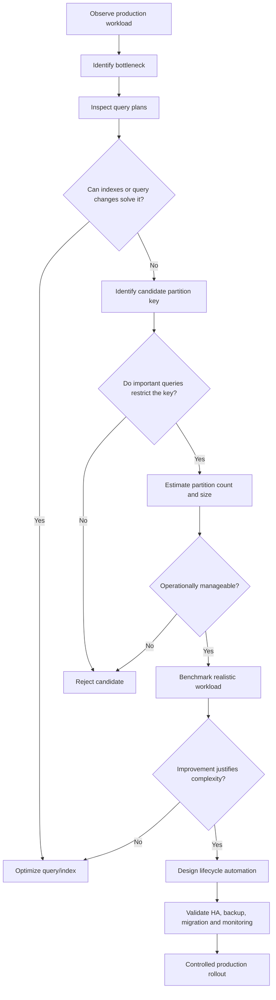

# 15- When to Partition

## Overview

Partitioning is a physical database design technique that divides a large logical table into smaller physical partitions while preserving a single logical table interface.

The key engineering question is not **"Is the table large enough to partition?"**. It is:

> **Will partitioning materially improve query performance, data lifecycle management, or operational scalability for this workload?**

Partitioning introduces both benefits and costs. It can enable partition pruning, simplify retention, reduce the physical scope of maintenance, and provide better organization of very large datasets. At the same time, it increases schema complexity, partition-management overhead, and operational surface area.

A production decision should therefore be based on:

- Query patterns.
- Data volume and growth rate.
- Data lifecycle requirements.
- Partition-key selectivity.
- Partition count.
- Index design.
- Maintenance workload.
- Availability and recovery requirements.
- Measured performance.

## What Partitioning Actually Solves

Without partitioning, a logical table may grow continuously:

```text
orders
├── 2024 data
├── 2025 data
├── 2026 data
└── future data
```

Even with indexes, the database may need to manage increasingly large indexes, tables, statistics, vacuum/maintenance workloads, backups, and scans.

With range partitioning:

```text
orders
├── orders_2024
├── orders_2025
├── orders_2026
└── orders_2027
```

A query restricted to 2026 can potentially operate only on the relevant partition:

```text
Query
  │
  ▼
Partition constraint analysis
  │
  ▼
Prune irrelevant partitions
  │
  ▼
Scan relevant partition
  │
  ▼
Use indexes / scan rows
```

Partitioning is therefore primarily about **reducing the physical scope of database work** and improving manageability.

It is not a substitute for:

- Query optimization.
- Proper indexes.
- Appropriate schema design.
- Connection management.
- Caching.
- Capacity planning.

## When Partitioning Is a Good Fit

Partitioning is generally worth evaluating when one or more of the following conditions exist.

| Condition | Why Partitioning May Help |
|---|---|
| Very large table | Limits physical scope of operations |
| Rapid table growth | Controls long-term table size |
| Time-based queries | Enables range pruning |
| Time-based retention | Enables partition-level lifecycle operations |
| Large historical dataset | Separates hot and cold data |
| Expensive maintenance | Reduces maintenance scope |
| High-cardinality equality workload | Hash partitioning may distribute data |
| Manageable tenant groups | List partitioning can isolate workloads |
| Large archival requirements | Partitions can become lifecycle units |
| Partition-aware reporting | Queries can avoid irrelevant data |

The important word is **may**. None of these conditions automatically means partitioning is required.

## When Not to Partition

A table should generally remain unpartitioned when partitioning does not solve a measurable problem.

Common examples include:

- Small or moderately sized tables.
- Tables with low growth rates.
- Workloads that frequently access the entire table.
- Queries that do not restrict the partition key.
- Systems where operational simplicity is more valuable than marginal performance gains.
- Tables where a normal index already provides sufficient performance.
- Workloads that would require an excessive number of partitions.

For example:

```sql
SELECT *
FROM users
WHERE email = $1;
```

If this query is efficiently served by:

```sql
CREATE UNIQUE INDEX users_email_idx
ON users (email);
```

partitioning may add complexity without providing meaningful value.

## The First Question: What Is the Bottleneck?

Before partitioning, establish what is actually slow.

Useful evidence includes:

```sql
EXPLAIN (ANALYZE, BUFFERS)
SELECT id, status, created_at
FROM orders
WHERE tenant_id = 42
ORDER BY created_at DESC
LIMIT 100;
```

Look for:

- Sequential scans.
- Excessive rows examined.
- Large buffer reads.
- Poor index usage.
- High execution time.
- Sort operations.
- Join explosions.
- Poor cardinality estimates.
- Lock waits.
- I/O saturation.

Partitioning should not be used to hide an incorrectly designed query.

A useful decision sequence is:

```text
Slow query
    │
    ▼
Inspect query plan
    │
    ├── Missing / incorrect index?
    │       └── Fix index
    │
    ├── Inefficient query?
    │       └── Rewrite query
    │
    ├── Excessive data lifecycle cost?
    │       └── Evaluate partitioning
    │
    └── Huge physical relation + selective partition key?
            └── Evaluate partitioning
```

## Table Size Is a Signal, Not a Rule

There is no universal row count or storage size at which partitioning becomes mandatory.

A 500 GB table may perform well with appropriate indexes and hardware.

A 50 GB table may benefit from partitioning if:

- It receives extremely high write volume.
- Data is retained for years.
- Queries are strongly time-based.
- Old data must be removed regularly.
- Maintenance is becoming operationally expensive.

The decision depends on workload characteristics rather than a single threshold.

Useful measurements include:

- Total table size.
- Total index size.
- Rows per partition candidate.
- Growth per day/month.
- Query latency.
- Rows scanned.
- Buffer reads.
- Write throughput.
- Vacuum/maintenance duration.
- Retention volume.

## Query Patterns Should Drive the Decision

Partitioning is most valuable when application queries naturally restrict the partition key.

Suppose an events table is partitioned by:

```sql
created_at
```

A query such as:

```sql
SELECT id, event_type
FROM events
WHERE created_at >= '2026-08-01'
  AND created_at < '2026-09-01';
```

can potentially prune unrelated partitions.

But:

```sql
SELECT id, event_type
FROM events
WHERE event_type = 'payment';
```

does not provide a predicate on `created_at`.

The database may therefore need to inspect many or all partitions.

This leads to a core principle:

> **Partitioning is most effective when important queries constrain the partition key.**

## Query Frequency Matters

Do not optimize only the most expensive query.

Consider the entire workload:

| Query Type | Frequency | Partition Relevance |
|---|---:|---|
| Recent events | Very high | High |
| Monthly reporting | High | High |
| Tenant lookup | Very high | Depends on key |
| Full historical export | Low | Low |
| Administrative scans | Low | Low |
| Cross-tenant analytics | High | Potentially problematic |

A partition strategy that makes one query extremely fast but makes common cross-partition queries significantly slower may be a poor overall design.

## Partitioning for Data Lifecycle

One of the strongest reasons to partition is not query speed but **data lifecycle management**.

Consider:

```text
Retention: 90 days hot
Retention: 7 years archive
```

With time-based partitions:

```text
events
├── 2026-05
├── 2026-06
├── 2026-07
├── 2026-08
└── 2026-09
```

old partitions can be managed independently.

Conceptually:

```text
Current partition
      │
      ├── Read / write
      │
      ▼
Older partition
      │
      ├── Read mostly
      │
      ▼
Expired partition
      │
      └── Archive / detach / drop
```

This can be substantially more operationally efficient than deleting millions of individual rows.

## Partitioning for Retention

A row-level delete such as:

```sql
DELETE FROM events
WHERE created_at < CURRENT_TIMESTAMP - INTERVAL '90 days';
```

may require substantial work:

- Row-level modifications.
- Index maintenance.
- WAL generation.
- Dead-tuple cleanup.
- Vacuum activity.
- Replica replay.

Partition-level lifecycle operations can avoid much of this row-by-row deletion work.

However, partition dropping is not automatically safe.

Production systems must account for:

- Legal retention requirements.
- Compliance requirements.
- Backups.
- Replication.
- Audit requirements.
- Disaster recovery.
- Archival verification.

## When Range Partitioning Makes Sense

Range partitioning is usually the first strategy to evaluate when the data has a natural ordering.

Typical partition keys include:

- `created_at`.
- `event_time`.
- `transaction_date`.
- Sequential identifiers.
- Numeric ranges.

For example:

```sql
CREATE TABLE events (
    id BIGINT NOT NULL,
    tenant_id BIGINT NOT NULL,
    event_type TEXT NOT NULL,
    created_at TIMESTAMPTZ NOT NULL
) PARTITION BY RANGE (created_at);
```

This is particularly appropriate when:

- Queries use time ranges.
- Data arrives continuously.
- Retention is time-based.
- Historical data is accessed less frequently.

## When List Partitioning Makes Sense

List partitioning is appropriate when the partition key represents a manageable set of discrete values.

Examples:

- Regions.
- Business units.
- Carefully controlled tenant groups.
- Data classifications.

For example:

```text
orders
├── region_us
├── region_eu
└── region_apac
```

It becomes less attractive when the number of values is extremely large.

Creating:

```text
1 partition per tenant
```

for hundreds of thousands of tenants is usually a strong signal to reconsider the design.

## When Hash Partitioning Makes Sense

Hash partitioning is useful when the primary objective is distributing rows across a bounded number of partitions.

For example:

```sql
CREATE TABLE events (
    id BIGINT NOT NULL,
    tenant_id BIGINT NOT NULL,
    created_at TIMESTAMPTZ NOT NULL
) PARTITION BY HASH (tenant_id);
```

It can be appropriate when:

- Equality predicates dominate.
- The partition key has high cardinality.
- Values are relatively evenly distributed.
- A fixed partition count is desirable.
- Time-based lifecycle is not the primary concern.

Hash partitioning is generally less useful for retention because rows from different dates are distributed across the hash partitions.

## When Composite Partitioning Makes Sense

Composite partitioning should be considered only when multiple dimensions provide independent and meaningful benefits.

For example:

```text
tenant
   │
   ├── 2026-08
   ├── 2026-09
   └── 2026-10
```

This may be useful for a small number of very large tenants where both tenant and time provide strong pruning.

However:

```text
5,000 tenants × 84 monthly partitions
= 420,000 potential partitions
```

can create a significant operational problem.

Composite partitioning should therefore be evaluated against:

- Partition count.
- Planning overhead.
- Schema-management complexity.
- Index count.
- Migration complexity.
- Monitoring complexity.

## Partition Count Is a First-Class Design Constraint

A partitioning strategy should be evaluated not only by query performance but also by the number of physical objects it creates.

For example:

| Strategy | Approximate Partitions |
|---|---:|
| Monthly for 7 years | 84 |
| Daily for 7 years | 2,555+ |
| 1,000 tenants | 1,000 |
| 10,000 tenants | 10,000 |
| 1,000 tenants × monthly | 84,000 |
| 10,000 tenants × monthly | 840,000 |

The exact operational impact depends on the database engine and version, but the general principle is universal:

> **Partition count should remain intentionally bounded.**

More partitions mean more:

- Metadata.
- Indexes.
- Statistics.
- Maintenance operations.
- DDL operations.
- Monitoring targets.
- Migration complexity.

## Partition Size Matters

Partitioning is not automatically better when partitions are smaller.

Too-large partitions:

```text
2026
└── 1 TB
```

may provide limited pruning and maintenance benefits.

Too-small partitions:

```text
2026-08-01
2026-08-02
2026-08-03
...
```

may create excessive metadata and planning overhead.

Choose a granularity based on:

- Data growth.
- Query ranges.
- Retention intervals.
- Maintenance duration.
- Storage characteristics.
- Database engine behavior.

## Partitioning vs Indexing

A common decision error is assuming:

```text
Large table → partition
```

when the actual problem is:

```text
Large table → missing index
```

Consider:

```sql
CREATE INDEX orders_tenant_created_idx
ON orders (tenant_id, created_at DESC);
```

This may be sufficient for:

```sql
SELECT id, status, created_at
FROM orders
WHERE tenant_id = 42
ORDER BY created_at DESC
LIMIT 100;
```

The distinction is:

| Technique | Main Benefit |
|---|---|
| Index | Finds matching rows efficiently |
| Partitioning | Narrows the physical data scope |
| Index + partitioning | Narrows scope and efficiently searches within it |

Partitioning should complement indexing rather than replace it.

## Partitioning vs Sharding

Partitioning and sharding solve different scaling problems.

| Aspect | Partitioning | Sharding |
|---|---|---|
| Scope | Usually one database | Multiple database instances |
| Logical table | Preserved | Often distributed across databases |
| Primary goal | Physical organization / pruning | Horizontal database scaling |
| Operational complexity | Lower | Much higher |
| Cross-data queries | Usually simpler | Potentially expensive |
| Data movement | Usually local | May involve network/database migration |
| Failure domain | Usually database-level | Can be shard-specific |

A system should not jump to sharding simply because a table is large.

A typical progression is:

```text
Query optimization
      │
      ▼
Indexes
      │
      ▼
Partitioning
      │
      ▼
Read replicas / caching / workload separation
      │
      ▼
Vertical scaling
      │
      ▼
Sharding
```

The actual order depends on the workload.

## When Partitioning Is Not Enough

Partitioning is not a substitute for architectural scaling.

You may need additional techniques when:

- A single database instance cannot handle the workload.
- Storage capacity exceeds practical limits.
- Write throughput exceeds instance capacity.
- CPU or memory remains saturated.
- Cross-partition queries dominate.
- One partition becomes a severe hot spot.
- Tenant isolation requires separate failure domains.

At that point, evaluate:

- Read replicas.
- Workload isolation.
- Caching.
- Queue-based processing.
- Separate analytical storage.
- Database scaling.
- Sharding.
- Data warehouse architectures.

## Hot Partition Considerations

Range partitioning can create a hot partition.

For example:

```text
events_2026_09
      │
      ├── 95% of writes
      ├── most recent reads
      └── heavy index activity
```

The existence of multiple partitions does not mean writes are evenly distributed.

This matters for:

- High-ingest event systems.
- Metrics pipelines.
- Kafka consumers.
- Celery workers.
- Bulk ingestion services.

If the workload is dominated by writes to the newest partition, measure:

- CPU.
- I/O.
- Lock contention.
- Index write cost.
- WAL generation.
- Replication lag.

## Python and Backend Application Considerations

Partitioning should normally remain transparent to application code.

A Django or FastAPI service should continue to query the logical table:

```python
query = """
SELECT id, status, created_at
FROM orders
WHERE tenant_id = %s
  AND created_at >= %s
  AND created_at < %s
ORDER BY created_at DESC
LIMIT %s
"""
```

The application should not normally need to determine:

```text
orders_2026_08
```

itself.

The database should own partition routing and pruning whenever possible.

Application-level partition selection creates additional risks:

- Incorrect partition calculation.
- Duplicated routing logic.
- Harder migrations.
- More complex application code.
- Incorrect handling of boundary timestamps.

## Time Zones and Date Partitioning

Date-based partitioning requires careful timestamp handling.

Prefer a consistent database representation such as:

```sql
created_at TIMESTAMPTZ NOT NULL
```

and define partition boundaries precisely.

For example:

```sql
FOR VALUES FROM ('2026-08-01 00:00:00+00')
             TO ('2026-09-01 00:00:00+00');
```

Avoid application logic that silently mixes:

```text
UTC
IST
local server time
user time zone
```

A timestamp that belongs to one partition in UTC may appear to belong to another calendar date in a user's local timezone.

Partition boundaries should be based on a clearly defined canonical representation.

## ORM Considerations

Frameworks such as Django can work with partitioned database designs, but partitioning is fundamentally a database-level concern.

Application developers should understand:

- Which column is the partition key.
- Which queries enable pruning.
- How migrations interact with partitions.
- How constraints are represented.
- How indexes are created.
- How partition lifecycle is automated.

Do not assume that an ORM abstraction eliminates database-specific partitioning concerns.

For critical workloads, inspect the SQL generated by the ORM and validate the resulting query plan.

## Production Signals That Indicate It Is Time to Partition

Consider partitioning when several of these signals appear together:

### Query Performance

- Queries scan increasingly large physical relations.
- Time-range queries dominate the workload.
- Partition pruning could eliminate most historical data.
- Indexes are becoming very large and difficult to maintain.

### Data Lifecycle

- Retention requires repeatedly deleting large volumes.
- Historical data is rarely accessed.
- Old data can be archived independently.
- Retention operations are generating excessive WAL or vacuum work.

### Maintenance

- Vacuum or analyze operations are becoming expensive.
- Index maintenance takes too long.
- Backups are increasingly difficult to manage.
- Large-table operations are affecting production traffic.

### Growth

- Table size is growing predictably.
- Growth can be expressed naturally as time ranges or other partition boundaries.
- Future partition creation can be automated.

## A Practical Decision Matrix

| Question | Yes | No |
|---|---|---|
| Is there a measurable problem? | Continue evaluation | Do not partition yet |
| Is the table growing rapidly? | Stronger candidate | Lower priority |
| Do queries restrict a candidate key? | Strong candidate | Weak candidate |
| Is retention based on that key? | Strong candidate | Neutral |
| Can existing indexes solve the problem? | Prefer indexes | Continue evaluation |
| Can partition count remain bounded? | Good | Reconsider |
| Are cross-partition queries uncommon? | Good | Reconsider |
| Can lifecycle operations be automated? | Good | Operational risk |
| Can the design be benchmarked? | Proceed | Gather evidence first |

## Production Decision Workflow

A disciplined partitioning evaluation can follow this process:



## Benchmark Before Production Adoption

A partitioning decision should be validated using production-like data and queries.

Measure:

| Metric | Before | After |
|---|---:|---:|
| p50 latency | Baseline | Compare |
| p95 latency | Baseline | Compare |
| p99 latency | Baseline | Compare |
| Rows examined | Baseline | Compare |
| Buffer reads | Baseline | Compare |
| CPU | Baseline | Compare |
| I/O | Baseline | Compare |
| Write latency | Baseline | Compare |
| WAL generation | Baseline | Compare |
| Maintenance duration | Baseline | Compare |

For PostgreSQL:

```sql
EXPLAIN (ANALYZE, BUFFERS)
SELECT id, event_type, created_at
FROM events
WHERE created_at >= '2026-08-01'
  AND created_at < '2026-09-01';
```

Verify that the expected partitions are actually being pruned.

Do not rely on theoretical partition pruning.

## Monitoring After Adoption

Once partitioning is introduced, monitor the partitioning system itself.

Important signals include:

- Query latency.
- Partition pruning effectiveness.
- Partitions scanned per query.
- Partition size.
- Partition count.
- Index size.
- Storage growth.
- Lock contention.
- WAL generation.
- Replication lag.
- Autovacuum behavior.
- Partition creation failures.
- Retention-job failures.

A production partitioning design should have automated alerts for missing future partitions if the application depends on continuous partition creation.

## Operational Automation

For predictable partitioning strategies, lifecycle operations should be automated.

Typical automation includes:

```text
Create future partitions
        │
        ▼
Monitor current partition
        │
        ▼
Archive eligible partitions
        │
        ▼
Detach / remove expired partitions
        │
        ▼
Verify storage and retention state
```

The automation may run through:

- CI/CD migrations.
- Scheduled database jobs.
- Celery workers.
- Kubernetes CronJobs.
- Managed database scheduling mechanisms.

Avoid relying on a developer manually creating the next partition every month.

## High Availability Considerations

Partitioning does not inherently provide high availability.

Validate:

- Replication of all partitions.
- Partition DDL behavior on replicas.
- Failover behavior.
- Replication lag during bulk migrations.
- Partition creation on the primary.
- Backup coverage.
- Restore procedures.

A partitioned table still belongs to the same database failure domain unless additional architecture is introduced.

## Disaster Recovery Considerations

Partition-level lifecycle operations must be compatible with the recovery strategy.

Before dropping or archiving a partition, determine:

- Whether the data must remain recoverable.
- Whether backups contain the partition.
- Whether archived data has been verified.
- Whether regulatory retention applies.
- Whether replicas have replayed the operation.
- Whether point-in-time recovery can restore the expected state.

A fast `DROP` operation can be operationally excellent while still being dangerous if retention and recovery procedures are not well defined.

## Cost Considerations

Partitioning can reduce operational cost by:

- Reducing unnecessary data scanned.
- Simplifying retention operations.
- Limiting maintenance scope.
- Improving storage lifecycle management.

It can also increase cost through:

- Additional indexes.
- More metadata.
- More operational automation.
- More complex monitoring.
- Migration effort.
- Engineering maintenance.

The correct question is:

> **Does the operational and performance value exceed the additional complexity?**

## Common Mistakes

### Partitioning Because the Table Is Large

Large does not automatically mean partitioned.

**Why it happens:** Table size is an easy metric to understand.

**Better approach:** Measure query, maintenance, and lifecycle problems first.

### Partitioning Without Query Pruning

If important queries do not restrict the partition key, partitioning may provide little performance benefit.

**Better approach:** Start with real query predicates and execution plans.

### Using Partitioning Instead of Indexing

Partitioning narrows physical scope but does not necessarily locate rows efficiently inside that scope.

**Better approach:** Design appropriate indexes for each partition.

### Creating Too Many Partitions

Excessive partition counts increase operational complexity.

**Better approach:** Estimate current and future partition counts before implementation.

### Using Tenant-per-Partition at Large Scale

Thousands or millions of tenants can produce an unmanageable number of partitions.

**Better approach:** Consider hash partitioning, tenant-aware indexes, tenant grouping, or sharding where appropriate.

### Using Hash Partitioning for Time-Based Retention

Hashing distributes rows but does not group old records together.

**Better approach:** Use range partitioning when lifecycle operations are time-driven.

### Ignoring Cross-Partition Queries

Analytics and administrative queries may scan many partitions.

**Better approach:** Test both selective and broad queries.

### Hard-Coding Partition Names in Application Code

Application-level routing increases coupling.

**Better approach:** Let the database perform partition routing when possible.

### Ignoring Future Partitions

A time-partitioned system can fail when new data arrives outside existing boundaries.

**Better approach:** Pre-create future partitions and alert on missing partitions.

### Assuming Partitioning Eliminates Hot Spots

A current range partition can still receive most writes.

**Better approach:** Measure write distribution and contention.

### Ignoring Migration Complexity

Partitioning an existing production table can involve significant data movement and operational risk.

**Better approach:** Design a controlled migration and rollback strategy.

## Beginner Mistakes vs Senior Engineering Practice

| Beginner Approach | Senior Practice |
|---|---|
| "The table is huge, so partition it." | Identify the measurable bottleneck first. |
| Pick the most obvious column | Analyze query and lifecycle patterns. |
| Partition without indexes | Optimize inside each partition. |
| Create many small partitions | Control partition count and size. |
| Think only about reads | Evaluate writes, maintenance, retention, and recovery. |
| Test one query | Benchmark the complete workload. |
| Manually create partitions | Automate partition lifecycle. |
| Ignore cross-partition queries | Test selective and global access patterns. |
| Assume partitioning is free | Treat complexity as an operational cost. |
| Jump to sharding | Exhaust simpler scaling options first. |

## Interview Traps

### "When should you partition a table?"

A strong answer should mention:

- Measurable workload or operational pressure.
- Partition pruning.
- Large or rapidly growing datasets.
- Data lifecycle and retention.
- Suitable partition keys.
- Partition count.
- Query patterns.
- Existing indexes.
- Operational complexity.

### "Is there a row-count threshold for partitioning?"

No universal threshold exists.

The decision depends on:

```text
Data volume
+ growth rate
+ query workload
+ lifecycle
+ hardware
+ database engine
+ maintenance cost
+ partitioning overhead
```

### "Does partitioning make every query faster?"

No.

Queries that restrict the partition key may benefit significantly. Queries spanning many or all partitions may see little benefit and can sometimes become more expensive.

### "Does partitioning replace indexes?"

No.

Partition pruning reduces the data scope. Indexes efficiently locate rows within that scope.

### "When would you choose sharding instead?"

When a single database instance or database-level partitioning can no longer meet requirements for:

- Storage.
- Write throughput.
- Compute capacity.
- Failure-domain isolation.
- Horizontal database scaling.

Sharding introduces substantially greater distributed-system complexity and should not be the default response to a large table.

## Production Checklist

Before partitioning a production table:

- [ ] A measurable performance or operational problem exists.
- [ ] Existing indexes have been evaluated.
- [ ] Query plans have been inspected.
- [ ] Dominant query patterns are documented.
- [ ] A candidate partition key is identified.
- [ ] Important queries constrain the partition key.
- [ ] Partition strategy matches the workload.
- [ ] Partition size has been estimated.
- [ ] Partition count has been estimated for future growth.
- [ ] Cross-partition queries have been tested.
- [ ] Indexes have been designed for partitions.
- [ ] Retention and archival requirements are understood.
- [ ] Future partition creation is automated.
- [ ] Expired partition handling is automated and verified.
- [ ] Backup and disaster recovery procedures are validated.
- [ ] HA and replication behavior are understood.
- [ ] Monitoring and alerting are implemented.
- [ ] Production-like benchmarking has been completed.
- [ ] Migration and rollback procedures are documented.
- [ ] Operational complexity is justified by measurable benefits.

## Key Takeaways

- **Partition when a measurable workload or lifecycle problem justifies the additional operational complexity.**
- **Choose the partition key from real query predicates and data lifecycle requirements, with partition pruning as a primary consideration.**
- **Indexes, query optimization, and partitioning solve different problems and should be evaluated together.**
- **Control partition count, size, hot spots, and cross-partition query costs before adopting a strategy.**
- **Validate partitioning with production-like benchmarks and treat lifecycle automation, HA, monitoring, backup, and recovery as part of the design.**