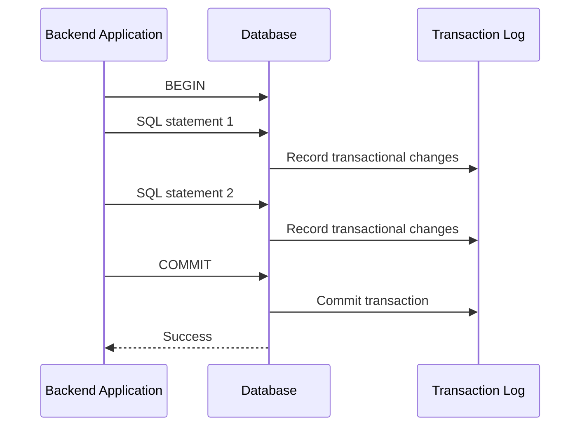
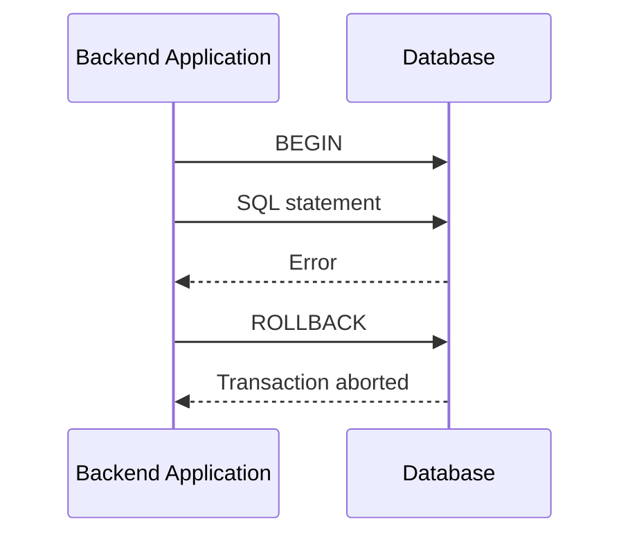

# 01- Transaction Fundamentals

## Overview

A transaction is a logical unit of database work that must transition the database from one valid state to another while preserving the required correctness guarantees.

Transactions matter because backend requests rarely perform only one independent database operation. A single business operation may insert rows, update balances, create audit records, publish state changes, or modify multiple related entities. Without transactional boundaries, a failure midway through the operation can leave persistent state inconsistent.

A transaction provides a controlled boundary around these operations:

```text
Application Request
       │
       ▼
BEGIN TRANSACTION
       │
       ├── SQL operation 1
       ├── SQL operation 2
       ├── SQL operation 3
       │
       ├── Success ─────► COMMIT
       │
       └── Failure ─────► ROLLBACK
```

Transactions are implemented by the database engine, but transaction boundaries are usually controlled by application code, ORMs, connection pools, and framework abstractions.

## Why Transactions Exist

Consider transferring money between two accounts:

```sql
UPDATE accounts
SET balance = balance - 100
WHERE id = 1;

UPDATE accounts
SET balance = balance + 100
WHERE id = 2;
```

If the first statement succeeds and the second fails, the database must not permanently retain only the debit.

The desired invariant is:

```text
Before:
Account A = 1000
Account B = 500

Transfer = 100

After:
Account A = 900
Account B = 600
```

An incomplete operation would produce:

```text
Account A = 900
Account B = 500
```

A transaction ensures that both changes are treated as one atomic unit:

```text
BEGIN
  debit A
  credit B
COMMIT
```

If any required operation fails:

```text
BEGIN
  debit A
  credit B  ← failure
ROLLBACK
```

The database returns the affected transactional changes to their previous state.

## ACID Properties

Transactions are commonly described through four properties: **Atomicity, Consistency, Isolation, and Durability**.

| Property | Meaning | Engineering Concern |
|---|---|---|
| Atomicity | Transactional work succeeds completely or is rolled back | Prevent partial updates |
| Consistency | Database constraints and application invariants remain valid | Preserve valid state |
| Isolation | Concurrent transactions are controlled according to the isolation level | Prevent unwanted concurrency anomalies |
| Durability | Committed changes survive subsequent failures according to the database's durability guarantees | Preserve committed data |

ACID is not a single implementation mechanism. Database engines use logging, locking, MVCC, WAL, checkpoints, recovery procedures, and other mechanisms to provide these guarantees.

## Transaction Lifecycle

A simplified transaction lifecycle is:



For a rollback:



The exact internal behavior differs between database engines, but the application-level lifecycle is conceptually similar.

## Explicit Transactions

SQL provides explicit transaction control:

```sql
BEGIN;

UPDATE accounts
SET balance = balance - 100
WHERE id = 1;

UPDATE accounts
SET balance = balance + 100
WHERE id = 2;

COMMIT;
```

If the operation fails:

```sql
BEGIN;

UPDATE accounts
SET balance = balance - 100
WHERE id = 1;

UPDATE accounts
SET balance = balance + 100
WHERE id = 2;

ROLLBACK;
```

The database connection maintains transaction state between these statements.

## Autocommit

Many database clients operate in **autocommit** mode by default.

In autocommit mode, an individual SQL statement is committed automatically when it succeeds.

For example:

```sql
UPDATE accounts
SET balance = balance - 100
WHERE id = 1;
```

may effectively behave like:

```sql
BEGIN;
UPDATE accounts
SET balance = balance - 100
WHERE id = 1;
COMMIT;
```

This is appropriate for genuinely independent operations.

It is unsafe when multiple statements form one business operation.

### Autocommit Risk

This code is not necessarily atomic:

```sql
UPDATE orders
SET status = 'paid'
WHERE id = 1001;

INSERT INTO payment_events(order_id, event_type)
VALUES (1001, 'payment_confirmed');
```

If the second statement fails, the order may remain marked as paid without its corresponding event.

Use an explicit transaction when the operations must succeed or fail together:

```sql
BEGIN;

UPDATE orders
SET status = 'paid'
WHERE id = 1001;

INSERT INTO payment_events(order_id, event_type)
VALUES (1001, 'payment_confirmed');

COMMIT;
```

## Transaction Boundaries

A transaction boundary should generally correspond to a coherent unit of database consistency.

A useful question is:

> Which database changes must either all become visible or none become visible?

For example, creating an order may involve:

```text
Create order
     │
     ├── Insert order
     ├── Insert order items
     ├── Reserve inventory
     └── Create order state record
```

If all of these operations are required to establish a valid order, they may belong in one transaction.

Do not automatically wrap an entire request in a transaction simply because the request accesses the database.

Transaction scope should be intentional.

## Commit

`COMMIT` makes the transaction's changes permanent according to the database's durability semantics.

```sql
BEGIN;

INSERT INTO orders(customer_id, total_amount)
VALUES (42, 125.00);

COMMIT;
```

After a successful commit, application code should treat the database state as persisted.

A transaction should normally be committed only after all required database work succeeds.

## Rollback

`ROLLBACK` aborts the current transaction and discards its uncommitted changes.

```sql
BEGIN;

UPDATE inventory
SET quantity = quantity - 1
WHERE product_id = 100;

ROLLBACK;
```

The update does not remain as a committed database change.

Rollback is especially important for exceptions in application code.

## Savepoints

A savepoint creates an intermediate rollback point inside a transaction.

```sql
BEGIN;

INSERT INTO orders(customer_id, total_amount)
VALUES (42, 125.00);

SAVEPOINT optional_step;

INSERT INTO order_metadata(order_id, key, value)
VALUES (1001, 'source', 'mobile');

ROLLBACK TO SAVEPOINT optional_step;

COMMIT;
```

The transaction remains active, but changes after the savepoint can be rolled back.

Savepoints are useful when a transaction contains optional or independently recoverable operations.

They should not be used as a substitute for thoughtful transaction design.

## Consistency and Constraints

Database consistency is not only about transactions.

Databases enforce consistency through mechanisms such as:

- `PRIMARY KEY`
- `FOREIGN KEY`
- `UNIQUE`
- `CHECK`
- `NOT NULL`
- Exclusion constraints where supported
- Triggers where appropriate

For example:

```sql
CREATE TABLE accounts (
    id BIGSERIAL PRIMARY KEY,
    balance NUMERIC(19, 4) NOT NULL,
    CONSTRAINT positive_balance
        CHECK (balance >= 0)
);
```

A transaction can ensure that multiple changes are atomic, while constraints ensure that individual states remain valid.

Strong database design combines both.

## Transactional Consistency Example

Suppose an order must have at least one order item.

A transaction can group:

```text
Order creation
      │
      ├── orders INSERT
      │
      └── order_items INSERT
```

But a transaction alone does not necessarily enforce the invariant that an order must always contain an item.

This distinction is important:

```text
Transaction
    │
    └── Controls how changes are grouped

Constraints
    │
    └── Control which states are valid
```

Senior database design uses both mechanisms intentionally.

## Transactions in PostgreSQL

PostgreSQL uses MVCC (Multi-Version Concurrency Control) to manage concurrent transactions.

A simplified model is:

```text
Transaction A
     │
     ├── Reads visible row version
     └── Writes new row version
                 │
                 ▼
             PostgreSQL
                 │
Transaction B ───┘
```

PostgreSQL transactions interact with:

- MVCC snapshots.
- Row and table locks.
- WAL.
- Isolation levels.
- Constraint checking.
- Vacuum and transaction visibility management.

The application should not need to manage MVCC internals directly, but transaction design must account for their operational consequences.

## Transaction Isolation

Multiple transactions can execute concurrently.

For example:

```text
Transaction A          Transaction B
     │                      │
     ├── Read row           │
     │                      ├── Update row
     │                      └── Commit
     │
     └── Continue
```

Without isolation rules, concurrent transactions can observe or create states that application developers did not expect.

Common isolation levels include:

| Isolation Level | General Behavior | Typical Use |
|---|---|---|
| Read Uncommitted | Allows the weakest visibility guarantees; exact behavior is database-specific | Rarely appropriate |
| Read Committed | Each statement generally sees data committed before that statement begins | Common PostgreSQL default |
| Repeatable Read | Transaction maintains a stable snapshot for reads | Consistent multi-statement reads |
| Serializable | Provides the strongest standard isolation semantics | Critical correctness requirements |

Isolation levels are covered in depth in the concurrency portion of this section.

## Transactions and Locks

Transactions frequently interact with locks.

For example:

```sql
BEGIN;

SELECT *
FROM accounts
WHERE id = 1
FOR UPDATE;

UPDATE accounts
SET balance = balance - 100
WHERE id = 1;

COMMIT;
```

`FOR UPDATE` requests a row-level lock so concurrent transactions cannot simultaneously modify the selected row in conflicting ways.

The transaction owns the lock until it commits or rolls back.

This creates an important production rule:

> Long transactions can create long-lived locks.

## Transaction Duration

Keep transactions as short as practical.

Avoid:

```text
BEGIN
  │
  ├── Database query
  ├── HTTP request
  ├── External API call
  ├── Large computation
  ├── User interaction
  └── COMMIT
```

Prefer:

```text
External preparation
       │
       ▼
Short database transaction
       │
       ├── Validate current state
       ├── Modify required rows
       └── COMMIT
```

External network calls should generally not occur while holding database locks unless the architecture explicitly requires that behavior.

Long transactions increase the risk of:

- Lock contention.
- Deadlocks.
- Connection pool exhaustion.
- MVCC cleanup pressure.
- Increased rollback cost.
- Poor latency under concurrency.

## Python Transaction Example

With a DB-API-compatible PostgreSQL client, transaction boundaries are typically controlled through the connection.

Conceptually:

```python
with connection:
    with connection.cursor() as cursor:
        cursor.execute(
            """
            UPDATE accounts
            SET balance = balance - %s
            WHERE id = %s
            """,
            (100, 1),
        )

        cursor.execute(
            """
            UPDATE accounts
            SET balance = balance + %s
            WHERE id = %s
            """,
            (100, 2),
        )
```

The context manager pattern allows the connection to commit on successful completion and roll back when an exception escapes the block, depending on the client implementation.

Always verify the transaction semantics of the specific driver being used.

## Django Transactions

Django provides `transaction.atomic()` for transaction boundaries.

```python
from django.db import transaction

@transaction.atomic
def transfer_funds(source_id: int, destination_id: int, amount: int) -> None:
    source = Account.objects.select_for_update().get(id=source_id)
    destination = Account.objects.select_for_update().get(id=destination_id)

    if source.balance < amount:
        raise ValueError("Insufficient funds")

    source.balance -= amount
    destination.balance += amount

    source.save(update_fields=["balance"])
    destination.save(update_fields=["balance"])
```

The important design elements are:

- `atomic()` defines the transaction boundary.
- `select_for_update()` protects concurrently modified rows.
- Validation occurs inside the transaction when it depends on current database state.
- The transaction remains focused on database work.

## FastAPI Transaction Boundaries

FastAPI does not itself define database transaction semantics. The database driver, SQLAlchemy, or another database abstraction provides them.

A typical SQLAlchemy-style pattern is:

```python
def create_order(session, customer_id: int, total: int):
    with session.begin():
        order = Order(
            customer_id=customer_id,
            total_amount=total,
        )
        session.add(order)

        session.add(
            OrderEvent(
                customer_id=customer_id,
                event_type="created",
            )
        )
```

The exact transaction behavior depends on the SQLAlchemy configuration and session lifecycle.

The key architectural principle remains the same:

```text
API handler
    │
    ▼
Application service
    │
    ▼
Transaction boundary
    │
    ├── Database operation
    ├── Database operation
    └── Database operation
```

## Transactions and Connection Pools

A transaction belongs to a database connection/session.

This is important when using connection pools.

Conceptually:

```text
Application
    │
    ▼
Connection Pool
    │
    ├── Connection 1 → Transaction A
    ├── Connection 2 → Transaction B
    └── Connection 3 → Idle
```

A connection participating in an open transaction must not be returned to general application use while the transaction remains active.

Poor transaction management can therefore consume the connection pool even when database CPU utilization is low.

Symptoms may include:

- Requests waiting for connections.
- Increasing application latency.
- Database connections remaining `idle in transaction`.
- Cascading timeouts.

## Idle in Transaction

An application that begins a transaction and then performs no database work can still hold transactional state and potentially locks.

Conceptually:

```text
BEGIN
  │
  ├── SELECT
  │
  ├── Application waits
  │
  ├── Application performs HTTP request
  │
  └── COMMIT
```

This is dangerous in production.

Avoid keeping transactions open while:

- Calling external APIs.
- Waiting for Kafka.
- Waiting for Celery tasks.
- Performing large CPU-intensive computations.
- Waiting for user input.
- Sleeping or retrying.

## Transactions and External Systems

A database transaction does not automatically include external systems.

For example:

```text
PostgreSQL transaction
        │
        ├── UPDATE order
        │
        └── COMMIT

Kafka publish
        │
        └── separate system
```

This creates a failure window:

```text
DB COMMIT succeeds
       │
       ▼
Kafka publish fails
```

The database cannot automatically roll back the committed transaction because Kafka publishing failed.

For reliable database-to-event integration, patterns such as the **transactional outbox** are often preferable.

```text
BEGIN
  │
  ├── Update business state
  └── Insert outbox event
  │
  ▼
COMMIT
  │
  ▼
Outbox publisher
  │
  ▼
Kafka
```

The outbox pattern belongs to distributed transaction design rather than basic transaction control, but the distinction is critical in backend systems.

## Transactions and HTTP Requests

A REST request may contain several database operations:

```text
HTTP Request
    │
    ▼
Authentication
    │
    ▼
Business Logic
    │
    ▼
Transaction
    ├── Validate
    ├── Update
    ├── Insert audit record
    └── Commit
    │
    ▼
HTTP Response
```

Authentication, authorization, and expensive external work do not necessarily need to occur inside the transaction.

Keep the transaction around the smallest coherent set of database changes that must be atomic.

## Nested Transactions

Application code can contain nested transaction abstractions:

```python
with transaction.atomic():
    operation_a()

    with transaction.atomic():
        operation_b()
```

In systems such as Django, nested `atomic()` blocks are implemented using savepoints rather than independent database transactions on the same connection.

This distinction matters:

```text
Outer transaction
      │
      ├── Operation A
      │
      ├── Savepoint
      │     └── Operation B
      │
      └── Commit
```

A nested transaction abstraction does not necessarily mean that the inner block can independently commit changes permanently.

## Error Handling

A failed SQL statement can place a transaction into an aborted state in databases such as PostgreSQL.

For example:

```sql
BEGIN;

INSERT INTO users(id, email)
VALUES (1, 'existing@example.com');

SELECT * FROM users;

COMMIT;
```

If the `INSERT` violates a constraint, subsequent commands may fail until the transaction is rolled back.

Application code should therefore handle transaction errors at the transaction boundary.

Conceptually:

```python
try:
    with transaction():
        perform_database_work()
except DatabaseError:
    handle_failure()
```

Do not blindly continue executing database operations after a transaction has entered an error state.

## Retryable Transactions

Some transaction failures are transient.

Examples include:

- Deadlocks.
- Serialization failures.
- Temporary connection failures.

A retry may be appropriate, but the **entire transaction** should generally be retried rather than an arbitrary statement.

```text
Attempt 1
  │
  ├── BEGIN
  ├── operation A
  ├── operation B
  └── serialization failure
          │
          ▼
       ROLLBACK
          │
          ▼
Attempt 2
  │
  ├── BEGIN
  ├── operation A
  ├── operation B
  └── COMMIT
```

Retry logic must be bounded and must account for idempotency.

## Idempotency

Retries can duplicate business effects if an operation is not idempotent.

For example:

```text
POST /payments
     │
     ├── Database transaction
     ├── Commit
     └── Response lost
```

The client may retry the request.

Without an idempotency mechanism, the payment operation could execute twice.

A common solution is an idempotency key:

```sql
CREATE UNIQUE INDEX payments_idempotency_key_idx
ON payments(idempotency_key);
```

Then the transaction can safely enforce uniqueness.

Transactions and idempotency solve different problems:

```text
Transaction
    └── Atomicity within a database transaction

Idempotency
    └── Safe repeated execution of a logical request
```

## Transactional DDL

DDL behavior varies by database engine.

PostgreSQL supports transactional DDL for many operations:

```sql
BEGIN;

CREATE TABLE audit_events (
    id BIGSERIAL PRIMARY KEY,
    event_type TEXT NOT NULL
);

ROLLBACK;
```

The exact transactional semantics depend on the SQL operation and database engine.

Do not assume that transaction behavior is identical across PostgreSQL, MySQL, SQL Server, Oracle, and other systems.

## Monitoring Transactions

Production monitoring should include transaction-related database health.

Useful signals include:

| Metric | Why It Matters |
|---|---|
| Transaction duration | Identifies long-running transactions |
| Active transactions | Shows concurrency pressure |
| `idle in transaction` sessions | Detects application transaction leaks |
| Lock wait time | Detects contention |
| Deadlocks | Indicates conflicting concurrency patterns |
| Connection pool utilization | Detects application-side resource pressure |
| Rollback rate | Indicates transaction failures |
| Commit rate | Indicates transaction workload |
| Replication lag | Can be affected by write workload and long transactions |

In PostgreSQL, inspect active sessions with:

```sql
SELECT
    pid,
    usename,
    state,
    xact_start,
    query_start,
    wait_event_type,
    wait_event,
    query
FROM pg_stat_activity
WHERE xact_start IS NOT NULL
ORDER BY xact_start;
```

Long-running transactions deserve investigation rather than simply increasing timeouts.

## Production Best Practices

### Keep Transactions Short

Do only the work required to maintain database consistency.

```text
Good:
BEGIN
  validate current state
  update rows
  insert related rows
COMMIT
```

Avoid:

```text
BEGIN
  database work
  network call
  large computation
  sleep
  database work
COMMIT
```

### Lock Only What Is Necessary

Locks protect correctness but reduce concurrency.

Prefer targeted row-level locking where appropriate:

```sql
SELECT id, balance
FROM accounts
WHERE id = 42
FOR UPDATE;
```

Do not lock entire tables when row-level coordination is sufficient.

### Validate Inside the Transaction When Required

A validation based on mutable database state can become stale if performed too early.

Unsafe pattern:

```text
Read balance
    │
    ▼
Perform unrelated work
    │
    ▼
Start transaction
    │
    ▼
Update balance
```

Prefer:

```text
BEGIN
    │
    ├── Lock/read current state
    ├── Validate invariant
    ├── Modify state
    └── COMMIT
```

### Avoid User-Controlled Transaction Duration

Do not allow a transaction to remain open while waiting for a client or external dependency.

### Make Transaction Boundaries Explicit

Application code should make it clear which operations must be atomic.

Avoid spreading transaction management unpredictably across repository, service, and controller layers.

## Common Mistakes

### Treating Multiple Statements as Automatically Atomic

This is false under autocommit.

```sql
UPDATE accounts ...;
UPDATE accounts ...;
```

Two statements do not automatically form one transaction.

Use an explicit transaction when both operations must succeed together.

### Holding Transactions Across Network Calls

This creates unnecessary lock duration and connection pressure.

Move network operations outside the transaction whenever possible.

### Catching Exceptions Inside a Transaction and Continuing

For databases that mark a transaction as failed after an SQL error, continuing to execute SQL can produce additional failures.

Handle the error at an appropriate transaction boundary or roll back to a savepoint.

### Retrying Only One Statement

Retrying an individual statement inside a failed or partially completed transaction can violate the intended business operation.

Retry the complete transaction when the failure is safely retryable.

### Assuming Commit Means External Work Succeeded

A successful database commit does not imply that Kafka, Redis, an HTTP service, or another database also succeeded.

Use appropriate distributed-systems patterns.

### Using Transactions as a Replacement for Constraints

Transactions do not replace:

```sql
UNIQUE
FOREIGN KEY
CHECK
NOT NULL
```

Use database constraints to enforce invariants whenever the database can enforce them directly.

### Making Transactions Too Large

Large transactions increase:

- Lock duration.
- WAL generation.
- Rollback cost.
- Replication pressure.
- Resource consumption.

For bulk operations, consider batching work into smaller units when business correctness allows it.

## Security Considerations

Transactions do not provide authorization.

For example:

```text
BEGIN
UPDATE account WHERE id = requested_id
COMMIT
```

does not prove that the authenticated user owns the account.

Authorization must be enforced separately:

```text
Authenticate
    │
    ▼
Authorize resource access
    │
    ▼
Begin transaction
    │
    ▼
Perform protected database operation
    │
    ▼
Commit
```

Use parameterized queries to prevent SQL injection:

```python
cursor.execute(
    "UPDATE accounts SET balance = %s WHERE id = %s",
    (new_balance, account_id),
)
```

Do not construct SQL using string interpolation with untrusted input.

## High Availability Considerations

Transactions influence availability under contention.

Long-running transactions can:

- Hold locks.
- Delay conflicting operations.
- Increase replication pressure.
- Consume connection resources.
- Increase recovery work.

In high-availability systems, transaction design should therefore be evaluated under concurrent load rather than only in single-user tests.

## Disaster Recovery Considerations

Durability depends on database configuration and operational architecture.

Production systems should define:

- Backup strategy.
- Point-in-time recovery requirements.
- WAL/log retention.
- Replication strategy.
- Recovery objectives.
- Restore testing procedures.

A transaction's `COMMIT` provides database-level durability semantics; it does not replace backups or disaster recovery planning.

## Interview Questions

### What is a transaction?

A transaction is a logical unit of database work whose operations are managed as one consistency boundary, typically providing atomicity, consistency, isolation, and durability guarantees.

### Why are transactions necessary?

They prevent partial application of related database changes when those changes must succeed or fail together.

### What happens when a transaction is rolled back?

Uncommitted changes from that transaction are discarded according to the database's transaction semantics.

### What is autocommit?

Autocommit commits successful statements individually unless an explicit transaction is started.

### What is a savepoint?

A savepoint establishes an intermediate rollback point inside a transaction, allowing part of the transaction to be rolled back without necessarily aborting the entire transaction.

### Why should transactions be short?

Long transactions can hold locks, consume connection resources, increase contention, increase rollback cost, and interfere with MVCC cleanup and replication.

### Does a transaction include Kafka or an HTTP API automatically?

No. A database transaction normally controls operations within that database system. External systems require distributed coordination patterns such as transactional outbox or other appropriate designs.

### Should retries repeat the entire transaction?

For retryable transaction failures such as serialization failures, generally yes. The transaction should be restarted from a fresh transaction boundary, with bounded retries and appropriate idempotency.

## Transaction Design Checklist

Before introducing a transaction, ask:

- [ ] Which database changes must be atomic?
- [ ] What invariants must remain valid?
- [ ] Can database constraints enforce those invariants?
- [ ] What is the smallest correct transaction boundary?
- [ ] Could the transaction hold locks for too long?
- [ ] Are any network calls occurring inside it?
- [ ] Is the transaction interacting with external systems?
- [ ] Could the operation be retried?
- [ ] Is the operation idempotent?
- [ ] What isolation level is required?
- [ ] Could concurrent requests modify the same rows?
- [ ] Are row locks required?
- [ ] What happens on deadlock or serialization failure?
- [ ] How does the connection pool behave during the transaction?
- [ ] Are long-running transactions monitored?
- [ ] Are rollback paths tested?
- [ ] Are database constraints used where appropriate?

## Key Takeaways

- **A transaction defines a database consistency boundary; use it when multiple changes must succeed or fail as one unit.**
- **ACID describes transaction guarantees, while the database implements them through mechanisms such as WAL, MVCC, locking, and recovery.**
- **Keep transactions short and avoid holding database connections or locks during external calls, long computations, or user-controlled waits.**
- **Transactions do not automatically coordinate external systems; use patterns such as the transactional outbox when database state and events must remain reliably synchronized.**
- **Production transaction design must account for isolation, locking, retries, idempotency, connection pools, monitoring, and failure recovery.**