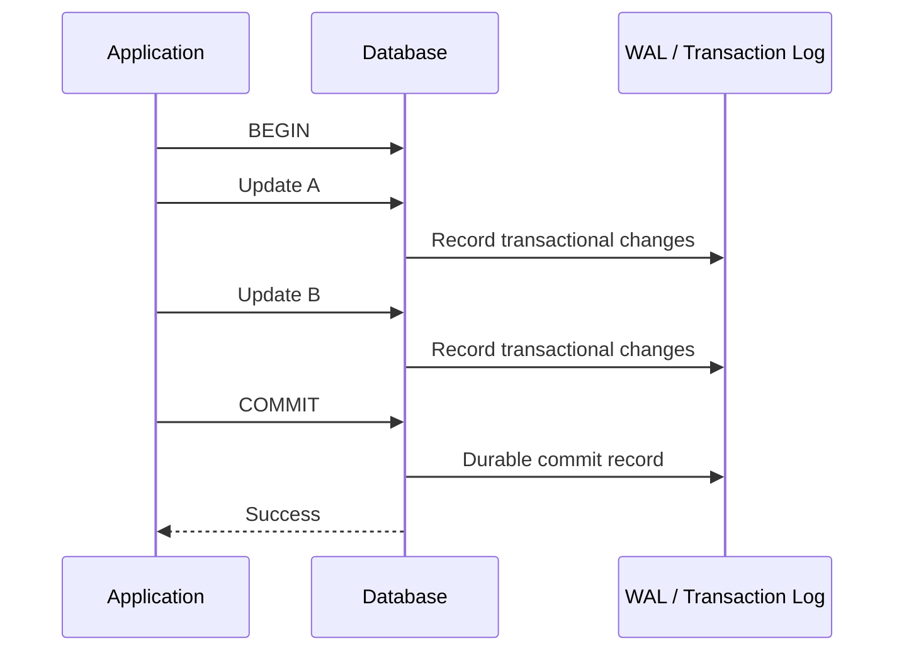
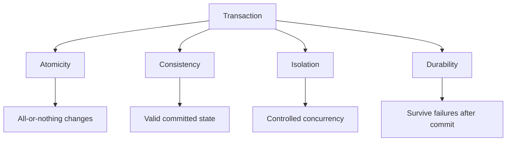

# 02- ACID Properties

## Overview

ACID describes the core guarantees expected from reliable database transactions:

- **Atomicity** — a transaction is treated as one logical unit of work.
- **Consistency** — committed transactions preserve database invariants and constraints.
- **Isolation** — concurrent transactions do not produce effects outside the guarantees of the selected isolation level.
- **Durability** — once a transaction is committed, its changes survive failures according to the database's durability configuration.

ACID is not a single feature or switch. Database engines implement these guarantees using mechanisms such as transaction logs, WAL, MVCC, locks, snapshots, constraint enforcement, checkpoints, and crash recovery.

For backend engineers, ACID matters because application correctness often depends on several database operations behaving as one reliable unit.

```text
                    Transaction
                         │
          ┌──────────────┼──────────────┐
          ▼              ▼              ▼
      Atomicity      Consistency    Isolation
          │              │              │
          └──────────────┼──────────────┘
                         ▼
                    Durability
                         │
                         ▼
                Reliable database state
```

## Atomicity

### What It Is

Atomicity means that the operations belonging to a transaction are treated as one logical unit:

```text
All required changes succeed
        OR
None of them become committed
```

Consider a bank transfer:

```sql
BEGIN;

UPDATE accounts
SET balance = balance - 100
WHERE id = 1;

UPDATE accounts
SET balance = balance + 100
WHERE id = 2;

COMMIT;
```

If the credit operation fails, the debit must not remain committed as an isolated change.

```text
Before
Account A = 1000
Account B = 500

Transfer = 100

Successful transaction
Account A = 900
Account B = 600

Failed transaction
Account A = 1000
Account B = 500
```

### Why It Exists

Without atomicity, a multi-step business operation can leave partially applied state.

Typical examples include:

- Creating an order and its order items.
- Moving money between accounts.
- Updating inventory and creating a reservation.
- Updating a user's state and writing an audit record.
- Creating related rows across multiple tables.

### How It Works

The database maintains transactional state and records enough information to commit or undo changes.

A simplified model is:



The exact implementation differs between database engines.

### Production Considerations

Atomicity applies to the database transaction boundary, not automatically to external systems.

For example:

```text
PostgreSQL
    │
    ├── UPDATE order
    ├── INSERT outbox event
    └── COMMIT
            │
            ▼
        Kafka publish
```

A PostgreSQL transaction cannot automatically roll back because a subsequent Kafka operation fails.

For database-to-event consistency, the transactional outbox pattern is often appropriate:

```sql
BEGIN;

UPDATE orders
SET status = 'paid'
WHERE id = 1001;

INSERT INTO outbox_events(event_type, aggregate_id)
VALUES ('order_paid', 1001);

COMMIT;
```

A separate publisher can then deliver the outbox event to Kafka.

### Common Mistake

Assuming that several SQL statements are atomic merely because they are part of the same request.

They are not necessarily atomic under autocommit:

```sql
UPDATE orders ...;
INSERT INTO audit_events ...;
```

If both must succeed or fail together, establish an explicit transaction.

## Consistency

### What It Is

Consistency means that a committed transaction preserves the database's defined correctness rules.

Those rules can include:

- Primary keys.
- Foreign keys.
- Unique constraints.
- Check constraints.
- Not-null constraints.
- Exclusion constraints.
- Trigger-enforced rules.
- Application-level invariants that are deliberately protected by transactional logic.

For example:

```sql
CREATE TABLE accounts (
    id BIGSERIAL PRIMARY KEY,
    balance NUMERIC(19, 4) NOT NULL,
    CONSTRAINT positive_balance
        CHECK (balance >= 0)
);
```

A transaction that attempts to violate the `CHECK` constraint cannot successfully commit that invalid row state.

### Why It Exists

A database is valuable only if its persisted state remains valid.

Without consistency guarantees, applications can create states such as:

```text
Order references customer 999
but customer 999 does not exist
```

or:

```text
Account balance = -500
when negative balances are prohibited
```

### How It Works

Consistency is achieved through a combination of database constraints and transaction semantics.

```text
Application
    │
    ▼
Transaction
    │
    ├── SQL operations
    │
    ├── Constraint checks
    │
    ├── Referential integrity
    │
    └── Commit validation
             │
             ▼
       Valid committed state
```

A useful distinction is:

```text
Atomicity
    = Are related changes applied as one unit?

Consistency
    = Is the resulting committed state valid?
```

Atomicity alone does not guarantee that an invalid state cannot be committed.

### Database Constraints vs Application Validation

Prefer database constraints for invariants the database can enforce.

For example, application code may perform:

```python
if email_exists(email):
    raise ValueError("Email already exists")
```

Under concurrency, two requests can both observe that the email does not exist.

A database-level constraint is stronger:

```sql
CREATE UNIQUE INDEX users_email_unique_idx
ON users(email);
```

The database becomes the final authority.

Application validation remains useful for user-friendly error handling, but it should not replace a database constraint when uniqueness must be guaranteed.

### Production Considerations

Consistency should be evaluated under concurrency, not only in sequential tests.

An invariant such as:

```text
inventory.quantity >= 0
```

may require both:

- A database constraint.
- Correct transactional coordination when multiple requests modify inventory concurrently.

For example:

```sql
BEGIN;

SELECT quantity
FROM inventory
WHERE product_id = 100
FOR UPDATE;

UPDATE inventory
SET quantity = quantity - 1
WHERE product_id = 100;

COMMIT;
```

The constraint protects the valid state; the locking and transaction design protect the concurrent operation.

## Isolation

### What It Is

Isolation controls how concurrent transactions interact with each other.

Consider two requests:

```text
Transaction A              Transaction B
     │                          │
     ├── Read account           │
     │                          ├── Update account
     │                          ├── Commit
     │                          │
     └── Continue               │
```

The database must define what Transaction A can observe and how concurrent modifications are coordinated.

Isolation is therefore closely related to:

- MVCC.
- Locks.
- Snapshots.
- Isolation levels.
- Serialization.
- Deadlocks.
- Concurrent updates.

### Why It Exists

Backend systems routinely execute many requests concurrently.

Without appropriate isolation semantics, concurrent transactions can produce anomalies such as:

- Dirty reads.
- Non-repeatable reads.
- Phantom reads.
- Lost updates.
- Write skew.
- Serialization anomalies.

The exact behavior depends on the database engine and isolation level.

### Isolation Levels

Common SQL isolation levels are:

| Isolation Level | General Guarantee | Typical Trade-off |
|---|---|---|
| Read Uncommitted | Weakest isolation | High concurrency, weak guarantees |
| Read Committed | Reads generally observe committed data | Common practical default |
| Repeatable Read | Stronger consistency for transaction reads | More contention/conflicts |
| Serializable | Transactions behave as if executed serially | Lowest concurrency potential |

PostgreSQL's default isolation level is **Read Committed**.

PostgreSQL also implements isolation using MVCC rather than relying exclusively on traditional blocking locks.

### MVCC

MVCC stands for **Multi-Version Concurrency Control**.

Instead of requiring every reader to block every writer, the database can maintain multiple row versions and determine which version is visible to a transaction.

Conceptually:

```text
Row versions

v1 ──────► v2 ──────► v3
 │          │          │
 ▼          ▼          ▼
older      newer      newest

Transaction snapshot determines
which version is visible
```

This allows many reads and writes to proceed concurrently while maintaining defined isolation semantics.

### Locks and Isolation

Isolation does not mean that locks are unnecessary.

When an operation requires explicit coordination, row-level locking can be appropriate:

```sql
BEGIN;

SELECT id, balance
FROM accounts
WHERE id = 42
FOR UPDATE;

UPDATE accounts
SET balance = balance - 100
WHERE id = 42;

COMMIT;
```

The lock protects the row until the transaction ends.

### Production Considerations

Higher isolation is not automatically better.

Increasing isolation can increase:

- Lock contention.
- Serialization failures.
- Transaction retries.
- Latency.
- Throughput costs.

Choose isolation based on the correctness requirements of the operation.

For example:

```text
Simple read
    └── Read Committed may be sufficient

Complex invariant under concurrency
    └── Stronger isolation or explicit locking may be required
```

## Durability

### What It Is

Durability means that after a successful commit, the database preserves the transaction's committed state across subsequent failures according to its durability configuration.

A successful:

```sql
COMMIT;
```

should not normally mean:

```text
"Maybe the database will remember this later."
```

It means the database has accepted the transaction as committed under its configured durability guarantees.

### Why It Exists

Without durability, a successful request could return:

```text
HTTP 200 OK
```

while the corresponding database changes disappear after a crash.

Durability is essential for systems such as:

- Payments.
- Orders.
- Financial ledgers.
- Inventory.
- User accounts.
- Audit records.

### How It Works

Database engines typically use write-ahead logging or equivalent mechanisms.

A simplified PostgreSQL-style flow is:

```text
Application
    │
    ▼
Database transaction
    │
    ├── Modify data
    │
    ▼
Write-Ahead Log
    │
    ▼
Commit record
    │
    ▼
Durability boundary
    │
    ▼
Data pages persisted later
```

The important concept is that durable logging can allow the database to recover committed changes even if modified data pages had not yet been written to their final locations.

### WAL

PostgreSQL uses **Write-Ahead Logging (WAL)**.

The basic principle is:

> The database records the necessary log information before relying on the corresponding data-page changes being safely persisted.

After a crash, recovery can use WAL to reconstruct committed changes and discard incomplete transactional work.

### Durability and Performance

Durability has a performance cost.

Forcing data or log records through a durable storage boundary can increase commit latency.

Production database configuration therefore balances:

```text
Durability
    vs
Commit latency
    vs
Throughput
```

For critical systems, do not weaken durability simply to improve benchmark numbers without understanding the failure guarantees being sacrificed.

## Putting ACID Together

The four properties address different failure and concurrency problems.



A single transaction can rely on all four:

```text
BEGIN
  │
  ├── Read current state
  ├── Validate invariants
  ├── Modify multiple rows
  ├── Write audit/outbox records
  │
  └── COMMIT
        │
        ├── Atomic
        ├── Consistent
        ├── Isolated
        └── Durable
```

## Practical Backend Example

Consider an order checkout operation.

The business operation requires:

1. Verify inventory.
2. Reserve inventory.
3. Create the order.
4. Create order items.
5. Record an outbox event.

A simplified transaction might be:

```sql
BEGIN;

SELECT product_id, quantity
FROM inventory
WHERE product_id IN (100, 200)
FOR UPDATE;

UPDATE inventory
SET quantity = quantity - 2
WHERE product_id = 100;

UPDATE inventory
SET quantity = quantity - 1
WHERE product_id = 200;

INSERT INTO orders(customer_id, status, total_amount)
VALUES (42, 'confirmed', 129.99);

INSERT INTO order_items(order_id, product_id, quantity)
VALUES
    (1001, 100, 2),
    (1001, 200, 1);

INSERT INTO outbox_events(event_type, aggregate_id)
VALUES ('order_confirmed', 1001);

COMMIT;
```

The ACID reasoning is:

| Property | Checkout Example |
|---|---|
| Atomicity | Order, items, inventory, and outbox record commit together |
| Consistency | Foreign keys, checks, and business invariants remain valid |
| Isolation | Concurrent checkouts coordinate on inventory rows |
| Durability | A committed checkout survives database recovery according to configured durability guarantees |

## ACID and Python

A Python backend should establish explicit transaction boundaries around operations that require atomicity.

With Django:

```python
from django.db import transaction

@transaction.atomic
def confirm_order(order_id: int) -> None:
    order = (
        Order.objects
        .select_for_update()
        .get(id=order_id)
    )

    if order.status != "pending":
        raise ValueError("Order is not pending")

    order.status = "confirmed"
    order.save(update_fields=["status"])
```

With a lower-level database driver, use the driver's transaction API:

```python
try:
    connection.execute("BEGIN")

    connection.execute(
        "UPDATE orders SET status = %s WHERE id = %s",
        ("confirmed", order_id),
    )

    connection.execute("COMMIT")
except Exception:
    connection.execute("ROLLBACK")
    raise
```

In production, prefer the transaction-management facilities provided by the driver or framework instead of manually issuing transaction SQL when an appropriate abstraction exists.

## ACID and Microservices

ACID is generally scoped to a database transaction.

In a microservices architecture:

```text
Service A
   │
   ▼
PostgreSQL A
   │
   └── Transaction

Service B
   │
   ▼
PostgreSQL B
   │
   └── Separate transaction
```

A transaction cannot normally provide atomicity across both databases.

This is why distributed systems commonly use patterns such as:

- Transactional outbox.
- Saga.
- Idempotent consumers.
- Compensating actions.
- Reliable event publication.

Do not assume that "ACID database" means the entire distributed workflow is ACID.

## ACID vs CAP

ACID and CAP address different concerns.

| Concept | Primary Concern |
|---|---|
| ACID | Correctness guarantees of transactions |
| CAP | Trade-offs in distributed systems under network partitions |

They should not be treated as competing alternatives.

A distributed application can use an ACID database while still having to reason about CAP-related availability and consistency behavior across services.

## ACID vs BASE

BASE is commonly associated with distributed systems that prioritize availability and eventual consistency.

| ACID | BASE |
|---|---|
| Strong transactional guarantees | Often eventual consistency |
| Transaction-oriented | Distributed-state-oriented |
| Strong consistency within defined boundaries | Relaxed consistency may be acceptable |
| Common in relational databases | Common in some distributed architectures |

The choice should be driven by business requirements rather than terminology.

## Common ACID Misconceptions

### "ACID Means Every Operation Is Immediately Durable"

Not necessarily.

Durability depends on the database's configuration, storage system, replication, and failure model.

### "ACID Prevents All Race Conditions"

It does not.

Transactions provide guarantees based on their isolation level and locking strategy. Application-level concurrency bugs can still occur.

### "Transactions Automatically Prevent Lost Updates"

Not always.

Correct coordination may require:

- Appropriate isolation.
- Atomic SQL updates.
- Optimistic concurrency control.
- Explicit row locking.

For example, this is often safer than application-side read-modify-write:

```sql
UPDATE inventory
SET quantity = quantity - 1
WHERE product_id = 100
  AND quantity > 0;
```

The application can then verify that exactly one row was affected.

### "Constraints Are Unnecessary Because Transactions Provide Consistency"

False.

Transactions group changes; constraints define valid database states.

Use both.

### "A Database Transaction Covers Redis and Kafka"

False.

A PostgreSQL transaction does not automatically include operations performed against Redis, Kafka, or another service.

## Common Production Pitfalls

### Long-Running Transactions

Long transactions can:

- Hold locks.
- Prevent cleanup of old row versions.
- Increase contention.
- Consume connection-pool capacity.
- Increase replication and recovery pressure.

Keep transactions as short as practical.

### External Calls Inside Transactions

Avoid:

```text
BEGIN
  │
  ├── Update database
  ├── Call payment API
  ├── Wait for response
  └── COMMIT
```

Prefer preparing external work outside the transaction when possible, or use a workflow designed for distributed consistency.

### Retrying Without Idempotency

A transaction may fail after some external side effect has already occurred.

Retries must therefore consider idempotency.

For example:

```text
Payment request
     │
     ├── External payment succeeds
     ├── Database transaction fails
     └── Application retries
```

Without idempotency, the payment could be charged twice.

### Ignoring Serialization and Deadlock Failures

Stronger isolation and concurrent locking can produce retryable failures.

Production code should distinguish:

```text
Permanent business error
        vs
Transient transaction failure
```

Only safely retry the latter, with bounded retry attempts and appropriate backoff.

## Monitoring ACID-Related Behavior

ACID guarantees are implemented by mechanisms that have observable operational effects.

Monitor:

| Signal | What It Can Reveal |
|---|---|
| Transaction duration | Long-running work |
| Lock wait time | Contention |
| Deadlocks | Conflicting transaction ordering |
| Serialization failures | Strong-isolation conflicts |
| Rollback rate | Application/database failures |
| Connection pool utilization | Transaction resource pressure |
| WAL generation | Write workload and replication pressure |
| Replication lag | Effects of write and transaction workload |
| `idle in transaction` sessions | Leaked or poorly scoped transactions |

For PostgreSQL:

```sql
SELECT
    pid,
    usename,
    state,
    xact_start,
    query_start,
    wait_event_type,
    wait_event,
    query
FROM pg_stat_activity
WHERE xact_start IS NOT NULL
ORDER BY xact_start;
```

A transaction that has been open for an unexpectedly long time should be investigated.

## Security Considerations

ACID does not provide authorization.

A transaction such as:

```sql
BEGIN;

UPDATE accounts
SET balance = balance - 100
WHERE id = 42;

COMMIT;
```

does not establish whether the caller is allowed to modify account `42`.

A secure backend flow remains:

```text
Authenticate
    │
    ▼
Authorize
    │
    ▼
Begin transaction
    │
    ▼
Perform protected operation
    │
    ▼
Commit
```

Also use parameterized SQL:

```python
cursor.execute(
    """
    UPDATE accounts
    SET balance = %s
    WHERE id = %s
    """,
    (new_balance, account_id),
)
```

Transaction correctness and SQL injection protection are separate concerns.

## High Availability and Disaster Recovery

ACID durability should not be confused with high availability or disaster recovery.

These concerns are related but distinct:

```text
ACID
 └── Transaction correctness

Replication
 └── Additional database copies

Backups
 └── Recovery from data loss/corruption

Failover
 └── Continue service after infrastructure failure

Disaster Recovery
 └── Recover from major regional/system failures
```

A production PostgreSQL deployment should define:

- Backup retention.
- Point-in-time recovery.
- WAL retention.
- Replication strategy.
- Recovery Point Objective (RPO).
- Recovery Time Objective (RTO).
- Restore testing.
- Failover procedures.

A database can provide excellent ACID semantics while still having a poor disaster recovery strategy.

## ACID Decision Checklist

Before relying on transaction semantics, verify:

- [ ] Which operations must be atomic?
- [ ] Which database invariants must remain valid?
- [ ] Are database constraints enforcing critical invariants?
- [ ] What isolation level is required?
- [ ] Can concurrent requests modify the same rows?
- [ ] Are explicit locks required?
- [ ] Is the transaction short enough?
- [ ] Are external calls occurring inside the transaction?
- [ ] Can the operation be retried?
- [ ] Is the operation idempotent?
- [ ] Are deadlocks and serialization failures handled?
- [ ] Does the connection pool have sufficient capacity?
- [ ] Are long-running transactions monitored?
- [ ] Does the durability configuration match the business requirement?
- [ ] Are backup and recovery procedures tested?

## Interview Questions

### What does ACID stand for?

**Atomicity, Consistency, Isolation, and Durability.**

### What is the difference between atomicity and consistency?

Atomicity determines whether a transaction's changes are applied as one unit. Consistency concerns whether the resulting committed database state satisfies its defined constraints and invariants.

### Does ACID guarantee that concurrent requests cannot interfere with each other?

No. Isolation defines how concurrent transactions interact, and the selected isolation level determines which anomalies are prevented.

### Is stronger isolation always better?

No. Stronger isolation can increase contention, conflicts, retries, and latency. Choose the weakest isolation level that safely satisfies the operation's correctness requirements.

### How does PostgreSQL provide durability?

PostgreSQL uses WAL and crash-recovery mechanisms to preserve committed transactional changes according to its configured durability semantics.

### Does a transaction make Kafka and PostgreSQL atomic?

No. A PostgreSQL transaction does not automatically include Kafka. Patterns such as transactional outbox are used to reliably coordinate database state with event publication.

### Do database constraints contribute to ACID consistency?

Yes. Constraints are a major mechanism for preventing invalid committed states, although application-level invariants may also require transactional coordination.

### Can ACID prevent deadlocks?

No. Transactions and locks can participate in deadlocks. Database engines detect deadlocks and abort one of the conflicting transactions so the others can proceed.

### Why is idempotency important when using transactions?

A transaction may be retried after a transient failure. Idempotency prevents repeated execution from creating duplicate business effects.

## Key Takeaways

- **ACID separates four critical guarantees: atomicity groups changes, consistency preserves valid state, isolation controls concurrency, and durability preserves committed work.**
- **Database constraints are essential to consistency; transactions alone do not define every valid application state.**
- **Isolation is a correctness-versus-concurrency decision, so use the weakest level that safely satisfies the business invariant.**
- **ACID normally applies within one transactional database boundary and does not make PostgreSQL, Kafka, Redis, or multiple services atomic as a whole.**
- **Production-grade transaction design requires short transaction scopes, correct locking, retry and idempotency strategies, monitoring, and tested durability/recovery mechanisms.**