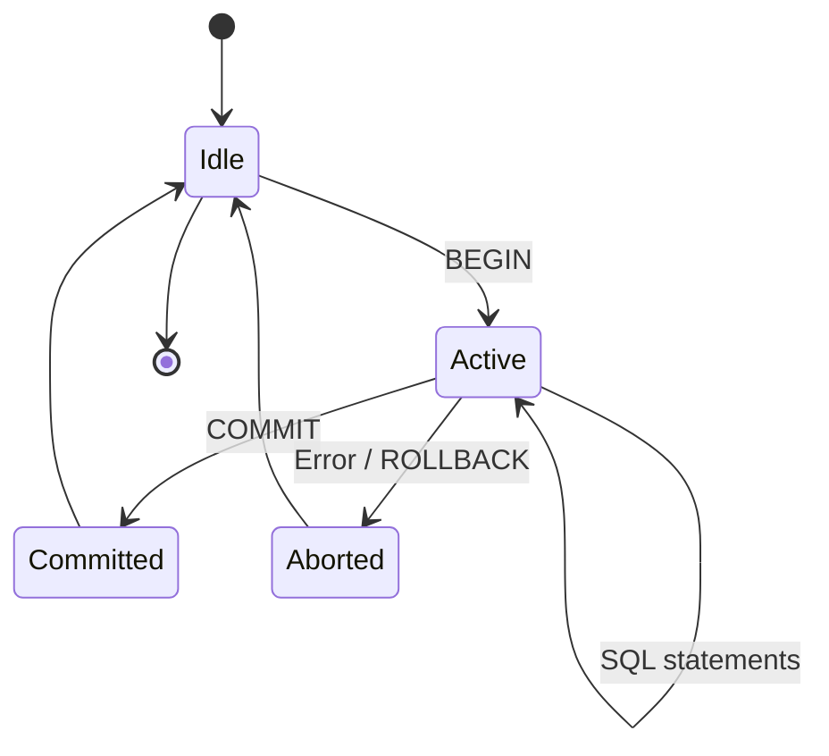
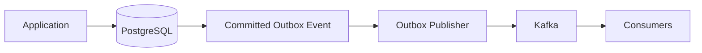

# 03- COMMIT

## Overview

`COMMIT` permanently ends the current transaction and makes its changes visible according to the database's transaction and isolation semantics.

A transaction typically follows this lifecycle:

```text
BEGIN
  │
  ├── SQL statement 1
  ├── SQL statement 2
  ├── SQL statement 3
  │
  ▼
COMMIT
  │
  ├── Transaction becomes committed
  ├── Transaction locks are released
  ├── Changes become visible according to isolation rules
  └── Commit durability is established according to configuration
```

`COMMIT` is therefore more than a final SQL statement. It defines the boundary at which a set of database operations transitions from transactional work to committed database state.

For backend engineers, understanding `COMMIT` is essential for designing reliable workflows, controlling transaction scope, handling failures, reasoning about locks, and integrating relational databases with external systems.

## Transaction Lifecycle

A basic transaction can be represented as:

```sql
BEGIN;

UPDATE accounts
SET balance = balance - 100
WHERE id = 1;

UPDATE accounts
SET balance = balance + 100
WHERE id = 2;

COMMIT;
```

The database moves through several conceptual states:



Until `COMMIT` succeeds, the transaction has not successfully completed.

If an error occurs before the commit:

```sql
BEGIN;

UPDATE accounts
SET balance = balance - 100
WHERE id = 1;

-- An error occurs

ROLLBACK;
```

the transaction's changes are discarded.

## What COMMIT Does

### Finalizes the Transaction

`COMMIT` tells the database that the transaction has successfully completed.

```sql
BEGIN;

INSERT INTO orders(customer_id, status)
VALUES (42, 'confirmed');

COMMIT;
```

After a successful commit, the database treats the transaction as committed.

### Makes Changes Persist

A commit establishes the database's commit point.

Conceptually:

```text
Uncommitted changes
       │
       ▼
    COMMIT
       │
       ▼
Committed transaction
```

The exact durability mechanics depend on the database engine and configuration.

### Releases Transaction Resources

Committing a transaction generally releases resources associated with that transaction, including transaction-scoped locks.

This matters because long-running transactions can cause:

- Lock contention.
- Connection pool exhaustion.
- MVCC cleanup pressure.
- Increased transaction latency.
- Increased replication or recovery pressure.

A transaction should therefore remain open only for the work that genuinely requires transactional coordination.

## COMMIT and Atomicity

`COMMIT` is the point at which all successful changes belonging to the transaction are accepted as one unit.

For example:

```sql
BEGIN;

INSERT INTO orders(customer_id, status)
VALUES (42, 'confirmed');

INSERT INTO order_items(order_id, product_id, quantity)
VALUES (1001, 500, 2);

COMMIT;
```

The application should reason about this as:

```text
Order + Order Items
       │
       ▼
 One transaction
       │
       ▼
     COMMIT
       │
       ▼
Both committed together
```

If the transaction is rolled back instead:

```text
Order + Order Items
       │
       ▼
    ROLLBACK
       │
       ▼
Neither committed
```

This is the database-level atomicity boundary.

## COMMIT and Durability

`COMMIT` is closely related to durability, but these concepts should not be treated as identical.

A successful commit means the database has accepted the transaction as committed according to its configured durability semantics.

In PostgreSQL, WAL plays a central role:

```text
Transaction changes
       │
       ▼
Write-Ahead Log
       │
       ▼
Commit record
       │
       ▼
COMMIT acknowledged
       │
       ▼
Data pages can be flushed later
```

The database can use WAL during crash recovery to reconstruct committed state.

Durability behavior can depend on:

- Database configuration.
- WAL behavior.
- Storage guarantees.
- Replication configuration.
- Synchronous/asynchronous replication.
- Failure mode.

Therefore:

```text
COMMIT
≠
Guaranteed survival of every possible infrastructure failure
```

Backups, replication, failover, and disaster recovery remain separate operational concerns.

## COMMIT and Isolation

`COMMIT` also affects what other transactions can observe.

Consider:

```text
Transaction A                  Transaction B

BEGIN
UPDATE account
SET balance = 900
WHERE id = 1

                              SELECT balance
                              FROM account
                              WHERE id = 1

COMMIT
                              SELECT balance
                              FROM account
                              WHERE id = 1
```

The behavior of Transaction B depends on the database engine, isolation level, and timing.

For example, under PostgreSQL's default `READ COMMITTED` isolation, a statement generally sees data committed before that statement begins.

This is why transaction reasoning must include both:

- The commit boundary.
- The isolation level.

`COMMIT` alone does not define the complete concurrency model.

## COMMIT and Visibility

A useful conceptual distinction is:

```text
Transaction A
    │
    ├── UPDATE
    │      │
    │      └── Uncommitted
    │
    └── COMMIT
           │
           ▼
      Committed state
           │
           ▼
Other transactions can observe it
according to their isolation semantics
```

A common mistake is assuming that another transaction can immediately observe an uncommitted update simply because the SQL statement has executed.

That is generally not the intended behavior of transactional databases.

## COMMIT vs ROLLBACK

`COMMIT` and `ROLLBACK` are complementary transaction controls.

| Operation | Purpose | Result |
|---|---|---|
| `COMMIT` | Successfully finish transaction | Changes become committed |
| `ROLLBACK` | Abort transaction | Transaction changes are discarded |
| `SAVEPOINT` | Establish partial rollback point | Allows selective rollback within a transaction |

Example:

```sql
BEGIN;

UPDATE accounts
SET balance = balance - 100
WHERE id = 1;

-- Business or technical failure
ROLLBACK;
```

A transaction that cannot safely complete should normally be rolled back rather than committed partially.

## COMMIT vs SAVEPOINT

A savepoint is not a commit.

```sql
BEGIN;

UPDATE orders
SET status = 'processing'
WHERE id = 1001;

SAVEPOINT before_optional_work;

INSERT INTO audit_events(event_type, order_id)
VALUES ('processing_started', 1001);

ROLLBACK TO SAVEPOINT before_optional_work;

COMMIT;
```

The final `COMMIT` still determines whether the transaction itself is committed.

Conceptually:

```text
BEGIN
 │
 ├── Work A
 │
 ├── SAVEPOINT
 │
 ├── Work B
 │
 ├── ROLLBACK TO SAVEPOINT
 │      └── Undo Work B
 │
 └── COMMIT
        └── Commit Work A
```

Savepoints are useful when a transaction contains a recoverable subsection without requiring the entire transaction to be discarded.

## COMMIT and Errors

A critical production concept is that an error can invalidate the current transaction.

In PostgreSQL:

```sql
BEGIN;

INSERT INTO users(email)
VALUES ('existing@example.com');

-- unique constraint violation

INSERT INTO audit_events(event_type)
VALUES ('user_created');
```

After the first statement fails, the transaction is in an aborted state.

The application must roll it back:

```sql
ROLLBACK;
```

It cannot simply continue issuing ordinary SQL statements and expect the transaction to recover.

```text
BEGIN
  │
  ├── Statement succeeds
  │
  ├── Statement fails
  │
  ▼
Transaction aborted
  │
  ▼
ROLLBACK
```

This is especially important when using connection pools. A connection returned to the pool with an open or failed transaction can cause subsequent requests to inherit broken transactional state.

## COMMIT and Connection Pools

Modern backend services commonly use connection pools.

```text
Application Requests
        │
        ▼
Connection Pool
        │
        ├── Connection A
        ├── Connection B
        ├── Connection C
        └── Connection D
```

A transaction should be completely resolved before its connection is returned to the pool:

```text
Acquire connection
       │
       ▼
BEGIN
       │
       ├── SQL operations
       │
       ▼
COMMIT / ROLLBACK
       │
       ▼
Release connection
```

A production application should avoid:

```text
Acquire
  │
BEGIN
  │
Long application work
  │
Network request
  │
User interaction
  │
COMMIT
  │
Release
```

This holds a database connection unnecessarily and can exhaust the pool under load.

## COMMIT in PostgreSQL

A PostgreSQL transaction can be explicitly committed:

```sql
BEGIN;

UPDATE orders
SET status = 'confirmed'
WHERE id = 1001;

COMMIT;
```

PostgreSQL also supports transaction characteristics such as isolation level and read-only mode.

For example:

```sql
BEGIN TRANSACTION ISOLATION LEVEL SERIALIZABLE;

UPDATE inventory
SET quantity = quantity - 1
WHERE product_id = 100;

COMMIT;
```

If a serializable transaction encounters a serialization conflict, the application may need to retry the entire transaction.

The important rule is:

```text
Retry the transaction
rather than blindly retrying only the failed statement.
```

## COMMIT and Autocommit

Many database drivers operate in autocommit mode unless explicitly configured otherwise.

In autocommit mode, an individual statement can effectively become its own transaction:

```text
INSERT
  │
  ▼
COMMIT

UPDATE
  │
  ▼
COMMIT
```

This is convenient for independent operations but dangerous when several statements must be atomic.

Consider:

```sql
UPDATE accounts
SET balance = balance - 100
WHERE id = 1;

UPDATE accounts
SET balance = balance + 100
WHERE id = 2;
```

If these execute as separate transactions, the first update could commit successfully while the second fails.

For a transfer, use one transaction:

```sql
BEGIN;

UPDATE accounts
SET balance = balance - 100
WHERE id = 1;

UPDATE accounts
SET balance = balance + 100
WHERE id = 2;

COMMIT;
```

## COMMIT in Django

Django provides transaction management through `transaction.atomic()`.

```python
from django.db import transaction

@transaction.atomic
def confirm_order(order_id: int) -> None:
    order = Order.objects.select_for_update().get(id=order_id)

    if order.status != "pending":
        raise ValueError("Order is not pending")

    order.status = "confirmed"
    order.save(update_fields=["status"])
```

The framework manages the underlying commit and rollback behavior.

The conceptual lifecycle is:

```text
transaction.atomic()
      │
      ▼
BEGIN
      │
      ├── ORM operations
      │
      ▼
Block exits successfully
      │
      ▼
COMMIT

Exception
      │
      ▼
ROLLBACK
```

Avoid manually mixing transaction control with framework-managed transactions unless there is a specific reason and a clear understanding of the driver's behavior.

## COMMIT and FastAPI

FastAPI itself does not define transaction semantics. The database driver, ORM, or session-management layer does.

A typical request flow might be:

```text
HTTP Request
     │
     ▼
FastAPI endpoint
     │
     ▼
Service layer
     │
     ▼
Database transaction
     │
     ├── INSERT / UPDATE
     ├── validation
     └── COMMIT
     │
     ▼
HTTP Response
```

The transaction should generally encompass the database work required for one consistent business operation rather than the entire HTTP request lifecycle.

Avoid holding the transaction open while performing unrelated work such as:

- Calling another service.
- Uploading an object to S3.
- Waiting for a third-party API.
- Performing expensive CPU processing.

## COMMIT and External Systems

A database `COMMIT` does not make external operations atomic.

This is unsafe:

```text
BEGIN
  │
  ├── Update order
  ├── Call payment provider
  ├── Publish Kafka event
  └── COMMIT
```

Possible failure:

```text
Payment succeeds
      │
      ▼
Kafka publish fails
      │
      ▼
Database COMMIT fails
```

The systems now disagree.

For database-to-event consistency, a transactional outbox is a common pattern:

```sql
BEGIN;

UPDATE orders
SET status = 'confirmed'
WHERE id = 1001;

INSERT INTO outbox_events(event_type, aggregate_id)
VALUES ('order_confirmed', 1001);

COMMIT;
```

The outbox row is committed atomically with the business state.

A separate worker publishes it:



This does not make the complete workflow globally atomic, but it provides a reliable bridge between database state and asynchronous event delivery.

## COMMIT and Locks

Locks acquired during a transaction are generally held until the transaction ends, depending on lock type and database semantics.

Consider:

```sql
BEGIN;

SELECT *
FROM inventory
WHERE product_id = 100
FOR UPDATE;

UPDATE inventory
SET quantity = quantity - 1
WHERE product_id = 100;

COMMIT;
```

The lock protects the row while the transaction is active.

A long transaction therefore increases the period during which other transactions may wait.

```text
Transaction A
BEGIN
 │
 ├── Lock row
 │
 ├── Long computation
 │
 ├── External API call
 │
 └── COMMIT
        │
        ▼
Lock released
```

Prefer:

```text
Transaction A
BEGIN
 │
 ├── Lock row
 ├── Validate state
 ├── Update row
 └── COMMIT
        │
        ▼
Lock released quickly
```

## COMMIT and Deadlocks

Two transactions can acquire locks in conflicting orders:

```text
Transaction A              Transaction B

Lock Row 1                 Lock Row 2
     │                          │
     ▼                          ▼
Wait for Row 2             Wait for Row 1
     │                          │
     └──────── Deadlock ────────┘
```

The database detects the deadlock and aborts one transaction.

The application should treat the resulting error as potentially retryable when the operation is safe to retry.

A common prevention strategy is to access multiple resources in a consistent order:

```text
Always lock lower account ID first
then higher account ID
```

rather than allowing different code paths to lock them in arbitrary order.

## COMMIT and Long-Running Transactions

Long-running transactions are a frequent production problem.

They can cause:

- Increased lock duration.
- More blocked queries.
- Connection pool pressure.
- MVCC cleanup delays.
- Larger transaction snapshots.
- Higher replication/recovery pressure.

Monitor transaction age in PostgreSQL:

```sql
SELECT
    pid,
    usename,
    state,
    xact_start,
    now() - xact_start AS transaction_age,
    wait_event_type,
    wait_event,
    query
FROM pg_stat_activity
WHERE xact_start IS NOT NULL
ORDER BY xact_start;
```

Particular attention should be paid to sessions that remain `idle in transaction`.

## COMMIT and Replication

A local commit and replication are related but distinct.

With asynchronous replication:

```text
Primary
  │
  ├── COMMIT
  │
  └── WAL
       │
       ▼
   Replica
```

The primary may acknowledge the transaction before the replica has replayed the corresponding WAL.

Therefore:

```text
Primary commit
≠
Replica has necessarily replayed the change
```

For workloads requiring stronger replication guarantees, synchronous replication may be configured, with an associated latency and availability trade-off.

Read-after-write behavior also requires careful consideration when applications route reads to replicas.

## COMMIT and High Availability

`COMMIT` does not itself provide high availability.

High availability requires additional infrastructure:

- Database replication.
- Health checks.
- Automated or controlled failover.
- Connection management.
- Backup and restore procedures.
- Monitoring.
- Operational runbooks.

A production architecture might look like:

```text
                    ┌───────────────┐
                    │  Application  │
                    └───────┬───────┘
                            │
                     Database Proxy
                            │
                  ┌─────────┴─────────┐
                  ▼                   ▼
             PostgreSQL           PostgreSQL
              Primary              Replica
                  │                   │
                  └─────── WAL ──────┘
```

The commit semantics belong to the database transaction; failover determines how the system continues operating when infrastructure fails.

## COMMIT and Performance

Every transaction has overhead.

A transaction that commits thousands of times individually:

```text
INSERT → COMMIT
INSERT → COMMIT
INSERT → COMMIT
...
```

can have substantially different performance characteristics from a properly sized batch:

```text
BEGIN
  │
  ├── INSERT
  ├── INSERT
  ├── INSERT
  ├── ...
  └── COMMIT
```

However, the solution is not to make transactions arbitrarily large.

Large transactions can create:

- Large WAL volume.
- Long lock durations.
- Large rollback costs.
- More replication pressure.
- Longer recovery.
- Greater impact from a single failure.

The goal is a transaction boundary that matches the business operation and is as short as practical.

## Production Best Practices

| Practice | Reason |
|---|---|
| Define explicit transaction boundaries for multi-step operations | Preserves atomicity |
| Keep transactions short | Reduces contention |
| Commit only after required database work succeeds | Prevents partial state |
| Roll back on failures | Clears invalid transactional state |
| Avoid external network calls inside transactions | Prevents unnecessary lock and connection retention |
| Use database constraints | Protects critical invariants |
| Use appropriate isolation | Balances correctness and concurrency |
| Make retryable operations idempotent | Prevents duplicate business effects |
| Monitor transaction duration | Detects operational problems |
| Monitor lock waits and deadlocks | Identifies contention |
| Resolve transactions before returning pooled connections | Prevents connection contamination |
| Test backup and recovery independently | Commit alone is not disaster recovery |

## Common Mistakes

### Committing Too Early

Bad:

```text
BEGIN
  │
  ├── Update order
  ├── COMMIT
  │
  ├── Update inventory
  └── Failure
```

The order is now committed while inventory may remain unchanged.

Group changes that form one business invariant into the same transaction.

### Forgetting to Commit

An application may execute updates successfully but never commit them.

With an explicit transaction:

```sql
BEGIN;

UPDATE orders
SET status = 'confirmed'
WHERE id = 1001;

-- No COMMIT
```

The changes remain uncommitted and the connection may retain transactional state or locks until the transaction ends.

### Assuming COMMIT Rolls Back External Effects

It does not.

If the application sends an email, charges a payment provider, or publishes an event before the database commit, the database cannot undo that external side effect.

### Holding Transactions Across Network Calls

Avoid:

```text
BEGIN
 │
 ├── UPDATE
 ├── HTTP request
 ├── wait 3 seconds
 └── COMMIT
```

The database resources remain occupied while the application waits.

### Retrying Only COMMIT

If a transaction fails due to serialization or a transient conflict, retrying only:

```sql
COMMIT;
```

is generally insufficient.

The transaction's complete logical operation should be retried from its beginning.

### Returning a Connection With an Open Transaction

This can cause subsequent requests to encounter unexpected transactional state.

Always ensure that successful paths commit and failure paths roll back before releasing a pooled connection.

## Interview Traps

### Is COMMIT the Same as Writing Every Data Page to Disk?

Not necessarily.

Database engines commonly use a transaction log such as PostgreSQL WAL to establish durable commit semantics without requiring every modified data page to be synchronously written at commit time.

### Does COMMIT Release Every Lock Immediately?

Locks associated with the transaction are generally released when the transaction ends, but exact behavior depends on the lock type and database implementation.

### Does COMMIT Make Changes Visible to Every Client Immediately?

Visibility is governed by the database's concurrency and isolation semantics. Replica-based architectures can also introduce replication lag.

### Does COMMIT Guarantee Disaster Recovery?

No.

Commit durability and disaster recovery are separate concerns. Backups, replication, failover, and restore testing are required for broader resilience.

### Can COMMIT Make Multiple Microservices Atomic?

No.

A transaction generally provides atomicity within its database transaction boundary. Distributed workflows require additional coordination patterns.

## Operational Checklist

Before deploying transaction-heavy backend code, verify:

- [ ] The transaction boundary matches the business operation.
- [ ] All required database changes occur before `COMMIT`.
- [ ] Failure paths reliably execute `ROLLBACK`.
- [ ] Transactions are short-lived.
- [ ] External network calls are outside the transaction where possible.
- [ ] Database constraints protect critical invariants.
- [ ] Isolation level is appropriate for the workload.
- [ ] Deadlock and serialization failures are handled.
- [ ] Retry logic is bounded and idempotent.
- [ ] Pooled connections are returned without open transactions.
- [ ] Transaction duration is monitored.
- [ ] Lock waits and deadlocks are monitored.
- [ ] Replication semantics are understood for read-after-write requirements.
- [ ] Backup and disaster recovery are tested separately from transaction correctness.

## Key Takeaways

- **`COMMIT` establishes the successful end of a transaction and is the boundary at which its database changes become committed.**
- **Transaction scope matters: keep transactions short and commit only after all database changes required for the business operation have succeeded.**
- **`COMMIT` does not make external systems atomic, prevent all concurrency conflicts, or provide disaster recovery by itself.**
- **Production applications must correctly coordinate `COMMIT`/`ROLLBACK` with connection pools, locking, isolation levels, retries, and replication behavior.**
- **For distributed workflows, combine local database transactions with patterns such as transactional outbox and idempotent processing rather than assuming global ACID semantics.**