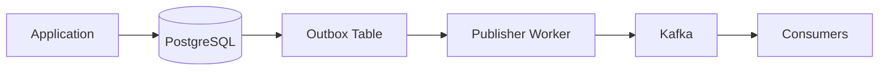

# 04- ROLLBACK

## Overview

`ROLLBACK` aborts the current database transaction and discards changes made within that transaction that have not been committed.

It is the failure-side counterpart to `COMMIT`:

```text
BEGIN
  │
  ├── SQL statement
  ├── SQL statement
  ├── SQL statement
  │
  ├───────────────┐
  │               │
  ▼               ▼
COMMIT          ROLLBACK
  │               │
  ▼               ▼
Persist        Discard
changes        transaction changes
```

For backend systems, `ROLLBACK` is fundamental to maintaining database consistency when validation fails, constraints are violated, business rules reject an operation, or an unexpected error occurs.

A production transaction should normally have a clearly defined success path and failure path:

```text
Transaction
    │
    ├── Success ──► COMMIT
    │
    └── Failure ──► ROLLBACK
```

`ROLLBACK` does not undo changes that were already committed, nor does it automatically reverse effects performed outside the database.

## What ROLLBACK Does

### Aborts the Current Transaction

A basic transaction can be explicitly rolled back:

```sql
BEGIN;

UPDATE accounts
SET balance = balance - 100
WHERE id = 1;

UPDATE accounts
SET balance = balance + 100
WHERE id = 2;

ROLLBACK;
```

The updates are discarded because the transaction never reached `COMMIT`.

### Restores Transactional State

Conceptually:

```text
Initial state
    │
    ▼
BEGIN
    │
    ├── INSERT
    ├── UPDATE
    ├── DELETE
    │
    ▼
ROLLBACK
    │
    ▼
State before transaction
```

The database uses its transaction mechanisms, such as MVCC and write-ahead logging, to maintain transactional correctness.

The exact internal implementation differs between database engines.

### Ends the Transaction

A normal `ROLLBACK` ends the current transaction.

Afterward, the connection returns to a state in which a new transaction can begin:

```sql
ROLLBACK;

BEGIN;

SELECT *
FROM accounts;
```

This is particularly important when using connection pools because transaction state belongs to the database connection/session.

## Why ROLLBACK Exists

Without rollback, multi-step operations could leave partially applied business state.

Consider an order workflow:

```text
Create Order
     │
     ▼
Reserve Inventory
     │
     ▼
Create Payment Record
     │
     ▼
Failure
```

If all database operations are part of one transaction:

```text
BEGIN
 │
 ├── Create order
 ├── Reserve inventory
 ├── Create payment record
 │
 ├── Failure
 │
 ▼
ROLLBACK
 │
 ▼
All transaction changes discarded
```

Without an appropriate transaction boundary, the application could leave:

- An order without inventory reservation.
- Inventory reduced without an associated order.
- A partially created payment record.
- Broken foreign-key relationships.
- Violated business invariants.

Rollback provides the database-level mechanism for abandoning incomplete transactional work.

## ROLLBACK and Atomicity

Atomicity means that a transaction is treated as one logical unit.

Example:

```sql
BEGIN;

INSERT INTO orders(customer_id, status)
VALUES (42, 'confirmed');

INSERT INTO order_items(order_id, product_id, quantity)
VALUES (1001, 500, 2);

UPDATE inventory
SET quantity = quantity - 2
WHERE product_id = 500;

ROLLBACK;
```

If the transaction is rolled back successfully, none of these changes become part of the committed database state.

This gives the application a useful invariant:

```text
Either the complete transaction commits
or the transaction does not commit.
```

Rollback is therefore a critical mechanism for implementing atomic business operations.

## ROLLBACK and Errors

Database errors are one of the most common reasons to roll back.

Consider PostgreSQL:

```sql
BEGIN;

INSERT INTO users(email)
VALUES ('existing@example.com');

-- Unique constraint violation

INSERT INTO audit_events(event_type)
VALUES ('user_created');
```

Once the statement violates a constraint, PostgreSQL places the transaction into an aborted state.

The connection must roll back:

```sql
ROLLBACK;
```

Afterward, the connection can be used for another transaction.

```text
BEGIN
 │
 ├── INSERT
 │
 ├── Constraint violation
 │
 ▼
Transaction aborted
 │
 ▼
ROLLBACK
 │
 ▼
Connection usable again
```

A common production mistake is catching the database exception in application code and continuing to use the same transaction without rolling it back.

## ROLLBACK vs COMMIT

| Operation | Purpose | Transaction result |
|---|---|---|
| `COMMIT` | Accept successful transaction | Changes become committed |
| `ROLLBACK` | Abort transaction | Uncommitted changes are discarded |
| `SAVEPOINT` | Create partial rollback point | Transaction remains active |
| `ROLLBACK TO SAVEPOINT` | Undo work after savepoint | Earlier transaction work remains |

The choice should correspond to the business outcome:

```text
Business operation succeeds
        │
        ▼
     COMMIT

Business operation fails
        │
        ▼
    ROLLBACK
```

## ROLLBACK vs SAVEPOINT

A full rollback terminates the current transaction.

A rollback to a savepoint only undoes work performed after that savepoint.

```sql
BEGIN;

UPDATE orders
SET status = 'processing'
WHERE id = 1001;

SAVEPOINT optional_work;

INSERT INTO audit_events(event_type, order_id)
VALUES ('temporary_event', 1001);

ROLLBACK TO SAVEPOINT optional_work;

COMMIT;
```

The `UPDATE` remains part of the transaction, while the insert after the savepoint is undone.

Conceptually:

```text
BEGIN
 │
 ├── Work A
 │
 ├── SAVEPOINT
 │
 ├── Work B
 │
 ├── ROLLBACK TO SAVEPOINT
 │      └── Undo Work B
 │
 └── COMMIT
        └── Commit Work A
```

Use a savepoint when partial recovery within a larger transaction is genuinely useful.

## Full ROLLBACK vs ROLLBACK TO SAVEPOINT

| Property | `ROLLBACK` | `ROLLBACK TO SAVEPOINT` |
|---|---|---|
| Ends transaction | Yes | No |
| Discards all transaction work | Yes | No |
| Discards work after savepoint | Yes | Yes |
| Preserves work before savepoint | No | Yes |
| Allows further SQL in transaction | No | Yes |
| Typical use | Fatal transaction failure | Recoverable subsection |

## ROLLBACK and Nested Transactions

Many application frameworks expose nested transaction APIs, but they do not necessarily correspond to independent database transactions.

For example, Django's `transaction.atomic()` can be nested:

```python
from django.db import transaction

with transaction.atomic():
    create_order()

    try:
        with transaction.atomic():
            create_optional_audit_record()
    except Exception:
        pass

    finalize_order()
```

Django commonly implements inner atomic blocks using savepoints rather than independent database transactions.

Conceptually:

```text
Outer transaction
 │
 ├── create_order()
 │
 ├── SAVEPOINT
 │
 ├── optional work
 │
 ├── ROLLBACK TO SAVEPOINT
 │
 ├── finalize_order()
 │
 └── COMMIT
```

This distinction matters when reasoning about what a rollback actually affects.

## ROLLBACK in Django

Django automatically handles transaction rollback when an exception escapes an `atomic()` block.

```python
from django.db import transaction

@transaction.atomic
def transfer_money(source_id: int, destination_id: int, amount: int) -> None:
    source = Account.objects.select_for_update().get(id=source_id)
    destination = Account.objects.select_for_update().get(id=destination_id)

    if source.balance < amount:
        raise ValueError("Insufficient funds")

    source.balance -= amount
    destination.balance += amount

    source.save(update_fields=["balance"])
    destination.save(update_fields=["balance"])
```

If the function raises an exception, Django rolls back the transaction.

The conceptual flow is:

```text
transaction.atomic()
      │
      ▼
    BEGIN
      │
      ├── Lock accounts
      ├── Validate balance
      ├── Update balances
      │
      ├── Exception?
      │      │
      │      ▼
      │   ROLLBACK
      │
      └── Success
             │
             ▼
           COMMIT
```

Application code should avoid manually issuing SQL `ROLLBACK` statements inside framework-managed transaction blocks unless there is a specific low-level requirement.

## ROLLBACK in FastAPI

FastAPI does not provide database transaction semantics itself. The transaction behavior is determined by the database driver, ORM, or session layer.

A service layer can model the transaction lifecycle as:

```text
HTTP Request
     │
     ▼
Service
     │
     ▼
BEGIN
     │
     ├── Database operations
     │
     ├── Validation
     │
     └── Business rules
     │
     ├── Success ──► COMMIT
     │
     └── Failure ──► ROLLBACK
```

The important design principle is to make the transaction boundary explicit and ensure failures cannot leak an open transaction back into the connection pool.

## ROLLBACK and Connection Pools

Connection pooling makes correct rollback handling particularly important.

Consider:

```text
Request A
   │
   ▼
Connection 7
   │
 BEGIN
   │
 SQL error
   │
 ROLLBACK
   │
 Release
   ▼
Pool
   │
   ▼
Request B
```

The connection is safe to reuse.

The dangerous version is:

```text
Request A
   │
 BEGIN
   │
 SQL error
   │
 Exception swallowed
   │
 Release connection
   ▼
Pool
   │
   ▼
Request B receives bad transactional state
```

Database libraries and frameworks may have different pool-reset behavior, but application code should not rely on accidental cleanup.

A robust design ensures every transaction is either:

```text
COMMIT
```

or:

```text
ROLLBACK
```

before the connection is reused.

## ROLLBACK and Locks

Rollback releases transaction-scoped locks when the transaction ends.

For example:

```sql
BEGIN;

SELECT *
FROM inventory
WHERE product_id = 100
FOR UPDATE;

-- Business operation fails

ROLLBACK;
```

The transaction ends and the lock is released.

This matters for concurrency:

```text
Transaction A
    │
    ├── BEGIN
    ├── Lock row
    ├── Failure
    └── ROLLBACK
           │
           ▼
      Lock released
           │
           ▼
Transaction B can proceed
```

Long transactions increase the time during which locks and other transaction resources may be retained.

## ROLLBACK and Deadlocks

Deadlocks occur when transactions wait for each other's locks.

```text
Transaction A              Transaction B

Lock Row 1                 Lock Row 2
     │                          │
     ▼                          ▼
Wait for Row 2             Wait for Row 1
     │                          │
     └──────── Deadlock ────────┘
```

The database typically aborts one transaction to break the deadlock.

That aborted transaction must not be treated as successfully completed.

A robust application should:

1. Detect the transient transaction error.
2. Roll back the failed transaction.
3. Reacquire a clean transaction.
4. Retry the complete logical operation when safe.
5. Use bounded retries and backoff.

Do not retry only the final `COMMIT` or a single failed statement when the transaction's correctness depends on the complete sequence.

## ROLLBACK and Isolation Levels

Rollback behavior and isolation are separate concepts.

Isolation controls how concurrent transactions interact and what they can observe.

Rollback controls whether the current transaction's changes are accepted or discarded.

```text
Transaction correctness
        │
        ├── Atomicity
        │      └── COMMIT / ROLLBACK
        │
        └── Isolation
               └── Concurrency visibility rules
```

For example, a serializable transaction may fail because the database detects a serialization conflict:

```text
Transaction
    │
    ├── BEGIN SERIALIZABLE
    ├── Read data
    ├── Modify data
    │
    ├── Serialization failure
    │
    ▼
ROLLBACK
    │
    ▼
Retry complete transaction
```

This is a common senior-level interview topic: **rollback is often part of a retry strategy for transient transaction failures.**

## ROLLBACK and External Side Effects

`ROLLBACK` only controls database transaction state.

It cannot automatically undo:

- HTTP requests.
- Emails.
- Kafka messages already published.
- Payments charged through an external provider.
- S3 uploads.
- Notifications sent to users.
- External service mutations.

This is unsafe:

```text
BEGIN
 │
 ├── UPDATE order
 ├── Charge payment provider
 ├── Send email
 ├── Failure
 │
 ▼
ROLLBACK
```

The database update may be undone, but the payment and email may already have happened.

The database cannot provide atomic rollback across unrelated systems.

## Transactional Outbox Pattern

For reliable database-to-message workflows, use an outbox record inside the transaction:

```sql
BEGIN;

UPDATE orders
SET status = 'confirmed'
WHERE id = 1001;

INSERT INTO outbox_events(event_type, aggregate_id)
VALUES ('order_confirmed', 1001);

COMMIT;
```

If the transaction fails:

```sql
ROLLBACK;
```

both the business update and outbox record are discarded.

If it commits, a separate worker can publish the event:



This provides a durable handoff between transactional database state and asynchronous messaging.

## ROLLBACK and Application Exceptions

Application-level validation can also trigger rollback.

```python
from django.db import transaction

@transaction.atomic
def reserve_inventory(product_id: int, quantity: int) -> None:
    inventory = (
        Inventory.objects
        .select_for_update()
        .get(product_id=product_id)
    )

    if inventory.quantity < quantity:
        raise ValueError("Insufficient inventory")

    inventory.quantity -= quantity
    inventory.save(update_fields=["quantity"])
```

If the exception escapes the transaction boundary:

```text
Insufficient inventory
        │
        ▼
Exception
        │
        ▼
ROLLBACK
```

The rollback protects the transaction from committing an invalid state.

## ROLLBACK and Partial Updates

Consider a payment workflow:

```sql
BEGIN;

UPDATE accounts
SET balance = balance - 100
WHERE id = 1;

INSERT INTO payments(account_id, amount, status)
VALUES (1, 100, 'completed');

-- Unexpected failure

ROLLBACK;
```

Both database changes are discarded.

This is preferable to:

```text
Balance updated
     │
     ▼
Payment record fails
     │
     ▼
Inconsistent state
```

The transaction boundary should correspond to the business invariant being protected.

## ROLLBACK and Long-Running Transactions

Rollback itself can become expensive for large transactions because the database may need to process substantial transactional state.

Avoid using one enormous transaction for an unlimited batch job:

```text
BEGIN
 │
 ├── Process 10 million rows
 ├── Process 10 million rows
 ├── Process 10 million rows
 │
 └── Failure
       │
       ▼
    ROLLBACK
```

A failure near the end can result in significant wasted work.

For large workloads, use carefully designed batches where each batch represents an independently recoverable unit:

```text
Batch 1 → COMMIT
Batch 2 → COMMIT
Batch 3 → COMMIT
Batch 4 → Failure → ROLLBACK
```

The correct batch size depends on:

- Lock duration.
- WAL volume.
- Query latency.
- Replication behavior.
- Failure recovery time.
- Business atomicity requirements.

Do not split a transaction merely for performance if the business operation requires all changes to be atomic.

## ROLLBACK and PostgreSQL MVCC

PostgreSQL uses MVCC to provide transactional concurrency.

An update does not simply overwrite a row in place from the perspective of transaction visibility. PostgreSQL maintains row versions and transaction metadata that allow concurrent transactions to determine which versions are visible.

Conceptually:

```text
UPDATE
  │
  ▼
New row version
  │
  ├── Transaction commits
  │       └── Version becomes committed
  │
  └── Transaction rolls back
          └── Version is not visible as committed
```

The physical storage and cleanup details are more complex, and PostgreSQL's vacuum process is important for reclaiming obsolete row versions.

Long-running transactions can interfere with cleanup and should therefore be monitored.

## ROLLBACK and Replication

Rollback also interacts with replication through the database's transaction log.

Conceptually:

```text
Primary
  │
  ├── Transaction changes
  ├── Transaction aborts
  │
  ▼
WAL / replication stream
  │
  ▼
Replica
```

Only committed state should be treated as durable application state.

Applications should not build correctness assumptions around seeing uncommitted transactional work on replicas.

Asynchronous replication can also introduce lag, so rollback correctness and replica freshness are separate concerns.

## ROLLBACK and Performance

Rollback has a cost.

The cost can increase with:

- Number of modified rows.
- Amount of generated WAL.
- Number of indexes affected.
- Locking activity.
- Transaction duration.
- Cascading database work.

This does not mean applications should avoid rollback. It means transaction design should avoid unnecessary oversized transactions.

A better pattern for large data processing is often:

```text
Read bounded batch
      │
      ▼
Process batch
      │
      ▼
BEGIN
      │
      ▼
Write batch
      │
      ├── Success → COMMIT
      │
      └── Failure → ROLLBACK
```

This limits the failure domain while preserving atomicity within each batch.

## Production Transaction Pattern

A robust service operation should follow a structure similar to:

```text
Acquire database connection
        │
        ▼
     BEGIN
        │
        ▼
Execute transactional work
        │
        ├───────────────┐
        │               │
      Success         Failure
        │               │
        ▼               ▼
     COMMIT          ROLLBACK
        │               │
        └───────┬───────┘
                ▼
       Release connection
```

The transaction should not encompass unrelated application work.

Prefer:

```text
Validate request
      │
      ▼
Begin transaction
      │
      ├── Lock required rows
      ├── Check database state
      ├── Apply changes
      └── Commit
      │
      ▼
Perform asynchronous/non-transactional follow-up
```

when the business workflow permits it.

## Production Best Practices

| Practice | Why it matters |
|---|---|
| Roll back failed transactions | Returns the connection to a usable transactional state |
| Keep transaction scope small | Reduces lock contention and resource usage |
| Match transaction boundaries to business invariants | Prevents partial business state |
| Use savepoints only when partial rollback is useful | Avoids unnecessary complexity |
| Retry complete transactions for transient failures | Preserves transaction-level correctness |
| Keep external calls outside transactions where possible | Prevents long-held locks and connections |
| Use database constraints | Prevents invalid states even when application logic fails |
| Monitor transaction age | Detects long-running transactions |
| Monitor lock waits and deadlocks | Identifies concurrency problems |
| Ensure pooled connections are clean before reuse | Prevents transaction state leakage |
| Use bounded batches for large jobs | Limits rollback and recovery cost |
| Test failure paths explicitly | Rollback logic is part of production correctness |

## Common Mistakes

### Swallowing a Database Exception

Bad:

```python
try:
    create_payment()
except Exception:
    pass

continue_processing()
```

If the underlying transaction is now aborted, continuing to issue database statements may fail or produce incorrect application behavior.

Handle the transaction boundary explicitly.

### Assuming ROLLBACK Undoes Committed Changes

This does not work:

```sql
UPDATE accounts
SET balance = 0
WHERE id = 1;

COMMIT;

ROLLBACK;
```

The rollback cannot undo the already committed update.

Once a transaction has committed, correcting the state requires another transaction.

### Assuming ROLLBACK Undoes External Effects

Rollback cannot reverse:

```text
Database update
HTTP payment request
Email
Kafka publish
S3 upload
```

unless those external systems provide their own compensating or transactional mechanism.

### Holding a Transaction During Network I/O

Avoid:

```text
BEGIN
 │
 ├── UPDATE
 ├── Call external API
 ├── Wait
 └── ROLLBACK
```

The transaction remains open while waiting for an unrelated system.

Move network operations outside the database transaction whenever the business design permits.

### Retrying Only the Failed Statement

A transaction-level failure may mean that the transaction's assumptions are no longer valid.

Prefer:

```text
ROLLBACK
   │
   ▼
BEGIN
   │
   ├── Read current state
   ├── Re-evaluate business rules
   ├── Apply changes
   └── COMMIT
```

rather than blindly repeating one SQL statement.

### Using Rollback as Business Logic

Rollback should primarily represent transaction failure or intentional transaction cancellation.

Do not use database rollback as a substitute for domain-level workflow design when the operation spans multiple independent systems.

### Creating Huge Transactions

A massive transaction may appear safer because "everything is atomic," but it can increase:

- Lock duration.
- WAL volume.
- Memory/resource pressure.
- Replication lag.
- Recovery time.
- Rollback cost.

Atomicity requirements should determine transaction boundaries, not convenience.

## Interview Traps

### Does ROLLBACK Undo a DELETE?

Yes, if the `DELETE` occurred inside the current uncommitted transaction and the transaction is successfully rolled back.

```sql
BEGIN;

DELETE FROM orders
WHERE id = 1001;

ROLLBACK;
```

The transaction's deletion is discarded.

### Does ROLLBACK Undo a COMMIT?

No.

`COMMIT` ends the transaction. A later `ROLLBACK` cannot reverse it.

### Does ROLLBACK Release Locks?

Transaction-scoped locks are generally released when the transaction ends.

### Does ROLLBACK Undo a Kafka Message?

No.

Database transactions and Kafka transactions are separate mechanisms unless the architecture explicitly coordinates them.

### Why Is ROLLBACK Important With Connection Pools?

A connection retains database session state. Returning a failed transaction to the pool without properly resolving it can cause subsequent requests to inherit problematic state.

### Should a Serialization Failure Be Retried?

Often yes, when the operation is safe to retry. The failed transaction should first be rolled back or otherwise discarded, and the **entire logical transaction** should be retried.

## Operational Checklist

Before deploying transaction-heavy backend code, verify:

- [ ] Every transaction has a clear success and failure path.
- [ ] Database errors trigger rollback.
- [ ] Application exceptions cannot leave failed transactions open.
- [ ] Transaction boundaries match business invariants.
- [ ] External network calls are outside transactions where possible.
- [ ] Savepoints are used only where partial rollback is required.
- [ ] Retry logic starts a fresh transaction.
- [ ] Retried operations are safe and idempotent where necessary.
- [ ] Transactions are bounded in duration and size.
- [ ] Pooled connections are returned in a clean transactional state.
- [ ] Lock waits and deadlocks are monitored.
- [ ] Long-running transactions are monitored.
- [ ] Large batch operations have controlled failure boundaries.
- [ ] Failure and rollback paths are covered by integration tests.

## Key Takeaways

- **`ROLLBACK` aborts the current transaction and discards its uncommitted database changes; it cannot undo changes that were already committed.**
- **Rollback is essential for atomic business operations because it prevents failed multi-step transactions from leaving partially committed database state.**
- **After database errors, especially in PostgreSQL, the failed transaction must be rolled back before the connection can safely continue normal database work.**
- **`ROLLBACK` does not undo external side effects such as HTTP requests, payments, emails, or Kafka messages; distributed workflows require explicit consistency patterns.**
- **Production rollback strategy must account for transaction size, lock duration, connection pools, retries, savepoints, and transient concurrency failures.**