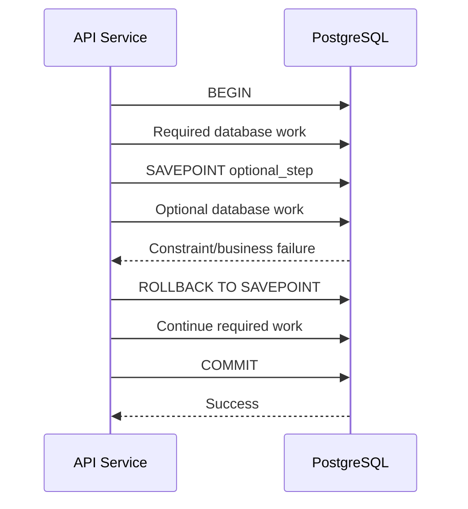

# 05- SAVEPOINT

## Overview

A `SAVEPOINT` creates a named recovery point inside an active database transaction. It allows an application to roll back part of a transaction without discarding the entire transaction.

A full `ROLLBACK` aborts the transaction:

```text
BEGIN
  │
  ├── Work A
  ├── Work B
  ├── Work C
  │
  ▼
ROLLBACK
  │
  ▼
Everything discarded
```

A savepoint provides finer-grained control:

```text
BEGIN
  │
  ├── Work A
  │
  ├── SAVEPOINT sp1
  │
  ├── Work B
  ├── Work C
  │
  ▼
ROLLBACK TO SAVEPOINT sp1
  │
  ├── Work B discarded
  ├── Work C discarded
  │
  ▼
Work A remains
  │
  ▼
COMMIT
```

Savepoints are particularly useful when a transaction contains an optional or independently recoverable subsection of work.

## Why SAVEPOINT Exists

A single business transaction can sometimes contain operations where failure of one subsection should not invalidate everything that happened before it.

For example:

```text
Create order
    │
    ▼
Reserve inventory
    │
    ▼
Create optional audit metadata
    │
    ▼
Audit metadata fails
    │
    ▼
Continue order transaction
    │
    ▼
COMMIT
```

Without a savepoint, the application would have to choose between:

- Committing the failed subsection's preceding work.
- Rolling back the entire transaction.

A savepoint provides a third option:

> Keep the work before the savepoint, discard the work after it, and continue the transaction.

This is useful when the business operation explicitly permits partial recovery.

## Basic Syntax

The SQL transaction flow is:

```sql
BEGIN;

-- Work that must remain if the optional operation fails.
UPDATE orders
SET status = 'processing'
WHERE id = 1001;

SAVEPOINT optional_work;

-- Work that can be independently discarded.
INSERT INTO audit_events(event_type, order_id)
VALUES ('processing_started', 1001);

-- Undo everything after the savepoint.
ROLLBACK TO SAVEPOINT optional_work;

-- The transaction is still active.
UPDATE orders
SET status = 'confirmed'
WHERE id = 1001;

COMMIT;
```

The `UPDATE` statements on `orders` can be committed while the `audit_events` insert is discarded.

## SAVEPOINT Lifecycle

A savepoint exists only within its transaction.

```text
BEGIN
 │
 ▼
Create savepoint
 │
 ▼
Execute additional work
 │
 ├───────────────┐
 │               │
 ▼               ▼
Continue      Rollback
 │               │
 │               ▼
 │          Savepoint state
 │          restored
 │               │
 └───────┬───────┘
         ▼
      COMMIT
```

Important operations include:

| Statement | Purpose |
|---|---|
| `SAVEPOINT name` | Creates a recovery point |
| `ROLLBACK TO SAVEPOINT name` | Reverts work after that savepoint |
| `RELEASE SAVEPOINT name` | Removes the savepoint while keeping transaction work |
| `ROLLBACK` | Aborts the entire transaction |

## ROLLBACK TO SAVEPOINT

`ROLLBACK TO SAVEPOINT` does **not** end the transaction.

```sql
BEGIN;

INSERT INTO orders(customer_id, status)
VALUES (42, 'pending');

SAVEPOINT before_optional_step;

INSERT INTO order_metadata(order_id, source)
VALUES (1001, 'external');

ROLLBACK TO SAVEPOINT before_optional_step;

UPDATE orders
SET status = 'confirmed'
WHERE id = 1001;

COMMIT;
```

The transaction remains active after `ROLLBACK TO SAVEPOINT`.

Conceptually:

```text
BEGIN
 │
 ├── Create order
 │
 ├── SAVEPOINT
 │
 ├── Optional metadata
 │
 ├── ROLLBACK TO SAVEPOINT
 │      └── Metadata discarded
 │
 ├── Confirm order
 │
 └── COMMIT
```

This is the fundamental distinction between a savepoint rollback and a full rollback.

## RELEASE SAVEPOINT

`RELEASE SAVEPOINT` removes a savepoint while retaining the changes made after it.

```sql
BEGIN;

UPDATE orders
SET status = 'processing'
WHERE id = 1001;

SAVEPOINT validation_step;

UPDATE orders
SET status = 'validated'
WHERE id = 1001;

RELEASE SAVEPOINT validation_step;

COMMIT;
```

The savepoint is no longer available, but the transaction remains active and its changes remain part of the transaction.

```text
SAVEPOINT
    │
    ▼
Work
    │
    ▼
RELEASE SAVEPOINT
    │
    ├── Savepoint removed
    └── Work retained
```

Releasing a savepoint is useful when the application has passed a recoverable stage and no longer needs that rollback point.

## SAVEPOINT vs ROLLBACK

| Property | `ROLLBACK` | `ROLLBACK TO SAVEPOINT` |
|---|---|---|
| Ends transaction | Yes | No |
| Discards all transaction changes | Yes | No |
| Discards changes after savepoint | Yes | Yes |
| Preserves changes before savepoint | No | Yes |
| Allows more SQL afterward | No | Yes |
| Typical use | Fatal transaction failure | Partial transaction recovery |

## SAVEPOINT vs COMMIT

A savepoint does not make data durable or visible as committed state.

```text
BEGIN
 │
 ├── INSERT
 │
 ├── SAVEPOINT
 │
 ├── INSERT
 │
 └── RELEASE SAVEPOINT
       │
       ▼
    Still uncommitted
       │
       ▼
     COMMIT
       │
       ▼
    Committed
```

Only the transaction's `COMMIT` establishes the final committed result.

This is a common interview distinction:

> A savepoint is a recovery mechanism inside a transaction, not a smaller commit.

## Nested SAVEPOINTs

Transactions can contain multiple savepoints.

```sql
BEGIN;

INSERT INTO orders(customer_id)
VALUES (42);

SAVEPOINT step_one;

UPDATE inventory
SET quantity = quantity - 1
WHERE product_id = 100;

SAVEPOINT step_two;

INSERT INTO audit_events(event_type)
VALUES ('inventory_reserved');

ROLLBACK TO SAVEPOINT step_two;

-- step_one work remains

COMMIT;
```

The savepoints form a logical stack:

```text
BEGIN
 │
 ├── Work A
 │
 ├── SAVEPOINT sp1
 │     │
 │     ├── Work B
 │     │
 │     ├── SAVEPOINT sp2
 │     │     │
 │     │     └── Work C
 │     │
 │     └── ROLLBACK TO sp2
 │
 └── COMMIT
```

Rolling back to `sp2` discards work after `sp2` but retains the transaction's earlier work.

The exact behavior of other savepoints after a rollback can be database-specific, so production code should follow the semantics documented by the selected database engine.

## SAVEPOINT in PostgreSQL

PostgreSQL supports:

```sql
SAVEPOINT savepoint_name;
ROLLBACK TO SAVEPOINT savepoint_name;
RELEASE SAVEPOINT savepoint_name;
```

Example:

```sql
BEGIN;

INSERT INTO orders(customer_id, status)
VALUES (42, 'pending');

SAVEPOINT inventory_step;

UPDATE inventory
SET quantity = quantity - 2
WHERE product_id = 500;

-- Recover only the inventory subsection.
ROLLBACK TO SAVEPOINT inventory_step;

UPDATE orders
SET status = 'pending_review'
WHERE customer_id = 42;

COMMIT;
```

The savepoint does not commit the transaction and does not create an independently durable unit of work.

## Recovering From Statement Errors

One practical use of savepoints is isolating an operation that might fail.

For example:

```sql
BEGIN;

INSERT INTO users(email)
VALUES ('user@example.com');

SAVEPOINT optional_insert;

INSERT INTO users(email)
VALUES ('user@example.com');

ROLLBACK TO SAVEPOINT optional_insert;

INSERT INTO audit_events(event_type)
VALUES ('duplicate_user_ignored');

COMMIT;
```

After a statement error, a database such as PostgreSQL can have the transaction in an aborted state. Rolling back to a valid savepoint can restore the transaction to a usable state without abandoning earlier work.

This pattern should be used intentionally. Silently suppressing constraint violations can hide real application bugs.

## SAVEPOINT and Django

Django's `transaction.atomic()` supports nested atomic blocks.

For nested blocks, Django generally uses database savepoints rather than independent database transactions.

Example:

```python
from django.db import transaction

@transaction.atomic
def process_order(order_id: int) -> None:
    order = Order.objects.select_for_update().get(id=order_id)
    order.status = "processing"
    order.save(update_fields=["status"])

    try:
        with transaction.atomic():
            create_optional_metadata(order)
    except MetadataError:
        pass

    order.status = "confirmed"
    order.save(update_fields=["status"])
```

Conceptually:

```text
Outer atomic()
 │
 ├── Lock order
 ├── Update order
 │
 ├── Inner atomic()
 │      │
 │      ├── Create metadata
 │      │
 │      └── Failure
 │             │
 │             ▼
 │        ROLLBACK TO SAVEPOINT
 │
 ├── Confirm order
 │
 └── COMMIT
```

The outer transaction remains active after the inner block is rolled back.

### Important Django Pitfall

Do not catch a database exception inside an `atomic()` block and blindly continue issuing queries within the same failed transaction.

Prefer creating a nested atomic block around the operation that can fail:

```python
from django.db import transaction

with transaction.atomic():
    update_required_state()

    try:
        with transaction.atomic():
            perform_optional_operation()
    except Exception:
        handle_optional_failure()

    finalize_required_state()
```

The inner `atomic()` creates a savepoint, giving Django a clean boundary at which the optional operation can be rolled back.

## SAVEPOINT and SQLAlchemy

SQLAlchemy exposes savepoint-style behavior through nested transactions.

A common pattern is:

```python
from sqlalchemy.orm import Session

def process_order(session: Session, order_id: int) -> None:
    order = session.get(Order, order_id)

    order.status = "processing"

    try:
        with session.begin_nested():
            create_optional_metadata(session, order)
    except MetadataError:
        pass

    order.status = "confirmed"
    session.flush()
```

`begin_nested()` is commonly implemented using a database savepoint when supported by the database and driver.

The outer transaction still determines the final commit or rollback.

## SAVEPOINT in Backend Architecture

Savepoints belong inside the database transaction boundary.



The savepoint should not be confused with distributed transaction coordination.

It only controls work occurring inside the same database transaction.

## Appropriate Use Cases

Savepoints are useful when:

### Optional Database Work

An optional subsection can fail without invalidating the main operation.

```text
Create order
   │
   ├── Required
   │
   ├── SAVEPOINT
   │
   └── Optional metadata
          │
          └── Failure → rollback subsection
```

### Recoverable Validation

A complex transaction may perform a database operation that is intentionally speculative.

```text
BEGIN
 │
 ├── Required state
 │
 ├── SAVEPOINT
 │
 ├── Attempt operation
 │
 ├── Validate result
 │
 └── ROLLBACK TO SAVEPOINT if rejected
```

### Batch Processing

A transaction may contain independently recoverable units, although batching should be designed carefully.

```text
BEGIN
 │
 ├── Batch A
 ├── SAVEPOINT A
 │
 ├── Batch B
 ├── SAVEPOINT B
 │
 └── Batch C
```

For very large workloads, separate transactions per batch are often preferable because they limit transaction size and resource retention.

## When Not to Use SAVEPOINT

Savepoints should not automatically be added to every transaction.

Avoid them when:

- The entire transaction must succeed or fail atomically.
- A normal exception should abort the entire operation.
- The savepoint provides no meaningful recovery boundary.
- The application is using savepoints to hide data-integrity problems.
- The transaction is already excessively complex.
- Separate transactions would better represent independent business operations.

For example, this usually adds unnecessary complexity:

```sql
BEGIN;

SAVEPOINT everything;

UPDATE accounts
SET balance = balance - 100
WHERE id = 1;

UPDATE accounts
SET balance = balance + 100
WHERE id = 2;

RELEASE SAVEPOINT everything;

COMMIT;
```

If the entire transfer is atomic, the transaction itself is already the appropriate boundary.

## Performance Considerations

Savepoints have overhead.

The exact cost depends on the database engine and workload, but excessive savepoint creation can increase transaction-management work.

Avoid patterns such as:

```text
BEGIN
  SAVEPOINT
  operation
  RELEASE

  SAVEPOINT
  operation
  RELEASE

  SAVEPOINT
  operation
  RELEASE

  ...
```

across thousands or millions of operations unless the recovery semantics genuinely require it.

For high-volume processing, compare:

| Strategy | Typical benefit | Typical cost |
|---|---|---|
| One large transaction | Strong atomicity | Large failure domain |
| Savepoint per operation | Fine-grained recovery | Transaction/savepoint overhead |
| Transaction per batch | Bounded failure domain | Partial overall completion |
| Transaction per item | Simple recovery | High transaction overhead |

The right choice is primarily a correctness decision, followed by a performance decision.

## Locks and SAVEPOINT

Savepoint rollback can interact with locks acquired after the savepoint.

Database-specific locking behavior matters, but in PostgreSQL, locks acquired after a savepoint can be released when rolling back to that savepoint, while locks acquired earlier remain held.

Conceptually:

```text
BEGIN
 │
 ├── Acquire Lock A
 │
 ├── SAVEPOINT
 │
 ├── Acquire Lock B
 │
 ├── ROLLBACK TO SAVEPOINT
 │
 ├── Lock A remains
 │
 └── Lock B may be released
```

This is another reason savepoints should be understood as transactional state boundaries rather than simply "undo markers."

## SAVEPOINT and External Side Effects

A savepoint cannot undo work performed outside the database.

This is unsafe:

```text
BEGIN
 │
 ├── SAVEPOINT
 ├── Update order
 ├── Send HTTP request
 ├── Failure
 └── ROLLBACK TO SAVEPOINT
```

The HTTP request has already occurred.

Likewise, savepoint rollback cannot automatically undo:

- An email.
- A Kafka message.
- A payment API request.
- An S3 upload.
- A remote microservice mutation.

For database-to-message consistency, an outbox design is generally more appropriate:

```text
BEGIN
 │
 ├── Update business state
 ├── Insert outbox event
 │
 └── COMMIT
          │
          ▼
     Publisher
          │
          ▼
        Kafka
```

## Transaction State After SAVEPOINT Rollback

After:

```sql
ROLLBACK TO SAVEPOINT sp1;
```

the transaction is still active.

This allows:

```sql
ROLLBACK TO SAVEPOINT sp1;

UPDATE orders
SET status = 'review'
WHERE id = 1001;

COMMIT;
```

By contrast:

```sql
ROLLBACK;
```

terminates the transaction:

```text
ROLLBACK
   │
   ▼
Transaction ended
   │
   ▼
Must BEGIN again
```

This distinction is fundamental when debugging transaction state.

## Common Mistakes

### Treating SAVEPOINT as COMMIT

A savepoint does not make changes durable.

```sql
SAVEPOINT sp1;
```

does not mean:

```text
"Persist everything permanently."
```

The outer transaction still controls the final commit.

### Using SAVEPOINT Everywhere

Savepoints introduce complexity and database overhead.

Use them only when partial rollback is a real requirement.

### Swallowing Exceptions

This pattern can be dangerous:

```python
try:
    with transaction.atomic():
        perform_database_operation()
except Exception:
    pass
```

Ignoring every exception can convert serious integrity or infrastructure failures into silent data loss.

Catch only failures that are intentionally recoverable.

### Continuing After a Failed Transaction Without a Savepoint

In PostgreSQL, after a statement error the transaction can enter an aborted state.

This does not work as expected:

```sql
BEGIN;

INSERT INTO users(email)
VALUES ('duplicate@example.com');

-- Constraint violation

INSERT INTO audit_events(event_type)
VALUES ('attempted_insert');
```

The transaction needs either a full rollback or a rollback to an appropriate savepoint before normal SQL can continue.

### Creating Savepoints Around Independent Business Operations

If two operations are genuinely independent, a separate transaction may be a cleaner design than one transaction containing multiple savepoints.

Savepoints should not be used to avoid defining proper transaction boundaries.

### Keeping Savepoints for Too Long

Long-lived transactions already create operational risks. Complex savepoint trees inside those transactions make reasoning about recovery even harder.

Keep transaction scope bounded and savepoint structure simple.

## Production Considerations

### Transaction Complexity

A production transaction should have an understandable structure:

```text
BEGIN
 │
 ├── Required operation
 │
 ├── SAVEPOINT optional_operation
 │
 ├── Optional operation
 │
 ├── ROLLBACK TO SAVEPOINT on expected failure
 │
 ├── Required finalization
 │
 └── COMMIT
```

If a transaction requires many nested savepoints, reconsider the application workflow.

### Observability

Monitor:

- Transaction duration.
- Lock wait duration.
- Deadlocks.
- Rollback frequency.
- Database errors.
- Connection pool utilization.
- Long-running transactions.
- Batch failure rates.

A high savepoint rollback rate can indicate that an operation is routinely failing and should be redesigned rather than continuously recovered.

### Reliability

For transient database failures:

```text
Operation
   │
   ▼
BEGIN
   │
   ├── Work
   │
   └── Failure
        │
        ▼
     ROLLBACK
        │
        ▼
 Retry complete transaction
```

Do not assume that a savepoint makes a transaction safe to retry. The entire transaction may need to be reconstructed against fresh database state.

### High Availability

In replicated systems, savepoints do not provide distributed atomicity across database instances.

A savepoint is scoped to a single database transaction on a particular connection/session.

Cross-database operations require explicit distributed consistency patterns.

## Security Considerations

Savepoints do not replace authorization or validation.

For example:

```sql
SAVEPOINT authorization_check;
```

does not make an authorization decision secure.

Authorization should happen in application and database controls appropriate to the system.

Use:

- Parameterized queries.
- Database constraints.
- Least-privilege database users.
- Explicit transaction boundaries.
- Proper exception handling.

Savepoints should only control transactional state.

## Interview Traps

### Is a SAVEPOINT a Nested Transaction?

Not exactly.

A savepoint provides partial rollback within an existing transaction. It does not create an independently committed transaction.

### Can You COMMIT a SAVEPOINT?

No.

You commit the enclosing transaction.

```sql
BEGIN;
SAVEPOINT sp1;
-- Work
COMMIT;
```

The commit applies to the entire transaction.

### What Does ROLLBACK TO SAVEPOINT Do?

It discards changes made after the savepoint while keeping the transaction active.

### What Does RELEASE SAVEPOINT Do?

It removes the savepoint while retaining the transaction's changes.

### Can a Savepoint Undo an HTTP Request?

No.

Savepoints operate within the database transaction.

### Why Do ORMs Use Savepoints?

Nested transaction APIs often need a way to isolate an inner operation without committing the outer transaction. Savepoints provide that database-level mechanism.

### When Should You Prefer a New Transaction?

Prefer a separate transaction when the operation represents an independently commit-able business unit and does not need atomicity with the surrounding work.

## Practical Decision Guide

| Requirement | Recommended approach |
|---|---|
| All operations must succeed together | One transaction |
| Any failure invalidates everything | `ROLLBACK` |
| Optional subsection may fail | `SAVEPOINT` |
| Need to undo only recent work | `ROLLBACK TO SAVEPOINT` |
| Recovery point no longer needed | `RELEASE SAVEPOINT` |
| Operations are independently commit-able | Separate transactions |
| Database changes + external event | Transactional outbox |
| Large independent batch units | Bounded transactions |
| Transient transaction failure | Roll back and retry complete transaction |

## Operational Checklist

Before using savepoints in production, verify:

- [ ] The savepoint represents a genuine recovery boundary.
- [ ] The outer transaction still has a clear business purpose.
- [ ] Expected failures are distinguished from unexpected infrastructure failures.
- [ ] Database exceptions are not silently swallowed.
- [ ] The transaction remains valid after partial rollback.
- [ ] Savepoint usage is compatible with the selected database engine.
- [ ] ORM behavior has been verified rather than assumed.
- [ ] Transaction duration remains bounded.
- [ ] Lock behavior has been tested under concurrency.
- [ ] External side effects are not assumed to be reversible.
- [ ] Retry logic reconstructs the complete logical transaction when necessary.
- [ ] Savepoint usage is observable where failures are operationally significant.

## Key Takeaways

- **`SAVEPOINT` creates a recovery point inside an active transaction, allowing partial rollback without ending the transaction.**
- **`ROLLBACK TO SAVEPOINT` discards work after the savepoint while preserving earlier transactional work; `RELEASE SAVEPOINT` removes the recovery point without discarding changes.**
- **Savepoints are useful for intentionally recoverable subsections, but they should not replace well-designed transaction boundaries or hide unexpected failures.**
- **ORMs such as Django commonly use savepoints to implement nested transaction behavior, so application-level nested transactions are not necessarily independent database transactions.**
- **Savepoints only control database state; external side effects still require patterns such as transactional outbox or explicit compensation.**