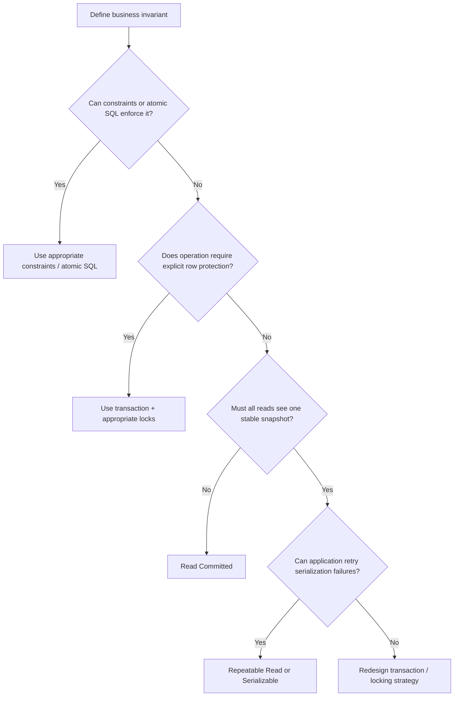

# 08- Isolation Levels

## Overview

**Transaction isolation** defines how much one concurrent transaction is separated from the changes made by other transactions.

When multiple backend requests access the same database concurrently, transactions can overlap:

```text
Request A                    Request B
    │                            │
    ├── BEGIN                   ├── BEGIN
    ├── READ                    ├── UPDATE
    ├── UPDATE                  ├── COMMIT
    └── COMMIT                  └──
```

Without well-defined isolation semantics, concurrent operations can observe unexpected data or overwrite each other's work.

Isolation levels provide a controlled trade-off between:

- Data consistency.
- Concurrency.
- Lock contention.
- Throughput.
- Latency.
- Anomaly prevention.

The four commonly discussed SQL isolation levels are:

| Isolation level | Dirty reads | Non-repeatable reads | Phantoms | Typical concurrency |
|---|---:|---:|---:|---|
| Read Uncommitted | Possible | Possible | Possible | Highest |
| Read Committed | Prevented | Possible | Possible | High |
| Repeatable Read | Prevented | Prevented | Database-dependent | Moderate |
| Serializable | Prevented | Prevented | Prevented | Lowest |

The exact implementation and guarantees vary by database engine. In particular, PostgreSQL's `REPEATABLE READ` uses snapshot isolation semantics and prevents more anomalies than the minimum required by the SQL standard.

## Why Isolation Matters

A backend application can execute correct SQL statements individually and still produce incorrect results under concurrency.

Consider two requests attempting to reserve the last available item:

```text
Initial inventory = 1

Request A                    Request B
    │                            │
    ├── Read inventory = 1       │
    │                            ├── Read inventory = 1
    ├── Reserve item             │
    │                            ├── Reserve item
    └── Commit                   └── Commit
```

Both requests may believe the item is available.

The result can violate the business invariant:

```text
Expected: inventory >= 0

Actual:   inventory = -1
```

Isolation is one part of solving this problem. Correct database constraints, atomic updates, row locks, and transaction design are equally important.

## The Core Read Anomalies

Understanding the anomalies is more useful than memorizing isolation-level names.

### Dirty Read

A transaction reads data written by another transaction that has not committed.

```text
Transaction A              Transaction B
     │                          │
     ├── UPDATE balance = 500   │
     │                          │
     │                          ├── READ balance = 500
     │                          │
     └── ROLLBACK               │
                                │
                         B read data
                         that never committed
```

Transaction B observed a value that ultimately did not exist in committed database state.

A proper implementation of `READ COMMITTED` or stronger prevents dirty reads.

### Non-Repeatable Read

A transaction reads the same row twice and obtains different committed values because another transaction committed an update between the reads.

```text
Transaction A              Transaction B
     │                          │
     ├── READ balance = 100     │
     │                          ├── UPDATE balance = 200
     │                          └── COMMIT
     │
     └── READ balance = 200
```

The row exists in both reads, but its value changed.

### Phantom Read

A transaction executes a predicate query twice and sees a different set of matching rows because another transaction inserted, deleted, or otherwise changed rows that satisfy the predicate.

```sql
SELECT COUNT(*)
FROM orders
WHERE status = 'pending';
```

The first execution might return:

```text
100
```

Another transaction inserts a pending order and commits.

The second execution might return:

```text
101
```

The new matching row is the "phantom."

### Lost Update

A lost update occurs when concurrent transactions read the same value and then write derived values, causing one update to overwrite another.

```text
Initial balance = 100

Transaction A              Transaction B
     │                          │
     ├── READ 100               │
     │                          ├── READ 100
     ├── WRITE 80               │
     │                          ├── WRITE 70
     └── COMMIT                 └── COMMIT
```

The intended changes may have been:

```text
100 - 20 - 30 = 50
```

but the final value can become:

```text
70
```

Isolation level alone is not always the best solution. Atomic SQL updates or row-level locking are often more appropriate.

## Isolation Level Hierarchy

The conceptual hierarchy is:

```text
Less isolation
     │
     ▼
Read Uncommitted
     │
     ▼
Read Committed
     │
     ▼
Repeatable Read
     │
     ▼
Serializable
     │
     ▼
More isolation
```

Higher isolation generally provides stronger guarantees but can reduce concurrency or increase transaction retries, depending on the database implementation.

This is not a simple "higher is always better" decision.

The goal is:

> Use the weakest isolation level that correctly satisfies the business invariants, while applying explicit locking or constraints where necessary.

## Read Uncommitted

`READ UNCOMMITTED` provides the weakest traditional isolation guarantee.

It permits dirty reads in systems that implement the level literally.

### When to Use

In production OLTP systems, there are usually few good reasons to use `READ UNCOMMITTED`.

Potential use cases may include workloads where approximate or potentially uncommitted reads are acceptable, but such cases should be carefully evaluated.

### Advantages

- High concurrency.
- Potentially lower synchronization overhead.
- Minimal blocking in systems that implement dirty reads.

### Limitations

- Can observe data that later rolls back.
- Can produce inconsistent business decisions.
- Poor fit for financial or transactional workloads.

### PostgreSQL Consideration

PostgreSQL does not provide true dirty reads. Its `READ UNCOMMITTED` behavior is effectively equivalent to `READ COMMITTED`.

Therefore, do not assume that specifying the same SQL isolation level produces identical semantics across database engines.

## Read Committed

`READ COMMITTED` prevents dirty reads but allows a transaction to observe changes committed by other transactions during its lifetime.

For example:

```text
Transaction A              Transaction B
     │                          │
     ├── READ value = 100       │
     │                          ├── UPDATE value = 200
     │                          └── COMMIT
     │
     └── READ value = 200
```

This is the default isolation level in PostgreSQL.

### When to Use

`READ COMMITTED` is a strong default for many backend OLTP workloads where:

- Each statement can operate on the latest committed data.
- The transaction does not require a consistent snapshot across all statements.
- Explicit row locking is used for critical concurrency-sensitive operations.

Typical REST APIs, CRUD services, and many Django/FastAPI applications work well with this model.

### Advantages

- Good concurrency.
- Shorter lock and transaction interactions.
- Strong enough for many workloads.
- Usually good throughput.

### Limitations

Multiple statements in one transaction can observe different database states.

For example:

```sql
BEGIN;

SELECT balance
FROM accounts
WHERE id = 1;

-- Another transaction commits an update here.

SELECT balance
FROM accounts
WHERE id = 1;

COMMIT;
```

The two reads can return different committed values under PostgreSQL `READ COMMITTED`.

### Production Consideration

Do not assume:

> "I am inside a transaction, therefore all my reads see the same snapshot."

Under PostgreSQL `READ COMMITTED`, each statement gets its own snapshot.

This distinction is a common senior-level interview topic.

## Repeatable Read

`REPEATABLE READ` provides a stable view of data for the transaction in database systems that implement snapshot-based semantics.

In PostgreSQL, all queries within the transaction see a consistent snapshot established by the first non-transaction-control statement.

Conceptually:

```text
BEGIN
  │
  ▼
Snapshot S
  │
  ├── SELECT → Snapshot S
  ├── SELECT → Snapshot S
  ├── UPDATE
  └── COMMIT
```

If another transaction commits changes after the snapshot is established, ordinary reads in the current transaction do not suddenly switch to the newer committed snapshot.

### When to Use

Use `REPEATABLE READ` when a transaction needs a consistent view across multiple statements and the workload can tolerate serialization failures or other database-specific concurrency behavior.

Examples include:

- Complex analytical reads combined with transactional logic.
- Multi-step calculations requiring a consistent snapshot.
- Operations where changing read results during the transaction would be problematic.

### Advantages

- Stable transaction-level snapshot in PostgreSQL.
- Prevents non-repeatable reads.
- Stronger consistency than `READ COMMITTED`.

### Limitations

- Transactions can encounter serialization/concurrency failures.
- Long-running transactions can create database maintenance pressure.
- It does not automatically make arbitrary business logic safe.
- Semantics differ across database engines.

### PostgreSQL Example

```sql
BEGIN ISOLATION LEVEL REPEATABLE READ;

SELECT balance
FROM accounts
WHERE id = 1;

-- Other transactions may commit changes.

SELECT balance
FROM accounts
WHERE id = 1;

COMMIT;
```

The two reads observe the same transaction snapshot in PostgreSQL.

## Serializable

`SERIALIZABLE` provides the strongest standard isolation guarantee.

The objective is that concurrent transactions produce a result equivalent to some serial execution order.

Conceptually:

```text
Concurrent execution:

Transaction A ───────┐
                     ├── Database
Transaction B ───────┘

must behave like:

A → B

or:

B → A
```

The database may achieve this through locking, predicate locking, serialization checks, or other implementation-specific mechanisms.

### When to Use

Use `SERIALIZABLE` when correctness requires very strong guarantees and the application can handle transaction retries.

Examples include:

- Highly sensitive financial operations.
- Complex allocation algorithms.
- Business invariants that are difficult to enforce with constraints and explicit locks.
- Operations where anomalies at weaker isolation levels are unacceptable.

### Advantages

- Strongest isolation semantics.
- Prevents the major read anomalies.
- Makes complex concurrency reasoning easier.

### Limitations

- Lower concurrency in some workloads.
- Increased contention.
- Transactions can fail with serialization errors.
- Application retry logic becomes important.
- Poorly designed long transactions can have significant performance impact.

### Production Requirement: Retry

Serializable transactions should be treated as retryable operations.

Conceptually:

```text
BEGIN SERIALIZABLE
      │
      ├── Read
      ├── Validate
      ├── Write
      │
      ├── Success ──► COMMIT
      │
      └── Serialization failure
                    │
                    ▼
                  Retry
```

Retries should be bounded and use backoff.

Do not blindly retry indefinitely.

## Isolation Levels Compared

| Property | Read Uncommitted | Read Committed | Repeatable Read | Serializable |
|---|---:|---:|---:|---:|
| Dirty reads | Possible in some DBs | No | No | No |
| Non-repeatable reads | Possible | Possible | Prevented | Prevented |
| Phantoms | Possible | Possible | DB-dependent | Prevented |
| Transaction snapshot | Weak/DB-specific | Statement-level in PostgreSQL | Transaction-level in PostgreSQL | Serializable semantics |
| Concurrency | Highest | High | Moderate | Lowest in many workloads |
| Retry handling | Usually unnecessary | Usually unnecessary | Sometimes required | Commonly required |
| Typical OLTP choice | Rare | Common | Targeted | Targeted |

## PostgreSQL Isolation Model

PostgreSQL uses **MVCC (Multi-Version Concurrency Control)** rather than relying exclusively on read locks.

A simplified model is:

```text
Transaction A
     │
     ├── reads version V1
     │
     ▼
PostgreSQL MVCC
     │
     ├── V1 visible to A
     └── V2 created by B

Transaction B
     │
     └── writes V2
```

Readers generally do not block writers, and writers generally do not block ordinary readers in the same way that a lock-only implementation would.

The visibility of row versions depends on the transaction snapshot and isolation level.

This is one reason PostgreSQL can support high concurrency without placing a shared read lock on every row being read.

## Isolation and MVCC

MVCC maintains multiple row versions so transactions can determine which versions are visible to them.

A simplified lifecycle is:

```text
Old row version
      │
      ▼
Transaction updates row
      │
      ▼
New row version created
      │
      ├── Older snapshot → may see old version
      │
      └── Newer snapshot → may see new version
```

The database must eventually reclaim obsolete versions.

Long-running transactions can prevent old row versions from being cleaned up efficiently.

This is an important production concern for PostgreSQL systems.

## Isolation vs Locking

Isolation level and explicit locking solve related but different problems.

Consider:

```sql
SELECT balance
FROM accounts
WHERE id = 1;
```

If the application needs to read a row and then safely modify it based on that value, it may need a row lock:

```sql
SELECT balance
FROM accounts
WHERE id = 1
FOR UPDATE;
```

Conceptually:

```text
Transaction A
    │
    ├── SELECT ... FOR UPDATE
    │
    ├── Row locked
    │
    ├── Calculate
    ├── UPDATE
    └── COMMIT
               │
               ▼
Transaction B
    │
    └── waits for lock
```

This can be more precise than raising the isolation level for an entire transaction.

## Isolation vs Database Constraints

Many concurrency problems are better solved with constraints.

For example, preventing duplicate email addresses should normally use:

```sql
CREATE UNIQUE INDEX users_email_uq
ON users(email);
```

rather than relying on:

```python
if not user_exists(email):
    create_user(email)
```

The database constraint remains authoritative under concurrent requests.

A senior backend design commonly combines:

```text
Transaction
    +
Isolation
    +
Row locks
    +
Constraints
    +
Atomic SQL
```

rather than expecting isolation level alone to solve every concurrency problem.

## Atomic SQL Can Be Better Than Higher Isolation

Consider decrementing inventory.

Instead of:

```sql
SELECT quantity
FROM inventory
WHERE product_id = 500;
```

then calculating in application code and executing:

```sql
UPDATE inventory
SET quantity = quantity - 1
WHERE product_id = 500;
```

use the invariant directly:

```sql
UPDATE inventory
SET quantity = quantity - 1
WHERE product_id = 500
  AND quantity > 0;
```

Then verify the affected-row count.

```text
UPDATE ... WHERE quantity > 0
            │
            ├── 1 row → reservation succeeded
            │
            └── 0 rows → unavailable
```

This often provides a simpler and more scalable concurrency solution than using `SERIALIZABLE` everywhere.

## Isolation and Transaction Length

Higher isolation does not justify long transactions.

Avoid:

```text
BEGIN
 │
 ├── SELECT
 ├── HTTP request
 ├── External API call
 ├── Large computation
 ├── File processing
 ├── UPDATE
 └── COMMIT
```

Prefer:

```text
Prepare external data
        │
        ▼
BEGIN
        │
        ├── Read required state
        ├── Lock required rows
        ├── Validate
        ├── Write
        └── COMMIT
```

Long transactions can:

- Hold locks longer.
- Increase contention.
- Increase deadlock probability.
- Delay MVCC cleanup.
- Consume pooled connections.
- Increase rollback cost.
- Increase request latency.

## Isolation and Deadlocks

Higher concurrency and explicit locking can introduce deadlocks.

For example:

```text
Transaction A             Transaction B
     │                         │
     ├── Lock Row 1            ├── Lock Row 2
     │                         │
     ├── Wait for Row 2        ├── Wait for Row 1
     │                         │
     └──────── DEADLOCK ───────┘
```

Databases such as PostgreSQL detect deadlocks and abort one transaction.

Applications should:

- Keep transactions short.
- Acquire locks in a consistent order.
- Avoid unnecessary locks.
- Handle retryable database errors where appropriate.

## Isolation and REST APIs

An HTTP request may correspond to a transaction:

```text
Client
  │
  ▼
Nginx / Load Balancer
  │
  ▼
FastAPI / Django
  │
  ▼
Transaction
  │
  ├── SELECT
  ├── UPDATE
  ├── INSERT
  │
  ▼
COMMIT
```

However, the HTTP request itself is not automatically equivalent to a transaction.

The service should define the transaction boundary around the database operations that must be atomic.

For example:

```python
from django.db import transaction

def transfer_money(source_id, destination_id, amount):
    with transaction.atomic():
        source = (
            Account.objects
            .select_for_update()
            .get(id=source_id)
        )

        destination = (
            Account.objects
            .select_for_update()
            .get(id=destination_id)
        )

        if source.balance < amount:
            raise ValueError("Insufficient funds")

        source.balance -= amount
        destination.balance += amount

        source.save(update_fields=["balance"])
        destination.save(update_fields=["balance"])
```

Here, transaction scope and row-level locking work together to protect the business invariant.

## Choosing an Isolation Level

A practical decision process is:



The correct choice is driven by the required invariant, not by a desire to maximize isolation.

## Production Guidance

### Prefer the Database Default Unless You Have a Reason to Change It

For PostgreSQL, `READ COMMITTED` is a reasonable default for many transactional backend workloads.

Changing isolation globally can have broad performance and correctness consequences.

### Keep Isolation Configuration Explicit

If a workflow depends on stronger isolation, make that requirement visible in the service or transaction boundary.

For PostgreSQL:

```sql
BEGIN ISOLATION LEVEL SERIALIZABLE;

-- Transaction work

COMMIT;
```

### Retry Serialization Failures

A retryable transaction should have:

- A bounded retry count.
- Exponential backoff or jitter where appropriate.
- Idempotent business behavior.
- Logging of retry attempts.
- Metrics for serialization failures.

### Avoid Long-Lived Transactions

Monitor transaction duration and investigate transactions that remain open unexpectedly.

### Use the Narrowest Effective Lock

Prefer locking only the rows required by the operation instead of broadly increasing isolation.

### Enforce Invariants in the Database

Use:

- `UNIQUE`.
- `PRIMARY KEY`.
- `FOREIGN KEY`.
- `CHECK`.
- Partial indexes where appropriate.
- Atomic `UPDATE` statements.
- Row-level locking.

### Design for Connection Pools

A transaction occupies a database connection while it is active.

Under high concurrency:

```text
Requests
  │
  ▼
Connection Pool
  │
  ├── Transaction A
  ├── Transaction B
  ├── Transaction C
  └── Waiting requests
```

Long transactions can therefore reduce effective application concurrency even when CPU utilization is low.

## Monitoring Isolation Problems

Monitor more than query latency.

For PostgreSQL production systems, useful signals include:

| Signal | Why it matters |
|---|---|
| Transaction duration | Detects long-running transactions |
| Lock wait time | Indicates contention |
| Deadlocks | Reveals conflicting lock patterns |
| Serialization failures | Indicates concurrency conflicts |
| Connection pool saturation | Transactions may be holding connections too long |
| Database CPU | High contention can amplify resource usage |
| Replication lag | Long-running transactions can affect operational behavior |
| Autovacuum health | Old snapshots can interfere with cleanup |

Useful PostgreSQL inspection queries include:

```sql
SELECT
    pid,
    usename,
    state,
    xact_start,
    query_start,
    wait_event_type,
    wait_event,
    query
FROM pg_stat_activity
WHERE xact_start IS NOT NULL
ORDER BY xact_start;
```

For lock investigation:

```sql
SELECT
    pid,
    usename,
    wait_event_type,
    wait_event,
    state,
    query
FROM pg_stat_activity
WHERE wait_event_type = 'Lock';
```

## Common Mistakes

### Assuming `READ COMMITTED` Provides a Transaction-Wide Snapshot

In PostgreSQL, each statement under `READ COMMITTED` gets a new snapshot.

Use `REPEATABLE READ` when a stable transaction-level snapshot is actually required.

### Using `SERIALIZABLE` Everywhere

Serializable isolation is powerful but can increase contention and transaction retries.

First determine whether constraints, atomic SQL, or targeted locking solve the problem more efficiently.

### Assuming Higher Isolation Fixes Application Logic

A poorly designed transaction can remain incorrect even at a strong isolation level.

Business invariants should be explicitly modeled.

### Ignoring Serialization Failures

Applications using stronger isolation must treat concurrency failures as expected operational outcomes, not impossible bugs.

### Holding Transactions During Network Calls

Do not keep database transactions open while waiting for:

- HTTP APIs.
- Kafka operations.
- Redis calls.
- File uploads.
- User input.
- Long-running computations.

### Confusing Isolation With Durability

Isolation controls concurrent transaction visibility.

Durability is an ACID property concerned with committed data surviving failures.

They solve different problems.

### Assuming All Databases Implement Isolation Levels Identically

The names are standardized, but implementations differ.

PostgreSQL's `REPEATABLE READ`, for example, uses snapshot isolation semantics that provide stronger behavior than the minimum standard definition suggests.

### Relying on Application-Level Checks

This is unsafe:

```python
if inventory.quantity > 0:
    inventory.quantity -= 1
    inventory.save()
```

Concurrent requests can race.

Prefer an atomic SQL operation or an appropriate lock.

## Interview Traps

### What Is the Default Isolation Level in PostgreSQL?

`READ COMMITTED`.

### Does `READ COMMITTED` Prevent Dirty Reads?

Yes.

### Can Two Reads Return Different Values Under `READ COMMITTED`?

Yes. In PostgreSQL, each statement obtains its own snapshot.

### What Does `REPEATABLE READ` Provide in PostgreSQL?

It provides a transaction-level consistent snapshot for ordinary reads and prevents non-repeatable reads. PostgreSQL's implementation also prevents phantom reads for ordinary snapshot reads.

### Does `SERIALIZABLE` Mean Transactions Literally Execute One at a Time?

No.

Transactions can execute concurrently, but the database guarantees a result equivalent to some serial ordering. The implementation may detect conflicts and abort transactions that cannot be serialized.

### Does `SELECT ... FOR UPDATE` Change the Isolation Level?

No.

It explicitly locks selected rows. Isolation level and row-level locking are separate mechanisms.

### Is Serializable Always the Safest Choice?

It provides the strongest general isolation guarantee, but it can reduce concurrency and cause serialization failures. Correct system design usually combines an appropriate isolation level with constraints and targeted locking.

## Practical Isolation Strategy

For a typical PostgreSQL backend:

```text
Default CRUD
    │
    ▼
READ COMMITTED
    │
    ├── Database constraints
    ├── Atomic SQL
    └── Short transactions

Concurrency-sensitive workflow
    │
    ▼
READ COMMITTED
    │
    └── Explicit row locks where required

Stable multi-statement snapshot
    │
    ▼
REPEATABLE READ
    │
    └── Handle transaction conflicts

Strong cross-operation serialization requirement
    │
    ▼
SERIALIZABLE
    │
    └── Bounded retry strategy
```

This approach avoids turning every transaction into a high-isolation transaction while still providing strong correctness where the business domain requires it.

## Key Takeaways

- **Isolation levels define what concurrent transactions can observe and provide a trade-off between consistency and concurrency.**
- **PostgreSQL commonly uses `READ COMMITTED`, where each statement gets its own snapshot; `REPEATABLE READ` provides a stable transaction-level snapshot.**
- **`SERIALIZABLE` provides the strongest isolation guarantee but requires applications to handle serialization failures and retries.**
- **Isolation level alone does not solve every concurrency problem; database constraints, atomic SQL, and targeted row locking are often more precise solutions.**
- **Keep transactions short, avoid network calls inside them, monitor lock and transaction behavior, and choose isolation based on business invariants rather than simply choosing the strongest level.**