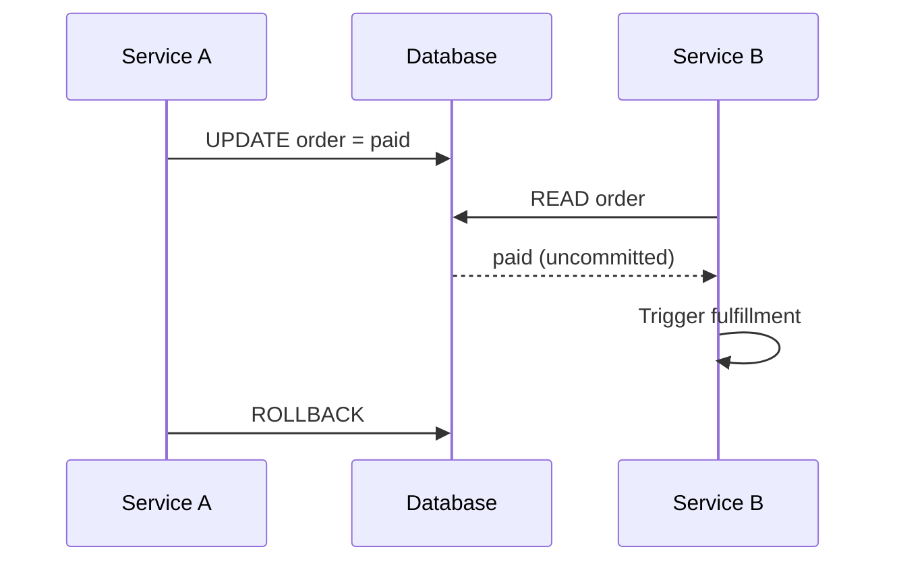

# 09- Read Uncommitted

## Overview

**Read Uncommitted** is the weakest standard SQL transaction isolation level. It permits a transaction to potentially observe changes made by other transactions before those changes are committed.

Its defining characteristic is that **dirty reads are allowed** in database systems that implement `READ UNCOMMITTED` literally.

```text
Transaction A                    Transaction B
     │                                │
     ├── UPDATE balance = 500         │
     │                                │
     │                                ├── READ balance = 500
     │                                │
     └── ROLLBACK                     │
                                      │
                              B observed a value
                              that never committed
```

The result is potentially inconsistent because Transaction B has read data that Transaction A subsequently discarded.

`READ UNCOMMITTED` exists primarily as the lowest point on the SQL isolation spectrum. In modern production OLTP systems, it is rarely an appropriate application-level choice because the performance benefit is usually not worth weakening correctness guarantees.

A critical production detail is that **isolation-level names do not guarantee identical behavior across database engines**. PostgreSQL, for example, does not provide true dirty reads: requesting `READ UNCOMMITTED` is treated as `READ COMMITTED`.

## Why Read Uncommitted Exists

Transaction isolation represents a trade-off between concurrency and consistency.

Conceptually:

```text
More consistency
      ▲
      │
Serializable
      │
Repeatable Read
      │
Read Committed
      │
Read Uncommitted
      │
      ▼
More permissive concurrency
```

`READ UNCOMMITTED` minimizes isolation requirements. A database engine that implements it literally may allow readers to observe uncommitted row versions rather than waiting for transactions to commit or roll back.

The intended use case is a workload where:

- Approximate or transient data is acceptable.
- The application does not require reads to represent committed state.
- Maximum read concurrency is more important than strict consistency.

In practice, modern systems usually solve high-throughput reads using better approaches such as:

- Proper indexing.
- Read replicas.
- Caching.
- Materialized views.
- Partitioning.
- Query optimization.
- Snapshot-based MVCC.

These approaches generally avoid the correctness problems of dirty reads.

## Dirty Reads

The primary anomaly associated with `READ UNCOMMITTED` is the **dirty read**.

A dirty read occurs when Transaction B reads data written by Transaction A before A commits.

```text
Initial balance = 100

Transaction A                    Transaction B
     │                                │
     ├── UPDATE balance = 0           │
     │                                │
     │                                ├── SELECT balance
     │                                │
     │                                └── Reads 0
     │
     └── ROLLBACK
```

The database is now back to:

```text
balance = 100
```

But Transaction B temporarily observed:

```text
balance = 0
```

That value never became committed database state.

### Why Dirty Reads Are Dangerous

A backend service may make a business decision using the dirty value.

For example:

```text
Database:
account balance = 100

Transaction A:
withdraw 100
→ temporary balance = 0

Transaction B:
reads balance = 0
→ rejects another operation

Transaction A:
ROLLBACK
→ balance = 100
```

Transaction B made a decision based on state that was never committed.

For business-critical data, this behavior is generally unacceptable.

## Other Anomalies

`READ UNCOMMITTED` provides very weak consistency guarantees.

Depending on the database implementation, applications may encounter:

| Anomaly | Possible under Read Uncommitted |
|---|---:|
| Dirty reads | Yes |
| Non-repeatable reads | Yes |
| Phantom reads | Yes |
| Lost updates | Possible depending on application behavior and database |
| Inconsistent business decisions | Yes |

The exact behavior remains database-specific.

Isolation level alone also does not automatically prevent every form of write conflict. Application-level race conditions can still exist even when using stronger isolation.

## Read Uncommitted vs Read Committed

The most important practical comparison is with `READ COMMITTED`.

| Property | Read Uncommitted | Read Committed |
|---|---:|---:|
| Dirty reads | Possible | Prevented |
| Non-repeatable reads | Possible | Possible |
| Phantom reads | Possible | Possible |
| Sees uncommitted changes | Potentially | No |
| Consistency | Weak | Moderate |
| Typical OLTP usage | Rare | Common |
| PostgreSQL behavior | Equivalent to Read Committed | Native default |

`READ COMMITTED` is often a much better default because it prevents dirty reads while maintaining good concurrency.

## PostgreSQL Behavior

PostgreSQL uses **MVCC (Multi-Version Concurrency Control)**.

Under PostgreSQL, the SQL standard's `READ UNCOMMITTED` level is mapped to `READ COMMITTED`.

Therefore:

```sql
BEGIN ISOLATION LEVEL READ UNCOMMITTED;

SELECT *
FROM accounts
WHERE id = 42;

COMMIT;
```

does **not** allow the transaction to read uncommitted data from another transaction.

PostgreSQL effectively treats it as:

```sql
BEGIN ISOLATION LEVEL READ COMMITTED;
```

This is an important interview and production distinction.

### Verify the Current Isolation Level

PostgreSQL provides:

```sql
SHOW transaction_isolation;
```

You can explicitly request:

```sql
SET TRANSACTION ISOLATION LEVEL READ UNCOMMITTED;
```

but PostgreSQL's behavior remains equivalent to `READ COMMITTED`.

### Why PostgreSQL Does This

PostgreSQL's MVCC model provides consistent visibility of committed row versions without requiring dirty reads.

A simplified view is:

```text
Transaction A
     │
     ├── UPDATE row
     │
     ├── creates new row version
     │
     └── uncommitted
             │
             ▼
       Transaction B
             │
             └── cannot see A's uncommitted version
```

Instead, B sees the appropriate committed version according to its snapshot.

This allows PostgreSQL to provide high read concurrency without exposing uncommitted application state.

## Database Differences Matter

Do not interpret:

```sql
SET TRANSACTION ISOLATION LEVEL READ UNCOMMITTED;
```

as having identical semantics everywhere.

Different database engines implement isolation differently.

For example:

| Database | Read Uncommitted behavior |
|---|---|
| PostgreSQL | Treated as `READ COMMITTED` |
| SQL Server | Supports dirty reads |
| MySQL/InnoDB | Isolation behavior differs from PostgreSQL and is affected by its MVCC implementation |
| Oracle | Does not provide true `READ UNCOMMITTED` |

The correct engineering approach is to understand the database engine's actual concurrency model rather than relying solely on the SQL isolation-level name.

## When Read Uncommitted Might Be Considered

A literal `READ UNCOMMITTED` level can theoretically be considered when:

- The data is inherently approximate.
- Dirty data cannot cause harmful business decisions.
- The workload is read-heavy.
- Temporary inconsistencies are acceptable.
- The database implementation provides a meaningful performance advantage from weaker isolation.
- The team has explicitly accepted the consistency trade-off.

Examples might include non-critical operational dashboards where values are informational rather than authoritative.

Even here, alternatives should be evaluated first.

### Poor Candidates

Avoid `READ UNCOMMITTED` for:

- Financial balances.
- Payments.
- Inventory allocation.
- Authentication state.
- Authorization decisions.
- Order state transitions.
- Billing.
- Account ownership.
- Critical business invariants.
- Data used to trigger irreversible actions.

A dirty read in these workflows can result in incorrect decisions.

## Read Uncommitted and Backend APIs

Consider a FastAPI or Django service exposing an account endpoint:

```text
Client
  │
  ▼
Load Balancer / Nginx
  │
  ▼
FastAPI / Django
  │
  ▼
Database transaction
  │
  ├── SELECT account
  │
  ▼
HTTP response
```

If the endpoint reads uncommitted data from a concurrent transaction, it could return state that later disappears.

For example:

```text
Transaction A
    │
    ├── Set order status = "paid"
    │
    │      Transaction B
    │           │
    │           ├── GET /orders/123
    │           │
    │           └── observes "paid"
    │
    └── ROLLBACK
```

The API has exposed a state that was never committed.

A subsequent request may correctly observe:

```text
order.status = "pending"
```

This creates inconsistent API behavior that is difficult for clients to reason about.

## Read Uncommitted and Microservices

The problem becomes more significant when a dirty read triggers another service operation.



Service B may have already initiated fulfillment even though the payment state was rolled back.

This illustrates an important architectural principle:

> Data used to trigger external side effects should represent committed, authoritative state.

For event-driven systems, transactional patterns such as an **outbox pattern** are often preferable to allowing downstream services to infer state from potentially inconsistent reads.

## Read Uncommitted and Caching

Weak database isolation should not be confused with eventual consistency introduced by caching.

These are different mechanisms.

### Read Uncommitted

```text
Database
   │
   └── Reader may observe uncommitted state
```

### Cache

```text
Database
   │
   └── Committed state
          │
          ▼
        Cache
          │
          └── May temporarily contain stale state
```

A cache can return stale committed data, while a dirty read can return data that may never commit.

Both produce different consistency behaviors and must be reasoned about separately.

## Read Uncommitted and Performance

The usual argument for weak isolation is performance.

The reasoning is:

```text
Lower isolation
      │
      ▼
Less synchronization
      │
      ▼
Potentially more concurrency
      │
      ▼
Potentially higher throughput
```

However, this does not mean:

> `READ UNCOMMITTED` is automatically faster.

Modern databases use sophisticated concurrency mechanisms such as:

- MVCC.
- Row-level locking.
- Lock-free or low-lock reads where possible.
- Buffer caches.
- Query planners.
- Indexes.
- Parallel execution.

A poorly indexed query will not become efficient merely because it uses a weaker isolation level.

Similarly, reducing isolation does not fix:

- Full table scans.
- Missing indexes.
- Excessive network latency.
- N+1 queries.
- Poor connection pooling.
- Inefficient joins.
- Large result sets.

Performance problems should first be diagnosed using database metrics and query plans.

## Production Considerations

### Prefer Read Committed for General OLTP

For PostgreSQL applications, `READ COMMITTED` is already the practical baseline.

Do not lower isolation merely because a query is slow.

Investigate:

```sql
EXPLAIN (ANALYZE, BUFFERS)
SELECT *
FROM orders
WHERE customer_id = 12345;
```

Then optimize the actual bottleneck.

### Do Not Use Dirty Reads to Avoid Locking

If a query is blocked by a lock, using dirty reads as a workaround can hide a transaction-management problem.

Instead investigate:

- Long-running transactions.
- Lock acquisition order.
- Missing indexes.
- Unnecessary locks.
- Oversized transaction boundaries.
- Connection pool behavior.

### Keep Transactions Short

Long transactions increase concurrency problems and can hold locks or snapshots longer than necessary.

Prefer:

```text
Prepare data
     │
     ▼
BEGIN
     │
     ├── Read
     ├── Validate
     ├── Write
     └── COMMIT
```

Avoid:

```text
BEGIN
  │
  ├── Database query
  ├── External HTTP request
  ├── Kafka operation
  ├── Long computation
  ├── File processing
  └── COMMIT
```

### Do Not Use It for Security Decisions

Authorization and access-control decisions should be based on authoritative committed state.

Never weaken isolation for convenience when a read controls:

- User permissions.
- Role changes.
- Account status.
- Resource ownership.
- Security policy.

## Better Alternatives

If the motivation is performance, consider the actual problem.

| Problem | Better approach |
|---|---|
| Slow reads | Index/query optimization |
| High read traffic | Read replicas |
| Repeated expensive queries | Redis/cache |
| Large historical tables | Partitioning |
| Expensive aggregations | Materialized views/precomputation |
| Lock contention | Shorter transactions and targeted locking |
| Large result sets | Pagination |
| High database CPU | Query-plan and workload optimization |
| Cross-service state propagation | Events/outbox pattern |

This usually produces a better system than weakening consistency globally.

## Common Mistakes

### Assuming Read Uncommitted Is a Universal Performance Optimization

It is not.

Lower isolation can reduce consistency without fixing the underlying query bottleneck.

### Assuming PostgreSQL Supports Dirty Reads

It does not.

PostgreSQL treats `READ UNCOMMITTED` as `READ COMMITTED`.

### Using Dirty Reads for Financial Data

This can cause decisions based on values that subsequently roll back.

Use appropriate transactions, constraints, atomic operations, and locking instead.

### Using Read Uncommitted to Avoid Lock Contention

If locks are causing latency, investigate why transactions are holding them.

Do not simply hide the contention by allowing inconsistent reads.

### Assuming Isolation Level Prevents Lost Updates

Isolation levels and write-conflict handling are related but distinct.

For example, an atomic update is often more appropriate:

```sql
UPDATE accounts
SET balance = balance - 100
WHERE id = 42
  AND balance >= 100;
```

Then inspect the affected-row count.

### Treating SQL Isolation Names as Portable Behavior

The same isolation-level name can have different implementation details across PostgreSQL, MySQL, SQL Server, Oracle, and other systems.

Always verify the target database's behavior.

## Interview Traps

### What Is the Main Problem With Read Uncommitted?

It can allow **dirty reads**, where a transaction observes data written by another transaction before that write commits.

### Is Read Uncommitted Faster Than Read Committed?

Not necessarily.

Its weaker semantics may reduce synchronization in some database implementations, but query performance depends on many other factors.

### Does PostgreSQL Support Dirty Reads?

No.

PostgreSQL maps `READ UNCOMMITTED` to `READ COMMITTED`.

### Why Would Anyone Use Read Uncommitted?

The theoretical use case is a workload where temporary inconsistent or uncommitted values are acceptable and maximum concurrency is prioritized. Such cases are uncommon in correctness-sensitive OLTP systems.

### Does Read Uncommitted Prevent Non-Repeatable Reads?

No.

It provides the weakest traditional isolation semantics and permits multiple anomaly classes.

### Should Read Uncommitted Be Used Instead of a Read Replica?

No.

A read replica addresses read scalability and may introduce replication lag, but it does not require exposing uncommitted transactional state.

### Does Read Uncommitted Eliminate Locking?

No.

The exact locking behavior is database-specific, and writes can still require locks. Isolation level should not be treated as a universal mechanism for eliminating contention.

## Practical Decision

For a modern PostgreSQL backend:

```text
Need better read performance?
          │
          ▼
Diagnose query
          │
          ├── Missing index ──────► Add appropriate index
          │
          ├── Expensive query ────► Optimize query plan
          │
          ├── High read volume ───► Cache / read replica
          │
          ├── Large historical data ► Partition
          │
          └── Lock contention ────► Fix transaction / locking design
```

Do not start with:

```sql
SET TRANSACTION ISOLATION LEVEL READ UNCOMMITTED;
```

For PostgreSQL, that would not provide dirty reads anyway.

## Security Considerations

`READ UNCOMMITTED` is particularly inappropriate when query results influence security-sensitive behavior.

Avoid weak consistency for:

- Authorization.
- Permission changes.
- Account suspension.
- Authentication state.
- Ownership validation.
- Financial authorization.
- Security policy enforcement.

A transient or rolled-back state should not be sufficient to authorize an irreversible action.

## Reliability Considerations

A reliable backend should make important state transitions based on committed database state.

For workflows involving external side effects:

```text
Database transaction
       │
       ├── Validate state
       ├── Persist authoritative change
       └── COMMIT
              │
              ▼
       Publish/consume event
              │
              ▼
       External side effect
```

This is safer than allowing another component to observe uncommitted state and act on it.

## Key Takeaways

- **`READ UNCOMMITTED` is the weakest standard isolation level and can permit dirty reads in databases that implement it literally.**
- **PostgreSQL does not provide true dirty reads; `READ UNCOMMITTED` behaves as `READ COMMITTED`.**
- **Do not use weak isolation as a generic performance optimization; diagnose queries, indexes, locks, connection pools, and workload architecture first.**
- **Never rely on potentially uncommitted data for financial, security-sensitive, authorization, inventory, or other correctness-critical decisions.**
- **Database-specific behavior matters: always understand the actual MVCC and locking implementation rather than assuming isolation-level names are portable.**