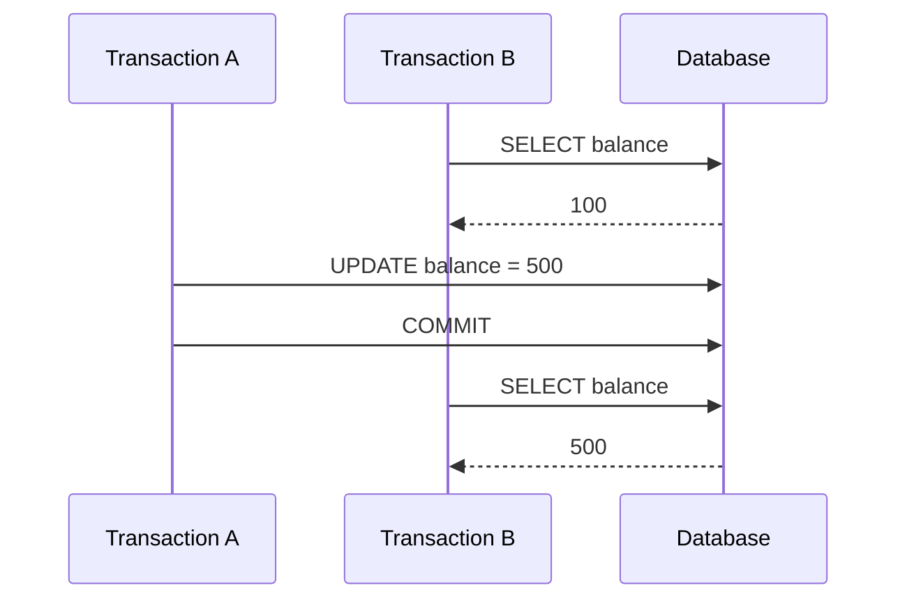
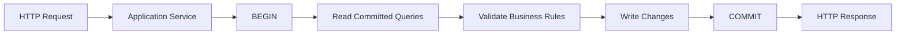
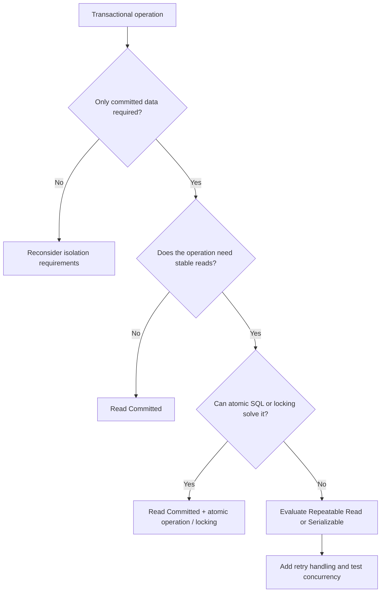

# 10- Read Committed

## Overview

**Read Committed** is a transaction isolation level that guarantees a transaction does not read data written by another transaction until that data has been committed.

It is stronger than `READ UNCOMMITTED` because it prevents dirty reads while still allowing substantial concurrency. It is also the default isolation level in PostgreSQL and is a common choice for OLTP workloads.

The key mental model is:

```text
Transaction A                    Transaction B
     │                                │
     ├── UPDATE balance = 500         │
     │   (uncommitted)                │
     │                                │
     │                                ├── SELECT balance
     │                                │
     │                                └── Sees old committed value
     │
     ├── COMMIT                       │
     │                                │
     │                                ├── SELECT balance
     │                                │
     │                                └── Sees 500
```

`READ COMMITTED` prevents dirty reads, but it does **not** provide a stable snapshot for an entire transaction. A second query can observe changes committed by concurrent transactions after the first query completes.

That distinction is fundamental when designing concurrent backend systems.

## Why Read Committed Exists

Database systems need to balance:

- Correctness.
- Concurrency.
- Lock contention.
- Throughput.
- Latency.

`READ COMMITTED` provides a practical middle ground:

| Isolation level | Dirty reads | Non-repeatable reads | Phantom reads |
|---|---:|---:|---:|
| Read Uncommitted | Possible | Possible | Possible |
| **Read Committed** | **Prevented** | Possible | Possible |
| Repeatable Read | Prevented | Prevented | Database-dependent |
| Serializable | Prevented | Prevented | Prevented |

The important property is that **only committed data is visible**, while concurrent transactions can continue operating without requiring the entire database to behave as one serialized execution stream.

## How Read Committed Works

The exact implementation depends on the database engine.

In MVCC-based databases such as PostgreSQL, a query generally determines which row versions are visible according to a snapshot taken for that statement.

This means:

> Under PostgreSQL `READ COMMITTED`, each statement gets its own visibility snapshot.

Consider:

```text
Transaction B

SELECT balance;    → snapshot #1

        Concurrent Transaction A commits

SELECT balance;    → snapshot #2
```

The second statement can therefore see data that the first statement could not.

This is different from `REPEATABLE READ`, where the transaction generally operates from a transaction-level snapshot.

## Statement-Level Visibility

Consider an account with:

```text
balance = 100
```

Transaction B begins:

```sql
BEGIN;

SELECT balance
FROM accounts
WHERE id = 42;
```

Result:

```text
100
```

While Transaction B remains open, Transaction A commits:

```sql
UPDATE accounts
SET balance = 500
WHERE id = 42;

COMMIT;
```

Transaction B then executes:

```sql
SELECT balance
FROM accounts
WHERE id = 42;
```

Under PostgreSQL `READ COMMITTED`, the second statement can return:

```text
500
```

The transaction has therefore observed two different committed states.

This is a **non-repeatable read**.

## Dirty Reads Are Prevented

Suppose Transaction A changes a row but has not committed:

```text
Transaction A
    │
    ├── UPDATE balance = 500
    │
    └── uncommitted
```

Transaction B executes:

```sql
SELECT balance
FROM accounts
WHERE id = 42;
```

B does not see A's uncommitted value.

Instead, it sees the appropriate previously committed version.

If A rolls back:

```text
A → ROLLBACK
```

B never observed the invalid intermediate state.

This is the primary correctness improvement over `READ UNCOMMITTED`.

## Non-Repeatable Reads

A non-repeatable read occurs when the same transaction executes the same logical query twice and receives different results because another transaction committed a change between the reads.



Both results are committed and valid.

The issue is that B does not get one consistent snapshot across its entire transaction.

This behavior is allowed under `READ COMMITTED`.

## Phantom Reads

A phantom read occurs when a repeated query returns a different set of rows because another transaction inserted, deleted, or otherwise changed rows matching the query predicate.

Example:

```sql
BEGIN;

SELECT COUNT(*)
FROM orders
WHERE customer_id = 42
  AND status = 'pending';
```

Suppose the result is:

```text
5
```

Another transaction inserts a matching order and commits.

The first transaction repeats:

```sql
SELECT COUNT(*)
FROM orders
WHERE customer_id = 42
  AND status = 'pending';
```

It may now return:

```text
6
```

The newly visible row is effectively a phantom from the perspective of the first query.

## Read Committed and PostgreSQL

PostgreSQL uses `READ COMMITTED` as its default transaction isolation level.

You can inspect it with:

```sql
SHOW transaction_isolation;
```

Typical output:

```text
read committed
```

You can explicitly configure a transaction:

```sql
BEGIN ISOLATION LEVEL READ COMMITTED;

SELECT *
FROM orders
WHERE customer_id = 42;

COMMIT;
```

Because it is PostgreSQL's default, explicit specification is usually unnecessary unless the isolation level is being documented as an intentional part of the transaction's behavior.

## PostgreSQL MVCC

PostgreSQL's implementation uses MVCC to maintain multiple row versions.

A simplified representation is:

```text
orders row

Version 1
status = pending
      │
      │ UPDATE + COMMIT
      ▼
Version 2
status = paid
```

A query determines which version is visible according to transaction visibility rules.

This allows readers and writers to operate concurrently in many cases without readers simply blocking on every write.

The actual PostgreSQL implementation is more sophisticated and includes transaction IDs, tuple visibility metadata, snapshots, vacuuming, and transaction status information.

The important engineering implication is that **visibility and locking are separate concepts**.

## Read Committed Does Not Mean "No Locks"

`READ COMMITTED` does not eliminate locking.

Locks can still occur for:

- `UPDATE`.
- `DELETE`.
- `SELECT ... FOR UPDATE`.
- DDL.
- Explicit locking.
- Foreign-key enforcement.
- Other database operations.

For example:

```sql
SELECT *
FROM inventory
WHERE product_id = 100
FOR UPDATE;
```

The query intentionally acquires a row-level lock so that the application can safely modify the selected inventory record.

Isolation level determines visibility and concurrency semantics; it does not replace explicit locking when the business operation requires coordination.

## Read Committed and Concurrent Updates

Consider:

```sql
UPDATE accounts
SET balance = balance - 100
WHERE id = 42;
```

Two concurrent transactions can issue this statement.

The database coordinates the writes so that both updates are not simply allowed to overwrite one another blindly.

For correctness-critical operations, prefer atomic database operations:

```sql
UPDATE accounts
SET balance = balance - 100
WHERE id = 42
  AND balance >= 100;
```

Then check the number of affected rows.

Conceptually:

```text
UPDATE affected 1 row → operation succeeded
UPDATE affected 0 rows → business condition failed
```

This is generally safer than:

```text
SELECT balance
↓
calculate new balance in application
↓
UPDATE balance
```

because the latter creates a larger race window.

## Read Committed and Transaction Boundaries

Isolation behavior only makes sense when transaction boundaries are deliberately designed.

A typical backend request might follow:



The transaction should normally contain the database operations that must succeed or fail together.

Avoid keeping a database transaction open while performing slow external operations such as:

- HTTP requests.
- Large file processing.
- Long-running CPU work.
- Waiting for user interaction.
- Slow third-party APIs.

A long transaction can increase:

- Lock duration.
- Connection occupancy.
- Snapshot lifetime.
- Resource consumption.
- Contention.

## Practical Backend Example

Consider an order service implemented with Django or SQLAlchemy.

A simplified workflow might be:

```python
from django.db import transaction

@transaction.atomic
def confirm_order(order_id: int) -> None:
    order = (
        Order.objects
        .select_for_update()
        .get(id=order_id)
    )

    if order.status != "pending":
        raise ValueError("Order cannot be confirmed")

    order.status = "confirmed"
    order.save(update_fields=["status"])
```

Two requests attempting to confirm the same order can coordinate through the database lock.

The important design is not simply "use `READ COMMITTED`". It is:

1. Start a deliberate transaction.
2. Lock the resource that requires serialization.
3. Validate current state.
4. Perform the state transition.
5. Commit quickly.

## Read Committed and `SELECT FOR UPDATE`

A common production pattern is:

```sql
BEGIN;

SELECT id, status
FROM orders
WHERE id = 123
FOR UPDATE;

UPDATE orders
SET status = 'confirmed'
WHERE id = 123;

COMMIT;
```

The lock ensures that another transaction attempting to acquire a conflicting row lock must wait.

This is useful when the application performs a **read-modify-write** operation whose correctness depends on the row remaining unchanged during the transaction.

Do not add `FOR UPDATE` indiscriminately. Locking unnecessary rows can reduce concurrency and create deadlocks.

## Read Committed vs Repeatable Read

The distinction is important in senior-level interviews.

| Behavior | Read Committed | Repeatable Read |
|---|---|---|
| Dirty reads | Prevented | Prevented |
| Snapshot scope in PostgreSQL | Per statement | Per transaction |
| Non-repeatable reads | Possible | Prevented |
| Phantom behavior | Possible | Prevented for normal PostgreSQL snapshot reads |
| Concurrency | High | More restrictive |
| Typical use | General OLTP | Workflows requiring stable reads |

For PostgreSQL, `REPEATABLE READ` provides a transaction-level snapshot. Concurrent modifications can also cause serialization failures in situations where the snapshot can no longer support the requested operation safely.

Therefore, increasing isolation can require retry handling.

## Advantages

### Good Default for OLTP

`READ COMMITTED` provides a practical balance between consistency and concurrency.

It is appropriate for many:

- REST APIs.
- gRPC services.
- Django applications.
- FastAPI applications.
- CRUD services.
- Order-management systems.
- Administrative applications.

### Prevents Dirty Reads

A transaction cannot base its normal reads on another transaction's uncommitted changes.

This avoids one of the most dangerous forms of inconsistent database visibility.

### Good Concurrency

Compared with stronger isolation levels, `READ COMMITTED` generally permits more concurrent activity.

This makes it well suited to high-throughput transactional workloads.

### Works Well With Explicit Locking

Applications can selectively introduce stronger coordination when necessary:

```sql
SELECT ...
FOR UPDATE;
```

This lets the system keep normal reads relatively concurrent while protecting specific critical sections.

## Limitations

### No Transaction-Wide Consistent Snapshot

Repeated reads can observe different committed states.

This matters when several queries must be interpreted as one coherent snapshot.

### Business Rules Can Still Race

`READ COMMITTED` does not automatically make multi-step application logic atomic.

For example:

```text
SELECT available = true
↓
another transaction changes available
↓
INSERT allocation
```

The application may still need:

- Row locks.
- Unique constraints.
- Atomic updates.
- Serializable transactions.
- Retry logic.

### More Complex Reasoning Than It Appears

Developers sometimes assume:

```text
BEGIN
↓
all reads see one state
↓
COMMIT
```

That is not the PostgreSQL `READ COMMITTED` model.

Each statement can see a newer committed state.

## Production Considerations

### Use Explicit Transaction Boundaries

In application frameworks, understand how transactions are managed.

For Django:

```python
from django.db import transaction

with transaction.atomic():
    # Related database operations form one transaction.
    ...
```

For SQLAlchemy:

```python
with session.begin():
    ...
```

For raw PostgreSQL:

```sql
BEGIN;

-- transactional work

COMMIT;
```

Do not assume framework-level transaction behavior without verifying the actual configuration.

### Keep Transactions Short

A transaction should generally contain only the database work that needs atomicity.

Prefer:

```text
BEGIN
  ↓
SELECT / UPDATE
  ↓
COMMIT
  ↓
External side effect
```

over:

```text
BEGIN
  ↓
Database operation
  ↓
External HTTP call
  ↓
Kafka operation
  ↓
Long computation
  ↓
COMMIT
```

When database state and external side effects must be coordinated, consider patterns such as the transactional outbox rather than holding a database transaction open across distributed systems.

### Design for Retries

At `READ COMMITTED`, ordinary lock waits and transaction failures can still occur.

Production code should distinguish:

- Retryable database errors.
- Constraint violations.
- Business validation failures.
- Deadlocks.
- Serialization failures.
- Connection failures.

Do not blindly retry every exception.

### Use Constraints for Invariants

Do not rely exclusively on application-level checks.

For example:

```sql
CREATE UNIQUE INDEX uq_active_subscription
ON subscriptions (customer_id)
WHERE status = 'active';
```

The database can enforce the invariant even when multiple application instances race.

## Performance Considerations

`READ COMMITTED` is generally performant because it does not require every transaction to maintain the same long-lived snapshot.

However, isolation level is only one component of database performance.

If an endpoint is slow, investigate:

```sql
EXPLAIN (ANALYZE, BUFFERS)
SELECT *
FROM orders
WHERE customer_id = 42
  AND status = 'pending';
```

Also inspect:

- Index usage.
- Query cardinality.
- Lock waits.
- Connection pool saturation.
- CPU.
- Memory.
- Disk I/O.
- Cache hit ratio.
- Long-running transactions.

Do not change isolation levels simply because a query is slow.

## Monitoring

For production PostgreSQL systems, monitor transaction behavior as part of database observability.

Useful signals include:

| Metric / Signal | Why it matters |
|---|---|
| Transaction duration | Detects long-running transactions |
| Lock wait time | Indicates contention |
| Active connections | Indicates pool/database pressure |
| Deadlocks | Indicates conflicting locking patterns |
| Query latency | Detects slow transactional operations |
| Transaction rate | Shows workload volume |
| Idle-in-transaction sessions | Can hold resources unexpectedly |
| Replication lag | Important when reads use replicas |

Long-running or idle transactions deserve particular attention because they can interfere with vacuum progress and retain old row versions in PostgreSQL.

## High Availability and Replicas

Read Committed behavior applies to the database connection handling the transaction.

If an application uses read replicas, another consistency dimension appears:

```text
Primary
   │
   ├── COMMIT
   │
   ▼
Replication
   │
   ▼
Replica
```

A transaction reading from a replica may observe **replication lag**, which is different from transaction isolation.

Therefore:

- Primary reads provide authoritative current committed state.
- Replica reads may be stale.
- `READ COMMITTED` does not eliminate replica lag.
- Critical read-after-write workflows may need primary reads or an appropriate consistency strategy.

## Security Considerations

`READ COMMITTED` should not be treated as an authorization mechanism.

Authorization should still be enforced through:

- Application-level permission checks.
- Database constraints where appropriate.
- Row-level security when applicable.
- Correct transaction boundaries.
- Explicit locking for security-sensitive state transitions.

For example, changing a user's role and performing an authorization-sensitive operation may require careful ordering and transactional coordination.

Isolation provides concurrency semantics; it does not replace access control.

## Common Mistakes

### Assuming All Reads Within a Transaction See the Same Data

Under PostgreSQL `READ COMMITTED`, they do not necessarily.

Each statement obtains its own snapshot.

### Using `READ COMMITTED` Without Thinking About Race Conditions

Preventing dirty reads does not make this safe:

```text
SELECT inventory
↓
application checks inventory > 0
↓
UPDATE inventory
```

Another transaction may modify the inventory between those operations.

Use atomic updates or appropriate locking.

### Overusing `SELECT FOR UPDATE`

Locks should protect actual critical sections.

Locking every read can unnecessarily reduce concurrency and increase deadlock risk.

### Holding Transactions Across External Calls

This consumes database connections and can retain locks or snapshots for too long.

Perform external operations outside the transaction when the architecture permits it.

### Relying Only on Application Validation

This pattern is unsafe:

```text
if email does not exist:
    INSERT email
```

Two concurrent requests can both pass the check.

A unique database constraint is the final protection.

### Confusing Isolation With Replication Consistency

`READ COMMITTED` does not guarantee that a read replica immediately reflects a primary commit.

Isolation and replication consistency are separate concerns.

## Interview Traps

### Does Read Committed Prevent Dirty Reads?

Yes.

A transaction does not read another transaction's uncommitted changes.

### Does Read Committed Prevent Non-Repeatable Reads?

No.

A later statement can observe a newly committed value.

### Does Read Committed Provide a Transaction-Wide Snapshot in PostgreSQL?

No.

PostgreSQL `READ COMMITTED` uses a statement-level snapshot.

### Why Can Two SELECTs in One Transaction Return Different Results?

Because concurrent transactions can commit changes between the statements, and each statement obtains a new visibility snapshot.

### Is Read Committed the Same as No Locking?

No.

Writes and explicit locking operations can still acquire locks.

### Is Read Committed Enough for Every Business Workflow?

No.

Critical read-modify-write workflows may require:

- Atomic SQL.
- Constraints.
- Row-level locking.
- Stronger isolation.
- Optimistic concurrency control.
- Retry logic.

### Is Read Committed Always Faster Than Repeatable Read?

Not universally.

Performance depends on workload, query patterns, contention, implementation details, and transaction duration. Isolation should be selected based on correctness requirements first, then measured for performance.

## Practical Decision Framework

Use `READ COMMITTED` as the baseline for many transactional backend workloads, then strengthen coordination only where the business invariant requires it.



A senior-level approach is not:

> "Always use the strongest isolation."

It is:

> "Choose the weakest isolation level that correctly enforces the business invariants, then use explicit constraints, atomic operations, and locking where needed."

## Recommended Patterns

| Requirement | Recommended approach |
|---|---|
| Normal CRUD | Read Committed |
| Prevent dirty reads | Read Committed |
| Atomic counter update | Single `UPDATE` |
| Protect read-modify-write row | `SELECT ... FOR UPDATE` |
| Enforce uniqueness | `UNIQUE` constraint/index |
| Stable transaction-wide snapshot | Repeatable Read |
| Complex cross-row invariants | Evaluate Serializable |
| External side effect after commit | Transactional outbox |
| High read volume | Read replicas/cache |
| Slow query | Query/index optimization |

## Key Takeaways

- **Read Committed prevents dirty reads while allowing strong concurrency, making it a practical default for many OLTP workloads.**
- **In PostgreSQL, each statement gets its own visibility snapshot, so repeated reads within one transaction can observe newly committed changes.**
- **Read Committed does not eliminate race conditions; use atomic SQL, constraints, row-level locking, or stronger isolation when business invariants require them.**
- **Keep transactions short and deliberate, and avoid holding database transactions across slow external operations.**
- **Isolation level, replication consistency, and application-level authorization are separate concerns and must be designed independently.**