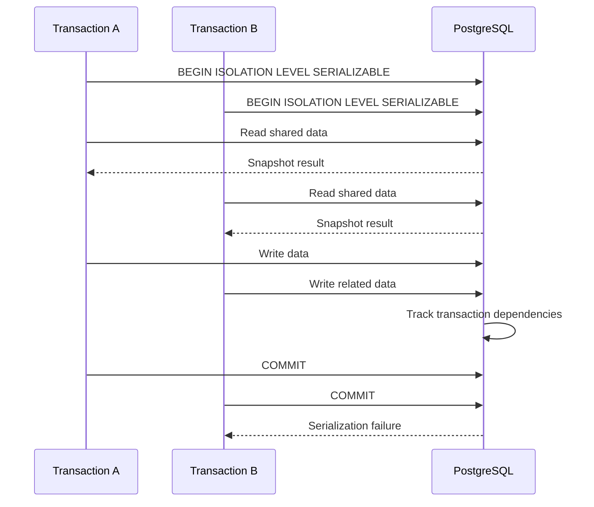
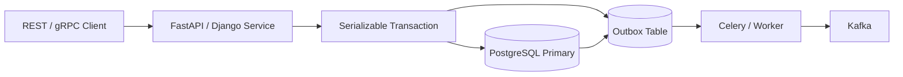

# 12- Serializable

## Overview

**Serializable** is the strongest standard SQL transaction isolation level. It guarantees that the committed outcome of concurrently executing transactions is equivalent to some serial execution of those transactions.

In practical terms, concurrent transactions may run at the same time, but the database prevents their combined effects from producing a result that could not have occurred if those transactions had executed one after another.

```text
Concurrent execution

Transaction A ────────────────┐
                              ├── Database concurrency control
Transaction B ────────────────┘
                                      │
                                      ▼
                            Serializable result
                                      │
                                      ▼
                    Equivalent to a valid serial order
```

Serializable isolation is primarily a **correctness mechanism**. It is useful when business invariants span multiple rows, queries, or transactions and cannot be safely enforced through atomic statements, constraints, or targeted locks alone.

The tradeoff is reduced concurrency and the possibility of transaction aborts that applications must retry.

## Why Serializable Exists

Lower isolation levels allow certain concurrency anomalies because completely preventing them can reduce concurrency.

Consider two concurrent transactions checking inventory:

```text
Initial inventory = 1

Transaction A              Transaction B
     │                          │
     ├── Read inventory = 1     │
     │                          ├── Read inventory = 1
     │                          │
     ├── Buy item               ├── Buy item
     │                          │
     └── Commit                 └── Commit
```

If both transactions independently determine that inventory is available, the business rule can be violated.

The problem is not necessarily a bad SQL query. The problem is that the **combined execution of concurrent transactions** can produce a state that no valid serial ordering would produce.

Serializable isolation exists to prevent this class of anomaly.

## What Serializable Guarantees

A serializable transaction schedule must be equivalent to some serial ordering:

```text
Concurrent:

A1 → B1 → A2 → B2

Must have an equivalent serial interpretation such as:

A1 → A2 → B1 → B2

or:

B1 → B2 → A1 → A2
```

The database does not necessarily execute transactions physically one after another. It uses concurrency-control mechanisms to make the committed result equivalent to a serial execution.

Serializable therefore provides the strongest general-purpose transactional correctness guarantee.

## Isolation Levels Compared

| Isolation level | Dirty reads | Non-repeatable reads | Phantoms | Serializable execution |
|---|---:|---:|---:|---:|
| Read Uncommitted | Possible by standard semantics | Possible | Possible | No |
| Read Committed | Prevented | Possible | Possible | No |
| Repeatable Read | Prevented | Prevented | Database-dependent | No |
| Serializable | Prevented | Prevented | Prevented | Yes |

Exact implementation behavior varies by database engine.

For PostgreSQL, the important distinction is:

```text
READ COMMITTED
    → statement-level snapshots

REPEATABLE READ
    → transaction-level snapshot

SERIALIZABLE
    → transaction-level consistency
      + detection/prevention of dangerous concurrent behavior
```

## PostgreSQL Serializable

PostgreSQL implements Serializable isolation using **Serializable Snapshot Isolation (SSI)** rather than simply taking a giant global lock.

This is important for production engineering.

Transactions can continue executing concurrently, but PostgreSQL tracks dependencies between transactions and detects patterns that could result in a non-serializable outcome.

Conceptually:

```text
Transaction A
     │
     ├── Read X
     │
     └── Write Y
              │
              │ dependency
              ▼
Transaction B
     │
     ├── Read Y
     │
     └── Write X

          │
          ▼
Potential serialization anomaly

          │
          ▼
PostgreSQL aborts a transaction
```

The application then retries the aborted transaction.

## How Serializable Works

The exact implementation differs by database, but the conceptual process is:



The exact transaction that aborts depends on the dependency graph and PostgreSQL's conflict detection.

The critical application-level behavior is:

```text
Serialization failure
        ↓
ROLLBACK
        ↓
Start a completely new transaction
        ↓
Re-read current state
        ↓
Re-execute business logic
        ↓
COMMIT
```

## A Business Invariant Example

Consider a system that allows a customer to reserve a limited resource.

The rule is:

```text
active_reservations < capacity
```

Two transactions concurrently evaluate the rule:

```text
Capacity = 10

Transaction A:
    active = 9
    → reservation allowed

Transaction B:
    active = 9
    → reservation allowed
```

At weaker isolation, both transactions may commit depending on the exact implementation and queries.

With Serializable isolation, the database ensures the committed outcome remains equivalent to a valid serial execution.

One transaction may commit while another receives a serialization failure.

The application then retries the failed transaction against the new state.

## Practical PostgreSQL Example

Set the isolation level explicitly:

```sql
BEGIN ISOLATION LEVEL SERIALIZABLE;

SELECT COUNT(*)
FROM reservations
WHERE resource_id = 42
  AND status = 'active';

INSERT INTO reservations (
    resource_id,
    customer_id,
    status
)
VALUES (
    42,
    1001,
    'active'
);

COMMIT;
```

If concurrent transactions create a dangerous dependency pattern, PostgreSQL may reject one transaction during execution or commit.

A typical error is:

```text
ERROR: could not serialize access due to read/write dependencies
among transactions
```

The correct response is not to ignore the error.

The transaction must be retried if the operation is safely retryable.

## Retry Handling

Serialization failures are expected behavior when using Serializable under contention.

A production application should use bounded retries:

```python
import random
import time


MAX_RETRIES = 3


def run_with_retry(operation):
    for attempt in range(MAX_RETRIES):
        try:
            return operation()
        except SerializationFailure:
            if attempt == MAX_RETRIES - 1:
                raise

            delay = (2**attempt) * 0.05 + random.uniform(0, 0.05)
            time.sleep(delay)
```

The important property is that `operation()` represents the **entire transaction**, including all reads and writes.

Do not do this:

```text
BEGIN
  read
  write → serialization failure

retry only write
```

Instead:

```text
BEGIN
  read
  write
  COMMIT
      ↓
serialization failure
      ↓
ROLLBACK

BEGIN
  read current state again
  write
  COMMIT
```

The second attempt needs a new transaction and therefore a new snapshot.

## Retry Safety and Idempotency

Retries introduce an application-level concern: **the operation must be safe to execute again**.

For example, consider:

```text
Create payment
↓
Database transaction
↓
Serialization failure
↓
Retry
```

If external side effects happen inside or around the transaction, blindly retrying can create duplicates.

Avoid coupling database retries directly with non-transactional side effects such as:

- Sending emails.
- Publishing external HTTP requests.
- Charging a payment provider.
- Sending notifications.
- Triggering external workflows.

Prefer patterns such as:

```text
Serializable transaction
       │
       ├── Update database state
       └── Write outbox event
                    │
                    ▼
                 COMMIT
                    │
                    ▼
             Async event publisher
                    │
                    ▼
             External side effect
```

The **transactional outbox pattern** is often useful when database state and asynchronous messaging must remain coordinated.

## Serializable vs Explicit Locks

Serializable isolation and explicit locking are related but not interchangeable.

### Explicit Locking

```sql
SELECT *
FROM inventory
WHERE product_id = 42
FOR UPDATE;
```

This directly locks the selected row.

### Serializable Isolation

```sql
BEGIN ISOLATION LEVEL SERIALIZABLE;

SELECT quantity
FROM inventory
WHERE product_id = 42;

UPDATE inventory
SET quantity = quantity - 1
WHERE product_id = 42;

COMMIT;
```

The database provides broader transaction-level guarantees and may abort conflicting transactions.

Use explicit locks when the business operation naturally revolves around a specific database row or resource.

Use Serializable when correctness depends on interactions across multiple reads and writes where targeted locking is insufficient or difficult to reason about.

## Atomic SQL May Be Better

Do not use Serializable when an atomic SQL operation can solve the problem more efficiently.

For example:

```sql
UPDATE inventory
SET quantity = quantity - 1
WHERE product_id = 42
  AND quantity > 0;
```

Then check the affected row count.

Conceptually:

```text
UPDATE affected 1 row
    → purchase succeeds

UPDATE affected 0 rows
    → inventory unavailable
```

This can be preferable to:

```text
SELECT quantity
    ↓
application decision
    ↓
UPDATE quantity
```

The atomic statement moves the business condition and state transition into one database operation.

A senior engineer should first ask:

> Can the invariant be expressed as one atomic statement or database constraint?

If yes, that may be simpler and more scalable than Serializable.

## Database Constraints vs Serializable

Database constraints are often the best solution for simple invariants.

For example:

```sql
CREATE UNIQUE INDEX uq_active_subscription
ON subscriptions (customer_id)
WHERE status = 'active';
```

This directly enforces:

```text
One active subscription per customer
```

Even if multiple application instances race, the database constraint remains authoritative.

Serializable is more appropriate when the invariant cannot be directly expressed as a constraint or atomic operation.

## When to Use Serializable

Serializable is appropriate when:

- Correctness depends on multiple related reads and writes.
- Business invariants span multiple rows.
- Concurrent execution can produce an invalid state.
- Atomic SQL is insufficient.
- Targeted locking is insufficient or excessively complex.
- Occasional transaction retries are acceptable.
- The workload can tolerate serialization failures.

Typical examples include:

- Allocation systems.
- Resource reservation.
- Financial state transitions.
- Complex inventory allocation.
- Scheduling systems.
- Certain ledger and reconciliation operations.
- Cross-row business invariants.

## When Not to Use Serializable

Avoid making Serializable the default for every transaction.

It may be unnecessary when:

- A single atomic `UPDATE` is sufficient.
- A unique constraint enforces the invariant.
- Transactions are simple CRUD operations.
- The application only needs committed reads.
- The workload is highly write-concurrent and retry rates would become excessive.
- The business requirement does not require serializable semantics.

The goal is **correctness with appropriate concurrency**, not maximum isolation everywhere.

## Transaction Duration

Serializable transactions should generally be kept short.

Long transactions can increase:

- Lock contention.
- Dependency tracking overhead.
- Serialization failures.
- Connection pool utilization.
- Retry frequency.
- Application latency.

Avoid:

```text
BEGIN SERIALIZABLE
    ↓
HTTP request to external service
    ↓
User interaction
    ↓
Large computation
    ↓
COMMIT
```

Prefer:

```text
Prepare external information
        ↓
BEGIN SERIALIZABLE
        ↓
Read required state
        ↓
Validate invariant
        ↓
Write changes
        ↓
COMMIT quickly
```

Keep network calls and expensive computation outside the critical transaction whenever possible.

## Serializable and Connection Pools

A transaction normally occupies a database connection while it is active.

With a backend service such as Django or FastAPI using a connection pool:

```text
HTTP requests
     │
     ▼
Application workers
     │
     ▼
Connection pool
     │
     ├── Connection 1 → Serializable transaction
     ├── Connection 2 → Serializable transaction
     ├── Connection 3 → Read transaction
     └── Connection 4 → Idle
```

If Serializable transactions remain open for too long, connections remain occupied and pool pressure increases.

This can cascade into:

```text
Long transactions
      ↓
Connection pool exhaustion
      ↓
Request queueing
      ↓
Higher latency
      ↓
More timeouts
```

Transaction duration is therefore an operational concern, not merely a database concern.

## Performance Considerations

Serializable does not necessarily make every individual SQL statement slower.

The larger concern is **concurrency behavior**.

Under high contention:

```text
More concurrent conflicting transactions
             ↓
More dependency conflicts
             ↓
More serialization failures
             ↓
More retries
             ↓
More database work
```

A workload with frequent retries can consume more CPU and I/O than the same workload at a weaker isolation level.

Monitor:

- Transaction latency.
- Serialization failures.
- Retry counts.
- Retry latency.
- Lock waits.
- Connection pool utilization.
- Database CPU.
- Transaction duration.
- Deadlocks.
- Request failure rates.

A Serializable workload should be evaluated using realistic concurrency tests rather than benchmarked with only one client.

## Monitoring Serialization Failures

A useful production metric is:

```text
serialization_failures / committed_transactions
```

Track it over time and by operation type.

For example:

| Metric | Interpretation |
|---|---|
| Low failure rate | Serializable workload may be healthy |
| Increasing failures | Contention or workload changes |
| High retry rate | Increasing database/application work |
| High retries + high latency | Isolation strategy may be limiting throughput |
| Failures concentrated on one endpoint | Specific transaction design likely needs optimization |

Do not solve high serialization failure rates simply by increasing the retry limit.

That can amplify load:

```text
High contention
    ↓
More failures
    ↓
More retries
    ↓
More work
    ↓
More contention
```

Optimize the transaction itself first.

## High Availability Considerations

Serializable isolation is local to the database transaction.

It does not provide:

- Cross-database serializability.
- Cross-service transactional atomicity.
- Distributed transaction coordination.
- Replication consistency across independent systems.

For example:

```text
Service A
   │
   ├── PostgreSQL A
   │
   └── PostgreSQL B
```

Running Serializable on both databases does not make a transaction spanning both databases globally serializable.

For distributed workflows, consider:

- Transactional outbox.
- Idempotency.
- Sagas.
- Compensating actions.
- Event-driven coordination.

Choose the mechanism according to the consistency boundary actually required.

## Read Replicas

Serializable transactions should normally execute against the database node that can provide the required transactional semantics.

Do not assume a read replica provides the same consistency relationship as the primary.

For workflows requiring:

```text
Read current state
    ↓
Validate invariant
    ↓
Write state
```

the read and write should generally participate in the same transactional authority.

A lagging replica can return stale information and undermine the business decision regardless of the isolation level configured elsewhere.

## Security Considerations

Serializable isolation is not an authorization mechanism.

The application must still enforce:

- Authentication.
- Authorization.
- Tenant isolation.
- Row-level access restrictions.
- Parameterized queries.
- Database permissions.

For multi-tenant applications, every query must correctly scope data:

```sql
SELECT id, balance
FROM accounts
WHERE tenant_id = $1
  AND id = $2;
```

Serializable consistency cannot compensate for an incorrect authorization predicate.

## Django and FastAPI

The framework should define a clear transaction boundary around the business operation.

A Django transaction can be structured using `transaction.atomic()`:

```python
from django.db import transaction


@transaction.atomic
def reserve_resource(resource_id: int, customer_id: int) -> None:
    # The database connection must already be configured to use
    # the required isolation level for this transaction.
    ...
```

The application should configure PostgreSQL isolation deliberately rather than assuming the framework's default behavior.

For FastAPI, the same principle applies regardless of whether the application uses SQLAlchemy, psycopg, or another PostgreSQL driver:

```text
HTTP request
    ↓
Service function
    ↓
Begin Serializable transaction
    ↓
Read + validate + write
    ↓
Commit
    ↓
HTTP response
```

Keep framework request handling separate from transaction semantics.

## Transaction Boundary Design

A good Serializable transaction contains the minimum set of operations required to establish correctness.

Prefer:

```text
BEGIN
  │
  ├── Read required state
  ├── Validate invariant
  ├── Perform database writes
  └── COMMIT
```

Avoid:

```text
BEGIN
  │
  ├── Read
  ├── Call external API
  ├── Process large file
  ├── Sleep
  ├── Send email
  ├── Perform unrelated queries
  └── COMMIT
```

The second design increases contention and makes retries more expensive.

## Production Architecture

A typical backend workflow can look like:



The transaction handles the database invariant.

The outbox and asynchronous worker handle downstream side effects without extending the database transaction across external systems.

## Common Mistakes

### Making Serializable the Global Default

Higher isolation is not automatically better.

Use it where the correctness requirement justifies its concurrency cost.

### Ignoring Serialization Failures

A serialization failure is not necessarily a database malfunction.

It is often the database correctly refusing to allow a non-serializable outcome.

Handle retryable failures explicitly.

### Retrying Only the Failed Statement

A failed transaction should be discarded.

Retry the entire transaction with a new snapshot.

### Retrying Forever

Unbounded retries can turn contention into an outage.

Use:

- Small retry limits.
- Exponential backoff.
- Jitter.
- Metrics.
- Logging.
- Appropriate request deadlines.

### Holding Transactions Open During Network Calls

External calls can take hundreds of milliseconds or seconds.

Holding a Serializable transaction open during them increases contention and retry probability.

### Ignoring Database Constraints

If a unique constraint or atomic update can enforce the invariant, it is often simpler than Serializable.

### Treating Serialization as Distributed Transactions

Serializable PostgreSQL transactions do not automatically make Redis, Kafka, another PostgreSQL database, or an external API transactional with PostgreSQL.

### Assuming Serializable Eliminates Deadlocks

Serializable and deadlock prevention are different concerns.

Deadlocks can still occur where transactions acquire incompatible locks in different orders.

The application should handle retryable database errors according to the database driver's error classification.

## Interview Traps

### Is Serializable the Same as Executing Every Transaction Sequentially?

No.

Transactions can execute concurrently. The database ensures their committed result is equivalent to some serial execution.

### Does Serializable Prevent Dirty Reads?

Yes.

### Does Serializable Prevent Non-Repeatable Reads?

Yes.

### Does Serializable Prevent Phantom Anomalies?

Yes, in terms of the serializability guarantee.

### Does Serializable Mean There Will Never Be Conflicts?

No.

Conflicts can result in transaction aborts and retries.

### Does PostgreSQL Implement Serializable by Taking a Global Lock?

No.

PostgreSQL uses Serializable Snapshot Isolation and tracks dependencies to detect potentially unsafe concurrent executions.

### Should Serialization Failures Be Considered Exceptional?

They should be expected and handled as a normal part of a correctly designed Serializable workload.

### Is Serializable Always Faster Because It Prevents Anomalies?

No.

It can reduce effective throughput under contention because conflicting transactions may need to retry.

### Should Every Financial Transaction Use Serializable?

Not automatically.

Financial correctness may instead rely on carefully designed atomic operations, constraints, row locks, immutable ledgers, idempotency, and appropriate isolation. Serializable may be appropriate when the invariant requires it, but the workload must still be designed and tested carefully.

## Production Checklist

Before deploying Serializable transactions, verify:

- The business invariant genuinely requires serializable semantics.
- Atomic SQL or constraints cannot provide a simpler solution.
- Transaction boundaries are minimal.
- Serialization failures are detected correctly.
- The entire transaction is retried.
- Retry count is bounded.
- Backoff includes jitter where appropriate.
- Retries respect request deadlines.
- External side effects are not blindly repeated.
- Idempotency is defined for retryable operations.
- Long-running transactions are monitored.
- Connection pool capacity is sufficient.
- Serialization failure rates are measured.
- Lock waits and deadlocks are monitored.
- Load testing includes concurrent conflicting requests.
- Read/write routing does not accidentally use stale replicas.
- Database constraints remain the final enforcement mechanism for enforceable invariants.

## Key Takeaways

- **Serializable guarantees that committed concurrent transactions are equivalent to some valid serial execution, providing the strongest general-purpose isolation guarantee.**
- **PostgreSQL uses Serializable Snapshot Isolation, so conflicting transactions can execute concurrently but may be aborted with serialization failures.**
- **Production applications must retry the entire failed transaction with bounded attempts, backoff, and retry-safe business logic.**
- **Use atomic SQL, constraints, or targeted locks when they can enforce the invariant more simply and efficiently than Serializable isolation.**
- **Keep Serializable transactions short and monitor serialization failures, retries, contention, transaction duration, and connection-pool pressure.**