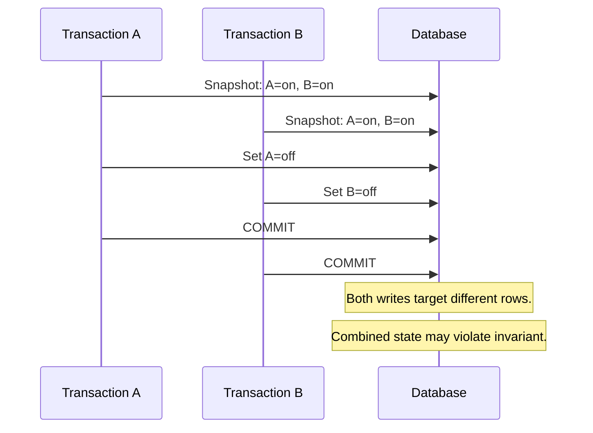

# 13- Snapshot Isolation

## Overview

**Snapshot isolation** is a transaction concurrency model where a transaction reads from a consistent snapshot of database state rather than observing changes made by concurrently executing transactions.

The key idea is:

> A transaction sees a stable logical view of data while other transactions can continue reading and writing concurrently.

Snapshot-based concurrency control reduces blocking compared with lock-heavy isolation strategies, but it does **not automatically provide full serializability**. Certain anomalies, particularly **write skew**, can still occur under snapshot isolation.

This distinction is important when designing production systems: snapshot isolation provides strong consistency for many workloads, while Serializable isolation adds stronger guarantees when correctness depends on interactions between concurrent transactions.

## Why Snapshot Isolation Exists

Traditional locking can prevent concurrent transactions from interfering with each other, but aggressive locking can reduce concurrency.

Snapshot isolation separates:

- **What a transaction reads**
- **What other transactions are allowed to modify**

Conceptually:

```text
                 Database state
                       │
             ┌─────────┴─────────┐
             │                   │
       Transaction A       Transaction B
             │                   │
        Snapshot A          Snapshot B
             │                   │
          Reads              Reads
             │                   │
             └────── Writes ─────┘
                       │
                  Commit checks
```

Each transaction can work against its own consistent view while the database determines whether its writes can safely be committed.

## Snapshot Isolation vs Serial Execution

Snapshot isolation allows transactions to overlap:

```text
Time →

Transaction A
BEGIN ── READ ── UPDATE ───────── COMMIT
          │
          │
Transaction B
      BEGIN ── READ ── UPDATE ── COMMIT
```

The transactions are not necessarily executed one after another.

Instead, each transaction operates against a snapshot and the database applies conflict rules when writes are committed.

This provides substantial concurrency while avoiding many inconsistent reads.

## Core Properties

A typical snapshot-isolation model provides:

| Property | Snapshot Isolation |
|---|---|
| Dirty reads | Prevented |
| Stable transaction snapshot | Yes |
| Non-repeatable reads | Prevented for ordinary snapshot reads |
| Readers block writers | Generally no |
| Writers block readers | Generally no |
| Concurrent writes to same row | Conflict handling required |
| Write skew | Possible |
| Full serializability | No |

Exact behavior depends on the database engine and its implementation.

## How Snapshots Work

A snapshot represents a logical point-in-time view of committed database state.

For example:

```text
Database:

Account A = $100
Account B = $100

Transaction T1 starts
        ↓
Snapshot contains:
A = $100
B = $100

T2 changes A
        ↓
A = $50

T1 reads A again
        ↓
Still sees the version visible
to its snapshot
```

The transaction does not simply reread the latest physical row every time.

Instead, the database determines which row version is visible to that transaction.

This is commonly implemented using **multi-version concurrency control (MVCC)**.

## MVCC and Snapshots

Under MVCC, updates do not necessarily overwrite the only logical representation of a row immediately.

Instead, the database maintains enough version information to determine visibility.

Conceptually:

```text
Row versions

users.id = 42

Version 1
value = "active"
visible to older snapshots

Version 2
value = "inactive"
visible to newer snapshots
```

A transaction's snapshot determines which version is visible.

This allows readers to proceed without waiting for many concurrent writers.

## PostgreSQL and MVCC

PostgreSQL uses MVCC extensively for transaction isolation.

A row can have multiple physical versions over its lifetime, and transaction visibility rules determine which version a query can see.

PostgreSQL's `REPEATABLE READ` provides transaction-level snapshot semantics and is often described as snapshot isolation in practical PostgreSQL discussions.

PostgreSQL's `SERIALIZABLE` isolation builds on snapshot-based execution with additional dependency tracking to provide a serializability guarantee.

Therefore:

```text
PostgreSQL

READ COMMITTED
    ↓
Statement-level snapshots

REPEATABLE READ
    ↓
Transaction-level snapshot

SERIALIZABLE
    ↓
Snapshot-based execution
+
Serializable conflict detection
```

The distinction between **snapshot isolation** as a general concurrency model and a database's named SQL isolation level is important.

## Read Visibility

Consider two transactions:

```text
Initial:
balance = 100

T1                         T2
│                          │
├── BEGIN                  │
│                          ├── BEGIN
│                          │
├── READ → 100             │
│                          ├── UPDATE → 200
│                          ├── COMMIT
│                          │
├── READ → 100             │
│                          │
└── COMMIT                 └──
```

Under transaction-level snapshot semantics, T1 can continue seeing the version visible to its snapshot even after T2 commits.

This is one of the major differences from `READ COMMITTED`, where each statement can observe a newer committed snapshot.

## Snapshot Isolation and Read Consistency

Snapshot isolation is especially useful when a transaction performs multiple related reads.

For example:

```sql
BEGIN;

SELECT COUNT(*)
FROM orders
WHERE customer_id = 42;

SELECT SUM(total_amount)
FROM orders
WHERE customer_id = 42;

COMMIT;
```

With a transaction-level snapshot, both queries operate against a consistent logical view.

Without a stable transaction snapshot, concurrent commits could cause the two statements to observe different database states.

This matters for:

- Reporting.
- Financial calculations.
- Multi-query validation.
- Reconciliation.
- Consistent business decisions.

## The Write-Write Conflict

Snapshot isolation does not mean concurrent writes to the same logical data are always accepted.

Consider:

```text
Initial:
inventory = 10

T1 snapshot → inventory = 10
T2 snapshot → inventory = 10

T1 → UPDATE inventory
T2 → UPDATE inventory
```

The database must detect the conflicting writes.

Depending on the database and isolation implementation, one transaction may block, fail, or be forced to retry.

The important distinction is:

```text
Concurrent reads
    → generally highly concurrent

Conflicting writes
    → require conflict resolution
```

## Write Skew

The most important limitation to understand is **write skew**.

Write skew occurs when:

1. Two transactions read overlapping data.
2. Each transaction independently determines that its operation is valid.
3. They modify different rows.
4. Both commit.
5. The combined state violates a business invariant.

### Example

Suppose a medical scheduling system requires:

```text
At least one doctor must remain on call.
```

Initial state:

```text
Doctor A → on call
Doctor B → on call
```

Two transactions execute concurrently.

```text
Transaction A                  Transaction B
      │                              │
      ├── Read A = on call           │
      ├── Read B = on call           │
      │                              ├── Read A = on call
      │                              ├── Read B = on call
      │                              │
      ├── Set A = off call           │
      │                              ├── Set B = off call
      │                              │
      └── COMMIT                     └── COMMIT
```

Each transaction saw a valid state.

But the final state is:

```text
Doctor A → off call
Doctor B → off call
```

The invariant is violated.

This is the classic reason snapshot isolation is **not equivalent to serializable isolation**.

## Write Skew Diagram



Serializable isolation adds stronger conflict detection so that an execution like this cannot produce a committed non-serializable outcome.

## Snapshot Isolation vs Repeatable Read

The terminology can be confusing because SQL standards and database products do not map perfectly onto one universal implementation.

A practical comparison is:

| Characteristic | Snapshot Isolation | PostgreSQL `REPEATABLE READ` |
|---|---|---|
| Consistent transaction snapshot | Yes | Yes |
| Dirty reads | No | No |
| Non-repeatable reads | No | No |
| Concurrent readers | High | High |
| Write skew | Possible in general SI | PostgreSQL's implementation has stronger behavior than classic SI for some anomalies |
| Serializable guarantee | No | No |
| Serialization failures | Implementation-dependent | Possible for certain concurrent updates |

Do not assume that the name `REPEATABLE READ` has identical behavior across PostgreSQL, MySQL, SQL Server, and other databases.

Always understand the actual database engine's implementation.

## Snapshot Isolation vs Serializable

The most important distinction is:

```text
Snapshot Isolation
    ↓
Consistent transaction snapshot
    +
High read concurrency
    +
Some write conflict detection
    ↓
BUT
    ↓
Potential non-serializable executions

Serializable
    ↓
All of the above
    +
Protection against non-serializable execution
    ↓
Possible transaction aborts/retries
```

For application design:

| Concern | Snapshot Isolation | Serializable |
|---|---|---|
| Consistent reads | Strong | Strong |
| Read concurrency | High | High |
| Write concurrency | High when conflicts are limited | Can be reduced by conflicts/retries |
| Write skew protection | Not guaranteed | Yes |
| Application retries | May be required depending on conflicts | Commonly required |
| Complexity | Moderate | Higher |
| Best for | Many consistent transactional workloads | Strong cross-row invariants |

## Practical PostgreSQL Example

To request transaction-level snapshot semantics in PostgreSQL:

```sql
BEGIN ISOLATION LEVEL REPEATABLE READ;

SELECT balance
FROM accounts
WHERE id = 42;

UPDATE accounts
SET balance = balance - 100
WHERE id = 42;

COMMIT;
```

The transaction maintains a stable view of data according to PostgreSQL's `REPEATABLE READ` semantics.

If another transaction concurrently updates the same row, PostgreSQL's MVCC and transaction rules determine whether the operation can proceed or must fail.

Applications should classify database errors rather than treating every transaction failure as an application bug.

## Backend Request Lifecycle

A typical API transaction might look like:

```text
HTTP request
     │
     ▼
FastAPI / Django
     │
     ▼
Service layer
     │
     ├── BEGIN
     │
     ├── Read snapshot
     │
     ├── Validate business state
     │
     ├── Perform writes
     │
     └── COMMIT
             │
             ▼
        HTTP response
```

The transaction should contain the database operations that require a consistent view.

Do not unnecessarily include:

- External HTTP requests.
- Long-running computation.
- File processing.
- User interaction.
- Waiting for Kafka consumers.
- Long Celery tasks.

## Snapshot Isolation in Django

Django's `transaction.atomic()` defines a transaction boundary, but the database determines the actual isolation semantics.

```python
from django.db import transaction


def process_order(order_id: int) -> None:
    with transaction.atomic():
        # Query and update operations execute within one transaction.
        ...
```

If the application requires transaction-level snapshot semantics, configure PostgreSQL isolation deliberately and verify the resulting database behavior.

Do not assume that `transaction.atomic()` automatically means Serializable or snapshot isolation.

## Snapshot Isolation in FastAPI

With FastAPI, transaction management is typically handled by the database driver or ORM.

A conceptual service boundary is:

```python
def process_order(session, order_id: int) -> None:
    with session.begin():
        order = (
            session.query(Order)
            .filter(Order.id == order_id)
            .one()
        )

        # Perform all related reads and writes here.
        ...
```

The important design principle is not the framework API itself.

It is:

```text
Request
  ↓
Service transaction
  ↓
Consistent database snapshot
  ↓
Validate + modify
  ↓
Commit
```

## Advantages

### Consistent Reads

Multiple queries can observe a coherent logical state.

### High Read Concurrency

Readers generally do not need to block writers merely to obtain a consistent snapshot.

### Reduced Lock Contention

MVCC allows many read operations to proceed without traditional shared locks.

### Predictable Transaction Views

A transaction can reason about the state it saw when its snapshot was established.

### Good General-Purpose Concurrency

Snapshot-based isolation is well suited to many backend workloads where strong read consistency is needed without full serializable conflict handling.

## Limitations

### Write Skew

Independent writes based on shared reads can violate cross-row invariants.

### Version Storage Overhead

MVCC requires maintaining row versions and visibility information.

### Long Transactions

Long-running snapshots can prevent cleanup of old row versions and increase storage pressure.

### Retry Complexity

Concurrent write conflicts can still cause transaction failures.

### Database-Specific Semantics

"Snapshot isolation" does not mean exactly the same thing across database systems.

## Long-Running Snapshot Problems

Long-running transactions are particularly problematic with MVCC databases.

Consider:

```text
Transaction T1
BEGIN
│
├── Snapshot established
│
├────────────── Long processing ──────────────┐
│                                             │
│                                             │
└── COMMIT                                    │

Meanwhile:
T2 → UPDATE
T3 → UPDATE
T4 → UPDATE
T5 → UPDATE
...
```

The database may need to retain older row versions because T1's snapshot could still need to see them.

This can increase:

- Table bloat.
- Storage usage.
- Vacuum pressure.
- Cleanup latency.
- I/O.
- Query performance degradation.

For PostgreSQL production systems, monitor long-running transactions and idle transactions in particular.

## Monitoring

Important metrics and signals include:

- Transaction duration.
- Long-running snapshots.
- Database storage growth.
- MVCC-related cleanup pressure.
- Lock waits.
- Deadlocks.
- Transaction rollbacks.
- Serialization or concurrency failures.
- Connection pool utilization.
- Query latency.

For PostgreSQL, inspect active transactions using views such as:

```sql
SELECT
    pid,
    usename,
    application_name,
    state,
    xact_start,
    query_start,
    wait_event_type,
    wait_event,
    query
FROM pg_stat_activity
WHERE xact_start IS NOT NULL
ORDER BY xact_start;
```

A transaction that remains open unexpectedly should be investigated.

## Scalability Considerations

Snapshot isolation can scale well for workloads dominated by concurrent reads.

A common architecture is:

```text
                    API traffic
                        │
                        ▼
                Application tier
                  │           │
                  ▼           ▼
             Read workload  Write workload
                  │           │
                  └──────┬────┘
                         ▼
                    PostgreSQL
                         │
                       MVCC
```

However, snapshot isolation does not eliminate write contention.

If thousands of requests continuously modify the same small set of rows:

```text
High contention
      ↓
Write conflicts
      ↓
Waiting / aborts / retries
      ↓
Lower throughput
```

The solution may require redesigning the data model or write path rather than simply changing isolation levels.

## Connection Pool Considerations

A transaction holds a database connection for its lifetime.

Therefore:

```text
Long snapshot
    ↓
Long connection occupancy
    ↓
Smaller effective pool
    ↓
Request queueing
    ↓
Higher latency
```

Use short transaction boundaries and configure pool sizes based on measured workload and database capacity.

Increasing the pool indefinitely is not a solution; excessive connections can overload the database.

## Security Considerations

Snapshot isolation does not provide authorization.

The application still needs:

- Proper tenant filtering.
- Authorization checks.
- Parameterized SQL.
- Least-privilege database roles.
- Appropriate row-level security where required.

For example:

```sql
SELECT id, balance
FROM accounts
WHERE tenant_id = $1
  AND id = $2;
```

A perfectly consistent snapshot is still unsafe if the query exposes data belonging to another tenant.

## Operational Best Practices

### Keep Transactions Short

Only include operations that require transactional consistency.

### Avoid External Calls

Do not hold a database transaction open while waiting for external services.

### Enforce Simple Invariants at the Database Layer

Use:

- `UNIQUE` constraints.
- `CHECK` constraints.
- Foreign keys.
- Exclusion constraints where appropriate.
- Atomic `UPDATE` statements.

These are often more robust than relying exclusively on application-level transaction logic.

### Use Explicit Locks When Appropriate

For a known row-level resource:

```sql
SELECT *
FROM inventory
WHERE product_id = 42
FOR UPDATE;
```

Explicit locking can make the intended concurrency behavior clearer.

### Use Serializable for Cross-Row Invariants When Required

If correctness depends on preventing write skew or another non-serializable execution, snapshot isolation may not be sufficient.

### Test Under Real Concurrency

Sequential unit tests will not expose many concurrency bugs.

Use concurrent integration/load tests that reproduce realistic transaction interleavings.

## Common Mistakes

### Assuming Snapshot Isolation Means Serializable

It does not.

Write skew is the classic counterexample.

### Treating `REPEATABLE READ` as Identical Across Databases

SQL isolation-level names can hide significant implementation differences.

Verify behavior for the actual database engine.

### Keeping Transactions Open During Business Logic

Long snapshots increase resource usage and can interfere with MVCC cleanup.

### Ignoring Write Conflicts

Snapshot isolation does not mean all concurrent writes succeed.

### Relying Only on Application Validation

Two application instances can independently validate the same condition.

Use database constraints, atomic statements, locks, or stronger isolation where necessary.

### Increasing Connection Pool Size to Fix Transaction Contention

More connections can increase concurrency pressure and database resource consumption.

Fix transaction duration and contention patterns first.

## Interview Traps

### Is Snapshot Isolation the Same as MVCC?

No.

**MVCC** is an implementation technique for maintaining multiple row versions and determining visibility.

**Snapshot isolation** is a concurrency/isolation model that can be implemented using MVCC.

### Does Snapshot Isolation Prevent Dirty Reads?

Yes, under the standard snapshot-isolation model.

### Does Snapshot Isolation Guarantee Serializability?

No.

Write skew demonstrates why.

### Why Can Two Transactions Both Commit Under Snapshot Isolation?

Because they may read the same consistent snapshot and modify different rows without creating a direct write-write conflict.

### Why Is Serializable Stronger?

Serializable adds guarantees that prevent committed executions from producing results that cannot correspond to a serial transaction order.

### Does Snapshot Isolation Eliminate Locks?

No.

Databases still use locks for various operations, including protecting writes, schema changes, and other internal coordination.

Snapshot isolation primarily changes how transaction visibility and read/write concurrency are handled.

### Is Snapshot Isolation Always Better Than Locking?

No.

Isolation is a workload-specific tradeoff between consistency, concurrency, contention, latency, and operational complexity.

## Production Decision Guide

| Requirement | Preferred approach |
|---|---|
| Single-row state transition | Atomic `UPDATE` |
| Uniqueness invariant | `UNIQUE` constraint/index |
| Referential integrity | Foreign key |
| Simple row-level coordination | Explicit row lock |
| Consistent multi-query read | Snapshot / `REPEATABLE READ` semantics |
| Cross-row invariant vulnerable to write skew | Serializable or explicit locking/design change |
| External side effects | Transactional outbox + idempotent consumer |
| Distributed multi-service workflow | Saga/outbox/compensating actions |

The strongest isolation level is not automatically the best architecture.

Start with the business invariant and choose the simplest database mechanism that enforces it correctly.

## Key Takeaways

- **Snapshot isolation gives a transaction a consistent logical view of database state while allowing substantial concurrent read/write activity.**
- **MVCC is an implementation technique commonly used to provide snapshot-based visibility; it is not itself an isolation level.**
- **Snapshot isolation is not fully serializable: write skew can allow individually valid transactions to produce an invalid combined state.**
- **Keep snapshot-based transactions short because long-running snapshots can increase MVCC storage pressure, connection usage, and cleanup problems.**
- **Choose between atomic SQL, constraints, locks, snapshot isolation, and Serializable based on the specific business invariant and concurrency requirements.**