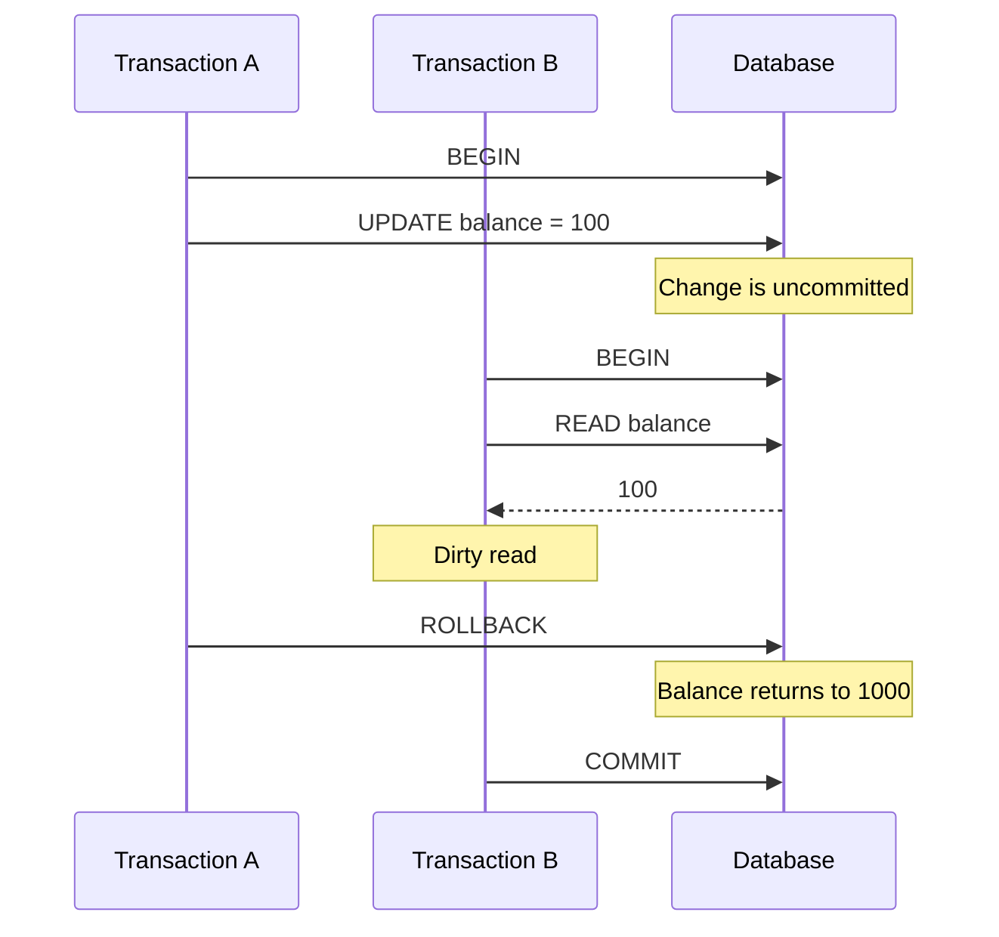
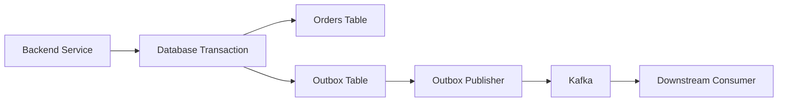

# 14- Dirty Reads

## Overview

A **dirty read** occurs when one transaction reads data written by another transaction that has **not yet committed**.

The danger is that the reading transaction can make decisions based on data that may subsequently be rolled back.

Dirty reads are the defining anomaly associated with the weakest commonly discussed SQL isolation level, **Read Uncommitted**. Most production relational databases either do not provide true dirty-read behavior or implement `READ UNCOMMITTED` using stronger semantics.

For backend engineers, the important distinction is between:

- **Uncommitted data** — changes that may still be rolled back.
- **Committed data** — changes that are durable according to the database's transaction semantics.
- **Visible data** — data that a particular transaction is allowed to observe under its isolation model.

## Why Dirty Reads Matter

Consider an account balance:

```text
Initial balance = $1,000

Transaction A:
UPDATE balance → $100

Transaction B:
READ balance → $100

Transaction A:
ROLLBACK

Final committed balance = $1,000
```

Transaction B observed `$100`, even though `$100` never became committed state.

If B uses that value to make a business decision, the application has acted on data that effectively never existed in the committed database state.

This can cause:

- Incorrect financial calculations.
- Incorrect inventory decisions.
- Invalid authorization decisions.
- Incorrect API responses.
- Corrupt derived data.
- Incorrect messages sent to downstream systems.

## Transaction Timeline

A dirty read requires concurrent transactions.



Transaction B has now acted on a value that was rolled back.

## What Makes a Read "Dirty"?

The critical condition is:

```text
Transaction A
    │
    ├── writes value X
    │
    ├── value X is NOT committed
    │
    ▼
Transaction B
    │
    └── reads value X
```

If Transaction A later rolls back:

```text
X never becomes committed state
```

Therefore, Transaction B has performed a dirty read.

A read of an older committed version is **not** a dirty read.

## Dirty Read vs Committed Read

| Read type | Data observed | Safe from rollback? |
|---|---|---|
| Dirty read | Another transaction's uncommitted change | No |
| Committed read | Previously committed version | Yes |
| Snapshot read | Version visible to transaction snapshot | Yes |
| Current read | Latest version allowed by isolation/locking rules | Depends on isolation semantics |

This distinction is fundamental when reasoning about database concurrency.

## Read Uncommitted

`READ UNCOMMITTED` is the SQL isolation level that permits dirty reads in systems that implement it literally.

Conceptually:

```sql
SET TRANSACTION ISOLATION LEVEL READ UNCOMMITTED;
```

A transaction operating at this level may be allowed to observe changes that another transaction has not committed.

The isolation hierarchy is commonly presented as:

```text
READ UNCOMMITTED
        │
        ▼
READ COMMITTED
        │
        ▼
REPEATABLE READ
        │
        ▼
SERIALIZABLE
```

As isolation becomes stronger, more concurrency anomalies are prevented, generally at the cost of additional coordination or reduced concurrency.

The exact behavior depends on the database engine.

## Dirty Reads Under Read Committed

`READ COMMITTED` prevents dirty reads.

Example:

```text
Initial:
balance = 1000

T1                         T2
│                          │
├── UPDATE → 100           │
│                          ├── SELECT
│                          │
│                          ├── Cannot see T1's
│                          │   uncommitted value
│                          │
├── ROLLBACK               │
│                          │
│                          └── SELECT → 1000
```

T2 sees the committed state rather than T1's temporary modification.

However, `READ COMMITTED` does **not** guarantee that repeated reads within the same transaction return the same value.

That is a separate anomaly known as a **non-repeatable read**.

## Dirty Reads vs Other Read Anomalies

These anomalies should not be confused.

| Anomaly | Description | Prevented by `READ COMMITTED`? |
|---|---|---:|
| Dirty read | Reading uncommitted data | Yes |
| Non-repeatable read | Same row changes between reads | Yes |
| Phantom read | Matching row set changes between reads | Database-dependent under specific isolation semantics |
| Lost update | Concurrent writes overwrite each other | Not universally prevented |
| Write skew | Independent writes violate a cross-row invariant | No |

A useful interview distinction is:

> `READ COMMITTED` prevents dirty reads, but it does not make a transaction's entire read view immutable.

## Why Dirty Reads Are Dangerous

### Financial Data

Suppose:

```text
T1:
UPDATE accounts
SET balance = balance - 500;

T2:
SELECT balance
FROM accounts;
```

If T1 later rolls back, T2 may have temporarily observed an invalid balance.

A financial system should never base a committed business decision on such a value.

### Inventory

Consider:

```text
inventory = 1

T1:
UPDATE inventory SET quantity = 0;

T2:
SELECT quantity = 0

T1:
ROLLBACK
```

T2 may conclude that the product is unavailable even though the final committed inventory remains `1`.

### Authorization

A dirty read can be particularly dangerous when state controls access.

For example:

```text
T1:
UPDATE users
SET account_status = 'suspended';

T2:
READ account_status = 'suspended';

T1:
ROLLBACK;
```

T2 could temporarily make an authorization decision based on a state that never committed.

## Internal Database Perspective

Database engines need a mechanism to determine whether a transaction's changes are visible to another transaction.

With MVCC-based databases, a reader can often select an appropriate committed row version rather than reading an uncommitted version directly.

Conceptually:

```text
Row history

Version A
balance = 1000
committed
     │
     ▼
Version B
balance = 100
uncommitted
```

A transaction using a dirty-read-permitting mechanism might be allowed to observe Version B.

A stronger isolation mechanism instead uses visibility rules to expose an appropriate committed version.

This is one reason MVCC can provide high read concurrency without requiring readers to wait for every writer.

## PostgreSQL Behavior

PostgreSQL uses MVCC and does **not** provide true dirty reads.

Although PostgreSQL accepts:

```sql
SET TRANSACTION ISOLATION LEVEL READ UNCOMMITTED;
```

its behavior is effectively equivalent to `READ COMMITTED`.

Therefore:

```text
PostgreSQL READ UNCOMMITTED
            │
            ▼
     READ COMMITTED behavior
            │
            ▼
     Dirty reads prevented
```

This is an important production and interview detail:

> SQL isolation-level names do not guarantee identical implementation semantics across database systems.

Always verify the behavior of the specific database engine being used.

## MySQL Considerations

MySQL with InnoDB supports `READ UNCOMMITTED` semantics that can expose uncommitted changes.

For example:

```sql
SET SESSION TRANSACTION ISOLATION LEVEL READ UNCOMMITTED;

START TRANSACTION;

SELECT balance
FROM accounts
WHERE id = 42;

COMMIT;
```

The exact visibility behavior depends on the storage engine and transaction configuration.

For production systems using MySQL, verify that the relevant tables use InnoDB and understand the interaction between isolation level and MVCC.

## Practical Demonstration

A conceptual two-session test can demonstrate a dirty read in a database that supports true `READ UNCOMMITTED`.

### Session A

```sql
SET TRANSACTION ISOLATION LEVEL READ COMMITTED;

BEGIN;

UPDATE accounts
SET balance = 100
WHERE id = 42;

-- Do not commit yet.
```

### Session B

```sql
SET TRANSACTION ISOLATION LEVEL READ UNCOMMITTED;

BEGIN;

SELECT balance
FROM accounts
WHERE id = 42;

COMMIT;
```

If the database permits dirty reads, Session B may observe `100` even though Session A has not committed.

Now Session A executes:

```sql
ROLLBACK;
```

The committed balance returns to its previous value.

The value observed by Session B was therefore never part of the committed database state.

## Backend Application Impact

Dirty reads become particularly problematic when a read triggers additional work.

Consider:

```text
Database read
     │
     ▼
Business decision
     │
     ├── Send email
     ├── Publish Kafka event
     ├── Charge payment
     └── Update Redis
```

If the initial read was dirty:

```text
Dirty read
    ↓
Incorrect business decision
    ↓
External side effect
    ↓
Original transaction rolls back
```

The database rollback cannot automatically undo the external side effect.

This is why transaction isolation and distributed side-effect patterns must be considered together.

## Example: Kafka and Dirty Reads

Suppose an order service reads:

```text
order.status = "PAID"
```

and publishes:

```text
OrderPaid
```

If `"PAID"` was visible only because another transaction had not committed, the order service could publish an event for a state that is subsequently rolled back.

A safer architecture uses committed transaction boundaries and patterns such as the **transactional outbox**:



The key principle is that downstream systems should react to durable application state rather than transient uncommitted state.

## Python Backend Considerations

The application framework does not normally define dirty-read semantics independently.

The database connection and transaction configuration determine the isolation behavior.

For example, Django:

```python
from django.db import transaction


def update_order(order_id: int) -> None:
    with transaction.atomic():
        # Database isolation rules determine which versions are visible.
        ...
```

`transaction.atomic()` defines a transaction boundary, but it does not mean:

```text
atomic() == SERIALIZABLE
```

or:

```text
atomic() == READ UNCOMMITTED
```

The actual isolation level comes from the database configuration and connection settings.

The same principle applies when using SQLAlchemy, asyncpg, psycopg, or other Python database libraries.

## Advantages of Allowing Dirty Reads

There are very few legitimate production cases for true dirty reads.

The theoretical advantage is:

- Minimal read coordination.
- Potentially lower waiting under heavy write contention.
- Maximum tolerance for observing transient state.

A workload that genuinely only needs approximate, non-authoritative information might tolerate weaker consistency.

However, using `READ UNCOMMITTED` merely to improve performance is usually a poor first choice.

Better alternatives often include:

- Proper indexing.
- Query optimization.
- Read replicas.
- Caching.
- Materialized views.
- Precomputed aggregates.
- Better transaction boundaries.
- Appropriate connection pooling.

## Limitations and Risks

| Risk | Impact |
|---|---|
| Reading rolled-back values | Incorrect application decisions |
| Inconsistent business state | Data correctness issues |
| External side effects | Hard-to-reverse errors |
| Difficult debugging | Results may depend on transaction timing |
| Database portability | Different engines implement semantics differently |
| Security implications | Sensitive transient states may become visible |
| Operational complexity | Concurrency bugs are difficult to reproduce |

The performance benefit is rarely worth compromising correctness for core transactional data.

## Production Guidance

### Do Not Use Dirty Reads for Authoritative Data

Avoid true dirty reads for:

- Payments.
- Account balances.
- Inventory allocation.
- Authentication state.
- Authorization state.
- Order state.
- Financial ledgers.
- Compliance records.

### Fix Performance Problems at the Correct Layer

If queries are slow, investigate:

```text
Slow query
   │
   ├── Missing index?
   ├── Poor query plan?
   ├── Excessive rows?
   ├── N+1 queries?
   ├── Lock contention?
   ├── Long transaction?
   ├── Connection pool exhaustion?
   └── Inefficient schema?
```

Do not weaken isolation simply because a query is slow.

### Keep Transactions Short

Long transactions increase contention and resource usage.

Prefer:

```text
BEGIN
  required database work
COMMIT
```

over:

```text
BEGIN
  database work
  HTTP request
  expensive computation
  external API call
  file processing
COMMIT
```

### Treat External Effects Carefully

If database state triggers Kafka messages, Celery tasks, emails, or payment operations, make sure those effects are based on committed state.

Use transactional outbox patterns where appropriate.

## Monitoring and Debugging

Dirty-read problems are timing-dependent and can be difficult to reproduce.

Useful operational signals include:

- Transaction duration.
- Lock waits.
- Deadlocks.
- Rollback rate.
- Query latency.
- Connection pool utilization.
- Isolation-level configuration.
- Unexpected transaction retries.
- Inconsistent downstream events.

When debugging a suspected concurrency issue, capture:

- Transaction IDs where available.
- Session/application identifiers.
- Query timestamps.
- Transaction start and commit/rollback times.
- Isolation level.
- Relevant locks.
- Query execution order.

Concurrency bugs are often impossible to diagnose from application logs that contain only final results.

## Common Mistakes

### Mistaking Read Uncommitted for "Fast Read Mode"

`READ UNCOMMITTED` is not simply a performance optimization.

It changes correctness guarantees.

### Assuming PostgreSQL Supports True Dirty Reads

PostgreSQL accepts the isolation-level name but maps `READ UNCOMMITTED` to `READ COMMITTED` behavior.

### Assuming Read Committed Provides a Stable Transaction Snapshot

`READ COMMITTED` typically provides a fresh visibility point for each statement.

It prevents dirty reads but does not guarantee repeatable reads.

### Using Dirty Reads to Avoid Locking Problems

If locking is causing latency, identify the actual contention pattern instead of blindly weakening isolation.

### Ignoring External Side Effects

A database rollback cannot automatically undo an email, Kafka message, Redis mutation, or external API call.

### Testing Concurrency Sequentially

A sequential test cannot reproduce many transaction-interleaving bugs.

Use multiple concurrent sessions or integration tests that deliberately overlap transactions.

## Interview Traps

### What Is a Dirty Read?

A transaction reads data written by another transaction before that write has committed.

### Which Isolation Level Allows Dirty Reads?

`READ UNCOMMITTED` can allow dirty reads in database systems that implement it literally.

### Does Read Committed Prevent Dirty Reads?

Yes.

### Does Read Committed Prevent Non-Repeatable Reads?

Yes, dirty reads are prevented, but repeated statements can observe different committed states.

### Does PostgreSQL Allow Dirty Reads?

No. PostgreSQL's `READ UNCOMMITTED` behaves like `READ COMMITTED`.

### Is MVCC the Same as Read Committed?

No.

MVCC is a concurrency-control implementation technique. `READ COMMITTED` is an isolation level.

### Why Are Dirty Reads Dangerous?

Because the observed value may later be rolled back, meaning the application can make decisions based on data that never became committed state.

### Should Production Systems Use Read Uncommitted?

For authoritative transactional workloads, generally no. The correctness cost is usually much greater than the performance benefit.

## Isolation-Level Comparison

| Isolation Level | Dirty Reads | Non-Repeatable Reads | Phantom Reads | General Strength |
|---|---:|---:|---:|---|
| Read Uncommitted | Possible | Possible | Possible | Weakest |
| Read Committed | No | Possible | Possible | Common default |
| Repeatable Read | No | No | Implementation-dependent | Strong |
| Serializable | No | No | No | Strongest |

The table describes the conventional SQL model. Actual database behavior can differ, especially around `REPEATABLE READ` and phantom handling.

## Decision Guide

When a system is experiencing database contention, use this reasoning:

```text
Is the data authoritative?
        │
       Yes
        │
        ▼
Do not accept dirty reads
        │
        ▼
Measure the actual bottleneck
        │
        ├── Query performance
        ├── Lock contention
        ├── Transaction duration
        ├── Connection pool
        └── Schema/index design
```

For non-authoritative analytics or approximate metrics, consider architectural alternatives before changing transactional isolation:

```text
Primary database
      │
      ├── Read replica
      ├── Cache
      ├── Materialized view
      └── Analytics store
```

This preserves strong transactional correctness while allowing less strict consistency where it is actually acceptable.

## Key Takeaways

- **A dirty read occurs when a transaction observes another transaction's uncommitted data, which may later be rolled back.**
- **`READ UNCOMMITTED` can permit dirty reads, while `READ COMMITTED` prevents them.**
- **PostgreSQL does not provide true dirty reads; its `READ UNCOMMITTED` behavior is equivalent to `READ COMMITTED`.**
- **Do not weaken transaction isolation merely to fix performance problems; investigate indexes, query plans, locking, transaction duration, and connection usage first.**
- **Never allow transient uncommitted state to drive authoritative external side effects without a design that ties those effects to committed database state.**