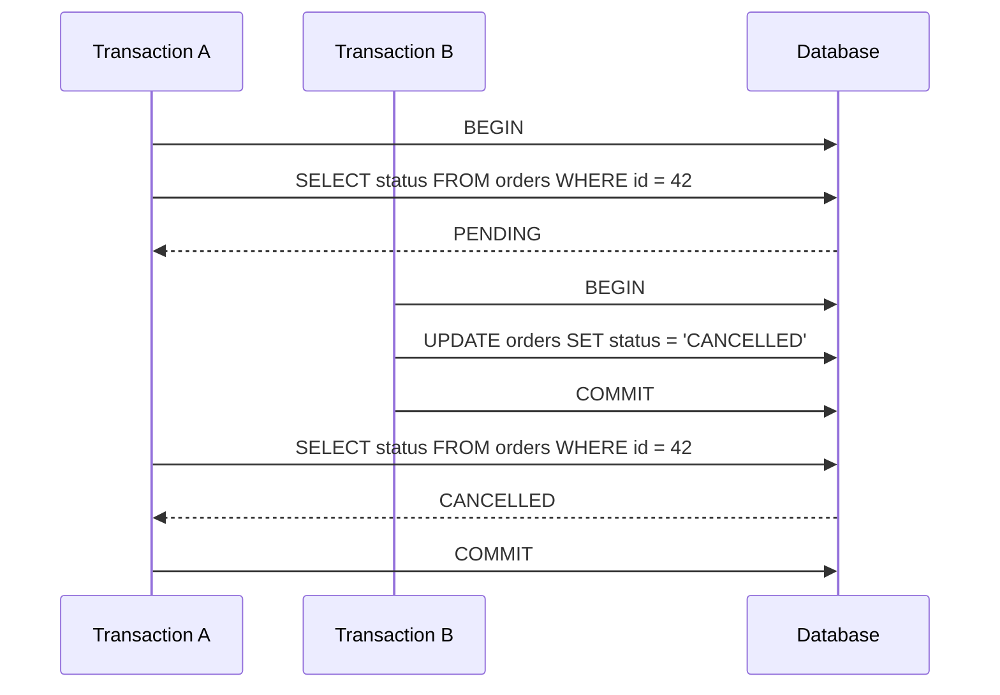

# 15- Non-Repeatable Reads

## Overview

A **non-repeatable read** occurs when a transaction reads the same row more than once and receives different committed values because another transaction modified and committed that row between the reads.

The defining pattern is:

```text
Transaction A:
    READ row → value X

Transaction B:
    UPDATE same row
    COMMIT

Transaction A:
    READ same row → value Y
```

The row is the same, but the result changed during Transaction A's lifetime.

Non-repeatable reads are primarily an **isolation-level concern**. They are permitted under `READ COMMITTED` and prevented by stronger isolation models such as `REPEATABLE READ` and `SERIALIZABLE`, subject to the database engine's exact semantics.

## Why Non-Repeatable Reads Matter

Backend code often assumes that data read earlier in a transaction remains valid for subsequent business logic.

Consider an order service:

```text
1. Read order status → "PENDING"
2. Perform business logic
3. Read order status again → "CANCELLED"
```

If another transaction cancelled the order between steps 1 and 3, the application now has two different views of the same row inside one transaction.

This matters when a transaction:

- Reads the same entity multiple times.
- Performs calculations based on an earlier value.
- Makes authorization or state-transition decisions.
- Updates a row after inspecting it.
- Processes long-running business workflows.

## Non-Repeatable Read Timeline



Transaction A performed two reads of the same row but observed different committed versions.

## What Makes a Read Non-Repeatable?

Three conditions are important:

1. Transaction A reads a row.
2. Transaction B changes and commits that row.
3. Transaction A reads the same row again and sees the new committed value.

The change must be **committed** before Transaction A observes it.

This distinguishes a non-repeatable read from a dirty read.

| Anomaly | What changes between reads? | Source of changed value |
|---|---|---|
| Dirty read | Uncommitted value becomes visible | Uncommitted transaction |
| Non-repeatable read | Existing row value changes | Committed concurrent transaction |
| Phantom read | Matching row set changes | Insert/delete/update affecting predicate |

## Dirty Read vs Non-Repeatable Read

Consider the same account row:

```text
Initial balance = 1000
```

### Dirty Read

```text
T1: UPDATE balance → 500
T1: not committed

T2: SELECT balance → 500

T1: ROLLBACK
```

T2 observed uncommitted data.

### Non-Repeatable Read

```text
T1: SELECT balance → 1000

T2: UPDATE balance → 500
T2: COMMIT

T1: SELECT balance → 500
```

T1 observed two different **committed** states.

The distinction is frequently tested in SQL interviews.

## Read Committed and Non-Repeatable Reads

`READ COMMITTED` prevents dirty reads but generally allows non-repeatable reads.

A typical implementation provides each statement with a visibility point based on committed data at statement execution time.

Conceptually:

```text
Transaction A

SELECT #1
    │
    └── sees committed state at time T1

        Transaction B commits an update

SELECT #2
    │
    └── sees committed state at time T2
```

Therefore:

```text
T1 visibility ≠ T2 visibility
```

This behavior is intentional. `READ COMMITTED` prioritizes concurrency while guaranteeing that statements do not read uncommitted changes.

## Repeatable Read

`REPEATABLE READ` provides a stronger guarantee: repeated reads of rows visible to a transaction remain consistent according to the database's isolation semantics.

A simplified model is:

```text
Transaction A
     │
     ├── establish read view
     │
     ├── SELECT → 1000
     │
     │       Transaction B
     │       UPDATE → 500
     │       COMMIT
     │
     └── SELECT → 1000
```

Transaction A continues to see its transactionally consistent view instead of observing B's later committed update.

The exact implementation differs between database systems.

## Serializable

`SERIALIZABLE` provides the strongest standard isolation guarantee.

The database ensures that concurrent execution produces results equivalent to some serial ordering of transactions.

Conceptually:

```text
Concurrent transactions

T1 ──────────────┐
                 ├── Database concurrency control
T2 ──────────────┘
                         │
                         ▼
                 Serializable result
                         │
                         ▼
              Equivalent to serial execution
```

Depending on the database, this may involve:

- Blocking locks.
- Predicate/key-range locking.
- MVCC.
- Serialization failures.
- Transaction retries.

`SERIALIZABLE` is powerful but can reduce concurrency and may require retry handling.

## Isolation-Level Comparison

| Isolation Level | Dirty Read | Non-Repeatable Read | Phantom Read |
|---|---:|---:|---:|
| Read Uncommitted | Possible | Possible | Possible |
| Read Committed | No | Possible | Possible |
| Repeatable Read | No | No | Database-dependent for phantom semantics |
| Serializable | No | No | No |

The table represents the conventional SQL isolation model. Actual database behavior depends on the database engine and its concurrency-control implementation.

## PostgreSQL Behavior

PostgreSQL uses MVCC.

Under PostgreSQL's default `READ COMMITTED` isolation:

- Each statement gets its own visibility snapshot.
- A query sees data committed before that statement's snapshot was established.
- A later statement in the same transaction can therefore see a different committed state.

This makes a non-repeatable read possible under `READ COMMITTED`.

For example:

### Transaction A

```sql
BEGIN;

SELECT status
FROM orders
WHERE id = 42;

-- Returns: pending
```

### Transaction B

```sql
BEGIN;

UPDATE orders
SET status = 'cancelled'
WHERE id = 42;

COMMIT;
```

### Transaction A Again

```sql
SELECT status
FROM orders
WHERE id = 42;

COMMIT;
```

Under `READ COMMITTED`, the second statement can observe the committed update.

At `REPEATABLE READ`, PostgreSQL provides a transaction-level consistent snapshot, so Transaction A would continue seeing the earlier row version for ordinary snapshot reads.

## PostgreSQL Example

The isolation level can be explicitly configured:

```sql
BEGIN TRANSACTION ISOLATION LEVEL REPEATABLE READ;

SELECT status
FROM orders
WHERE id = 42;

-- Other transactions may commit changes.

SELECT status
FROM orders
WHERE id = 42;

COMMIT;
```

The second read uses the transaction's consistent snapshot.

You can inspect the current transaction isolation level with:

```sql
SHOW transaction_isolation;
```

A common production default is:

```text
read committed
```

unless the application's consistency requirements justify stronger isolation.

## MySQL Considerations

MySQL's InnoDB engine uses MVCC and has different default isolation semantics from PostgreSQL.

InnoDB commonly defaults to `REPEATABLE READ`.

This means engineers migrating applications between PostgreSQL and MySQL should not assume that identical SQL code has identical concurrency behavior.

Inspect the configured isolation level rather than relying on memory:

```sql
SELECT @@transaction_isolation;
```

The important engineering principle is:

> Isolation level is a database behavior, not merely a SQL keyword in application code.

## Practical Backend Example

Consider an order-processing service.

The application performs:

```sql
BEGIN;

SELECT status
FROM orders
WHERE id = 1001;

-- Application performs additional work.

SELECT status
FROM orders
WHERE id = 1001;

COMMIT;
```

Suppose the first query returns:

```text
pending
```

A cancellation request handled by another application instance executes:

```sql
UPDATE orders
SET status = 'cancelled'
WHERE id = 1001;

COMMIT;
```

The original transaction may now observe:

```text
First read  → pending
Second read → cancelled
```

If the application assumes that the order remains `pending`, its business logic can become inconsistent.

## Preventing Non-Repeatable Reads

There are several approaches.

### Use Repeatable Read

If the business operation needs a stable transactional read view:

```sql
BEGIN TRANSACTION ISOLATION LEVEL REPEATABLE READ;

SELECT status
FROM orders
WHERE id = 1001;

-- Business processing.

SELECT status
FROM orders
WHERE id = 1001;

COMMIT;
```

Use this when transaction-level read consistency is required.

### Use Serializable

When the business invariant requires serializable behavior:

```sql
BEGIN TRANSACTION ISOLATION LEVEL SERIALIZABLE;

-- Business operations.

COMMIT;
```

The application must be prepared for serialization failures.

For example:

```python
from sqlalchemy.exc import OperationalError


def process_with_retry(session_factory, max_attempts: int = 3) -> None:
    for attempt in range(max_attempts):
        try:
            with session_factory.begin() as session:
                # Perform the complete serializable transaction.
                ...
            return
        except OperationalError:
            if attempt == max_attempts - 1:
                raise
```

The exact exception classification should be database-driver-specific; production code should retry only errors known to represent serialization/deadlock conditions.

### Use Explicit Row Locks

If the operation is about modifying a particular row and requires current-row coordination:

```sql
BEGIN;

SELECT status
FROM orders
WHERE id = 1001
FOR UPDATE;

UPDATE orders
SET status = 'processing'
WHERE id = 1001;

COMMIT;
```

`FOR UPDATE` is often more appropriate than globally increasing isolation when the application needs to coordinate access to a specific row.

Lock behavior varies by database, so verify the semantics for the chosen engine.

## Repeatable Read vs Row Locking

These solve related but different problems.

| Technique | Primary purpose |
|---|---|
| Repeatable Read | Maintain a consistent transactional read view |
| Serializable | Prevent anomalies that violate serial execution semantics |
| `SELECT ... FOR UPDATE` | Coordinate concurrent access to specific rows |
| Optimistic locking | Detect conflicting updates using a version value |

Do not automatically use the strongest isolation level when a narrower concurrency-control mechanism is sufficient.

## Optimistic Concurrency Control

An application can explicitly detect changes using a version column.

Schema:

```sql
CREATE TABLE orders (
    id BIGINT PRIMARY KEY,
    status VARCHAR(32) NOT NULL,
    version BIGINT NOT NULL DEFAULT 1
);
```

The update verifies that the version has not changed:

```sql
UPDATE orders
SET status = 'processing',
    version = version + 1
WHERE id = 1001
  AND version = 7;
```

Then inspect the affected-row count.

```text
1 row updated → success
0 rows updated → concurrent modification detected
```

This is useful for APIs where requests may operate on stale representations.

For example:

```text
GET /orders/1001
        │
        ▼
version = 7
        │
        ▼
Client modifies order
        │
        ▼
UPDATE ... WHERE version = 7
        │
        ├── success
        └── conflict
```

HTTP APIs commonly expose this concept through mechanisms such as ETags and conditional requests.

## Django Considerations

Django's `transaction.atomic()` defines a transaction boundary but does not automatically prevent non-repeatable reads.

For operations requiring row-level coordination, Django can use `select_for_update()`:

```python
from django.db import transaction

with transaction.atomic():
    order = (
        Order.objects
        .select_for_update()
        .get(pk=order_id)
    )

    if order.status != "pending":
        raise ValueError("Order is no longer pending")

    order.status = "processing"
    order.save(update_fields=["status"])
```

The important distinction is:

```text
transaction.atomic()
    ≠
automatic serialization
```

Transaction boundaries and isolation/concurrency mechanisms must be designed together.

## FastAPI and SQLAlchemy

FastAPI does not define database isolation semantics.

A typical SQLAlchemy transaction might look like:

```python
from sqlalchemy import select
from sqlalchemy.orm import Session

def process_order(session: Session, order_id: int) -> None:
    with session.begin():
        order = session.execute(
            select(Order)
            .where(Order.id == order_id)
            .with_for_update()
        ).scalar_one()

        if order.status != "pending":
            raise ValueError("Order cannot be processed")

        order.status = "processing"
```

The database remains responsible for transaction isolation and lock semantics.

## When Non-Repeatable Reads Are Acceptable

`READ COMMITTED` is often an appropriate default because many operations do not require a stable view across multiple statements.

For example:

```text
Request:
    Read current product metadata
    Perform unrelated work
    Read current product metadata again
```

If the application explicitly accepts that the second read can observe newer committed data, a non-repeatable read is not necessarily a bug.

The key question is not:

> "Can this transaction observe different values?"

It is:

> "Does the business operation require all reads to represent one consistent state?"

## When They Are Dangerous

Stronger consistency may be required when:

- Multiple reads determine one business decision.
- A workflow depends on state remaining unchanged.
- A calculation combines several reads.
- A state transition must be validated atomically.
- Financial or inventory invariants are involved.
- Concurrent updates must be detected or prevented.

For example:

```text
Read balance
     ↓
Calculate withdrawal
     ↓
Validate balance
     ↓
Write transaction
```

If the relevant state changes between reads, the operation may no longer be based on a coherent view.

## Production Considerations

### Keep Transactions Short

Long transactions increase the window in which concurrent changes can matter.

Prefer:

```text
BEGIN
  read
  validate
  write
COMMIT
```

over:

```text
BEGIN
  read
  HTTP request
  external API call
  expensive computation
  retry loop
  write
COMMIT
```

Do not hold database transactions open while waiting on external services unless the architecture explicitly requires it.

### Do Not Solve Every Race With Serializable

`SERIALIZABLE` can increase contention and transaction failures.

Before using it globally:

1. Identify the invariant.
2. Identify the conflicting transactions.
3. Determine whether row locking is sufficient.
4. Consider optimistic concurrency.
5. Measure contention.
6. Add retries for serialization failures where required.

### Design Around Business Invariants

Isolation level is only one part of correctness.

A robust design asks:

```text
What must remain true?
        │
        ▼
Which transactions can violate it?
        │
        ▼
What concurrency mechanism protects it?
        │
        ├── Row lock
        ├── Unique constraint
        ├── Optimistic versioning
        ├── Serializable isolation
        └── Application-level coordination
```

Database constraints should enforce invariants whenever possible.

## Performance Implications

Stronger isolation can affect:

- Lock contention.
- Transaction latency.
- Throughput.
- Retry rates.
- Connection utilization.
- CPU and memory usage.
- Application complexity.

MVCC-based databases can provide strong read consistency without blocking every reader, but stronger isolation can still introduce serialization conflicts or additional bookkeeping.

Monitor:

- Transaction duration.
- Lock wait time.
- Deadlocks.
- Serialization failures.
- Query latency.
- Connection pool utilization.
- Transaction rollback rate.

A system with frequent serialization failures may have an isolation strategy that is too aggressive for its workload.

## Common Mistakes

### Assuming `READ COMMITTED` Means "Consistent for the Whole Transaction"

It does not.

Multiple statements can observe different committed states.

### Using `atomic()` and Assuming All Concurrency Problems Are Solved

A transaction boundary guarantees atomic commit/rollback behavior, but isolation and locking determine how concurrent transactions interact.

### Reading a Row, Doing Work, Then Updating Without Conflict Detection

This can overwrite another transaction's change.

Use:

- Row locking.
- Optimistic version checks.
- Appropriate isolation.
- Or another explicit concurrency strategy.

### Increasing Isolation Without Measuring

Higher isolation can reduce throughput and increase retries.

Choose isolation based on correctness requirements.

### Holding Locks Across External Calls

This can create long lock durations and cascading contention.

Keep database transactions focused and short.

### Confusing Non-Repeatable Reads With Lost Updates

A non-repeatable read is about what a transaction **observes**.

A lost update is about concurrent writes where one update unintentionally overwrites another.

These are related concurrency concerns but distinct anomalies.

## Interview Traps

### What Is a Non-Repeatable Read?

Reading the same row twice within a transaction and obtaining different values because another transaction committed a change between the reads.

### Which Isolation Level Allows Non-Repeatable Reads?

`READ COMMITTED` allows them.

`REPEATABLE READ` prevents them under its transactional consistency guarantees.

### Is a Non-Repeatable Read the Same as a Dirty Read?

No.

A dirty read observes uncommitted data. A non-repeatable read observes a different **committed** value on a later read.

### Does `READ COMMITTED` Guarantee a Consistent Transaction-Level Snapshot?

No. Its visibility can change between statements.

### How Can You Prevent a Non-Repeatable Read?

Depending on the requirement:

- Use `REPEATABLE READ`.
- Use `SERIALIZABLE`.
- Use explicit row locks.
- Use optimistic concurrency control.

### Does `SELECT ... FOR UPDATE` Automatically Make the Whole Transaction Serializable?

No.

It locks the selected rows according to database-specific semantics. It does not automatically provide serializable execution for every operation in the transaction.

### Why Not Always Use Serializable?

Because stronger isolation can reduce concurrency and cause serialization failures that the application must handle, often through retries.

## Testing Non-Repeatable Reads

Concurrency tests should deliberately control transaction timing.

A useful test structure is:

```text
Transaction A
    │
    ├── First SELECT
    │
    ├──────────────┐
    │              │
    │        Transaction B
    │              │
    │              ├── UPDATE
    │              └── COMMIT
    │              │
    ├──────────────┘
    │
    └── Second SELECT
```

For reliable tests:

- Use separate database connections.
- Coordinate transaction execution with synchronization primitives.
- Assert the configured isolation level.
- Avoid relying on timing sleeps where possible.
- Test both expected success and conflict/retry behavior.

## Decision Guide

Use the weakest isolation/concurrency mechanism that correctly protects the business invariant.

| Requirement | Typical approach |
|---|---|
| Normal CRUD with independent reads | `READ COMMITTED` |
| Stable transactional read view | `REPEATABLE READ` |
| Strong cross-operation serial semantics | `SERIALIZABLE` |
| Protect one row during a state transition | `SELECT ... FOR UPDATE` |
| Detect stale client updates | Optimistic versioning |
| Enforce uniqueness | Database `UNIQUE` constraint |
| Ensure valid relationships | Foreign key constraints |

The correct choice depends on the actual workload and database engine.

## Key Takeaways

- **A non-repeatable read occurs when the same transaction reads the same row twice and observes different committed values because another transaction changed it between reads.**
- **`READ COMMITTED` prevents dirty reads but allows non-repeatable reads; `REPEATABLE READ` provides stronger read consistency.**
- **Use row locks, optimistic concurrency, stronger isolation, or database constraints based on the specific business invariant rather than defaulting to `SERIALIZABLE`.**
- **Transaction boundaries alone do not solve concurrency problems; isolation level and explicit locking/versioning determine how concurrent operations interact.**
- **Treat serialization failures, lock waits, transaction duration, and retry rates as production signals when stronger isolation is used.**