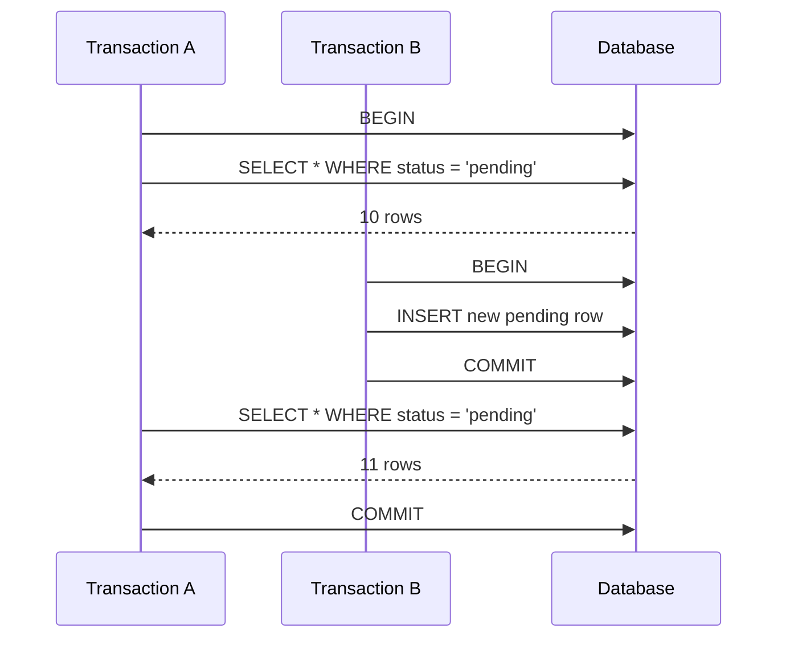

# 16- Phantom Reads

## Overview

A **phantom read** occurs when a transaction executes the same range or predicate query more than once and observes a different set of rows because another transaction inserted, deleted, or otherwise changed rows that match the predicate between the reads.

The key distinction is that a phantom read changes the **result set**, rather than simply changing the value of an already-read row.

For example:

```text
Transaction A:
    SELECT orders WHERE status = 'pending'
    → 10 rows

Transaction B:
    INSERT a new pending order
    COMMIT

Transaction A:
    SELECT orders WHERE status = 'pending'
    → 11 rows
```

The additional row is the **phantom**.

Phantom reads are an isolation-level concern and become particularly important when business logic depends on the complete set of rows matching a predicate.

## Non-Repeatable Read vs Phantom Read

These anomalies are closely related but affect different things.

| Anomaly | What changes? | Example |
|---|---|---|
| Dirty read | An uncommitted value is observed | Read another transaction's uncommitted update |
| Non-repeatable read | An existing row's value changes | Same row reads `100`, then `200` |
| Phantom read | The matching row set changes | Query returns 10 rows, then 11 |

A useful mental model is:

```text
Non-repeatable read
    Same row
       ↓
    Different value

Phantom read
    Same predicate
       ↓
    Different row set
```

## Why Phantom Reads Matter

Many backend operations query a **set of rows** rather than one specific row.

Examples include:

- Finding all pending jobs.
- Checking whether conflicting reservations exist.
- Counting available inventory.
- Finding all unpaid invoices.
- Checking whether a time range is occupied.
- Selecting all records matching a business condition.
- Calculating aggregates over a range.

If another transaction changes the set during the transaction, repeated queries can produce inconsistent business decisions.

For example:

```sql
SELECT COUNT(*)
FROM reservations
WHERE room_id = 42
  AND start_time < '2026-09-02'
  AND end_time > '2026-09-01';
```

If the first query returns zero and another transaction creates a matching reservation before the second query, the original transaction's assumptions may no longer hold.

## Phantom Read Timeline



Transaction A repeated the same predicate but received a different set of matching rows.

## How Phantom Reads Occur

Consider a table:

```sql
CREATE TABLE jobs (
    id BIGSERIAL PRIMARY KEY,
    status VARCHAR(32) NOT NULL
);
```

Initially:

```text
id | status
---+--------
1  | pending
2  | pending
3  | completed
```

Transaction A runs:

```sql
BEGIN;

SELECT id
FROM jobs
WHERE status = 'pending';
```

Result:

```text
1
2
```

Transaction B then executes:

```sql
BEGIN;

INSERT INTO jobs (status)
VALUES ('pending');

COMMIT;
```

Transaction A repeats the query:

```sql
SELECT id
FROM jobs
WHERE status = 'pending';
```

Under an isolation level that permits the anomaly, the result can now be:

```text
1
2
4
```

Row `4` is the phantom.

## Range Queries

Phantom reads are especially relevant to range predicates.

For example:

```sql
SELECT *
FROM orders
WHERE total_amount >= 1000;
```

The transaction is not necessarily concerned with one specific row. It depends on the complete set satisfying:

```text
total_amount >= 1000
```

Another transaction can insert a new qualifying row:

```sql
INSERT INTO orders (total_amount)
VALUES (2500);
```

The second execution of the range query can therefore return an additional row.

## Aggregate Queries

Aggregates can also expose phantom effects.

```sql
SELECT COUNT(*)
FROM orders
WHERE status = 'pending';
```

Suppose Transaction A sees:

```text
COUNT = 50
```

Another transaction inserts a matching order and commits.

Transaction A executes:

```sql
SELECT COUNT(*)
FROM orders
WHERE status = 'pending';
```

It may now see:

```text
COUNT = 51
```

The application did not reread a particular row; it reread a **predicate-defined set**.

## Isolation Levels

The standard SQL model describes phantom reads as follows:

| Isolation Level | Dirty Read | Non-Repeatable Read | Phantom Read |
|---|---:|---:|---:|
| Read Uncommitted | Possible | Possible | Possible |
| Read Committed | No | Possible | Possible |
| Repeatable Read | No | No | Potentially, depending on implementation |
| Serializable | No | No | No |

The important production caveat is that database engines do not all implement isolation levels identically.

The SQL isolation-level name alone is therefore insufficient to predict exact behavior.

## Read Committed

`READ COMMITTED` generally provides statement-level visibility of committed data.

Conceptually:

```text
Transaction A

SELECT #1
    ↓
Snapshot at T1
    ↓
10 rows

Transaction B
    ↓
INSERT matching row
    ↓
COMMIT

Transaction A

SELECT #2
    ↓
Snapshot at T2
    ↓
11 rows
```

Because the second statement can use a newer visibility point, the row set can change.

This behavior is often acceptable for ordinary request processing where each query is expected to return current committed data.

## Repeatable Read

`REPEATABLE READ` generally provides a more stable transactional view.

A simplified MVCC model is:

```text
Transaction A
     │
     ├── Establish read view
     │
     ├── SELECT pending → 10 rows
     │
     │       Transaction B
     │       INSERT pending
     │       COMMIT
     │
     └── SELECT pending → 10 rows
```

The exact behavior is database-specific.

### PostgreSQL

PostgreSQL uses MVCC and provides a transaction-level snapshot under `REPEATABLE READ`.

A transaction therefore continues to use the same snapshot for ordinary consistent reads.

For example:

```sql
BEGIN TRANSACTION ISOLATION LEVEL REPEATABLE READ;

SELECT COUNT(*)
FROM orders
WHERE status = 'pending';

-- Concurrent transaction inserts a pending order and commits.

SELECT COUNT(*)
FROM orders
WHERE status = 'pending';

COMMIT;
```

The second statement continues to use the transaction's snapshot.

PostgreSQL's `REPEATABLE READ` therefore provides stronger behavior than the minimum required by the SQL standard and prevents ordinary phantom reads for snapshot-based queries.

## Serializable Isolation

`SERIALIZABLE` provides the strongest standard isolation guarantee.

The database ensures that the result of concurrent transactions is equivalent to some serial execution.

Conceptually:

```text
             Concurrent execution
                  ┌───────┐
Transaction A ───►│       │
Transaction B ───►│  DB   │
                  │       │
                  └───┬───┘
                      │
                      ▼
          Equivalent to serial execution
```

This is important when merely having a consistent snapshot is not enough.

For example, suppose two transactions both execute:

```sql
SELECT COUNT(*)
FROM reservations
WHERE room_id = 42
  AND reservation_date = '2026-09-10';
```

Both see:

```text
0
```

Both then insert a reservation.

A stable snapshot alone does not necessarily guarantee that the resulting concurrent schedule is equivalent to a valid serial execution.

Serializable isolation is designed to protect against this broader class of transactional anomalies.

## PostgreSQL and Serializable Transactions

PostgreSQL implements serializable isolation using **Serializable Snapshot Isolation (SSI)** rather than simply converting every operation into traditional blocking two-phase locking.

A transaction can therefore fail with a serialization error when the database detects that the concurrent execution cannot safely be considered serializable.

Applications must be prepared to retry appropriate serialization failures.

Conceptually:

```text
Transaction A ────────┐
                      │
Transaction B ────────┼──► PostgreSQL SSI
                      │
                      └──► serialization conflict
                               │
                               ▼
                         transaction abort
                               │
                               ▼
                         application retry
```

A retry must execute the **entire transaction again**, not merely repeat the failed statement.

## Phantom Reads and Locks

Locks can prevent or coordinate concurrent changes, but the exact mechanism depends on the database.

A common misconception is:

```sql
SELECT *
FROM orders
WHERE status = 'pending'
FOR UPDATE;
```

automatically locking every possible future row that could become `pending`.

That is not a portable assumption.

Row locks protect rows that are actually selected according to database-specific locking semantics. They do not universally protect the abstract predicate itself against every possible insert.

For predicate-based invariants, use the database's appropriate isolation, locking, constraint, or schema-design mechanism.

## PostgreSQL Example With Row Locking

Suppose an application processes existing pending jobs:

```sql
BEGIN;

SELECT id
FROM jobs
WHERE status = 'pending'
ORDER BY id
FOR UPDATE SKIP LOCKED
LIMIT 100;

UPDATE jobs
SET status = 'processing'
WHERE id IN (...);

COMMIT;
```

This is useful for a worker queue because it coordinates access to **existing rows**.

`SKIP LOCKED` can allow multiple workers to process different rows without waiting on rows already locked by another worker.

However, this pattern is not equivalent to protecting the entire predicate from future inserts.

## Preventing Phantom-Related Business Bugs

The correct solution depends on what invariant the application needs to protect.

### Use Appropriate Isolation

If the transaction requires a stable read view:

```sql
BEGIN TRANSACTION ISOLATION LEVEL REPEATABLE READ;
```

If the business invariant requires serializable execution:

```sql
BEGIN TRANSACTION ISOLATION LEVEL SERIALIZABLE;
```

Do not increase isolation merely because a query happens to be a range query.

### Use Database Constraints

Whenever possible, encode invariants directly in the database.

For example, a simple uniqueness rule:

```sql
CREATE UNIQUE INDEX uq_active_subscription
ON subscriptions (user_id)
WHERE status = 'active';
```

This prevents multiple active subscriptions for the same user regardless of application-level race conditions.

Constraints are often more reliable than trying to reason about every possible interleaving of application queries.

### Use Exclusion Constraints for Range Conflicts

PostgreSQL supports exclusion constraints that are particularly useful for preventing overlapping ranges.

For example:

```sql
CREATE EXTENSION IF NOT EXISTS btree_gist;

CREATE TABLE room_reservations (
    id BIGSERIAL PRIMARY KEY,
    room_id BIGINT NOT NULL,
    reserved_during tstzrange NOT NULL,
    EXCLUDE USING gist (
        room_id WITH =,
        reserved_during WITH &&
    )
);
```

This can enforce that two reservations for the same room cannot overlap.

This is usually stronger than:

```text
SELECT whether a reservation exists
        ↓
if none:
    INSERT reservation
```

because the latter is vulnerable to concurrent transactions unless protected by an appropriate concurrency mechanism.

## Application-Level Example

Consider a booking API:

```text
POST /rooms/42/reservations
        │
        ▼
Check whether requested interval is free
        │
        ▼
Create reservation
```

A naive implementation is:

```python
existing = Reservation.objects.filter(
    room_id=room_id,
    start_time__lt=end_time,
    end_time__gt=start_time,
).exists()

if existing:
    raise ValueError("Room unavailable")

Reservation.objects.create(
    room_id=room_id,
    start_time=start_time,
    end_time=end_time,
)
```

Two requests can execute the check concurrently:

```text
Request A → no reservation found
Request B → no reservation found
Request A → INSERT
Request B → INSERT
```

The problem is not simply a phantom read. It is a broader **check-then-act race** involving a business invariant.

The robust solution is to enforce the invariant with an appropriate database constraint or concurrency strategy.

## Django Considerations

Django's `transaction.atomic()` creates a transaction boundary but does not automatically prevent phantom reads or other concurrency anomalies.

For example:

```python
from django.db import transaction

with transaction.atomic():
    reservations = list(
        Reservation.objects.filter(
            room_id=room_id,
            start_time__lt=end_time,
            end_time__gt=start_time,
        )
    )

    # Additional logic...
```

The correctness of this code depends on the database isolation level and on how the application enforces the reservation invariant.

For PostgreSQL range-overlap rules, a database-level exclusion constraint is generally preferable to relying solely on application checks.

## FastAPI and SQLAlchemy

FastAPI does not determine transaction isolation semantics.

SQLAlchemy can configure transaction behavior, but the database remains responsible for concurrency control.

For example:

```python
from sqlalchemy import select
from sqlalchemy.orm import Session

def find_pending_jobs(session: Session) -> list[Job]:
    return list(
        session.scalars(
            select(Job)
            .where(Job.status == "pending")
        )
    )
```

Whether repeated execution sees the same set depends on the transaction's isolation level and the database engine.

Do not assume that the ORM abstraction eliminates database-level concurrency semantics.

## Phantom Reads vs Lost Updates

These are distinct problems.

### Phantom Read

```text
T1: SELECT matching rows → 10
T2: INSERT matching row
T2: COMMIT
T1: SELECT matching rows → 11
```

The observed **set** changed.

### Lost Update

```text
T1: Read value = 100
T2: Read value = 100
T1: Write 90
T2: Write 80

Final value = 80
```

One update effectively overwrote another.

The appropriate mitigation differs:

| Problem | Typical mechanisms |
|---|---|
| Phantom read | Appropriate isolation, predicate/range protection, constraints |
| Lost update | Row locking, optimistic versioning, atomic updates |
| Duplicate creation | Unique constraint |
| Range overlap | Exclusion constraint or suitable locking/isolation |
| Check-then-act race | Atomic database operation or concurrency control |

## Production Considerations

### Keep Transactions Short

Long transactions increase:

- The duration of snapshots.
- Lock contention.
- Resource usage.
- Conflict probability.
- Rollback cost.

Avoid performing external HTTP calls, long computations, or user interactions inside database transactions unless explicitly required.

### Retry Serialization Failures

When using serializable transactions, failures are part of normal concurrency control rather than necessarily indicating a database malfunction.

A production retry policy should:

- Retry only retryable transaction errors.
- Retry the complete transaction.
- Limit attempts.
- Use backoff where appropriate.
- Preserve idempotency.
- Emit metrics for repeated failures.

### Prefer Constraints for Invariants

If a rule can be represented as a database constraint, prefer the database to enforce it.

Application checks are useful for user-facing validation but should not be the sole protection for critical invariants under concurrency.

### Measure Contention

Monitor:

- Transaction duration.
- Lock wait time.
- Deadlocks.
- Serialization failures.
- Rollback rates.
- Query latency.
- Connection pool utilization.
- Constraint violation rates.

A sudden increase in serialization failures can indicate that workload concurrency has changed or that transactions are too broad.

## Performance Implications

Stronger isolation can have a measurable performance cost.

Potential effects include:

- Increased transaction retries.
- Higher lock contention.
- Lower throughput.
- Increased latency.
- Greater connection utilization.
- More application complexity.

MVCC can allow readers to proceed without blocking writers in many situations, but it does not make all concurrency conflicts disappear.

The goal should be:

> Protect the business invariant with the narrowest mechanism that provides the required correctness.

For example:

```text
Need unique value?
    → UNIQUE constraint

Need non-overlapping ranges?
    → EXCLUDE constraint

Need to coordinate existing rows?
    → Row locking

Need transaction-level snapshot?
    → REPEATABLE READ

Need serial execution semantics?
    → SERIALIZABLE
```

## Monitoring and Operations

For production PostgreSQL systems, inspect transaction and locking behavior when diagnosing concurrency issues.

Useful commands include:

```sql
SELECT
    pid,
    usename,
    state,
    wait_event_type,
    wait_event,
    query
FROM pg_stat_activity
WHERE state <> 'idle';
```

For active locks:

```sql
SELECT
    pid,
    locktype,
    mode,
    granted,
    relation::regclass
FROM pg_locks
WHERE relation IS NOT NULL;
```

Long-running transactions deserve particular attention because they can retain old MVCC snapshots and increase database maintenance pressure.

## Common Mistakes

### Assuming Repeatable Read Has Identical Semantics Everywhere

Isolation levels are implemented differently across database engines.

Always verify the semantics of the actual production database.

### Treating Every Changing Result Set as a Bug

A changing result set can be completely valid under `READ COMMITTED`.

The question is whether the business operation requires a stable view.

### Assuming Row Locks Protect Future Inserts

Locking existing rows does not universally lock the abstract predicate.

Predicate/range-based invariants often require different protection.

### Using Application Checks Without Database Enforcement

This pattern is dangerous:

```text
SELECT → "nothing exists"
INSERT
```

Two concurrent requests can both observe the absence.

Use constraints or appropriate concurrency control.

### Using Serializable Without Retry Handling

Serializable transactions can fail because of legitimate concurrency conflicts.

Applications must handle retryable serialization failures.

### Holding Transactions Open During External Work

This can extend snapshots and locks unnecessarily and amplify contention.

### Confusing Phantom Reads With Non-Repeatable Reads

Remember:

```text
Non-repeatable read → same row, different value

Phantom read → same predicate, different row set
```

## Interview Traps

### What Is a Phantom Read?

A transaction repeats a predicate or range query and observes a different set of matching rows because another transaction changed the set between executions.

### How Is It Different From a Non-Repeatable Read?

A non-repeatable read changes the value of an already-read row.

A phantom read changes the set of rows returned by a predicate.

### Which Isolation Level Prevents Phantom Reads?

`SERIALIZABLE` guarantees prevention.

`REPEATABLE READ` behavior depends on the database implementation. PostgreSQL's MVCC implementation prevents ordinary snapshot-based phantom reads under `REPEATABLE READ`.

### Does `READ COMMITTED` Prevent Phantom Reads?

No. A later statement can see newly committed rows matching the predicate.

### Is `REPEATABLE READ` Always Equivalent to `SERIALIZABLE`?

No.

`REPEATABLE READ` can provide a stable snapshot without guaranteeing that all concurrent operations are equivalent to serial execution.

### Can a Unique Constraint Prevent Phantom Reads?

Not generally.

A unique constraint protects a specific uniqueness invariant. It is not a general-purpose replacement for transaction isolation.

### Is a `SELECT ... FOR UPDATE` Enough to Prevent All Phantoms?

No.

It locks selected rows according to database-specific semantics but does not universally protect every possible row that could later satisfy the predicate.

### What Is the Better Solution for a Business Invariant?

Prefer a database constraint when the invariant can be expressed declaratively. Otherwise, choose an appropriate locking, isolation, or optimistic-concurrency strategy.

## Practical Decision Guide

| Requirement | Preferred approach |
|---|---|
| Current committed results are sufficient | `READ COMMITTED` |
| Repeated reads need one transaction-level snapshot | `REPEATABLE READ` |
| Concurrent execution must behave as serial execution | `SERIALIZABLE` |
| Existing rows must be coordinated | `SELECT ... FOR UPDATE` |
| Duplicate values must be impossible | `UNIQUE` constraint |
| Overlapping ranges must be impossible | PostgreSQL exclusion constraint |
| Stale client writes must be rejected | Optimistic versioning |
| Large worker queues need concurrent consumers | `FOR UPDATE SKIP LOCKED` |

## Key Takeaways

- **A phantom read occurs when the same predicate or range query returns a different set of rows because concurrent transactions changed which rows satisfy the predicate.**
- **Phantom reads differ from non-repeatable reads: non-repeatable reads change an existing row's value, while phantom reads change the matching row set.**
- **`READ COMMITTED` permits phantom reads; stronger isolation such as PostgreSQL's `REPEATABLE READ` or `SERIALIZABLE` provides stronger guarantees.**
- **Critical business invariants should preferably be enforced with database constraints rather than relying on application-level check-then-act logic.**
- **Use the narrowest concurrency mechanism that protects the invariant, and monitor serialization failures, lock contention, transaction duration, and retries in production.**