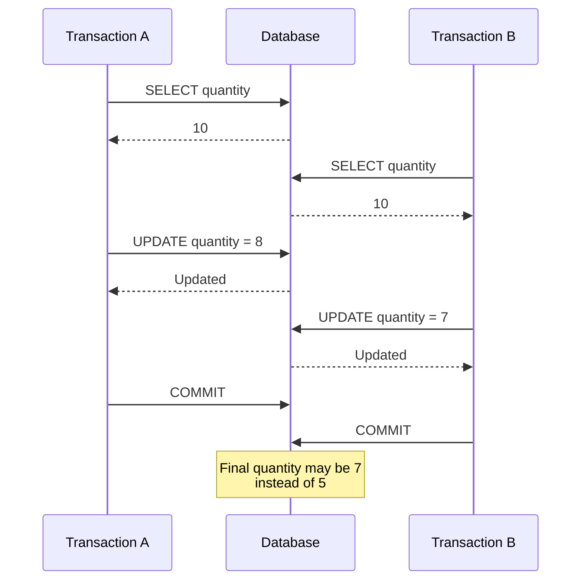
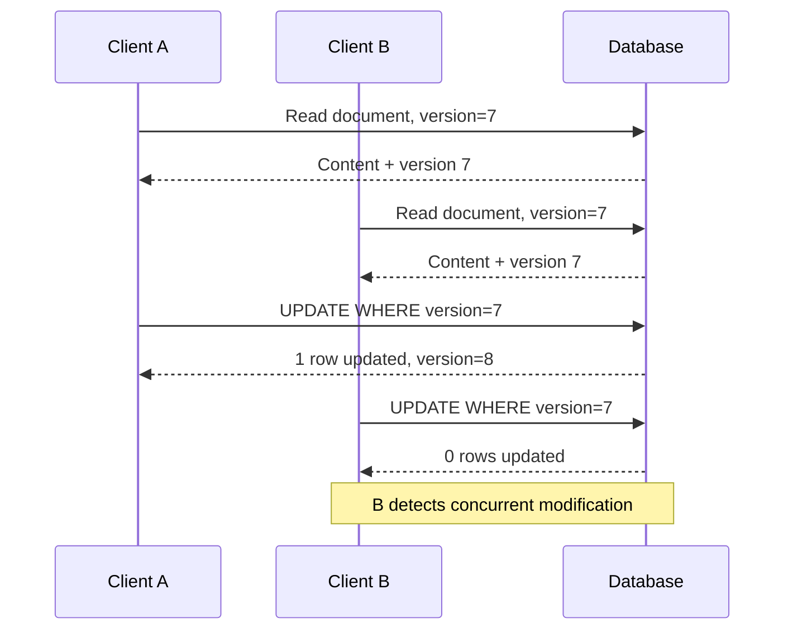

# 17- Lost Updates

## Overview

A **lost update** occurs when two concurrent transactions read the same data, independently calculate new values, and then write their results back such that one transaction overwrites the other's update.

The database may successfully execute every individual statement while the overall business operation is incorrect.

A typical sequence is:

```text
Initial balance = 100

Transaction A reads 100
Transaction B reads 100

Transaction A calculates 90
Transaction B calculates 80

Transaction A writes 90
Transaction B writes 80

Final balance = 80
```

Transaction A's update has been **lost**.

Lost updates are one of the most important concurrency problems in backend systems because they commonly appear in read-modify-write workflows:

```text
READ
  ↓
calculate
  ↓
WRITE
```

The problem is not that either transaction necessarily violates SQL syntax or constraints. The problem is that the application-level operation is not atomic with respect to concurrent operations.

## Why Lost Updates Matter

Lost updates can corrupt business state even when:

- Every SQL statement succeeds.
- Transactions are used.
- Foreign keys are valid.
- No deadlock occurs.
- No database error is returned.
- The application has correct single-threaded logic.

Common examples include:

- Account balances.
- Inventory quantities.
- Product counters.
- Account settings.
- Document edits.
- Workflow state.
- Order quantities.
- Usage quotas.
- Seat availability.
- Aggregate counters.

The general pattern is:

```text
          Transaction A
               │
               ▼
           Read X
               │
               ▼
          Calculate X'
               │
               │
          Transaction B
               │
               ▼
           Read X
               │
               ▼
          Calculate X''
               │
               ▼
          Write X''
               │
               ▼
          Write X'
               │
               ▼
       One update is lost
```

## Basic Lost Update Example

Consider an inventory table:

```sql
CREATE TABLE inventory (
    product_id BIGINT PRIMARY KEY,
    quantity INTEGER NOT NULL
);
```

Initial state:

```text
product_id | quantity
-----------+---------
42         | 10
```

Two requests attempt to purchase units concurrently.

Transaction A:

```sql
BEGIN;

SELECT quantity
FROM inventory
WHERE product_id = 42;
-- 10

-- Application calculates 10 - 2 = 8

UPDATE inventory
SET quantity = 8
WHERE product_id = 42;

COMMIT;
```

Transaction B executes at approximately the same time:

```sql
BEGIN;

SELECT quantity
FROM inventory
WHERE product_id = 42;
-- 10

-- Application calculates 10 - 3 = 7

UPDATE inventory
SET quantity = 7
WHERE product_id = 42;

COMMIT;
```

Depending on the interleaving, the final quantity can be:

```text
7
```

But the correct result should be:

```text
10 - 2 - 3 = 5
```

The `8` written by Transaction A or the `7` written by Transaction B can overwrite the other transaction's result.

## Lost Update Timeline



## Why Transactions Alone Do Not Automatically Solve It

A common misconception is:

> "Both operations are inside transactions, so the database will prevent lost updates."

Not necessarily.

A transaction provides atomicity and isolation according to the configured isolation level, but the exact behavior depends on:

- Database engine.
- Isolation level.
- SQL statements used.
- Locking behavior.
- MVCC implementation.
- Whether the update is based on a stale value.
- Whether optimistic concurrency is used.

This distinction is critical:

```text
Transaction
    ≠
Automatic protection against every race condition
```

A transaction defines a unit of database work. It does not automatically make every application-level read-modify-write sequence safe.

## The Read-Modify-Write Pattern

The most common source of lost updates is:

```text
Read current value
      ↓
Perform calculation in application
      ↓
Write calculated value
```

For example:

```python
balance = account.balance
balance -= amount
account.balance = balance
account.save()
```

If two requests execute this concurrently, both can operate on the same stale value.

The same problem can occur with SQL:

```sql
SELECT quantity
FROM inventory
WHERE product_id = 42;

UPDATE inventory
SET quantity = 7
WHERE product_id = 42;
```

The application has separated the read and write into two independently observable operations.

## Atomic Database Updates

For simple arithmetic operations, the safest solution is often to perform the calculation inside the database.

Instead of:

```text
SELECT quantity
→ calculate quantity - 3
→ UPDATE quantity = calculated value
```

use:

```sql
UPDATE inventory
SET quantity = quantity - 3
WHERE product_id = 42;
```

The database evaluates the expression against the row as part of the update operation.

For inventory, you can additionally enforce the business invariant:

```sql
UPDATE inventory
SET quantity = quantity - 3
WHERE product_id = 42
  AND quantity >= 3;
```

Then verify the affected-row count.

Conceptually:

```text
Request A ──┐
            │
Request B ──┼──► Atomic UPDATE
            │
            ▼
       Database row
            │
            ▼
     Correct serialization
```

This is usually preferable to fetching a value into application memory when the operation can be expressed as one atomic SQL statement.

## Checking the Affected Rows

The previous inventory operation can be used as a concurrency-safe conditional update:

```sql
UPDATE inventory
SET quantity = quantity - 3
WHERE product_id = 42
  AND quantity >= 3;
```

The application should inspect the number of affected rows:

```text
1 row updated
    → purchase can proceed

0 rows updated
    → product unavailable or condition no longer holds
```

This avoids a separate vulnerable check:

```sql
SELECT quantity ...
```

followed later by:

```sql
UPDATE ...
```

The condition and mutation become one database operation.

## Pessimistic Locking

When business logic requires reading a row, performing multiple calculations, and then updating it, use a row lock when appropriate.

A common PostgreSQL pattern is:

```sql
BEGIN;

SELECT quantity
FROM inventory
WHERE product_id = 42
FOR UPDATE;

-- Perform application/business logic.

UPDATE inventory
SET quantity = quantity - 3
WHERE product_id = 42;

COMMIT;
```

`FOR UPDATE` requests a row-level lock for the selected row.

Another transaction attempting to lock the same row generally waits until the current transaction releases the lock.

Conceptually:

```text
Transaction A
    │
    ├── SELECT ... FOR UPDATE
    │
    ├── Row locked
    │
    ├── calculate
    │
    ├── UPDATE
    │
    └── COMMIT
             │
             ▼
       Lock released
             │
             ▼
Transaction B proceeds
```

### When to Use Pessimistic Locking

Use it when:

- The row must be read before deciding what to do.
- The operation contains multiple dependent statements.
- Concurrent modification must be serialized.
- The contention level is manageable.
- Waiting is preferable to retrying.

### Limitations

Locks can introduce:

- Lock contention.
- Increased latency.
- Deadlocks.
- Reduced throughput.
- More complicated failure behavior.

Keep the transaction as short as practical.

## Optimistic Concurrency Control

Another solution is **optimistic concurrency control**.

Instead of locking the row before reading it, the application records the version it observed and requires that version to remain unchanged when updating.

For example:

```sql
CREATE TABLE documents (
    id BIGSERIAL PRIMARY KEY,
    content TEXT NOT NULL,
    version BIGINT NOT NULL DEFAULT 1
);
```

The application reads:

```text
content = "original"
version = 7
```

It then performs:

```sql
UPDATE documents
SET
    content = 'updated content',
    version = version + 1
WHERE id = 42
  AND version = 7;
```

If one row is updated:

```text
Success
```

If zero rows are updated:

```text
The document changed after it was read.
```

The application can then:

- Retry.
- Reload the latest state.
- Merge changes.
- Return a conflict to the client.

## Optimistic Concurrency Timeline



This is particularly useful for APIs where users may edit the same resource concurrently.

## Pessimistic vs Optimistic Concurrency

| Approach | Mechanism | Best suited for | Main cost |
|---|---|---|---|
| Atomic update | Database expression | Simple mutations | Limited to expressible operations |
| Pessimistic locking | Row locks | Highly coordinated workflows | Lock contention |
| Optimistic concurrency | Version/condition check | Low-to-moderate contention | Retries/conflict handling |
| Serializable isolation | Serialization guarantees | Complex invariants | Possible aborts and retries |
| Database constraint | Declarative invariant | Uniqueness/range rules | Constraint design |

## PostgreSQL and MVCC

PostgreSQL uses **Multi-Version Concurrency Control (MVCC)**.

Instead of every reader simply blocking every writer, PostgreSQL maintains row versions and uses transaction visibility rules to determine which version a transaction can see.

MVCC improves concurrency, but it does not mean application-level races disappear.

For example:

```text
T1: Read row version X
T2: Read row version X
T1: Calculate based on X
T2: Calculate based on X
T1: Write new version
T2: Write new version
```

The application still needs an appropriate concurrency strategy.

This is why senior backend engineering requires understanding both:

```text
Database concurrency model
+
Application read/write workflow
```

## Isolation Levels and Lost Updates

Isolation levels affect the visibility and coordination of concurrent transactions, but lost-update behavior should not be inferred from isolation-level names alone.

| Isolation level | General concern |
|---|---|
| Read Uncommitted | Very weak visibility guarantees |
| Read Committed | Common default; read-modify-write races still require care |
| Repeatable Read | Provides stronger transactional consistency; implementation-specific behavior matters |
| Serializable | Strongest isolation; conflicting transactions may need retries |

A robust application should not rely solely on a stronger isolation level when a simpler atomic operation or constraint can directly enforce the required invariant.

## Conditional Updates as Concurrency Control

A powerful SQL pattern is:

```sql
UPDATE table
SET value = new_value
WHERE id = ?
  AND expected_condition;
```

The condition acts as a concurrency guard.

For example:

```sql
UPDATE accounts
SET balance = balance - 100
WHERE id = 42
  AND balance >= 100;
```

The application then checks the affected-row count.

This pattern is useful because the database evaluates the condition and mutation against the row as one operation.

## Preventing Lost Updates in REST APIs

Suppose an API exposes:

```http
GET /documents/42
```

Response:

```json
{
  "id": 42,
  "content": "original",
  "version": 7
}
```

The client later sends:

```http
PUT /documents/42
```

with:

```json
{
  "content": "new content",
  "version": 7
}
```

The server can execute:

```sql
UPDATE documents
SET
    content = $1,
    version = version + 1
WHERE id = $2
  AND version = $3;
```

If no row is updated, another client has already modified the document.

The API can return:

```http
409 Conflict
```

rather than silently overwriting another user's change.

## HTTP ETags

For HTTP APIs, optimistic concurrency can also use entity tags.

A simplified flow is:

```text
GET /documents/42
        │
        ▼
ETag: "version-7"
        │
        ▼
Client edits resource
        │
        ▼
PUT /documents/42
If-Match: "version-7"
        │
        ▼
Server verifies current version
        │
        ├── Match → update
        │
        └── Mismatch → 412 Precondition Failed
```

This is useful when resource versions need to be exposed through HTTP semantics rather than through an application-specific `version` field.

## Django

Django's ORM provides tools that can help avoid lost updates, but developers must choose the appropriate mechanism.

For arithmetic updates, use `F()` expressions:

```python
from django.db.models import F

updated = (
    Inventory.objects
    .filter(product_id=42, quantity__gte=3)
    .update(quantity=F("quantity") - 3)
)
```

The calculation happens in SQL rather than using a stale Python value.

Check the result:

```python
if updated == 0:
    raise OutOfStockError
```

For workflows requiring multiple statements against an existing row:

```python
from django.db import transaction

with transaction.atomic():
    inventory = (
        Inventory.objects
        .select_for_update()
        .get(product_id=42)
    )

    if inventory.quantity < 3:
        raise OutOfStockError

    inventory.quantity -= 3
    inventory.save(update_fields=["quantity"])
```

The row lock protects the read-modify-write sequence within the transaction.

## SQLAlchemy and FastAPI

With SQLAlchemy, atomic SQL expressions can be expressed directly:

```python
from sqlalchemy import update

statement = (
    update(Inventory)
    .where(
        Inventory.product_id == 42,
        Inventory.quantity >= 3,
    )
    .values(quantity=Inventory.quantity - 3)
)

result = session.execute(statement)

if result.rowcount != 1:
    raise OutOfStockError
```

For more complex workflows, SQLAlchemy also supports row-locking patterns through `with_for_update()`.

The important principle is independent of the framework:

> Keep concurrency-sensitive state transitions inside the database operation or protect the entire read-modify-write sequence with an appropriate concurrency mechanism.

## Microservices Considerations

Lost updates become more difficult when multiple services can modify the same database state.

For example:

```text
Order Service ─────┐
                   │
Payment Service ───┼──► PostgreSQL
                   │
Inventory Service ─┘
```

If multiple services directly modify the same rows, each service must understand the concurrency contract.

Prefer clearly defined ownership:

```text
Inventory Service
      │
      ▼
Inventory state
```

Other services should interact through APIs or events where appropriate rather than independently implementing competing state transitions.

Distributed systems can also introduce another class of problems involving:

- Retries.
- Duplicate messages.
- Out-of-order events.
- At-least-once delivery.
- Idempotency.

Database-level lost-update protection does not automatically solve these distributed-system concerns.

## Kafka and Asynchronous Processing

Consider two Kafka consumers processing updates for the same entity.

```text
Event A ──► Consumer 1 ──┐
                         ├──► Database
Event B ──► Consumer 2 ──┘
```

If both consumers perform stale read-modify-write operations, updates can still be lost.

Possible strategies include:

- Partitioning events by entity key.
- Maintaining ordering where required.
- Atomic database updates.
- Optimistic version checks.
- Idempotent processing.
- Appropriate transaction boundaries.

Partitioning by entity key can ensure related events are processed sequentially within a Kafka partition, but the database should still enforce critical invariants.

## Common Mistakes

### Reading, Calculating, and Writing From Application Memory

Risky:

```python
value = obj.value
obj.value = value + 1
obj.save()
```

If concurrent requests read the same value, one update can overwrite another.

Prefer an atomic database expression when possible.

### Assuming `atomic()` Solves Every Race

Django:

```python
with transaction.atomic():
    ...
```

is valuable, but it does not automatically serialize every concurrent read-modify-write operation.

The transaction must use an appropriate concurrency strategy.

### Using `SELECT` Followed by Unconditional `UPDATE`

This is vulnerable:

```sql
SELECT balance FROM accounts WHERE id = 42;

UPDATE accounts
SET balance = 900
WHERE id = 42;
```

If `900` was calculated from stale state, a concurrent update can be overwritten.

### Forgetting to Check Affected Rows

For optimistic or conditional updates:

```sql
UPDATE ...
WHERE id = 42
  AND version = 7;
```

zero affected rows is meaningful.

It indicates that the expected state was not present.

### Locking Too Much

A transaction such as:

```text
BEGIN
lock many rows
call external API
wait
perform computation
COMMIT
```

can create severe contention.

Keep critical sections narrow.

### Locking Too Little

Locking one row while another related row remains mutable can leave the business invariant unprotected.

Always identify the complete state that participates in the invariant.

### Relying on Application-Level Validation

This is unsafe for concurrent uniqueness or availability checks:

```text
Check
  ↓
No conflict
  ↓
Insert
```

Another transaction can change the database between those operations.

Use database constraints or appropriate concurrency control.

## Production Considerations

### Keep Transactions Short

Short transactions reduce:

- Lock duration.
- Contention.
- Deadlock probability.
- Connection occupancy.
- Serialization failures.

Do not hold database locks while performing network calls unless the architecture explicitly requires it.

### Design for Retries

Optimistic concurrency and serializable isolation can legitimately produce conflicts.

Retry policies should:

- Retry only known retryable failures.
- Retry the entire transaction.
- Use bounded attempts.
- Use backoff where appropriate.
- Preserve idempotency.

### Prefer Atomic SQL for Counters

For counters:

```sql
UPDATE metrics
SET count = count + 1
WHERE id = 42;
```

is generally safer and more efficient than:

```text
SELECT count
UPDATE count with application-calculated value
```

### Use Constraints for Hard Invariants

For example:

```sql
CREATE UNIQUE INDEX uq_user_active_subscription
ON subscriptions (user_id)
WHERE status = 'active';
```

The database becomes the final authority for the invariant.

### Monitor Concurrency Failures

Useful production metrics include:

- Deadlocks.
- Lock wait duration.
- Transaction duration.
- Serialization failures.
- Optimistic concurrency conflicts.
- Rows affected by conditional updates.
- Database connection pool saturation.
- Retry counts.
- Request latency caused by lock waits.

## Performance Considerations

Concurrency control introduces trade-offs.

| Strategy | Typical performance characteristic |
|---|---|
| Atomic update | Usually efficient for simple mutations |
| Row locking | Can serialize hot rows |
| Optimistic concurrency | Good under low contention; retries increase under contention |
| Serializable | Strong correctness with possible transaction aborts |
| Database constraints | Usually efficient but conflicts must be handled |

A highly contended counter can become a hot row even when the update itself is atomic.

At high scale, consider whether the data model should be redesigned rather than simply increasing lock or retry settings.

Possible approaches include:

- Sharded counters.
- Append-only events.
- Periodic aggregation.
- Partitioning.
- Per-entity queues.
- Event-driven aggregation.

These are architectural decisions and should be driven by measured contention rather than premature optimization.

## Reliability Considerations

A lost update is a correctness failure, so correctness should take precedence over marginal throughput gains for critical business state.

For important state transitions:

```text
Application validation
        +
Database concurrency control
        +
Database constraints
        +
Idempotent retry behavior
```

provides stronger protection than any single layer alone.

The exact combination depends on the invariant being protected.

## Security Considerations

Lost updates can become security issues when mutable state controls authorization or financial behavior.

Examples include:

- Account balances.
- Credit limits.
- Usage quotas.
- Permission assignments.
- Approval workflows.
- Security configuration.

Do not treat concurrency bugs as purely performance problems.

For security-sensitive state, enforce the invariant in the database or within a properly serialized transaction and validate authorization independently.

## Interview Traps

### What Is a Lost Update?

A lost update occurs when concurrent transactions read the same state and one transaction's subsequent write overwrites another transaction's update.

### Is a Lost Update the Same as a Race Condition?

A lost update is a specific manifestation of a concurrency race in which one successful update is overwritten by another.

### Do Transactions Prevent Lost Updates?

Not automatically.

The result depends on the database's isolation and locking semantics and on how the application performs the read-modify-write operation.

### How Do You Prevent Lost Updates?

Common approaches include:

- Atomic SQL updates.
- `SELECT ... FOR UPDATE`.
- Optimistic version checks.
- Serializable transactions.
- Database constraints where applicable.

### When Should You Use Optimistic Locking?

Use optimistic locking when conflicts are relatively infrequent and waiting on database locks would be undesirable.

It is common for APIs where clients read a resource, modify it, and later submit an update.

### When Should You Use Pessimistic Locking?

Use pessimistic locking when concurrent modification must be serialized and the application expects contention to be manageable.

### Why Is `UPDATE value = value + 1` Safer Than Read-Modify-Write?

Because the increment is expressed as a single database-side mutation rather than calculating the new value from a potentially stale application-side copy.

### What Does a Zero-Row Update Mean in Optimistic Concurrency?

It normally means that the expected version or state no longer matches the database state. The application should treat this as a concurrency conflict rather than assuming success.

## Practical Decision Guide

| Situation | Recommended approach |
|---|---|
| Increment/decrement a numeric value | Atomic SQL update |
| Conditional inventory decrement | Atomic conditional update |
| Multiple dependent operations on one row | `SELECT ... FOR UPDATE` |
| User edits resource concurrently | Optimistic versioning |
| REST resource concurrency | Version field or HTTP `ETag` / `If-Match` |
| Critical complex invariant | Serializable or appropriate locking/constraints |
| Uniqueness requirement | `UNIQUE` constraint |
| Range-overlap requirement | Appropriate database range/exclusion constraint |
| Highly contended shared counter | Reconsider data model after measuring contention |

## Key Takeaways

- **A lost update occurs when one concurrent transaction overwrites another transaction's successful modification based on stale state.**
- **Transactions alone do not automatically prevent lost updates; concurrency-sensitive read-modify-write operations require an explicit strategy.**
- **Prefer atomic database updates for simple mutations, and use row locks when a multi-step operation must be serialized.**
- **Optimistic concurrency uses versions or conditional updates to detect stale writes and is well suited to concurrent API resource editing.**
- **Protect critical business invariants with database constraints and concurrency control, then monitor conflicts, lock waits, retries, and transaction duration in production.**