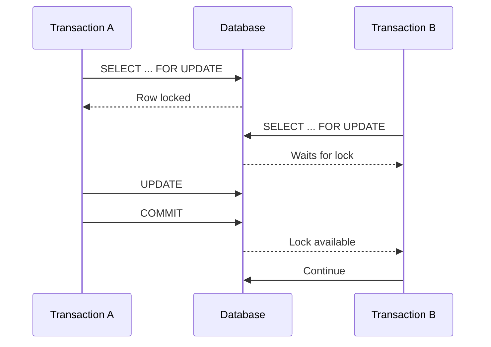
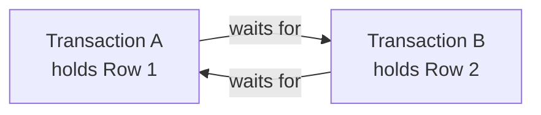

# 18- Locks

## Overview

A **database lock** is a concurrency-control mechanism used to coordinate transactions that access the same database resources concurrently.

Locks allow a database to control when transactions can:

- Read data.
- Modify data.
- Insert or delete rows.
- Change schema objects.
- Acquire conflicting resources.

The primary goal is to preserve correctness while allowing as much concurrency as possible.

In production systems, locks are not simply a mechanism for "stopping concurrent access." They are part of the database's concurrency model and determine how competing transactions interact.

A useful mental model is:

```text
Transaction A ──┐
                ├──► Database concurrency control ──► Consistent state
Transaction B ──┘
```

The engineering challenge is choosing enough locking to protect business invariants without unnecessarily serializing unrelated work.

## Why Locks Exist

Without concurrency control, two transactions could modify shared state simultaneously and produce incorrect results.

Consider an account balance:

```text
Initial balance = 1,000

Transaction A: withdraw 300
Transaction B: withdraw 500
```

If both transactions read `1,000` before either writes:

```text
A reads 1,000
B reads 1,000

A writes 700
B writes 500
```

The final balance becomes `500`, even though the correct result is:

```text
1,000 - 300 - 500 = 200
```

Locks are one mechanism databases use to coordinate these operations.

## Locking and Transactions

Locks are usually associated with transaction scope.

For example:

```sql
BEGIN;

SELECT balance
FROM accounts
WHERE id = 42
FOR UPDATE;

UPDATE accounts
SET balance = balance - 300
WHERE id = 42;

COMMIT;
```

The transaction acquires a lock on the selected row and retains it until the transaction completes according to the database's locking semantics.

Conceptually:



The important production implication is that **transaction duration becomes lock duration** for many transaction-scoped locks.

Therefore:

> Long transactions can become long lock waits.

## What Can Be Locked?

The exact lock hierarchy depends on the database engine, but common lockable resources include:

| Resource | Example |
|---|---|
| Row | A specific account row |
| Table | A table-level lock |
| Page | A database storage page |
| Index/key range | Preventing conflicting key/range operations |
| Schema object | Table definition or metadata |
| Advisory resource | Application-defined logical resource |

Not every lock type is explicitly requested by application code. Databases also acquire internal locks automatically to maintain correctness.

## Row-Level Locks

Row-level locking coordinates concurrent operations involving particular rows.

A common PostgreSQL example:

```sql
BEGIN;

SELECT id, balance
FROM accounts
WHERE id = 42
FOR UPDATE;

-- Perform business validation and update.

UPDATE accounts
SET balance = balance - 100
WHERE id = 42;

COMMIT;
```

A concurrent transaction attempting a conflicting row lock generally waits.

### When to Use Row Locks

Use row locks when:

- A transaction must inspect current state.
- The decision depends on that state.
- Multiple statements must operate consistently on the same row.
- Concurrent modifications must be serialized.

Typical examples include:

- Account transfers.
- Inventory allocation.
- Order state transitions.
- Job claiming.
- Resource reservation.

### Advantages

- Strong coordination.
- Straightforward mental model.
- Useful for complex read-modify-write workflows.
- Avoids stale application-side state.

### Limitations

- Creates lock contention.
- Can increase latency.
- Can contribute to deadlocks.
- Hot rows can become throughput bottlenecks.

## `SELECT ... FOR UPDATE`

`SELECT ... FOR UPDATE` is a common pessimistic-locking pattern.

Example:

```sql
BEGIN;

SELECT id, quantity
FROM inventory
WHERE product_id = 42
FOR UPDATE;

-- Validate quantity and perform business logic.

UPDATE inventory
SET quantity = quantity - 3
WHERE product_id = 42;

COMMIT;
```

The intent is:

```text
Read current row
      ↓
Lock row
      ↓
Validate
      ↓
Modify
      ↓
Commit
      ↓
Release lock
```

This is particularly useful when the application cannot express the entire business operation as a single atomic SQL statement.

## `FOR UPDATE` vs Atomic UPDATE

For a simple inventory decrement, locking may not be necessary.

Instead of:

```sql
BEGIN;

SELECT quantity
FROM inventory
WHERE product_id = 42
FOR UPDATE;

UPDATE inventory
SET quantity = quantity - 3
WHERE product_id = 42;

COMMIT;
```

you may be able to use:

```sql
UPDATE inventory
SET quantity = quantity - 3
WHERE product_id = 42
  AND quantity >= 3;
```

Then inspect the affected-row count.

| Requirement | Preferred approach |
|---|---|
| Simple arithmetic mutation | Atomic `UPDATE` |
| Conditional arithmetic mutation | Conditional `UPDATE` |
| Multiple dependent operations | Row locking |
| Complex state transition | Often row locking |
| User-editable resource | Often optimistic concurrency |

Atomic SQL is often simpler and has a smaller lock footprint.

## Shared and Exclusive Locks

Conceptually, database locking often distinguishes between:

- **Shared locks** — compatible with certain other readers.
- **Exclusive locks** — prevent conflicting access.

The exact compatibility matrix is database-specific.

A simplified model:

| Existing lock | Shared request | Exclusive request |
|---|---:|---:|
| Shared | Usually compatible | Usually blocked |
| Exclusive | Blocked | Blocked |

Do not assume this simplified model precisely describes every SQL database or every SQL statement. Database engines implement richer lock modes and compatibility rules.

## Lock Compatibility

Locks are useful because the database can determine whether two operations are compatible.

Conceptually:

```text
Transaction A
     │
     ▼
Lock resource X
     │
     ├───────────────┐
     │               │
     ▼               ▼
Compatible       Conflicting
     │               │
     ▼               ▼
Proceed           Wait / fail
```

This compatibility system allows databases to preserve concurrency instead of globally serializing every transaction.

## Lock Waits

When Transaction B requests a conflicting lock held by Transaction A:

```text
Transaction A
    │
    ├── holds lock
    │
    └── long-running operation
             │
             ▼
        Transaction B
             │
             └── waits
```

The waiting transaction consumes resources while it waits.

Consequences can include:

- Increased API latency.
- Connection pool exhaustion.
- Request timeouts.
- Cascading contention.
- Reduced throughput.

This is why lock contention is an operational concern, not merely a database-internals concern.

## Lock Timeouts

Production systems should generally have appropriate timeout protection.

For PostgreSQL:

```sql
SET LOCAL lock_timeout = '2s';
```

This limits how long a statement can wait to acquire a lock.

For example:

```sql
BEGIN;

SET LOCAL lock_timeout = '2s';

SELECT *
FROM inventory
WHERE product_id = 42
FOR UPDATE;

COMMIT;
```

Timeout values should be selected based on application requirements rather than copied blindly.

A timeout is not a fix for bad locking design. It is a defensive mechanism that prevents indefinite waiting.

## Transaction Timeouts

Lock timeout and transaction timeout solve different problems.

| Timeout | Protects against |
|---|---|
| Lock timeout | Waiting too long to acquire a lock |
| Statement timeout | A statement executing too long |
| Transaction timeout | Transaction remaining active too long, depending on framework/database configuration |

A production application should distinguish:

```text
"Waiting for another transaction"
```

from:

```text
"My own query is taking too long"
```

These require different diagnosis and remediation.

## Deadlocks

A **deadlock** occurs when transactions wait for each other indefinitely.

For example:

```text
Transaction A:
  locks Row 1
  waits for Row 2

Transaction B:
  locks Row 2
  waits for Row 1
```

Diagrammatically:



The database detects the cycle and normally aborts one transaction.

### Preventing Deadlocks

A strong strategy is to acquire locks in a consistent order.

Bad:

```text
Request A: Row 1 → Row 2
Request B: Row 2 → Row 1
```

Better:

```text
Request A: Row 1 → Row 2
Request B: Row 1 → Row 2
```

For example, when transferring between two accounts, consistently lock accounts in ascending ID order:

```sql
BEGIN;

SELECT id, balance
FROM accounts
WHERE id IN (10, 20)
ORDER BY id
FOR UPDATE;

-- Perform transfer.

COMMIT;
```

The precise SQL and lock behavior should still be validated against the target database engine.

## Deadlock Retry Strategy

Deadlocks can still occur in complex production systems.

Applications should treat known deadlock errors as potentially retryable.

A robust retry policy should:

- Retry the complete transaction.
- Limit retry attempts.
- Use short backoff when appropriate.
- Avoid retrying permanent errors.
- Preserve idempotency at the API/job level.

Do not retry only the failed SQL statement if doing so would leave the application-level transaction logic inconsistent.

## Lock Scope

Lock only the resources necessary to protect the invariant.

For example:

```sql
SELECT *
FROM accounts
WHERE id = 42
FOR UPDATE;
```

is generally preferable to unnecessarily locking a large set of rows.

However, minimizing lock scope does not mean locking only the first row you happen to touch.

You need to identify the complete set of resources participating in the business invariant.

## Lock Duration

Lock duration is usually affected by transaction duration.

Avoid:

```text
BEGIN
  acquire lock
  call external API
  wait for network
  process large dataset
  log extensively
  COMMIT
```

Prefer:

```text
Perform non-database preparation
        ↓
BEGIN
        ↓
Acquire required locks
        ↓
Perform short critical section
        ↓
COMMIT
```

For example, do not hold an inventory row lock while calling a remote payment provider unless the workflow specifically requires that design.

## PostgreSQL Locking Example

Consider a reservation workflow:

```sql
BEGIN;

SELECT id, available
FROM seats
WHERE id = 100
FOR UPDATE;

UPDATE seats
SET available = FALSE
WHERE id = 100
  AND available = TRUE;

COMMIT;
```

The row lock ensures competing transactions cannot independently make decisions based on the same unlocked state.

For simple availability transitions, the operation may also be expressible as:

```sql
UPDATE seats
SET available = FALSE
WHERE id = 100
  AND available = TRUE;
```

Then:

```text
1 row updated → reservation succeeded
0 rows updated → already unavailable
```

The second approach may provide the required correctness with less application-level locking.

## Locking in Django

Django exposes row-level pessimistic locking through `select_for_update()`.

Example:

```python
from django.db import transaction

with transaction.atomic():
    account = (
        Account.objects
        .select_for_update()
        .get(pk=account_id)
    )

    if account.balance < amount:
        raise InsufficientFundsError

    account.balance -= amount
    account.save(update_fields=["balance"])
```

The important relationship is:

```text
transaction.atomic()
        +
select_for_update()
        =
protected read-modify-write section
```

`select_for_update()` should normally be used inside an appropriate transaction. Otherwise, the intended locking semantics may not apply as expected.

## Django Locking Options

Django supports additional locking behavior depending on the database backend.

For example:

```python
queryset.select_for_update(
    nowait=True,
)
```

can request immediate failure rather than waiting for a conflicting lock.

Another useful option is:

```python
queryset.select_for_update(
    skip_locked=True,
)
```

which can be useful for work-queue patterns where workers should skip already-claimed rows rather than wait.

These options are database-backend dependent and should be tested against the production database.

## Work Queue Pattern

A common backend pattern is claiming jobs from a database table.

Multiple workers may execute:

```sql
SELECT id
FROM jobs
WHERE status = 'pending'
ORDER BY id
FOR UPDATE SKIP LOCKED
LIMIT 10;
```

The workers can process different rows without waiting on rows already locked by another worker.

Conceptually:

```text
Jobs
├── Job 1 ── Worker A
├── Job 2 ── Worker B
├── Job 3 ── locked → skipped
├── Job 4 ── Worker A
└── Job 5 ── Worker B
```

This pattern can be useful for moderate-scale database-backed queues, although dedicated systems such as Kafka, Celery brokers, or managed queue services may be more appropriate at larger scale.

## Advisory Locks

Some databases support **advisory locks**, which allow applications to coordinate around a logical resource rather than a specific row.

For example, PostgreSQL supports advisory locks.

Conceptually:

```text
logical resource
      │
      ▼
"account:42"
      │
      ▼
advisory lock
      │
      ├── service A → holds
      │
      └── service B → waits/fails
```

Advisory locks can be useful when:

- There is no natural row to lock.
- A logical operation spans multiple resources.
- Coordination is database-local.

They should be used carefully because the database does not automatically know what the application-defined lock represents.

A strong convention is required so every participating component uses the same lock identity.

## Locks and MVCC

Modern relational databases commonly combine locks with MVCC.

MVCC allows readers and writers to operate with less blocking than a simple global read/write lock model.

This means:

```text
MVCC
  +
Locking
  +
Isolation rules
```

work together.

A transaction may be able to read a row without waiting for a writer, while a conflicting update may still need to wait for another transaction.

Do not reason about database concurrency using only the word "lock." You must also understand:

- Isolation level.
- Visibility rules.
- Row versions.
- Statement semantics.
- Lock compatibility.
- Database-specific behavior.

## Locks and Isolation Levels

Isolation level affects what concurrent transactions can observe and which anomalies are possible.

Locks are one mechanism used to enforce concurrency guarantees, but isolation levels and MVCC also play important roles.

For example:

```sql
BEGIN;

SET TRANSACTION ISOLATION LEVEL SERIALIZABLE;

-- Transaction work.

COMMIT;
```

Serializable isolation can cause transactions to fail and require retry when the database detects serialization conflicts.

Explicit row locking can still be useful when a specific resource must be coordinated within the transaction.

The correct choice depends on the business invariant rather than the assumption that "more locking is always better."

## Locks and Lost Updates

Locks are a direct solution to many read-modify-write races.

Without locking:

```text
A reads 100
B reads 100
A writes 90
B writes 80
```

With row locking:

```text
A locks row
A reads 100
A writes 90
A commits

B acquires row lock
B reads 90
B writes 80
B commits
```

The second transaction operates on the current protected state.

For simple arithmetic, an atomic SQL update may be preferable to explicit locking.

## Locks and Optimistic Concurrency

Locks are generally associated with **pessimistic concurrency control**:

```text
Assume conflict may happen
        ↓
Acquire lock
        ↓
Perform operation
```

Optimistic concurrency follows a different model:

```text
Assume conflict is uncommon
        ↓
Read version
        ↓
Perform operation
        ↓
Update only if version unchanged
```

Example:

```sql
UPDATE documents
SET
    content = $1,
    version = version + 1
WHERE id = $2
  AND version = $3;
```

Use the approach that matches the workload.

| Pessimistic | Optimistic |
|---|---|
| Lock before modifying | Detect conflict during update |
| Waiting is possible | Retry/conflict is possible |
| Good for coordinated critical sections | Good for low-contention edits |
| Can create lock contention | Can create retry storms under high contention |

## Production Monitoring

Lock-related metrics should be part of database observability.

Monitor:

- Lock wait duration.
- Number of waiting transactions.
- Deadlocks.
- Transaction duration.
- Query latency.
- Connection pool utilization.
- Long-running transactions.
- Idle transactions.
- Serialization failures.
- Timeout frequency.

For PostgreSQL, inspect active sessions with views such as:

```sql
SELECT
    pid,
    usename,
    state,
    wait_event_type,
    wait_event,
    query_start,
    query
FROM pg_stat_activity
WHERE state <> 'idle';
```

For production diagnosis, correlate database lock waits with:

```text
API request
   ↓
Application trace
   ↓
Database query
   ↓
Lock wait
   ↓
Blocking transaction
```

Distributed tracing can make this relationship significantly easier to identify.

## Performance Considerations

Locking can become a bottleneck when many requests contend for the same resource.

For example:

```text
10,000 requests
       │
       ▼
same account row
       │
       ▼
one lock holder at a time
```

Increasing database CPU will not necessarily solve this bottleneck.

Potential strategies include:

- Reduce transaction duration.
- Use atomic updates.
- Reduce hot-row contention.
- Partition or shard state.
- Queue operations.
- Use optimistic concurrency.
- Redesign counters.
- Aggregate asynchronously.

Measure contention before redesigning.

## High Availability Considerations

In a highly available architecture, locks are normally local to the database instance or primary handling the transaction.

Do not assume an application-level lock implemented in one process is equivalent to a database lock.

For example, this is insufficient in a horizontally scaled service:

```text
Pod A
  └── Python threading.Lock()

Pod B
  └── Python threading.Lock()
```

These are separate process-local locks.

They cannot coordinate concurrent requests across pods.

For shared database state, use a database-supported mechanism or a distributed coordination mechanism designed for the workload.

## Distributed Lock Considerations

Redis-based distributed locks can be useful for certain coordination problems, but they should not automatically replace database transactions or constraints.

If the actual invariant is:

```text
Database state must remain valid
```

the database should generally remain the final authority.

A distributed application lock can fail because of:

- Process crashes.
- Network partitions.
- Lease expiration.
- Clock assumptions.
- Incorrect ownership handling.
- Client pauses.
- Partial failures.

Use distributed locking only when the problem genuinely requires cross-process coordination and the failure semantics are understood.

## Security Considerations

Locking can indirectly affect security and availability.

An attacker or faulty client that causes long-running transactions can hold locks and create:

- Request starvation.
- Connection pool exhaustion.
- Database resource exhaustion.
- Denial-of-service conditions.

Protect production systems with:

- Statement timeouts.
- Lock timeouts where appropriate.
- Transaction duration limits.
- Connection pool limits.
- Query monitoring.
- Rate limiting.
- Proper authorization before entering expensive critical sections.

Do not hold locks while performing untrusted or potentially long-running external work.

## Common Mistakes

### Assuming Locks Are Always Better

More locking does not automatically mean better correctness or performance.

For simple state transitions, atomic SQL can often provide the required guarantee with less complexity.

### Holding Locks During Network Calls

Risky:

```text
BEGIN
SELECT ... FOR UPDATE
call payment API
wait
call another service
UPDATE
COMMIT
```

A remote service outage can now become a database lock outage.

### Locking Rows in Inconsistent Order

This increases deadlock risk.

Prefer a deterministic ordering when multiple resources must be locked.

### Using Process-Local Locks in Kubernetes

A Python lock protects only the process or worker that owns it.

It does not coordinate across pods or machines.

### Forgetting Transaction Boundaries

A row lock is useful only when its lifetime and scope are understood.

Ensure the locking operation executes inside the intended transaction.

### Locking Too Many Rows

Broad locking can turn independent requests into serialized workloads.

Lock the smallest resource set that actually protects the invariant.

### Ignoring Lock Waits

A database can appear healthy by CPU and memory metrics while applications experience severe latency due to lock contention.

Monitor wait events and blocking transactions.

### Treating Deadlocks as Impossible

Deadlocks are a normal possibility in systems with multiple resources and concurrent transactions.

Use consistent lock ordering and retry known deadlock failures when appropriate.

## Production Best Practices

1. Prefer atomic SQL operations for simple mutations.
2. Use row-level locking for complex read-modify-write workflows that require serialization.
3. Keep transactions short.
4. Never hold database locks across unnecessary network calls.
5. Acquire multiple locks in a deterministic order.
6. Monitor lock waits and deadlocks.
7. Use bounded retries for retryable deadlock or serialization failures.
8. Use database constraints to enforce hard invariants.
9. Validate locking behavior against the actual production database engine.
10. Treat connection pool capacity as part of lock-contention analysis.

## Interview Traps

### What Is a Database Lock?

A database lock is a concurrency-control mechanism that coordinates transactions accessing shared database resources.

### Does Every `SELECT` Lock a Row?

No.

Normal reads often do not acquire the same kind of row lock as `SELECT ... FOR UPDATE`. The exact behavior is database and isolation-level dependent.

### What Does `FOR UPDATE` Do?

It requests a lock appropriate for protecting rows that the transaction intends to modify, causing conflicting operations to wait or otherwise fail according to the database and lock options.

### What Is a Deadlock?

A deadlock occurs when transactions form a cycle of dependencies where each transaction waits for a resource held by another transaction in the cycle.

### How Do You Prevent Deadlocks?

Common strategies include:

- Consistent lock ordering.
- Short transactions.
- Narrow lock scope.
- Avoiding unnecessary locks.
- Retrying aborted transactions when appropriate.

### Is Row Locking the Same as Serializable Isolation?

No.

Row locking explicitly coordinates access to selected resources. Serializable isolation provides a broader transactional isolation guarantee and may detect conflicts that result in transaction aborts.

### Why Are Long Transactions Dangerous?

They can hold locks longer, increase contention, consume connection resources, increase latency, and increase the probability of deadlocks.

### `FOR UPDATE` or Atomic UPDATE?

Use an atomic `UPDATE` when the entire mutation can safely be expressed in one statement. Use explicit locking when business logic requires reading protected state and performing multiple dependent operations.

## Practical Decision Guide

| Requirement | Recommended strategy |
|---|---|
| Increment/decrement value | Atomic SQL update |
| Conditional inventory decrement | Conditional atomic update |
| Read state then perform multiple dependent writes | Row-level lock |
| Claim available jobs | `FOR UPDATE SKIP LOCKED` where supported |
| Fail immediately instead of waiting | `NOWAIT` where supported |
| Concurrent user editing | Optimistic concurrency |
| Hard uniqueness invariant | Database constraint |
| Multiple-row operation | Deterministic lock ordering |
| Logical resource without a natural row | Advisory lock where supported |
| Cross-service coordination | Carefully designed distributed mechanism |
| Critical complex invariant | Appropriate isolation + locking + constraints |

## Key Takeaways

- **Locks coordinate concurrent database operations, but the goal is to protect business invariants with the minimum necessary contention.**
- **Use atomic SQL for simple mutations and row-level pessimistic locking when a multi-step read-modify-write workflow must be serialized.**
- **Long transactions, broad lock scopes, and inconsistent lock ordering are major causes of lock contention and deadlocks.**
- **Production systems should monitor lock waits, blocking transactions, deadlocks, transaction duration, and connection-pool saturation.**
- **Database locks, isolation levels, MVCC, constraints, and application-level concurrency controls must be considered together when designing reliable concurrent systems.**