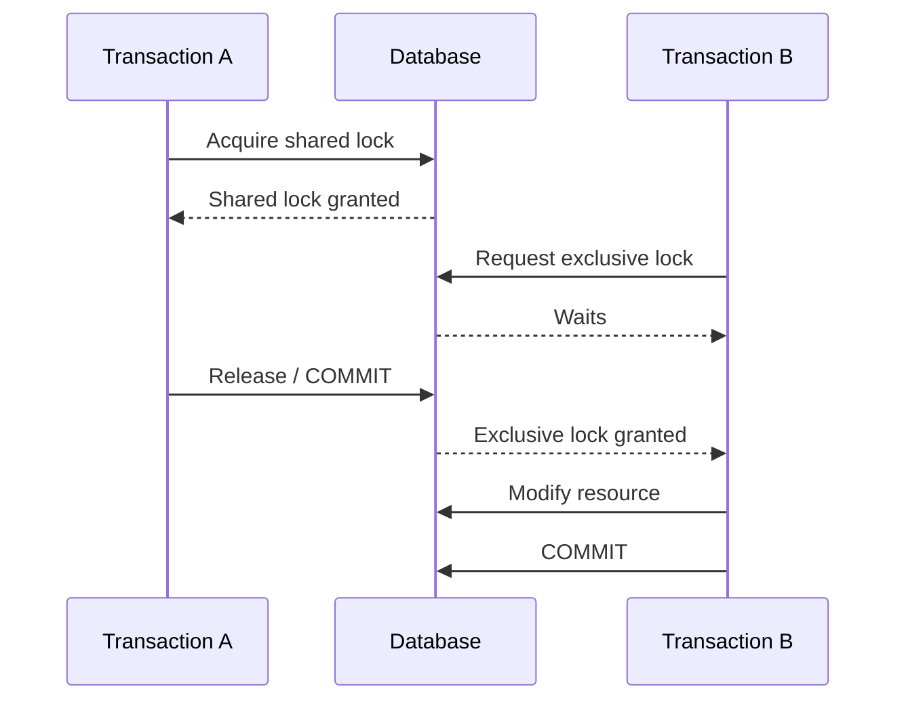
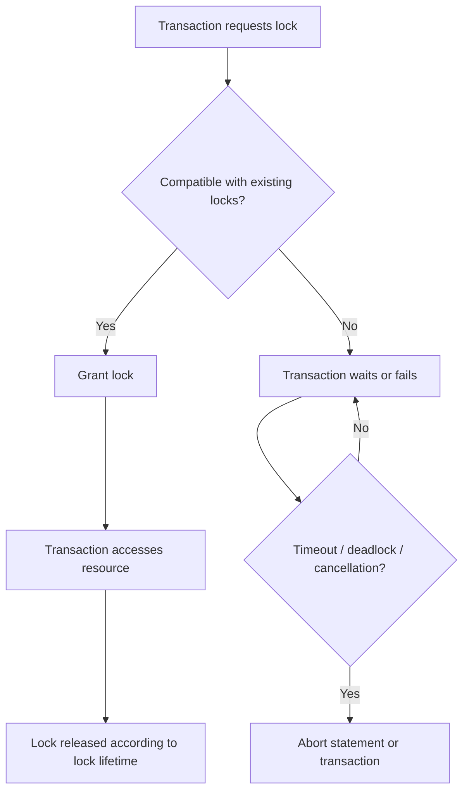
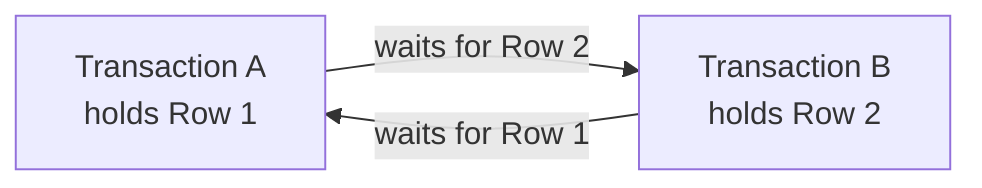

# 19- Shared and Exclusive Locks

## Overview

**Shared locks** and **exclusive locks** are fundamental database locking modes used to coordinate concurrent transactions accessing the same database resource.

The core distinction is:

- A **shared lock** allows compatible readers to access a resource concurrently while preventing conflicting modifications.
- An **exclusive lock** provides exclusive access to a resource and conflicts with other shared or exclusive locks.

Conceptually:

```text
Shared Lock (S)
├── Shared Lock (S)     → compatible
└── Exclusive Lock (X)  → conflict

Exclusive Lock (X)
├── Shared Lock (S)     → conflict
└── Exclusive Lock (X)  → conflict
```

The exact lock modes, compatibility rules, and when they are acquired are database-specific. PostgreSQL, MySQL/InnoDB, SQL Server, and Oracle do not implement identical locking behavior.

For backend engineers, the important point is not memorizing lock names. It is understanding **which concurrent operations can proceed, which must wait, and how lock duration affects application correctness and latency**.

## Why Shared and Exclusive Locks Exist

Consider two transactions operating on the same account:

```text
Account balance = 1,000

Transaction A → reads balance
Transaction B → updates balance
```

If the database allowed the update to proceed without coordinating with the reader when the reader requires a stable protected view, the application could observe a state that violates its concurrency assumptions.

Locks provide a mechanism for coordinating access:



The database can therefore permit compatible work while preventing conflicting operations.

## Shared Locks

A **shared lock**, commonly represented as `S`, indicates that a transaction wants protected access for reading a resource.

Multiple transactions can generally hold compatible shared locks simultaneously.

Conceptually:

```text
Resource R

Transaction A ── S ──┐
                     ├──► concurrent reads allowed
Transaction B ── S ──┘
```

However:

```text
Transaction A ── S ──► Resource R
Transaction B ── X ──► Resource R
                         │
                         └── blocked
```

The precise behavior depends on the database engine and isolation mechanism.

### Why Shared Locks Exist

Shared locks are useful when a transaction needs a protected read and wants to prevent conflicting writes during that protected operation.

They are especially relevant in database systems that expose explicit locking reads.

### When to Use Shared Locks

Explicit shared locking is less common in typical application code than exclusive row locking.

Use it only when the database's locking semantics and the application's consistency requirement justify it.

A common conceptual use case is:

```text
Read resource
    ↓
Ensure conflicting modification cannot occur
    ↓
Perform dependent work
```

However, MVCC databases often allow ordinary reads without explicit shared row locks, so explicit shared locks should not be introduced merely because a query is reading data.

## Exclusive Locks

An **exclusive lock**, commonly represented as `X`, indicates that a transaction requires exclusive access to a resource for a conflicting operation.

An exclusive lock generally conflicts with both shared and exclusive locks.

Conceptually:

```text
Transaction A
      │
      ▼
Exclusive lock
      │
      ▼
Resource R
      ▲
      │
      ├── Transaction B → shared lock → waits
      │
      └── Transaction C → exclusive lock → waits
```

Exclusive locking is commonly associated with modifications such as:

```sql
UPDATE
DELETE
```

and with explicit locking statements such as:

```sql
SELECT ...
FOR UPDATE;
```

The exact internal locks acquired by a statement depend on the database engine.

## Lock Compatibility

A simplified compatibility matrix is:

| Existing lock | Requested Shared | Requested Exclusive |
|---|---:|---:|
| Shared | Compatible | Conflicts |
| Exclusive | Conflicts | Conflicts |

This simplified matrix is useful for understanding the fundamental distinction.

Real databases expose additional lock modes and resource-level interactions. For example, PostgreSQL has several table-level lock modes, while row-level locking has its own conflict relationships.

Therefore:

> Never infer the complete lock behavior of a database from a simplified S/X matrix alone.

## Shared vs Exclusive Locks

| Property | Shared Lock | Exclusive Lock |
|---|---|---|
| Primary purpose | Protected read | Protected modification |
| Multiple holders | Generally yes | Generally no |
| Conflicts with shared lock | Usually no | Yes |
| Conflicts with exclusive lock | Yes | Yes |
| Typical workload | Coordinated reads | Updates/deletes |
| Contention potential | Moderate | Higher |
| Common application usage | Less common explicitly | Very common |

## Explicit Shared Locking

Some SQL dialects provide syntax for explicitly requesting a shared locking read.

For example, database-specific syntax may include:

```sql
SELECT *
FROM accounts
WHERE id = 42
FOR SHARE;
```

In PostgreSQL, `FOR SHARE` requests a row-level lock that conflicts with certain modifications while allowing compatible locking reads.

This is different from:

```sql
SELECT *
FROM accounts
WHERE id = 42;
```

The normal `SELECT` does not mean "acquire a shared row lock until commit."

That distinction is critical when working with MVCC databases.

## Explicit Exclusive Locking

A common PostgreSQL pattern is:

```sql
BEGIN;

SELECT id, balance
FROM accounts
WHERE id = 42
FOR UPDATE;

UPDATE accounts
SET balance = balance - 100
WHERE id = 42;

COMMIT;
```

The `FOR UPDATE` operation requests a row-level lock appropriate for a transaction that intends to modify the selected rows.

A concurrent transaction attempting a conflicting operation may have to wait.

## Lock Lifetime

Lock lifetime is one of the most important production considerations.

For transaction-scoped locks, the lock commonly remains held until the transaction commits or rolls back.

Example:

```sql
BEGIN;

SELECT *
FROM accounts
WHERE id = 42
FOR UPDATE;

-- Lock is held here.

UPDATE accounts
SET balance = balance - 100
WHERE id = 42;

-- Lock is still held.

COMMIT;

-- Transaction ends; lock is released.
```

This creates a direct relationship:

```text
Transaction duration
        ↓
Lock duration
        ↓
Potential contention
        ↓
Request latency
```

This is why database transactions should generally be kept short.

## Lock Acquisition Flow

A simplified lock manager workflow looks like:



Internally, the database maintains metadata and synchronization structures to coordinate competing transactions. The implementation differs substantially between database engines.

## Locks and MVCC

Modern relational databases frequently combine locking with **Multi-Version Concurrency Control (MVCC)**.

MVCC means a normal reader may be able to access a transactionally appropriate version of a row without acquiring the same blocking lock that a traditional locking-only model would require.

For example:

```text
Transaction A → UPDATE row
Transaction B → normal SELECT
```

Transaction B may still be able to read an appropriate visible version of the row rather than waiting for A.

However:

```text
Transaction A → UPDATE row
Transaction B → conflicting UPDATE
```

may require coordination and therefore cause B to wait or fail depending on the database and isolation configuration.

Therefore, these concepts must be understood together:

```text
MVCC
 +
Isolation Level
 +
Lock Modes
 +
Transaction Boundaries
```

## Locks and Isolation Levels

Lock behavior cannot be analyzed independently from isolation level.

For example:

| Isolation concept | Relationship to locks |
|---|---|
| Read Uncommitted | Allows weaker visibility guarantees; implementation varies |
| Read Committed | Common default; statement-level visibility in PostgreSQL |
| Repeatable Read | Stronger consistent-read semantics |
| Serializable | Provides the strongest standard isolation guarantee and may abort transactions due to serialization conflicts |

An explicit row lock can be used inside several isolation levels.

For example:

```sql
BEGIN;

SET TRANSACTION ISOLATION LEVEL READ COMMITTED;

SELECT *
FROM inventory
WHERE product_id = 42
FOR UPDATE;

UPDATE inventory
SET quantity = quantity - 1
WHERE product_id = 42;

COMMIT;
```

The isolation level determines visibility semantics, while the explicit lock coordinates access to the selected resource.

## Row Locks vs Table Locks

Shared/exclusive terminology can apply at different resource levels.

### Row-Level Lock

Protects specific rows.

```sql
SELECT *
FROM accounts
WHERE id = 42
FOR UPDATE;
```

This generally allows unrelated rows to remain concurrently accessible.

### Table-Level Lock

Protects a broader table resource.

For PostgreSQL, for example:

```sql
LOCK TABLE accounts IN ACCESS EXCLUSIVE MODE;
```

This is much more disruptive and should be used deliberately.

The distinction matters for scalability:

```text
Row lock:
Account 42 ── locked
Account 43 ── available
Account 44 ── available

Table lock:
Accounts table ── broadly restricted
```

Production applications should generally prefer the narrowest locking scope that correctly protects the invariant.

## Shared Locks in PostgreSQL

PostgreSQL supports explicit row-level locking clauses including:

```sql
FOR UPDATE
FOR NO KEY UPDATE
FOR SHARE
FOR KEY SHARE
```

These locks have different conflict relationships.

A simplified view is:

| PostgreSQL clause | Typical purpose |
|---|---|
| `FOR UPDATE` | Strong row lock for updates |
| `FOR NO KEY UPDATE` | Lock row against operations that require stronger modification protection |
| `FOR SHARE` | Shared row lock |
| `FOR KEY SHARE` | Protect key-related aspects of a row |

The exact conflict matrix should be consulted when designing advanced concurrency behavior.

For most application-level workflows, `FOR UPDATE` is the most commonly encountered explicit row lock.

## Exclusive Locks in PostgreSQL

PostgreSQL does not reduce all locking to a single "exclusive row lock."

Different statements acquire different internal lock modes.

For example:

```sql
UPDATE accounts
SET balance = balance - 100
WHERE id = 42;
```

will acquire the locks required to safely perform the update.

Explicitly requesting:

```sql
SELECT *
FROM accounts
WHERE id = 42
FOR UPDATE;
```

is useful when application logic needs to:

1. Read current state.
2. Prevent conflicting changes.
3. Validate business rules.
4. Modify the resource.
5. Commit atomically.

## Practical Account Transfer

Suppose an application transfers money between two accounts.

A naive implementation might do:

```text
Read source balance
Read destination balance
Update source
Update destination
```

Concurrent transfers can produce races.

A safer pessimistic approach is:

```sql
BEGIN;

SELECT id, balance
FROM accounts
WHERE id IN (10, 20)
ORDER BY id
FOR UPDATE;

-- Validate balances and transfer amount.

UPDATE accounts
SET balance = balance - 100
WHERE id = 10;

UPDATE accounts
SET balance = balance + 100
WHERE id = 20;

COMMIT;
```

The deterministic `ORDER BY id` helps establish a consistent lock acquisition order.

The business operation is now conceptually:

```text
BEGIN
  │
  ├── Lock account 10
  ├── Lock account 20
  ├── Validate balances
  ├── Debit account 10
  ├── Credit account 20
  │
  └── COMMIT
          │
          ▼
      Release locks
```

## Atomic SQL vs Explicit Locks

Explicit locking is not always necessary.

For example, an inventory operation can often be expressed as:

```sql
UPDATE inventory
SET quantity = quantity - 1
WHERE product_id = 42
  AND quantity > 0;
```

Then:

```text
affected_rows = 1 → reservation succeeded
affected_rows = 0 → insufficient inventory
```

This can be preferable to:

```sql
SELECT quantity
FROM inventory
WHERE product_id = 42
FOR UPDATE;
```

followed by an application-level decision.

The general rule is:

> If the database can safely express the invariant in one atomic statement, prefer that over unnecessary application-level locking.

## Locks in Django

Django exposes pessimistic row locking through `select_for_update()`.

Example:

```python
from django.db import transaction

with transaction.atomic():
    account = (
        Account.objects
        .select_for_update()
        .get(pk=account_id)
    )

    if account.balance < amount:
        raise InsufficientFundsError

    account.balance -= amount
    account.save(update_fields=["balance"])
```

The important relationship is:

```text
transaction.atomic()
        +
select_for_update()
        ↓
transaction-scoped protected read-modify-write
```

Django also exposes options such as:

```python
.select_for_update(nowait=True)
```

and:

```python
.select_for_update(skip_locked=True)
```

where supported by the database backend.

`nowait=True` is useful when waiting is undesirable and the application can immediately handle a lock conflict.

`skip_locked=True` is useful for queue-like workloads where a worker should skip rows already locked by another worker.

## Locks in FastAPI

FastAPI does not implement database locking itself.

The database driver, ORM, or SQL toolkit controls transaction and lock behavior.

For example, an application using SQLAlchemy may explicitly execute:

```python
from sqlalchemy import select
from sqlalchemy.orm import Session

statement = (
    select(Account)
    .where(Account.id == account_id)
    .with_for_update()
)

account = session.execute(statement).scalar_one()
```

The transaction must remain open for the duration of the protected operation.

The architectural relationship is:

```text
FastAPI
   ↓
SQLAlchemy / driver
   ↓
PostgreSQL
   ↓
Transaction + lock manager
```

## Lock Contention

A lock becomes a performance problem when many transactions compete for the same resource.

Example:

```text
1000 requests
     │
     ▼
same database row
     │
     ▼
exclusive lock
     │
     ▼
requests serialize
```

The database may have abundant CPU capacity while application latency continues to increase.

Typical symptoms include:

- Increased database wait time.
- Higher API latency.
- Growing connection pool utilization.
- Request timeouts.
- Deadlocks.
- Reduced throughput.

## Hot Rows

A **hot row** is a frequently accessed row that becomes a concurrency bottleneck.

Examples include:

- Global counters.
- Popular inventory records.
- Single wallet/account records.
- Global configuration rows.
- High-frequency job records.

Suppose thousands of requests execute:

```sql
UPDATE counters
SET value = value + 1
WHERE id = 1;
```

Even though each statement is small, all requests contend for the same logical resource.

Possible solutions include:

- Atomic updates.
- Batching.
- Sharded counters.
- Append-based event recording.
- Asynchronous aggregation.
- Redis or another specialized counter mechanism where appropriate.

The correct solution depends on consistency requirements.

## Deadlocks

Shared and exclusive locks can participate in deadlocks.

Example:

```text
Transaction A:
  Shared lock on Row 1
  Requests exclusive lock on Row 2

Transaction B:
  Shared lock on Row 2
  Requests exclusive lock on Row 1
```

The resulting dependency can form a cycle:



The database can detect the cycle and abort one transaction.

### Preventing Deadlocks

Use:

- Consistent resource ordering.
- Short transactions.
- Narrow lock scope.
- Fewer unnecessary locks.
- Appropriate timeout configuration.

When multiple rows must be locked, establish a deterministic order:

```sql
SELECT id
FROM accounts
WHERE id IN (10, 20)
ORDER BY id
FOR UPDATE;
```

## Lock Timeouts

Waiting indefinitely for a conflicting lock is dangerous in a production service.

PostgreSQL allows:

```sql
SET LOCAL lock_timeout = '2s';
```

Example:

```sql
BEGIN;

SET LOCAL lock_timeout = '2s';

SELECT *
FROM accounts
WHERE id = 42
FOR UPDATE;

COMMIT;
```

A lock timeout should be treated as an operational safety mechanism, not as a replacement for correct transaction design.

The application should distinguish:

```text
Lock acquisition timeout
```

from:

```text
Query execution timeout
```

because the remediation is different.

## `NOWAIT`

When an application should fail immediately instead of waiting, PostgreSQL supports:

```sql
SELECT *
FROM inventory
WHERE product_id = 42
FOR UPDATE NOWAIT;
```

If a conflicting lock exists, the statement fails rather than waiting.

This can be useful when:

- The user should receive an immediate conflict response.
- Another worker owns the resource.
- Waiting would violate latency requirements.

The application must handle the resulting database error correctly.

## `SKIP LOCKED`

`SKIP LOCKED` is useful for concurrent work claiming.

Example:

```sql
SELECT id
FROM jobs
WHERE status = 'pending'
ORDER BY id
FOR UPDATE SKIP LOCKED
LIMIT 10;
```

Workers can claim different rows without waiting on rows already locked by another worker.

Conceptually:

```text
Jobs
├── Job 1 → Worker A
├── Job 2 → Worker B
├── Job 3 → locked → skipped
├── Job 4 → Worker A
└── Job 5 → Worker B
```

This pattern is useful for database-backed work queues, but it should not automatically replace Kafka, Redis-backed queues, SQS, or Celery infrastructure for workloads that require higher throughput or stronger queue semantics.

## Shared and Exclusive Locks in Distributed Systems

A Python process-local lock does not provide database-level coordination:

```python
from threading import Lock

lock = Lock()
```

This only coordinates threads within the relevant process.

In Kubernetes:

```text
Pod A → Lock A
Pod B → Lock B
Pod C → Lock C
```

These locks are independent.

For shared application state, use:

- Database locking.
- Database constraints.
- Proper distributed coordination.
- Specialized distributed locking only when justified.

Do not assume an in-memory lock protects data across replicas.

## Production Monitoring

Lock-related observability should include:

- Lock wait duration.
- Number of waiting sessions.
- Blocking sessions.
- Deadlocks.
- Transaction duration.
- Query latency.
- Connection pool utilization.
- Lock timeout errors.
- Long-running transactions.
- Idle transactions holding resources.

For PostgreSQL, `pg_stat_activity` can help identify sessions and wait events:

```sql
SELECT
    pid,
    usename,
    state,
    wait_event_type,
    wait_event,
    query_start,
    query
FROM pg_stat_activity
WHERE state <> 'idle';
```

For deeper lock analysis, PostgreSQL's `pg_locks` view can be correlated with `pg_stat_activity`.

A production debugging path should look like:

```text
High API latency
      ↓
Database latency
      ↓
Lock wait detected
      ↓
Identify blocked session
      ↓
Identify blocking transaction
      ↓
Inspect transaction/query
      ↓
Reduce contention or fix transaction design
```

## Scalability Considerations

Lock scalability is primarily about **contention**, not simply the number of locks.

A system can handle many concurrent locks efficiently if they concern independent resources.

For example:

```text
Request A → Account 1
Request B → Account 2
Request C → Account 3
Request D → Account 4
```

is usually much more scalable than:

```text
Request A ─┐
Request B ─┤
Request C ─┼──► Account 1
Request D ─┘
```

Senior-level concurrency design therefore asks:

> Which resources are actually shared, and how frequently do requests contend for them?

## Reliability Considerations

Transactions holding locks can be interrupted by:

- Application crashes.
- Database connection failures.
- Network failures.
- Pod termination.
- Database failover.
- Statement cancellation.

The database must be allowed to clean up abandoned transaction state when the connection/session terminates.

Applications should avoid relying on a lock being released by application code after an unexpected crash. Transactional lock ownership should be delegated to the database wherever possible.

## Security and Availability

Lock abuse can become an availability problem.

A malicious or faulty request that opens a transaction and holds an exclusive lock can block other requests.

Potential consequences include:

- Connection pool exhaustion.
- Cascading API timeouts.
- Reduced database throughput.
- Service-wide latency spikes.

Mitigations include:

- Authentication and authorization before expensive critical sections.
- Statement timeouts.
- Lock timeouts.
- Transaction duration limits.
- Connection pool limits.
- Rate limiting.
- Monitoring long-running transactions.

Avoid holding database locks while waiting on untrusted external services.

## Common Mistakes

### Treating Every Read as a Shared Lock

A normal `SELECT` does not necessarily acquire an explicit shared row lock.

MVCC databases often allow normal reads without blocking writers in the way a simplistic S/X model suggests.

### Assuming `SELECT FOR UPDATE` Is Always Required

For a simple mutation:

```sql
UPDATE inventory
SET quantity = quantity - 1
WHERE product_id = 42
  AND quantity > 0;
```

may be safer and more efficient than manually locking, reading, validating, and updating.

### Holding Locks During External Calls

Avoid:

```text
BEGIN
  ↓
Lock row
  ↓
Call payment service
  ↓
Wait
  ↓
Call another service
  ↓
Update
  ↓
COMMIT
```

A remote outage can now create database contention.

### Locking an Entire Table for a Row-Level Problem

If only one account needs protection, a table-level lock unnecessarily serializes unrelated operations.

### Ignoring Lock Ordering

Locking:

```text
A → B
```

in one code path and:

```text
B → A
```

in another increases deadlock risk.

### Assuming Database Engines Behave Identically

PostgreSQL, MySQL/InnoDB, SQL Server, and Oracle have different lock modes, MVCC implementations, isolation semantics, and locking syntax.

Always validate behavior against the actual production engine.

### Using Process-Local Locks for Shared Database State

`threading.Lock`, asyncio locks, and similar primitives do not coordinate across Kubernetes pods or separate application instances.

### Ignoring Transaction Duration

A query may be fast while the transaction containing it remains open for a long time.

Lock analysis must consider transaction lifetime, not only individual query execution time.

## Production Best Practices

1. Prefer the narrowest lock scope that protects the business invariant.
2. Keep transactions short and deterministic.
3. Prefer atomic SQL for simple conditional mutations.
4. Use explicit row locks for multi-step read-modify-write workflows that require serialization.
5. Acquire multiple resources in a consistent order.
6. Avoid network calls and long CPU-bound operations while holding database locks.
7. Configure appropriate statement, lock, and transaction timeouts.
8. Monitor lock waits, blocking transactions, deadlocks, and long-running transactions.
9. Use `NOWAIT` or `SKIP LOCKED` when their failure semantics match the workload.
10. Treat database-specific locking behavior as part of the production architecture.
11. Use database constraints alongside locks to enforce hard invariants.
12. Design retry handling for deadlocks and other transient transaction failures.

## Interview Traps

### What Is the Difference Between a Shared and Exclusive Lock?

A shared lock allows compatible shared access while preventing conflicting exclusive access. An exclusive lock conflicts with both shared and exclusive access.

### Can Multiple Transactions Hold Shared Locks?

Generally yes, provided their locks are compatible.

### Can a Shared Lock and Exclusive Lock Coexist?

Generally no. They conflict on the same protected resource.

### Does an Exclusive Lock Mean Nobody Can Read the Row?

Not necessarily.

Modern databases using MVCC can allow ordinary readers to access a transactionally visible row version even while another transaction holds a conflicting write-related lock.

This is database- and isolation-dependent.

### Are Shared and Exclusive Locks the Only Database Locks?

No.

Real database systems implement many lock modes and resource types, including row, table, metadata, predicate/range, and advisory locks.

### Is `FOR UPDATE` an Exclusive Lock?

At a conceptual level, it requests a strong row-level lock suitable for protecting a row that the transaction intends to modify.

However, describing it simply as "the exclusive lock" is inaccurate for databases such as PostgreSQL, which have multiple row-level lock modes and conflict relationships.

### How Do Shared and Exclusive Locks Relate to MVCC?

MVCC allows many reads to proceed without requiring traditional blocking read locks, while locks still coordinate conflicting operations.

Isolation and visibility rules determine what a transaction sees; locks coordinate operations that cannot safely proceed concurrently.

### How Do You Reduce Lock Contention?

Typical approaches include:

- Shorter transactions.
- Smaller lock scopes.
- Atomic SQL operations.
- Deterministic lock ordering.
- Avoiding unnecessary locks.
- Reducing hot-row contention.
- Using optimistic concurrency where appropriate.

## Practical Decision Guide

| Situation | Preferred approach |
|---|---|
| Normal read | Ordinary `SELECT` |
| Simple conditional mutation | Atomic `UPDATE`/`DELETE` |
| Read-modify-write workflow | Row-level exclusive locking |
| Protected shared read | Explicit shared locking where justified |
| Multiple concurrent workers | `SKIP LOCKED` where appropriate |
| Immediate lock conflict response | `NOWAIT` where supported |
| Multiple rows | Deterministic lock ordering |
| High-contention resource | Redesign hot-row access |
| User editing a record | Optimistic concurrency may be preferable |
| Hard uniqueness invariant | Database constraint |
| Cross-process application coordination | Database/distributed coordination |
| External API call | Avoid holding database locks across the call |

## Key Takeaways

- **Shared locks permit compatible protected reads, while exclusive locks prevent conflicting access; the exact compatibility rules are database-specific.**
- **Modern MVCC databases do not require every read to acquire a blocking shared row lock, so always distinguish ordinary reads from explicit locking reads.**
- **Use explicit exclusive row locking such as `FOR UPDATE` when a multi-step transaction must protect a read-modify-write invariant.**
- **Lock contention, long transactions, inconsistent lock ordering, and hot rows can become major production latency and availability problems.**
- **Design concurrency using locks, MVCC, isolation levels, atomic SQL, and database constraints together rather than treating locking as an isolated feature.**