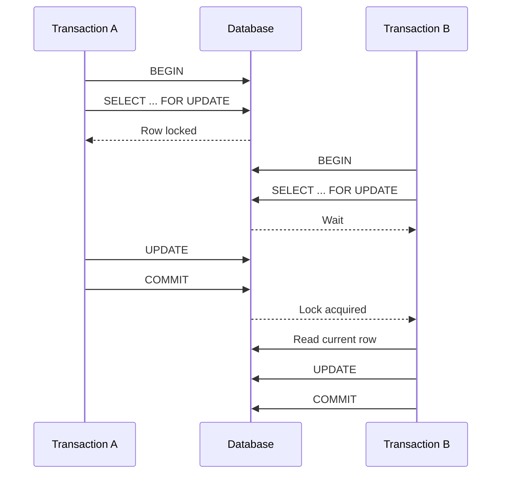
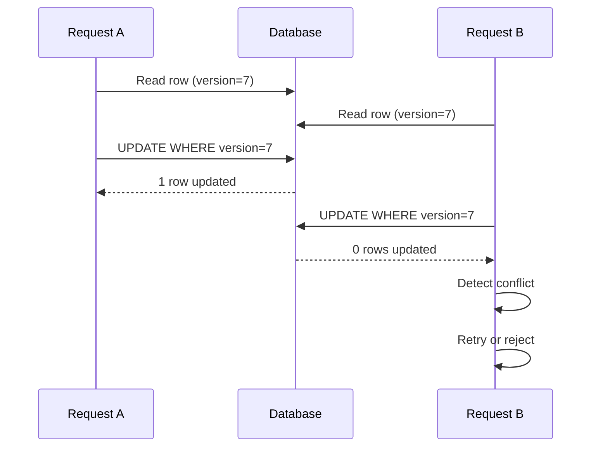

# 22- Optimistic vs Pessimistic Concurrency

## Overview

**Concurrency control** determines how a database handles multiple transactions accessing the same data at the same time.

Two major application-level strategies are:

- **Pessimistic concurrency** — assume conflicts are likely and prevent them by acquiring locks before modifying or relying on data.
- **Optimistic concurrency** — assume conflicts are relatively rare, allow concurrent work, and detect conflicts when the update is committed.

The choice affects:

- Throughput.
- Latency.
- Lock contention.
- Transaction duration.
- Retry behavior.
- User experience.
- Scalability.
- Failure handling.

Neither strategy is universally better. The correct choice depends on **conflict frequency, transaction duration, workload shape, business invariants, and the cost of retrying or rejecting a conflicting operation**.

## Concurrency Problem

Consider two API requests reading the same inventory quantity:

```text
Initial stock = 10

Request A reads 10
Request B reads 10

Request A → writes 9
Request B → writes 9
```

The expected result after two purchases is:

```text
8
```

but the final value may become:

```text
9
```

because one update overwrote the other.

This is a **lost update**.

Concurrency control exists to prevent situations where independently correct transactions produce an incorrect combined result.

## Pessimistic Concurrency

### What It Is

Pessimistic concurrency assumes that concurrent operations **may conflict**, so the transaction acquires a lock before using the shared resource.

Typical SQL:

```sql
BEGIN;

SELECT id, balance
FROM accounts
WHERE id = 100
FOR UPDATE;

UPDATE accounts
SET balance = balance - 50
WHERE id = 100;

COMMIT;
```

`FOR UPDATE` requests a row-level lock appropriate for protecting the row from conflicting concurrent modifications.

### How It Works

The general flow is:



Transaction B waits until Transaction A releases the conflicting lock.

### Why It Exists

Pessimistic locking is useful when allowing concurrent work would frequently result in conflicts or when the protected invariant must be evaluated against a stable, locked state.

Typical examples include:

- Inventory reservation.
- Account balance transfers.
- Seat allocation.
- Resource allocation.
- Concurrent job claiming.
- State transitions requiring serialized access.

### When to Use It

Use pessimistic locking when:

- Conflicts are common.
- The critical section is short.
- Losing a race is expensive.
- The business operation requires serialized access.
- Retrying after conflict is expensive.
- A database row naturally represents the resource being protected.

Example:

```sql
BEGIN;

SELECT available
FROM inventory
WHERE product_id = 42
FOR UPDATE;

-- Validate and update the protected state.

UPDATE inventory
SET available = available - 1
WHERE product_id = 42;

COMMIT;
```

### Advantages

- Prevents conflicting transactions from modifying the locked resource concurrently.
- Makes certain read-modify-write workflows straightforward.
- Can provide strong serialization around a specific resource.
- Avoids application-level version conflict handling for many workflows.

### Limitations

- Locks consume database resources.
- Concurrent requests may block.
- Long transactions can increase latency.
- Poor lock ordering can create deadlocks.
- High-contention rows can become bottlenecks.
- Scaling can become difficult when many requests target the same resource.

## Optimistic Concurrency

### What It Is

Optimistic concurrency allows multiple transactions to work concurrently and detects whether the data changed before accepting an update.

A common implementation uses a version column:

```sql
CREATE TABLE products (
    id BIGINT PRIMARY KEY,
    stock INTEGER NOT NULL,
    version BIGINT NOT NULL DEFAULT 0
);
```

The application reads:

```text
stock = 10
version = 7
```

and attempts:

```sql
UPDATE products
SET
    stock = 9,
    version = version + 1
WHERE id = 42
  AND version = 7;
```

If one row is updated, the operation succeeded.

If zero rows are updated, another transaction changed the record first.

### How It Works



No explicit lock needs to be held across the application's read and update phases.

### Why It Exists

Optimistic concurrency is useful when concurrent conflicts are relatively uncommon and blocking every reader or writer would unnecessarily reduce throughput.

Typical examples include:

- Editing user profiles.
- Updating configuration.
- Document editing.
- Administrative interfaces.
- CRUD APIs.
- Metadata updates.
- Resources where the user can resolve conflicts.

### When to Use It

Use optimistic concurrency when:

- Conflicts are uncommon.
- Transactions are short.
- Holding locks would be undesirable.
- The application can retry or reject conflicting updates.
- A version, timestamp, or other concurrency token can represent the expected state.

A version counter is generally preferable to relying on timestamps because it provides an explicit monotonic concurrency token.

## Optimistic Locking with a Version Column

A typical workflow is:

```sql
SELECT id, stock, version
FROM products
WHERE id = 42;
```

Suppose:

```text
stock   = 10
version = 7
```

Then:

```sql
UPDATE products
SET
    stock = 9,
    version = version + 1
WHERE id = 42
  AND version = 7;
```

The application must check the affected-row count.

```text
1 row updated
    ↓
success

0 rows updated
    ↓
concurrency conflict
```

The critical property is that the **check and update happen in the same SQL statement**.

This is unsafe:

```text
SELECT version
        ↓
application compares version
        ↓
UPDATE
```

if another transaction can modify the row between the two operations.

## Pessimistic vs Optimistic Concurrency

| Characteristic | Pessimistic | Optimistic |
|---|---|---|
| Basic assumption | Conflicts are likely | Conflicts are uncommon |
| Main mechanism | Locks | Version/conflict detection |
| Blocking | Possible | Usually avoided |
| Conflict detection | Before/during operation | At update/commit |
| Deadlock risk | Yes | Much lower for row-version checks |
| Retry requirement | Usually lower | Often higher |
| High contention | Can become bottleneck | Can cause many retries |
| Long user interactions | Poor fit | Better fit |
| Implementation | Database locking | Application + database condition |
| Typical use | Inventory, balances | CRUD, configuration, documents |

## Choosing Between Them

A useful decision model is:

```text
                  Is conflict frequency high?
                         │
              ┌──────────┴──────────┐
             Yes                    No
              │                      │
              ▼                      ▼
        Pessimistic            Is conflict cheap
          locking               to retry/reject?
                                  │
                           ┌──────┴──────┐
                          Yes            No
                           │              │
                           ▼              ▼
                       Optimistic    Consider locking
```

This is a heuristic rather than an absolute rule.

A high-contention workload may still benefit from atomic SQL updates rather than either traditional optimistic or pessimistic application patterns.

## Atomic SQL as a Third Option

Sometimes neither explicit pessimistic locking nor version-based optimistic concurrency is necessary.

For example:

```sql
UPDATE inventory
SET available = available - 1
WHERE product_id = 42
  AND available > 0;
```

Then inspect the affected-row count:

```text
1 row → reservation succeeded
0 rows → unavailable
```

The database performs the condition check and modification atomically.

This can be simpler and more scalable than:

```text
SELECT stock
SELECT ... FOR UPDATE
application logic
UPDATE stock
```

when the invariant can be expressed directly in SQL.

For senior backend design, always ask:

> Can the invariant be enforced with one atomic database operation?

If yes, that may be preferable to introducing a longer transaction or explicit locking.

## Pessimistic Concurrency in PostgreSQL

PostgreSQL supports row-level locking through statements such as:

```sql
SELECT *
FROM accounts
WHERE id = 42
FOR UPDATE;
```

Other lock modes exist for different concurrency requirements, including:

```sql
FOR NO KEY UPDATE
FOR SHARE
FOR KEY SHARE
```

The exact lock mode should match the operation's semantics rather than defaulting to the strongest available lock.

For example:

```sql
BEGIN;

SELECT id, balance
FROM accounts
WHERE id = 42
FOR UPDATE;

UPDATE accounts
SET balance = balance - 100
WHERE id = 42;

COMMIT;
```

Keep the transaction short so that the lock is held for the minimum practical duration.

## PostgreSQL Optimistic Concurrency

PostgreSQL does not require a special optimistic-locking command.

A standard implementation is:

```sql
UPDATE products
SET
    price = 1999,
    version = version + 1
WHERE id = 42
  AND version = 12;
```

Then:

```text
row_count == 1 → success
row_count == 0 → conflict
```

This pattern is portable across many relational databases.

## Django Example: Pessimistic

Django provides `select_for_update()` for row locking inside a transaction:

```python
from django.db import transaction

with transaction.atomic():
    product = (
        Product.objects
        .select_for_update()
        .get(pk=product_id)
    )

    if product.stock <= 0:
        raise OutOfStockError

    product.stock -= 1
    product.save(update_fields=["stock"])
```

Important production considerations:

- Use it inside an appropriate transaction.
- Keep the transaction short.
- Avoid network calls while the lock is held.
- Acquire multiple locks in a deterministic order.
- Understand the database backend's locking behavior.

## Django Example: Optimistic

A version field can be used as a concurrency token:

```python
updated = (
    Product.objects
    .filter(
        pk=product_id,
        version=expected_version,
    )
    .update(
        stock=new_stock,
        version=F("version") + 1,
    )
)

if updated != 1:
    raise ConcurrentUpdateError
```

The version condition and update are executed as one database operation.

This is safer than:

```python
product = Product.objects.get(pk=product_id)

if product.version != expected_version:
    raise ConcurrentUpdateError

product.stock = new_stock
product.version += 1
product.save()
```

because another request can modify the row between the read and save.

## FastAPI and SQLAlchemy Example

With SQLAlchemy, pessimistic locking can be expressed using `with_for_update()`:

```python
from sqlalchemy import select
from sqlalchemy.orm import Session

def reserve_product(session: Session, product_id: int) -> None:
    product = session.execute(
        select(Product)
        .where(Product.id == product_id)
        .with_for_update()
    ).scalar_one()

    if product.stock <= 0:
        raise OutOfStockError

    product.stock -= 1
    session.commit()
```

An optimistic approach can instead use a version column and conditional update.

The framework does not fundamentally change the concurrency model. The important question remains:

```text
What invariant must remain true?
        ↓
What concurrent operations can violate it?
        ↓
Where should conflict be prevented or detected?
```

## REST API Design

Optimistic concurrency works particularly well with APIs that expose a resource version or HTTP validator.

For example:

```http
GET /api/products/42
```

Response:

```http
ETag: "product-42-v12"
```

The client later sends:

```http
If-Match: "product-42-v12"
```

The server can translate that expected version into a conditional database update.

Conceptually:

```text
Client
  │
  ├── GET resource
  │      version=12
  │
  ├── modify locally
  │
  └── PUT + expected version
             │
             ▼
       conditional UPDATE
          │          │
       success     conflict
          │          │
          ▼          ▼
       200/204     409
```

A `409 Conflict` is often appropriate when the application-level operation cannot be applied because the resource changed concurrently.

The exact API status and response contract should be consistent with the service's API design.

## Long-Lived User Operations

Pessimistic locking is usually inappropriate for operations where a user may spend minutes editing data.

For example:

```text
User opens document
       ↓
reads data
       ↓
thinks
       ↓
edits
       ↓
reviews
       ↓
submits
```

Holding a database lock for the entire interaction would be unacceptable.

Optimistic concurrency is a better fit:

```text
version 12 read
      ↓
user edits
      ↓
conditional update
      ↓
version still 12?
   │          │
  yes         no
   │           │
success      conflict
```

The application can then ask the user to reconcile the changes or reload the resource.

## High-Contention Workloads

Optimistic concurrency can perform poorly when conflicts are frequent.

Suppose 100 workers repeatedly update the same row:

```text
100 workers
    ↓
read version 10
    ↓
1 succeeds
99 conflict
    ↓
99 retries
    ↓
more contention
```

Repeated retries can generate significant database load.

In this scenario, alternatives may include:

- Pessimistic locking.
- Atomic conditional updates.
- Work partitioning.
- Queue-based serialization.
- Sharding hot resources.
- Redesigning the data model.

Concurrency strategy should therefore be based on workload characteristics, not preference.

## Low-Contention Workloads

Optimistic concurrency is often effective when:

```text
10,000 operations
       ↓
only a few conflicts
```

Most requests proceed without waiting.

Compared with pessimistic locking:

```text
Pessimistic:
read → acquire lock → work → commit

Optimistic:
read → work → conditional update
```

Optimistic concurrency can reduce blocking when conflict rates are low.

## Deadlocks

Pessimistic locking can introduce deadlocks when transactions acquire resources in inconsistent orders.

For example:

```text
T1: lock A → wait B
T2: lock B → wait A
```

Optimistic version checks do not normally create this same lock cycle because the application does not hold row locks across its read/work interval.

However, optimistic concurrency does not mean the underlying transaction can never encounter locking or serialization conflicts. The database still uses locks internally, and concurrent statements can still interact.

## Isolation Levels and Concurrency Strategy

Concurrency control and transaction isolation are related but distinct concepts.

| Concept | Primary concern |
|---|---|
| Isolation level | What transaction execution can observe |
| Pessimistic locking | Explicitly coordinating access using locks |
| Optimistic concurrency | Detecting conflicting modifications |
| Atomic update | Performing a state transition as one database operation |

For example, increasing isolation does not automatically replace application-level optimistic concurrency.

Likewise:

```sql
SELECT ... FOR UPDATE
```

is not an isolation level. It is a locking operation used within a transaction.

A production design should consider both:

```text
Isolation requirement
        +
Concurrency-control strategy
        +
Database constraints
        +
Transaction boundaries
```

## Business Invariants

The correct concurrency mechanism depends heavily on the invariant being protected.

### Inventory

Invariant:

```text
stock >= 0
```

Potential implementation:

```sql
UPDATE inventory
SET available = available - 1
WHERE product_id = 42
  AND available > 0;
```

### Account Balance

Invariant:

```text
balance cannot become invalid
```

A transfer involving multiple accounts may benefit from pessimistic locking with deterministic ordering.

### Configuration

Invariant:

```text
latest valid configuration wins only if
the caller modified the expected version
```

Optimistic concurrency is often appropriate.

The key design question is not:

> Should I use optimistic or pessimistic locking?

It is:

> What invariant must the concurrent operation preserve, and what is the cheapest reliable way to enforce it?

## Advantages and Limitations

### Pessimistic

**Advantages**

- Strong control over concurrent access.
- Natural fit for high-contention resources.
- Reduces application-level conflict handling.
- Useful for complex read-modify-write operations.

**Limitations**

- Blocking.
- Lock contention.
- Deadlock risk.
- Potential throughput reduction.
- More sensitivity to transaction duration.

### Optimistic

**Advantages**

- Minimal blocking.
- Good throughput under low contention.
- Suitable for long-lived application workflows.
- Makes conflicts explicit.
- Works well with REST resource versions.

**Limitations**

- Requires conflict detection.
- Requires retry or rejection logic.
- Can perform poorly under high contention.
- Clients may need conflict resolution.
- Incorrect implementation can silently reintroduce lost updates.

## Production Considerations

### Keep Pessimistic Transactions Short

Prefer:

```text
BEGIN
  lock
  validate
  update
COMMIT
```

Avoid:

```text
BEGIN
  lock
  HTTP request
  external service
  expensive computation
  user interaction
  update
COMMIT
```

### Bound Lock Waits

Configure appropriate database and application timeouts.

A request should not consume a connection indefinitely while waiting for another transaction.

### Make Optimistic Conflicts Observable

Track:

```text
optimistic_conflict_total
optimistic_retry_total
transaction_duration
lock_wait_duration
deadlock_total
```

A rising conflict rate may indicate that optimistic concurrency is no longer appropriate for the workload.

### Protect Invariants in the Database

Concurrency control should complement database constraints.

Use:

- `UNIQUE`.
- `FOREIGN KEY`.
- `CHECK`.
- Appropriate indexes.
- Atomic conditional updates.

Application logic alone should not be the only protection for critical invariants.

### Avoid Blind Retries

Retries are useful only when the operation remains semantically correct after repetition.

For external side effects, combine database concurrency control with:

- Idempotency keys.
- Transactional outbox.
- Idempotent consumers.
- Explicit workflow states.

## Scalability Considerations

Pessimistic concurrency can create hot spots:

```text
Many requests
      ↓
same row
      ↓
single lock
      ↓
queue
```

This can become a throughput bottleneck even when the database itself has substantial capacity.

Optimistic concurrency can instead produce:

```text
Many requests
      ↓
same version
      ↓
one success
many conflicts
      ↓
retries
```

Both strategies can therefore degrade under high contention, but in different ways.

Senior-level optimization focuses on **reducing contention itself**, not merely selecting a better lock mode.

Possible approaches include:

- Partitioning hot data.
- Reducing shared mutable state.
- Processing work asynchronously.
- Using atomic state transitions.
- Sharding counters.
- Serializing work through Kafka or another queue where appropriate.
- Redesigning aggregate boundaries.

## Common Mistakes

### Treating Optimistic Concurrency as "No Locks"

Optimistic concurrency does not eliminate database locking internally.

It means the application does not proactively lock the resource for the entire logical operation.

### Checking the Version Outside the Update

Unsafe:

```text
SELECT version
      ↓
compare
      ↓
UPDATE
```

Safer:

```sql
UPDATE products
SET version = version + 1
WHERE id = 42
  AND version = 7;
```

The condition and mutation must be atomic.

### Ignoring Affected Rows

An optimistic update returning zero rows is meaningful.

It normally indicates:

```text
expected version no longer matches
```

Do not treat zero affected rows as success.

### Using Optimistic Concurrency on Extremely Hot Rows

If nearly every request conflicts, optimistic retries can amplify database load.

Measure conflict rates before choosing this strategy.

### Holding Pessimistic Locks Too Long

Long transactions increase:

- Lock waits.
- Deadlock probability.
- Connection utilization.
- Request latency.

### Using the Strongest Lock Everywhere

More locking is not automatically safer.

Lock only what is required to protect the invariant.

### Assuming Isolation Level Solves Everything

Isolation levels define transaction visibility guarantees. They do not automatically solve every application-level lost-update or business-invariant problem.

### Relying on Application Checks Without Database Enforcement

This is fragile:

```python
if stock > 0:
    stock -= 1
```

Multiple workers can observe the same state.

Prefer an atomic database operation when the invariant can be expressed directly in SQL.

## Interview Traps

### Which Is Better: Optimistic or Pessimistic?

Neither universally. The correct choice depends on contention, transaction duration, conflict cost, and whether conflicts can be retried or resolved.

### Why Is Optimistic Concurrency Good for Long User Interactions?

Because the database does not need to keep a lock while the user is editing or thinking.

### What Happens When an Optimistic Update Affects Zero Rows?

The expected version no longer matches the stored version, so another operation changed the resource. The application should handle the conflict explicitly.

### Can Optimistic Concurrency Prevent Lost Updates?

Yes, if implemented correctly using an atomic conditional update such as:

```sql
UPDATE ...
WHERE id = ?
  AND version = ?;
```

### Can Pessimistic Locking Cause Deadlocks?

Yes. Multiple transactions acquiring locks in inconsistent orders can form circular waits.

### Is `SELECT FOR UPDATE` Optimistic or Pessimistic?

Pessimistic. The transaction explicitly acquires a lock before modifying the protected resource.

### Is a Version Column a Lock?

No. A version column is a concurrency token used to detect that the data changed.

### What Is Often Better Than Both?

When the business invariant can be represented in one statement, an **atomic conditional SQL update** can be simpler and more scalable.

## Practical Decision Matrix

| Scenario | Preferred approach |
|---|---|
| High-contention inventory row | Atomic update or pessimistic locking |
| Bank/account transfer | Pessimistic locking with deterministic order |
| User editing profile for several minutes | Optimistic concurrency |
| Administrative configuration | Optimistic concurrency |
| Single-row conditional state transition | Atomic `UPDATE ... WHERE ...` |
| Multiple related rows requiring coordinated mutation | Pessimistic transaction often appropriate |
| Rare conflicts with cheap retry | Optimistic concurrency |
| Extremely hot shared counter | Redesign/partition before relying on either strategy |

## Production Checklist

Before selecting a concurrency strategy, verify:

- What business invariant must be protected?
- How frequently do concurrent conflicts occur?
- How expensive is waiting?
- How expensive is retrying?
- Can the operation be retried safely?
- Is the operation idempotent?
- Can an atomic SQL statement enforce the invariant?
- Does the workflow touch multiple rows?
- Can pessimistic locking create a deadlock?
- Is lock acquisition order deterministic?
- Can optimistic conflicts cause retry storms?
- Are affected-row counts checked?
- Are constraints enforcing critical invariants?
- Are lock waits and conflict rates observable?
- Has the design been tested under realistic concurrent load?

## Key Takeaways

- **Pessimistic concurrency prevents conflicts through locking; optimistic concurrency detects conflicts using version or state checks.**
- **Choose based on contention, transaction duration, conflict cost, and business invariants rather than treating one strategy as universally superior.**
- **Optimistic updates must perform the expected-version check and mutation atomically and must handle zero affected rows as a conflict.**
- **Pessimistic locking requires short transactions, narrow lock scope, deterministic lock ordering, and careful timeout/deadlock handling.**
- **Before choosing either strategy, check whether an atomic conditional SQL statement can enforce the invariant more simply and efficiently.**