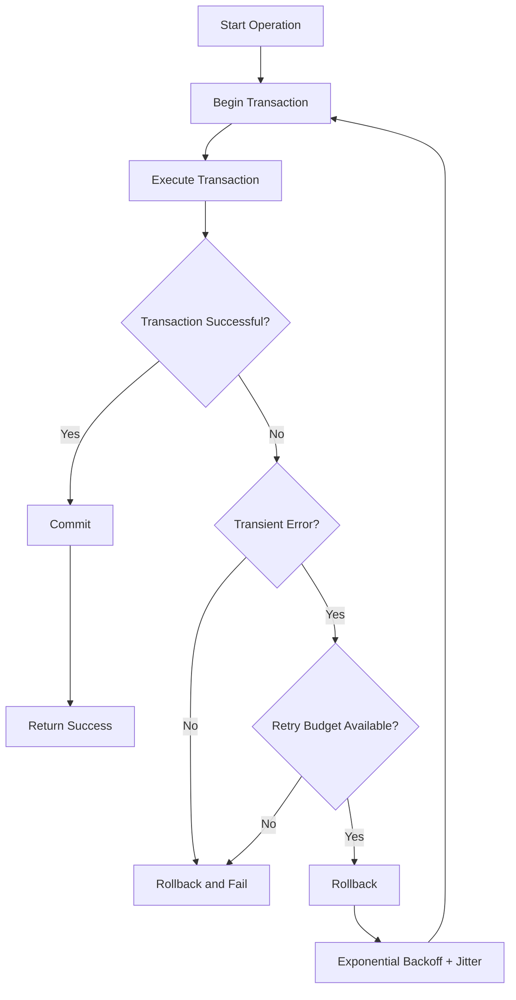
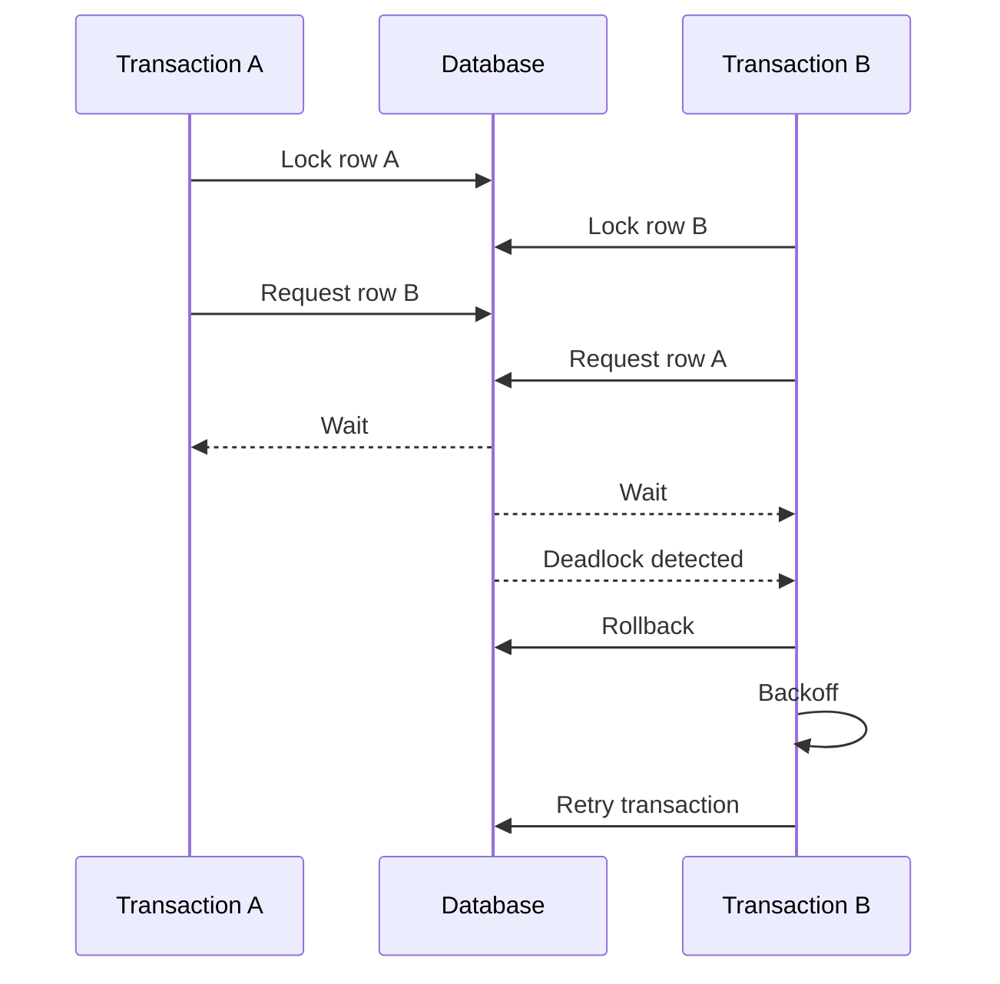
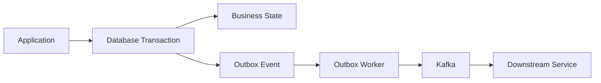

# 23- Transaction Retry Strategies

## Overview

Database transactions can fail even when the SQL and application logic are correct. Under concurrency, the database may reject a transaction because of a **deadlock**, **serialization conflict**, **lock timeout**, or another transient condition.

A transaction retry strategy allows an application to transparently repeat a transaction when the failure is temporary and the operation is safe to retry.

The important distinction is:

> Retry the **entire transaction**, not an individual SQL statement inside a failed transaction.

A production retry strategy must also consider:

- Which errors are transient.
- Whether the operation is safe to repeat.
- Maximum retry attempts.
- Exponential backoff.
- Jitter.
- Transaction boundaries.
- Request deadlines.
- Connection and transaction state.
- Idempotency.
- External side effects.
- Observability.

Retries are a resilience mechanism, not a substitute for fixing excessive contention, poor transaction design, or deadlock-prone lock ordering.

## Why Transactions Need Retries

Concurrent transactions can legitimately encounter transient failures.

Common examples include:

| Failure | Typical cause | Retry suitability |
|---|---|---|
| Deadlock | Transactions acquire conflicting locks in different orders | Usually retryable |
| Serialization failure | Serializable execution cannot be maintained | Usually retryable |
| Lock timeout | Transaction waited too long for a lock | Sometimes retryable |
| Connection failure | Temporary network/database failure | Sometimes retryable |
| Constraint violation | Invalid business/data state | Usually not retryable |
| Syntax error | Invalid SQL | Not retryable |
| Authentication failure | Invalid credentials/permissions | Not retryable |
| Programming error | Application bug | Not retryable |

A retry should only happen when the failure is **transient and the operation remains semantically safe to repeat**.

## Transaction Retry Lifecycle

A typical retry flow is:



The transaction boundary is recreated on every attempt.

Conceptually:

```text
attempt 1
BEGIN
  operations
ROLLBACK

wait

attempt 2
BEGIN
  operations
COMMIT
```

The second attempt must execute against a new transaction state.

## Why the Entire Transaction Must Be Retried

Consider:

```sql
BEGIN;

UPDATE accounts
SET balance = balance - 100
WHERE id = 1;

-- deadlock detected

UPDATE accounts
SET balance = balance + 100
WHERE id = 2;

COMMIT;
```

Once the database aborts the transaction, continuing inside that transaction is generally invalid.

The correct model is:

```text
Transaction attempt
       ↓
failure
       ↓
rollback / transaction discarded
       ↓
new transaction
       ↓
re-execute entire operation
```

Do not retry only the statement that raised the error.

The transaction's earlier reads and writes may have influenced the outcome, and its snapshot or lock state may no longer be valid.

## Deadlock Retries

Deadlocks occur when transactions create a circular dependency.



A database detects the cycle and aborts one participant so that the other can proceed.

The aborted transaction is often safe to retry if:

- The transaction is deterministic enough to repeat.
- Its external side effects are controlled.
- The application handles duplicate execution correctly.

## Serialization Failure Retries

Serializable isolation can reject a transaction when concurrent execution cannot produce a result equivalent to some serial execution order.

For example:

```text
Transaction A ──────┐
                    ├── conflicting serialization
Transaction B ──────┘
```

The database may abort one transaction.

This is expected behavior under optimistic serializability mechanisms.

The application should:

1. Roll back the failed transaction.
2. Wait using backoff.
3. Start a new transaction.
4. Re-read required data.
5. Re-execute the entire transaction.

Do not reuse stale data from the failed attempt.

## Exponential Backoff

Immediately retrying can create a retry storm.

Without backoff:

```text
failure
  ↓
retry immediately
  ↓
failure
  ↓
retry immediately
  ↓
failure
  ↓
...
```

With exponential backoff:

```text
attempt 1 → 10 ms
attempt 2 → 20 ms
attempt 3 → 40 ms
attempt 4 → 80 ms
```

A common model is:

```text
delay = min(cap, base × 2^attempt)
```

For example:

```text
base = 25 ms
cap  = 1 second

attempt 0 → 25 ms
attempt 1 → 50 ms
attempt 2 → 100 ms
attempt 3 → 200 ms
attempt 4 → 400 ms
attempt 5 → 800 ms
attempt 6 → 1000 ms
```

The exact values should be chosen based on service latency and workload characteristics.

## Jitter

Multiple workers can fail at approximately the same time.

If they all use identical backoff:

```text
workers
  ↓
failure
  ↓
100 ms
  ↓
retry simultaneously
```

they may create another contention spike.

**Jitter** introduces randomness:

```text
worker A → 73 ms
worker B → 118 ms
worker C → 91 ms
worker D → 134 ms
```

A common full-jitter strategy is:

```text
delay = random(0, exponential_delay)
```

This spreads retries over time.

## Recommended Retry Algorithm

A practical strategy is:

```text
max attempts = small bounded number
base delay   = tens of milliseconds
backoff      = exponential
jitter       = enabled
total time   = bounded by request/job deadline
```

For example:

```text
Attempt 1
    ↓
25–50 ms

Attempt 2
    ↓
50–100 ms

Attempt 3
    ↓
100–200 ms

stop
```

Do not blindly retry indefinitely.

## Python Example

A transaction wrapper can centralize retry behavior:

```python
import random
import time
from collections.abc import Callable
from typing import TypeVar

T = TypeVar("T")


class RetryableTransactionError(Exception):
    pass


def run_with_retry(
    operation: Callable[[], T],
    *,
    max_attempts: int = 4,
    base_delay: float = 0.025,
    max_delay: float = 1.0,
) -> T:
    for attempt in range(max_attempts):
        try:
            return operation()
        except RetryableTransactionError:
            if attempt == max_attempts - 1:
                raise

            exponential_delay = min(
                max_delay,
                base_delay * (2**attempt),
            )
            delay = random.uniform(0, exponential_delay)
            time.sleep(delay)

    raise RuntimeError("Unreachable")
```

In a real application, `RetryableTransactionError` should be mapped from the database driver's actual transient exceptions.

The wrapper should not classify every database exception as retryable.

## Django Example

Django transactions should be retried by recreating the `atomic()` block:

```python
import random
import time

from django.db import OperationalError, transaction


def transfer_funds(from_id: int, to_id: int, amount: int) -> None:
    max_attempts = 4

    for attempt in range(max_attempts):
        try:
            with transaction.atomic():
                source = (
                    Account.objects
                    .select_for_update()
                    .get(pk=from_id)
                )

                destination = (
                    Account.objects
                    .select_for_update()
                    .get(pk=to_id)
                )

                if source.balance < amount:
                    raise InsufficientFundsError

                source.balance -= amount
                destination.balance += amount

                source.save(update_fields=["balance"])
                destination.save(update_fields=["balance"])

            return

        except OperationalError:
            if attempt == max_attempts - 1:
                raise

            delay = min(1.0, 0.025 * (2**attempt))
            time.sleep(random.uniform(0, delay))
```

In production, the exception filter should distinguish deadlocks and serialization failures from permanent database errors.

Also ensure that the lock acquisition order is deterministic.

For example, instead of:

```text
request A: lock account 1 → account 2
request B: lock account 2 → account 1
```

normalize the order:

```text
lock lower account ID first
lock higher account ID second
```

This reduces deadlock frequency.

## SQLAlchemy Example

A transaction retry wrapper can recreate the session transaction:

```python
import random
import time

from sqlalchemy.exc import OperationalError
from sqlalchemy.orm import Session


def run_transaction(session: Session, operation) -> None:
    max_attempts = 4

    for attempt in range(max_attempts):
        try:
            with session.begin():
                operation(session)

            return

        except OperationalError:
            session.rollback()

            if attempt == max_attempts - 1:
                raise

            delay = min(1.0, 0.025 * (2**attempt))
            time.sleep(random.uniform(0, delay))
```

The production implementation should inspect the database-specific error code rather than retrying every `OperationalError`.

## PostgreSQL Error Classification

PostgreSQL exposes SQLSTATE error codes that can be used for reliable classification.

Important concurrency-related codes include:

| SQLSTATE | Meaning | Usually retryable |
|---|---|---|
| `40P01` | Deadlock detected | Yes |
| `40001` | Serialization failure | Yes |
| `55P03` | Lock not available | Depends on application policy |
| `23505` | Unique violation | Usually no |
| `23503` | Foreign key violation | Usually no |
| `23514` | Check violation | No |

For production systems, prefer structured database error codes over parsing exception messages.

For example, with PostgreSQL:

```python
def is_retryable_postgres_error(exc: Exception) -> bool:
    code = getattr(getattr(exc, "orig", None), "pgcode", None)
    return code in {"40P01", "40001"}
```

The exact exception structure depends on the database driver and framework.

## Retry Budget

Retries consume resources.

Suppose:

```text
100 requests/sec
```

and every request can retry three times.

A transient failure can temporarily produce:

```text
100 initial attempts
+
300 retries
=
400 database attempts/sec
```

This can make an overloaded database even less healthy.

A retry policy should therefore have a **retry budget**.

Consider:

- Maximum attempts.
- Maximum retry duration.
- Maximum total request deadline.
- Maximum backoff.
- Queue/job visibility timeout.
- Database connection pool capacity.

Retries should help the system recover, not amplify an outage.

## Request Deadlines

For synchronous APIs, retry time must fit inside the request deadline.

For example:

```text
HTTP timeout = 2 seconds

database attempt      500 ms
backoff                 50 ms
database attempt      500 ms
backoff                100 ms
database attempt      500 ms
```

The application may have insufficient time left for useful processing.

A retry mechanism should therefore be **deadline-aware**.

Conceptually:

```python
remaining_time = deadline - current_time

if remaining_time <= minimum_useful_attempt_time:
    stop_retrying()
```

This is particularly important in microservices where a request may pass through:

```text
Client
  ↓
API Gateway
  ↓
Service A
  ↓
Service B
  ↓
Database
```

Every layer has to respect the overall latency budget.

## Retries and Idempotency

Retrying a database transaction is not automatically equivalent to safely retrying the entire business operation.

Consider:

```text
charge credit card
     ↓
update database
```

If the external payment succeeds but the database transaction fails, blindly retrying the entire operation could charge the customer twice.

Database transaction atomicity does not extend automatically across external systems.

For operations involving external side effects, consider:

- Idempotency keys.
- Idempotency records.
- Transactional outbox.
- Durable workflow state.
- Provider-side idempotency support.

## Transactional Outbox

A common pattern is:



The business update and outbox event are committed atomically.

If the transaction must be retried:

```text
attempt 1
  business update
  outbox insert
  failure → rollback

attempt 2
  business update
  outbox insert
  commit
```

The failed attempt leaves no committed outbox event.

This is significantly safer than performing an external publish directly inside a retried transaction.

## Retryable vs Non-Retryable Operations

### Usually Retryable

- Deadlocks.
- Serialization failures.
- Some transient connection failures.
- Some lock acquisition timeouts.
- Temporary infrastructure failures.

### Usually Not Retryable

- Syntax errors.
- Invalid SQL.
- Constraint violations caused by invalid input.
- Authorization failures.
- Invalid business state.
- Missing required records.
- Data validation errors.

### Context-Dependent

- Lock timeout.
- Connection reset.
- Statement timeout.
- Network failure after an uncertain commit.
- Serialization conflict caused by a highly contended workload.

The last category requires particular care because the client may not know whether the database committed the operation.

## The Uncertain Commit Problem

Consider:

```text
Application
    │
    │ COMMIT
    ▼
Database
    │
    │ commit succeeds
    ▼
Network failure
    │
    ▼
Application
```

The application may receive an error even though the database committed the transaction.

Retrying blindly can duplicate a non-idempotent operation.

This is fundamentally different from a known transaction abort.

For critical operations, design for **idempotent recovery**.

Examples include:

- Payment processing.
- Order creation.
- Resource provisioning.
- External API calls.
- Message publication.

## Retry and Kafka

Retries also appear in event-driven architectures.

A consumer may process:

```text
Kafka message
     ↓
database transaction
     ↓
temporary failure
     ↓
retry
```

The consumer must assume messages may be delivered more than once.

Use:

- Idempotent consumers.
- Unique event identifiers.
- Deduplication records.
- Appropriate offset management.
- Transactional processing where supported.

A database retry strategy does not by itself provide Kafka exactly-once business semantics.

## Retry Storms

A retry storm occurs when many clients retry a failing dependency simultaneously.

```text
Database becomes overloaded
          ↓
requests fail
          ↓
all clients retry
          ↓
database receives more traffic
          ↓
database becomes more overloaded
          ↓
more failures
```

Mitigations include:

- Exponential backoff.
- Jitter.
- Small retry limits.
- Circuit breakers.
- Load shedding.
- Rate limiting.
- Queue-based buffering.
- Connection pool limits.
- Database capacity planning.

Retries should be treated as additional load when designing system capacity.

## Retry vs Deadlock Prevention

Retries are a safety mechanism, but they should not replace good transaction design.

Prefer preventing unnecessary deadlocks through:

- Consistent lock ordering.
- Short transactions.
- Minimal lock scope.
- Appropriate indexes.
- Avoiding unnecessary writes.
- Avoiding external calls inside transactions.
- Avoiding user interaction while locks are held.

For example:

```text
Bad:

Transaction A → lock customer → lock account
Transaction B → lock account → lock customer

Better:

Transaction A → lock account → lock customer
Transaction B → lock account → lock customer
```

If the lock order is consistent, circular waits become much less likely.

## Performance Considerations

Retries increase:

- Database CPU.
- Database I/O.
- Connection usage.
- Application CPU.
- Request latency.
- Queue latency.

Measure both normal execution and retry execution.

Useful metrics include:

```text
transaction_attempts_total
transaction_retries_total
transaction_retry_exhausted_total
transaction_retry_delay_seconds
deadlock_total
serialization_failure_total
transaction_duration_seconds
database_lock_wait_seconds
```

Useful dimensions include:

- Service.
- Operation.
- Database.
- Error class.
- Attempt number.

Avoid high-cardinality labels such as arbitrary SQL statements or user IDs.

## Monitoring and Alerting

A healthy system may occasionally retry a transaction.

An unhealthy system may show:

```text
retry rate ↑
lock wait time ↑
transaction latency ↑
database CPU ↑
connection pool saturation ↑
```

Monitor trends rather than treating every retry as an incident.

Useful alerts include:

- Sustained deadlock-rate increase.
- Serialization failures above baseline.
- Retry exhaustion.
- Database connection pool saturation.
- Transaction latency degradation.
- Increased lock wait duration.

A retry mechanism should make failures observable rather than hiding them.

## Production Configuration Guidelines

| Setting | Recommendation |
|---|---|
| Maximum attempts | Small and bounded |
| Backoff | Exponential |
| Jitter | Yes |
| Maximum delay | Bounded |
| Retry classification | Database error codes |
| Transaction scope | Entire transaction |
| Request deadline | Always respected |
| Logging | Log final failure and useful retry metadata |
| Metrics | Track attempts, conflicts, and exhausted retries |
| External side effects | Require idempotency |
| Deadlock prevention | Consistent lock ordering |

The exact values depend on workload and latency requirements.

## Common Mistakes

### Retrying Every Database Exception

This can repeatedly execute invalid operations.

```text
SQL syntax error
    ↓
retry
    ↓
same syntax error
    ↓
retry
```

Classify errors explicitly.

### Retrying Inside a Failed Transaction

Once the transaction has been aborted, executing more SQL in that transaction may fail.

Rollback and start a new transaction.

### Retrying Only the Failed SQL Statement

This can produce inconsistent application state because earlier reads and writes belong to the original transaction attempt.

Retry the entire transaction.

### No Backoff

Immediate retries increase contention and can create retry storms.

Use exponential backoff with jitter.

### Unlimited Retries

An operation can consume connections and worker capacity indefinitely.

Use a bounded attempt count and deadline.

### Sleeping While Holding a Transaction

Avoid:

```text
BEGIN
lock rows
failure
sleep
retry
COMMIT
```

The backoff should occur **after the transaction has been rolled back and resources released**.

### Retrying Non-Idempotent External Side Effects

A database retry cannot safely repeat an external side effect unless the external operation is idempotent or otherwise coordinated.

### Ignoring Lock Ordering

Retries may hide a deadlock problem that could be prevented through deterministic lock ordering.

### Logging Sensitive Transaction Data

Retry logs should not contain:

- Passwords.
- Access tokens.
- Payment credentials.
- Sensitive request payloads.

Log operation identifiers and error classifications instead.

## Interview Traps

### Should You Retry a Deadlock?

Usually yes, because deadlocks are transient concurrency failures. The transaction must be rolled back and executed again.

### Should You Retry a Unique Constraint Violation?

Usually no. It generally indicates a business/data conflict rather than a transient database condition.

### Why Retry the Entire Transaction?

The failed transaction's snapshot, locks, and intermediate state are no longer a valid basis for continuing. A fresh transaction must re-execute the complete unit of work.

### Why Use Jitter?

Without jitter, many clients can retry at the same time and reproduce the original contention.

### Why Is Exponential Backoff Better Than Fixed Delays?

It progressively reduces retry pressure when the dependency remains unhealthy.

### Can Retries Cause an Outage to Become Worse?

Yes. If thousands of requests retry aggressively, retries can multiply load on an already overloaded dependency.

### Does Retrying Guarantee Exactly-Once Execution?

No. A retry mechanism provides repeated attempts, not exactly-once business semantics.

### What If `COMMIT` Times Out?

The client may not know whether the transaction committed. Blindly retrying can duplicate non-idempotent operations. Recovery must account for the uncertain outcome.

## Senior-Level Design Pattern

A robust transaction retry system can be viewed as:

```text
                 ┌─────────────────────┐
                 │ Business Operation  │
                 └──────────┬──────────┘
                            │
                            ▼
                 ┌─────────────────────┐
                 │ Transaction Wrapper │
                 └──────────┬──────────┘
                            │
                            ▼
                 ┌─────────────────────┐
                 │ Execute Transaction │
                 └──────────┬──────────┘
                            │
                   ┌────────┴────────┐
                   │                 │
                 Success           Failure
                   │                 │
                   ▼                 ▼
                 Commit       Classify Error
                                     │
                              ┌──────┴──────┐
                              │             │
                           Retryable    Permanent
                              │             │
                              ▼             ▼
                         Rollback         Fail
                              │
                              ▼
                       Backoff + Jitter
                              │
                              ▼
                       New Transaction
```

At senior engineering level, the retry mechanism should be designed as part of the transaction boundary rather than scattered across individual repository calls.

## Best Practices

- Keep transactions short.
- Make lock acquisition order deterministic.
- Retry only known transient failures.
- Retry the entire transaction.
- Roll back before waiting.
- Use exponential backoff.
- Add jitter.
- Respect request and job deadlines.
- Bound retry attempts.
- Measure retry rates.
- Investigate increasing deadlock rates instead of accepting retries as normal.
- Use database constraints to protect invariants.
- Use idempotency for externally visible operations.
- Avoid external network calls inside database transactions.
- Keep retry behavior centralized and consistent.
- Test concurrency behavior under realistic load.

## Key Takeaways

- **Retry the entire transaction after a transient concurrency failure; never continue or partially retry a transaction that has already been aborted.**
- **Use bounded exponential backoff with jitter to prevent retry storms and reduce pressure on a contended database.**
- **Classify database errors explicitly: deadlocks and serialization failures are commonly retryable, while constraint and programming errors usually are not.**
- **Retries must respect deadlines and idempotency because repeated execution can duplicate externally visible side effects or amplify system load.**
- **Retries provide resilience, but consistent lock ordering, short transactions, atomic operations, and reduced contention are the primary tools for preventing concurrency problems.**