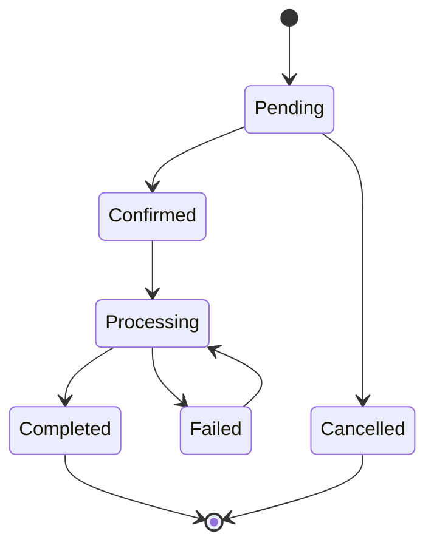

# 24- Transaction Design Rules

## Overview

Transaction design is one of the most important parts of building reliable database-backed services. A transaction defines the boundary within which related database operations must succeed or fail together.

Poor transaction design can produce:

- Partial updates.
- Lost updates.
- Deadlocks.
- Excessive lock contention.
- Long-running transactions.
- Connection pool exhaustion.
- Inconsistent business state.
- Difficult-to-debug production failures.

Good transaction design is not simply about adding `BEGIN` and `COMMIT`. It requires deciding:

- What constitutes one atomic business operation.
- Which reads and writes must be protected together.
- How long locks should be held.
- Which isolation level is appropriate.
- Whether pessimistic or optimistic concurrency is better.
- How failures are retried.
- How external systems interact with database state.

The central principle is:

> Keep the transaction boundary aligned with the smallest business operation that must be atomic, while keeping the transaction as short as practical.

## Transaction Boundary

A transaction boundary defines the start and end of an atomic unit of database work.

For example, transferring money between two accounts requires both updates to succeed together:

```text
BEGIN
    debit account A
    credit account B
COMMIT
```

If the credit fails:

```text
BEGIN
    debit account A
    credit account B
ROLLBACK
```

The database should never expose a committed state where only one side of the transfer has been applied.

A useful design question is:

> What state must never be observed as partially completed?

That state usually belongs inside the same transaction.

## Business Operation vs SQL Statement

A transaction should normally represent a **business operation**, not merely a SQL statement.

For example:

```text
Create order
├── create order
├── create order items
├── reserve inventory
└── create outbox event
```

If these records collectively represent one atomic business transition, they may belong in one transaction.

However, this does not mean every operation in an HTTP request should automatically be inside one large transaction.

For example:

```text
HTTP request
├── validate input
├── call external recommendation API
├── query database
├── update order
├── send email
└── publish event
```

Putting everything inside one database transaction would unnecessarily hold database resources while external operations execute.

A better design is usually:

```text
validate
    ↓
short database transaction
    ↓
commit
    ↓
asynchronous/external processing
```

## Core Transaction Design Rules

| Rule | Reason |
|---|---|
| Keep transactions short | Reduces lock duration and contention |
| Define boundaries around business invariants | Preserves atomicity |
| Avoid external calls inside transactions | Prevents long lock holding |
| Acquire locks consistently | Reduces deadlocks |
| Use constraints for invariants | Protects correctness at the database layer |
| Prefer atomic SQL for simple state transitions | Reduces race windows |
| Use appropriate isolation | Balances correctness and concurrency |
| Retry only transient failures | Prevents retry storms and invalid repeats |
| Keep transaction logic centralized | Makes behavior predictable |
| Observe transaction behavior | Enables production diagnosis |

## Rule: Keep Transactions Short

A transaction should contain only the database operations necessary to maintain the required atomicity.

Prefer:

```text
BEGIN
    read required rows
    validate invariant
    update rows
COMMIT
```

Avoid:

```text
BEGIN
    read rows
    call payment API
    call another microservice
    wait for user input
    generate large report
    publish message
COMMIT
```

The longer a transaction remains open, the longer locks and database resources may be retained.

### Why Long Transactions Are Dangerous

Long transactions can cause:

- Increased lock contention.
- Deadlocks.
- Higher connection utilization.
- Increased MVCC cleanup pressure.
- Larger transaction snapshots.
- Longer rollback times.
- Lower database throughput.

In PostgreSQL, long-running transactions can also prevent cleanup of row versions that are still potentially visible to the transaction.

## Rule: Do Not Perform Network Calls Inside Database Transactions

Avoid:

```python
with transaction.atomic():
    order = create_order()

    payment_client.charge_card()

    order.mark_paid()
```

The payment request could take seconds or fail due to a network timeout while database locks remain active.

Prefer:

```text
Request
  │
  ▼
Database transaction
  ├── create order
  └── create payment intent / pending state
  │
  ▼
Commit
  │
  ▼
External payment processing
  │
  ▼
Database transaction
  └── record final result
```

For workflows requiring stronger coordination, use idempotency keys, transactional outbox patterns, sagas, or durable workflow mechanisms.

## Rule: Protect Business Invariants

A transaction should protect the invariant that must remain true.

Suppose inventory must never become negative:

```text
available_quantity >= 0
```

A naïve implementation is:

```text
SELECT available_quantity
UPDATE available_quantity
```

Two concurrent requests can both read the same value and overwrite each other's changes.

An atomic update is often safer:

```sql
UPDATE inventory
SET available_quantity = available_quantity - 1
WHERE product_id = $1
  AND available_quantity > 0;
```

Then check the affected row count:

```text
1 row affected → reservation succeeded
0 rows affected → insufficient inventory or missing product
```

This moves the invariant into one atomic database operation.

## Rule: Prefer Database Constraints for Data Invariants

Application validation alone is not sufficient for important invariants.

For example:

```sql
CREATE UNIQUE INDEX users_email_unique
ON users (lower(email));
```

This prevents duplicate logical email addresses even when concurrent requests execute simultaneously.

Application validation:

```text
SELECT user WHERE email = ?
if not found:
    INSERT
```

is vulnerable to:

```text
Request A → SELECT → none
Request B → SELECT → none
Request A → INSERT
Request B → INSERT
```

A database uniqueness constraint closes the race.

The application should still handle the resulting constraint error appropriately.

## Rule: Use Constraints as the Final Line of Defense

Important invariants should ideally be enforced at multiple levels:

```text
API validation
      ↓
Application business rules
      ↓
Database constraints
      ↓
Database transaction
```

Examples include:

- `UNIQUE`.
- `PRIMARY KEY`.
- `FOREIGN KEY`.
- `CHECK`.
- `NOT NULL`.
- Exclusion constraints where appropriate.

Application logic provides useful behavior and error messages, while the database provides authoritative integrity enforcement.

## Rule: Choose Isolation Intentionally

Do not increase isolation simply because "stronger is safer."

Higher isolation can reduce concurrency or increase transaction aborts.

| Requirement | Possible approach |
|---|---|
| Normal CRUD | Read Committed |
| Consistent transaction snapshot | Repeatable Read |
| Strong serial execution semantics | Serializable |
| High-contention state transition | Atomic update or explicit locking |
| Conditional concurrent update | Optimistic concurrency |
| Read-modify-write requiring exclusive ownership | Pessimistic locking |

The correct choice depends on the business invariant and workload.

## Rule: Use Locks Only When Necessary

Explicit locking is powerful but increases coupling between concurrent transactions.

For example:

```sql
SELECT id, balance
FROM accounts
WHERE id = $1
FOR UPDATE;
```

The selected row is locked until the transaction ends.

Use this when a transaction needs to:

```text
read current state
      ↓
validate invariant
      ↓
modify state
```

and another transaction must not modify the row concurrently.

Do not automatically add `FOR UPDATE` to every query.

Unnecessary locking can reduce throughput and increase deadlocks.

## Rule: Acquire Locks in a Consistent Order

Deadlocks often result from inconsistent lock ordering.

Bad:

```text
Transaction A:
    lock account 1
    lock account 2

Transaction B:
    lock account 2
    lock account 1
```

Better:

```text
Transaction A:
    lock lower ID first
    lock higher ID second

Transaction B:
    lock lower ID first
    lock higher ID second
```

The same principle applies to multiple tables:

```text
always lock customer
    ↓
then account
    ↓
then order
```

when that ordering is appropriate for the application's domain.

Consistent ordering significantly reduces circular wait conditions.

## Rule: Prefer Atomic SQL for Simple State Transitions

When the business rule can be expressed safely in one SQL statement, prefer that over a separate read followed by a write.

Instead of:

```sql
SELECT balance
FROM accounts
WHERE id = $1;
```

followed by application logic and:

```sql
UPDATE accounts
SET balance = ...
WHERE id = $1;
```

consider:

```sql
UPDATE accounts
SET balance = balance - $2
WHERE id = $1
  AND balance >= $2;
```

This reduces the race window and often eliminates the need for an explicit application-level lock.

## Rule: Do Not Trust Application-Level Locks Alone

An in-process lock such as:

```python
threading.Lock()
```

protects only the current process.

In Kubernetes:

```text
Pod A ──┐
Pod B ──┼── PostgreSQL
Pod C ──┘
```

a Python process lock in Pod A does not prevent Pod B from modifying the same database row.

For cross-instance concurrency, use mechanisms appropriate to the shared resource:

- Database constraints.
- Database row locks.
- Atomic SQL.
- Optimistic concurrency.
- Carefully designed distributed coordination.

## Rule: Keep Reads and Writes Within the Correct Transaction

A common mistake is:

```python
obj = get_object()

with transaction.atomic():
    update_object(obj)
```

If the initial read must be consistent with the subsequent write, it may need to occur inside the transaction.

For example:

```python
with transaction.atomic():
    account = (
        Account.objects
        .select_for_update()
        .get(pk=account_id)
    )

    if account.balance < amount:
        raise InsufficientFundsError

    account.balance -= amount
    account.save(update_fields=["balance"])
```

The lock protects the state that was read and subsequently modified.

## Rule: Avoid Read-Modify-Write Race Conditions

This pattern is dangerous:

```text
read value
   ↓
calculate new value
   ↓
write new value
```

For example:

```text
balance = 100

A reads 100
B reads 100

A writes 50
B writes 80

final = 80
```

The update from A is lost.

Possible solutions include:

- Atomic SQL.
- `SELECT ... FOR UPDATE`.
- Optimistic version checks.
- Appropriate isolation.

The right choice depends on contention and business requirements.

## Rule: Use Optimistic Concurrency When Conflicts Are Infrequent

A version column can detect concurrent modifications:

```sql
UPDATE documents
SET content = $1,
    version = version + 1
WHERE id = $2
  AND version = $3;
```

If:

```text
rows affected = 1
```

the update succeeded.

If:

```text
rows affected = 0
```

another transaction changed the document.

This avoids holding locks while the client is editing data.

It is useful for:

- APIs.
- Admin interfaces.
- Document editing.
- Low-contention updates.

## Rule: Use Pessimistic Concurrency When Conflicts Are Expensive

For high-contention resources, explicit locking can be appropriate:

```sql
BEGIN;

SELECT available_quantity
FROM inventory
WHERE product_id = $1
FOR UPDATE;

UPDATE inventory
SET available_quantity = available_quantity - $2
WHERE product_id = $1;

COMMIT;
```

The lock serializes conflicting modifications.

This is useful when:

- The resource is highly contended.
- The transaction is short.
- Conflicts are expensive to resolve.
- The business operation requires exclusive ownership of current state.

## Rule: Design for Retryable Transactions

Concurrency failures are sometimes unavoidable.

For deadlocks and serialization failures:

```text
transaction attempt
       ↓
transient failure
       ↓
rollback
       ↓
backoff + jitter
       ↓
new transaction
       ↓
retry
```

Do not:

- Retry indefinitely.
- Retry every database exception.
- Retry only the failed SQL statement.
- Sleep while holding database locks.

Retry behavior should be centralized and observable.

## Rule: Separate Transaction Scope from Request Scope

An HTTP request is not necessarily one transaction.

Bad assumption:

```text
one HTTP request = one giant database transaction
```

A request may contain:

```text
validation
database transaction
external API call
another database transaction
response
```

The correct transaction scope depends on the atomic business operation.

Django example:

```python
def create_order(request):
    validate_request(request)

    with transaction.atomic():
        order = create_order_record()
        create_order_items(order)
        create_outbox_event(order)

    return serialize(order)
```

Only the database operations that need atomicity are enclosed in the transaction.

## Rule: Keep Transaction Logic at a Clear Application Boundary

Transaction management should generally live near the service/use-case layer rather than being scattered across low-level repository methods.

Prefer:

```text
API
 ↓
Service / Use Case
 ↓
Transaction boundary
 ├── Repository
 ├── Repository
 └── Outbox
 ↓
Database
```

rather than:

```text
Repository A → starts transaction
Repository B → starts transaction
Repository C → commits
```

The latter makes it difficult to understand the true atomic unit.

## Rule: Avoid Hidden Transactions

A helper function should not unexpectedly change transaction semantics.

For example:

```python
def update_customer():
    with transaction.atomic():
        ...
```

may be surprising if its caller already needs several operations to commit atomically.

Prefer explicit transaction ownership at the appropriate service boundary:

```python
def update_customer():
    ...

def update_order():
    ...

def process_request():
    with transaction.atomic():
        update_customer()
        update_order()
```

This makes composition easier.

Nested transaction mechanisms such as Django savepoints can still be useful, but their semantics should be understood.

## Rule: Do Not Hold Transactions Across User Interaction

Never design a workflow such as:

```text
BEGIN
    reserve database rows
    wait for user confirmation
    wait for payment
    wait for another service
COMMIT
```

The transaction may remain open for seconds or minutes.

Instead, represent workflow state explicitly:

```text
PENDING
   ↓
CONFIRMED
   ↓
PROCESSING
   ↓
COMPLETED
```

Each transition can use a short transaction.

This is especially important in distributed systems.

## Rule: Use Explicit State Machines for Long Workflows

Long-running business workflows should usually use durable state rather than long transactions.

Example:



Each transition can be committed independently while maintaining valid state transitions.

This approach works well with:

- Celery.
- Kafka.
- Workflow engines.
- Microservices.
- Event-driven architectures.

## Rule: Coordinate Database and Kafka Carefully

Avoid assuming:

```text
DB COMMIT
   ↓
Kafka publish
```

is atomic.

If the database commits and Kafka publication fails, downstream consumers may never receive the event.

A transactional outbox can solve this consistency problem:

```text
BEGIN
    update business state
    insert outbox event
COMMIT
```

A worker then publishes the event:

```text
Outbox
  ↓
Kafka
  ↓
consumer
```

The worker can safely retry publication when the event has a stable unique identifier and consumers are idempotent.

## Rule: Do Not Use Redis as a Replacement for Database Transactions

Redis can provide useful coordination primitives, caching, rate limiting, and distributed locking patterns, but it does not automatically provide the same transactional guarantees as the database holding the authoritative business state.

For example:

```text
Redis lock
   ↓
PostgreSQL update
```

requires careful failure handling.

Whenever possible, protect database invariants using PostgreSQL itself:

- Constraints.
- Atomic updates.
- Row locks.
- Transactions.
- Appropriate isolation.

Use distributed locks only when the problem genuinely requires cross-resource coordination.

## Rule: Understand Autocommit

In autocommit mode, individual SQL statements are committed independently unless an explicit transaction is established.

This is convenient for simple CRUD:

```sql
UPDATE users
SET last_login_at = now()
WHERE id = 42;
```

But multiple dependent statements require an explicit transaction:

```sql
BEGIN;

UPDATE orders
SET status = 'PAID'
WHERE id = 1001;

INSERT INTO payments(order_id, status)
VALUES (1001, 'SUCCEEDED');

COMMIT;
```

Without the transaction, the two operations can commit independently.

## Rule: Use Savepoints for Partial Recovery, Not as a Transaction Substitute

Savepoints are useful when a larger transaction needs a recoverable sub-operation:

```sql
BEGIN;

SAVEPOINT optional_step;

-- operation

ROLLBACK TO SAVEPOINT optional_step;

-- continue

COMMIT;
```

They should not be used to justify unnecessarily large transactions.

The outer transaction still holds its resources until commit or rollback.

## Rule: Validate Before Acquiring Expensive Locks Where Possible

Do inexpensive validation before entering a transaction when that validation does not require a consistent database state.

For example:

```text
parse JSON
validate required fields
validate format
      ↓
BEGIN
      ↓
database-dependent validation
      ↓
write
      ↓
COMMIT
```

Do not perform validation outside the transaction if that validation depends on mutable database state that must remain consistent with the subsequent write.

## Rule: Use the Database as the Source of Truth

Application caches can become stale:

```text
Redis
  ↓
stale value

PostgreSQL
  ↓
current value
```

For concurrency-sensitive operations, validate and enforce the invariant against the authoritative database state.

For example, do not rely solely on:

```python
available = redis.get(...)
```

before decrementing PostgreSQL inventory.

The database update must still enforce the invariant atomically.

## Rule: Design for Failure

Every transaction design should answer:

- What happens if the first write succeeds and the second fails?
- What happens if two requests execute concurrently?
- What happens if the transaction deadlocks?
- What happens if the client disconnects?
- What happens if the process crashes?
- What happens if the database connection fails?
- What happens if `COMMIT` succeeds but the response is lost?
- Can the operation be safely retried?

A transaction is successful only when the complete failure model has been considered.

## Transaction Design Decision Matrix

| Problem | Preferred mechanism |
|---|---|
| Multiple writes must commit together | Transaction |
| Prevent duplicate values | Unique constraint |
| Simple conditional update | Atomic SQL |
| Read-modify-write under high contention | Row lock |
| Low-contention concurrent edits | Optimistic concurrency |
| Strong cross-operation consistency | Appropriate isolation |
| Deadlock/serialization conflict | Transaction retry |
| Long-running workflow | Explicit state machine |
| DB + event consistency | Transactional outbox |
| Cross-service workflow | Saga/workflow pattern |
| Cross-instance coordination | Carefully designed distributed coordination |

## Django Transaction Pattern

A production-oriented service method can look like:

```python
from django.db import transaction


def create_order(*, customer_id: int, items: list[dict]):
    with transaction.atomic():
        customer = (
            Customer.objects
            .select_for_update()
            .get(pk=customer_id)
        )

        order = Order.objects.create(
            customer=customer,
            status=Order.Status.PENDING,
        )

        for item in items:
            reserve_inventory(item["product_id"], item["quantity"])
            OrderItem.objects.create(
                order=order,
                product_id=item["product_id"],
                quantity=item["quantity"],
            )

        OutboxEvent.objects.create(
            event_type="order.created",
            aggregate_id=str(order.id),
        )

    return order
```

Important considerations:

- Keep `reserve_inventory()` transactional.
- Avoid network calls inside the `atomic()` block.
- Ensure lock ordering is deterministic.
- Use database constraints for uniqueness and integrity.
- Retry transient concurrency failures around the complete service operation.

## FastAPI Transaction Pattern

With SQLAlchemy, keep transaction ownership explicit:

```python
from fastapi import APIRouter, Depends
from sqlalchemy.orm import Session

router = APIRouter()


@router.post("/orders")
def create_order(payload: OrderRequest, db: Session = Depends(get_db)):
    with db.begin():
        order = create_order_record(db, payload)

        reserve_inventory(
            db,
            product_id=payload.product_id,
            quantity=payload.quantity,
        )

        create_outbox_event(db, order)

    return order
```

The dependency provides the database session, while the service operation owns the transaction boundary.

## Transaction Boundaries in Microservices

A transaction normally provides atomicity within one database.

It does not automatically provide:

```text
Service A database
        +
Service B database
        +
Kafka
        +
Payment provider
```

as one atomic transaction.

For distributed operations, use patterns such as:

- Transactional outbox.
- Idempotent consumers.
- Saga orchestration.
- Saga choreography.
- Compensation.
- Durable workflow execution.

Do not attempt to solve distributed consistency by simply making database transactions larger.

## Performance and Scalability

Transaction design directly affects database throughput.

A simplified relationship is:

```text
More transaction duration
        ↓
More lock duration
        ↓
More contention
        ↓
More waiting
        ↓
Lower throughput
```

At scale, optimize:

- Transaction duration.
- Number of statements.
- Number of locked rows.
- Lock ordering.
- Query execution time.
- Index availability.
- Connection pool sizing.
- Retry frequency.

Use PostgreSQL observability tools to investigate:

```sql
SELECT
    pid,
    state,
    wait_event_type,
    wait_event,
    query_start,
    query
FROM pg_stat_activity
WHERE state <> 'idle';
```

For lock investigation:

```sql
SELECT
    pid,
    locktype,
    relation::regclass,
    mode,
    granted
FROM pg_locks;
```

Long-running transactions and lock waits should be treated as operational signals, not merely database internals.

## Monitoring

Useful metrics include:

| Metric | Why it matters |
|---|---|
| Transaction duration | Detects slow transaction boundaries |
| Lock wait duration | Shows contention |
| Deadlock count | Detects conflicting lock patterns |
| Serialization failures | Shows optimistic concurrency conflicts |
| Rollback rate | Indicates transaction instability |
| Retry rate | Shows transient failure frequency |
| Connection pool utilization | Detects resource pressure |
| Long-running transaction count | Indicates potentially harmful transaction scope |

Correlate transaction metrics with:

- API latency.
- Database CPU.
- Database I/O.
- Connection pool saturation.
- Kubernetes pod count.
- Request rate.

## Security Considerations

Transaction design also affects security-sensitive operations.

For authorization-sensitive state changes:

- Re-check authoritative state inside the transaction when required.
- Do not trust stale cached authorization data for critical updates.
- Enforce ownership using database predicates where appropriate.
- Use parameterized SQL.
- Never construct SQL using string interpolation.
- Avoid logging sensitive transactional data.
- Apply least-privilege database permissions.

For example:

```sql
UPDATE documents
SET status = 'APPROVED'
WHERE id = $1
  AND owner_id = $2
  AND status = 'PENDING';
```

Checking ownership and current state in the same statement reduces race conditions.

## Common Mistakes and Pitfalls

### One Transaction Per HTTP Request

This often creates unnecessarily large transaction scopes.

**Better:** define transactions around atomic business operations.

### One Transaction Per Repository Method

This prevents multiple repository operations from participating in one logical atomic operation.

**Better:** let the service/use-case layer define the boundary.

### External Calls Inside Transactions

This extends lock duration and introduces network failure into database transaction lifetime.

**Better:** commit durable local state first and coordinate external work asynchronously where appropriate.

### Locking Everything

Excessive use of `FOR UPDATE` reduces concurrency.

**Better:** lock only the rows required to protect a specific invariant.

### Missing Database Constraints

Application checks can race under concurrency.

**Better:** enforce critical invariants at the database layer.

### Ignoring Affected Row Counts

For conditional updates, the affected row count often determines whether the business operation succeeded.

```sql
UPDATE inventory
SET available_quantity = available_quantity - 1
WHERE product_id = $1
  AND available_quantity > 0;
```

A zero-row result should be handled explicitly.

### Catching Generic Exceptions

Retrying all database exceptions can hide bugs and amplify failures.

**Better:** classify transient failures by structured error code.

### Retrying Without Idempotency

A retry may repeat a successful side effect.

**Better:** use idempotency keys and durable operation identifiers for externally visible actions.

### Sleeping While Holding Locks

Backoff inside an open transaction extends lock duration.

**Better:** rollback first, then wait, then start a new transaction.

### Ignoring Transaction Duration

A transaction that is technically correct can still be operationally harmful if it runs for too long.

**Better:** monitor transaction duration and investigate slow queries inside transaction boundaries.

## Interview Traps

### What Makes a Good Transaction Boundary?

A good boundary contains the smallest set of operations that must commit or roll back atomically to preserve a business invariant.

### Should Every Database Operation Use a Transaction?

Not necessarily. Simple independent statements can operate safely under autocommit. Explicit transactions are required when multiple operations must share atomicity or consistency.

### Why Should External API Calls Usually Be Outside a Transaction?

Because network calls are unpredictable and can hold database locks for their entire duration. They also cannot participate automatically in the database's atomic commit.

### How Do You Prevent Lost Updates?

Use an atomic SQL update, pessimistic locking, optimistic version checks, or an isolation level appropriate to the business invariant.

### Why Are Database Constraints Important If the Application Validates Data?

Application validation can race under concurrency. The database is the final authority for constraints such as uniqueness and referential integrity.

### How Do You Reduce Deadlocks?

Use consistent lock ordering, minimize transaction duration, reduce lock scope, avoid unnecessary locking, and retry transient deadlock failures.

### Does a Database Transaction Guarantee Microservice-Level Atomicity?

No. A database transaction generally provides atomicity within its transactional resource. Cross-service workflows require distributed-systems patterns such as outbox, saga, or workflow orchestration.

### What Happens If the Application Crashes After `COMMIT` but Before Sending the HTTP Response?

The transaction may already be committed even though the client sees an error or timeout. The API should therefore use idempotency or operation identifiers when duplicate requests are possible.

## Production Checklist

Before shipping a transaction-heavy operation, verify:

- [ ] The transaction boundary matches a clear business invariant.
- [ ] The transaction is as short as practical.
- [ ] No unnecessary network calls occur inside the transaction.
- [ ] Required reads and writes share the correct transaction.
- [ ] Database constraints enforce critical invariants.
- [ ] Locking is used only where necessary.
- [ ] Lock acquisition order is deterministic.
- [ ] Isolation level is intentionally selected.
- [ ] Lost-update scenarios have been considered.
- [ ] Deadlocks and serialization failures have a retry policy.
- [ ] Retries use bounded exponential backoff and jitter.
- [ ] External side effects are idempotent where retries are possible.
- [ ] Long-running workflows use durable state instead of long transactions.
- [ ] Database and Kafka consistency uses an appropriate pattern such as an outbox.
- [ ] Transaction duration and lock waits are observable.
- [ ] Connection pool capacity has been considered.
- [ ] Failure after commit has been considered.
- [ ] Concurrency behavior has been tested under realistic load.

## Key Takeaways

- **Define transactions around atomic business invariants, not automatically around HTTP requests or individual repository methods.**
- **Keep transactions short, avoid external calls inside them, and minimize the number and duration of locks held.**
- **Prefer database constraints and atomic SQL for concurrency-sensitive invariants; use pessimistic or optimistic concurrency deliberately when required.**
- **Design explicitly for deadlocks, serialization failures, retries, idempotency, and uncertain outcomes after commit.**
- **For distributed workflows, do not stretch database transactions across services; use patterns such as transactional outbox, idempotent consumers, and sagas.**