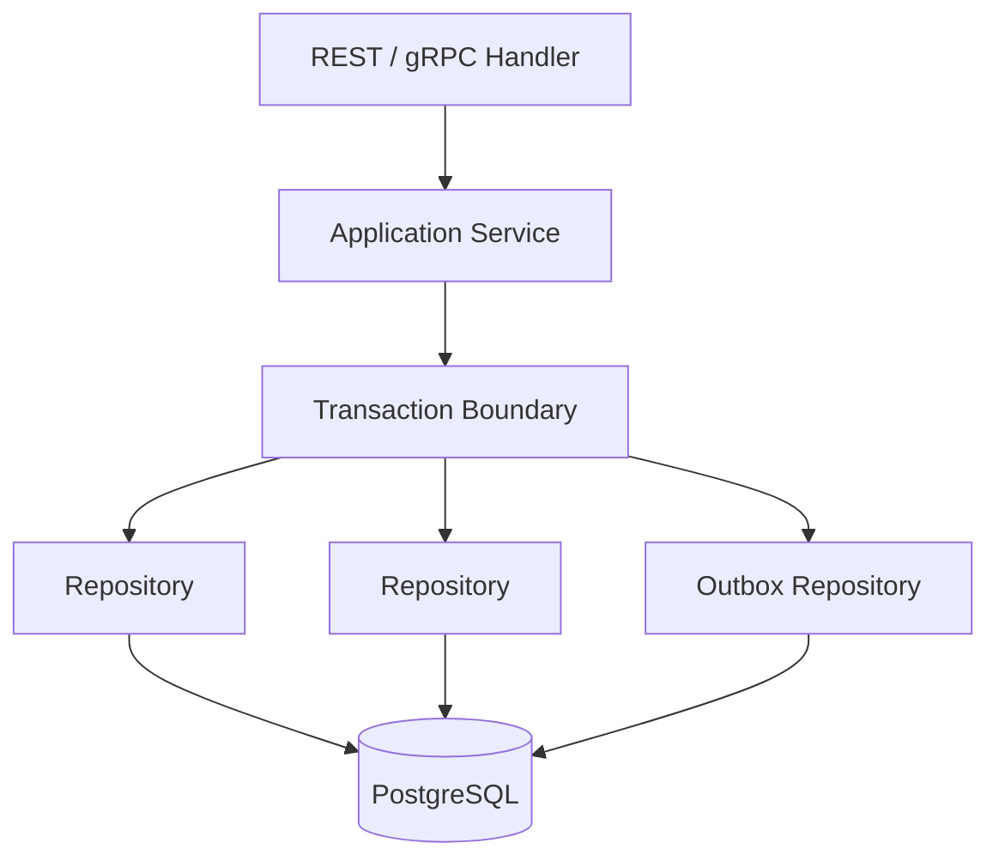

# 26- When to Use Transactions

## Overview

A database transaction should be used when multiple database operations must behave as one atomic unit or when concurrent access could otherwise violate a business invariant.

The important engineering question is not:

> "Should I put this code inside a transaction?"

It is:

> "Which operations must succeed or fail together, and what must remain true when concurrent requests execute?"

Transactions provide atomicity and consistency within their defined scope, but they also introduce costs:

- Locks may be held until commit.
- Connections remain occupied.
- Long transactions increase contention.
- Higher isolation can increase conflicts.
- Failed transactions may require retries.

Therefore, transactions should be **intentional, bounded, and aligned with business operations**.

## When a Transaction Is Required

A transaction is appropriate when two or more database changes must be committed atomically.

For example, transferring money requires:

```text
Debit account A
      +
Credit account B
      =
One atomic operation
```

The transaction guarantees that the database does not commit only one side.

```sql
BEGIN;

UPDATE accounts
SET balance = balance - 100
WHERE id = 1;

UPDATE accounts
SET balance = balance + 100
WHERE id = 2;

COMMIT;
```

If either operation fails:

```sql
ROLLBACK;
```

Both changes are discarded.

## The Atomicity Test

A simple test for deciding whether a transaction is needed is:

> If operation B fails after operation A succeeds, would the resulting database state be invalid?

If the answer is **yes**, the operations should normally be in the same transaction.

Examples:

| Operation | Transaction? | Reason |
|---|---:|---|
| Create order + order items | Yes | Order must not exist without required items |
| Debit + credit account | Yes | Both sides must commit together |
| Update order + insert outbox event | Yes | State and event must remain consistent |
| Update independent cache record | Usually no | No database atomicity requirement |
| Single `UPDATE` statement | Usually no explicit transaction needed | The statement is already atomic |
| Read-only query | Usually no | No state mutation |
| Update unrelated analytics record | Usually no | Usually not part of the business invariant |

The exact decision depends on the application's consistency requirements.

## Single Statements Are Already Atomic

A common mistake is assuming that every SQL statement needs an explicit application transaction.

For example:

```sql
UPDATE users
SET last_login_at = now()
WHERE id = 42;
```

Under normal database semantics, this statement executes atomically.

An explicit transaction becomes important when several operations must share one atomic outcome:

```sql
BEGIN;

UPDATE orders
SET status = 'PAID'
WHERE id = 1001;

INSERT INTO payments(order_id, status)
VALUES (1001, 'SUCCEEDED');

COMMIT;
```

The distinction is:

```text
One independent statement
    → database already provides statement atomicity

Multiple dependent statements
    → explicit transaction may be required
```

## Use Transactions Around Business Invariants

A transaction is most valuable when it protects a business invariant.

Examples:

```text
account balance >= 0

inventory quantity >= 0

order status transitions are valid

payment and order state agree

idempotency key is unique

parent and child records remain consistent
```

The transaction boundary should encompass the operations required to preserve that invariant.

## Example: Order Creation

An order creation operation may involve:

```text
Create order
Create order items
Reserve inventory
Create outbox event
```

If all of these local database changes must succeed together, use one transaction:

```python
from django.db import transaction


def create_order(customer_id: int, items: list[dict]):
    with transaction.atomic():
        order = Order.objects.create(
            customer_id=customer_id,
            status=Order.Status.PENDING,
        )

        for item in items:
            reserve_inventory(
                product_id=item["product_id"],
                quantity=item["quantity"],
            )

            OrderItem.objects.create(
                order=order,
                product_id=item["product_id"],
                quantity=item["quantity"],
            )

        OutboxEvent.objects.create(
            event_type="order.created",
            aggregate_id=str(order.id),
        )

    return order
```

The transaction ends after the required database state is durable.

## When Transactions Are Not Enough

A database transaction cannot automatically make external systems atomic.

Consider:

```text
BEGIN
    create order
    charge payment provider
    publish Kafka event
COMMIT
```

The payment provider and Kafka do not automatically participate in the PostgreSQL transaction.

Failures can produce states such as:

```text
PostgreSQL → rolled back
Payment     → charged
```

or:

```text
PostgreSQL → committed
Kafka       → publish failed
```

Therefore, transactions should generally cover the **local database state**, while distributed consistency requires additional patterns.

## Avoid External Calls Inside Transactions

Avoid:

```python
with transaction.atomic():
    order = create_order()

    payment_client.charge(order)

    notification_client.send(order)

    order.status = "PAID"
    order.save()
```

The transaction remains open while network calls execute.

Network calls can experience:

- Timeouts.
- Retries.
- Slow downstream services.
- Connection failures.
- Rate limiting.
- Partial failures.

Instead, persist the local state needed to continue the workflow:

```text
HTTP request
     │
     ▼
Short DB transaction
 ├── create order
 ├── create payment intent/state
 └── create outbox event
     │
     ▼
COMMIT
     │
     ▼
Worker / downstream processing
     │
     ▼
External service
```

This keeps database transactions short and makes failure recovery explicit.

## Transactions and Concurrency

Transactions are also required when concurrent requests can interfere with each other.

Consider inventory:

```text
Inventory = 1

Request A → reads 1
Request B → reads 1

Request A → reserves 1
Request B → reserves 1
```

Without appropriate concurrency control, both requests may believe they successfully reserved the same item.

A transaction combined with an atomic update can solve this:

```sql
UPDATE inventory
SET available_quantity = available_quantity - 1
WHERE product_id = $1
  AND available_quantity > 0;
```

Then:

```text
affected rows = 1
    → reservation succeeded

affected rows = 0
    → reservation failed
```

The transaction is useful because the business operation may include additional related database changes.

## Transaction + Row Locking

When business logic requires reading current state before deciding what to write, row-level locking may be appropriate.

```sql
BEGIN;

SELECT id, balance
FROM accounts
WHERE id = $1
FOR UPDATE;

-- Validate and modify the current state.

UPDATE accounts
SET balance = balance - $2
WHERE id = $1;

COMMIT;
```

The lock prevents conflicting modifications to the selected row while the transaction is active.

This is useful for:

- Account transfers.
- Inventory reservation.
- Job claiming.
- State transitions.
- Resource allocation.

However, locking should be targeted rather than applied indiscriminately.

## Transaction + Optimistic Concurrency

Transactions are not the only way to handle concurrent updates.

For low-contention resources, optimistic concurrency can detect conflicts:

```sql
UPDATE documents
SET content = $1,
    version = version + 1
WHERE id = $2
  AND version = $3;
```

If zero rows are updated:

```text
another transaction changed the document
```

The application can return a conflict or retry according to business rules.

Transactions and optimistic concurrency can coexist; they solve different parts of the problem.

## Use Constraints Instead of Transactions When Appropriate

Some invariants are better enforced with database constraints.

For uniqueness:

```sql
CREATE UNIQUE INDEX users_email_unique
ON users (lower(email));
```

Do not rely exclusively on:

```text
SELECT
  ↓
if not found
  ↓
INSERT
```

Two concurrent requests can both observe that the value does not exist.

The database constraint provides authoritative enforcement.

Transactions can still be used around the broader operation, but the uniqueness invariant itself belongs in the database constraint.

## Use Atomic SQL Instead of a Transaction When Appropriate

A simple conditional state transition may not require multiple statements.

Instead of:

```text
BEGIN
SELECT balance
application calculation
UPDATE balance
COMMIT
```

use:

```sql
UPDATE accounts
SET balance = balance - $2
WHERE id = $1
  AND balance >= $2;
```

The database evaluates the condition and update as one atomic statement.

This can reduce:

- Round trips.
- Lock duration.
- Application complexity.
- Race-condition opportunities.

The broader operation may still require a transaction if additional writes must commit with it.

## Transaction Boundaries in Django

Django's `transaction.atomic()` is the standard mechanism for explicitly defining transaction scope.

```python
from django.db import transaction


def process_payment(order_id: int):
    with transaction.atomic():
        order = (
            Order.objects
            .select_for_update()
            .get(pk=order_id)
        )

        if order.status != Order.Status.PENDING:
            raise InvalidOrderState

        order.status = Order.Status.PAID
        order.save(update_fields=["status"])

        Payment.objects.create(
            order=order,
            status=Payment.Status.SUCCEEDED,
        )
```

The transaction boundary is clear:

```text
enter atomic block
      ↓
read current state
      ↓
validate
      ↓
write related state
      ↓
exit atomic block
      ↓
commit
```

If an exception causes the transaction to roll back, neither database change is committed.

## Django Nested Transactions

Nested `transaction.atomic()` blocks generally create savepoints when already inside an outer transaction.

For example:

```python
with transaction.atomic():
    create_order()

    try:
        with transaction.atomic():
            create_optional_record()
    except SomeError:
        pass

    finalize_order()
```

The inner block can roll back to a savepoint without necessarily rolling back the entire outer transaction.

This is useful for partial recovery, but it does not mean the inner operation is independently committed.

The outer transaction still controls the final commit.

## FastAPI and SQLAlchemy

With SQLAlchemy, transaction ownership should be explicit:

```python
def create_order(db: Session, payload: OrderRequest):
    with db.begin():
        order = create_order_record(db, payload)

        reserve_inventory(
            db,
            product_id=payload.product_id,
            quantity=payload.quantity,
        )

        create_outbox_event(db, order)

    return order
```

The service operation owns the transaction because it understands which operations must commit together.

Avoid hiding transaction ownership inside individual repository methods when those methods need to participate in larger business operations.

## Transaction Boundaries and Service Architecture

A useful backend architecture is:



The service layer understands the business operation.

Repositories should generally focus on data access rather than deciding independently when the overall business operation commits.

This makes transaction scope easier to reason about.

## When Not to Use a Transaction

Do not introduce an explicit transaction merely because a database query exists.

### Independent Read Operations

A simple read-only API endpoint usually does not need an explicit transaction:

```python
def get_user(user_id: int):
    return User.objects.get(pk=user_id)
```

If multiple reads require a consistent snapshot, however, an explicit transaction with appropriate isolation may be justified.

### Independent Writes

If two writes are genuinely independent:

```text
update user profile
+
record analytics event
```

they may not belong in the same transaction.

Making unrelated writes atomic can unnecessarily increase transaction duration and coupling.

### Long-Running Processing

Avoid:

```text
BEGIN
process 100,000 records
COMMIT
```

for operations that can safely be broken into smaller units.

Large transactions can cause:

- Large rollback cost.
- Long lock duration.
- Connection occupation.
- Increased replication lag.
- MVCC cleanup pressure.

Batch processing is often preferable:

```text
transaction 1 → batch 1
transaction 2 → batch 2
transaction 3 → batch 3
...
```

The correct batch size depends on workload and consistency requirements.

## When a Long Transaction May Be Justified

Long transactions are not automatically incorrect.

They may be appropriate when the operation genuinely requires one consistent snapshot or atomic outcome.

Examples include:

- Carefully designed financial operations.
- Complex data migrations.
- Consistent bulk state transitions.

Even then, evaluate:

- Lock duration.
- Transaction size.
- Rollback cost.
- Replication impact.
- Vacuum/MVCC implications in PostgreSQL.
- Connection pool pressure.
- Failure recovery.

Correctness requirements should justify the duration.

## Transactions and Background Jobs

Celery workers and other background workers should use the same transaction principles as HTTP requests.

A job should generally follow:

```text
Receive job
    ↓
Begin short transaction
    ↓
Claim/update state
    ↓
Commit
    ↓
Perform external work
    ↓
Begin another short transaction
    ↓
Record result
    ↓
Commit
```

Do not hold a database transaction open for the entire duration of a potentially long-running background job.

## Transactions and Kafka

A common pattern is:

```text
BEGIN
    update business state
    insert outbox event
COMMIT
```

Then:

```text
Outbox worker
     ↓
Kafka
     ↓
Consumer
```

The outbox event is part of the same database transaction as the business state.

This avoids the problematic sequence:

```text
UPDATE database
COMMIT
      ↓
publish Kafka
      ↓
failure
```

where the database is committed but the event is lost.

## Transaction and Idempotency

If an API request can be retried, transaction design should account for duplicate requests.

For example:

```text
POST /orders
Idempotency-Key: abc123
```

A unique constraint can protect the operation:

```sql
CREATE UNIQUE INDEX orders_idempotency_key_unique
ON orders (idempotency_key);
```

The transaction can then atomically create the order and associated records.

This is especially important when clients, API gateways, or service-to-service calls may retry requests after timeouts.

## Transaction and Distributed Systems

A PostgreSQL transaction does not span arbitrary services.

This architecture:

```text
Service A
   │
   ├── PostgreSQL
   │
   └── Service B
          │
          └── PostgreSQL
```

cannot be made atomic merely by wrapping Service A's database code in `BEGIN` and `COMMIT`.

For distributed workflows, consider:

- Transactional outbox.
- Saga orchestration.
- Saga choreography.
- Compensation.
- Idempotent consumers.
- Durable workflow engines.

The transaction boundary should normally remain local to the database it controls.

## Choosing the Transaction Scope

A useful decision process is:

```text
What business operation is being performed?
              ↓
Which state must change atomically?
              ↓
Which reads must be consistent with those writes?
              ↓
What concurrency can occur?
              ↓
Can a constraint or atomic SQL statement solve it?
              ↓
Is locking required?
              ↓
What isolation level is required?
              ↓
Can the operation be retried safely?
              ↓
Define the smallest practical transaction
```

This process prevents both under-transactional and over-transactional designs.

## Transaction Duration

Transaction duration should be treated as a production metric.

For example:

```text
5 ms transaction
    → usually easy to scale

500 ms transaction
    → investigate workload and lock behavior

10 second transaction
    → likely requires strong justification
```

There is no universal threshold, but longer transactions increase the opportunity for contention and failure.

Measure real workload behavior instead of relying on arbitrary numbers.

## Monitoring

Important metrics include:

| Metric | Why it matters |
|---|---|
| Transaction duration | Detects overly large transaction scopes |
| Lock wait duration | Detects contention |
| Deadlock count | Detects conflicting locking patterns |
| Serialization failures | Indicates concurrent transaction conflicts |
| Rollback rate | Detects transaction instability |
| Connection pool usage | Shows transaction resource pressure |
| Long-running transactions | Indicates potentially harmful transaction scope |

PostgreSQL can be inspected using:

```sql
SELECT
    pid,
    state,
    xact_start,
    query_start,
    wait_event_type,
    wait_event,
    query
FROM pg_stat_activity
WHERE xact_start IS NOT NULL
ORDER BY xact_start;
```

Transaction behavior should be correlated with API latency, database CPU, connection pool saturation, and traffic volume.

## Performance and Scalability

Transactions consume database resources.

A simplified model is:

```text
Longer transaction
       ↓
Longer lock lifetime
       ↓
More waiting
       ↓
Lower concurrency
       ↓
Higher latency
```

At scale, transaction design can become a throughput bottleneck even when individual SQL queries are fast.

Optimize:

- Transaction duration.
- Number of statements.
- Number of locked rows.
- Query execution time.
- Lock acquisition order.
- Index usage.
- Connection pool utilization.
- Retry frequency.

Do not assume adding more Kubernetes pods will solve a database contention problem.

If all pods contend for the same database row, more pods may increase contention rather than throughput.

## Security Considerations

Transactions do not replace authorization.

For security-sensitive updates, validate ownership and state against authoritative database data.

For example:

```sql
UPDATE documents
SET status = 'APPROVED'
WHERE id = $1
  AND owner_id = $2
  AND status = 'PENDING';
```

This combines:

- Resource identity.
- Authorization condition.
- Valid state transition.

For sensitive operations:

- Use parameterized queries.
- Enforce database constraints.
- Avoid logging secrets.
- Use least-privilege database credentials.
- Do not rely on stale Redis data for critical authorization decisions.
- Keep security-sensitive state changes atomic where required.

## High Availability and Disaster Recovery

Transactions provide atomicity, not disaster recovery.

A committed transaction can still be affected by:

- Database instance failure.
- Storage failure.
- Regional outage.
- Replication problems.
- Application-level data corruption.

Production systems should separately consider:

- Automated backups.
- Point-in-time recovery.
- Replication.
- Multi-AZ deployment.
- Failover behavior.
- Recovery Point Objective (RPO).
- Recovery Time Objective (RTO).

Do not confuse:

```text
Transaction durability
```

with:

```text
Disaster recovery
```

They solve different problems.

## Common Mistakes

### Wrapping Everything in One Transaction

This creates unnecessarily large transaction boundaries.

**Better:** include only operations that must be atomic.

### Treating a Request as a Transaction

A request can contain multiple independent operations and external calls.

**Better:** define the transaction around the business invariant.

### Calling External Services Inside a Transaction

This increases transaction duration and introduces unpredictable network latency.

**Better:** persist durable local state and coordinate external processing separately.

### Relying Only on Application Validation

Application checks can race under concurrency.

**Better:** enforce important invariants with database constraints and atomic operations.

### Using Transactions Instead of Atomic SQL

A simple conditional update may not need multiple statements.

**Better:** use a single atomic statement when it naturally expresses the invariant.

### Locking Every Query

Excessive locks reduce concurrency and can create deadlocks.

**Better:** lock only the resources required to protect the invariant.

### Holding a Transaction During Batch Processing

Large transactions increase rollback cost and resource usage.

**Better:** process independent batches in separate transactions when business semantics permit.

### Hidden Transaction Ownership

If repository methods independently start and commit transactions, composing them into a larger atomic operation becomes difficult.

**Better:** establish transaction ownership at a clear application/service boundary.

### Assuming Transactions Span Microservices

A PostgreSQL transaction does not automatically include Kafka, Redis, payment providers, or another service's database.

**Better:** use distributed-systems patterns when cross-service consistency is required.

### Ignoring Retry Behavior

Transactions can fail because of deadlocks or serialization conflicts.

**Better:** design bounded retries for known transient failures.

## Production Checklist

Before introducing a transaction, ask:

- [ ] What business invariant does it protect?
- [ ] Which operations must commit atomically?
- [ ] Can the invariant be enforced with a database constraint?
- [ ] Can the operation be expressed as atomic SQL?
- [ ] Which reads must occur inside the transaction?
- [ ] Is explicit locking required?
- [ ] Is the isolation level appropriate?
- [ ] Is the transaction as short as practical?
- [ ] Are external network calls outside the transaction?
- [ ] Can concurrent requests cause lost updates?
- [ ] Can deadlocks or serialization failures occur?
- [ ] Is retry behavior defined?
- [ ] Is the operation idempotent?
- [ ] What happens if the client times out after commit?
- [ ] Are transaction duration and lock waits monitored?
- [ ] Does the design remain correct across multiple application instances?
- [ ] If multiple services are involved, is a distributed consistency pattern required?

## Interview Traps

### When Should You Use a Transaction?

When multiple database operations must commit or roll back together, or when transaction-level consistency is required to protect a business invariant.

### Should Every SQL Query Be Inside a Transaction?

No. Individual statements already have atomic execution semantics, and many simple reads or independent writes do not require an explicit multi-statement transaction.

### Why Should Transactions Be Short?

Short transactions reduce lock duration, connection usage, contention, rollback cost, and the probability of concurrency conflicts.

### Should External API Calls Happen Inside a Transaction?

Usually no. They can hold database resources while waiting on unpredictable network operations and cannot automatically participate in the database's atomic commit.

### How Do You Decide Transaction Scope?

Identify the business operation, determine which state must change atomically, identify the relevant concurrency hazards, and define the smallest transaction that preserves the required invariant.

### Can a Transaction Prevent Lost Updates?

Not automatically. The result depends on isolation, locking, atomic SQL, and how the application performs read-modify-write operations.

### Can a Transaction Span Two Microservices?

Not automatically. Separate databases and external systems require distributed consistency patterns such as outbox, saga, or workflow orchestration.

### What Is Better: A Transaction or an Atomic SQL Statement?

Neither is universally better. If one statement can safely enforce the invariant, atomic SQL is often simpler and more efficient. Use a transaction when multiple operations must share one atomic outcome.

## Key Takeaways

- **Use transactions when multiple database operations must succeed or fail together or when transaction-level consistency is required to protect a business invariant.**
- **Keep transaction boundaries as small as practical: avoid external calls, user interaction, and long-running processing while a transaction is open.**
- **Before introducing stronger transactional mechanisms, consider database constraints, atomic SQL, optimistic concurrency, and targeted row locking.**
- **Transactions provide atomicity within their database boundary; distributed workflows require additional patterns such as transactional outbox, idempotency, and sagas.**
- **A production transaction design must account for concurrency, retries, transaction duration, observability, failure after commit, and scalability.**