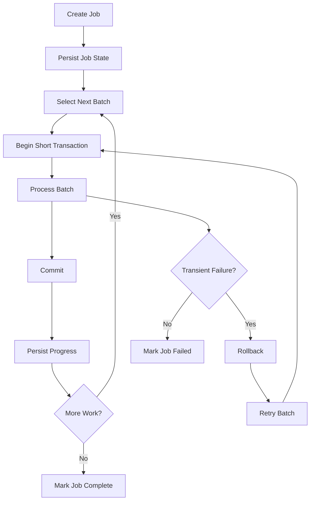

# 27- When Not to Use Large Transactions

## Overview

Large transactions are transactions that hold a substantial amount of work, rows, locks, or database state before committing.

A large transaction is not necessarily incorrect. The problem is that transaction size increases the amount of database state that must remain consistent for longer, which can negatively affect concurrency, performance, recovery, replication, and operational stability.

A transaction can become "large" because of:

- Large numbers of rows modified.
- Large numbers of SQL statements.
- Long execution time.
- Large intermediate changes.
- Extensive lock ownership.
- Large rollback requirements.
- Bulk processing performed inside one transaction.
- Slow application logic executed while the transaction is open.

The practical rule is:

> Use one transaction when atomicity requires one transaction. Do not make unrelated or independently recoverable work transactional merely for convenience.

The goal is to find the smallest transaction that preserves the required business invariant.

## What Makes a Transaction Large?

Transaction size has multiple dimensions.

| Dimension | Example | Risk |
|---|---|---|
| Duration | Transaction remains open for 30 seconds | Long lock and snapshot lifetime |
| Rows | Updating millions of rows | Large write and rollback workload |
| Statements | Thousands of dependent statements | Higher execution time |
| Locks | Thousands of rows locked | Increased contention |
| Data volume | Large `INSERT`/`UPDATE`/`DELETE` | I/O and WAL pressure |
| Application work | CPU/network processing inside transaction | Unpredictable transaction duration |
| Retry scope | Large operation retried after failure | Expensive repeated work |

A transaction that modifies 10,000 rows in 100 ms may have different operational characteristics from one that modifies 10 rows while waiting on a network service for 10 seconds.

Therefore, transaction **duration and resource footprint** both matter.

## Why Large Transactions Are Dangerous

A large transaction creates a larger blast radius when something goes wrong.

```text
Large transaction
      │
      ├── more rows changed
      ├── more locks held
      ├── more WAL generated
      ├── longer execution
      ├── larger rollback
      └── more contention
              │
              ▼
       lower concurrency
```

Potential consequences include:

- Lock contention.
- Deadlocks.
- Long-running queries.
- Connection pool exhaustion.
- Increased transaction latency.
- Larger rollback cost.
- Replication lag.
- MVCC cleanup delays.
- Increased database I/O.
- More expensive retries.

## The Transaction Duration Problem

Consider:

```text
BEGIN
   update row
   process 50,000 records
   call external service
   generate report
   update more rows
COMMIT
```

The first database row may remain locked for the entire operation.

If the operation takes 30 seconds:

```text
lock acquired
     │
     ├──────────── 30 seconds ────────────┐
     │                                    │
     ▼                                    ▼
other transactions wait               COMMIT
```

This can cause unrelated requests to experience latency even if their own SQL queries are fast.

## Large Transactions and PostgreSQL MVCC

PostgreSQL uses Multi-Version Concurrency Control (MVCC).

Updates generally create new row versions rather than simply overwriting existing versions in place.

Long-running transactions can prevent PostgreSQL from removing row versions that may still be visible to those transactions.

Conceptually:

```text
Transaction starts
      ↓
snapshot established
      ↓
other transactions update rows
      ↓
old row versions remain potentially visible
      ↓
cleanup may be restricted
```

This is one reason long-running transactions should be monitored carefully.

Large transactions are therefore not only about locks. They can also affect storage maintenance and MVCC behavior.

## Large Transactions and Locks

Locks can remain held until the transaction completes, depending on the lock type and operation.

For example:

```sql
BEGIN;

SELECT *
FROM inventory
WHERE product_id = 42
FOR UPDATE;

-- Large amount of work

COMMIT;
```

The row lock remains relevant for the transaction's lifetime.

If another request needs the same row:

```text
Request A
   │
   └── holds row lock
           │
           ▼
Request B
   │
   └── waits
```

Large transactions therefore increase the window during which other transactions may be blocked.

## Large Transactions and Connection Pools

A transaction normally occupies a database connection while it is active.

Suppose:

```text
Connection pool = 20
```

and 20 requests each hold transactions for several seconds:

```text
20 connections
    ↓
all occupied by transactions
    ↓
new requests wait for connections
```

The application can experience request failures even though PostgreSQL itself still has capacity.

This is particularly important in:

- Django.
- FastAPI + SQLAlchemy.
- Celery workers.
- Kubernetes deployments.

Scaling application pods without considering the database connection budget can make this worse.

## Large Transactions and Rollback Cost

A failed transaction may need to undo a substantial amount of work.

For example:

```text
BEGIN
  update 2 million rows
  ...
  operation fails
ROLLBACK
```

The database still needs to process the transaction's consequences.

Large rollback operations can consume:

- CPU.
- I/O.
- WAL resources.
- Connection time.

This increases recovery time and can create additional pressure during an already unhealthy situation.

## Large Transactions and Replication

Large write transactions can generate significant WAL activity in PostgreSQL.

A large transaction may produce:

```text
Application
    ↓
large transaction
    ↓
large WAL volume
    ↓
primary
    ↓
replica replay
    ↓
replication lag
```

Replica lag can affect:

- Read scaling.
- Read-after-write behavior.
- Reporting queries.
- Failover readiness.
- Recovery objectives.

A single enormous transaction can also make replication behavior less predictable because downstream replay may have to process a large unit of work.

## Large Transactions and Retry Cost

Suppose a transaction takes 20 seconds and fails because of a serialization conflict near the end.

A retry may require another 20 seconds.

```text
Attempt 1
   └── 20 seconds
          ↓
serialization failure
          ↓
backoff
          ↓
Attempt 2
   └── 20 seconds
```

Large transactions therefore make retry-based concurrency strategies more expensive.

For operations that are expected to encounter conflicts, reducing transaction scope can substantially improve recovery behavior.

## When Large Transactions Are Appropriate

Large transactions should not be avoided categorically.

They can be appropriate when atomicity genuinely requires the entire operation.

Examples include:

- Carefully designed schema/data migrations.
- Bulk state transitions where partial completion is unacceptable.
- Financial operations requiring one atomic outcome.
- Operations where all modified rows form one indivisible business unit.

Even then, evaluate:

- Transaction duration.
- Lock scope.
- Database load.
- Rollback behavior.
- Replication impact.
- Maintenance implications.
- Availability requirements.

The question is not:

> "Is this transaction large?"

It is:

> "Does the required atomicity justify its size?"

## When to Split a Large Transaction

Split a transaction when the work consists of independently recoverable units.

For example:

```text
100,000 records
       ↓
Can records be processed independently?
       │
      Yes
       ↓
Process batches
       ↓
Transaction per batch
```

Instead of:

```text
BEGIN
  process 100,000 records
COMMIT
```

use:

```text
BEGIN
  process records 1–1,000
COMMIT

BEGIN
  process records 1,001–2,000
COMMIT

...
```

This reduces the failure and lock scope.

## Batch Processing

Batch processing is one of the most common alternatives to large transactions.

Example:

```python
BATCH_SIZE = 1_000

for batch in load_batches(batch_size=BATCH_SIZE):
    with transaction.atomic():
        process_batch(batch)
```

The exact batch size should be determined empirically.

Factors include:

- Row size.
- Number of indexes.
- Query complexity.
- Lock contention.
- WAL generation.
- Database capacity.
- Replication latency.

Do not assume that a fixed batch size such as 1,000 is universally optimal.

## Batch Processing Trade-Offs

| One Large Transaction | Batched Transactions |
|---|---|
| Strong all-or-nothing scope | Partial progress possible |
| Simple rollback semantics | More complex recovery |
| Large lock footprint | Smaller lock footprint |
| Large rollback cost | Smaller rollback cost |
| Potentially high replication impact | More incremental replication |
| Failure can discard all work | Failed batch can be retried |
| Long connection usage | Shorter connection usage |
| Simple implementation | Requires checkpointing/idempotency |

Splitting transactions changes semantics.

If the entire operation truly must be atomic, batching is not automatically equivalent.

## Checkpointing

For long-running processing, persist progress.

Example:

```text
Job
 ├── status
 ├── last_processed_id
 └── processed_count
```

A worker can process:

```text
batch 1 → commit → checkpoint
batch 2 → commit → checkpoint
batch 3 → commit → checkpoint
```

If the worker crashes:

```text
restart
   ↓
read checkpoint
   ↓
resume from last safe position
```

This avoids restarting the entire operation.

Checkpointing must itself be designed carefully so that the checkpoint cannot advance beyond work that was actually committed.

## Keyset Pagination for Batch Work

For large datasets, avoid repeatedly using large offsets:

```sql
SELECT id
FROM records
ORDER BY id
LIMIT 1000 OFFSET 500000;
```

Large offsets can become increasingly expensive.

Keyset pagination is often better:

```sql
SELECT id
FROM records
WHERE id > $1
ORDER BY id
LIMIT 1000;
```

The worker maintains:

```text
last_processed_id
```

and uses it as the next batch boundary.

This is especially useful for large maintenance jobs and background processing.

## Updating Large Datasets

Avoid blindly performing:

```sql
UPDATE orders
SET status = 'ARCHIVED';
```

when millions of rows are affected and the operation does not need to be one atomic transaction.

Depending on requirements, process the dataset in controlled batches.

For example:

```sql
UPDATE orders
SET status = 'ARCHIVED'
WHERE id > $1
  AND id <= $2
  AND status = 'COMPLETED';
```

Each batch can be committed independently if partial progress is acceptable.

## Deleting Large Datasets

Large deletes can be particularly disruptive.

Instead of:

```sql
DELETE FROM audit_logs
WHERE created_at < now() - interval '2 years';
```

on a very large table, consider:

- Batch deletes.
- Time-based partitioning.
- Dropping old partitions where appropriate.
- Scheduled maintenance.
- Archival strategies.

For very large time-series or audit datasets, partitioning can often be more operationally efficient than repeatedly deleting huge numbers of rows.

## Partitioning as an Alternative

Suppose audit data is partitioned by month:

```text
audit_logs
├── 2026-01
├── 2026-02
├── 2026-03
└── ...
```

Removing an entire old partition can be significantly more efficient than deleting millions of rows individually.

The appropriate approach depends on:

- Query patterns.
- Retention policy.
- Partition design.
- Operational requirements.
- Database version and capabilities.

Partitioning should solve a real lifecycle or performance problem rather than being introduced solely to avoid large transactions.

## Large Transactions in Data Migrations

Data migrations require special care.

A migration such as:

```text
alter schema
+
update millions of rows
+
create indexes
```

can create substantial operational impact.

Prefer migration strategies that minimize:

- Lock duration.
- Table rewrites.
- Long-running transactions.
- Deployment blocking.

For large production datasets, consider:

```text
schema change
    ↓
deploy compatible application
    ↓
backfill in batches
    ↓
validate
    ↓
remove old structure later
```

This is often safer than trying to perform the entire migration in one deployment transaction.

## Django Migration Considerations

Django migrations can run inside transactions depending on the database and migration configuration.

For large data migrations, understand whether the migration is transactional before executing a large backfill.

A large operation such as:

```python
def forwards(apps, schema_editor):
    Model = apps.get_model("orders", "Order")

    for order in Model.objects.all():
        order.status = calculate_status(order)
        order.save(update_fields=["status"])
```

can be problematic if millions of rows are processed in one transaction.

For large production datasets, use controlled batching and an appropriate migration strategy.

If a migration intentionally needs non-atomic behavior, Django supports migration-level control such as:

```python
class Migration(migrations.Migration):
    atomic = False

    operations = [
        # Carefully designed operations.
    ]
```

This changes failure semantics, so it should only be used with a deliberate recovery plan.

## Large Transactions in Celery

Background workers are often a better place for long-running processing, but moving work to Celery does not automatically make a transaction safe.

Avoid:

```python
@shared_task
def process_all_orders():
    with transaction.atomic():
        for order in Order.objects.all():
            process(order)
```

Instead:

```python
@shared_task
def process_order_batch(order_ids: list[int]):
    with transaction.atomic():
        for order_id in order_ids:
            process_order(order_id)
```

Then schedule multiple bounded jobs.

Each task should be:

- Retryable.
- Idempotent where possible.
- Bounded in runtime.
- Observable.
- Safe to resume after failure.

## Large Transactions and Kubernetes

Kubernetes can restart pods because of:

- Deployments.
- Resource pressure.
- Node failures.
- Health-check failures.
- Evictions.

A long-running transaction inside a pod may therefore be interrupted.

For long-running processing:

```text
Kubernetes Pod
      ↓
Celery worker
      ↓
small transaction
      ↓
commit
      ↓
next batch
```

is generally more resilient than:

```text
Kubernetes Pod
      ↓
30-minute transaction
      ↓
pod restart
      ↓
large rollback
```

Long-running jobs should be designed for interruption and recovery.

## Large Transactions and HTTP APIs

Avoid making synchronous HTTP requests perform enormous database transactions.

Bad:

```text
POST /rebuild-index
       ↓
HTTP request
       ↓
BEGIN
       ↓
process millions of rows
       ↓
COMMIT
       ↓
HTTP response
```

The client may timeout before the database finishes.

Prefer:

```text
POST /rebuild-index
       ↓
create job
       ↓
return 202 Accepted
       ↓
Celery / worker
       ↓
process batches
       ↓
persist progress
```

The API becomes responsive while the long-running operation is handled asynchronously.

## Idempotency and Batching

Once a large operation is split into batches, retries become easier if each batch is idempotent.

For example:

```sql
UPDATE orders
SET status = 'ARCHIVED'
WHERE id >= $1
  AND id < $2
  AND status = 'COMPLETED';
```

Running the same batch again does not necessarily produce an additional state transition.

For more complex operations, use:

- Stable job IDs.
- Batch IDs.
- Unique constraints.
- Processing state.
- Deduplication records.

## When Batching Is Unsafe

Do not split a transaction when intermediate committed states would violate a business invariant.

For example:

```text
debit account A
commit

credit account B
commit
```

is not equivalent to:

```text
debit + credit
within one transaction
```

If the system can observe the state between those commits, the invariant may be violated.

The correct solution may require:

- One transaction.
- A different data model.
- An intermediate state.
- A workflow/state machine.
- Compensation.
- A saga.

Batching is an architectural decision, not just a performance optimization.

## Large Transactions and External Systems

Large transactions become especially problematic when external operations are involved.

Avoid:

```text
BEGIN
  update 10,000 records
  call external API
  update more records
COMMIT
```

External systems can be slow or unavailable.

Instead, persist durable local state:

```text
Database
  ↓
commit work to be processed
  ↓
queue/outbox
  ↓
worker
  ↓
external service
```

This keeps the database transaction independent from external latency.

## Observability

Large transactions should be visible in production.

Monitor:

| Metric | Purpose |
|---|---|
| Transaction duration | Detect long-running transactions |
| Rows affected | Identify unusually large operations |
| Lock wait time | Detect contention |
| Deadlocks | Detect conflicting transaction patterns |
| Rollback duration | Identify expensive failures |
| WAL generation | Detect heavy write transactions |
| Replication lag | Detect downstream impact |
| Connection utilization | Detect pool pressure |
| Batch duration | Tune batch size |
| Retry count | Detect unstable operations |

PostgreSQL activity can be inspected using:

```sql
SELECT
    pid,
    usename,
    state,
    xact_start,
    query_start,
    wait_event_type,
    wait_event,
    query
FROM pg_stat_activity
WHERE xact_start IS NOT NULL
ORDER BY xact_start;
```

Long-running transactions should be correlated with:

- API latency.
- Database CPU.
- I/O.
- Lock waits.
- Replica lag.
- Application connection pool usage.

## Operational Guardrails

Production systems should consider guardrails for large operations.

Examples include:

- Maximum job runtime.
- Batch-size limits.
- Statement timeouts.
- Lock timeouts.
- Worker concurrency limits.
- Rate-limited backfills.
- Maintenance windows.
- Progress checkpoints.
- Kill/recovery procedures.

For example, PostgreSQL supports transaction-local settings:

```sql
BEGIN;

SET LOCAL lock_timeout = '2s';
SET LOCAL statement_timeout = '30s';

-- Controlled work

COMMIT;
```

These values should be selected according to workload and failure semantics rather than copied blindly.

## Large Transactions and Cost

Large transactions can increase infrastructure costs indirectly.

Potential effects include:

```text
larger transaction
      ↓
more database CPU
      ↓
more I/O
      ↓
more WAL
      ↓
replication pressure
      ↓
larger compute/storage requirements
```

They can also require larger worker pools or longer-running instances.

Batching can improve resource utilization, but excessive batching overhead can also reduce throughput.

Measure the total system cost rather than optimizing only database execution time.

## Reliability Strategy

A reliable large-data workflow often looks like:



This provides:

- Bounded transactions.
- Recoverable progress.
- Smaller rollback scope.
- Better observability.
- Easier retry behavior.

## Common Mistakes

### Putting an Entire Dataset in One Transaction

Processing millions of records in one transaction can create excessive locks, WAL, rollback cost, and transaction duration.

**Better:** batch the work when partial progress is acceptable.

### Assuming Batching Is Always Better

Batching changes atomicity.

**Better:** verify that intermediate committed states are acceptable before splitting the transaction.

### Calling External APIs Inside Large Transactions

This combines unpredictable network latency with database resource retention.

**Better:** use durable state, queues, or transactional outbox patterns.

### Using Large `OFFSET` Values for Backfills

Large offsets can become inefficient as the dataset grows.

**Better:** use keyset pagination or a stable primary-key range.

### Ignoring Replication Lag

A large write transaction can generate substantial WAL and affect replicas.

**Better:** monitor replica lag during bulk operations and throttle work when necessary.

### Running Large Backfills During Peak Traffic

Even correct SQL can compete with production traffic for database resources.

**Better:** schedule, throttle, and observe backfills.

### Retrying the Entire Huge Transaction

A failed 20-minute transaction can make recovery expensive.

**Better:** make independently recoverable units small enough to retry safely.

### Holding Locks While Performing Application Work

CPU-heavy processing inside a transaction unnecessarily extends lock duration.

**Better:** perform non-database work outside the transaction whenever correctness permits.

### No Progress Tracking

If a worker crashes after several hours, the entire operation may restart from the beginning.

**Better:** persist durable checkpoints or process independently identifiable batches.

### Assuming a Background Worker Eliminates Transaction Problems

Celery moves execution out of the request path but does not change database transaction semantics.

**Better:** design transaction scope, retries, locking, and idempotency explicitly.

## Interview Traps

### Are Large Transactions Always Bad?

No. They are appropriate when the entire operation genuinely requires atomicity. The problem is unnecessary transaction size, not transaction size itself.

### Why Are Long Transactions Dangerous in PostgreSQL?

They can hold locks longer, occupy connections, increase contention, and keep older MVCC row versions potentially visible for longer.

### Why Batch Large Updates?

Batching reduces transaction duration, lock footprint, rollback scope, and operational impact, provided partial commits are acceptable.

### Why Can Batching Change Correctness?

A single transaction provides all-or-nothing semantics. Multiple batch transactions expose intermediate committed states.

### Why Use Keyset Pagination for Backfills?

It avoids the increasingly expensive offset scanning that can occur with large `OFFSET` values and provides a stable progression through the dataset.

### Should Large Transactions Be Retried?

Sometimes, but retrying a very large transaction can be expensive. Reducing transaction size often makes transient failures cheaper to recover from.

### Why Avoid Network Calls Inside Large Transactions?

Network latency is unpredictable and can cause database locks and connections to remain occupied for the duration of the call.

### How Would You Process 100 Million Rows Safely?

Use a background job, stable batching/keyset pagination, short transactions, checkpointing, controlled concurrency, observability, throttling, and an explicit recovery strategy.

### Would You Split a Financial Transfer Into Two Transactions?

Normally no if the debit and credit must be atomic. Splitting them would expose an invalid intermediate state unless the domain is redesigned around a different consistency model.

## Production Checklist

Before executing a large database operation, verify:

- [ ] Does the entire operation actually need to be atomic?
- [ ] Can it be divided into independently recoverable batches?
- [ ] Are intermediate committed states acceptable?
- [ ] Is the transaction duration bounded?
- [ ] Is the number of modified rows bounded?
- [ ] Is lock scope understood?
- [ ] Are external calls outside the transaction?
- [ ] Is keyset pagination preferable to large offsets?
- [ ] Is progress/checkpoint state persisted?
- [ ] Are batches idempotent or safely retryable?
- [ ] Are database constraints still protecting invariants?
- [ ] Has replication impact been considered?
- [ ] Has connection pool usage been considered?
- [ ] Are deadlocks and serialization failures handled?
- [ ] Are statement and lock timeouts appropriate?
- [ ] Is the operation throttled during peak traffic?
- [ ] Are transaction duration and lock waits monitored?
- [ ] Is rollback/recovery behavior understood?
- [ ] Is there a safe way to stop and resume the operation?

## Key Takeaways

- **Large transactions are not inherently wrong; they are dangerous when their size or duration exceeds what the required atomicity justifies.**
- **When work can be independently committed, use bounded batches, short transactions, and durable progress tracking to reduce lock, rollback, and recovery costs.**
- **Large transactions can affect PostgreSQL MVCC cleanup, connection pools, WAL generation, replication lag, lock contention, and overall database throughput.**
- **Never split a transaction merely for performance if doing so exposes an invalid intermediate business state; redesign the workflow when necessary.**
- **Production bulk operations should be observable, retryable, resumable, throttled, and designed around explicit failure and recovery semantics.**