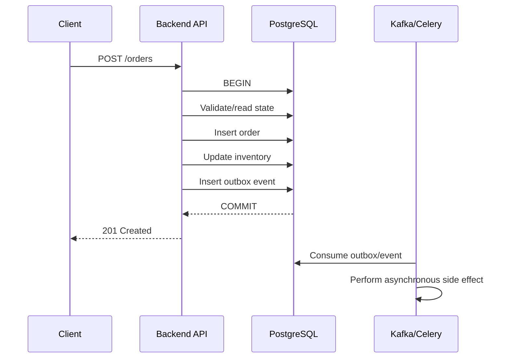
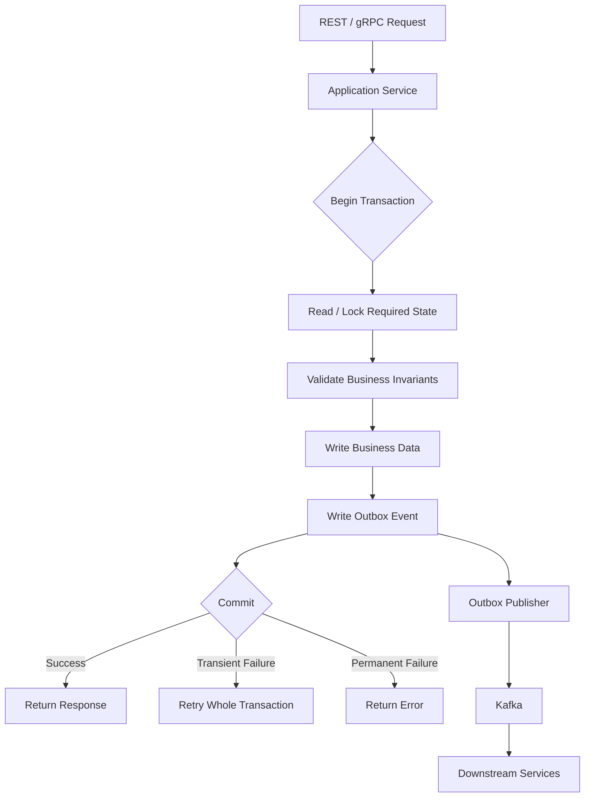

# 28- Transactions in Backend Applications

## Overview

Database transactions are the mechanism that allows a backend application to treat multiple database operations as one logical unit of work. They are essential whenever several reads and writes must collectively preserve business invariants.

A transaction is not simply a `BEGIN`/`COMMIT` wrapper around SQL. At the application layer, transaction design determines:

- Which operations succeed or fail together
- How concurrent requests interact
- How long locks are held
- How failures are recovered
- Whether external side effects can become inconsistent with database state
- How the application behaves under load

For a typical backend request, the transaction boundary sits between application business logic and the database:



The key principle is:

> A transaction should protect a business invariant, not merely group arbitrary SQL statements.

For example, creating an order and reserving its inventory may belong to the same transaction because allowing only one operation to commit could leave the system in an invalid state.

---

## Transaction Boundaries in Backend Applications

A transaction boundary defines the exact start and end of the database atomicity guarantee.

A well-designed backend commonly follows this structure:

```text
HTTP/gRPC request
       │
       ▼
Controller / API layer
       │
       ▼
Application service
       │
       ├── BEGIN
       │
       ├── Read required state
       ├── Validate business rules
       ├── Write changes
       ├── Record required events
       │
       └── COMMIT
              │
              ▼
         Response / async work
```

The application service is often the most appropriate place to establish the transaction boundary because it understands the business operation being performed.

### Good transaction boundary

```python
from django.db import transaction

@transaction.atomic
def create_order(*, user_id: int, product_id: int, quantity: int):
    inventory = (
        Inventory.objects
        .select_for_update()
        .get(product_id=product_id)
    )

    if inventory.available < quantity:
        raise InsufficientInventory()

    inventory.available -= quantity
    inventory.save(update_fields=["available"])

    order = Order.objects.create(
        user_id=user_id,
        product_id=product_id,
        quantity=quantity,
        status="created",
    )

    return order
```

The entire business operation is atomic:

```text
lock inventory
      ↓
validate availability
      ↓
decrement inventory
      ↓
create order
      ↓
commit
```

If any operation fails, the transaction rolls back.

---

## What Belongs Inside a Transaction?

A useful rule is:

> Put database operations inside the transaction when they must succeed or fail together to preserve a business invariant.

Typical candidates include:

- Creating an order and its order items
- Updating an account balance and recording the ledger entry
- Reserving inventory and creating a reservation
- Updating a state transition and its audit record
- Creating a parent record and required child records
- Updating multiple rows whose consistency must be atomic
- Writing an outbox event together with the business state

For example:

```sql
BEGIN;

UPDATE accounts
SET balance = balance - 100
WHERE id = 1;

UPDATE accounts
SET balance = balance + 100
WHERE id = 2;

INSERT INTO transfer_ledger (
    from_account_id,
    to_account_id,
    amount
)
VALUES (1, 2, 100);

COMMIT;
```

The transfer should not commit the debit without the credit and ledger entry.

---

## What Usually Does Not Belong Inside a Transaction?

Avoid keeping a database transaction open while performing slow or failure-prone external work.

Examples include:

- HTTP requests
- Calling third-party APIs
- Sending email
- Publishing directly to external brokers
- Uploading files to object storage
- Waiting for user input
- Long CPU-intensive processing
- Sleeping or retrying with long delays

Bad:

```python
@transaction.atomic
def create_payment():
    payment = Payment.objects.create(status="pending")

    response = requests.post(
        "https://payment-provider.example/charge",
        timeout=30,
    )

    payment.status = "completed"
    payment.save(update_fields=["status"])
```

The database transaction may remain open for the duration of the network request.

That can increase:

- Lock duration
- Connection occupancy
- Transaction age
- Deadlock probability
- Rollback cost
- Database resource consumption

A better design separates durable database state from external side effects.

```text
Transaction
───────────
Create payment
Create outbox event
Commit
    │
    ▼
Outbox worker
    │
    ▼
Payment provider
    │
    ▼
Update payment status
```

---

## Request-Level Transactions

Some applications wrap an entire HTTP request in a transaction.

Conceptually:

```text
Request
  │
  ├── BEGIN
  │
  ├── authentication
  ├── business logic
  ├── queries
  ├── external processing
  ├── response construction
  │
  └── COMMIT
```

This is usually too broad for complex production APIs.

A better approach is to use explicit transaction boundaries around the specific business operation:

```text
HTTP request
    │
    ├── authentication
    ├── parsing
    ├── authorization
    │
    ▼
Application service
    │
    ├── BEGIN
    ├── database work
    └── COMMIT
    │
    ▼
response
```

### Why narrow boundaries are preferable

They reduce:

- Lock duration
- Connection pool occupancy
- Contention
- Rollback scope
- Deadlock exposure
- Failure blast radius

They also make transaction semantics easier to reason about.

---

## Django Transaction Management

Django operates in autocommit mode by default. Individual database operations are committed automatically unless an explicit transaction is established.

For multi-step business operations, use `transaction.atomic()`.

```python
from django.db import transaction

def transfer_money(from_id: int, to_id: int, amount: int):
    with transaction.atomic():
        sender = Account.objects.select_for_update().get(id=from_id)
        receiver = Account.objects.select_for_update().get(id=to_id)

        if sender.balance < amount:
            raise InsufficientFunds()

        sender.balance -= amount
        receiver.balance += amount

        sender.save(update_fields=["balance"])
        receiver.save(update_fields=["balance"])
```

The outermost `atomic()` block establishes the transaction.

Nested `atomic()` blocks generally use savepoints:

```python
with transaction.atomic():
    create_order()

    try:
        with transaction.atomic():
            create_optional_record()
    except OptionalRecordError:
        pass
```

The inner block can roll back to its savepoint without necessarily rolling back the entire outer transaction.

### Django transaction recommendations

Prefer:

```python
@transaction.atomic
def perform_business_operation():
    ...
```

or:

```python
with transaction.atomic():
    ...
```

Use `atomic()` around a meaningful business operation rather than individual model methods unless there is a specific reason to do otherwise.

---

## FastAPI and SQLAlchemy

FastAPI does not provide database transaction semantics itself. The database session and ORM configuration determine transaction behavior.

A service function should explicitly define the transaction boundary.

```python
from sqlalchemy.orm import Session

def create_order(
    session: Session,
    user_id: int,
    product_id: int,
    quantity: int,
):
    with session.begin():
        inventory = (
            session.query(Inventory)
            .filter(Inventory.product_id == product_id)
            .with_for_update()
            .one()
        )

        if inventory.available < quantity:
            raise InsufficientInventory()

        inventory.available -= quantity

        order = Order(
            user_id=user_id,
            product_id=product_id,
            quantity=quantity,
            status="created",
        )

        session.add(order)

    return order
```

The important distinction is between:

- Session lifecycle
- Transaction lifecycle
- Business operation lifecycle

They are related but are not the same concept.

---

## Transaction Flow in a REST API

Consider:

```http
POST /orders
```

The backend may execute:

```text
Client
  │
  │ POST /orders
  ▼
Nginx / Load Balancer
  │
  ▼
API server
  │
  ▼
Order service
  │
  ├── BEGIN
  │
  ├── lock inventory row
  ├── validate inventory
  ├── create order
  ├── decrement inventory
  ├── create outbox event
  │
  └── COMMIT
  │
  ▼
HTTP 201
```

The external event processing happens after the transaction has committed:

```text
Database
   │
   │ committed outbox event
   ▼
Outbox publisher
   │
   ▼
Kafka
   │
   ├── Notification service
   ├── Analytics service
   └── Fulfillment service
```

This architecture avoids pretending that one database transaction can atomically cover PostgreSQL and Kafka.

---

## Transactions and Business Invariants

The most important reason to use a transaction is usually a business invariant.

Consider:

```text
Account balance must never become negative
```

A naive implementation might do:

```python
account = Account.objects.get(id=account_id)

if account.balance >= amount:
    account.balance -= amount
    account.save()
```

Two concurrent requests can both read the same balance.

```text
Initial balance = 100

Request A                  Request B
----------                 ----------
read 100                   read 100
check >= 80                check >= 80
write 20                   write 20
```

The application has accepted two withdrawals even though only one should succeed.

Possible solutions include:

### Pessimistic locking

```python
with transaction.atomic():
    account = (
        Account.objects
        .select_for_update()
        .get(id=account_id)
    )

    if account.balance < amount:
        raise InsufficientFunds()

    account.balance -= amount
    account.save(update_fields=["balance"])
```

### Atomic SQL

For simple invariants, an atomic conditional update can be even better:

```sql
UPDATE accounts
SET balance = balance - :amount
WHERE id = :account_id
  AND balance >= :amount;
```

Then check the number of affected rows.

```text
1 row affected → withdrawal accepted
0 rows affected → insufficient funds or missing account
```

This avoids a separate read-modify-write race.

---

## Transactions and Constraints

Transactions should not be the only protection for critical invariants.

Use database constraints whenever the rule can be expressed declaratively.

Examples:

```sql
CREATE TABLE users (
    id BIGSERIAL PRIMARY KEY,
    email TEXT NOT NULL UNIQUE
);
```

Or:

```sql
ALTER TABLE accounts
ADD CONSTRAINT balance_non_negative
CHECK (balance >= 0);
```

Or:

```sql
CREATE UNIQUE INDEX unique_active_subscription
ON subscriptions (user_id)
WHERE status = 'active';
```

A robust architecture uses multiple layers:

```text
Application validation
        +
Atomic SQL / locking
        +
Database constraints
        +
Transaction
```

Application checks improve user experience, but the database should enforce invariants that must remain true under concurrency.

---

## Transactions and Isolation Levels

A transaction's correctness depends not only on atomicity but also on how concurrent transactions are isolated.

Common levels are:

| Isolation Level | Typical Protection | Main Cost |
|---|---|---|
| Read Uncommitted | Very weak; PostgreSQL treats it as Read Committed | Lowest isolation |
| Read Committed | Prevents dirty reads | Statement-level snapshots |
| Repeatable Read | Stable transaction snapshot | More serialization conflicts |
| Serializable | Strongest correctness guarantee | Possible serialization failures and retries |

The appropriate isolation level depends on the business invariant.

Do not automatically choose `SERIALIZABLE` for every transaction. Stronger isolation can increase contention and retry rates.

Conversely, do not use a weak isolation level when correctness requires stronger guarantees.

---

## Transactions and Locks

Locks are often part of transaction design.

For example:

```sql
BEGIN;

SELECT id, available
FROM inventory
WHERE product_id = 42
FOR UPDATE;

UPDATE inventory
SET available = available - 1
WHERE product_id = 42;

COMMIT;
```

The row lock exists for the transaction's duration.

Therefore:

```text
BEGIN
  │
  ├── acquire lock
  ├── business logic
  ├── database writes
  │
  └── COMMIT
       │
       └── lock released
```

Long transactions therefore often mean long lock durations.

This is one reason transaction duration matters as much as query execution time.

---

## Lock Ordering and Deadlocks

Two transactions can deadlock when they acquire overlapping locks in different orders.

Bad:

```text
Transaction A:
lock account 1
lock account 2

Transaction B:
lock account 2
lock account 1
```

A consistent ordering prevents many deadlocks:

```text
Always lock accounts by ascending ID

A: account 1 → account 2
B: account 1 → account 2
```

Deadlocks can still occur in well-designed systems, so production applications should also handle retryable database errors.

The retry should normally repeat the **entire transaction**, not just the failed statement.

---

## Transaction Retry Strategy

Some transaction failures are transient:

- Deadlocks
- Serialization failures
- Certain lock timeout situations

A robust retry pattern is:

```python
import random
import time

def retry_transaction(operation, max_attempts=3):
    for attempt in range(max_attempts):
        try:
            return operation()
        except RetryableDatabaseError:
            if attempt == max_attempts - 1:
                raise

            delay = min(0.05 * (2 ** attempt), 1.0)
            delay += random.uniform(0, delay * 0.25)
            time.sleep(delay)
```

Production retry logic should have:

- Bounded attempts
- Exponential backoff
- Jitter
- Specific error classification
- Transaction recreation
- Idempotent business operations
- Metrics for retries and final failures

Never blindly retry every database exception.

---

## Transactions and External Side Effects

A database transaction cannot automatically roll back external systems.

Consider:

```text
BEGIN
  │
  ├── create order
  ├── charge payment provider
  ├── publish Kafka event
  └── COMMIT
```

If Kafka publishing succeeds but the database transaction rolls back, the event may describe state that does not exist.

If the database commits but the external call fails, the external side effect may never happen.

This is the distributed transaction problem.

### Transactional Outbox

A common backend pattern is to write the business state and event record in the same database transaction.

```sql
BEGIN;

INSERT INTO orders (...);

INSERT INTO outbox_events (
    event_type,
    aggregate_id,
    payload
)
VALUES (
    'OrderCreated',
    :order_id,
    :payload
);

COMMIT;
```

A separate worker publishes the event:

```text
PostgreSQL
    │
    ├── orders
    └── outbox_events
             │
             ▼
      Outbox publisher
             │
             ▼
           Kafka
```

This provides a strong guarantee:

> If the business transaction commits, the event record is committed with it.

The publisher may publish an event more than once, so consumers should be designed for idempotency.

---

## Transactional Outbox Example

A Django service might use:

```python
from django.db import transaction

@transaction.atomic
def create_order(*, user_id: int, product_id: int):
    order = Order.objects.create(
        user_id=user_id,
        product_id=product_id,
        status="created",
    )

    OutboxEvent.objects.create(
        event_type="OrderCreated",
        aggregate_id=str(order.id),
        payload={
            "order_id": order.id,
            "user_id": user_id,
            "product_id": product_id,
        },
    )

    return order
```

A Celery worker can later publish the outbox record to Kafka.

The worker should track:

- Event status
- Attempt count
- Last error
- Published timestamp
- Retry state

Avoid deleting an outbox event immediately after a failed publication attempt.

---

## Transactions and Idempotency

Retries create another problem: the same business request may execute more than once.

For example:

```text
Client
  │
  ├── POST /payments
  │
  ▼
Server commits transaction
  │
  X response lost
  │
Client retries
  ▼
Server receives same request
```

Without idempotency, the payment could be created twice.

Use an idempotency key for operations where duplicate execution is dangerous:

```http
POST /payments
Idempotency-Key: 8f7e3c...
```

Store the key and resulting operation in the same transaction when possible.

```text
Idempotency key
      │
      ▼
Database uniqueness constraint
      │
      ├── first request → execute
      │
      └── duplicate → return existing result
```

Transactions and idempotency solve different problems but work together closely.

---

## Transactions in Microservices

A transaction is generally local to one database.

Suppose an order service and payment service have separate databases:

```text
Order Service
PostgreSQL
    │
    │ transaction
    ▼
Order committed

Payment Service
PostgreSQL
    │
    │ separate transaction
    ▼
Payment committed
```

A single PostgreSQL transaction cannot atomically cover both services.

Avoid trying to recreate distributed ACID transactions casually.

Instead, model the workflow explicitly:

```text
Order: PENDING
   │
   ▼
Payment requested
   │
   ▼
Payment succeeded
   │
   ▼
Order: CONFIRMED
```

Use events, retries, idempotency, compensating actions, and state machines where appropriate.

---

## Transactions and Kafka

Kafka provides durable event delivery but does not make a PostgreSQL transaction and Kafka publication one atomic transaction.

A common architecture is:

```text
                ┌───────────────┐
                │  PostgreSQL   │
                │               │
Request ───────►│ Business data │
                │      +        │
                │ Outbox event  │
                └───────┬───────┘
                        │
                     committed
                        │
                        ▼
                ┌───────────────┐
                │ Outbox Worker │
                └───────┬───────┘
                        │
                        ▼
                     Kafka
                        │
             ┌──────────┼──────────┐
             ▼          ▼          ▼
          Service A  Service B  Service C
```

This is generally easier to operate than introducing a distributed transaction coordinator.

---

## Transactions and Redis

Redis should not automatically be treated as part of a PostgreSQL transaction.

For example:

```text
PostgreSQL transaction
       │
       ├── update order
       │
       └── update Redis
```

If PostgreSQL commits and Redis fails, the two systems can diverge.

Prefer patterns such as:

```text
PostgreSQL
    │
    └── source of truth
          │
          ▼
       outbox/event
          │
          ▼
        Redis
```

For cache invalidation:

```text
DB commit
   │
   ▼
event
   │
   ▼
cache invalidation
```

The database remains authoritative.

---

## Large Transactions

A transaction can be logically correct while still being operationally dangerous.

Large transactions may:

- Hold locks for a long time
- Consume connection pool capacity
- Generate large amounts of WAL
- Increase replication lag
- Increase rollback time
- Increase contention
- Interact poorly with autovacuum and MVCC cleanup
- Make retries expensive

Instead of:

```sql
BEGIN;

UPDATE orders
SET status = 'archived'
WHERE created_at < now() - interval '2 years';

COMMIT;
```

consider bounded batches when intermediate commits are acceptable:

```sql
UPDATE orders
SET status = 'archived'
WHERE id IN (
    SELECT id
    FROM orders
    WHERE created_at < now() - interval '2 years'
      AND status = 'completed'
    ORDER BY id
    LIMIT 1000
);
```

Repeat until complete.

The trade-off is important:

> Batching reduces transaction size but removes all-or-nothing atomicity across the complete dataset.

---

## Transactions and Connection Pools

A database connection normally cannot safely be returned to a connection pool while a transaction is still open.

Therefore:

```text
Request
  │
  ▼
Acquire DB connection
  │
  ▼
BEGIN
  │
  ├── database work
  │
  ▼
COMMIT / ROLLBACK
  │
  ▼
Return connection
```

Long transactions reduce the number of connections available to other requests.

For example, with a pool of 20 connections:

```text
20 concurrent long transactions
        ↓
0 available connections
        ↓
new requests wait
        ↓
latency increases
        ↓
timeouts cascade
```

Connection-pool sizing therefore interacts directly with transaction duration.

---

## Transaction Timeouts

Production systems should protect themselves from unexpectedly long transactions.

Potential controls include:

- PostgreSQL `statement_timeout`
- PostgreSQL `lock_timeout`
- PostgreSQL `idle_in_transaction_session_timeout`
- Application request timeouts
- ORM-level safeguards
- Connection-pool limits

Example:

```sql
SET LOCAL lock_timeout = '2s';
SET LOCAL statement_timeout = '10s';
```

`SET LOCAL` limits the settings to the current transaction.

Timeouts should be chosen based on real workload characteristics rather than arbitrary low values.

---

## Monitoring Transactions

Transaction behavior should be observable in production.

Useful PostgreSQL views include:

```sql
SELECT
    pid,
    usename,
    state,
    xact_start,
    query_start,
    wait_event_type,
    wait_event,
    query
FROM pg_stat_activity
WHERE xact_start IS NOT NULL
ORDER BY xact_start;
```

Look for:

- Long-running transactions
- Idle transactions
- Lock waits
- Deadlocks
- Serialization failures
- Connection-pool exhaustion
- Replication lag
- Increasing transaction latency

Application metrics should include:

| Metric | Why It Matters |
|---|---|
| Transaction duration | Detect long transactions |
| Transaction failure rate | Detect correctness/availability problems |
| Deadlock count | Detect lock-ordering/contention problems |
| Serialization retry count | Detect high contention |
| Lock wait duration | Detect blocking |
| DB pool utilization | Detect connection pressure |
| Rollback rate | Detect application failures |
| Outbox backlog | Detect asynchronous delivery problems |

Tracing should associate database spans with the request and business operation.

---

## Security Considerations

Transactions do not automatically make database operations secure.

Important practices include:

- Use parameterized queries
- Never construct SQL using untrusted string concatenation
- Apply authorization before modifying protected resources
- Enforce critical constraints in the database
- Use least-privilege database roles
- Avoid exposing transaction/debug information to clients
- Audit sensitive state transitions
- Protect idempotency keys and event payloads from leaking sensitive data

Safe:

```python
cursor.execute(
    """
    UPDATE accounts
    SET balance = balance - %s
    WHERE id = %s
    """,
    [amount, account_id],
)
```

Unsafe:

```python
cursor.execute(
    f"UPDATE accounts SET balance = balance - {amount} WHERE id = {account_id}"
)
```

Transactions protect consistency, not confidentiality or authorization.

---

## High Availability and Disaster Recovery

Transactions interact with high availability because committed data must survive failures according to the database's durability guarantees.

For PostgreSQL production systems, consider:

- Automated backups
- Point-in-time recovery
- WAL retention
- Streaming replication
- Replica monitoring
- Failover procedures
- Connection retry behavior
- Recovery objectives

A transaction that receives an ambiguous result around `COMMIT` should not automatically be executed again if repeating it could duplicate a non-idempotent operation.

For example:

```text
Client
  │
  ▼
Database COMMIT
  │
  X network failure
  │
  ▼
Client sees timeout
```

The database may have committed successfully even though the client did not receive the response.

Use idempotency keys, unique constraints, reconciliation, or operation-status queries to resolve uncertain outcomes.

---

## Deployment and Migration Considerations

Transactions are also relevant during CI/CD and schema migrations.

A migration that locks a large production table for too long can cause application downtime even if the migration itself is logically correct.

Production migration strategies may include:

1. Add a nullable column.
2. Deploy application code that understands the new schema.
3. Backfill data in controlled batches.
4. Add constraints/indexes using appropriate PostgreSQL techniques.
5. Remove deprecated fields in a later deployment.

Avoid combining large data migrations and application-critical schema changes into one huge transaction unless the database and workload can safely support it.

For large PostgreSQL indexes, `CREATE INDEX CONCURRENTLY` can reduce blocking but has different transactional behavior and operational requirements than ordinary `CREATE INDEX`.

---

## Transaction Design Checklist

Before adding a transaction, ask:

| Question | Engineering Decision |
|---|---|
| What invariant am I protecting? | Define correctness first |
| Which operations must commit together? | Set the transaction boundary |
| Can an atomic SQL statement solve it? | Prefer it for simple invariants |
| Is concurrent access possible? | Consider locking or optimistic concurrency |
| Which isolation level is required? | Choose based on correctness |
| Can the transaction stay short? | Remove unnecessary work |
| Are external calls involved? | Move them outside the transaction |
| Can failures be retried? | Classify transient errors |
| Is the operation idempotent? | Required for safe retries |
| Does another service need the event? | Consider transactional outbox |
| Can a constraint enforce the invariant? | Prefer database enforcement |
| How will this behave under load? | Measure contention and pool usage |

---

## Common Mistakes and Pitfalls

### Putting HTTP Calls Inside Transactions

**Problem:** A slow third-party API extends transaction duration.

**Why it happens:** The developer wants the external operation and database update to appear atomic.

**Better approach:** Commit durable state and use an outbox or asynchronous workflow.

---

### Assuming Transactions Prevent All Race Conditions

**Problem:** A transaction is used without appropriate isolation, locking, atomic SQL, or constraints.

**Why it happens:** The developer assumes `BEGIN` automatically serializes concurrent requests.

**Better approach:** Analyze the exact concurrent interleaving and choose the required concurrency mechanism.

---

### Relying Only on Application Validation

**Problem:**

```python
if not User.objects.filter(email=email).exists():
    User.objects.create(email=email)
```

Two requests can pass the check concurrently.

**Better approach:**

```sql
CREATE UNIQUE INDEX users_email_unique
ON users (email);
```

Then handle the uniqueness conflict.

---

### Retrying Only the Failed Statement

**Problem:** The application retries one SQL statement after a deadlock or serialization failure.

**Why it happens:** The developer treats the error like a transient query failure.

**Better approach:** Retry the complete transaction from the beginning.

---

### Catching Every Database Error and Retrying

**Problem:** Permanent errors are retried repeatedly.

**Examples:**

- Constraint violations
- Invalid SQL
- Missing records
- Authorization failures
- Data validation errors

**Better approach:** Classify errors explicitly and retry only known transient failures.

---

### Holding Locks While Doing Application Work

Bad:

```python
with transaction.atomic():
    account = Account.objects.select_for_update().get(id=account_id)

    expensive_python_computation()

    account.balance -= amount
    account.save()
```

The lock is held during the computation.

Better:

```text
Perform non-dependent work
        ↓
BEGIN
        ↓
Lock required rows
        ↓
Perform minimal critical section
        ↓
COMMIT
```

Only work that depends on the protected state should normally occur while the lock is held.

---

### Using One Huge Transaction for Bulk Processing

**Problem:** A large failure rolls back a massive amount of work.

**Better approach:** Batch the work when business requirements allow partial progress.

---

### Assuming Redis or Kafka Shares the Database Transaction

**Problem:** The database commits while the external system fails, or vice versa.

**Better approach:** Use outbox/event-driven patterns, idempotency, and reconciliation.

---

### Ignoring Transaction Duration

A transaction that takes 10 ms under development load may take several seconds under production contention.

Measure:

```text
transaction duration
lock wait
query duration
connection acquisition
commit latency
retry rate
```

Do not optimize transactions based solely on query execution time.

---

## Interview Traps

### "Does a transaction prevent concurrent access?"

No. Transactions provide atomicity and isolation according to the configured database semantics. Concurrent transactions can still execute simultaneously.

---

### "If I use `transaction.atomic()`, am I safe from race conditions?"

No. You may still need:

- `SELECT ... FOR UPDATE`
- Atomic conditional updates
- Appropriate isolation
- Unique/check constraints
- Optimistic concurrency control

---

### "Can a database transaction include Kafka?"

Not as one ordinary PostgreSQL transaction. PostgreSQL and Kafka are separate systems with separate transaction mechanisms.

A transactional outbox is a common solution for reliably bridging them.

---

### "Should every API request use a transaction?"

No. Use transactions where multiple operations must be atomic or where concurrency requires transactional guarantees.

Simple read-only requests may not need an explicit transaction.

---

### "Should I always use SERIALIZABLE?"

No. Serializable provides strong correctness guarantees but can increase conflicts and retries. Select isolation based on the invariant and workload.

---

### "What happens if COMMIT times out?"

The client may not know whether the transaction committed. Retrying blindly can duplicate a non-idempotent operation.

Use idempotency, unique constraints, reconciliation, or status lookup to resolve the outcome.

---

### "Why is a short transaction important?"

Because locks, connections, MVCC visibility, WAL generation, and other database resources are affected by transaction lifetime. Short transactions generally improve concurrency and reduce failure cost.

---

## Production Architecture Pattern

A mature backend transaction design often looks like this:



The architecture separates responsibilities:

- PostgreSQL provides durable local consistency.
- Transactions protect business invariants.
- Locks or optimistic concurrency handle concurrent modifications.
- Constraints enforce critical data rules.
- Outbox events bridge database state to asynchronous systems.
- Kafka distributes committed events.
- Consumers use idempotency.
- Retry logic handles transient failures.
- Observability exposes contention and failure behavior.

---

## Recommended Transaction Design Principles

For production backend systems:

1. **Define the invariant first.**  
   Do not start with `BEGIN`; start by identifying what must remain true.

2. **Keep transactions short.**  
   Minimize lock duration and connection occupancy.

3. **Make the database enforce correctness.**  
   Use constraints, atomic SQL, and appropriate locking.

4. **Do not include external network calls unnecessarily.**  
   Use outbox and asynchronous processing for external side effects.

5. **Design for retries.**  
   Deadlocks and serialization failures are expected possibilities in concurrent systems.

6. **Make retryable operations idempotent.**  
   Especially for payments, jobs, event consumers, and APIs.

7. **Use consistent lock ordering.**  
   This reduces deadlock probability.

8. **Measure transaction behavior.**  
   Track duration, lock waits, retries, failures, and pool utilization.

9. **Treat distributed workflows separately from local transactions.**  
   Use state machines, events, compensating actions, and reconciliation when multiple services participate.

10. **Prefer the smallest mechanism that provides the required guarantee.**  
    An atomic `UPDATE` may be better than explicit locking; `READ COMMITTED` may be sufficient where `SERIALIZABLE` is unnecessary.

## Key Takeaways

- A backend transaction should represent a meaningful business operation and protect the invariants that must remain atomic.
- Keep transactions short and avoid slow external work, unnecessary computation, and network calls inside the critical section.
- Transactions alone do not solve concurrency problems; combine isolation, atomic SQL, locks, optimistic concurrency, and database constraints according to the invariant.
- PostgreSQL transactions cannot atomically coordinate independent systems such as Kafka or Redis; use patterns such as transactional outbox, idempotency, and reconciliation.
- Production transaction design must account for retries, deadlocks, connection pools, observability, high availability, migrations, and uncertain commit outcomes.