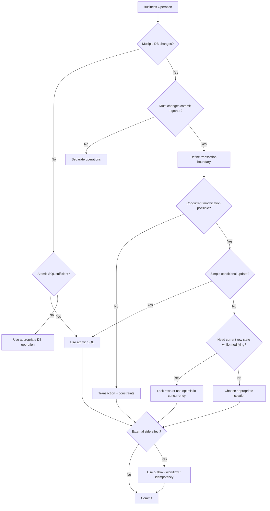

# 29- Common Transaction Mistakes

## Overview

Transactions are one of the most powerful correctness mechanisms in backend systems, but they are frequently misused. A transaction can guarantee atomicity and provide defined isolation semantics while still producing incorrect, slow, or unreliable application behavior.

Most transaction problems fall into a few categories:

- The transaction boundary is wrong.
- Concurrent access is not handled correctly.
- Locks are held longer than necessary.
- External side effects are incorrectly treated as transactional.
- Retry behavior is unsafe.
- Database constraints are replaced with application-only checks.
- Large or long-running transactions create operational pressure.
- Developers assume `BEGIN` alone prevents race conditions.

For backend engineers, transaction correctness should be evaluated at three levels:

```text
Business correctness
        │
        ▼
Database correctness
        │
        ▼
Operational behavior
```

A design can be logically correct but still fail under production load because of lock contention, connection exhaustion, replication lag, or unsafe retries.

The goal is therefore not to "use transactions everywhere", but to use the smallest transaction boundary and concurrency mechanism that correctly protects the business invariant.

---

## Transaction Mistakes at a Glance

| Mistake | Typical Consequence | Better Approach |
|---|---|---|
| No transaction for multi-step invariant | Partial updates | Define an explicit transaction boundary |
| Assuming transaction prevents races | Lost updates or overselling | Use atomic SQL, locks, or optimistic concurrency |
| Transaction too large | Lock and connection pressure | Keep critical sections short |
| External API inside transaction | Long locks and uncertain consistency | Use outbox/state-machine patterns |
| Application-only uniqueness check | Duplicate records | Use database constraints |
| Inconsistent lock ordering | Deadlocks | Establish deterministic lock ordering |
| Retrying only one statement | Partial or invalid transaction state | Retry the whole transaction |
| Retrying every DB error | Retry storms and wasted load | Retry only classified transient failures |
| Blind retry after uncertain commit | Duplicate side effects | Use idempotency and reconciliation |
| Ignoring isolation level | Unexpected concurrency behavior | Choose isolation based on invariants |
| Huge bulk transaction | Expensive rollback and WAL pressure | Batch when atomicity permits |
| Treating Redis/Kafka as part of DB transaction | Cross-system inconsistency | Use outbox/events/idempotency |
| Swallowing transaction exceptions | Incorrectly committed or hidden failures | Roll back and propagate appropriately |
| Holding locks during slow work | Contention and timeouts | Minimize lock scope |

---

## Mistake: Assuming `BEGIN` Automatically Prevents Race Conditions

A transaction provides atomicity and defined isolation semantics. It does not automatically make application logic safe under concurrent execution.

Consider:

```python
account = Account.objects.get(id=account_id)

if account.balance >= amount:
    account.balance -= amount
    account.save(update_fields=["balance"])
```

Two requests can execute concurrently:

```text
Initial balance = 100

Request A                    Request B
----------                   ----------
read balance = 100           read balance = 100
100 >= 80 → true             100 >= 80 → true
write balance = 20           write balance = 20
```

Both requests can believe they successfully withdrew money.

Wrapping this code in `transaction.atomic()` does not necessarily fix the underlying read-modify-write race.

### Better approaches

For a lock-based solution:

```python
from django.db import transaction

with transaction.atomic():
    account = (
        Account.objects
        .select_for_update()
        .get(id=account_id)
    )

    if account.balance < amount:
        raise InsufficientFunds()

    account.balance -= amount
    account.save(update_fields=["balance"])
```

For a simple invariant, an atomic conditional update can be preferable:

```sql
UPDATE accounts
SET balance = balance - :amount
WHERE id = :account_id
  AND balance >= :amount;
```

Then inspect the affected-row count.

The important question is not:

> "Did I use a transaction?"

It is:

> "What concurrent interleaving can violate my invariant, and what mechanism prevents it?"

---

## Mistake: Using Read-Then-Write When Atomic SQL Is Enough

A common pattern is:

```text
SELECT current value
        ↓
validate
        ↓
UPDATE value
```

This creates a window in which another transaction can modify the same row.

For simple conditional state changes, a single SQL statement often provides a stronger and cheaper design.

Example:

```sql
UPDATE inventory
SET available = available - :quantity
WHERE product_id = :product_id
  AND available >= :quantity;
```

Then:

```text
affected_rows = 1 → reservation succeeded
affected_rows = 0 → reservation failed
```

### Why this is often better

- Fewer round trips
- Smaller critical section
- Less application-side state
- Better concurrency behavior
- No separate read/write race
- Easier reasoning about the invariant

Do not use row locking simply because transactions are involved. First determine whether the database can express the invariant atomically.

---

## Mistake: Relying Only on Application Validation

Consider:

```python
if not User.objects.filter(email=email).exists():
    User.objects.create(email=email)
```

Two requests can both observe that the email does not exist.

```text
Request A                    Request B
----------                   ----------
SELECT → no row             SELECT → no row
INSERT                      INSERT
```

The application-level check is not sufficient under concurrency.

Use a database constraint:

```sql
ALTER TABLE users
ADD CONSTRAINT users_email_unique
UNIQUE (email);
```

Then handle the conflict in the application.

### General rule

If a rule must remain true regardless of concurrency or application bugs, enforce it in the database whenever possible.

Common examples:

- Unique values
- Non-negative balances
- Foreign-key relationships
- Valid state combinations
- Required fields
- Conditional uniqueness

Transactions and constraints complement each other.

---

## Mistake: Making Transactions Too Large

A transaction may contain hundreds or thousands of queries and still "work" in development.

In production, large transactions can cause:

- Long lock durations
- Connection pool exhaustion
- Large rollback costs
- Increased WAL generation
- Replication lag
- Greater deadlock exposure
- Longer MVCC cleanup pressure
- Higher retry costs

Bad:

```python
with transaction.atomic():
    for order in orders:
        process_order(order)
```

If `orders` contains 100,000 records, one failure near the end can roll back the entire operation.

### Better approach

If the business operation does not require global atomicity, process bounded batches:

```python
while True:
    batch = get_next_batch(limit=1000)

    if not batch:
        break

    with transaction.atomic():
        process_batch(batch)
```

The trade-off is important:

> Batching improves operational behavior but changes the atomicity boundary.

Do not batch automatically when the entire operation genuinely must succeed or fail together.

---

## Mistake: Keeping Transactions Open During Network Calls

One of the most damaging transaction mistakes is:

```python
with transaction.atomic():
    order = create_order()

    response = payment_provider.charge(
        order_id=order.id,
        timeout=30,
    )

    mark_order_paid(order, response)
```

The database transaction may remain open while waiting for the payment provider.

This can cause:

```text
Database connection
       │
       ├── BEGIN
       ├── database changes
       │
       ├── WAIT 30s
       │      └── external API
       │
       └── COMMIT
```

During that time:

- Locks may remain held.
- The connection remains occupied.
- Other requests may wait.
- Deadlock exposure increases.
- Failure recovery becomes complicated.

### Better architecture

```text
Transaction A
─────────────
Create order
Set status = PENDING
Create outbox/event
Commit
      │
      ▼
External worker
      │
      ▼
Payment provider
      │
      ▼
Transaction B
─────────────
Update payment state
Commit
```

Use an explicit state machine when the workflow spans multiple systems.

---

## Mistake: Treating External Systems as Transactional

A PostgreSQL transaction cannot automatically roll back:

- An HTTP request
- A Kafka publication
- A Redis write
- An email
- An object-storage upload
- A third-party payment

This is unsafe:

```text
BEGIN
  │
  ├── INSERT order
  ├── PUBLISH Kafka event
  ├── UPDATE Redis
  └── COMMIT
```

If the database rolls back after Kafka publication, the event may refer to state that does not exist.

If the database commits but Kafka fails, the event may never be delivered.

### Better approach

Use PostgreSQL as the transactional source of truth:

```text
┌──────────────────────┐
│      PostgreSQL      │
│                      │
│ orders               │
│ outbox_events        │
└──────────┬───────────┘
           │ COMMIT
           ▼
┌──────────────────────┐
│   Outbox Publisher   │
└──────────┬───────────┘
           │
           ▼
        Kafka
           │
     ┌─────┼─────┐
     ▼     ▼     ▼
 Service Service Service
```

The business state and outbox record commit together.

---

## Mistake: Assuming Kafka Makes the Database Transaction Atomic

Kafka has its own transaction mechanisms, but that does not automatically create one atomic transaction spanning PostgreSQL and Kafka.

This is not equivalent to:

```text
PostgreSQL COMMIT
       +
Kafka COMMIT
       =
one distributed transaction
```

For most microservice architectures, prefer:

```text
Database transaction
       ↓
Transactional outbox
       ↓
Kafka
       ↓
Idempotent consumers
```

This provides clear failure semantics without introducing unnecessary distributed transaction coordination.

---

## Mistake: Assuming Redis Is Part of the Database Transaction

Consider:

```python
with transaction.atomic():
    user.update(status="active")
    redis.set(f"user:{user_id}:status", "active")
```

Possible failure:

```text
PostgreSQL → COMMIT
Redis      → failure
```

Now the cache is stale.

Or:

```text
Redis      → success
PostgreSQL → rollback
```

Now Redis may contain data representing a state that never committed.

### Better approach

Treat PostgreSQL as the source of truth and update/invalidate caches after durable state changes.

For example:

```text
PostgreSQL commit
       │
       ▼
Outbox/event
       │
       ▼
Cache invalidation
       │
       ▼
Redis
```

A cache should generally be reconstructible from the authoritative database state.

---

## Mistake: Inconsistent Lock Ordering

Deadlocks commonly arise when concurrent transactions acquire overlapping locks in different orders.

Example:

```text
Transaction A:
lock account 1
lock account 2

Transaction B:
lock account 2
lock account 1
```

The dependency graph becomes:

```text
A waits for B
B waits for A
```

PostgreSQL can detect the deadlock and abort one transaction.

### Better approach

Define a deterministic lock order.

For example:

```python
account_ids = sorted([from_account_id, to_account_id])

accounts = (
    Account.objects
    .select_for_update()
    .filter(id__in=account_ids)
    .order_by("id")
)
```

All code paths should follow the same ordering convention.

### Production recommendation

Even with good lock ordering, handle deadlock errors because complex workloads can still produce unexpected contention patterns.

---

## Mistake: Holding Locks While Doing Slow Work

Bad:

```python
with transaction.atomic():
    account = (
        Account.objects
        .select_for_update()
        .get(id=account_id)
    )

    generate_large_report()
    call_internal_service()
    perform_expensive_computation()

    account.balance -= amount
    account.save(update_fields=["balance"])
```

The lock is held throughout all unrelated work.

A better structure is:

```text
Non-critical work
       │
       ▼
BEGIN
       │
       ▼
Acquire lock
       │
       ▼
Validate state
       │
       ▼
Minimal state changes
       │
       ▼
COMMIT
```

The objective is to make the critical section as small as possible.

---

## Mistake: Catching Exceptions Inside a Transaction Incorrectly

A dangerous pattern is catching an exception and continuing as though the transaction were still healthy.

For example:

```python
with transaction.atomic():
    try:
        create_payment()
    except Exception:
        pass

    create_order()
```

If the database transaction has entered a broken state because of a database error, subsequent queries may fail or the intended rollback semantics may be lost.

### Better pattern

Use a nested transaction/savepoint when a failure is intentionally isolated:

```python
from django.db import transaction

with transaction.atomic():
    create_order()

    try:
        with transaction.atomic():
            create_optional_record()
    except OptionalRecordError:
        handle_optional_failure()
```

The nested block provides a savepoint boundary.

For critical failures, let the exception propagate so the outer transaction can roll back.

---

## Mistake: Retrying Only the Failed SQL Statement

Suppose a transaction performs:

```text
BEGIN
  │
  ├── UPDATE A
  ├── UPDATE B  ← serialization/deadlock failure
  └── COMMIT
```

Retrying only `UPDATE B` is usually incorrect.

The transaction's complete read/write history may have been invalidated.

### Correct pattern

```text
Attempt 1
─────────
BEGIN
  ↓
Read/write operations
  ↓
Transient failure
  ↓
ROLLBACK

Attempt 2
─────────
BEGIN
  ↓
Repeat complete business operation
  ↓
COMMIT
```

The retry boundary should normally be the complete transaction.

---

## Mistake: Retrying Every Database Exception

Not every database failure is transient.

| Error Category | Retry? |
|---|---|
| Deadlock | Usually yes |
| Serialization failure | Usually yes |
| Temporary lock conflict | Sometimes |
| Unique constraint violation | Usually no |
| Foreign-key violation | Usually no |
| Invalid SQL | No |
| Invalid input | No |
| Authorization failure | No |
| Missing required data | Usually no |

Retrying permanent failures wastes resources and can amplify an outage.

Use specific exception or SQLSTATE classification.

For PostgreSQL, examples of retryable conditions commonly include:

```text
40P01  deadlock_detected
40001  serialization_failure
```

Exact retry behavior should depend on the operation and application semantics.

---

## Mistake: Using Unbounded Retries

Even correctly classified transient errors become dangerous when retries are unlimited.

Bad:

```python
while True:
    try:
        return execute_transaction()
    except RetryableDatabaseError:
        continue
```

Under high contention:

```text
traffic
  ↓
contention
  ↓
transaction failures
  ↓
retries
  ↓
more traffic
  ↓
more contention
```

This is a retry storm.

### Better strategy

Use:

- Maximum attempts
- Exponential backoff
- Jitter
- Request deadlines
- Circuit-breaking where appropriate
- Retry metrics

Example:

```text
Attempt 1 → immediate
Attempt 2 → 50 ms
Attempt 3 → 100 ms
Attempt 4 → 200 ms
```

The exact values should be workload-specific.

---

## Mistake: Blindly Retrying After an Uncertain COMMIT

A particularly subtle failure occurs when the application cannot determine whether `COMMIT` succeeded.

```text
Application
     │
     │ COMMIT
     ▼
PostgreSQL
     │
     │ committed
     X
network failure
     │
     ▼
Application sees timeout
```

The application may incorrectly conclude that the transaction failed.

Blindly repeating the operation can create duplicates.

### Better approach

Use:

- Idempotency keys
- Unique business identifiers
- Durable operation IDs
- Status lookup
- Reconciliation
- Safe retry semantics

For example:

```text
POST /payments
Idempotency-Key: abc123
```

A repeated request with the same key should resolve to the same logical operation rather than create another payment.

---

## Mistake: Ignoring Idempotency During Transaction Retries

Suppose a worker processes:

```text
Create shipment
Update database
```

A transient failure causes a retry.

If the operation is not idempotent, the retry may create two shipments.

Transactions do not automatically make an operation idempotent.

### Better design

Use a unique operation identifier:

```sql
CREATE TABLE shipment_requests (
    idempotency_key TEXT PRIMARY KEY,
    shipment_id BIGINT NOT NULL,
    created_at TIMESTAMPTZ NOT NULL DEFAULT now()
);
```

Then duplicate requests can be detected deterministically.

This is especially important for:

- Payments
- Orders
- Job execution
- Message consumers
- External API calls
- Webhooks

---

## Mistake: Choosing Isolation Levels Without Understanding the Workload

A common misconception is:

```text
SERIALIZABLE = always best
```

Higher isolation provides stronger guarantees but may produce more serialization failures and retries.

Conversely:

```text
READ COMMITTED = always fast and therefore always sufficient
```

is also incorrect.

Isolation should be chosen based on the business invariant.

| Requirement | Possible Approach |
|---|---|
| Simple conditional update | Atomic SQL |
| Prevent concurrent modification of selected rows | Row locking |
| Detect stale application state | Optimistic concurrency |
| Consistent transaction snapshot | Repeatable Read |
| Strong serial execution semantics | Serializable |

Isolation level, locks, atomic SQL, and optimistic concurrency are different tools.

---

## Mistake: Using Locks When an Atomic Update Is Better

A developer may write:

```python
with transaction.atomic():
    row = Model.objects.select_for_update().get(id=object_id)
    row.counter += 1
    row.save()
```

For a simple counter, the database may already be able to perform the operation atomically:

```sql
UPDATE counters
SET value = value + 1
WHERE id = :id;
```

This can reduce:

- Query count
- Lock duration
- Application complexity
- Race-condition surface

Use explicit locking when the business logic actually requires reading and conditionally acting on the locked state.

---

## Mistake: Using Optimistic Concurrency Without a Version Check

This is not sufficient:

```python
record = get_record()
record.value = new_value
save(record)
```

The record may have changed after it was read.

A typical optimistic strategy uses a version column:

```sql
UPDATE documents
SET
    content = :content,
    version = version + 1
WHERE id = :id
  AND version = :expected_version;
```

Then:

```text
affected_rows = 1
    → update succeeded

affected_rows = 0
    → stale version / concurrent modification
```

The version check must be part of the same atomic statement.

---

## Mistake: Ignoring Long-Running Transactions

A transaction that remains open for minutes is an operational concern even if it performs no active query.

For PostgreSQL, long-running transactions can interfere with MVCC cleanup and retain older transaction snapshots.

Find active transactions:

```sql
SELECT
    pid,
    usename,
    state,
    xact_start,
    now() - xact_start AS transaction_age,
    wait_event_type,
    wait_event,
    query
FROM pg_stat_activity
WHERE xact_start IS NOT NULL
ORDER BY xact_start;
```

Pay particular attention to:

```text
idle in transaction
```

This often indicates application code began a transaction and then stopped doing database work while keeping the transaction open.

---

## Mistake: Ignoring Connection Pool Impact

Suppose a service has:

```text
Database pool = 20 connections
```

If 20 requests hold transactions open:

```text
20 connections
      ↓
0 available
      ↓
new requests queue
      ↓
latency increases
      ↓
timeouts
      ↓
retries
      ↓
more database pressure
```

Transaction duration is therefore directly connected to service capacity.

Monitor:

- Pool utilization
- Connection acquisition latency
- Active transactions
- Transaction duration
- Database wait events

Do not size the pool independently of transaction behavior and database capacity.

---

## Mistake: Running Huge Deletes or Updates in One Transaction

This pattern can be dangerous:

```sql
BEGIN;

DELETE FROM audit_events
WHERE created_at < now() - interval '5 years';

COMMIT;
```

For a very large table, one transaction can create significant:

- WAL
- Locking
- I/O
- Replication traffic
- Rollback cost
- Vacuum pressure

Prefer bounded operations when the business semantics permit:

```sql
DELETE FROM audit_events
WHERE id IN (
    SELECT id
    FROM audit_events
    WHERE created_at < now() - interval '5 years'
    ORDER BY id
    LIMIT 5000
);
```

Repeat until no rows remain.

For very large datasets, also consider partitioning and partition-level retention strategies rather than repeatedly deleting massive row sets.

---

## Mistake: Assuming Rollback Undoes Everything

A database rollback undoes changes participating in that database transaction.

It does not undo:

```text
Email sent
HTTP request made
Kafka message published
S3 object uploaded
Redis mutation
External payment charged
```

Therefore this design is fundamentally unsafe:

```text
BEGIN
  │
  ├── insert order
  ├── send email
  ├── charge card
  └── rollback
```

The database can roll back the order, but it cannot automatically unsend the email or reverse the payment.

For workflows involving external effects, model the workflow explicitly.

---

## Mistake: Assuming Nested Transactions Are Fully Independent

In many frameworks, nested transaction constructs are implemented using savepoints rather than independent database transactions.

For Django:

```python
with transaction.atomic():
    ...
    with transaction.atomic():
        ...
```

The inner block normally corresponds to a savepoint.

Therefore:

```text
Outer transaction
    │
    ├── BEGIN
    │
    ├── work A
    │
    ├── SAVEPOINT
    │
    ├── work B
    │
    ├── RELEASE SAVEPOINT
    │
    └── COMMIT
```

A savepoint does not provide an independent commit visible to other transactions.

Understanding this distinction prevents incorrect assumptions about nested transaction behavior.

---

## Mistake: Performing Non-Deterministic Work Inside Critical Sections

Code such as:

```python
with transaction.atomic():
    row = Model.objects.select_for_update().get(id=object_id)

    random_expensive_processing()
    call_external_service()
    calculate_large_dataset()

    row.status = "processed"
    row.save()
```

makes the lock duration dependent on unrelated work.

Keep the critical section focused:

```text
prepare
  ↓
BEGIN
  ↓
lock
  ↓
validate
  ↓
update
  ↓
COMMIT
  ↓
external processing
```

If the external processing depends on committed state, use an asynchronous event or state transition.

---

## Mistake: Mixing Transaction and Authorization Responsibilities

A transaction does not replace authorization.

This is insufficient:

```python
with transaction.atomic():
    document = (
        Document.objects
        .select_for_update()
        .get(id=document_id)
    )

    document.status = "approved"
    document.save()
```

The application must still determine whether the caller is allowed to approve the document.

A robust flow is:

```text
Authenticate
    ↓
Authorize
    ↓
Begin transaction
    ↓
Read/lock required state
    ↓
Re-check concurrency-sensitive conditions
    ↓
Modify state
    ↓
Commit
```

Authorization and concurrency checks should be designed independently.

---

## Mistake: Returning Success Before the Transaction Commits

The API should not report a durable state change as successful before the required transaction commits.

Conceptually:

```text
BEGIN
  ↓
UPDATE
  ↓
COMMIT
  ↓
return success
```

not:

```text
BEGIN
  ↓
UPDATE
  ↓
return success
  ↓
COMMIT
```

Framework behavior matters here. For asynchronous post-commit work in Django, `transaction.on_commit()` can be useful:

```python
from django.db import transaction

with transaction.atomic():
    order = create_order()

    transaction.on_commit(
        lambda: publish_order_job(order.id)
    )
```

The callback runs only after the transaction successfully commits.

---

## Mistake: Using `on_commit()` as a Durable Messaging System

`transaction.on_commit()` is useful for coordinating application behavior with a successful local commit, but it is not itself a durable message queue.

If the process crashes after the database commits but before the callback executes, the external action may not happen.

For critical event delivery, prefer a transactional outbox:

```text
Database transaction
      │
      ├── business state
      └── outbox event
             │
             ▼
       durable publisher
             │
             ▼
           Kafka
```

Use `on_commit()` for appropriate local post-commit actions, not as a replacement for durable messaging infrastructure.

---

## Mistake: Failing to Monitor Transaction Failures

Transaction failures should not disappear into generic application logs.

Track at least:

```text
transaction duration
transaction failure rate
deadlocks
serialization failures
lock wait duration
connection pool utilization
idle-in-transaction sessions
outbox backlog
```

For PostgreSQL, investigate with:

```sql
SELECT
    pid,
    state,
    wait_event_type,
    wait_event,
    xact_start,
    query
FROM pg_stat_activity
WHERE state <> 'idle';
```

Application tracing should associate transaction behavior with the business request that caused it.

---

## Mistake: Logging Sensitive Transaction Data

Transaction debugging can tempt developers to log:

```text
SQL statement
account number
payment details
authorization headers
personal data
full event payload
```

Avoid logging secrets or sensitive business data.

Prefer structured metadata:

```text
transaction_id
request_id
operation
database_duration_ms
lock_wait_ms
retry_count
error_code
```

Use parameterized logging and controlled database audit mechanisms where sensitive operations require additional traceability.

---

## Mistake: Treating Deadlocks as Application Crashes

Deadlocks are a normal possible outcome of concurrent database systems.

A mature application:

```text
Deadlock detected
       ↓
Rollback transaction
       ↓
Classify as retryable
       ↓
Backoff + jitter
       ↓
Retry complete transaction
```

A production system should also investigate recurring deadlocks because frequent retries indicate an underlying contention problem.

Monitor both:

- Deadlock frequency
- Retry success rate

Retries are a recovery mechanism, not a substitute for fixing poor lock design.

---

## Mistake: Creating Transactions Around Every Database Call

The opposite problem is overusing transactions.

Bad conceptual design:

```text
BEGIN
  INSERT user
COMMIT

BEGIN
  INSERT profile
COMMIT

BEGIN
  INSERT settings
COMMIT
```

If these records must be created together, separate transactions allow partially completed state.

The correct boundary may be:

```text
BEGIN
  INSERT user
  INSERT profile
  INSERT settings
COMMIT
```

The transaction should correspond to the business operation, not an arbitrary number of ORM method calls.

---

## Production Review Checklist

Before shipping transaction-heavy backend code, verify:

### Correctness

- What invariant does the transaction protect?
- Can concurrent requests violate it?
- Is atomic SQL sufficient?
- Are database constraints present?
- Is the isolation level appropriate?
- Are locks required?
- Is optimistic concurrency appropriate?

### Transaction Boundary

- Does the transaction start at the correct application-service boundary?
- Is it as short as practical?
- Does it contain unnecessary computation?
- Does it contain network calls?
- Can it be split into smaller transactions safely?

### Failure Handling

- Which errors are transient?
- Are deadlocks retried?
- Are serialization failures retried?
- Is the retry bounded?
- Is exponential backoff used?
- Is jitter used?
- Is the entire transaction retried?

### Distributed Systems

- Does the transaction interact with Kafka?
- Does it update Redis?
- Does it call another service?
- Does it send an email?
- Is a transactional outbox required?
- Is the operation idempotent?

### Operations

- Are transaction durations measured?
- Are lock waits monitored?
- Are connection pools sized appropriately?
- Are long-running transactions detectable?
- Are deadlocks visible?
- Is rollback cost acceptable?
- Can the operation behave safely during failover?

---

## A Practical Transaction Decision Flow



This decision process avoids the common mistake of starting with a transaction mechanism before understanding the business requirement.

---

## Interview Traps

### "If I wrap code in `transaction.atomic()`, can two requests still read the same value?"

Yes. Transaction boundaries do not automatically serialize all concurrent access.

---

### "What is the safest way to update a counter?"

Often an atomic SQL operation:

```sql
UPDATE counters
SET value = value + 1
WHERE id = :id;
```

Explicit locking is not automatically necessary.

---

### "Why shouldn't I call an external API inside a transaction?"

Because the transaction may remain open while waiting for an unreliable or slow external system, increasing lock duration, connection usage, and failure complexity.

---

### "Can rollback undo a Kafka message?"

No. A PostgreSQL rollback only controls participating PostgreSQL changes.

---

### "How do you safely retry a deadlocked transaction?"

Rollback the failed transaction, wait using bounded exponential backoff with jitter, and retry the complete transaction.

---

### "Why is a unique constraint still necessary if the application checks uniqueness?"

Because application checks are vulnerable to concurrent requests. The database constraint provides authoritative enforcement.

---

### "What happens if COMMIT succeeds but the response is lost?"

The client may be uncertain whether the operation committed. Retrying blindly can duplicate the operation. Idempotency and reconciliation are required.

---

### "Are nested `atomic()` blocks independent transactions in Django?"

No. Nested `atomic()` blocks normally use savepoints inside the surrounding transaction.

---

### "Why can a transaction that performs no active query still be harmful?"

An open transaction can retain resources and, in PostgreSQL, affect MVCC cleanup and transaction visibility. `idle in transaction` sessions are particularly important to investigate.

---

## Key Takeaways

- A transaction does not automatically prevent race conditions; choose atomic SQL, locking, optimistic concurrency, constraints, and isolation based on the business invariant.
- Keep transactions short, deterministic, and focused on database consistency; avoid network calls, slow computation, and unrelated work inside them.
- Retry only classified transient failures, retry the entire transaction, and use bounded backoff with jitter and idempotency.
- PostgreSQL transactions cannot roll back external systems such as Kafka, Redis, HTTP APIs, or email; use transactional outbox and explicit workflow patterns for cross-system consistency.
- Production transaction design requires observability around duration, locks, deadlocks, retries, connection pools, long-running transactions, and replication impact.