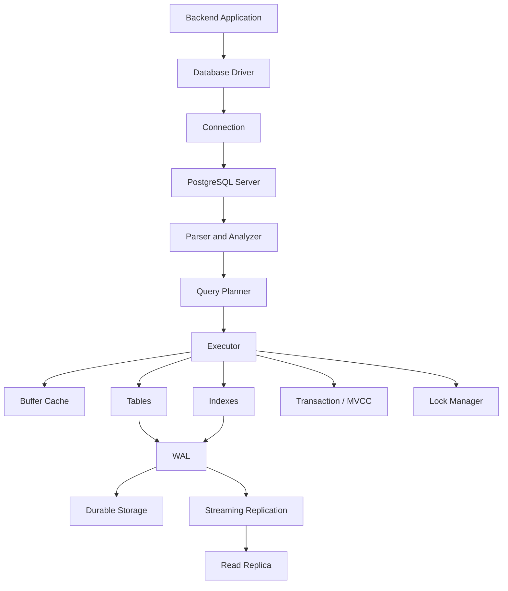
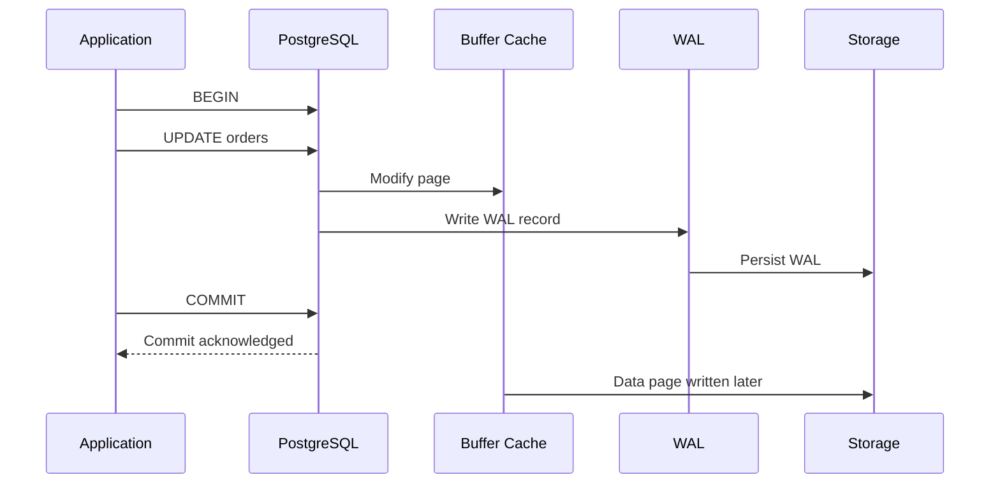
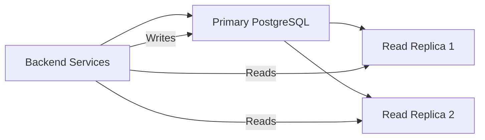
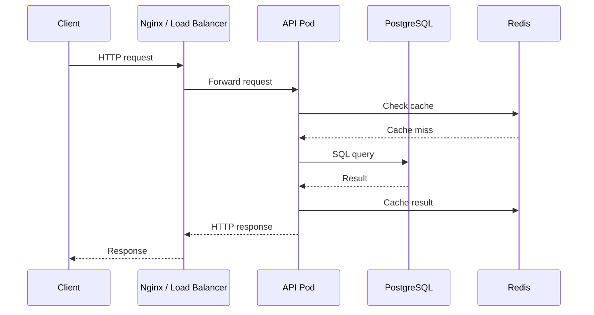

# 01- Relational Database Architecture

## Overview

Relational database architecture describes how a relational database organizes data, processes SQL, manages memory and storage, handles concurrent workloads, and exposes durable data to backend applications.

For a backend engineer, understanding the architecture is important because application behavior is directly affected by database internals:

```text
Application
    │
    │ SQL / ORM
    ▼
Database Connection
    │
    ▼
Query Processing
    │
    ├── Parser
    ├── Analyzer
    ├── Planner / Optimizer
    └── Executor
            │
            ▼
       Storage Engine
            │
            ├── Memory / Cache
            ├── Tables
            ├── Indexes
            └── WAL / Durable Storage
```

The exact implementation differs between database engines. This document uses PostgreSQL terminology where implementation details are database-specific.

A useful mental model is:

> The application sends SQL; the database transforms that request into an execution plan, accesses cached or durable data, enforces correctness, and returns a result.

Architecture knowledge helps explain problems that cannot be understood from SQL syntax alone:

- Why a query is slow
- Why an index is or is not being used
- Why connections become exhausted
- Why locks block requests
- Why memory configuration affects performance
- Why replication can lag
- Why transactions interact with storage and concurrency
- Why an apparently simple ORM query can produce expensive database work

---

## Relational Database Architecture at a Glance

A production relational database can be viewed as several cooperating layers:

| Layer | Responsibility |
|---|---|
| Client / Driver | Sends SQL and receives results |
| Connection Manager | Maintains client sessions and connections |
| Parser / Analyzer | Parses SQL and resolves database objects |
| Query Planner | Determines an execution strategy |
| Executor | Executes the selected plan |
| Buffer / Memory Layer | Caches frequently accessed data |
| Storage Layer | Reads and writes tables and indexes |
| Transaction Layer | Provides atomicity and isolation |
| Lock / Concurrency Layer | Coordinates concurrent operations |
| WAL / Recovery Layer | Provides crash recovery and durability |
| Replication Layer | Propagates changes to replicas |
| Monitoring Layer | Exposes runtime behavior and health |

These layers are logically distinct even though their exact implementation varies by database engine.

---

## High-Level Architecture



A query does not normally go directly from SQL text to disk.

A simplified path is:

```text
SQL
 ↓
Parse
 ↓
Analyze
 ↓
Plan
 ↓
Execute
 ↓
Memory / Cache
 ↓
Storage if required
 ↓
Result
```

---

## Application and Database Separation

A relational database is typically accessed through a database driver.

For Python:

```text
Django / FastAPI / SQLAlchemy
          │
          ▼
      DB Driver
          │
          ▼
      TCP Connection
          │
          ▼
      PostgreSQL
```

Examples of drivers include PostgreSQL-compatible Python drivers such as `psycopg`.

An ORM does not remove the database architecture. It generates SQL that eventually follows the same database execution path.

For example:

```python
users = User.objects.filter(
    is_active=True,
    email__endswith="@example.com",
)
```

may result in SQL resembling:

```sql
SELECT id, email, name
FROM users
WHERE is_active = true
  AND email LIKE '%@example.com';
```

The database, not Django, ultimately determines how that SQL is executed.

---

## Database Server Process Model

PostgreSQL uses a process-based architecture rather than treating the database as one single execution thread.

At a high level:

```text
PostgreSQL
│
├── Server processes
│   ├── Client backend processes
│   ├── Background writer
│   ├── Checkpointer
│   ├── WAL writer
│   ├── Autovacuum workers
│   └── Other background processes
│
├── Shared memory
│   ├── Shared buffers
│   ├── WAL buffers
│   └── Other shared structures
│
└── Data directory
    ├── Table storage
    ├── Index storage
    ├── WAL
    └── Metadata
```

The exact internal architecture is more detailed, but this model is useful for backend engineering decisions.

---

## Database Connections

A connection represents a communication session between an application and the database.

A typical request path is:

```text
API Request
    │
    ▼
Application worker
    │
    ▼
Acquire DB connection
    │
    ▼
Send SQL
    │
    ▼
PostgreSQL backend
    │
    ▼
Return result
    │
    ▼
Release connection
```

Connections are expensive relative to ordinary in-process function calls because they consume database and operating-system resources.

This is why production applications use connection pooling.

### Connection Pooling

```text
                    ┌─────────────┐
Request 1 ─────────►│             │
Request 2 ─────────►│ Connection  │
Request 3 ─────────►│    Pool     │
Request 4 ─────────►│             │
                    └──────┬──────┘
                           │
                  ┌────────┼────────┐
                  ▼        ▼        ▼
                 DB1      DB2      DB3
```

A pool allows application requests to reuse established database connections.

### Pool sizing

More connections do not automatically mean more throughput.

If the database can efficiently execute only a limited amount of concurrent work, an excessively large pool can increase:

- Context switching
- Memory consumption
- Lock contention
- CPU pressure
- Query queueing
- Overall latency

For Kubernetes deployments, total possible connections must account for all application replicas:

```text
Per-pod pool = 20
Pods = 10

Potential database connections = 200
```

The database must be sized for the aggregate, not one pod.

---

## Connection Pooling and PgBouncer

For PostgreSQL deployments with many application clients, an external pooler such as PgBouncer can reduce connection-management pressure.

A simplified architecture is:

```text
Application Pods
     │
     ├── connections
     ▼
  PgBouncer
     │
     ├── pooled DB sessions
     ▼
 PostgreSQL
```

Connection pooling can be performed:

- Inside the application
- Through an external pooler
- Through both, with careful configuration

Pooling strategy affects transaction behavior, session state, prepared statements, and connection limits.

---

## Query Processing Pipeline

A SQL statement passes through several conceptual stages.

```text
SQL Text
   │
   ▼
Parser
   │
   ▼
Analyzer
   │
   ▼
Planner / Optimizer
   │
   ▼
Execution Plan
   │
   ▼
Executor
   │
   ▼
Rows / Result
```

Each stage has a different responsibility.

---

## Parsing

The parser validates SQL syntax and transforms the SQL text into an internal representation.

For example:

```sql
SELECT id, email
FROM users
WHERE id = 42;
```

The parser identifies structures such as:

- `SELECT`
- Columns
- Table
- Predicate
- Literal value

A syntax error is detected at this stage.

Example:

```sql
SELEC id FROM users;
```

fails because the SQL syntax is invalid.

Parsing does not determine the most efficient way to access the data.

---

## Analysis and Semantic Resolution

After parsing, the database resolves references against the database catalog.

For example:

```sql
SELECT email
FROM users
WHERE id = 42;
```

The database must determine:

- Does `users` exist?
- Does `email` exist?
- Does `id` exist?
- What are their data types?
- Are permissions sufficient?

This stage transforms syntactically valid SQL into a semantically meaningful database operation.

---

## Query Planner and Optimizer

The planner determines how the query should execute.

For:

```sql
SELECT *
FROM orders
WHERE customer_id = 100;
```

possible strategies include:

```text
Sequential Scan
Index Scan
Bitmap Index Scan
```

The planner evaluates available information such as:

- Table statistics
- Estimated row counts
- Available indexes
- Predicate selectivity
- Join conditions
- Sort requirements
- Cost estimates

The objective is to select a plan with a low estimated execution cost.

---

## Query Execution Plan

Use PostgreSQL's `EXPLAIN` to inspect the planner's chosen strategy.

```sql
EXPLAIN
SELECT *
FROM orders
WHERE customer_id = 100;
```

For runtime behavior:

```sql
EXPLAIN (ANALYZE, BUFFERS)
SELECT *
FROM orders
WHERE customer_id = 100;
```

`EXPLAIN ANALYZE` actually executes the statement.

Use caution with:

```sql
EXPLAIN ANALYZE UPDATE ...
```

or:

```sql
EXPLAIN ANALYZE DELETE ...
```

because the operation is executed.

Understanding query plans is essential for diagnosing production SQL performance.

---

## Sequential Scan

A sequential scan reads table pages to find matching rows.

Conceptually:

```text
Table
 │
 ├── page 1 → inspect
 ├── page 2 → inspect
 ├── page 3 → inspect
 ├── page 4 → inspect
 └── ...
```

A sequential scan is not automatically bad.

For a small table:

```text
Table size = 100 rows
Matching rows = 80
```

scanning the table may be cheaper than traversing an index and fetching many table rows.

The optimizer chooses based on estimated cost.

---

## Index Scan

With a suitable index:

```text
Index
 │
 ├── key → row location
 │
 ▼
Table row
```

For example:

```sql
CREATE INDEX idx_orders_customer_id
ON orders(customer_id);
```

A query such as:

```sql
SELECT *
FROM orders
WHERE customer_id = 100;
```

may use the index.

Indexes are most valuable when they reduce the amount of data the executor needs to inspect.

---

## Why Indexes Are Not Free

Indexes improve reads but add costs to writes.

For:

```sql
INSERT INTO orders (...);
```

the database may need to update:

```text
orders table
orders.customer_id index
orders.created_at index
orders.status index
orders.user_id index
...
```

Therefore, excessive indexes can cause:

- Slower inserts
- Slower updates
- Larger storage requirements
- More cache pressure
- More maintenance overhead

Index design should be based on actual query patterns.

---

## Buffer Cache and Memory

Databases attempt to avoid unnecessary physical disk reads by caching frequently accessed data.

A simplified path is:

```text
Query
  │
  ▼
Executor
  │
  ▼
Buffer Cache
  │
  ├── Cache hit → use memory
  │
  └── Cache miss
          │
          ▼
       Storage
```

Memory access is substantially faster than storage access.

PostgreSQL's shared buffers are one part of its memory architecture. The operating-system page cache also plays an important role.

Performance therefore depends on more than database configuration alone.

---

## Tables and Pages

Relational database tables are stored physically in pages rather than as one continuous logical object.

Conceptually:

```text
Table
│
├── Page 1
│    ├── Row
│    ├── Row
│    └── Row
│
├── Page 2
│    ├── Row
│    ├── Row
│    └── Row
│
└── Page N
```

PostgreSQL commonly uses 8 KB pages.

Rows are stored within pages, and indexes reference table storage structures.

This page-oriented design explains why:

- Sequential access can be efficient
- Random I/O can be expensive
- Table bloat matters
- Index locality matters
- Large scans consume significant I/O bandwidth

---

## MVCC and Row Versions

PostgreSQL uses Multi-Version Concurrency Control (MVCC).

Instead of requiring readers and writers to block each other for every operation, PostgreSQL maintains row-version information that allows transactions to determine which versions are visible to them.

Conceptually:

```text
Row
 │
 ├── Version A
 │      visible to older transaction
 │
 └── Version B
        visible to newer transaction
```

This architecture is fundamental to PostgreSQL's concurrency model.

It also explains why long-running transactions can interfere with cleanup and why autovacuum is important.

---

## WAL and Durability

PostgreSQL uses Write-Ahead Logging (WAL).

The core principle is:

> Changes are recorded in WAL before the corresponding data pages are considered durably written.

Simplified flow:

```text
Application
    │
    ▼
Transaction
    │
    ├── Modify data
    │
    ▼
WAL record
    │
    ▼
Durable WAL
    │
    ▼
COMMIT acknowledged
    │
    ▼
Data pages persisted later
```

WAL provides the foundation for:

- Crash recovery
- Durability
- Point-in-time recovery
- Streaming replication

It also means write-heavy workloads can generate significant WAL volume.

---

## Checkpoints

A checkpoint establishes a recovery point from which PostgreSQL can reduce the amount of WAL that must be replayed after a crash.

Conceptually:

```text
WAL ───────────────────────────────────────►
          │                    │
          ▼                    ▼
      Checkpoint 1          Checkpoint 2
```

Checkpoint behavior affects:

- Recovery time
- I/O patterns
- Write performance
- WAL volume

Aggressive checkpointing can create additional I/O pressure, while overly long checkpoint intervals can increase recovery requirements.

Production tuning should be based on measured workload behavior.

---

## Crash Recovery

If the database crashes after WAL records have been persisted but before all modified data pages reach durable storage, PostgreSQL can replay WAL during recovery.

Simplified:

```text
Database crash
      │
      ▼
Read WAL
      │
      ▼
Replay required changes
      │
      ▼
Restore consistent state
      │
      ▼
Database available
```

This is one of the reasons WAL is central to database reliability.

---

## Autovacuum

MVCC creates old row versions that eventually need cleanup.

PostgreSQL's autovacuum processes help maintain tables and indexes and update statistics.

Conceptually:

```text
UPDATE row
   │
   ▼
new row version
   │
   └── old version remains temporarily
             │
             ▼
         VACUUM
             │
             ▼
     reclaim reusable space
```

Autovacuum also performs important maintenance such as:

- Removing obsolete row versions
- Updating planner statistics through auto-analyze
- Helping control table and index growth

Long-running transactions can prevent cleanup of versions still potentially visible to active transactions.

---

## Transaction and Storage Interaction

A transaction touches multiple architectural components.



The exact low-level timing depends on configuration and workload, but the architecture illustrates why a committed transaction can be durable before every modified table page has been written to its final storage location.

---

## Read and Write Paths

### Read path

```text
Application
    │
    ▼
SQL
    │
    ▼
Planner
    │
    ▼
Executor
    │
    ▼
Buffer cache
    │
    ├── Hit → return data
    │
    └── Miss → storage read
                  │
                  ▼
              cache page
                  │
                  ▼
              return data
```

### Write path

```text
Application
    │
    ▼
SQL UPDATE/INSERT/DELETE
    │
    ▼
Executor
    │
    ├── Modify in-memory pages
    │
    └── Generate WAL
             │
             ▼
        durable WAL
             │
             ▼
           COMMIT
```

Understanding these paths helps explain why database performance is influenced by memory, I/O, WAL, indexes, transactions, and query plans simultaneously.

---

## Database Catalog

A relational database stores metadata about its own objects.

The catalog contains information about:

- Tables
- Columns
- Data types
- Indexes
- Constraints
- Functions
- Permissions
- Statistics
- Other database objects

PostgreSQL exposes catalog information through system catalogs and information-schema views.

For example:

```sql
SELECT
    table_name,
    column_name,
    data_type
FROM information_schema.columns
WHERE table_schema = 'public'
  AND table_name = 'orders';
```

Understanding metadata is useful for migrations, database tooling, diagnostics, and automation.

---

## Storage Architecture

A production PostgreSQL deployment commonly involves:

```text
Application
     │
     ▼
PostgreSQL
     │
     ├── Shared memory
     │
     ├── Table files
     ├── Index files
     ├── WAL
     └── Temporary files
             │
             ▼
        Block storage
```

On AWS, PostgreSQL may run on managed services such as Amazon RDS for PostgreSQL or Amazon Aurora PostgreSQL-Compatible Edition.

The application normally should not manage the underlying storage mechanics directly in managed deployments, but engineers still need to understand their implications.

---

## Primary and Read Replica Architecture

Read replicas can scale read-heavy workloads.



The primary generally handles writes, while replicas replay changes from the primary.

A critical consequence is that replicas can lag.

Therefore:

```text
Write to primary
      ↓
Immediate read from replica
      ↓
Possibly stale result
```

Do not send consistency-sensitive reads to a replica without understanding the application's consistency requirements.

Examples include:

- Immediately reading a newly created order
- Checking a just-updated account balance
- Authorization decisions based on newly committed permissions

---

## Read/Write Routing

A backend service may use separate database connections:

```text
Application
    │
    ├── Write connection ──► Primary
    │
    └── Read connection ───► Replica
```

However, read routing should be deliberate.

Good candidates for replicas:

- Analytics queries
- Search-like reads where slight staleness is acceptable
- Reporting
- Non-critical dashboards

Poor candidates:

- Read-after-write workflows
- Financial state
- Authorization-sensitive reads
- Strongly consistent workflow transitions

---

## Horizontal Scaling Limitations

Relational databases can scale vertically very effectively:

```text
More CPU
More RAM
Faster storage
Higher IOPS
```

But eventually the workload may require horizontal techniques:

```text
Primary
  │
  ├── Read Replica
  ├── Read Replica
  └── Read Replica
```

For larger systems, additional strategies may include:

- Partitioning
- Read replicas
- Connection pooling
- Query optimization
- Caching
- Sharding
- Workload separation

Sharding introduces substantial application and operational complexity and should not be the first response to a poorly optimized query.

---

## Partitioning

Partitioning divides a logical table into multiple physical partitions.

For example:

```text
orders
│
├── orders_2025
├── orders_2026
└── orders_2027
```

A query constrained by the partition key may avoid scanning irrelevant partitions.

Partitioning can help with:

- Very large tables
- Time-based retention
- Data lifecycle management
- Partition-level maintenance
- Certain query patterns

Partitioning is not automatically a performance optimization. The partitioning key and workload must align with actual access patterns.

---

## Sharding

Sharding distributes data across independent database instances.

Conceptually:

```text
Application
     │
     ▼
Shard Router
     │
     ├── Shard 1
     ├── Shard 2
     ├── Shard 3
     └── Shard 4
```

A shard key determines where a record belongs.

For example:

```text
hash(user_id) % 4
```

could determine the shard.

Sharding can increase aggregate capacity but introduces difficult problems:

- Cross-shard queries
- Cross-shard transactions
- Rebalancing
- Hot shards
- Global uniqueness
- Operational complexity
- Backup and recovery coordination

Use it only when simpler scaling approaches are insufficient.

---

## Caching and Relational Databases

Redis can reduce repeated database reads:

```text
Application
    │
    ▼
Redis
    │
    ├── Cache hit → response
    │
    └── Cache miss
            │
            ▼
        PostgreSQL
            │
            ▼
        Redis SET
```

Caching should not obscure the database's role as the authoritative source unless the architecture intentionally makes another system authoritative.

Important cache concerns include:

- TTL
- Invalidation
- Stampede protection
- Memory limits
- Serialization
- Stale data
- Failure behavior

Caching should be introduced after identifying the actual bottleneck.

---

## Connection Pooling vs Caching

These solve different problems.

| Mechanism | Primary Purpose |
|---|---|
| Connection pool | Reduce connection-management overhead |
| Database buffer cache | Reduce physical storage reads |
| Redis cache | Reduce repeated database/application work |
| Read replica | Scale read workload |
| Index | Reduce rows/pages examined |
| Query optimization | Reduce execution cost |

They should not be treated as interchangeable performance solutions.

---

## Backend Request Lifecycle

A typical API request might follow:



The database architecture therefore becomes part of end-to-end API latency.

A slow request can originate from:

```text
Application code
    ↓
Connection acquisition
    ↓
Network latency
    ↓
Query planning
    ↓
Lock waiting
    ↓
CPU
    ↓
Memory
    ↓
Storage I/O
    ↓
Result transfer
```

Performance analysis should examine the complete path.

---

## ORM Architecture

ORMs such as Django ORM and SQLAlchemy provide application-level abstractions over SQL.

```text
Python code
    │
    ▼
ORM
    │
    ▼
Generated SQL
    │
    ▼
Database driver
    │
    ▼
PostgreSQL
    │
    ▼
Query planner
    │
    ▼
Execution
```

ORM abstraction does not eliminate SQL knowledge.

Backend engineers should still understand:

- Generated SQL
- Joins
- Indexes
- Query plans
- Transactions
- Locking
- N+1 queries
- Connection usage

For example, Django:

```python
orders = (
    Order.objects
    .select_related("customer")
    .filter(status="pending")
)
```

can avoid unnecessary additional queries for related data.

---

## Architecture and Performance

A production database architecture should be evaluated across several dimensions.

| Dimension | Questions |
|---|---|
| CPU | Is query execution CPU-bound? |
| Memory | Are useful pages staying cached? |
| Storage | Is the workload I/O-bound? |
| Network | Are result sets unnecessarily large? |
| Connections | Is the pool exhausting database capacity? |
| Locks | Are transactions blocking each other? |
| WAL | Is the workload generating excessive write volume? |
| Replication | Are replicas keeping up? |
| Queries | Are execution plans efficient? |
| Schema | Do indexes and constraints match workload requirements? |

Database performance is therefore a systems problem, not simply a SQL syntax problem.

---

## High Availability

A production relational architecture typically includes redundancy:

```text
                    ┌───────────────┐
                    │   Application │
                    └───────┬───────┘
                            │
                            ▼
                     ┌─────────────┐
                     │ DB Endpoint │
                     └──────┬──────┘
                            │
                     ┌──────▼──────┐
                     │   Primary   │
                     └──────┬──────┘
                            │
                    replication
                            │
                  ┌─────────┴─────────┐
                  ▼                   ▼
             Standby / Replica   Read Replica
```

High availability requires more than having a replica.

Consider:

- Automatic failover
- Health checks
- DNS or endpoint management
- Application reconnect behavior
- Connection pool recovery
- Replication monitoring
- Backup verification
- Recovery testing

---

## Security Architecture

Database architecture should enforce multiple security boundaries.

```text
Internet
   │
   ▼
Load Balancer / Nginx
   │
   ▼
Application
   │
   ▼
Private Database Network
   │
   ▼
PostgreSQL
```

Production databases should generally not be directly exposed to the public internet.

Important controls include:

- Private networking
- Security groups / firewall rules
- TLS connections
- Least-privilege database users
- Secret management
- Credential rotation
- Encryption at rest
- Encryption in transit
- Database auditing
- Parameterized queries

On AWS, database credentials should generally be managed through an appropriate secret-management mechanism rather than hard-coded into Docker images or source repositories.

---

## Reliability and Disaster Recovery

Database architecture should define recovery objectives.

| Concept | Meaning |
|---|---|
| RPO | Maximum acceptable amount of data loss |
| RTO | Maximum acceptable recovery time |
| Backup | Recoverable copy of database state |
| Replication | Maintains another database copy |
| PITR | Restore to a specific point in time |
| Failover | Switch service to another database instance |

Replication should not be considered a replacement for backups.

A production PostgreSQL system should have:

```text
Primary
  │
  ├── Replication
  │
  ├── WAL
  │
  └── Backups
          │
          ▼
       Recovery
```

Recovery procedures should be tested rather than assumed to work.

---

## Observability

Database architecture should be observable at both infrastructure and query levels.

Monitor:

### Database health

- CPU utilization
- Memory pressure
- Storage utilization
- IOPS
- Storage latency
- Connection count
- Connection saturation

### Query performance

- Query latency
- Slow queries
- Query throughput
- Execution plans
- Sequential scans
- Index usage
- Temporary file usage

### Concurrency

- Lock waits
- Deadlocks
- Active transactions
- Long-running transactions
- Idle-in-transaction sessions

### Replication

- Replica lag
- WAL generation
- Replay delay
- Replication failures

### Application

- DB pool utilization
- Connection acquisition latency
- N+1 query patterns
- Request latency
- Database error rates

---

## Common Architecture Mistakes

### Treating the Database as a Black Box

**Problem:** Developers optimize application code without understanding query plans, indexes, locks, or connection behavior.

**Better approach:** Treat the database as an active execution engine and inspect actual SQL and execution plans.

---

### Increasing Connection Pool Size Indefinitely

**Problem:** More application workers create more database connections.

**Why it fails:** Database CPU, memory, locks, and internal resources become saturated.

**Better approach:** Size connections based on database capacity and measured concurrency.

---

### Adding Indexes for Every Query

**Problem:** Every slow query receives another index.

**Why it fails:** Indexes increase write cost and storage requirements.

**Better approach:** Analyze query patterns and execution plans before adding indexes.

---

### Assuming a Replica Is Immediately Consistent

**Problem:** An application writes to the primary and immediately reads from a replica.

**Why it fails:** Replication may lag.

**Better approach:** Route consistency-sensitive reads appropriately.

---

### Using Redis to Hide Poor SQL

**Problem:** A cache is added before understanding why PostgreSQL is slow.

**Why it fails:** The underlying query may still be expensive on cache misses and may introduce invalidation complexity.

**Better approach:** Measure first; optimize SQL, indexes, schema, and access patterns before adding caching.

---

### Treating Vertical Scaling as the Only Solution

**Problem:** More CPU and RAM are continuously added.

**Why it fails:** The workload may be limited by query design, contention, I/O, or connection pressure.

**Better approach:** Identify the actual bottleneck before scaling the database.

---

### Ignoring Long-Running Transactions

**Problem:** Transactions remain open for long periods.

**Why it matters:** PostgreSQL MVCC cleanup and lock behavior can be affected.

**Better approach:** Monitor transaction age and eliminate unnecessary transaction duration.

---

### Assuming ORM Abstraction Removes Database Complexity

**Problem:** Engineers optimize Python code while ignoring generated SQL.

**Better approach:** Inspect SQL, query counts, indexes, and execution plans.

---

## Production Architecture Checklist

Before deploying a relational database-backed service, verify:

### Application layer

- Connection pooling is configured.
- Pool size accounts for all application replicas.
- Query timeouts are defined.
- Transactions have explicit boundaries.
- ORM-generated SQL is understood for critical paths.

### Database layer

- Appropriate indexes exist.
- Constraints enforce critical invariants.
- Query plans are validated for important workloads.
- Autovacuum is healthy.
- Storage capacity has sufficient headroom.
- Connection limits are understood.

### Reliability

- Automated backups are configured.
- Point-in-time recovery is available where required.
- Replication is monitored.
- Failover procedures are documented.
- Recovery procedures are tested.

### Security

- Database is privately accessible.
- TLS is enabled where appropriate.
- Credentials are stored securely.
- Database roles follow least privilege.
- Application queries are parameterized.

### Observability

- Query latency is monitored.
- Lock contention is visible.
- Connection usage is monitored.
- Replication lag is measured.
- Slow queries can be identified.
- Database health is integrated into application observability.

---

## Architecture Decision Framework

When designing a relational database architecture, reason from workload characteristics.

```text
Workload
   │
   ├── Read-heavy?
   │      ├── Optimize queries/indexes
   │      ├── Cache
   │      └── Read replicas
   │
   ├── Write-heavy?
   │      ├── Optimize indexes
   │      ├── Batch writes
   │      └── Scale database resources
   │
   ├── Very large tables?
   │      ├── Partitioning
   │      └── Lifecycle management
   │
   ├── High concurrency?
   │      ├── Transaction design
   │      ├── Lock analysis
   │      └── Connection management
   │
   └── Beyond single-instance capacity?
          ├── Read scaling
          ├── Workload separation
          └── Sharding only when justified
```

The architecture should evolve from measured constraints rather than anticipated scale alone.

---

## Interview Traps

### "Does an index always make a query faster?"

No. For small tables or low-selectivity predicates, a sequential scan may be cheaper.

### "Does adding more database connections increase throughput?"

Not necessarily. Excessive concurrency can increase contention and resource pressure.

### "Why does PostgreSQL need VACUUM?"

Because MVCC creates obsolete row versions that require maintenance and cleanup.

### "What is WAL used for?"

WAL supports durability and crash recovery and forms the foundation for PostgreSQL replication and point-in-time recovery.

### "Can a read replica always serve reads?"

Only if the application's consistency requirements tolerate replication lag.

### "Does an ORM eliminate the need to understand SQL?"

No. The database executes SQL generated by the ORM, so critical application paths still require SQL and execution-plan knowledge.

### "Why isn't a large number of indexes always beneficial?"

Indexes improve some reads but increase write amplification, storage usage, cache pressure, and maintenance cost.

### "What happens when a transaction stays open for a long time?"

It can retain transaction snapshots, hold locks, delay MVCC cleanup, consume connections, and increase operational pressure.

### "What is the difference between partitioning and sharding?"

Partitioning divides data within a database system into logical/physical partitions. Sharding distributes data across independent database instances or nodes and introduces substantially more distributed-systems complexity.

## Key Takeaways

- A relational database is an execution system composed of connections, query processing, planning, execution, memory, storage, transactions, concurrency control, WAL, and maintenance components.
- SQL performance depends on the complete execution path: query design, planner decisions, indexes, memory, storage, locks, connections, and workload characteristics.
- PostgreSQL's MVCC, WAL, autovacuum, and replication architecture directly affect backend transaction behavior, scalability, reliability, and recovery.
- Production architecture should combine appropriate connection management, indexing, caching, replication, security, observability, backups, and carefully chosen scaling strategies.
- Senior backend engineers should diagnose database bottlenecks from measured execution behavior rather than treating the database, ORM, cache, or connection pool as an isolated component.