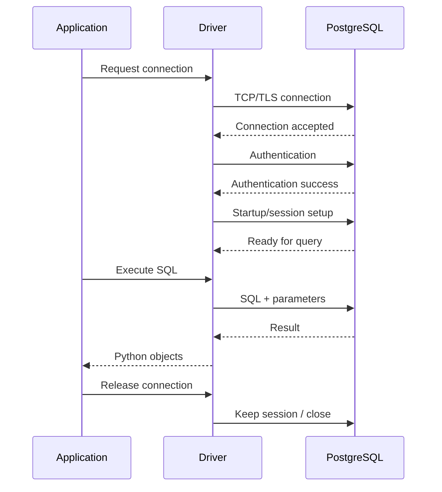
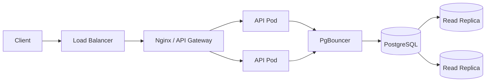

# 02- Database Server and Client Architecture

## Overview

A relational database system consists of more than the database itself. A production backend interacts with a database through a client stack that manages connections, authentication, protocol communication, query execution, transactions, and result delivery.

A useful architecture model is:

```text
┌──────────────────────────────┐
│       Backend Application    │
│                              │
│ Django / FastAPI / Worker    │
└──────────────┬───────────────┘
               │
               ▼
┌──────────────────────────────┐
│       Database Driver        │
│                              │
│ psycopg / SQLAlchemy / ORM   │
└──────────────┬───────────────┘
               │
               │ PostgreSQL wire protocol
               ▼
┌──────────────────────────────┐
│       PostgreSQL Server      │
│                              │
│ Connection / Session         │
│ Parser / Planner / Executor  │
│ Transaction / Lock Manager   │
│ Memory / Storage / WAL       │
└──────────────┬───────────────┘
               │
               ▼
        Persistent Storage
```

Understanding this separation is important because many backend performance and reliability problems originate outside SQL syntax itself:

- Database connection exhaustion
- Poor connection-pool configuration
- Network latency
- Excessive query round trips
- Long-running transactions
- Inefficient query execution
- Incorrect client-side timeout configuration
- Authentication or TLS failures
- Application workers creating too many database sessions

The key mental model is:

> The database client is the application's interface to the database server; the server owns SQL execution, transactions, concurrency, storage, and durability.

---

## Client-Server Model

A relational database normally follows a client-server architecture.

```text
Client
  │
  │ SQL / protocol messages
  ▼
Database Server
  │
  ├── Parse
  ├── Plan
  ├── Execute
  ├── Manage transactions
  ├── Manage locks
  └── Access storage
  │
  ▼
Client
  │
  │ Result
  ▼
Application
```

The client does not normally read database files directly.

Instead:

1. The application creates or obtains a database connection.
2. The client driver communicates with the database server.
3. The server authenticates the connection.
4. The application sends SQL.
5. PostgreSQL parses and plans the statement.
6. PostgreSQL executes the statement.
7. Results are returned through the database protocol.
8. The application processes the result.

This separation allows multiple applications and tools to access the same database while keeping database storage and execution under server control.

---

## Database Client

A database client is software that communicates with the database server.

Examples include:

- Python database drivers
- ORMs
- CLI clients
- Database administration tools
- Migration tools
- BI tools
- Application services

For PostgreSQL:

```text
Python Application
       │
       ▼
Django ORM / SQLAlchemy
       │
       ▼
psycopg
       │
       ▼
PostgreSQL protocol
       │
       ▼
PostgreSQL server
```

The client is responsible for tasks such as:

- Opening connections
- Authentication negotiation
- Sending SQL
- Sending parameters
- Receiving result sets
- Handling protocol errors
- Managing transactions at the application level
- Closing or returning connections to a pool

The client does **not** replace the database server's query planner or storage engine.

---

## Database Driver

A database driver is the low-level library that communicates with the database.

A Python PostgreSQL application might use:

```python
import psycopg

with psycopg.connect(
    "dbname=app user=app_user password=secret host=db.example.internal"
) as conn:
    with conn.cursor() as cursor:
        cursor.execute(
            "SELECT id, email FROM users WHERE id = %s",
            (42,),
        )
        user = cursor.fetchone()
```

The driver translates application-level operations into PostgreSQL protocol messages and converts database results into Python objects.

### Driver responsibilities

| Responsibility | Example |
|---|---|
| Connection | Open PostgreSQL session |
| Authentication | Perform configured authentication |
| Protocol | Exchange PostgreSQL messages |
| Parameters | Bind query parameters |
| Results | Convert database values to Python values |
| Errors | Expose database exceptions |
| Transactions | Send transaction commands / manage transaction state |
| TLS | Establish encrypted connections where configured |

The driver is a critical part of the application-to-database path.

---

## ORM Architecture

An ORM introduces another abstraction layer.

For Django:

```text
Python code
    │
    ▼
Django ORM
    │
    ▼
Generated SQL
    │
    ▼
Database Driver
    │
    ▼
PostgreSQL Protocol
    │
    ▼
PostgreSQL
```

Example:

```python
users = User.objects.filter(
    is_active=True,
).order_by("-created_at")[:100]
```

The ORM generates SQL conceptually similar to:

```sql
SELECT id, email, created_at
FROM users
WHERE is_active = true
ORDER BY created_at DESC
LIMIT 100;
```

The database then decides how to execute the SQL.

This distinction matters because an ORM abstraction does not eliminate database-level performance concerns.

---

## Database CLI Clients

A CLI client such as `psql` is another database client.

```bash
psql \
  --host=db.example.internal \
  --port=5432 \
  --username=app_user \
  --dbname=app
```

Once connected:

```sql
SELECT current_database();

SELECT version();

SELECT *
FROM users
LIMIT 10;
```

Useful `psql` commands include:

```text
\conninfo
\dt
\d users
\di
\du
```

The CLI is useful for:

- Diagnostics
- Query testing
- Schema inspection
- Incident investigation
- Administrative operations

Production database access should still follow organizational security and access-control policies.

---

## Database Server

The database server is the process or service responsible for executing database operations.

For PostgreSQL, the server manages:

- Client connections
- Authentication
- SQL parsing
- Query planning
- Query execution
- Transactions
- MVCC
- Locks
- Memory
- Tables
- Indexes
- WAL
- Recovery
- Replication
- Background maintenance

Conceptually:

```text
PostgreSQL Server
│
├── Client Connections
│
├── Query Processing
│   ├── Parser
│   ├── Analyzer
│   ├── Planner
│   └── Executor
│
├── Transaction Management
│
├── Concurrency Control
│
├── Memory Management
│
├── Storage
│
├── WAL / Recovery
│
├── Replication
│
└── Background Maintenance
```

---

## Connection Lifecycle

A typical database connection has a lifecycle:



In a pooled application, "release" usually means returning the connection to the pool rather than closing the physical database connection.

---

## TCP Connection

PostgreSQL clients communicate with the server over a network connection.

A simplified path is:

```text
Application
    │
    ▼
Database Driver
    │
    ▼
TCP
    │
    ▼
TLS, if enabled
    │
    ▼
PostgreSQL Wire Protocol
    │
    ▼
PostgreSQL Server
```

In a Kubernetes environment:

```text
API Pod
  │
  ▼
Kubernetes Service / DNS
  │
  ▼
Database endpoint
  │
  ▼
PostgreSQL
```

For managed AWS databases:

```text
Application VPC
      │
      ▼
Private database endpoint
      │
      ▼
RDS / Aurora PostgreSQL
```

Network latency becomes part of query latency, especially when an application executes many small queries.

---

## Query Round Trips

Consider:

```python
user = get_user()
orders = get_orders(user.id)
items = get_order_items(orders)
```

This may create several network round trips:

```text
Application
   │
   ├── Query 1 ─────► Database
   │◄──────────────── Result
   │
   ├── Query 2 ─────► Database
   │◄──────────────── Result
   │
   └── Query 3 ─────► Database
      ◄────────────── Result
```

Even if each SQL query executes quickly, network round trips and application/database coordination add latency.

This is one reason techniques such as:

- Joins
- `select_related()`
- `prefetch_related()`
- Batch queries
- Appropriate eager loading
- Set-based SQL

matter in backend systems.

---

## N+1 Query Problem

A classic ORM problem is:

```python
orders = Order.objects.all()

for order in orders:
    print(order.customer.email)
```

Depending on ORM behavior, this can produce:

```text
1 query → retrieve orders
N queries → retrieve each customer
```

For 10,000 orders:

```text
1 + 10,000 queries
```

A better Django approach may be:

```python
orders = (
    Order.objects
    .select_related("customer")
    .all()
)
```

This can reduce the operation to a query using a join.

The general principle is:

> Minimize unnecessary client-server round trips, not merely the number of lines of application code.

---

## Prepared Statements and Parameter Binding

Applications should use parameterized queries.

Safe:

```python
cursor.execute(
    """
    SELECT id, email
    FROM users
    WHERE email = %s
    """,
    (email,),
)
```

Avoid:

```python
cursor.execute(
    f"SELECT id, email FROM users WHERE email = '{email}'"
)
```

Parameter binding provides:

- SQL injection protection
- Correct value escaping
- Better separation between SQL and data
- Potential statement reuse depending on client/server behavior

Prepared statements and parameter binding are related but not identical concepts. Driver behavior determines how statements are prepared and reused.

---

## Authentication

Before accepting database operations, PostgreSQL authenticates the client.

Authentication configuration can involve:

- Username
- Password
- Certificate authentication
- SCRAM
- TLS
- Host-based access rules

PostgreSQL uses `pg_hba.conf` to define host-based authentication rules.

Conceptually:

```text
Client
  │
  ▼
Connection request
  │
  ▼
pg_hba.conf rules
  │
  ├── reject
  │
  └── authenticate
          │
          ▼
      PostgreSQL session
```

Authentication answers:

> Who are you?

Authorization answers:

> What are you allowed to do?

These are separate concerns.

---

## Authorization and Roles

PostgreSQL uses roles and privileges to control access.

Example:

```sql
CREATE ROLE app_readonly LOGIN PASSWORD 'managed-secret';

GRANT CONNECT ON DATABASE app TO app_readonly;
GRANT USAGE ON SCHEMA public TO app_readonly;
GRANT SELECT ON ALL TABLES IN SCHEMA public TO app_readonly;
```

Production applications should normally use a database role with only the permissions required by the service.

Avoid using highly privileged administrative accounts from application code.

---

## TLS and Database Security

Database traffic may contain:

- User data
- Authentication information
- Business records
- Financial information
- Session state

When traffic crosses a network boundary, TLS should be considered part of the security architecture.

```text
Application
     │
     │ encrypted connection
     ▼
PostgreSQL
```

Security considerations include:

- TLS configuration
- Certificate verification
- Secret management
- Credential rotation
- Private networking
- Least-privilege roles
- Network access controls

Do not disable certificate verification merely to make development connectivity work in production.

---

## Session State

A database connection represents a session with server-side state.

Examples include:

- Current database
- Current user
- Session parameters
- Transaction state
- Temporary objects
- Prepared statements
- Advisory locks

This matters when using connection pools.

A connection returned to a pool may retain session-level state unless the pooling layer or application resets it appropriately.

Avoid relying on accidental session state.

For example, application code should not assume that a connection always has a particular transaction isolation level unless that state is explicitly configured.

---

## Connection Pooling

Opening a new database connection for every request is inefficient.

Without pooling:

```text
Request
  │
  ├── Open connection
  ├── Authenticate
  ├── Execute query
  ├── Close connection
  │
  ▼
Response
```

With pooling:

```text
Application
     │
     ▼
Connection Pool
     │
     ├── Connection 1
     ├── Connection 2
     ├── Connection 3
     └── Connection N
             │
             ▼
        PostgreSQL
```

The application borrows an existing connection and returns it when finished.

### Advantages

- Lower connection establishment overhead
- Better connection reuse
- Predictable database connection limits
- Lower authentication overhead
- Better application throughput

### Risks

- Pool exhaustion
- Incorrect pool sizing
- Stale connections
- Leaked connections
- Session-state leakage
- Excessive aggregate connections

---

## Connection Pool Sizing

Suppose:

```text
Application replicas = 10
Pool size per replica = 20
```

The theoretical maximum is:

```text
10 × 20 = 200 database connections
```

This does not mean PostgreSQL should necessarily support 200 active queries.

A database has finite:

- CPU
- Memory
- I/O
- Locking capacity
- Connection-management capacity

A common production mistake is increasing application pool sizes when the database itself is saturated.

The correct question is:

> How much concurrency can the database process efficiently?

---

## PgBouncer

For PostgreSQL systems with many application clients, PgBouncer can provide centralized connection pooling.

```text
┌───────────────┐
│ Application A │
├───────────────┤
│ Application B │
├───────────────┤
│ Application C │
└───────┬───────┘
        │
        ▼
┌────────────────┐
│   PgBouncer    │
│ Connection Pool│
└───────┬────────┘
        │
        ▼
┌────────────────┐
│   PostgreSQL   │
└────────────────┘
```

Pooling modes have different semantics.

| Mode | Connection Lifetime |
|---|---|
| Session pooling | Server connection assigned for client session |
| Transaction pooling | Server connection assigned per transaction |
| Statement pooling | Server connection assigned per statement |

Transaction and statement pooling can affect features that depend on session state.

For example:

- Temporary tables
- Session variables
- Prepared statements
- Session-level advisory locks

Pooling configuration must therefore match application behavior.

---

## Transactions and Client Connections

Transactions are associated with a database session/connection.

A simplified lifecycle is:

```text
Acquire connection
      │
      ▼
BEGIN
      │
      ├── SQL
      ├── SQL
      ├── SQL
      │
      ▼
COMMIT / ROLLBACK
      │
      ▼
Release connection
```

An application must not return a connection to a pool while an unintended transaction remains open.

This is particularly important with:

```text
idle in transaction
```

sessions.

Long-lived open transactions can:

- Hold locks
- Retain snapshots
- Interfere with MVCC cleanup
- Occupy connections
- Increase operational risk

---

## Client Timeouts

Timeouts should exist at multiple layers.

Potential timeout categories include:

| Timeout | Purpose |
|---|---|
| Connection timeout | Limit time spent establishing connection |
| Query timeout | Prevent excessively long statements |
| Lock timeout | Limit waiting for a lock |
| Transaction timeout | Limit transaction duration where supported |
| Application request timeout | Bound end-to-end request latency |
| Pool acquisition timeout | Limit waiting for a free connection |

A useful architecture is:

```text
Client request deadline
        │
        ├── Pool acquisition
        │
        ├── Connection
        │
        ├── Query execution
        │
        └── Application processing
```

Timeouts should be coordinated rather than independently configured with contradictory values.

---

## Query Result Transfer

The server may produce a large result set:

```sql
SELECT *
FROM events;
```

If the table contains millions of rows, transferring all results to the application can consume:

- Database CPU
- Database memory/work buffers
- Network bandwidth
- Application memory
- Serialization time
- Request latency

Prefer bounded queries:

```sql
SELECT id, event_type, created_at
FROM events
ORDER BY id
LIMIT 1000;
```

For large processing jobs, use batching, pagination, streaming where appropriate, or server-side cursors depending on the driver and workload.

---

## Client-Side and Server-Side Work

A useful boundary is:

```text
Application
    │
    │ Business logic
    │ API orchestration
    │ Presentation
    │
    ▼
Database
    │
    │ Set-based data processing
    │ Filtering
    │ Joining
    │ Aggregation
    │ Constraints
    │ Transactions
    ▼
Storage
```

Do not move large relational operations into Python simply because the ORM makes it easy.

For example, prefer:

```sql
SELECT customer_id, COUNT(*)
FROM orders
GROUP BY customer_id;
```

over fetching every order into Python and counting them manually.

The database is optimized for set-based operations.

---

## Network Topology

A production deployment might look like:



Not every system requires PgBouncer or replicas, but the diagram illustrates the separation between:

- Client traffic
- Application traffic
- Database connection management
- Primary database
- Read replicas

Network design affects both latency and security.

---

## Kubernetes Considerations

In Kubernetes, every application replica can create database connections.

Suppose:

```text
Deployment replicas = 15
DB pool max = 10
```

Potential connections:

```text
15 × 10 = 150
```

A deployment scaling event can therefore increase database connections rapidly:

```text
10 pods
   ↓
20 pods
   ↓
database connections approximately double
```

This creates an important coupling between:

- Kubernetes autoscaling
- Application worker count
- Database pool size
- PostgreSQL `max_connections`
- Database CPU and memory capacity

Autoscaling the application without accounting for database capacity can overload PostgreSQL.

---

## Application Workers and Connections

Suppose a Python service uses:

```text
8 worker processes
pool size = 5
```

The possible connection count may be approximately:

```text
8 × 5 = 40
```

For a Kubernetes deployment:

```text
worker processes
       ×
pod replicas
       ×
connections per process
       =
potential database connections
```

The exact behavior depends on the framework and pooling implementation, but the capacity-planning principle remains important.

---

## Database Connection Leaks

A connection leak occurs when application code acquires a connection and fails to release it correctly.

Symptoms include:

```text
Connection pool utilization → 100%
        ↓
Requests waiting for connection
        ↓
Request latency increases
        ↓
Timeouts
```

Typical causes include:

- Missing cleanup
- Unhandled exceptions
- Incorrect transaction management
- Long-running background tasks
- Holding connections across network calls
- Misconfigured ORM lifecycle

Framework-managed connection handling should be preferred where possible.

---

## Connection Lifetime and Failover

Database connections can become invalid after:

- Database restart
- Failover
- Network interruption
- Infrastructure changes
- Idle connection termination

Applications should be capable of detecting broken connections and establishing new ones.

A pooled architecture should therefore account for:

```text
Connection failure
      │
      ▼
Detect stale/broken connection
      │
      ▼
Discard connection
      │
      ▼
Establish replacement
      │
      ▼
Retry only when operation semantics allow
```

Do not blindly retry non-idempotent database operations after an uncertain failure.

---

## Read Replicas and Client Architecture

Applications that use replicas may have separate connection targets:

```text
                  Application
                 /           \
                /             \
           Write pool       Read pool
               │                │
               ▼                ▼
            Primary          Replica
```

A read replica can scale reads, but replication is asynchronous in common PostgreSQL streaming-replication architectures.

Therefore:

```text
Write primary
     │
     ▼
Replica replay
     │
     ▼
Read replica
```

introduces potential replication lag.

Client-side routing should consider consistency requirements.

---

## Connection Pooling and Transactions

Transaction pooling can introduce subtle behavior.

Consider:

```text
BEGIN
  ↓
Query
  ↓
Query
  ↓
COMMIT
```

All statements in the transaction must use the same database session.

A pooler operating at transaction level can support this because a server connection is assigned for the duration of the transaction.

However, session-specific state outside the transaction may not persist across assignments.

This distinction becomes important when applications depend on:

- Temporary tables
- Session parameters
- Prepared statements
- Session-level advisory locks

---

## Monitoring the Client-Server Boundary

Observability should cover both sides.

### Application metrics

Track:

- Connection pool utilization
- Pool acquisition latency
- Active connections
- Idle connections
- Query latency
- Database error rate
- Transaction duration
- Query count per request

### PostgreSQL metrics

Track:

- Active sessions
- Connection count
- CPU
- Memory
- I/O
- Lock waits
- Deadlocks
- Long-running transactions
- Slow queries
- WAL generation
- Replication lag

A useful correlation is:

```text
API latency
    │
    ├── connection acquisition time
    ├── network time
    ├── query execution time
    ├── lock wait time
    └── result transfer time
```

Without this breakdown, database latency can be incorrectly attributed to SQL execution alone.

---

## Diagnosing Connection Exhaustion

Start from the application:

```text
Are requests waiting for a connection?
        │
        ▼
Is pool utilization near maximum?
        │
        ▼
Are connections held too long?
        │
        ▼
Are transactions long-running?
        │
        ▼
Is database query latency high?
        │
        ▼
Is PostgreSQL itself connection-limited?
```

On PostgreSQL:

```sql
SELECT
    state,
    count(*)
FROM pg_stat_activity
GROUP BY state
ORDER BY count(*) DESC;
```

Inspect active sessions:

```sql
SELECT
    pid,
    usename,
    application_name,
    client_addr,
    state,
    xact_start,
    query_start,
    wait_event_type,
    wait_event,
    query
FROM pg_stat_activity
ORDER BY query_start;
```

This can help distinguish:

- Active queries
- Idle connections
- Idle-in-transaction sessions
- Lock waits

---

## Security Architecture

A production client-server deployment should generally keep the database behind a private network boundary.

```text
Internet
   │
   ▼
Load Balancer
   │
   ▼
Application Subnet
   │
   ▼
Private Database Subnet
   │
   ▼
PostgreSQL
```

Recommended controls include:

- Private database endpoints
- Network security groups/firewall rules
- TLS
- Strong authentication
- Least-privilege database roles
- Managed secrets
- Credential rotation
- Audit logging
- Restricted administrative access

The database should not normally be directly reachable from arbitrary internet clients.

---

## AWS Architecture

A managed AWS PostgreSQL deployment may look like:

```text
                    AWS VPC
┌────────────────────────────────────────────┐
│                                            │
│  Public / Edge                             │
│       │                                    │
│       ▼                                    │
│  Load Balancer                             │
│       │                                    │
│       ▼                                    │
│  Private Application Subnets               │
│       │                                    │
│       ├── API Pods                         │
│       ├── Celery Workers                   │
│       └── Other Services                   │
│                │                           │
│                ▼                           │
│        Connection Pooler                   │
│                │                           │
│                ▼                           │
│       Private Database Subnets             │
│                │                           │
│                ▼                           │
│        RDS / Aurora PostgreSQL             │
│                                            │
└────────────────────────────────────────────┘
```

The exact architecture depends on workload and AWS service selection, but the database should generally remain isolated from direct public traffic.

---

## High Availability

The client architecture must account for database failover.

During failover:

```text
Application
    │
    ▼
Database endpoint
    │
    X Primary unavailable
    │
    ▼
New primary
```

Existing connections may become invalid.

A resilient application should:

- Detect connection failures
- Re-establish connections
- Respect request deadlines
- Retry safe operations
- Preserve idempotency
- Avoid retry storms

Connection pooling must also be configured to recover from failed backend connections.

---

## Disaster Recovery

Database clients should not be responsible for database backups, but application architecture should account for recovery behavior.

Important considerations include:

- Backup strategy
- Point-in-time recovery
- Replica configuration
- Failover
- Recovery time
- Connection re-establishment
- Application retry behavior
- Data reconciliation

A successful database restore does not automatically mean all application workflows are immediately healthy.

External systems such as Kafka, Redis, and third-party services may require reconciliation after recovery.

---

## Common Mistakes

### Opening a New Connection for Every Query

**Problem:**

```text
Query 1 → open connection
Query 2 → open connection
Query 3 → open connection
```

**Why it fails:** Connection setup and authentication add overhead and increase database connection churn.

**Better approach:** Use framework-managed connections and appropriate pooling.

---

### Setting Pool Size Without Considering Replicas

**Problem:**

```text
pool = 20
replicas = 20
```

Potential connections:

```text
20 × 20 = 400
```

**Better approach:** Calculate aggregate connection capacity across all application processes and pods.

---

### Increasing Pool Size When Queries Are Slow

**Problem:** More connections are added to compensate for high query latency.

**Why it fails:** More concurrent queries can increase CPU, I/O, and lock contention.

**Better approach:** Determine whether the bottleneck is SQL execution, locking, storage, CPU, network, or connection management.

---

### Keeping Connections During External Calls

Bad:

```text
Acquire DB connection
      ↓
BEGIN
      ↓
HTTP call
      ↓
COMMIT
      ↓
Release connection
```

**Better approach:** Do not hold database resources while waiting on unrelated external systems.

---

### Ignoring N+1 Queries

**Problem:** ORM code looks clean but generates thousands of database round trips.

**Better approach:** Inspect generated SQL and query counts; use joins or prefetching where appropriate.

---

### Returning Huge Result Sets

**Problem:** Millions of rows are transferred to the application.

**Better approach:** Select only required columns and use bounded queries, pagination, batching, or streaming where appropriate.

---

### Using Administrative Credentials in Applications

**Problem:** A compromised application can gain excessive database privileges.

**Better approach:** Create dedicated service roles with least privilege.

---

### Assuming a Connection Is Always Valid

**Problem:** Long-lived connections survive application-side assumptions but the database/network has invalidated them.

**Better approach:** Use pooling and connection-health mechanisms appropriate to the driver and infrastructure.

---

### Ignoring Session State

**Problem:** Pooled connections retain session-specific configuration unexpectedly.

**Better approach:** Explicitly manage session state and understand the behavior of the chosen pooler.

---

## Production Best Practices

### Application

- Use a supported database driver.
- Use parameterized queries.
- Use connection pooling.
- Keep transactions short.
- Avoid unnecessary round trips.
- Inspect ORM-generated SQL for critical paths.
- Use bounded result sets.
- Configure appropriate timeouts.

### Database

- Enforce least-privilege access.
- Monitor connections.
- Monitor long-running transactions.
- Monitor locks and deadlocks.
- Analyze slow queries.
- Maintain indexes and statistics.
- Monitor storage and I/O.

### Kubernetes

- Calculate aggregate connection capacity.
- Account for horizontal pod autoscaling.
- Avoid unlimited worker growth.
- Configure graceful shutdown.
- Ensure connections are released during pod termination.

### AWS

- Prefer private database connectivity.
- Use appropriate security groups.
- Enable encryption.
- Use managed secrets.
- Monitor database capacity.
- Test failover and recovery procedures.

---

## Architecture Comparison

| Architecture | Advantages | Limitations | Typical Use |
|---|---|---|---|
| App → PostgreSQL | Simple | Connection scaling becomes application concern | Small services |
| App → Connection Pool → PostgreSQL | Better connection reuse | Pool configuration required | Most production services |
| App → PgBouncer → PostgreSQL | Centralized pooling | Session semantics require care | Many clients/services |
| App → Primary + Replica | Read scaling | Replica lag | Read-heavy systems |
| App → Pooler → Primary + Replicas | Connection + read scaling | More operational complexity | Larger production systems |

---

## Interview Traps

### "What is the difference between a database client and database server?"

The client initiates communication and sends database operations. The server authenticates clients, executes SQL, manages transactions and concurrency, and controls durable data.

### "Does an ORM execute SQL directly?"

The ORM generates SQL and uses a database driver to send it to the database server. The database executes the SQL.

### "Why use connection pooling?"

To reuse database connections, reduce connection-establishment overhead, and control database concurrency.

### "Does a larger connection pool always improve performance?"

No. Excessive connections can increase contention and consume database resources without increasing useful throughput.

### "Why can an ORM query be slow even when the SQL itself is simple?"

The application may be generating many queries, transferring excessive data, waiting for connections, or suffering from network latency or lock contention.

### "What happens to a database connection during failover?"

Existing connections may become invalid. The application/pool must establish new connections and retry only operations whose semantics permit safe retry.

### "Why does PgBouncer transaction pooling affect session state?"

Because a client is not guaranteed to retain the same server connection outside its transaction, so session-level state cannot be assumed to persist.

### "Why shouldn't applications use the database administrator account?"

A compromised application would gain unnecessarily broad privileges, increasing the impact of SQL injection, credential compromise, or application vulnerabilities.

## Key Takeaways

- The database client, driver, connection pool, network, and PostgreSQL server are separate layers, and latency or failures can originate at any of them.
- Connection pooling improves efficiency but must be sized against total application replicas, workers, and actual PostgreSQL capacity.
- ORM abstractions do not remove database concerns; generated SQL, query count, round trips, result size, and execution behavior still determine performance.
- Production client-server architecture requires secure connectivity, least-privilege roles, coordinated timeouts, failover handling, and observability across both application and database layers.
- Senior backend engineers should reason about database access as an end-to-end systems path rather than treating SQL execution as the only source of database performance or reliability problems.