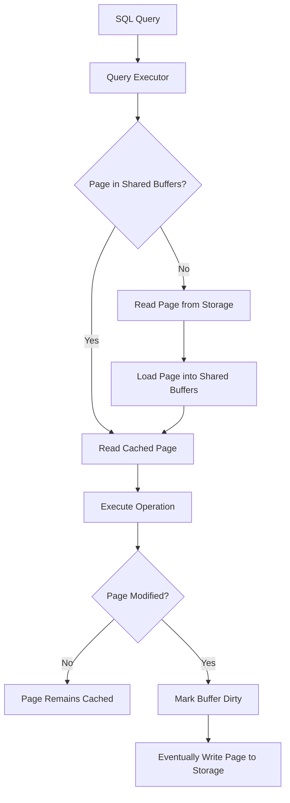

# 04- Buffer Pool and Memory

## Overview

Database performance depends heavily on how efficiently frequently accessed data is kept in memory.

Reading a database page from durable storage is generally much more expensive than reading an already-cached page from memory. Database systems therefore maintain memory structures that cache table pages, index pages, metadata, and intermediate execution state.

In PostgreSQL, the primary database-managed cache is the **shared buffer pool**, configured through `shared_buffers`. PostgreSQL also relies on the operating-system page cache, so the complete memory path is more accurately represented as:

```text
Application
    │
    ▼
PostgreSQL Backend
    │
    ▼
Query Executor
    │
    ▼
Shared Buffers
    │
    ├── Cache hit ───────────────► Page available in memory
    │
    └── Cache miss
             │
             ▼
        OS / Storage
             │
             ▼
       Page loaded into
       shared buffers
```

Understanding this layer explains several production behaviors:

- Why repeated queries can become much faster.
- Why increasing database memory can improve throughput.
- Why a large cache does not automatically fix slow queries.
- Why sequential scans can evict useful data.
- Why PostgreSQL memory consumption is larger than `shared_buffers`.
- Why connection count matters.
- Why sorting, hashing, and query execution can consume substantial additional memory.

---

## What Is a Buffer Pool?

A **buffer pool** is a region of memory used by a database to cache disk-backed database pages.

Instead of reading a table page from storage every time it is needed:

```text
Without effective caching:

Query → Storage → Page
Query → Storage → Page
Query → Storage → Page
```

the database can reuse cached pages:

```text
Query 1 → Storage → Buffer Pool
                         │
Query 2 ────────────────►│
Query 3 ────────────────►│
Query 4 ────────────────►│
```

This reduces physical I/O and often improves latency dramatically.

A buffer pool is therefore not simply "extra RAM". It is a database-managed cache participating directly in query execution and storage management.

---

## Why Buffer Pools Exist

Persistent storage has much higher access latency than RAM.

A database workload may repeatedly access the same:

- Index root pages
- Index internal pages
- Frequently accessed rows
- Hot tables
- Metadata pages

Keeping these pages in memory avoids repeatedly fetching them from storage.

The basic optimization is:

```text
                    Frequently accessed data
                              │
                              ▼
                         Memory cache
                              │
                   ┌──────────┴──────────┐
                   │                     │
                Cache hit             Cache miss
                   │                     │
                   ▼                     ▼
              Use page              Read storage
                                         │
                                         ▼
                                    Cache page
```

---

## PostgreSQL Shared Buffers

PostgreSQL uses a shared memory area called **shared buffers** to cache database pages.

The main configuration parameter is:

```sql
SHOW shared_buffers;
```

Example:

```text
shared_buffers
--------------
4GB
```

The exact value should be selected based on:

- Available system memory
- Database workload
- Connection count
- Operating-system caching
- Query memory requirements
- PostgreSQL version
- Deployment architecture

A common mistake is treating a single percentage of system RAM as a universal rule.

There is no universally correct `shared_buffers` value for every production system.

---

## Database Memory Is More Than Shared Buffers

A PostgreSQL instance can consume memory from several sources.

```text
PostgreSQL Memory
│
├── Shared memory
│   ├── shared_buffers
│   ├── WAL-related buffers
│   ├── lock structures
│   └── other shared structures
│
└── Per-process / per-operation memory
    ├── work_mem
    ├── maintenance_work_mem
    ├── temp buffers
    └── backend/process overhead
```

This distinction is critical when sizing a production database.

For example, setting:

```text
shared_buffers = 8 GB
```

does **not** mean PostgreSQL can consume only 8 GB of RAM.

---

## Shared Memory vs Per-Operation Memory

Some PostgreSQL memory is shared across sessions, while other allocations occur per backend or per operation.

| Memory Area | Scope | Typical Purpose |
|---|---|---|
| `shared_buffers` | Shared | Cached table/index pages |
| `work_mem` | Per operation | Sorts, hashes, joins, aggregation |
| `maintenance_work_mem` | Maintenance operation | VACUUM, CREATE INDEX and related operations |
| `temp_buffers` | Per session | Temporary table buffers |
| Backend memory | Per process/session | Session and execution state |
| WAL buffers | Shared | WAL records awaiting processing |

The most dangerous configuration mistakes often involve misunderstanding the multiplication effect of per-operation memory.

---

## Page Lifecycle

A simplified PostgreSQL page lifecycle looks like this:



A page loaded into memory can subsequently be reused by other queries.

---

## Cache Hits

A **buffer hit** occurs when the required database page is already available in the relevant buffer cache.

For example:

```text
Query
  │
  ▼
Buffer lookup
  │
  ▼
Page found
  │
  ▼
Cache hit
  │
  ▼
Execute using memory-resident page
```

High buffer-hit rates are generally desirable for workloads with a reusable working set.

However:

> A high cache-hit ratio does not prove that the database is performing well.

A query can still be slow because of:

- CPU-intensive processing
- Poor join strategies
- Large result sets
- Excessive row processing
- Lock waits
- Bad query plans
- Memory pressure
- Network transfer

---

## Cache Misses

A cache miss occurs when the required page is not currently available in the relevant memory cache.

The database must obtain it from a lower storage layer.

Conceptually:

```text
Query
  │
  ▼
Shared Buffers
  │
  └── Miss
       │
       ▼
OS / Storage Cache
       │
       ├── Cached by OS
       │
       └── Physical storage read
```

The actual path depends on the operating system, filesystem, storage system, and PostgreSQL architecture.

---

## Shared Buffers and the OS Page Cache

PostgreSQL uses both its own shared buffers and the operating system's filesystem cache.

A simplified view is:

```text
PostgreSQL
    │
    ▼
Shared Buffers
    │
    ▼
Operating System
    │
    ▼
Filesystem / Page Cache
    │
    ▼
Storage
```

This means memory sizing is not simply:

```text
Total RAM = shared_buffers
```

The operating system needs memory for:

- Filesystem cache
- Processes
- Kernel resources
- Networking
- Monitoring agents
- Other services

On dedicated database hosts, PostgreSQL can be given a substantial portion of RAM while retaining enough memory for the OS and other requirements.

---

## Why Two Cache Layers Exist

At first glance, having both PostgreSQL buffers and the OS page cache can appear redundant.

The architecture exists because PostgreSQL and the operating system solve different problems.

PostgreSQL needs database-aware memory management for:

- Buffer replacement
- Dirty-page tracking
- MVCC-related visibility
- Buffer pinning
- Database-specific synchronization

The OS page cache provides generic filesystem caching.

This layered design allows PostgreSQL to manage database pages while still using normal operating-system I/O mechanisms.

---

## Dirty Buffers

A buffer becomes **dirty** when the in-memory page differs from its durable representation.

For example:

```sql
UPDATE accounts
SET balance = balance - 100
WHERE id = 42;
```

Conceptually:

```text
Storage Page
     │
     ▼
Shared Buffer
     │
     ▼
Modify page
     │
     ▼
Dirty Buffer
```

A dirty buffer does not necessarily mean that PostgreSQL immediately writes the page to its final storage location.

WAL provides the durability/recovery mechanism that allows modified data pages to be written later.

---

## Dirty Page Writeback

Eventually, dirty pages must be written back.

Potential triggers include:

- Background writer activity
- Checkpoints
- Buffer pressure
- Other database maintenance behavior

Conceptually:

```text
Dirty Buffer
     │
     ▼
Writeback
     │
     ▼
Persistent Storage
```

The database therefore separates:

```text
Logical modification
```

from:

```text
Physical page write
```

This separation is fundamental to PostgreSQL's write architecture.

---

## WAL and Buffer Pool Interaction

WAL and shared buffers work together.

A simplified write sequence is:

```text
Transaction
    │
    ▼
Modify buffer
    │
    ├──────────────► Generate WAL
    │                    │
    │                    ▼
    │              Durable WAL
    │
    ▼
Dirty buffer
    │
    ▼
Data page written later
```

The key write-ahead property is that the required WAL must be persisted before the corresponding dirty data page can be safely persisted.

This allows crash recovery to replay WAL when necessary.

---

## Buffer Replacement

The buffer pool has finite capacity.

If:

```text
Working set > Available buffers
```

not every page can remain cached.

The database must decide which buffers can be reused.

Conceptually:

```text
Buffer Pool
┌──────┬──────┬──────┬──────┬──────┐
│ P1   │ P2   │ P3   │ P4   │ P5   │
└──────┴──────┴──────┴──────┴──────┘
             │
             ▼
       Need another page
             │
             ▼
       Reuse eligible buffer
```

The replacement algorithm and implementation details are database-specific.

The important engineering principle is:

> A larger buffer pool helps only when additional memory can retain useful working-set pages.

---

## Working Set

The **working set** is the subset of data and indexes repeatedly accessed by the workload over a relevant period.

For example:

```text
Database size = 2 TB
Frequently accessed data = 50 GB
```

A 50 GB hot working set may fit comfortably into memory even though the complete database does not.

This is one reason large databases can perform well with much smaller memory footprints than their total storage size.

---

## Hot and Cold Data

Not all data is equally valuable to cache.

```text
Database
│
├── Hot data
│   ├── Recent orders
│   ├── Active users
│   └── Current inventory
│
└── Cold data
    ├── Old audit records
    ├── Historical events
    └── Rarely accessed records
```

A cache is most effective when it keeps hot pages available.

Poorly designed queries can disrupt this behavior by scanning large amounts of cold data.

---

## Sequential Scans and Cache Pressure

Consider:

```sql
SELECT *
FROM historical_events;
```

on a very large table.

A large scan can read many pages and potentially put pressure on cached pages.

If the workload repeatedly performs large scans while latency-sensitive queries need a smaller hot working set, cache effectiveness can deteriorate.

Possible solutions include:

- Better predicates
- Appropriate indexes
- Partitioning
- Archival strategies
- Separate analytical workloads
- Query scheduling
- Read replicas

Do not solve every cache problem by simply increasing RAM.

---

## Index Pages Are Cached Too

The buffer pool is not only for table rows.

Indexes also occupy database pages.

For example:

```text
Buffer Pool
│
├── Table pages
├── B-tree index pages
├── Visibility-related pages
└── Other database pages
```

A frequently used index can remain memory-resident even when the underlying table is much larger.

This is why a relatively small index can provide excellent lookup performance.

---

## Why Indexes Can Be Memory-Efficient

A query such as:

```sql
SELECT id
FROM users
WHERE email = 'user@example.com';
```

may need only a small portion of an index to locate the relevant row.

If the upper levels of the index remain cached:

```text
Root
 │
 ▼
Internal page
 │
 ▼
Leaf page
 │
 ▼
Matching entry
```

the database can navigate the structure with relatively little I/O.

This is one reason frequently used indexes are important parts of the database working set.

---

## `work_mem`

`work_mem` controls the amount of memory available for many individual query operations before PostgreSQL may spill to temporary files.

Examples include:

- Sorts
- Hash tables
- Hash joins
- Some aggregation operations

Check the current setting:

```sql
SHOW work_mem;
```

For example:

```sql
SET LOCAL work_mem = '64MB';
```

This applies only to the current transaction when executed inside an explicit transaction context.

### Important distinction

`work_mem` is **not** a global pool of memory that every connection can safely consume once.

Multiple operations in one query and multiple concurrent sessions can each consume memory.

---

## `work_mem` Multiplication

Suppose:

```text
work_mem = 64 MB
```

and a query contains multiple memory-intensive operations.

With many concurrent sessions:

```text
Connection 1
 ├── Sort
 └── Hash

Connection 2
 ├── Sort
 └── Hash

Connection 3
 ├── Sort
 └── Hash
```

Potential memory consumption can become much larger than:

```text
64 MB × number of connections
```

because the allocation model is operation-dependent rather than simply one fixed allocation per connection.

This is why increasing `work_mem` aggressively can cause memory pressure or OOM conditions.

---

## Memory vs Temporary Disk

If an operation cannot efficiently fit within available working memory, PostgreSQL may spill intermediate data to temporary files.

Conceptually:

```text
Sort / Hash Operation
        │
        ▼
Available memory
        │
        ├── Fits → process in memory
        │
        └── Does not fit
                 │
                 ▼
          Temporary files
```

Spilling can significantly increase latency.

Inspect query behavior with:

```sql
EXPLAIN (ANALYZE, BUFFERS)
SELECT ...
```

and monitor temporary file activity when investigating memory-heavy queries.

---

## `maintenance_work_mem`

`maintenance_work_mem` is intended for maintenance operations such as:

- `VACUUM`
- `CREATE INDEX`
- `ALTER TABLE` operations that require substantial maintenance work

Check it with:

```sql
SHOW maintenance_work_mem;
```

It should be sized separately from `work_mem`.

A database may need enough memory for maintenance while still protecting memory availability for normal application traffic.

---

## `temp_buffers`

`temp_buffers` controls the amount of memory available for temporary table buffers per session.

For example:

```sql
SHOW temp_buffers;
```

Temporary tables are session-local, so this memory should also be considered when sizing a database server.

---

## Connection Count and Memory

Connection count is an important memory consideration.

A simplified model is:

```text
Database RAM
│
├── Shared memory
│
├── Backend/session memory
│
├── Query operation memory
│
├── OS memory
│
└── Other processes
```

If a service opens hundreds or thousands of database connections, per-session memory overhead can become significant.

This is one reason production backend systems commonly use controlled connection pools.

---

## Connection Pooling

A Django or FastAPI service may have many application workers:

```text
Kubernetes
├── Pod 1 ──► DB
├── Pod 2 ──► DB
├── Pod 3 ──► DB
└── Pod N ──► DB
```

If every worker creates many persistent database connections, total database connections can grow rapidly.

A connection pool or external pooler can help control this.

The capacity relationship should be explicitly modeled:

```text
Application Pods
×
Workers per Pod
×
Connections per Worker
=
Potential DB Connections
```

This is particularly important when scaling Kubernetes deployments horizontally.

---

## Django Considerations

Django applications commonly use PostgreSQL through a database driver and Django's database connection management.

Example:

```python
DATABASES = {
    "default": {
        "ENGINE": "django.db.backends.postgresql",
        "NAME": "app",
        "USER": "app",
        "PASSWORD": "...",
        "HOST": "postgres",
        "PORT": "5432",
        "CONN_MAX_AGE": 60,
    }
}
```

`CONN_MAX_AGE` controls how long Django may reuse persistent database connections.

Connection reuse can reduce connection setup overhead, but the total number of connections still needs to be controlled.

Secrets should never be hard-coded in production configuration.

---

## FastAPI and SQLAlchemy

A FastAPI service commonly uses SQLAlchemy with a connection pool.

Conceptually:

```text
FastAPI Workers
      │
      ▼
SQLAlchemy Pool
      │
      ├── Connection
      ├── Connection
      ├── Connection
      └── Connection
      │
      ▼
PostgreSQL
```

The pool should be configured based on:

- Database connection capacity
- Number of application instances
- Query latency
- Traffic patterns
- Failover behavior

More connections do not automatically produce more throughput.

---

## Memory and Query Concurrency

A database may have enough RAM for its working set but still experience memory pressure because too many expensive queries execute concurrently.

For example:

```text
100 concurrent queries
        │
        ├── Sort
        ├── Hash join
        ├── Aggregation
        └── Temporary data
```

The database can become memory-bound even when `shared_buffers` is appropriately configured.

Therefore:

> Memory sizing must consider concurrency, not just database size.

---

## Memory Pressure

Memory pressure can produce several symptoms:

- Increased storage I/O
- Cache churn
- Query latency spikes
- Temporary file growth
- Process termination
- OOM events
- Kubernetes pod restarts
- Reduced throughput

For Kubernetes deployments, remember that the container's memory limit is enforced outside PostgreSQL.

A PostgreSQL process killed by the container runtime may not appear as a PostgreSQL configuration error.

---

## Kubernetes Memory Configuration

A production PostgreSQL container should have explicitly planned resource requests and limits when containerized.

For example:

```yaml
resources:
  requests:
    memory: "8Gi"
  limits:
    memory: "12Gi"
```

The PostgreSQL memory configuration must fit within the actual container limit with enough headroom for:

- Shared buffers
- Backend memory
- Query operations
- Maintenance
- WAL-related memory
- OS/container overhead
- Extensions
- Monitoring

Do not set PostgreSQL memory parameters based solely on the physical host's RAM when PostgreSQL runs inside a constrained container.

---

## Cache Warm-Up

After:

- Database restart
- Failover
- Replica promotion
- Infrastructure replacement

the database cache may be relatively cold.

This can cause latency to temporarily increase:

```text
Restart
  │
  ▼
Cold cache
  │
  ▼
Storage reads
  │
  ▼
Pages become cached
  │
  ▼
Warm working set
  │
  ▼
Normal latency
```

Applications with strict latency requirements should account for cold-start behavior.

---

## Cache Warm-Up Strategies

Possible strategies include:

- Gradually restoring production traffic
- Running carefully designed warm-up queries
- Using connection/readiness gates
- Keeping hot replicas available
- Monitoring latency after failover

Avoid indiscriminately scanning entire tables just to "warm the cache".

Warm-up should target the application's actual hot working set.

---

## Monitoring Buffer Behavior

A useful PostgreSQL query for database-level statistics is:

```sql
SELECT
    blks_read,
    blks_hit,
    ROUND(
        100.0 * blks_hit / NULLIF(blks_hit + blks_read, 0),
        2
    ) AS hit_ratio
FROM pg_stat_database
WHERE datname = current_database();
```

This provides a broad view of shared buffer activity.

It should be treated as a diagnostic metric rather than a universal performance target.

---

## Inspecting Query Buffer Usage

Use:

```sql
EXPLAIN (ANALYZE, BUFFERS)
SELECT *
FROM orders
WHERE customer_id = 42;
```

Example output may contain information such as:

```text
Buffers: shared hit=120 read=15
```

Conceptually:

- `hit` indicates pages found in shared buffers.
- `read` indicates pages that had to be read into shared buffers.

This is much more useful for query-level investigation than relying only on a global cache-hit ratio.

---

## Monitoring Memory

Production monitoring should correlate PostgreSQL and infrastructure metrics.

### PostgreSQL-level

Monitor:

- Active connections
- Query concurrency
- Temporary files
- Temporary bytes
- Buffer activity
- Long-running queries
- Maintenance activity
- Query latency

### Host/container-level

Monitor:

- Resident memory
- Memory utilization
- Swap activity
- OOM events
- CPU utilization
- Storage latency
- IOPS
- Throughput

### Cloud-level

For AWS-managed databases, correlate database metrics with:

- CPU utilization
- Free memory
- Storage utilization
- Read/write IOPS
- Read/write latency
- Network throughput
- Database connections
- Replica lag

The objective is correlation, not isolated metric optimization.

---

## Buffer Pool and Performance Diagnosis

When a query is slow, use a layered diagnosis.

```text
Slow Query
    │
    ▼
EXPLAIN (ANALYZE, BUFFERS)
    │
    ├── High rows processed?
    │
    ├── Unexpected sequential scan?
    │
    ├── High shared reads?
    │
    ├── Temporary spills?
    │
    ├── CPU-heavy execution?
    │
    └── Lock / wait event?
             │
             ▼
        Correlate with
        system metrics
```

Do not jump directly from:

```text
"High disk reads"
```

to:

```text
"Add more RAM"
```

The underlying cause may instead be:

- Missing index
- Bad statistics
- Poor query predicate
- Wrong join strategy
- Excessive data access
- Cold cache
- Large analytical scan

---

## Cache Hit Ratio: Useful but Dangerous

A high cache-hit ratio can be reassuring:

```text
99% hit ratio
```

but it does not necessarily mean that queries are fast.

For example:

```text
1,000,000,000 buffer hits
10,000,000 buffer reads
```

can still represent a huge workload.

Likewise, a workload with a lower hit ratio can be perfectly acceptable if the underlying storage is fast and the queries are efficient.

Use cache statistics alongside:

- Query latency
- I/O latency
- Query plans
- Rows processed
- CPU
- Concurrency

---

## Memory and Security

Memory management has security implications.

Avoid:

- Storing secrets in SQL result sets unnecessarily.
- Logging sensitive query parameters.
- Exposing database metrics without authentication.
- Allowing untrusted users to execute arbitrary resource-intensive queries.

Resource-intensive queries can also become a denial-of-service vector.

For APIs exposed to untrusted clients:

- Enforce authorization.
- Limit query complexity where applicable.
- Use pagination.
- Apply request timeouts.
- Bound concurrency.
- Avoid unrestricted reporting queries on the transactional database.

---

## Memory and Reliability

Memory exhaustion can cause more severe failures than ordinary query latency.

For example:

```text
Memory pressure
      │
      ▼
Query allocation failure
      │
      ▼
Process/container instability
      │
      ▼
Database restart
      │
      ▼
Cache cold start
      │
      ▼
Recovery + increased latency
```

This can create a feedback loop during traffic spikes.

Capacity planning should therefore include worst-case concurrent query behavior rather than average traffic alone.

---

## High Availability Implications

A newly promoted PostgreSQL replica may have a different cache state from the old primary.

After failover:

```text
Primary
  │
  X failure
  │
  ▼
Replica promoted
  │
  ▼
Traffic redirected
  │
  ▼
Cache behavior changes
```

Even if the database is fully caught up through WAL, application latency may temporarily change because the memory working set is different.

Failover testing should therefore measure both:

- Recovery correctness
- Post-failover performance

---

## Disaster Recovery Considerations

Backups generally do not preserve the runtime buffer cache.

After restoring a database:

```text
Backup restore
      │
      ▼
Persistent database state
      │
      ▼
Cold runtime cache
      │
      ▼
Application traffic
      │
      ▼
Cache gradually warms
```

RTO planning should include the performance impact of cache warming when appropriate.

A recovery plan that restores the database successfully but cannot handle the initial traffic pattern is incomplete.

---

## Cost Optimization

Increasing memory can reduce storage I/O, but RAM is not the only optimization lever.

Before scaling memory:

- Inspect query plans.
- Remove unnecessary scans.
- Add justified indexes.
- Reduce result sizes.
- Improve pagination.
- Archive cold data.
- Partition large tables when appropriate.
- Separate analytical workloads.

A more efficient query can often reduce both:

```text
Database cost
+
Application latency
```

without adding infrastructure.

---

## Common Mistakes

### Treating `shared_buffers` as Total PostgreSQL Memory

`shared_buffers` is only one component of database memory consumption.

**Avoid it by:** modeling shared memory, per-operation memory, backend overhead, OS memory, and container limits together.

### Setting `work_mem` Extremely High

A large `work_mem` can look attractive for avoiding temporary spills.

However, concurrency and multiple query operations can multiply memory usage.

**Avoid it by:** increasing it deliberately for workloads that benefit and validating memory behavior under realistic concurrency.

### Assuming High Cache Hit Ratio Means Good Performance

Cache hits can still represent an enormous amount of CPU and memory work.

**Avoid it by:** analyzing query latency and execution plans together with buffer statistics.

### Adding RAM Before Fixing SQL

A missing index or inefficient query can overwhelm even a large buffer pool.

**Avoid it by:** using `EXPLAIN (ANALYZE, BUFFERS)` before changing infrastructure.

### Ignoring Connection Multiplication

Scaling from:

```text
5 pods
```

to:

```text
50 pods
```

can dramatically increase database connections and associated memory usage.

**Avoid it by:** calculating total potential connections before horizontal scaling.

### Ignoring Cold Cache After Failover

A recovered or promoted database may initially experience higher I/O.

**Avoid it by:** testing failover with realistic traffic and measuring warm-up behavior.

### Assuming the Buffer Pool Contains Only Table Data

Indexes and other database pages also consume cache space.

**Avoid it by:** considering the complete database working set.

### Treating Temporary Disk Usage as a Storage Problem Only

Temporary files can indicate memory pressure, inefficient queries, or large operations.

**Avoid it by:** examining execution plans and query concurrency before simply increasing storage.

---

## Production Checklist

Before deploying a production PostgreSQL workload, verify:

- [ ] `shared_buffers` is sized according to the deployment's actual memory.
- [ ] `work_mem` has been evaluated under realistic concurrency.
- [ ] Connection counts are bounded.
- [ ] Application worker scaling does not exceed database connection capacity.
- [ ] Query plans have been inspected with `EXPLAIN (ANALYZE, BUFFERS)`.
- [ ] Temporary file generation is monitored.
- [ ] Storage latency and IOPS are monitored.
- [ ] WAL generation and replication lag are monitored.
- [ ] Autovacuum is functioning correctly.
- [ ] Cold-cache behavior has been tested where relevant.
- [ ] Failover performance has been tested.
- [ ] Container memory limits leave sufficient PostgreSQL headroom.
- [ ] Database backups and recovery procedures are tested.

## Interview Traps

### Is `shared_buffers` the PostgreSQL equivalent of all database memory?

No. PostgreSQL also consumes memory for backend processes, query operations, maintenance, temporary buffers, WAL-related structures, and other components.

### Does a larger buffer pool always improve performance?

No. Once the useful working set is sufficiently cached, additional memory may provide little benefit. Query efficiency, CPU, I/O, and concurrency can remain the bottleneck.

### What is the difference between `shared_buffers` and `work_mem`?

`shared_buffers` is shared database cache memory for pages, while `work_mem` is memory available to individual query operations such as sorts and hash operations.

### Why can `work_mem` cause an OOM even when its value looks small?

Because it can be consumed by multiple operations and multiple concurrent sessions. Its effective memory impact is not simply one allocation per database instance.

### Does a cache miss always mean a physical disk read?

No. The requested page may still be available through lower-level caching such as the operating-system page cache, depending on the access path.

### Why can a sequential scan hurt a latency-sensitive workload?

A large scan can process many pages and put pressure on the cache and storage subsystem, competing with pages needed by hot transactional queries.

### Why does a database need both WAL and dirty buffers?

Dirty buffers represent modified in-memory database pages, while WAL provides the durable change record required for crash recovery and write-ahead durability semantics.

### Can a database with a 99% cache-hit ratio still be slow?

Yes. Cache-hit ratio does not measure CPU cost, rows processed, query complexity, locking, network transfer, or whether the remaining I/O is expensive.

### Why is connection pooling relevant to memory?

Each database session has memory and resource overhead, while concurrent query operations can consume additional memory. Excessive connections can therefore create memory pressure without increasing useful throughput.

### What should you inspect before increasing database memory?

Start with query execution plans, buffer activity, temporary spills, I/O latency, CPU, concurrency, and the actual working set. Infrastructure scaling should follow evidence rather than replace query optimization.

## Key Takeaways

- PostgreSQL's `shared_buffers` caches database pages, but total database memory consumption also includes per-session, per-operation, maintenance, WAL-related, and operating-system memory.
- Buffer effectiveness depends on the workload's working set; high cache-hit ratios are useful diagnostics but are not standalone performance targets.
- `work_mem` is operation-oriented and can multiply across concurrent queries, making aggressive values a common cause of memory pressure.
- Query plans, buffer statistics, temporary-file activity, I/O, CPU, and concurrency should be analyzed together before changing memory or storage capacity.
- Production database sizing must account for connection scaling, container limits, cold-cache behavior, failover, replication, reliability, and worst-case concurrent workload.