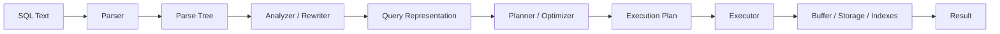

# 05- Query Parser Planner and Executor

## Overview

When an application sends SQL to PostgreSQL, the database does not execute the SQL text directly.

The statement passes through several stages that transform human-readable SQL into an executable plan:

```text
Application
    │
    │ SQL
    ▼
Parser
    │
    │ Parse tree
    ▼
Analyzer / Rewriter
    │
    │ Planned query representation
    ▼
Planner / Optimizer
    │
    │ Execution plan
    ▼
Executor
    │
    │ Table / index / buffer access
    ▼
Storage Engine
    │
    ▼
Result
    │
    ▼
Application
```

This pipeline explains why the same SQL statement can have very different performance depending on:

- Indexes
- Table statistics
- Data distribution
- Query predicates
- Join cardinality
- Available memory
- Concurrency
- Configuration
- PostgreSQL version
- Physical storage characteristics

For backend engineers, understanding the query lifecycle is more useful than memorizing isolated optimization rules. When a query is slow, the objective is to identify **which stage or resource is responsible for the cost**.

---

## Query Lifecycle

A simplified PostgreSQL query lifecycle is:



Each stage has a different responsibility.

| Stage | Primary Responsibility |
|---|---|
| Parser | Validate SQL syntax and construct a parse tree |
| Analyzer | Resolve names, types, operators, and relations |
| Rewriter | Apply rewrite rules such as view expansion |
| Planner | Generate and cost possible execution strategies |
| Executor | Execute the selected plan |
| Storage layer | Retrieve and modify physical data |

The exact internal implementation is substantially more complex, but this model is sufficient for most backend engineering and performance work.

---

## Parser

The parser converts SQL text into an internal representation that PostgreSQL can reason about.

For example:

```sql
SELECT id, email
FROM users
WHERE id = 42;
```

must first be understood as:

```text
SELECT
├── columns
│   ├── id
│   └── email
├── relation
│   └── users
└── predicate
    └── id = 42
```

The parser primarily answers:

> Is this SQL syntactically valid, and what structure does it represent?

It does not decide whether PostgreSQL should use an index or sequential scan.

---

## Syntax Errors

Parser errors occur before query planning.

For example:

```sql
SELECT id email
FROM users
WHERE;
```

contains invalid SQL syntax.

PostgreSQL returns an error before it reaches execution.

This distinction matters when diagnosing application failures:

```text
Syntax error
    ↓
Parser

Undefined table / column / operator
    ↓
Analysis / resolution

Bad or expensive execution strategy
    ↓
Planner / executor
```

---

## Parse Tree

The parser produces an internal parse tree.

Conceptually:

```text
SELECT
 │
 ├── Target List
 │    ├── users.id
 │    └── users.email
 │
 ├── FROM
 │    └── users
 │
 └── WHERE
      └── users.id = 42
```

The parse tree represents the structure of the SQL statement but does not yet contain all semantic information required for execution.

---

## Analyzer

After parsing, PostgreSQL analyzes and resolves the statement.

For example:

```sql
SELECT email
FROM users
WHERE id = 42;
```

The analyzer must determine:

- Which `users` relation is referenced?
- Which `email` column is intended?
- Which `id` column is intended?
- What are the data types?
- Which equality operator applies?
- Are the referenced objects accessible?
- Are the expressions semantically valid?

The analyzer therefore transforms syntactic SQL into a semantically meaningful representation.

---

## Name Resolution

Consider:

```sql
SELECT u.email
FROM users AS u
WHERE u.id = 42;
```

The analyzer resolves:

```text
u
↓
users relation
```

and:

```text
u.email
↓
users.email
```

An unresolved reference results in an error such as:

```text
column "..." does not exist
```

This is different from a planner choosing a poor execution strategy.

---

## Type Resolution

PostgreSQL also resolves expression types.

For example:

```sql
WHERE id = 42
```

requires PostgreSQL to determine the types involved in the comparison and select appropriate operators and implicit casts where applicable.

Explicit casts can sometimes materially affect index usage.

For example:

```sql
WHERE id = '42'::bigint
```

makes the intended type explicit.

Avoid unnecessary casts on indexed columns because expression transformations can prevent a straightforward index condition from being used.

---

## Operator Resolution

SQL operators are not simply textual symbols.

For:

```sql
WHERE price > 100
```

PostgreSQL needs to resolve the appropriate operator based on operand types.

Similarly:

```sql
WHERE metadata @> '{"status": "paid"}'::jsonb
```

uses an operator with semantics defined for the relevant PostgreSQL data type.

This resolution occurs before the optimizer chooses the physical execution strategy.

---

## Rewriting

After analysis, PostgreSQL can apply query rewriting.

One important example is a view.

Suppose:

```sql
CREATE VIEW active_users AS
SELECT *
FROM users
WHERE active = true;
```

Then:

```sql
SELECT email
FROM active_users
WHERE id = 42;
```

can be internally transformed so that the planner can optimize the underlying relation and predicates.

Conceptually:

```text
Application SQL
      │
      ▼
View reference
      │
      ▼
Rewrite / expansion
      │
      ▼
Underlying query
      │
      ▼
Planner
```

The application does not need to know the physical representation of the view.

---

## Planner and Optimizer

The planner is responsible for determining **how** the query should be executed.

For a query such as:

```sql
SELECT *
FROM orders
WHERE customer_id = 42;
```

possible strategies may include:

```text
Sequential Scan
```

or:

```text
Index Scan
```

or other access strategies depending on indexes, statistics, data distribution, and query structure.

The planner estimates the cost of candidate plans and selects the plan it believes will be cheapest.

---

## Cost-Based Optimization

PostgreSQL uses a cost-based optimizer.

Conceptually:

```text
Query
 │
 ▼
Generate candidate plans
 │
 ├── Sequential Scan
 ├── Index Scan
 ├── Bitmap Scan
 ├── Different Join Orders
 ├── Different Join Algorithms
 └── Different Aggregation Strategies
 │
 ▼
Estimate costs
 │
 ▼
Choose lowest estimated cost
```

The optimizer is not trying to find the mathematically perfect plan in every possible case.

It searches a practical plan space using statistics, cost models, and planner rules.

---

## Why the Planner Needs Statistics

The planner must estimate how many rows each operation will produce.

For example:

```sql
SELECT *
FROM orders
WHERE customer_id = 42;
```

If PostgreSQL estimates:

```text
1,000 matching rows
```

it may choose an index-based strategy.

If it estimates:

```text
900,000 matching rows
```

a sequential scan may be cheaper.

Statistics are therefore critical to query planning.

---

## ANALYZE

PostgreSQL collects table statistics using `ANALYZE`.

For example:

```sql
ANALYZE orders;
```

Autovacuum normally performs automatic analyze operations as part of PostgreSQL maintenance.

Useful statistics include information about:

- Value distributions
- Common values
- Distinct values
- Null fractions
- Correlations
- Column relationships in supported statistics configurations

Poor or stale statistics can lead to poor plan selection.

---

## Estimated Rows vs Actual Rows

One of the most important query-planning diagnostics is comparing estimated rows with actual rows.

Run:

```sql
EXPLAIN (ANALYZE, BUFFERS)
SELECT *
FROM orders
WHERE customer_id = 42;
```

Conceptually:

```text
Estimated rows: 100
Actual rows:    50,000
```

This is a major estimation error.

Such errors can cause the planner to select an inappropriate:

- Join strategy
- Scan strategy
- Memory allocation
- Join order

Large estimation errors should trigger investigation.

---

## Planner Cost Is Not Wall-Clock Time

PostgreSQL's cost values are planner units.

For example:

```text
cost=0.42..12345.67
```

does not mean:

```text
12345.67 milliseconds
```

Planner costs are relative estimates used to compare alternative plans.

Actual execution time is measured separately.

Use:

```sql
EXPLAIN (ANALYZE)
```

when you need actual execution measurements.

---

## Execution Plan

The planner produces an execution plan represented as a tree.

For example:

```text
Nested Loop
├── Index Scan on customers
└── Index Scan on orders
```

A more complex query might produce:

```text
Hash Join
├── Seq Scan on customers
└── Hash
    └── Seq Scan on orders
```

Each node performs a specific operation.

The executor processes this plan tree.

---

## Common Scan Nodes

### Sequential Scan

A sequential scan reads table pages and evaluates the predicate.

```text
Seq Scan
  │
  ▼
Page 1
Page 2
Page 3
...
```

It can be efficient when:

- The table is small.
- A large percentage of rows are required.
- An appropriate index does not exist.
- Sequential I/O is cheaper than random access.

A sequential scan is not inherently a performance problem.

---

### Index Scan

An index scan uses an index to locate relevant table entries.

```text
Index
  │
  ▼
Matching index entry
  │
  ▼
Heap tuple
```

It is often effective for selective queries.

However, many matching rows can lead to many heap accesses, making a sequential scan cheaper.

---

### Index-Only Scan

An index-only scan can return required values directly from the index when the index contains the needed columns and PostgreSQL can establish the relevant tuple visibility.

Conceptually:

```text
Query
  │
  ▼
Index
  │
  ├── Required columns
  └── Visibility information
  │
  ▼
Result
```

This can reduce heap access substantially.

---

### Bitmap Heap Scan

Bitmap scans can be useful when many rows match an index condition.

Conceptually:

```text
Index
  │
  ▼
Bitmap of matching heap locations
  │
  ▼
Heap pages
  │
  ▼
Rows
```

This can balance the benefits of index filtering with more efficient heap-page access.

---

## Join Planning

Joins are one of the most important areas of query optimization.

Consider:

```sql
SELECT
    o.id,
    c.email
FROM orders AS o
JOIN customers AS c
    ON c.id = o.customer_id
WHERE o.status = 'paid';
```

The planner must determine:

- Join order
- Join algorithm
- Access path for each table
- Filtering order
- Expected cardinality

Possible join algorithms include:

| Join | Typical Characteristics |
|---|---|
| Nested Loop | Effective when one side is small and the other has efficient lookup |
| Hash Join | Often effective for equality joins with sufficient memory |
| Merge Join | Useful when inputs can be efficiently ordered |
| Parallel variants | Can distribute eligible work across workers |

---

## Nested Loop

A nested loop conceptually works as:

```text
For each row from outer relation:
    find matching rows in inner relation
```

For example:

```text
Customers
   │
   ├── Customer 1 ──► Index lookup in Orders
   ├── Customer 2 ──► Index lookup in Orders
   └── Customer 3 ──► Index lookup in Orders
```

It can be excellent when the outer relation is small and the inner lookup is cheap.

It can become expensive when the outer relation is large and the inner operation is repeatedly executed.

---

## Hash Join

A hash join can build a hash structure from one input and probe it with the other.

Conceptually:

```text
Build input
    │
    ▼
Hash table
    ▲
    │
Probe input
    │
    ▼
Matches
```

Hash joins are particularly useful for equality joins.

Memory availability matters because a hash operation may need substantial working memory and can spill to temporary storage when necessary.

---

## Merge Join

A merge join operates on ordered inputs.

Conceptually:

```text
Input A:  1  3  5  7
Input B:  1  2  5  8
          │
          ▼
       Merge
          │
          ▼
       1, 5
```

The planner may choose this strategy when inputs are already suitably ordered or can be efficiently sorted.

---

## Predicate Pushdown

The planner can often apply filters as early as possible.

Consider:

```sql
SELECT *
FROM orders o
JOIN customers c
  ON c.id = o.customer_id
WHERE o.status = 'paid';
```

Conceptually:

```text
All Orders
    │
    ▼
Filter status='paid'
    │
    ▼
Join reduced set
```

Filtering earlier can reduce:

- Rows processed
- Join work
- Memory consumption
- I/O

The optimizer determines whether and how to apply such transformations.

---

## Projection and Column Selection

Avoid unnecessary columns:

```sql
SELECT *
FROM orders
WHERE customer_id = 42;
```

when the application needs only:

```sql
SELECT id, status, created_at
FROM orders
WHERE customer_id = 42;
```

This can reduce:

- Table data accessed
- Memory usage
- Network transfer
- Serialization cost
- Application processing

It can also make index-only access possible in some cases.

---

## Parallel Query Execution

PostgreSQL can execute eligible operations in parallel.

Conceptually:

```text
                Query
                  │
                  ▼
            Parallel Plan
             /    |    \
            ▼     ▼     ▼
         Worker Worker Worker
            \     |     /
             \    |    /
              ▼   ▼   ▼
             Gather
                │
                ▼
             Result
```

Parallelism can improve throughput for large operations such as:

- Large scans
- Aggregations
- Some joins

But parallel workers consume CPU and memory and are not automatically beneficial for small OLTP queries.

---

## Executor

The executor receives the selected execution plan and performs it.

For example:

```text
Plan:

Nested Loop
├── Index Scan
└── Index Scan
```

The executor invokes these operations and obtains rows from child nodes.

A useful conceptual model is that many executor nodes expose a row-producing interface:

```text
Parent Node
    │
    ▼
Request next row
    │
    ▼
Child Node
    │
    ▼
Child Node
    │
    ▼
Storage / Index
```

This model helps explain why execution plans are represented as trees.

---

## Volcano-Style Execution Model

PostgreSQL's executor uses a demand-driven model in which plan nodes produce tuples as requested by their parent nodes.

Conceptually:

```text
Top Node
   │
   │ next tuple
   ▼
Child Node
   │
   │ next tuple
   ▼
Child Node
   │
   ▼
Storage Access
```

A parent node requests data from its children rather than necessarily materializing the entire result set at every step.

Some operations, such as sorting or hashing, naturally require materialization or buffering.

---

## Executor and Buffer Pool

The executor interacts with PostgreSQL's storage layer to obtain table and index pages.

Simplified:

```text
Executor
   │
   ▼
Scan Node
   │
   ▼
Buffer Manager
   │
   ├── Cached page
   │
   └── Storage read
   │
   ▼
Tuple
```

This connects query planning directly to the storage concepts discussed in the previous architecture documents.

---

## Query Execution Example

Consider:

```sql
SELECT
    o.id,
    o.total
FROM orders AS o
WHERE o.customer_id = 42
  AND o.status = 'paid';
```

Suppose there is an index:

```sql
CREATE INDEX idx_orders_customer_status
ON orders(customer_id, status);
```

A simplified lifecycle is:

```text
SQL
 │
 ▼
Parser
 │
 ▼
Analyzer
 │
 ▼
Planner
 │
 ├── Evaluate Seq Scan
 ├── Evaluate Index Scan
 └── Estimate costs
 │
 ▼
Index Scan chosen
 │
 ▼
Executor
 │
 ▼
Index pages
 │
 ▼
Heap pages / index-only access if possible
 │
 ▼
Filter / projection
 │
 ▼
Result
```

The actual plan depends on table size, statistics, visibility, selectivity, and other factors.

---

## EXPLAIN

`EXPLAIN` displays the planner's chosen execution plan without executing the query.

```sql
EXPLAIN
SELECT *
FROM orders
WHERE customer_id = 42;
```

It is useful for understanding:

- Scan selection
- Join strategies
- Estimated cardinalities
- Estimated costs
- Parallelism
- Sorts
- Aggregations

---

## EXPLAIN ANALYZE

`EXPLAIN ANALYZE` executes the query and reports actual execution information.

```sql
EXPLAIN (ANALYZE)
SELECT *
FROM orders
WHERE customer_id = 42;
```

For write statements, this actually performs the write.

Use a transaction when testing a write query that you do not want to persist:

```sql
BEGIN;

EXPLAIN (ANALYZE, BUFFERS)
UPDATE orders
SET status = 'paid'
WHERE id = 1001;

ROLLBACK;
```

Be careful: even inside a transaction, `EXPLAIN ANALYZE` executes the statement and can acquire locks, generate WAL, invoke triggers, and consume production resources.

---

## EXPLAIN BUFFERS

For storage-related diagnosis:

```sql
EXPLAIN (ANALYZE, BUFFERS)
SELECT *
FROM orders
WHERE customer_id = 42;
```

This provides buffer information such as:

```text
Buffers: shared hit=120 read=15
```

This helps correlate:

```text
Execution plan
+
Actual rows
+
Buffer activity
```

and is particularly useful for distinguishing CPU-heavy execution from I/O-heavy execution.

---

## EXPLAIN Planning Time vs Execution Time

PostgreSQL can report:

```text
Planning Time: 0.500 ms
Execution Time: 12.000 ms
```

These represent different phases.

```text
SQL
 │
 ├── Planning ──► 0.5 ms
 │
 └── Execution ─► 12 ms
```

For most complex application queries, execution time dominates, but highly dynamic or extremely complex query workloads can also incur meaningful planning overhead.

---

## Prepared Statements and Planning

Prepared statements can separate parsing/planning from repeated execution.

Conceptually:

```text
Prepare
  │
  ├── Parse
  ├── Analyze
  └── Plan
       │
       ▼
Execute repeatedly
```

This can reduce repeated planning overhead and enable parameterized execution.

However, PostgreSQL can choose between custom and generic plans in prepared-statement scenarios.

A generic plan may be less optimal when parameter values have highly different selectivity.

---

## Parameterized Queries

Backend applications should use parameter binding rather than constructing SQL through string concatenation.

Unsafe:

```python
query = f"""
SELECT id, email
FROM users
WHERE email = '{email}'
"""
```

Preferred:

```python
cursor.execute(
    """
    SELECT id, email
    FROM users
    WHERE email = %s
    """,
    [email],
)
```

Parameter binding provides:

- SQL injection protection
- Correct type handling
- Cleaner query execution
- Better separation between code and data

Django ORM, SQLAlchemy, and modern database drivers generally provide parameterization mechanisms.

---

## ORM and Query Planning

Django ORM does not replace the PostgreSQL planner.

For example:

```python
orders = (
    Order.objects
    .filter(customer_id=42, status="paid")
    .values("id", "total")
)
```

Django generates SQL, and PostgreSQL still performs:

```text
SQL
 ↓
Parser
 ↓
Analyzer
 ↓
Planner
 ↓
Executor
```

This means backend engineers need to understand the generated SQL and execution plan even when using an ORM.

---

## Django Query Inspection

For simple ORM inspection:

```python
queryset = Order.objects.filter(
    customer_id=42,
    status="paid",
)

print(queryset.query)
```

For production troubleshooting, prefer proper SQL/query logging and database-level analysis rather than relying on `print()`.

Django's:

```python
queryset.explain()
```

can also expose the database execution plan.

For example:

```python
plan = queryset.explain(
    analyze=True,
    buffers=True,
)
```

Use `ANALYZE` carefully because it executes the query.

---

## FastAPI and SQLAlchemy

With SQLAlchemy, inspect the generated SQL and then analyze it directly in PostgreSQL.

For example:

```python
from sqlalchemy import select

stmt = select(Order.id, Order.total).where(
    Order.customer_id == customer_id,
    Order.status == "paid",
)
```

The ORM or SQL toolkit generates SQL, but PostgreSQL remains responsible for:

- Parsing
- Planning
- Execution
- Storage access

Application abstractions do not eliminate database optimization concerns.

---

## N+1 Query Problem

ORM-generated queries can accidentally create excessive execution cycles.

Example:

```python
orders = Order.objects.all()

for order in orders:
    print(order.customer.email)
```

This can result in:

```text
1 query for orders
+
N queries for customers
```

instead of a single appropriately joined/prefetched operation.

Django provides mechanisms such as:

```python
Order.objects.select_related("customer")
```

or:

```python
Order.objects.prefetch_related("items")
```

The important engineering lesson is:

> Optimize the complete database interaction pattern, not just individual SQL statements.

---

## Query Plan Stability

Execution plans can change when:

- Data volume changes
- Statistics change
- Indexes are added or removed
- PostgreSQL configuration changes
- PostgreSQL versions change
- Parameter distributions change
- Table correlation changes

A query that was fast six months ago can become slow without any application code change.

Production systems should therefore monitor query performance over time.

---

## Planner Configuration

PostgreSQL exposes planner-related configuration parameters.

Examples include:

```sql
SHOW random_page_cost;
SHOW seq_page_cost;
SHOW effective_cache_size;
SHOW max_parallel_workers_per_gather;
```

These parameters influence planner decisions.

Do not tune them blindly.

For example, changing `random_page_cost` can influence whether index access appears attractive relative to sequential scans, but incorrect tuning can degrade other workloads.

---

## `effective_cache_size`

`effective_cache_size` is a planner estimate of how much memory is available for disk caching by PostgreSQL and the operating system.

It is **not** an allocation.

For example:

```sql
SHOW effective_cache_size;
```

Changing it does not reserve RAM.

It influences planner cost estimates for access methods.

This distinction is a common interview and production configuration trap.

---

## Query Planning and Statistics Correlation

Suppose a table contains:

```text
id: 1 ... 100,000,000
created_at: mostly chronological
```

Physical ordering and column correlation can influence the cost of index access.

An index may be useful for locating rows, but if matching rows are scattered across many heap pages, the resulting random access can be expensive.

Planner statistics help account for these characteristics.

---

## Cardinality Estimation

Cardinality estimation is the process of estimating how many rows an operation will produce.

Example:

```text
Table rows:       100,000,000
Estimated result:       500
Actual result:       5,000,000
```

A large mismatch can radically change the preferred plan.

Cardinality errors can originate from:

- Stale statistics
- Highly skewed distributions
- Correlated columns
- Complex predicates
- Data changes
- Expressions the planner estimates imperfectly

---

## Extended Statistics

PostgreSQL supports extended statistics for certain relationships between columns.

For example:

```sql
CREATE STATISTICS orders_customer_status_stats
ON customer_id, status
FROM orders;
```

Then:

```sql
ANALYZE orders;
```

This can help the planner reason about correlations that independent per-column statistics may not capture adequately.

Use extended statistics when actual query behavior demonstrates estimation problems involving correlated columns.

---

## Planner vs Optimizer Misconceptions

The planner does not simply follow fixed rules such as:

```text
"Index exists → use index"
```

or:

```text
"Table is large → never use sequential scan"
```

Instead, it evaluates estimated costs.

The same SQL can therefore produce different plans across environments.

---

## Production Query Optimization Workflow

A practical workflow is:

```text
Slow Query
   │
   ▼
Capture exact SQL + parameters
   │
   ▼
EXPLAIN (ANALYZE, BUFFERS)
   │
   ▼
Compare estimated vs actual rows
   │
   ▼
Inspect scan / join strategy
   │
   ▼
Inspect buffer and temporary I/O
   │
   ▼
Check indexes and statistics
   │
   ▼
Check locks / concurrency
   │
   ▼
Change one thing
   │
   ▼
Benchmark under realistic workload
   │
   ▼
Deploy and monitor
```

This is more reliable than applying generic optimization rules.

---

## Monitoring

Production systems should monitor query behavior at several levels.

### Application

Monitor:

- API latency
- Database call latency
- Query count per request
- N+1 patterns
- Connection pool saturation
- Timeout rates

### PostgreSQL

Monitor:

- Slow queries
- `pg_stat_statements`
- Active sessions
- Lock waits
- Buffer activity
- Temporary files
- Cache behavior
- Planning and execution time

### Infrastructure

Monitor:

- CPU
- Memory
- Storage latency
- IOPS
- Throughput
- Network utilization

A query problem is often an interaction between all three layers.

---

## `pg_stat_statements`

`pg_stat_statements` is a key PostgreSQL extension for workload-level query analysis.

It can provide aggregated information such as:

- Calls
- Total execution time
- Mean execution time
- Rows
- Shared block hits
- Shared block reads
- Temporary blocks

A typical query is:

```sql
SELECT
    query,
    calls,
    total_exec_time,
    mean_exec_time,
    rows
FROM pg_stat_statements
ORDER BY total_exec_time DESC
LIMIT 20;
```

This helps identify queries consuming the largest amount of database execution time.

---

## Security Considerations

Query optimization must not weaken security.

Avoid:

- Building SQL through string interpolation.
- Logging sensitive parameter values.
- Granting excessive database privileges for diagnostics.
- Exposing unrestricted SQL execution endpoints.
- Running expensive diagnostic queries without considering production impact.

Use:

- Parameterized queries
- Least-privilege database roles
- Controlled observability access
- Redacted query logging where necessary
- Read-only diagnostic roles when possible

---

## Reliability Considerations

Query planning problems can become reliability problems when inefficient queries consume shared database resources.

For example:

```text
Bad query plan
     │
     ▼
High CPU / I/O
     │
     ▼
Connection pool saturation
     │
     ▼
Request latency
     │
     ▼
Application timeouts
     │
     ▼
Retries
     │
     ▼
More database load
```

This feedback loop can turn a performance issue into an outage.

Application retry strategies should therefore be designed carefully around database capacity.

---

## Scalability Considerations

As traffic grows, query-plan efficiency becomes increasingly important.

A query consuming:

```text
5 ms × 100 requests/sec
```

may be manageable.

At:

```text
5 ms × 10,000 requests/sec
```

the same database operation represents a much larger aggregate workload.

Horizontal application scaling does not automatically scale database query capacity.

The database often remains the shared bottleneck.

---

## Cost Considerations

Poor query planning can increase cloud costs through:

- Larger database instances
- Higher storage I/O
- Additional replicas
- Increased network transfer
- Increased observability volume
- More aggressive caching infrastructure

Optimizing query shape and execution plans can therefore reduce both latency and infrastructure cost.

---

## Common Mistakes

### Assuming Every Index Must Be Used

An index is useful only when its estimated cost is lower than alternatives.

**Avoid it by:** examining actual execution plans.

### Treating Sequential Scans as Automatically Bad

Sequential scans can be optimal for small tables or low-selectivity queries.

**Avoid it by:** judging the scan in the context of cardinality and total I/O.

### Ignoring Estimated vs Actual Rows

A plan can look reasonable until cardinality estimation is compared with reality.

**Avoid it by:** using `EXPLAIN (ANALYZE, BUFFERS)` during controlled investigation.

### Increasing `work_mem` Globally to Fix One Query

This can create memory pressure across many concurrent operations.

**Avoid it by:** fixing the query first or applying narrowly scoped configuration when justified.

### Running `EXPLAIN ANALYZE` on Production Writes Without Considering Side Effects

`EXPLAIN ANALYZE` executes the statement.

**Avoid it by:** using safe transactions for controlled tests or reproducing against representative environments.

### Optimizing Generated SQL Without Understanding the ORM

The application may generate additional queries or different SQL than expected.

**Avoid it by:** inspecting the actual SQL and query count.

### Tuning Planner Cost Parameters Blindly

Planner parameters influence broad classes of queries.

**Avoid it by:** changing them only after measuring a systemic planning problem.

### Ignoring Parameter Distribution

A plan suitable for one parameter value may be poor for another when selectivity varies significantly.

**Avoid it by:** considering prepared-statement planning behavior and parameter distributions.

### Measuring Only Average Latency

A query can have acceptable average latency while producing severe p95/p99 spikes.

**Avoid it by:** monitoring latency distributions and database resource utilization.

---

## Production Best Practices

- Treat `EXPLAIN (ANALYZE, BUFFERS)` as a primary diagnostic tool.
- Compare estimated and actual cardinalities.
- Keep PostgreSQL statistics healthy.
- Index based on real query patterns.
- Inspect ORM-generated SQL for high-traffic paths.
- Control connection counts.
- Monitor query latency by percentile.
- Track cumulative query cost with `pg_stat_statements`.
- Benchmark query changes with realistic data volumes.
- Test plan behavior after major schema and data changes.
- Avoid broad planner-configuration changes without evidence.
- Treat database performance as a system-level concern rather than a SQL-text-only problem.

---

## Interview Traps

### What is the difference between the parser and planner?

The parser validates SQL syntax and creates a structural representation. The planner determines how that query should be executed.

### Does the parser choose an index?

No. Index selection is primarily a planner/optimizer responsibility.

### Why can the same SQL produce different execution plans?

Plans depend on statistics, data distribution, indexes, configuration, PostgreSQL version, available resources, and other planner inputs.

### What does `EXPLAIN ANALYZE` do?

It executes the query and reports actual execution statistics in addition to the planned operations.

### Why is `EXPLAIN ANALYZE` dangerous for `UPDATE` or `DELETE`?

Because the statement actually executes. It can modify data, acquire locks, invoke triggers, and consume production resources.

### What is cardinality estimation?

It is the planner's estimate of how many rows an operation will produce.

### Why are estimated rows vs actual rows important?

Large differences indicate planner estimation errors that can lead to poor scan, join, aggregation, or memory decisions.

### Is a sequential scan a bad plan?

No. It can be the optimal strategy when a large fraction of a table is required or the table is small.

### What is the role of `effective_cache_size`?

It influences planner cost estimates about likely cache availability. It does not allocate or reserve memory.

### What is the relationship between an ORM and the PostgreSQL planner?

The ORM generates SQL; PostgreSQL parses, plans, and executes that SQL. ORM abstractions do not bypass database optimization.

### Why can a nested-loop join be extremely fast in one case and extremely slow in another?

It depends heavily on the number of outer rows and the cost of the inner lookup. A small outer relation with an efficient index lookup can be excellent; repeated expensive inner operations can become costly.

### Why can a query become slower without application code changing?

Data volume, data distribution, statistics, indexes, PostgreSQL configuration, parameter distributions, or resource contention can change the planner's decisions and execution environment.

## Key Takeaways

- PostgreSQL transforms SQL through parsing, semantic analysis/rewriting, planning, and execution; each stage has a distinct responsibility.
- The planner is cost-based and relies heavily on statistics and cardinality estimates, so an existing index does not guarantee an index scan.
- `EXPLAIN (ANALYZE, BUFFERS)` is one of the most valuable tools for comparing estimated plans with actual execution, row counts, and buffer behavior.
- ORM-generated SQL still passes through the same PostgreSQL pipeline, making SQL inspection, query-count analysis, and database-level observability essential for backend engineers.
- Production query optimization should correlate plans, statistics, memory, I/O, concurrency, and application latency rather than relying on isolated rules such as "always use indexes."