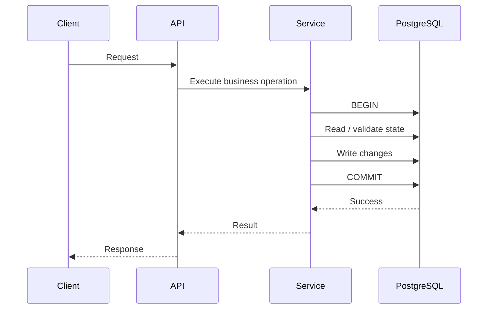

# 07- Transaction Architecture

## Overview

Transaction architecture defines how database transactions are bounded, coordinated, isolated, retried, and integrated with application workflows.

A transaction is not merely:

```sql
BEGIN;
...
COMMIT;
```

In a production backend, transaction design spans:

- API request boundaries
- Service-layer boundaries
- Database constraints
- Isolation levels
- Locking
- Concurrency control
- Retry behavior
- External side effects
- Background jobs
- Messaging systems
- Connection pools
- Failure recovery

A useful mental model is:

```text
Client
  │
  ▼
API Layer
  │
  ▼
Service / Business Logic
  │
  ├───────────────┐
  │               │
  ▼               ▼
Database       External Systems
  │               │
  ▼               ├── Kafka
Transaction       ├── Redis
  │               ├── Email
  ▼               └── Payment Provider
Commit
```

The central architectural principle is:

> Keep the database transaction around the smallest set of database operations that must succeed or fail atomically, and do not assume that a database transaction automatically includes external systems.

---

## Transaction Architecture vs Transaction Syntax

Transaction syntax answers:

```sql
BEGIN;
UPDATE ...;
INSERT ...;
COMMIT;
```

Transaction architecture answers:

```text
Where does the transaction begin?
Where does it end?
Which operations belong inside it?
What concurrency guarantees are required?
What happens if commit fails?
What happens to external side effects?
How are transient failures retried?
```

This distinction becomes increasingly important as applications move from monolithic CRUD services to distributed architectures.

---

## Transaction Boundary

A transaction boundary defines the set of operations that execute atomically.

For example, placing order creation and inventory reservation in one transaction may be appropriate when both operations are owned by the same database:

```text
BEGIN
 │
 ├── Create order
 ├── Reserve inventory
 └── Create payment record
 │
COMMIT
```

If any operation fails:

```text
ROLLBACK
```

The database returns to its previous consistent state.

---

## Business Invariants Define Boundaries

Transaction boundaries should generally follow business invariants rather than arbitrary code structure.

Suppose the invariant is:

```text
An order cannot become CONFIRMED unless inventory is reserved.
```

Then these operations should normally be protected by one atomic database transaction when they are stored in the same transactional database:

```text
Transaction
├── Reserve inventory
└── Confirm order
```

The question is not:

> "Which function should have `atomic()`?"

The better question is:

> "Which state changes must be atomic to preserve the business invariant?"

---

## Transaction Lifecycle

A typical backend transaction lifecycle is:



The transaction should normally remain open only while the database must protect the business operation.

---

## Request-Scoped Transactions

A common architecture is to associate a transaction with an HTTP request:

```text
HTTP Request
    │
    ▼
BEGIN
    │
    ├── Authentication
    ├── Business logic
    ├── Database writes
    │
    ▼
COMMIT
    │
    ▼
HTTP Response
```

This can be appropriate for relatively simple request-driven operations.

However, not every request needs a transaction.

For example:

```text
GET /products
```

may require only a normal read query.

By contrast:

```text
POST /orders
```

may need an explicit transaction because multiple state changes must remain consistent.

---

## Service-Layer Transactions

For larger applications, transaction boundaries are often better defined around service-layer business operations.

Example:

```python
from django.db import transaction

@transaction.atomic
def create_order(*, user_id: int, product_id: int) -> int:
    ...
```

The service owns the invariant:

```text
Create order
+
Reserve inventory
```

rather than requiring every caller to understand the transaction details.

This can prevent transaction logic from being duplicated across:

- REST endpoints
- gRPC handlers
- Celery tasks
- Management commands
- Scheduled jobs

---

## Django Transaction Architecture

Django provides transaction management through:

```python
from django.db import transaction
```

A common pattern is:

```python
from django.db import transaction

@transaction.atomic
def confirm_order(order_id: int) -> None:
    order = (
        Order.objects
        .select_for_update()
        .get(id=order_id)
    )

    if order.status != Order.Status.PENDING:
        raise ValueError("Order cannot be confirmed")

    order.status = Order.Status.CONFIRMED
    order.save(update_fields=["status"])
```

The important architectural elements are:

```text
Service boundary
     │
     ▼
Transaction
     │
     ├── Lock required state
     ├── Validate invariant
     └── Update state
     │
     ▼
Commit
```

---

## FastAPI Transaction Architecture

FastAPI does not define transaction semantics itself.

A typical architecture is:

```text
FastAPI
   │
   ▼
Service Layer
   │
   ▼
SQLAlchemy Session
   │
   ▼
PostgreSQL
```

A service can explicitly control transaction scope.

Conceptually:

```python
def create_order(session, data):
    try:
        order = create_order_record(session, data)
        reserve_inventory(session, data)
        session.commit()
        return order
    except Exception:
        session.rollback()
        raise
```

In production, the exact session and transaction lifecycle should be integrated with the application's dependency and connection-management strategy.

---

## Transaction Ownership

One component should have clear ownership of the transaction boundary.

Avoid architectures where:

```text
Controller
  └── starts transaction

Service
  └── starts transaction

Repository
  └── starts transaction
```

This can make transaction scope difficult to reason about.

A better model is:

```text
API
 │
 ▼
Service
 │
 └── Owns transaction boundary
       │
       ├── Repository
       ├── Repository
       └── Repository
```

Repositories generally perform persistence operations without independently committing the transaction unless there is an explicit architectural reason.

---

## Nested Transactions

Nested transaction APIs do not necessarily create independent database transactions.

In Django:

```python
with transaction.atomic():
    ...
    with transaction.atomic():
        ...
```

the inner block typically uses a savepoint while the outer block represents the actual transaction boundary.

Conceptually:

```text
Outer Transaction
│
├── Operation A
│
├── SAVEPOINT
│   ├── Operation B
│   └── ROLLBACK TO SAVEPOINT if needed
│
└── COMMIT
```

This allows partial rollback without committing the entire transaction.

---

## Transaction Boundary and External Calls

One of the most important production rules is:

> Avoid slow or unreliable external calls while holding database locks or an open transaction.

Problematic:

```text
BEGIN
  │
  ├── Update database
  │
  ├── Call payment provider
  │      └── 3 seconds
  │
  ├── Call external API
  │      └── 2 seconds
  │
  ▼
COMMIT
```

During those external calls:

- Locks may remain held.
- Connections remain occupied.
- Other transactions may wait.
- Database resources remain allocated.

Prefer:

```text
Database transaction
    │
    ├── Record local state
    └── Commit
          │
          ▼
External side effect
```

When atomic coordination is required, use an appropriate workflow pattern such as an outbox or state machine.

---

## Transactional Outbox

A transactional outbox is useful when a database state change must reliably result in an asynchronous message.

Example:

```text
BEGIN
 │
 ├── Update order
 └── Insert outbox event
 │
COMMIT
 │
 ▼
Outbox Worker
 │
 ▼
Kafka
 │
 ▼
Consumers
```

Example schema:

```sql
CREATE TABLE outbox_events (
    id BIGSERIAL PRIMARY KEY,
    aggregate_type TEXT NOT NULL,
    aggregate_id BIGINT NOT NULL,
    event_type TEXT NOT NULL,
    payload JSONB NOT NULL,
    created_at TIMESTAMPTZ NOT NULL DEFAULT now(),
    published_at TIMESTAMPTZ
);
```

The order update and outbox insertion occur in the same database transaction.

If the transaction commits, both are durable together.

---

## Why Direct Database + Kafka Transactions Are Different

Consider:

```text
BEGIN
  │
  ├── Update PostgreSQL
  ├── Publish Kafka message
  └── COMMIT
```

A PostgreSQL transaction does not automatically make Kafka part of the same atomic transaction.

A failure can produce states such as:

```text
Database committed
Kafka publish failed
```

or:

```text
Kafka publish succeeded
Database rolled back
```

Distributed transaction protocols can address some classes of coordination problems, but they introduce substantial complexity.

For many backend architectures, a transactional outbox provides a simpler reliability model.

---

## Redis and Transactions

Redis has its own atomicity and transaction mechanisms, but a PostgreSQL transaction does not automatically include Redis.

For example:

```text
PostgreSQL transaction
        │
        X
        │
Redis operation
```

There is no automatic atomic commit across both systems.

A common pattern is:

```text
PostgreSQL
   │
   └── Source of truth

Redis
   │
   └── Derived cache
```

Update the database transactionally, then invalidate or refresh the cache after successful commit.

---

## `on_commit`

Django provides `transaction.on_commit()` for work that should execute only after the surrounding transaction successfully commits.

Example:

```python
from django.db import transaction

with transaction.atomic():
    order = create_order()
    transaction.on_commit(
        lambda: publish_order_created(order.id)
    )
```

This prevents the callback from running when the transaction rolls back.

However, `on_commit()` is not itself a durable messaging mechanism.

If the process crashes after commit but before the callback executes, the side effect can still be lost.

For durable event delivery, a transactional outbox is generally stronger.

---

## Transactional State Machines

Long-running workflows should often be represented explicitly as state transitions rather than one enormous transaction.

For example:

```text
PENDING
   │
   ▼
PAYMENT_PENDING
   │
   ▼
PAID
   │
   ▼
FULFILLING
   │
   ▼
COMPLETED
```

Each transition can be protected by a short transaction.

This is preferable to:

```text
BEGIN
  │
  ├── Create order
  ├── Call payment provider
  ├── Wait for payment
  ├── Wait for fulfillment
  └── COMMIT
```

The latter is operationally fragile and keeps database resources occupied unnecessarily.

---

## Transaction Scope

Transaction duration should generally be minimized.

Good:

```text
BEGIN
  │
  ├── Read required state
  ├── Validate invariant
  ├── Write changes
  │
COMMIT
```

Risky:

```text
BEGIN
  │
  ├── Read database
  ├── Call external API
  ├── Perform CPU-heavy processing
  ├── Sleep
  ├── Wait for another service
  └── COMMIT
```

Short transactions improve:

- Lock availability
- Connection utilization
- Throughput
- Failure recovery
- Predictability

---

## Transactions and Connection Pools

An active transaction generally occupies a database connection.

Consider:

```text
Application pool
├── Connection 1 → transaction
├── Connection 2 → idle
├── Connection 3 → transaction
└── Connection 4 → transaction
```

If transactions remain open while waiting on external services, pool capacity can disappear quickly.

For an application with:

```text
100 workers
20 connections
```

only a bounded number of concurrent database operations can proceed through the pool.

Long transactions can therefore cause application-level backpressure.

---

## Transactions and Locks

Transactions determine lock lifetime.

For example:

```sql
BEGIN;

SELECT *
FROM inventory
WHERE product_id = 42
FOR UPDATE;

UPDATE inventory
SET available = available - 1
WHERE product_id = 42;

COMMIT;
```

The row lock is held until the transaction completes.

Conceptually:

```text
BEGIN
 │
 ▼
Acquire row lock
 │
 ▼
Perform work
 │
 ▼
COMMIT
 │
 ▼
Release lock
```

The transaction boundary therefore directly affects concurrency.

---

## Atomic SQL vs Explicit Transactions

Not every business operation requires an explicit multi-statement transaction.

Consider:

```sql
UPDATE inventory
SET available = available - 1
WHERE product_id = 42
  AND available > 0;
```

This single statement can atomically enforce:

```text
available must remain >= 0
```

The application can then check:

```text
rows affected = 1
```

versus:

```text
rows affected = 0
```

This is often safer than:

```text
SELECT available
UPDATE available
```

because the latter introduces a race unless additional concurrency control is used.

---

## Constraints as Transaction Architecture

Database constraints should enforce invariants whenever possible.

For example:

```sql
CREATE TABLE accounts (
    id BIGSERIAL PRIMARY KEY,
    balance NUMERIC(19, 4) NOT NULL CHECK (balance >= 0)
);
```

The application may validate:

```text
balance >= 0
```

but the database constraint remains the final protection against invalid state.

Transactions and constraints complement each other:

```text
Transaction
    +
Constraints
    +
Concurrency control
    =
Consistent database state
```

---

## Isolation Levels

Transaction architecture must account for isolation requirements.

PostgreSQL commonly operates at:

```text
READ COMMITTED
```

by default.

Other supported levels include:

```text
REPEATABLE READ
SERIALIZABLE
```

PostgreSQL treats:

```text
READ UNCOMMITTED
```

as effectively:

```text
READ COMMITTED
```

rather than allowing dirty reads.

Isolation determines which concurrent effects a transaction can observe.

---

## Isolation vs Locking

Isolation level and explicit locking solve related but different problems.

Isolation defines visibility guarantees.

Locks explicitly coordinate conflicting operations.

For example:

```sql
SELECT *
FROM inventory
WHERE product_id = 42
FOR UPDATE;
```

requests row-level locking behavior independent of simply changing the transaction's isolation level.

A robust design often uses:

```text
Isolation level
+
Atomic SQL
+
Constraints
+
Explicit locks where required
```

rather than relying on one mechanism for every concurrency problem.

---

## Optimistic Concurrency

Not every conflict requires locking.

A version column can implement optimistic concurrency:

```sql
UPDATE documents
SET
    content = $1,
    version = version + 1
WHERE id = $2
  AND version = $3;
```

If:

```text
Rows affected = 1
```

the update succeeded.

If:

```text
Rows affected = 0
```

another writer changed the document first.

This approach is useful when conflicts are relatively uncommon and blocking is undesirable.

---

## Pessimistic Concurrency

For high-contentention resources, explicit locking may be more appropriate.

Example:

```sql
BEGIN;

SELECT available
FROM inventory
WHERE product_id = 42
FOR UPDATE;

UPDATE inventory
SET available = available - 1
WHERE product_id = 42;

COMMIT;
```

The transaction serializes conflicting access to the selected row.

Use this when the business invariant requires coordinated access and contention is expected.

---

## Transaction Retry Architecture

Some transaction failures are transient.

Common PostgreSQL examples include:

```text
40P01
deadlock_detected

40001
serialization_failure
```

Applications can retry appropriate transient failures.

The retry unit should normally be the **entire transaction**:

```text
Attempt 1
  │
  ├── BEGIN
  ├── Operations
  └── Serialization failure
          │
          ▼
       ROLLBACK
          │
          ▼
      Backoff
          │
          ▼
Attempt 2
  │
  ├── BEGIN
  ├── Operations
  └── COMMIT
```

Do not continue executing inside a failed transaction.

---

## Retry with Backoff

A production retry policy should use:

- Bounded attempts
- Exponential backoff
- Jitter
- Error classification
- Transaction restart

Conceptually:

```text
Retry delay
1st retry → 50 ms + jitter
2nd retry → 100 ms + jitter
3rd retry → 200 ms + jitter
```

The exact values should be workload-specific.

Retries should be rare recovery mechanisms, not a substitute for correct concurrency design.

---

## Retry Storms

If many requests encounter the same transient failure:

```text
100 requests
    │
    ▼
100 transaction failures
    │
    ▼
100 immediate retries
    │
    ▼
More contention
    │
    ▼
More failures
```

This creates a retry storm.

Backoff, jitter, bounded retries, and admission control help prevent positive feedback loops.

---

## Deadlock Architecture

Deadlocks occur when transactions wait on one another in a cycle.

Example:

```text
Transaction A
   │
   ├── locks Row 1
   │
   └── waits for Row 2
             ▲
             │
Transaction B
   │
   ├── locks Row 2
   │
   └── waits for Row 1
```

A common prevention strategy is consistent lock ordering:

```text
Always lock lower account ID first.
```

For example:

```text
Account 10 → Account 20
```

rather than allowing different code paths to lock them in arbitrary order.

---

## Uncertain Commit Outcome

A particularly difficult failure occurs when the client loses communication around commit.

Conceptually:

```text
Application
    │
    │ COMMIT
    ▼
PostgreSQL
    │
    ├── Commit succeeds
    │
    X response lost
    │
    ▼
Application
```

The application may not know whether the transaction committed.

Blindly retrying a non-idempotent operation can create duplicates.

Use:

- Idempotency keys
- Unique constraints
- Reconciliation
- Deterministic business identifiers

when the operation can be retried safely.

---

## Idempotency

An idempotent API operation produces the same business outcome when safely repeated.

For example:

```text
POST /payments
Idempotency-Key: 7f3...
```

The server can persist the key and associate it with the resulting operation.

Conceptually:

```text
Request
  │
  ▼
Idempotency key
  │
  ├── Already processed → return stored result
  │
  └── New request
          │
          ▼
      Transaction
          │
          ▼
       Commit
```

Idempotency is especially important when retries can occur after uncertain network failures.

---

## Transaction Boundary and Celery

Background jobs often require their own transaction boundaries.

For example:

```text
Celery task
   │
   ▼
BEGIN
   │
   ├── Load state
   ├── Apply transition
   └── Commit
```

Avoid wrapping a long-running Celery task in one transaction if only a small database transition needs atomicity.

Prefer:

```text
Task
 ├── Short transaction
 ├── External work
 ├── Short transaction
 └── External work
```

when the workflow semantics permit intermediate committed states.

---

## Transaction Boundary and Kafka

Kafka consumers can process the same event more than once.

A consumer architecture might be:

```text
Kafka
  │
  ▼
Consumer
  │
  ▼
BEGIN
  │
  ├── Apply database change
  ├── Record processed event ID
  │
  ▼
COMMIT
```

A uniqueness constraint can enforce deduplication:

```sql
CREATE UNIQUE INDEX idx_processed_events_event_id
ON processed_events(event_id);
```

This can provide database-backed idempotency.

---

## Exactly-Once Claims

Be cautious with statements such as:

```text
"Kafka gives us exactly-once processing."
```

Exactly-once semantics are contextual.

A Kafka transaction does not automatically make an external database transaction atomic with Kafka.

For cross-system workflows, reason explicitly about:

- Duplicate delivery
- Lost messages
- Transaction boundaries
- Idempotency
- Reconciliation
- Outbox/inbox patterns

---

## Transaction and Caching Architecture

Suppose an API updates:

```text
PostgreSQL
+
Redis cache
```

A dangerous sequence is:

```text
UPDATE PostgreSQL
UPDATE Redis
COMMIT
```

because the database transaction does not atomically include Redis.

A safer pattern is:

```text
BEGIN
 │
 └── Update PostgreSQL
 │
COMMIT
 │
 ▼
Invalidate Redis
```

For high-reliability cache invalidation, the invalidation event can itself be driven by an outbox.

---

## Transaction Boundaries and Read-After-Write

Applications sometimes require:

```text
Write database
     │
     ▼
Immediately read result
```

Within the same transaction, the application has clear transaction-local visibility rules.

Across services or replicas, however:

```text
Write primary
    │
    ▼
Read replica
```

may encounter replication lag.

Transaction architecture should therefore account for read consistency requirements when using replicas.

---

## Long Transactions

Long-running transactions can cause:

- Locks held for longer
- Connection pool exhaustion
- MVCC cleanup delays
- More retained row versions
- Larger WAL accumulation
- Replica lag
- Increased rollback cost

Monitor long-running transactions.

For example:

```sql
SELECT
    pid,
    usename,
    state,
    xact_start,
    now() - xact_start AS transaction_age,
    query
FROM pg_stat_activity
WHERE xact_start IS NOT NULL
ORDER BY xact_start;
```

Long transaction age should be investigated according to workload and operational thresholds.

---

## Large Transactions

A transaction containing millions of writes can create significant operational pressure.

Example:

```text
BEGIN
  │
  ├── Update 10M rows
  ├── Insert 10M records
  ├── Rebuild indexes
  └── COMMIT
```

Potential consequences include:

- Large WAL volume
- Long lock duration
- Large rollback cost
- Replica lag
- Memory pressure
- Maintenance delays

When atomicity across the entire operation is not required, bounded batches can be preferable.

---

## Batching Changes Transaction Semantics

Changing:

```text
One transaction
```

to:

```text
100 transactions
```

is not merely a performance optimization.

It changes failure semantics.

Before:

```text
All succeed
or
all rollback
```

After:

```text
Batch 1 committed
Batch 2 committed
Batch 3 failed
```

The application must therefore support partial progress.

Batching should only be used when intermediate committed states are acceptable.

---

## Transactional Migrations

Schema changes have their own transaction considerations.

Some migrations can execute atomically, while certain operations or PostgreSQL behaviors may require special handling.

For example, Django migrations can be configured with:

```python
class Migration(migrations.Migration):
    atomic = False
```

This intentionally changes transaction behavior.

Use non-atomic migrations only when required and design them for:

- Partial failure
- Resume/retry
- Lock duration
- Deployment ordering
- Backward compatibility

---

## Expand-and-Contract Schema Changes

For zero-downtime deployments, schema changes often follow:

```text
Expand
  │
  ▼
Deploy compatible application
  │
  ▼
Backfill
  │
  ▼
Switch reads/writes
  │
  ▼
Contract
```

For example:

```text
Add nullable column
      │
      ▼
Deploy code that writes both fields
      │
      ▼
Backfill old records
      │
      ▼
Read new field
      │
      ▼
Remove old field later
```

This avoids requiring one huge transaction during a live deployment.

---

## Transaction Boundaries in Distributed Systems

A single database transaction works well when the required state belongs to one transactional database.

Across services:

```text
Service A → Database A
Service B → Database B
Service C → Database C
```

there is no single local PostgreSQL transaction covering all three.

Instead, use workflow patterns such as:

- Saga
- Outbox
- Idempotent consumers
- State machines
- Compensating actions

The architecture changes from:

```text
Atomic commit
```

to:

```text
Reliable state transitions
+
Eventual consistency
+
Compensation
```

when distributed atomicity is not available or not desirable.

---

## Saga Architecture

A saga decomposes a distributed workflow into local transactions.

Example:

```text
Create Order
   │
   ▼
Reserve Inventory
   │
   ▼
Charge Payment
   │
   ▼
Create Shipment
```

If payment fails:

```text
Charge Payment
   X
   │
   ▼
Release Inventory
   │
   ▼
Cancel Order
```

Each local transaction remains short and independently durable.

---

## Transaction Observability

Transactions should be observable in production.

Monitor:

- Transaction duration
- Lock wait duration
- Deadlocks
- Serialization failures
- Rollbacks
- Commit rate
- Active connections
- Idle-in-transaction sessions
- Long-running transactions
- Retry counts

A useful operational signal is:

```text
Transaction duration
      +
Lock wait
      +
Connection utilization
      +
Retry rate
```

rather than transaction count alone.

---

## Idle in Transaction

An especially dangerous state is:

```text
idle in transaction
```

The session has an open transaction but is not actively executing a query.

Inspect with:

```sql
SELECT
    pid,
    usename,
    state,
    xact_start,
    query_start,
    state_change,
    query
FROM pg_stat_activity
WHERE state = 'idle in transaction';
```

Common causes include:

- Application bugs
- Missing transaction cleanup
- Waiting for external work
- Incorrect connection/session handling

This state should be investigated aggressively in production.

---

## Transaction Timeouts

Timeouts provide protection against pathological transaction behavior.

Possible controls include:

```sql
SHOW statement_timeout;
SHOW lock_timeout;
SHOW idle_in_transaction_session_timeout;
```

These serve different purposes.

| Setting | Protects Against |
|---|---|
| `statement_timeout` | Excessively long statements |
| `lock_timeout` | Excessive waiting for locks |
| `idle_in_transaction_session_timeout` | Sessions remaining idle inside transactions |

Timeout values should reflect application behavior and operational requirements.

---

## Security Considerations

Transaction architecture affects authorization correctness.

Authorization checks should occur within the same consistency boundary as state changes when the permission depends on mutable database state.

For example:

```text
BEGIN
 │
 ├── Lock resource
 ├── Verify authorization
 ├── Validate business invariant
 └── Perform update
 │
COMMIT
```

Checking state outside the transaction and modifying it later can create race conditions.

Use database constraints as a final integrity boundary where appropriate.

---

## High Availability

In an HA architecture:

```text
Application
    │
    ▼
Primary
    │
    ├── WAL
    ▼
Standby
```

transaction behavior interacts with:

- Failover
- Replication lag
- Connection recovery
- Commit durability
- Application retries

After a failover, clients may need to reconnect and retry safely.

This makes transaction idempotency and uncertain-commit handling important parts of HA design.

---

## Disaster Recovery

A transaction being committed on the primary does not necessarily mean:

```text
Data exists in every region
```

DR architecture should explicitly define:

- RPO
- RTO
- Replication strategy
- Backup strategy
- WAL retention
- Recovery procedure

Transaction architecture and disaster recovery are connected because WAL and committed state form the basis of database recovery.

---

## Cost Considerations

Transaction design can affect infrastructure cost.

Poor transaction architecture can lead to:

- Larger database instances
- More connections
- Higher I/O
- More WAL
- More replicas
- Increased retry traffic
- Higher observability volume

Short, efficient transactions reduce resource contention and often improve both performance and cost efficiency.

---

## Common Transaction Architecture Mistakes

### Putting External Calls Inside Transactions

Problem:

```text
BEGIN
→ API call
→ wait
→ COMMIT
```

This holds database resources unnecessarily.

**Avoid it by:** persisting local state first and coordinating external work through events or explicit workflow states.

### Letting Every Repository Commit

This fragments transaction ownership.

**Avoid it by:** defining transaction ownership at a clear service boundary.

### Assuming `atomic()` Includes Kafka or Redis

It does not.

**Avoid it by:** using outbox/inbox patterns or explicit distributed workflow design.

### Retrying Only the Failed SQL Statement

The transaction's consistency context may already be invalid after a serialization or deadlock failure.

**Avoid it by:** rolling back and retrying the entire transaction.

### Using Huge Transactions for Bulk Processing

Large transactions can create WAL, lock, MVCC, and replication pressure.

**Avoid it by:** batching when intermediate commits are acceptable.

### Ignoring Partial Progress After Batching

Batching changes failure semantics.

**Avoid it by:** designing resumability and idempotency into the operation.

### Assuming Higher Isolation Fixes Every Race

Isolation alone does not replace proper business constraints, atomic SQL, or explicit locking.

**Avoid it by:** selecting the minimum mechanism that correctly protects the invariant.

### Using Long Transactions for Workflows

A payment or approval process may take seconds, minutes, or days.

**Avoid it by:** modeling the workflow as durable states and short transactions.

### Blindly Retrying Commit

A network failure around commit can leave the outcome uncertain.

**Avoid it by:** using idempotency, unique constraints, and reconciliation.

### Ignoring Connection Pool Capacity

Long transactions consume connections.

**Avoid it by:** calculating application concurrency against database connection capacity.

---

## Production Transaction Review

When reviewing a backend operation, ask:

```text
What business invariant is being protected?
             │
             ▼
Which state changes must be atomic?
             │
             ▼
Which database owns the state?
             │
             ▼
What isolation is required?
             │
             ▼
Are locks required?
             │
             ▼
Can the transaction remain short?
             │
             ▼
Are external calls outside the transaction?
             │
             ▼
Can failures be retried safely?
             │
             ▼
Is the operation idempotent?
             │
             ▼
How is partial progress represented?
             │
             ▼
How is the transaction monitored?
```

This is a useful senior-level transaction design checklist.

---

## Production Best Practices

- Define transactions around business invariants, not arbitrary repository methods.
- Keep transaction scope as small as correctness permits.
- Keep network calls and long-running computation outside database transactions.
- Use database constraints to enforce critical invariants.
- Prefer atomic SQL when a single statement can safely enforce the invariant.
- Use `SELECT ... FOR UPDATE` for pessimistic coordination when required.
- Use optimistic concurrency when conflicts are better detected than blocked.
- Retry the entire transaction for appropriate transient errors.
- Use bounded exponential backoff with jitter.
- Design idempotency before adding retries.
- Use transactional outbox patterns for reliable database-to-message publication.
- Treat Redis and Kafka as separate transactional systems unless explicit cross-system coordination is designed.
- Monitor long-running and idle-in-transaction sessions.
- Test transaction behavior under realistic concurrency and failure conditions.

## Interview Traps

### What should determine a transaction boundary?

The business invariants and atomicity requirements should determine it, not simply controller, repository, or function boundaries.

### Should every database request run inside an explicit transaction?

No. Many individual reads or atomic statements do not require an explicit multi-statement transaction.

### Why should external API calls generally remain outside a database transaction?

They can be slow, fail independently, and hold database connections and locks for unnecessary periods.

### Does Django `atomic()` make Redis or Kafka part of the same transaction?

No. It controls the database transaction only.

### Why is an outbox useful?

It allows a database state change and the corresponding event record to be committed atomically in one database transaction, after which the event can be published asynchronously.

### Why retry the whole transaction after a serialization failure?

The transaction's original execution context has failed. Retrying only one statement does not reproduce the transaction safely.

### What is the difference between optimistic and pessimistic concurrency?

Optimistic concurrency detects conflicts, commonly through version checks, while pessimistic concurrency prevents conflicting work by acquiring locks.

### Why can long transactions cause database-wide performance problems?

They can retain locks and MVCC snapshots, consume connections, increase WAL and replication pressure, and delay cleanup.

### Why is an uncertain commit difficult?

The client may lose the response after the database has committed, making it impossible to know from the client perspective whether retrying would duplicate the operation.

### How do you safely retry an uncertain operation?

Use idempotency keys, unique constraints, deterministic operation identifiers, or reconciliation so a retry can safely determine whether the original operation already succeeded.

### Does `SERIALIZABLE` eliminate the need for application retry logic?

No. Serializable execution can intentionally abort transactions with serialization failures. Applications must handle appropriate transient failures.

### Does batching a large transaction preserve the same semantics?

No. Multiple commits allow partial progress. The application must explicitly support partial completion and retry/resume behavior.

### How should transactions work in microservices?

Avoid assuming one distributed database transaction. Use local transactions combined with patterns such as outbox, saga, idempotent consumers, state machines, and compensating actions.

### What is the senior-level transaction design question?

Ask: "What invariant must remain true under concurrent failure?" Then choose transaction boundaries, constraints, isolation, locking, retries, and workflow mechanisms that enforce that invariant with the smallest practical consistency scope.

## Key Takeaways

- Transaction architecture is primarily about defining correct atomicity boundaries around business invariants, not simply placing `BEGIN` and `COMMIT` around application code.
- Keep transactions short, avoid external calls inside them, and use constraints, atomic SQL, locking, or optimistic concurrency according to the specific invariant.
- Database transactions do not automatically include Kafka, Redis, HTTP APIs, or other services; reliable cross-system workflows require patterns such as transactional outbox, idempotency, and sagas.
- Production transaction design must account for deadlocks, serialization failures, uncertain commits, retries, connection pools, long-running transactions, replication, and failure recovery.
- Senior-level transaction architecture balances correctness, concurrency, reliability, and operational cost rather than maximizing isolation or transaction scope by default.