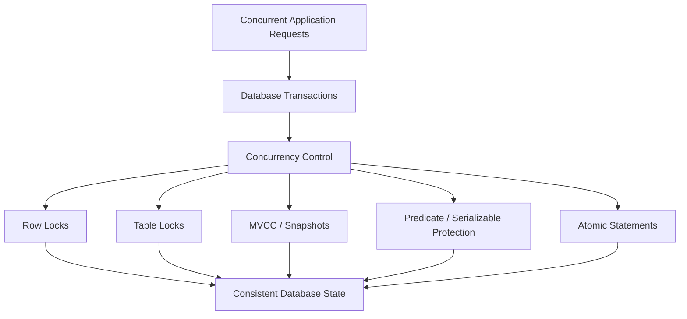

# 08- Locking and Concurrency Architecture

## Overview

Database locking and concurrency architecture define how multiple requests, workers, and services safely operate on shared state at the same time.

In a production backend, concurrency exists everywhere:

- Multiple API requests update the same account.
- Several workers process jobs for the same customer.
- Multiple Celery tasks modify inventory.
- Kafka consumers process related events concurrently.
- Kubernetes can run many replicas of the same service.
- Scheduled jobs can overlap with user-driven requests.

Without an explicit concurrency strategy, individually correct application code can still produce incorrect database state.

A useful model is:

```text
Concurrent Requests
       │
       ▼
Application Instances
       │
       ▼
Database Transactions
       │
       ├── Isolation
       ├── Atomic SQL
       ├── Constraints
       ├── Locks
       └── Optimistic Concurrency
       │
       ▼
Consistent State
```

The goal is not to eliminate concurrency. The goal is to control **conflicting access to shared state** while preserving correctness and acceptable throughput.

---

## Why Locking Exists

Consider two requests attempting to reserve the last inventory unit.

Initial state:

```text
available = 1
```

Both requests execute:

```text
Request A → read available = 1
Request B → read available = 1

Request A → available = 0
Request B → available = 0
```

The database may end with:

```text
available = 0
```

while both requests believe they successfully reserved inventory.

The business invariant was:

```text
At most one reservation for the final unit.
```

Concurrency control exists to prevent such races.

---

## Concurrency Problems

Common concurrency anomalies include:

| Problem | Description |
|---|---|
| Lost update | One write overwrites another concurrent write |
| Dirty read | Reading uncommitted data |
| Non-repeatable read | Same row produces different values during a transaction |
| Phantom read | A repeated predicate query observes a changed row set |
| Write skew | Independent rows are changed in a way that violates a cross-row invariant |
| Deadlock | Transactions wait on each other indefinitely until the database aborts one |

Isolation levels, locks, atomic SQL, and constraints address different parts of this problem space.

---

## Locking Architecture

A simplified architecture is:



PostgreSQL uses MVCC extensively, so many reads do not need to block writes. Explicit locks are used when application semantics require stronger coordination.

---

## MVCC and Locking

PostgreSQL uses **Multi-Version Concurrency Control (MVCC)**.

Conceptually, rows can have multiple visible versions:

```text
Row
 ├── Version A
 ├── Version B
 └── Version C
```

A transaction sees the versions that are visible according to its snapshot and isolation level.

This allows many readers and writers to operate concurrently without requiring every read to acquire a blocking shared lock.

Therefore:

```text
MVCC ≠ no locking
```

PostgreSQL still uses locks for:

- Conflicting writes
- Explicit row locking
- Table-level operations
- DDL
- Transaction coordination
- Other internal synchronization

---

## Row-Level Locks

Row-level locks coordinate access to specific rows.

A common example is:

```sql
BEGIN;

SELECT *
FROM inventory
WHERE product_id = 42
FOR UPDATE;

UPDATE inventory
SET available = available - 1
WHERE product_id = 42;

COMMIT;
```

The selected row is locked for update.

Another transaction attempting a conflicting lock may wait until the first transaction completes.

---

## `SELECT FOR UPDATE`

`FOR UPDATE` is commonly used when a transaction must:

1. Read a row.
2. Validate its current state.
3. Modify that row based on the validated state.

Example:

```sql
BEGIN;

SELECT status
FROM orders
WHERE id = 1001
FOR UPDATE;

UPDATE orders
SET status = 'confirmed'
WHERE id = 1001;

COMMIT;
```

The lock protects the row between the read and subsequent update.

This is useful when the business decision depends on the current row state.

---

## Django `select_for_update()`

Django exposes row-level locking through:

```python
from django.db import transaction

@transaction.atomic
def confirm_order(order_id: int) -> None:
    order = (
        Order.objects
        .select_for_update()
        .get(id=order_id)
    )

    if order.status != Order.Status.PENDING:
        raise ValueError("Order cannot be confirmed")

    order.status = Order.Status.CONFIRMED
    order.save(update_fields=["status"])
```

The critical relationship is:

```text
transaction.atomic()
        +
select_for_update()
        +
state validation
        +
update
```

The lock is meaningful only while the transaction remains open.

---

## Lock Lifetime

A common mistake is assuming:

```python
order = Order.objects.select_for_update().get(id=order_id)
```

permanently locks the row.

It does not.

The lock exists within the transaction and is released according to PostgreSQL transaction semantics, normally when the transaction commits or rolls back.

Correct:

```python
with transaction.atomic():
    order = (
        Order.objects
        .select_for_update()
        .get(id=order_id)
    )

    update_order(order)
```

Risky:

```python
order = (
    Order.objects
    .select_for_update()
    .get(id=order_id)
)

# Transaction boundary is unclear.
update_order(order)
```

The transaction boundary determines the lock lifetime.

---

## Lock Granularity

Locks can operate at different levels.

| Granularity | Scope | Typical Use |
|---|---|---|
| Row | Individual rows | Concurrent business updates |
| Table | Entire relation | DDL or broad coordination |
| Page / internal structures | Storage structures | Database internals |
| Advisory | Application-defined logical resource | Coordination not directly represented by a row |

For application-level concurrency, row-level locking is usually preferable to unnecessarily broad table locking.

---

## Table-Level Locks

A table-level lock protects a relation at a broader scope.

Broad locks can reduce concurrency:

```text
Transaction A
    │
    ▼
Table lock
    │
    ├── Request B waits
    ├── Request C waits
    ├── Request D waits
    └── Request E waits
```

They are sometimes required for schema changes or specific database operations but should not be used casually as a replacement for row-level coordination.

---

## Advisory Locks

PostgreSQL advisory locks allow applications to define logical locking keys.

For example:

```sql
SELECT pg_advisory_xact_lock(12345);
```

The application can interpret:

```text
12345 → customer-specific resource
```

Advisory locks are useful when the resource being protected does not map naturally to a database row.

They are particularly useful for:

- Singleton jobs
- Coordinating application-level workflows
- Preventing duplicate work
- Serializing operations around a logical key

---

## Transaction-Level Advisory Locks

A transaction-level advisory lock is released automatically when the transaction ends.

Example:

```sql
BEGIN;

SELECT pg_advisory_xact_lock(12345);

-- Protected operation

COMMIT;
```

This is generally easier to reason about than session-level advisory locks because lock lifetime follows the transaction.

---

## Advisory Lock Risks

Advisory locks require application discipline.

PostgreSQL does not automatically know what:

```text
12345
```

means to the application.

Different code paths could accidentally use:

```text
12345 → customer A
12345 → product B
```

creating unintended contention.

Use stable, documented lock-key schemes and encapsulate advisory-lock logic in one place.

---

## Lock Compatibility

Different lock modes have different compatibility rules.

At a high level:

```text
Compatible locks
    │
    ▼
Concurrent execution

Conflicting locks
    │
    ▼
Transaction waits
```

The exact PostgreSQL lock matrix is detailed and mode-specific.

For application debugging, the most important question is often:

> Which transaction holds the lock, which transaction is waiting, and why are both transactions still open?

---

## Lock Waits

A lock wait is not automatically a bug.

For example:

```text
Transaction A
    └── updates order 42

Transaction B
    └── wants order 42
          │
          ▼
        waits
```

A short wait can be normal.

A production problem occurs when waits become:

- Frequent
- Long
- Cascading
- Capable of exhausting connection pools

---

## Lock Contention

Lock contention occurs when many transactions compete for the same resource.

Example:

```text
100 requests
     │
     ▼
Same inventory row
     │
     ▼
One transaction proceeds
     │
     ▼
99 transactions wait
```

Even though the database remains correct, throughput can collapse.

This is a fundamental distinction:

```text
Correctness
    ≠
Scalability
```

A locking strategy can be correct while still being unsuitable for high-contention workloads.

---

## Hot Rows

A **hot row** is a frequently accessed row that becomes a concurrency bottleneck.

Examples include:

- Global counters
- Inventory records
- Popular product stock
- Single account balances
- Global sequence-like application state
- Singleton job records

Architecture:

```text
Many requests
      │
      ▼
One row
      │
      ▼
Lock contention
      │
      ▼
Reduced throughput
```

Hot-row problems often require changing the data model rather than merely tuning lock settings.

---

## Reducing Hot-Row Contention

Possible strategies include:

- Atomic SQL updates
- Sharding counters
- Partitioning state
- Per-key serialization
- Queue-based processing
- Batching
- Optimistic concurrency
- Application-level partitioning

For example, instead of one global counter:

```text
counter
```

use:

```text
counter_1
counter_2
counter_3
...
```

and aggregate when necessary.

The correct strategy depends on the business semantics.

---

## Atomic SQL as a Concurrency Tool

A single SQL statement can often eliminate the need for an explicit read-lock-write sequence.

Instead of:

```text
SELECT available
UPDATE available
```

use:

```sql
UPDATE inventory
SET available = available - 1
WHERE product_id = 42
  AND available > 0;
```

Then inspect the affected-row count.

Conceptually:

```text
Rows affected = 1
→ Reservation succeeded

Rows affected = 0
→ Reservation failed
```

The database evaluates the predicate and update atomically.

This is often more scalable than explicitly locking and then performing separate application logic when the invariant fits the statement.

---

## Optimistic Concurrency

Optimistic concurrency assumes conflicts are relatively uncommon.

A version column can protect updates:

```sql
UPDATE documents
SET
    content = $1,
    version = version + 1
WHERE id = $2
  AND version = $3;
```

If no rows are updated:

```text
Another transaction changed the row.
```

The application can return a conflict or retry according to business semantics.

---

## Optimistic vs Pessimistic Locking

| Characteristic | Optimistic | Pessimistic |
|---|---|---|
| Conflict handling | Detect after conflict | Prevent/block conflict |
| Typical mechanism | Version / conditional update | `FOR UPDATE` |
| Blocking | Usually low | Potentially high |
| Best for | Low contention | High contention |
| Conflict cost | Retry or reject | Wait |
| Failure mode | Conflict response | Lock wait/deadlock |
| Scalability | Often good for sparse conflicts | Can degrade with hot resources |

Neither approach is universally better.

---

## Choosing Between Locking Strategies

Use **atomic SQL** when:

```text
The invariant can be expressed in one statement.
```

Use **pessimistic locking** when:

```text
A transaction must inspect mutable state and then perform dependent writes.
```

Use **optimistic concurrency** when:

```text
Conflicts are relatively uncommon and blocking is undesirable.
```

Use **serializable isolation** when:

```text
The business invariant requires serializable behavior across a broader transaction.
```

The simplest mechanism that correctly enforces the invariant is generally preferable.

---

## Write Skew

Write skew is a more subtle concurrency problem.

Suppose two doctors must remain on-call:

```text
Invariant:
At least one doctor must remain available.
```

Initial state:

```text
Doctor A = available
Doctor B = available
```

Two transactions can independently observe:

```text
A sees B available
B sees A available
```

Then:

```text
Transaction A → marks A unavailable
Transaction B → marks B unavailable
```

Final state:

```text
A = unavailable
B = unavailable
```

The invariant is violated even though neither transaction directly overwrote the other's row.

This illustrates why row-level locking alone is not always sufficient.

---

## Preventing Write Skew

Possible approaches include:

- Locking all rows relevant to the invariant
- Representing the invariant through a database constraint where possible
- Using serializable isolation
- Redesigning the state model

For example:

```sql
BEGIN;

SELECT id
FROM doctors
WHERE on_call = true
FOR UPDATE;

-- Validate that at least one doctor remains available.

COMMIT;
```

The exact locking scope should reflect the business invariant.

---

## Isolation Levels and Concurrency

Isolation levels provide different guarantees.

| Isolation | General Property | PostgreSQL Behavior |
|---|---|---|
| Read Uncommitted | Weakest standard level | Behaves like Read Committed |
| Read Committed | Statement-level visibility | Default |
| Repeatable Read | Stable transaction snapshot | Snapshot-based |
| Serializable | Serializable execution | May abort conflicting transactions |

Higher isolation can reduce anomalies but may increase:

- Abort rates
- Retry requirements
- Contention
- Complexity

Use the minimum isolation strength required by the business invariant.

---

## Serializable Concurrency

PostgreSQL's `SERIALIZABLE` isolation uses Serializable Snapshot Isolation rather than simply converting the database into a traditional two-phase-locking system.

A transaction can fail with:

```text
serialization_failure
SQLSTATE 40001
```

The application should retry appropriate transactions.

Example:

```sql
BEGIN TRANSACTION ISOLATION LEVEL SERIALIZABLE;

-- Business operation

COMMIT;
```

A serialization failure is a correctness mechanism, not necessarily a database malfunction.

---

## Deadlocks

A deadlock occurs when transactions form a circular wait.

```text
Transaction A
    │
    ├── holds Row 1
    └── waits for Row 2
                 ▲
                 │
Transaction B
    │
    ├── holds Row 2
    └── waits for Row 1
```

PostgreSQL detects deadlocks and aborts one transaction.

Applications should handle appropriate deadlock errors and retry the entire transaction when safe.

---

## Preventing Deadlocks

The most important application-level technique is consistent lock ordering.

Bad:

```text
Code path A:
lock account 1
lock account 2

Code path B:
lock account 2
lock account 1
```

Better:

```text
Always lock accounts in ascending ID order.
```

Then:

```text
Code path A:
1 → 2

Code path B:
1 → 2
```

Both transactions request resources in the same order.

This dramatically reduces circular-wait opportunities.

---

## Deadlock Retry

A production retry sequence should be:

```text
Transaction attempt
      │
      ▼
Deadlock
      │
      ▼
ROLLBACK
      │
      ▼
Backoff + jitter
      │
      ▼
Retry entire transaction
```

Do not retry indefinitely.

Use:

- Bounded attempts
- Exponential backoff
- Jitter
- Idempotency
- Error classification

---

## Lock Timeouts

PostgreSQL supports:

```sql
SET lock_timeout = '2s';
```

This limits how long a statement waits for a lock.

It is different from:

```sql
SET statement_timeout = '5s';
```

because:

```text
lock_timeout
→ time spent waiting for locks

statement_timeout
→ total allowed statement execution time
```

Timeouts should be chosen according to service-level requirements.

---

## Monitoring Locks

PostgreSQL exposes lock information through system views.

A useful starting point is:

```sql
SELECT
    pid,
    usename,
    state,
    wait_event_type,
    wait_event,
    xact_start,
    query_start,
    query
FROM pg_stat_activity
WHERE wait_event_type = 'Lock';
```

For deeper investigation:

```sql
SELECT
    pid,
    locktype,
    mode,
    granted,
    relation::regclass,
    transactionid
FROM pg_locks
ORDER BY pid;
```

Correlate waiting sessions with the sessions holding the conflicting locks.

---

## Finding Blocking Sessions

A more useful production diagnostic joins waiting and blocking sessions.

```sql
SELECT
    blocked.pid AS blocked_pid,
    blocked.query AS blocked_query,
    blocking.pid AS blocking_pid,
    blocking.query AS blocking_query
FROM pg_stat_activity AS blocked
JOIN LATERAL unnest(
    pg_blocking_pids(blocked.pid)
) AS blocker_pid(pid)
    ON true
JOIN pg_stat_activity AS blocking
    ON blocking.pid = blocker_pid.pid;
```

This helps answer:

```text
Who is waiting?
Who is blocking?
What query is blocking them?
```

---

## Lock Observability

Track:

- Lock wait duration
- Number of blocked sessions
- Deadlock count
- Transaction duration
- Idle-in-transaction sessions
- Connection pool utilization
- Query latency
- Serialization failures

A useful signal is:

```text
Lock wait
    +
Transaction age
    +
Connection pool usage
```

because lock contention can propagate into application-level saturation.

---

## Lock Contention and Connection Pools

Consider:

```text
Application pool = 50 connections

40 connections
    ↓
waiting on locks

10 connections
    ↓
executing
```

If incoming requests require additional connections, the application can become saturated even though the database CPU is not fully utilized.

This is why database performance cannot be evaluated using CPU utilization alone.

---

## Lock Contention and Kubernetes

Suppose Kubernetes runs:

```text
20 API pods
×
8 worker processes
```

Potentially many application processes can concurrently target the same database rows.

Horizontal scaling therefore increases the number of potential concurrent writers.

Adding more replicas can make a hot-row locking problem worse:

```text
More pods
   │
   ▼
More concurrent requests
   │
   ▼
Same database resource
   │
   ▼
More contention
```

Scaling the application tier does not automatically scale serialized database state.

---

## Locking in Celery

Multiple Celery workers may process the same logical resource.

For example:

```text
Worker A → order 1001
Worker B → order 1001
```

If both can modify the same order, concurrency must be controlled.

A database transaction with row locking can be appropriate:

```python
from django.db import transaction

@transaction.atomic
def process_order(order_id: int) -> None:
    order = (
        Order.objects
        .select_for_update()
        .get(id=order_id)
    )

    if order.status != Order.Status.PENDING:
        return

    process_order_state(order)
```

The database remains the source of truth even if multiple worker instances exist.

---

## Queue-Based Serialization

Sometimes locking is not the best architecture.

For a resource requiring strict sequential processing:

```text
Events
  │
  ▼
Partition by resource ID
  │
  ▼
Single ordered stream
  │
  ▼
Consumer
```

Kafka partitioning can provide ordered processing for records sharing the same partition key.

For example:

```text
key = account_id
```

can ensure events for the same account are delivered to the same partition in order.

This can reduce database lock contention, but it changes the architecture and consistency model.

---

## Database Locking vs Distributed Locks

A Redis-based distributed lock and a PostgreSQL row lock solve different problems.

Database lock:

```text
Transaction
   │
   ▼
PostgreSQL row
   │
   ▼
Database state protected atomically
```

Distributed lock:

```text
Application
   │
   ▼
Redis
   │
   ▼
Logical ownership
```

A Redis lock does not automatically make subsequent PostgreSQL writes atomic with the lock.

When the protected resource is database state, database-native concurrency control is often the stronger default.

---

## Distributed Lock Failure Modes

Distributed locks introduce additional concerns:

- Lease expiration
- Process pauses
- Network partitions
- Clock assumptions
- Client crashes
- Lock ownership
- Renewal
- Fencing
- Stale lock holders

Do not introduce Redis-based distributed locking merely because the application has Redis available.

First determine whether PostgreSQL transactions and constraints can solve the problem more safely.

---

## Lock Scope

The scope of a lock should match the business invariant.

Too narrow:

```text
Only lock the row being directly updated
```

may fail to protect a multi-row invariant.

Too broad:

```text
Lock the entire table
```

may unnecessarily serialize unrelated operations.

The design objective is:

```text
Smallest lock scope
that fully protects the invariant
```

---

## Lock Duration

Lock duration should be minimized.

Good:

```text
BEGIN
  │
  ├── Acquire lock
  ├── Validate
  ├── Update
  │
COMMIT
```

Risky:

```text
BEGIN
  │
  ├── Acquire lock
  ├── HTTP request
  ├── External service
  ├── CPU-heavy processing
  ├── Sleep
  └── COMMIT
```

The longer the lock is held, the greater the probability of contention.

---

## Lock Escalation Misconception

A common misconception is that PostgreSQL automatically converts large numbers of row locks into a single table lock in the same way some database systems may escalate locks.

PostgreSQL does not use SQL Server-style automatic lock escalation.

However, large operations can still create substantial lock, memory, I/O, and transaction pressure.

The absence of automatic escalation does not make massive locking operations harmless.

---

## DDL and Locking

Schema changes can require strong locks.

For example:

```sql
ALTER TABLE orders
ADD COLUMN source TEXT;
```

The exact lock requirements depend on the operation and PostgreSQL version.

Production schema changes should therefore be evaluated for:

- Lock acquisition
- Duration
- Existing transaction activity
- Table size
- Deployment timing
- Availability requirements

An apparently simple DDL statement can block production traffic if it must wait for long-running transactions.

---

## Online Index Creation

For large production tables, PostgreSQL supports:

```sql
CREATE INDEX CONCURRENTLY idx_orders_customer_id
ON orders(customer_id);
```

This reduces blocking of ordinary writes compared with a standard index build, but it has different operational semantics and cannot run inside a transaction block.

It can also take significantly longer and consume substantial resources.

Use it deliberately for production workloads rather than assuming it is always superior.

---

## Security Considerations

Concurrency bugs can become security bugs.

Examples include:

```text
Authorization check
      │
      ▼
Resource changes concurrently
      │
      ▼
Unauthorized operation
```

If authorization depends on mutable database state, perform the relevant check within an appropriate transaction and concurrency boundary.

Also ensure that lock-monitoring capabilities are restricted to trusted operational roles because database activity can expose sensitive query information.

---

## Reliability Considerations

Locking problems can cause cascading failures.

```text
Long transaction
      │
      ▼
Lock held
      │
      ▼
Requests wait
      │
      ▼
Connection pool fills
      │
      ▼
API latency rises
      │
      ▼
Requests timeout
      │
      ▼
Clients retry
      │
      ▼
More contention
```

Timeouts, bounded retries, circuit breakers, and appropriate admission control can prevent this feedback loop from becoming an outage.

---

## High Availability

During failover:

```text
Primary
   │
   X
   │
Standby becomes primary
```

existing database sessions and transactions may be interrupted.

Applications must be prepared to:

- Reconnect
- Retry safe operations
- Re-establish transactions
- Handle uncertain outcomes

Idempotency is especially important when a connection failure occurs around a write or commit.

---

## Disaster Recovery

Locks themselves are transient runtime state.

After database restart or failover, active locks do not represent durable business state.

Durable state must instead be represented through:

- Committed rows
- Constraints
- Event records
- Durable workflow state

Do not use an in-memory or transient lock as the only record of business progress.

---

## Performance Considerations

Locking performance should be evaluated using:

```text
Throughput
Latency
Lock wait time
Transaction duration
Deadlocks
Connection utilization
CPU
I/O
```

A lower average query time does not necessarily mean a better concurrency architecture.

For example:

```text
Query latency = 5 ms
Lock wait = 500 ms
```

The application experiences roughly the combined effect, not just the query execution time.

---

## Common Mistakes

### Locking Without a Transaction

A row-level lock has transaction semantics.

**Avoid it by:** explicitly defining the transaction boundary around the lock and dependent operations.

### Holding Locks During Network Calls

External calls can take unpredictable amounts of time.

**Avoid it by:** keeping external operations outside the critical database transaction whenever possible.

### Locking Too Broadly

Table-level or overly broad locking can serialize unrelated requests.

**Avoid it by:** locking only the rows or logical resources required by the invariant.

### Locking Too Narrowly

Locking one row does not automatically protect a multi-row invariant.

**Avoid it by:** identifying every piece of state involved in the invariant.

### Assuming `SELECT` Automatically Locks Rows

Ordinary reads under MVCC generally do not acquire the same blocking row locks as `FOR UPDATE`.

**Avoid it by:** using explicit locking when a read must coordinate with a subsequent write.

### Assuming More Locks Mean More Safety

Excessive locking can reduce throughput and increase deadlock risk.

**Avoid it by:** selecting the smallest lock scope that guarantees correctness.

### Using Redis Locks for Database Invariants

A Redis lock and a PostgreSQL transaction are separate systems.

**Avoid it by:** preferring database-native atomicity when protecting database state.

### Ignoring Hot Rows

A correct row-level lock can still become a severe throughput bottleneck.

**Avoid it by:** measuring contention and considering atomic updates, partitioning, queue serialization, or data-model changes.

### Retrying Every Database Error

Not every database failure is transient.

**Avoid it by:** classifying deadlocks and serialization failures separately from permanent constraint violations.

### Retrying Only One Statement

After a deadlock or serialization failure, the original transaction attempt should not simply continue.

**Avoid it by:** rolling back and retrying the entire transaction.

### Assuming Serializable Means No Retries

Serializable isolation may intentionally abort transactions.

**Avoid it by:** implementing bounded retries for appropriate serialization failures.

### Ignoring Lock Ordering

Different code paths acquiring resources in different orders create deadlock opportunities.

**Avoid it by:** establishing a deterministic global lock ordering.

---

## Production Design Checklist

Before introducing explicit locking, ask:

```text
What invariant am I protecting?
        │
        ▼
Can a single atomic SQL statement enforce it?
        │
        ├── Yes → Prefer atomic SQL
        │
        └── No
             │
             ▼
Does the operation need to inspect mutable state?
             │
             ├── Yes → Consider pessimistic locking
             │
             ▼
Are conflicts uncommon?
             │
             ├── Yes → Consider optimistic concurrency
             │
             ▼
Does the invariant span multiple concurrent operations?
             │
             ├── Yes → Consider stronger isolation / broader coordination
             │
             ▼
What is the lock scope?
             │
             ▼
What is the maximum lock duration?
             │
             ▼
How are deadlocks handled?
             │
             ▼
How are retries made idempotent?
             │
             ▼
How will lock waits be monitored?
```

---

## Production Best Practices

- Start with the business invariant, not the lock primitive.
- Prefer atomic SQL when the invariant can be expressed in one statement.
- Use row-level locking for targeted mutable state that requires read-then-write coordination.
- Keep lock duration as short as correctness permits.
- Establish consistent lock ordering across all code paths.
- Avoid network calls and long CPU operations while holding database locks.
- Use optimistic concurrency when conflicts are rare and blocking is undesirable.
- Use serializable isolation when the invariant genuinely requires serializable behavior.
- Retry deadlocks and serialization failures only when the operation is safely retryable.
- Use bounded exponential backoff with jitter.
- Monitor blocking sessions, lock waits, transaction age, and connection utilization.
- Treat hot-row contention as an architectural scalability problem rather than merely a database configuration problem.
- Prefer database-native concurrency control for database-owned invariants.
- Use distributed locking only when the protected resource genuinely spans systems or cannot be represented safely through database transactions.
- Test concurrency behavior with realistic parallel workloads rather than sequential unit tests alone.

## Interview Traps

### Does PostgreSQL lock every row when it reads it?

No. PostgreSQL's MVCC model allows ordinary reads to proceed without the same blocking row locks used by explicit locking clauses.

### What does `SELECT FOR UPDATE` solve?

It coordinates transactions that need to read a row, validate its current state, and then modify that row without another conflicting transaction changing it first.

### Is row locking always better than optimistic concurrency?

No. Row locking can create contention and blocking. Optimistic concurrency can be better when conflicts are relatively rare.

### Can a single atomic `UPDATE` replace explicit locking?

Often, yes. If the business invariant can be expressed entirely within one atomic statement, this can be simpler and more scalable than read-lock-update logic.

### What is a hot row?

A row that receives enough concurrent access that it becomes a serialization point and limits throughput.

### Why can adding more Kubernetes replicas make a locking problem worse?

More replicas increase the number of concurrent writers competing for the same database resource.

### What is a deadlock?

A circular dependency in which transactions hold resources that the others need and wait indefinitely for one another.

### How do you prevent deadlocks?

Use deterministic lock ordering, minimize lock duration, avoid unnecessary locks, and keep transactions small.

### What should an application do after a PostgreSQL deadlock?

The failed transaction must be rolled back. If the operation is safely retryable, retry the entire transaction with bounded backoff and jitter.

### Does `SERIALIZABLE` eliminate concurrency conflicts?

No. It prevents non-serializable outcomes but may abort transactions with serialization failures that the application must retry.

### What is write skew?

A concurrency anomaly where transactions modify different rows based on a shared invariant, producing an invalid combined state without directly overwriting the same row.

### Why might row-level locking fail to prevent write skew?

Because locking only the row being modified may not protect the other rows that participate in the business invariant.

### When should you use a Redis distributed lock?

When coordination genuinely spans resources or systems that cannot be safely coordinated through one database transaction, and when the distributed-lock failure semantics are explicitly understood.

### Why is a database lock often preferable to a Redis lock for database state?

The database lock participates directly in the database transaction and is released according to transaction semantics, whereas Redis and PostgreSQL otherwise have independent state and failure modes.

### What is the most important concurrency-design question?

Identify the business invariant first, then choose the smallest and simplest combination of atomic SQL, constraints, isolation, locking, optimistic concurrency, and workflow coordination that preserves it under concurrent failures.

## Key Takeaways

- Locking is a concurrency-control mechanism for protecting business invariants; the correct lock scope and lifetime are determined by the invariant, not by the size of the codebase.
- Prefer atomic SQL for single-statement invariants, pessimistic locks for coordinated read-modify-write operations, and optimistic concurrency when conflicts are uncommon.
- PostgreSQL MVCC allows high read/write concurrency, but explicit locks, transaction duration, hot rows, and lock ordering still determine production scalability.
- Deadlocks and serialization failures are expected concurrency failure modes that require bounded, idempotent, whole-transaction retries rather than blind statement retries.
- Database-native concurrency control should generally protect database-owned state; distributed locks, queues, and event-driven serialization should be introduced only when their broader architectural trade-offs are justified.