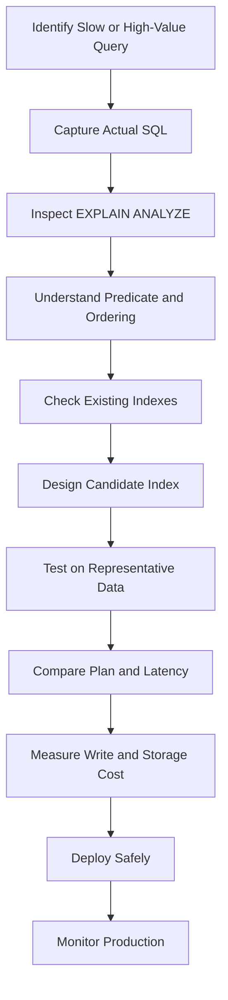

# 09- Index Architecture

## Overview

Indexes are data structures that allow a database to locate qualifying rows without scanning an entire table.

For backend systems, indexing is one of the most important database performance mechanisms because application query patterns directly determine whether the database can efficiently access data.

A useful mental model is:

```text
Application Query
      │
      ▼
SQL Predicate / Ordering / Join
      │
      ▼
Query Optimizer
      │
      ├── Sequential Scan
      │
      └── Index Access Path
              │
              ▼
         Candidate Rows
              │
              ▼
         Table / Heap Access
              │
              ▼
           Result
```

An index is not automatically beneficial. It introduces additional storage, write amplification, maintenance work, and optimizer choices. Good index architecture is therefore about **matching indexes to real query patterns**, not creating an index for every column.

---

## Why Indexes Exist

Without an index, a query such as:

```sql
SELECT *
FROM orders
WHERE customer_id = 42;
```

may require PostgreSQL to inspect a large portion of the table:

```text
Orders table
 ├── row 1
 ├── row 2
 ├── row 3
 ├── ...
 └── row N

Check customer_id for every row
```

With an appropriate index:

```text
customer_id index
       │
       ▼
customer_id = 42
       │
       ▼
Matching row locations
       │
       ▼
Orders table
```

The database can often avoid reading unrelated rows.

Indexes are particularly valuable when:

- Tables are large.
- Predicates are selective.
- Queries are latency-sensitive.
- Ordering or grouping can benefit from an index.
- Foreign-key joins are frequent.
- API endpoints repeatedly query the same access patterns.

---

## Index Architecture

A PostgreSQL index is a separate database structure associated with a table.

Conceptually:

```text
                 Query
                   │
                   ▼
              Query Planner
                   │
                   ▼
             Index Structure
                   │
          ┌────────┴────────┐
          ▼                 ▼
     Key / Entry       Row Location
                            │
                            ▼
                         Heap
                            │
                            ▼
                         Row Data
```

The index does not normally contain the entire table row.

For a traditional B-tree index, it primarily maintains indexed key values and references that allow PostgreSQL to locate corresponding table tuples.

---

## Indexes and the Query Planner

Creating an index does not force PostgreSQL to use it.

The optimizer compares possible access paths:

```text
                Query
                  │
                  ▼
              Planner
             /       \
            /         \
     Seq Scan       Index Scan
         │               │
         ▼               ▼
    Cost estimate    Cost estimate
            \         /
             \       /
              ▼     ▼
            Cheapest
            estimated
              plan
```

The planner considers factors such as:

- Table size
- Estimated row count
- Predicate selectivity
- Statistics
- Random vs sequential I/O
- Cache state assumptions
- Sort requirements
- Join strategy
- Available indexes
- Parallel execution opportunities

Therefore:

```text
Index exists
≠
Index will be used
```

---

## B-Tree Index

B-tree is PostgreSQL's default and most generally useful index type.

Example:

```sql
CREATE INDEX idx_orders_customer_id
ON orders(customer_id);
```

B-tree indexes are effective for many operations involving:

- Equality
- Range predicates
- Ordering
- Prefix-compatible comparisons

Examples:

```sql
WHERE customer_id = 42
```

```sql
WHERE created_at >= TIMESTAMP '2026-01-01'
```

```sql
ORDER BY created_at DESC
```

They are the default choice for many OLTP workloads.

---

## B-Tree Structure

A simplified representation:

```text
                 Root
              /        \
             /          \
        Internal       Internal
        /    \          /    \
       ▼      ▼        ▼      ▼
     Leaf   Leaf      Leaf   Leaf
      │       │         │      │
      ▼       ▼         ▼      ▼
    Entries Entries   Entries Entries
```

The tree structure keeps lookup depth relatively small as the index grows.

The important engineering property is that the database does not need to inspect every index entry to locate a narrow key range.

---

## Equality Lookups

For:

```sql
SELECT *
FROM users
WHERE email = 'user@example.com';
```

an index such as:

```sql
CREATE INDEX idx_users_email
ON users(email);
```

can provide an efficient access path when the optimizer estimates that using it is cheaper than scanning the table.

For unique business identifiers, a unique index is often preferable:

```sql
CREATE UNIQUE INDEX uq_users_email
ON users(email);
```

This provides both:

- Efficient lookup
- Database-enforced uniqueness

---

## Range Queries

B-tree indexes are particularly useful for ranges.

```sql
SELECT *
FROM orders
WHERE created_at >= TIMESTAMP '2026-09-01'
  AND created_at < TIMESTAMP '2026-10-01';
```

With:

```sql
CREATE INDEX idx_orders_created_at
ON orders(created_at);
```

PostgreSQL can locate the relevant section of the index rather than starting from the beginning of the table.

---

## Ordering

Indexes can also support ordering.

```sql
SELECT id, created_at
FROM orders
WHERE customer_id = 42
ORDER BY created_at DESC
LIMIT 50;
```

A composite index can potentially support both filtering and ordering:

```sql
CREATE INDEX idx_orders_customer_created
ON orders(customer_id, created_at DESC);
```

This is particularly useful for common API patterns such as:

```text
Get latest N records for a customer
```

---

## Composite Indexes

A composite index contains multiple columns:

```sql
CREATE INDEX idx_orders_customer_status_created
ON orders(customer_id, status, created_at DESC);
```

Column order matters.

The index is conceptually ordered by:

```text
customer_id
    ↓
status
    ↓
created_at
```

This is fundamentally different from having three independent indexes.

---

## Column Order in Composite Indexes

Consider:

```sql
CREATE INDEX idx_orders_customer_status
ON orders(customer_id, status);
```

It is well suited to queries such as:

```sql
WHERE customer_id = 42
```

and:

```sql
WHERE customer_id = 42
  AND status = 'pending';
```

But it is generally less useful for a query filtering only on:

```sql
WHERE status = 'pending';
```

The leading columns matter.

A useful rule is:

> Design composite indexes around actual query access patterns, with particular attention to the leading columns.

---

## Equality, Range, and Ordering

For a query such as:

```sql
SELECT *
FROM orders
WHERE customer_id = 42
  AND status = 'pending'
  AND created_at >= TIMESTAMP '2026-09-01'
ORDER BY created_at DESC
LIMIT 50;
```

a possible index is:

```sql
CREATE INDEX idx_orders_customer_status_created
ON orders(customer_id, status, created_at DESC);
```

This structure reflects:

```text
Equality predicates
       ↓
Range / ordering column
       ↓
Result retrieval
```

This is not a universal formula, but it is a useful starting point for OLTP index design.

---

## Selectivity

Selectivity describes how narrowly a predicate identifies rows.

For example:

```text
WHERE id = 123
```

is usually highly selective.

A predicate such as:

```text
WHERE is_active = true
```

may be poorly selective if most rows are active.

High selectivity often makes an index more attractive.

However, selectivity is only one factor. Table size, correlation, caching, query shape, and required ordering can all affect the optimal plan.

---

## Low-Cardinality Columns

Consider:

```sql
status
```

with only:

```text
pending
completed
cancelled
```

An index on `status` may or may not be useful.

If:

```text
90% → completed
10% → other states
```

a query for `completed` may still require substantial data access.

Do not use:

```text
"Low cardinality means never index it."
```

as a universal rule.

A low-cardinality column can still be valuable in:

- Composite indexes
- Partial indexes
- Queries selecting a small subset
- Large tables with skewed distributions

---

## Index-Only Scans

Sometimes PostgreSQL can satisfy a query using only the index without fetching the corresponding table rows.

Example:

```sql
CREATE INDEX idx_orders_customer_created
ON orders(customer_id, created_at);
```

Query:

```sql
SELECT customer_id, created_at
FROM orders
WHERE customer_id = 42;
```

If the required data is available from the index and visibility conditions allow it, PostgreSQL may use an index-only scan.

This can reduce heap access significantly.

---

## `INCLUDE` Columns

PostgreSQL supports included columns:

```sql
CREATE INDEX idx_orders_customer
ON orders(customer_id)
INCLUDE (created_at, status);
```

The key column participates in index ordering and search.

Included columns are stored in the index to support queries that need additional values without making those values part of the index's search key.

Use this carefully because included columns increase index size and write overhead.

---

## Covering Indexes

A covering index contains enough information to support a query efficiently.

For example:

```sql
CREATE INDEX idx_orders_customer_created
ON orders(customer_id, created_at DESC)
INCLUDE (status);
```

This may support:

```sql
SELECT created_at, status
FROM orders
WHERE customer_id = 42
ORDER BY created_at DESC
LIMIT 50;
```

The goal is not to include every column.

Large covering indexes can become expensive to maintain.

---

## Partial Indexes

A partial index indexes only rows satisfying a predicate.

Example:

```sql
CREATE INDEX idx_orders_pending_customer
ON orders(customer_id, created_at DESC)
WHERE status = 'pending';
```

This is useful when only a subset of rows is frequently queried.

For example:

```sql
SELECT *
FROM orders
WHERE customer_id = 42
  AND status = 'pending'
ORDER BY created_at DESC;
```

Advantages:

- Smaller index
- Lower maintenance cost for excluded rows
- Potentially better cache efficiency
- Highly targeted access path

The query predicate must be compatible with the partial-index predicate for the planner to use it.

---

## Partial Index for Soft Deletes

Applications often implement soft deletion:

```text
deleted_at IS NULL
```

A partial index can target active records:

```sql
CREATE INDEX idx_users_active_email
ON users(email)
WHERE deleted_at IS NULL;
```

This can be valuable when deleted rows accumulate but normal application queries only access active records.

---

## Unique Partial Indexes

Partial indexes can also enforce conditional uniqueness.

Example:

```sql
CREATE UNIQUE INDEX uq_active_subscription
ON subscriptions(user_id)
WHERE cancelled_at IS NULL;
```

This can enforce:

```text
A user may have at most one active subscription.
```

The database becomes the enforcement point for the business invariant.

---

## Expression Indexes

An expression index indexes the result of an expression.

Example:

```sql
CREATE INDEX idx_users_lower_email
ON users(lower(email));
```

This can support:

```sql
SELECT *
FROM users
WHERE lower(email) = 'user@example.com';
```

Without an appropriate expression index, PostgreSQL may need to evaluate the expression against many rows.

Expression indexes are useful when queries repeatedly apply deterministic expressions to columns.

---

## Function-Based Query Patterns

Suppose the application executes:

```sql
WHERE lower(email) = lower($1)
```

A normal index:

```sql
CREATE INDEX idx_users_email
ON users(email);
```

does not necessarily provide the desired access path because the query applies a function to the column.

An expression index can align the physical structure with the query:

```sql
CREATE INDEX idx_users_lower_email
ON users(lower(email));
```

The query and index expression should be designed together.

---

## Pattern Matching

A normal B-tree index is not automatically suitable for every `LIKE` query.

For example:

```sql
WHERE email LIKE '%@example.com'
```

has a leading wildcard and generally cannot use a normal B-tree index effectively for the pattern.

A prefix pattern such as:

```sql
WHERE email LIKE 'user%'
```

has different optimization possibilities.

For arbitrary substring or similarity searches, PostgreSQL's `pg_trgm` extension and GIN/GiST indexes may be more appropriate.

---

## GIN Index

GIN, or Generalized Inverted Index, is useful for values containing multiple searchable components.

Common examples include:

- Arrays
- `jsonb`
- Full-text search

Example:

```sql
CREATE INDEX idx_products_metadata
ON products
USING GIN(metadata);
```

For JSONB-heavy workloads, GIN can support queries that would otherwise require scanning many rows.

GIN indexes can be substantially larger and more write-intensive than B-tree indexes.

---

## GiST Index

GiST, or Generalized Search Tree, is a flexible index framework useful for data types and operators that are not naturally represented by B-tree ordering.

Common use cases include:

- Geometric data
- Range types
- PostGIS spatial data
- Specialized operator classes

Example:

```sql
CREATE INDEX idx_reservations_period
ON reservations
USING GIST(reservation_period);
```

The correct index type depends on the operators and data type used by the query.

---

## BRIN Index

BRIN, or Block Range Index, stores summaries for ranges of physical table blocks.

Example:

```sql
CREATE INDEX idx_events_created_at_brin
ON events
USING BRIN(created_at);
```

BRIN is useful when:

- Tables are very large.
- Values correlate strongly with physical row order.
- The table is append-heavy.
- A small index footprint is important.

For example:

```text
Older rows → older timestamps
Newer rows → newer timestamps
```

BRIN can identify relevant block ranges without maintaining a large entry for every row.

---

## B-Tree vs GIN vs GiST vs BRIN

| Index Type | Typical Use | Main Advantage | Main Trade-off |
|---|---|---|---|
| B-tree | Equality, ranges, ordering | General-purpose | Not ideal for every data type/pattern |
| GIN | JSONB, arrays, full-text | Efficient inverted lookup | Large/write-intensive |
| GiST | Ranges, spatial/specialized operators | Flexible operator support | Depends heavily on operator class |
| BRIN | Huge correlated tables | Extremely small | Less precise; depends on physical correlation |

Choose the index type based on the query operators and data distribution, not preference.

---

## Hash Indexes

PostgreSQL supports hash indexes for equality comparisons.

Example:

```sql
CREATE INDEX idx_sessions_token_hash
ON sessions
USING HASH(token);
```

However, B-tree remains the standard default for many equality workloads because it supports equality plus range and ordering operations and has broader applicability.

Do not choose hash indexes simply because a query uses `=`.

---

## Foreign Key Indexing

PostgreSQL does not automatically create an index on the referencing side of a foreign key.

For example:

```sql
CREATE TABLE orders (
    id bigint PRIMARY KEY,
    customer_id bigint REFERENCES customers(id)
);
```

An index on:

```sql
orders(customer_id)
```

may be important for:

- Joins
- Parent-child lookups
- Deletes or updates involving the referenced parent
- Common application queries

Example:

```sql
CREATE INDEX idx_orders_customer_id
ON orders(customer_id);
```

Whether it is necessary depends on workload, existing indexes, and query patterns.

---

## Primary Keys and Unique Constraints

A primary key normally has an associated unique index.

Example:

```sql
CREATE TABLE users (
    id bigint PRIMARY KEY
);
```

Likewise:

```sql
CREATE UNIQUE INDEX uq_users_email
ON users(email);
```

A unique index provides both an access path and uniqueness enforcement.

Avoid creating a redundant non-unique index over the same key unless there is a specific reason.

---

## Redundant Indexes

These indexes can overlap:

```sql
CREATE INDEX idx_orders_customer
ON orders(customer_id);

CREATE INDEX idx_orders_customer_status
ON orders(customer_id, status);
```

The second index can often support queries filtering by `customer_id`, making the first potentially redundant.

However, redundancy must be evaluated against:

- Query workload
- Index size
- Ordering requirements
- Partial predicates
- Included columns
- Write overhead

Do not delete an index merely because another index begins with the same column without validating workload impact.

---

## Duplicate Indexes

Exact duplicate indexes are almost always unnecessary.

For example:

```sql
CREATE INDEX idx_users_email
ON users(email);

CREATE INDEX idx_users_email_2
ON users(email);
```

Both structures consume:

- Disk
- Memory/cache
- WAL
- Write processing
- Vacuum/maintenance effort

Index inventories should be periodically reviewed.

---

## Index Write Amplification

Every index adds work to writes.

For:

```sql
INSERT
UPDATE
DELETE
```

PostgreSQL may need to maintain multiple index structures.

Conceptually:

```text
INSERT
  │
  ├── Heap write
  ├── Index 1 update
  ├── Index 2 update
  ├── Index 3 update
  └── Index N update
```

Therefore:

```text
More indexes
→ faster some reads
→ slower writes
→ more storage
→ more maintenance
```

This trade-off is fundamental to index architecture.

---

## Update Cost

Updating an indexed column is more expensive than updating a column that is not indexed because the corresponding index entry may need maintenance.

For high-write tables, carefully review indexes on frequently modified columns.

An index that saves 2 ms on a rare query but adds substantial overhead to millions of writes may be a poor production trade-off.

---

## Index Size

Large indexes consume:

- Disk space
- Shared buffers/cache
- Backup storage
- Replication bandwidth through WAL
- Maintenance resources

A database with:

```text
Table = 500 GB
Indexes = 1.2 TB
```

may spend significant operational resources maintaining indexes.

Index design must therefore consider total storage, not only query latency.

---

## Index Bloat

Indexes can accumulate unused or dead space over time due to updates and deletes.

Bloat can cause:

- Larger indexes
- More I/O
- Reduced cache efficiency
- Longer maintenance operations

Monitor index size and workload before deciding whether remediation is necessary.

Do not automatically rebuild every large index.

---

## `REINDEX`

PostgreSQL supports rebuilding indexes:

```sql
REINDEX INDEX idx_orders_customer_id;
```

For production environments, PostgreSQL also supports:

```sql
REINDEX INDEX CONCURRENTLY idx_orders_customer_id;
```

Concurrent rebuilding has different locking and operational characteristics and generally takes longer.

Index maintenance should be driven by evidence such as bloat, corruption, or a specific operational requirement.

---

## Creating Indexes in Production

A standard index creation can hold locks that interfere with concurrent writes depending on the operation.

For large active tables, consider:

```sql
CREATE INDEX CONCURRENTLY idx_orders_customer_id
ON orders(customer_id);
```

`CREATE INDEX CONCURRENTLY` allows normal table writes to continue during most of the build, but:

- It takes longer.
- It performs more work.
- It cannot run inside a transaction block.
- Failed concurrent builds can leave an invalid index that requires cleanup.

---

## Django Migrations

Django indexes should generally be managed through migrations.

Example:

```python
from django.db import models


class Order(models.Model):
    customer_id = models.BigIntegerField()
    created_at = models.DateTimeField()
    status = models.CharField(max_length=32)

    class Meta:
        indexes = [
            models.Index(
                fields=["customer_id", "-created_at"],
                name="orders_customer_created_idx",
            ),
        ]
```

For production-sized tables, index creation strategy should be considered separately from simply declaring an index in the model.

---

## Django Conditional Indexes

Django supports database-specific index features through model metadata.

For example, a conditional index can target active records:

```python
from django.db import models
from django.db.models import Q


class Subscription(models.Model):
    user_id = models.BigIntegerField()
    cancelled_at = models.DateTimeField(null=True)

    class Meta:
        indexes = [
            models.Index(
                fields=["user_id"],
                name="subscription_active_user_idx",
                condition=Q(cancelled_at__isnull=True),
            ),
        ]
```

Always verify generated migrations and PostgreSQL behavior for production deployments.

---

## Inspecting Query Plans

Use:

```sql
EXPLAIN
SELECT *
FROM orders
WHERE customer_id = 42;
```

For actual execution:

```sql
EXPLAIN (ANALYZE, BUFFERS)
SELECT *
FROM orders
WHERE customer_id = 42;
```

Pay attention to:

- Scan type
- Estimated rows
- Actual rows
- Execution time
- Buffer hits
- Buffer reads
- Loops
- Filtered rows

Do not evaluate an index solely by whether `EXPLAIN` displays its name.

---

## Sequential Scan vs Index Scan

A sequential scan is often correct.

Example:

```text
Table size: 100 rows
Query returns: 80 rows
```

Scanning the table can be cheaper than traversing an index and then fetching most rows.

Conversely:

```text
Table size: 100 million rows
Query returns: 10 rows
```

an index can be dramatically more attractive.

Therefore:

```text
Index scan ≠ always faster
Sequential scan ≠ bad plan
```

The optimizer chooses based on estimated cost.

---

## Bitmap Index Scans

For queries returning many rows, PostgreSQL may use a bitmap strategy.

Conceptually:

```text
Index
  │
  ▼
Matching tuple locations
  │
  ▼
Bitmap
  │
  ▼
Heap pages
  │
  ▼
Rows
```

Bitmap scans can be useful when:

- The result set is larger than an ideal index scan.
- Many rows share heap pages.
- Multiple indexes can be combined.

---

## Combining Indexes

PostgreSQL can sometimes combine multiple indexes through bitmap operations.

For example:

```sql
WHERE customer_id = 42
  AND status = 'pending'
```

could potentially use separate indexes and combine their results.

However, this does not mean:

```text
Many single-column indexes
=
Best index design
```

A purpose-built composite index may still provide a better access path, especially when ordering or limiting is involved.

---

## Sargability

A predicate is generally more index-friendly when the indexed column can be used directly by the access method.

Prefer:

```sql
WHERE created_at >= TIMESTAMP '2026-09-01'
```

over transformations that prevent effective use of a normal index, such as:

```sql
WHERE DATE(created_at) = DATE '2026-09-03'
```

A better equivalent range is:

```sql
WHERE created_at >= TIMESTAMP '2026-09-03'
  AND created_at < TIMESTAMP '2026-09-04'
```

This allows a standard B-tree index on `created_at` to support the range efficiently.

---

## Indexes and Pagination

Offset pagination can become expensive:

```sql
SELECT *
FROM orders
ORDER BY created_at DESC
LIMIT 50 OFFSET 100000;
```

The database may still need to walk past many rows.

Keyset pagination is often more scalable:

```sql
SELECT *
FROM orders
WHERE created_at < $1
ORDER BY created_at DESC
LIMIT 50;
```

A suitable index:

```sql
CREATE INDEX idx_orders_created_at
ON orders(created_at DESC);
```

can support efficient continuation through large datasets.

For stable ordering, use a unique tie-breaker:

```sql
CREATE INDEX idx_orders_created_id
ON orders(created_at DESC, id DESC);
```

---

## Indexes for API Workloads

Consider an endpoint:

```text
GET /customers/{id}/orders?status=pending&limit=50
```

The underlying query may be:

```sql
SELECT id, status, created_at
FROM orders
WHERE customer_id = $1
  AND status = $2
ORDER BY created_at DESC
LIMIT 50;
```

A candidate index:

```sql
CREATE INDEX idx_orders_customer_status_created
ON orders(customer_id, status, created_at DESC);
```

This reflects the actual access pattern rather than indexing each column independently without considering the complete query.

---

## Indexes and ORMs

Django ORM:

```python
orders = (
    Order.objects
    .filter(
        customer_id=customer_id,
        status="pending",
    )
    .order_by("-created_at")[:50]
)
```

still becomes SQL executed by PostgreSQL.

The database does not know that the query originated from Django.

Therefore senior backend engineers should be able to reason across:

```text
Django ORM
    ↓
Generated SQL
    ↓
Query planner
    ↓
Index selection
    ↓
Execution
```

Use Django's query inspection tools and PostgreSQL `EXPLAIN` to validate assumptions.

---

## Indexes and Microservices

Microservices often create independently owned database schemas.

Each service should optimize indexes around its own workload.

For example:

```text
Order Service
 ├── customer lookup
 ├── order status
 └── recent orders

Payment Service
 ├── transaction ID
 ├── customer ID
 └── payment status
```

Do not create indexes based on another service's hypothetical queries against data it should not directly own.

Service ownership and query ownership should align.

---

## Indexes and Read Replicas

Indexes must exist on replicas if queries there depend on those access paths.

In PostgreSQL physical replication, index changes are replicated as part of database changes.

However, read replicas can have different workloads from the primary.

For example:

```text
Primary
→ write-heavy

Replica
→ analytics / read-heavy
```

If indexing strategy is changed to optimize replica workloads, consider the additional storage and WAL/write cost on the primary.

---

## Indexes and Caching

Redis may reduce database query volume:

```text
API
 │
 ├── Redis hit → response
 │
 └── Redis miss
          │
          ▼
      PostgreSQL
          │
          ▼
        Cache
```

Caching does not eliminate the need for appropriate indexes.

Cache misses, invalidation events, cold starts, and cache failures still send traffic to the database.

Design the database to remain healthy under realistic cache-miss scenarios.

---

## Index Maintenance and Autovacuum

PostgreSQL maintenance processes interact with indexes.

Autovacuum helps maintain table health and visibility information, while vacuuming also affects index cleanup.

For high-write tables, monitor:

- Autovacuum activity
- Dead tuples
- Index size
- Table size
- Query latency
- WAL volume

Poor maintenance can eventually make a previously effective index strategy perform poorly.

---

## Statistics and Index Selection

The optimizer relies heavily on statistics.

After substantial data distribution changes, statistics may need updating.

For example:

```sql
ANALYZE orders;
```

The optimizer uses statistics to estimate:

```text
How many rows will this predicate return?
```

Bad cardinality estimates can lead to poor index and join choices even when appropriate indexes exist.

---

## Partial Indexes and Data Distribution

Partial indexes become particularly valuable when data is heavily skewed.

Example:

```text
100 million orders

99 million → completed
1 million → pending
```

A partial index:

```sql
CREATE INDEX idx_pending_orders
ON orders(customer_id, created_at DESC)
WHERE status = 'pending';
```

can be much smaller than indexing all 100 million rows.

This is a strong example of aligning physical database architecture with business workload characteristics.

---

## Index Design Workflow

A production index should normally be created from evidence.



A useful workflow is:

1. Identify a real workload.
2. Capture the actual SQL.
3. Inspect the execution plan.
4. Understand filtering, joins, ordering, and pagination.
5. Review existing indexes.
6. Design the smallest useful index.
7. Test with realistic data volume and distribution.
8. Measure both read improvement and write/storage cost.
9. Deploy using an appropriate production-safe strategy.
10. Monitor after deployment.

---

## Index Testing

Testing against a tiny development database can be misleading.

For example:

```text
Development
10,000 rows

Production
500,000,000 rows
```

A sequential scan may appear perfectly fast in development while becoming unacceptable in production.

Representative testing should consider:

- Data volume
- Data distribution
- Cache state
- Concurrent traffic
- Query frequency
- Write rate
- Existing indexes

---

## Index Naming

Use consistent names.

Example:

```text
orders_customer_id_idx
orders_customer_status_created_idx
users_lower_email_idx
subscriptions_active_user_idx
```

Names should communicate:

- Table
- Indexed columns or expression
- Important predicate when partial

Consistent naming makes operational debugging and migration review significantly easier.

---

## Production Index Review

Periodically review:

- Unused indexes
- Duplicate indexes
- Overlapping indexes
- Very large indexes
- Index scan frequency
- Write-heavy tables
- Query regressions
- Storage growth

PostgreSQL statistics views can help identify indexes that receive little or no scan activity.

For example:

```sql
SELECT
    schemaname,
    relname,
    indexrelname,
    idx_scan,
    pg_size_pretty(pg_relation_size(indexrelid)) AS index_size
FROM pg_stat_user_indexes
ORDER BY pg_relation_size(indexrelid) DESC;
```

An index with low scan counts is a candidate for investigation, not automatic deletion.

---

## Common Index Mistakes

### Indexing Every Column

Adding an index to every frequently queried column feels safe but increases write and storage costs.

**Better:** design indexes around actual query patterns.

### Assuming Every Query Should Use an Index

Sequential scans can be optimal.

**Better:** validate with `EXPLAIN (ANALYZE, BUFFERS)`.

### Ignoring Composite Column Order

An index on:

```sql
(a, b)
```

is not equivalent to:

```sql
(b, a)
```

**Better:** design the leading columns around actual predicates and ordering.

### Creating Separate Indexes for Every Predicate

Several single-column indexes may be inferior to a carefully designed composite index.

**Better:** optimize the complete query shape.

### Ignoring Write Cost

Indexes accelerate reads but increase write work.

**Better:** measure the read benefit against write amplification.

### Indexing a Function Without an Expression Index

A normal index on `email` may not efficiently support:

```sql
WHERE lower(email) = ...
```

**Better:** use an appropriate expression index.

### Ignoring Partial Indexes

Indexing millions of rows when the application only accesses a small subset wastes resources.

**Better:** consider partial indexes for stable, selective predicates.

### Using `SELECT *`

A query may fetch much more data than required, reducing the benefits of indexes.

**Better:** select only required columns, especially for API endpoints.

### Testing Only on Small Data

Plans can change dramatically at production scale.

**Better:** test with representative data volume and distribution.

### Blindly Removing Unused Indexes

A low scan count does not necessarily mean an index is useless. Some indexes support rare but critical queries or constraints.

**Better:** correlate index statistics with query workload and business importance before removal.

---

## Security Considerations

Indexes can indirectly affect security and availability.

Poor index design can cause expensive scans on endpoints exposed to untrusted users.

For example:

```text
Unbounded API query
      │
      ▼
Large sequential scan
      │
      ▼
Database resource exhaustion
```

Use:

- Query limits
- Pagination
- Appropriate indexes
- Statement timeouts
- Rate limiting
- Input validation

Do not rely on indexes as a substitute for API-level resource controls.

---

## Reliability Considerations

An index deployment should be treated as a production change.

Before adding a large index, evaluate:

- Disk capacity
- Build duration
- Lock behavior
- CPU and I/O impact
- Replication lag
- Backup implications
- Deployment timing

A poorly planned index build can affect a healthy production database even if the final query performance improves.

---

## High Availability and Replication

Large index creation generates substantial database activity.

On replicated PostgreSQL systems this can contribute to:

- WAL generation
- Replica lag
- Increased storage consumption
- Longer recovery/replay work

For critical systems, monitor replicas while deploying large indexes.

Avoid assuming:

```text
CREATE INDEX
→ only affects query performance
```

It is also a storage and replication event.

---

## Cost Considerations

Indexes consume more than database disk.

They can increase:

- Primary storage
- Replica storage
- Backup size
- WAL volume
- I/O
- Memory pressure
- Maintenance workload

A useful architectural metric is:

```text
Read latency improvement
        vs
Storage + write + operational cost
```

The cheapest database architecture is not the one with the fewest indexes. It is the one that meets workload requirements without unnecessary physical structures.

---

## Interview Traps

### Why doesn't PostgreSQL always use an index?

Because the optimizer chooses the lowest estimated-cost plan. A sequential scan can be cheaper for large result sets or small tables.

### What is the most important property of a composite index?

Column order. The leading columns strongly influence which query predicates and ordering requirements the index can efficiently support.

### Why can too many indexes hurt performance?

Every index consumes storage and requires maintenance during writes, increasing write amplification and potentially WAL and maintenance overhead.

### What is a covering index?

An index that contains the information needed by a query so that PostgreSQL may avoid fetching table rows, potentially enabling an index-only scan.

### What is a partial index?

An index containing only rows satisfying a predicate, useful for highly targeted workloads such as active records or pending jobs.

### What is the difference between B-tree and GIN?

B-tree is a general-purpose ordered index suitable for equality, ranges, and ordering. GIN is an inverted index suited to multi-valued/search-oriented structures such as JSONB, arrays, and full-text search.

### When is BRIN useful?

For very large tables where indexed values correlate strongly with physical row order, such as append-heavy timestamped data.

### Why can a low-cardinality column still be useful in an index?

It may become selective when combined with other columns or a partial predicate, and data distribution can make certain values highly selective.

### What is index selectivity?

It describes how effectively an index or predicate narrows the candidate row set. Higher selectivity generally makes index access more attractive, but the optimizer considers multiple factors.

### Why is `EXPLAIN ANALYZE` important for index design?

It shows actual execution behavior, including row counts and execution timing, allowing comparison between planner estimates and reality.

### What is a hot index?

An index or index region receiving heavy concurrent access can become a contention or cache-pressure point, although application-level hot rows are often the more visible bottleneck.

### Does PostgreSQL automatically index foreign keys?

No. The referenced primary/unique key is indexed, but PostgreSQL does not automatically create an index on the referencing foreign-key column.

### Why might `LIKE '%abc%'` not use a normal B-tree index?

Because the leading wildcard prevents the normal ordered B-tree structure from efficiently narrowing the search range. Specialized indexes such as trigram indexes may be more appropriate.

### Should indexes be created based on column cardinality alone?

No. Query shape, selectivity, ordering, joins, data distribution, write frequency, table size, and existing indexes all matter.

## Key Takeaways

- Index architecture is about matching physical access paths to real query patterns; an index is useful only when its cost and structure make the resulting plan better.
- B-tree is the general-purpose default, while GIN, GiST, and BRIN solve specialized workloads such as JSONB/search, ranges/spatial data, and very large correlated tables.
- Composite index column order, partial indexes, expression indexes, and covering indexes are essential tools for optimizing production query shapes beyond simple single-column indexing.
- Every index has a write, storage, WAL, replication, and maintenance cost, so excessive or redundant indexes can make a high-throughput system slower and more expensive.
- Production index design should be evidence-driven: inspect real SQL and execution plans, test against representative data, deploy safely, and monitor both query performance and operational cost.