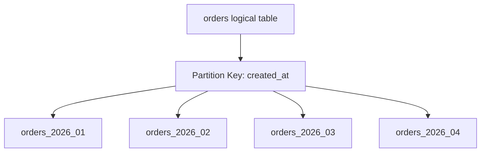
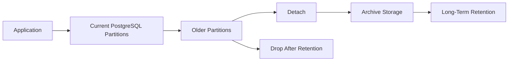
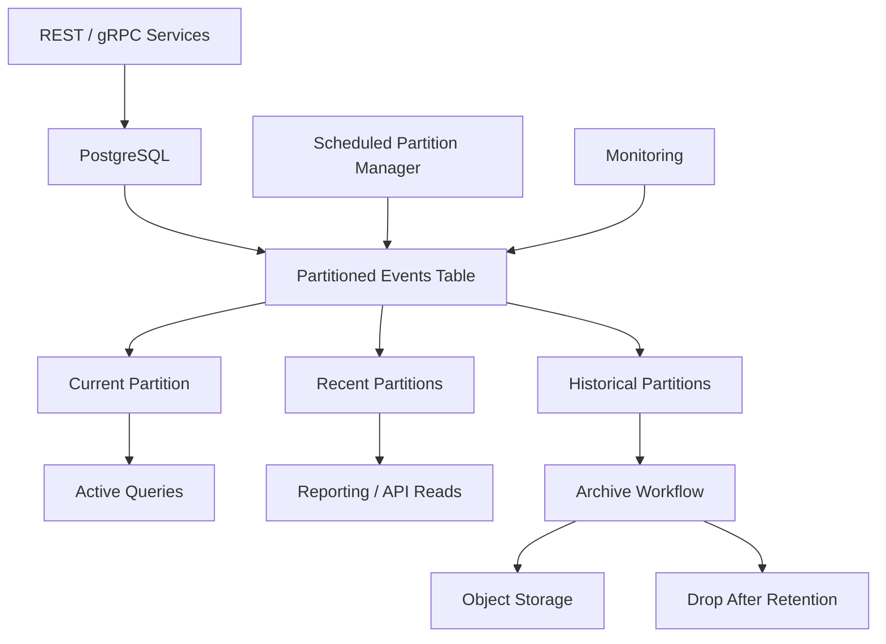

# 10- Partitioned Table Architecture

## Overview

Table partitioning divides one logical table into multiple physical partitions while allowing applications to query the data through a single logical table.

Partitioning is primarily a **data management and scalability technique**, not a universal query-performance optimization.

A useful mental model is:

```text
                         Application
                              │
                              ▼
                       Logical Table
                              │
                     Query Planner
                              │
                    Partition Pruning
                              │
          ┌───────────────────┼───────────────────┐
          ▼                   ▼                   ▼
    orders_2026_01      orders_2026_02      orders_2026_03
          │                   │                   │
          ▼                   ▼                   ▼
       Physical            Physical            Physical
       Storage             Storage             Storage
```

The application can continue to query:

```sql
SELECT *
FROM orders
WHERE created_at >= TIMESTAMP '2026-03-01'
  AND created_at < TIMESTAMP '2026-04-01';
```

while PostgreSQL can restrict execution to the relevant partition instead of scanning every partition.

Partitioning becomes particularly valuable for large, naturally segmented datasets such as:

- Time-series events
- Audit logs
- Application logs
- Orders
- Financial transactions
- Metrics
- IoT data
- Large append-heavy tables

---

## Why Partition Tables

A very large table can eventually create operational problems even when individual queries are well indexed.

Typical challenges include:

- Large indexes
- Expensive maintenance
- Vacuum overhead
- Slow archival or deletion operations
- Large table scans
- Long-running data-management operations
- Backup and restore complexity
- Difficulty isolating old data

Partitioning allows the database to divide this workload into manageable physical units.

For example:

```text
orders
├── orders_2025
├── orders_2026_01
├── orders_2026_02
├── orders_2026_03
└── orders_2026_04
```

The application still sees one logical dataset.

---

## Partitioning vs Sharding

Partitioning and sharding are related but different.

| Characteristic | Partitioning | Sharding |
|---|---|---|
| Physical scope | Usually within one database | Across databases/nodes |
| Application complexity | Relatively low | Higher |
| Query routing | Database planner | Often application/router |
| Primary purpose | Manage large tables | Scale beyond one database |
| Transactions | Usually local | Can become distributed |
| Operational complexity | Moderate | High |

PostgreSQL table partitioning does not automatically provide horizontal database scaling.

A partitioned table still belongs to the same PostgreSQL database cluster.

---

## PostgreSQL Partitioning Model

PostgreSQL uses declarative partitioning.

There are three primary partitioning strategies:

| Strategy | Typical Use |
|---|---|
| Range | Time, numeric ranges |
| List | Explicit categories or tenants |
| Hash | Even distribution by key |

The parent table defines the logical schema and partitioning strategy.

Partitions contain the physical rows.

---

## Range Partitioning

Range partitioning divides rows according to ranges of values.

Time-based partitioning is the most common production use case.

Example:

```sql
CREATE TABLE orders (
    id bigint NOT NULL,
    customer_id bigint NOT NULL,
    created_at timestamptz NOT NULL,
    status text NOT NULL,
    total_amount numeric(12, 2) NOT NULL
) PARTITION BY RANGE (created_at);
```

Create monthly partitions:

```sql
CREATE TABLE orders_2026_01
PARTITION OF orders
FOR VALUES FROM ('2026-01-01') TO ('2026-02-01');

CREATE TABLE orders_2026_02
PARTITION OF orders
FOR VALUES FROM ('2026-02-01') TO ('2026-03-01');
```

The upper bound is exclusive.

Therefore:

```text
2026-01-01 <= created_at < 2026-02-01
```

belongs to `orders_2026_01`.

---

## Range Partition Architecture



The application does not normally need to know which physical partition contains a row.

PostgreSQL routes inserts and plans queries against the appropriate partitions.

---

## List Partitioning

List partitioning maps explicit values to partitions.

Example:

```sql
CREATE TABLE customers (
    id bigint NOT NULL,
    region text NOT NULL,
    email text NOT NULL
) PARTITION BY LIST (region);
```

Partitions:

```sql
CREATE TABLE customers_india
PARTITION OF customers
FOR VALUES IN ('IN');

CREATE TABLE customers_us
PARTITION OF customers
FOR VALUES IN ('US');

CREATE TABLE customers_uk
PARTITION OF customers
FOR VALUES IN ('UK');
```

List partitioning can be useful when the categories are:

- Stable
- Explicit
- Operationally meaningful

Avoid using list partitioning when the category cardinality can grow without control.

---

## Hash Partitioning

Hash partitioning distributes rows based on a hash of the partition key.

Example:

```sql
CREATE TABLE events (
    id bigint NOT NULL,
    tenant_id bigint NOT NULL,
    created_at timestamptz NOT NULL
) PARTITION BY HASH (tenant_id);
```

Create partitions:

```sql
CREATE TABLE events_p0
PARTITION OF events
FOR VALUES WITH (MODULUS 4, REMAINDER 0);

CREATE TABLE events_p1
PARTITION OF events
FOR VALUES WITH (MODULUS 4, REMAINDER 1);

CREATE TABLE events_p2
PARTITION OF events
FOR VALUES WITH (MODULUS 4, REMAINDER 2);

CREATE TABLE events_p3
PARTITION OF events
FOR VALUES WITH (MODULUS 4, REMAINDER 3);
```

Hash partitioning is useful when the objective is distributing data relatively evenly rather than creating meaningful data ranges.

---

## Choosing a Partition Key

The partition key should be driven by workload and operational requirements.

Good candidates often have:

- Predictable query filtering
- Natural lifecycle boundaries
- Large data volume
- Clear archival requirements
- Stable distribution

For event data:

```text
created_at
```

is often a strong candidate.

For tenant-oriented workloads:

```text
tenant_id
```

may be useful, but only when the resulting partition distribution and query patterns justify it.

---

## Partition Key Trade-offs

| Partition Key | Advantages | Risks |
|---|---|---|
| Timestamp | Excellent lifecycle management | Hot current partition |
| Tenant ID | Tenant-oriented operations | Uneven tenant sizes |
| Region | Operational isolation | Small number of categories |
| Hash key | Even distribution | Poor lifecycle management |
| Sequential ID | Simple ranges | Often weaker business alignment |

A technically valid partition key can still be a poor architectural choice if it does not align with query and operational workflows.

---

## Partition Pruning

Partition pruning is one of the most important concepts in partitioned-table performance.

Suppose:

```text
orders_2026_01
orders_2026_02
orders_2026_03
orders_2026_04
```

and the query asks for:

```sql
WHERE created_at >= '2026-03-01'
  AND created_at < '2026-04-01'
```

PostgreSQL can prune irrelevant partitions:

```text
Query
  │
  ▼
Partition pruning
  │
  ├── orders_2026_01 → skip
  ├── orders_2026_02 → skip
  ├── orders_2026_03 → scan
  └── orders_2026_04 → skip
```

This can significantly reduce the amount of data that needs to be scanned.

---

## Partition Pruning Is Not Automatic for Every Query

A partitioned table does not guarantee partition pruning.

For example, poorly structured predicates or expressions may make pruning difficult or impossible.

Prefer predicates that directly constrain the partition key:

```sql
WHERE created_at >= $1
  AND created_at < $2
```

rather than unnecessarily transforming the partition key.

Use:

```sql
EXPLAIN
SELECT *
FROM orders
WHERE created_at >= TIMESTAMPTZ '2026-03-01'
  AND created_at < TIMESTAMPTZ '2026-04-01';
```

to verify the resulting plan.

---

## Partition Pruning vs Indexing

Partition pruning and indexing solve different problems.

```text
Partition pruning
→ Which partitions should be touched?

Index
→ Which rows should be located within a partition?
```

A production query may benefit from both:

```text
Query
 │
 ▼
Partition pruning
 │
 ▼
Relevant partition
 │
 ▼
Partition-local index
 │
 ▼
Target rows
```

Partitioning does not eliminate the need for indexes.

---

## Indexes on Partitioned Tables

Indexes can be defined on the partitioned parent:

```sql
CREATE INDEX orders_customer_created_idx
ON orders(customer_id, created_at DESC);
```

PostgreSQL maintains corresponding partition indexes.

Conceptually:

```text
orders_customer_created_idx
          │
          ├── local index → orders_2026_01
          ├── local index → orders_2026_02
          ├── local index → orders_2026_03
          └── local index → orders_2026_04
```

Each partition has its own physical index structure.

---

## Partition-Local Indexes

Partition-local indexes can be advantageous operationally.

For example:

```text
Current partition
→ actively queried
→ frequently updated

Old partition
→ mostly read-only
→ archival workload
```

Indexes on different partitions can therefore have different practical operational importance.

This also makes maintenance more granular.

---

## Unique Constraints and Partitioning

Partitioning introduces an important constraint consideration.

For a unique constraint or primary key defined on a partitioned table, PostgreSQL generally requires the partition key to be included in the constraint's key when uniqueness must be enforced across the entire partitioned table.

For example:

```sql
CREATE TABLE events (
    id bigint NOT NULL,
    created_at timestamptz NOT NULL,
    PRIMARY KEY (id, created_at)
) PARTITION BY RANGE (created_at);
```

This matters because uniqueness is enforced through the partition-local structures.

A globally unique `id` independent of the partition key requires additional architectural consideration.

---

## Global Uniqueness Problem

Suppose:

```text
Partition A
id = 100

Partition B
id = 100
```

A partition-local uniqueness rule cannot independently guarantee:

```text
id is globally unique across all partitions
```

If the application requires globally unique identifiers, consider:

- UUIDs
- Globally unique application-generated IDs
- Composite keys including the partition key
- Sequences with appropriate architecture
- A separate uniqueness mechanism where justified

Choose the identifier strategy before partitioning a production table.

---

## Foreign Keys and Partitioning

Foreign-key relationships involving partitioned tables have evolved across PostgreSQL versions and require version-specific validation.

Before adopting partitioning for a schema with many foreign keys, verify:

- Referenced partitioned-table support
- Referencing partitioned-table support
- Constraint behavior
- Migration behavior
- Application ORM support

Do not assume that partitioning is transparent to every relational feature.

---

## Default Partitions

A default partition can catch rows that do not fit existing partitions.

Example:

```sql
CREATE TABLE orders_default
PARTITION OF orders DEFAULT;
```

This prevents inserts from failing when no explicit partition covers the value.

However, default partitions can hide partition-management mistakes.

For time-based production systems, an explicit partition creation process is often preferable to relying blindly on a default partition.

---

## Missing Partitions

Without an appropriate partition:

```sql
INSERT INTO orders (...)
VALUES (...);
```

can fail with an error indicating that no partition matches the row.

This can become an availability problem if partition creation is forgotten.

A production architecture should therefore automate partition lifecycle management.

---

## Automated Partition Creation

For a monthly partitioned table:

```text
Current
   │
   ▼
2026-09

Prepare
   │
   ▼
2026-10
   │
   ▼
Create partition before traffic arrives
```

Possible approaches include:

- CI/CD migration
- Scheduled management job
- Administrative automation
- Infrastructure orchestration
- Database-native scheduling where appropriate

The key requirement is:

```text
Create future partitions before they are required.
```

---

## Partition Lifecycle Management

Time-based partitioning provides a strong operational advantage.

Example:

```text
Hot
2026-09

Warm
2026-06 → 2026-08

Cold
2025

Archive/Delete
older than retention policy
```

Each partition can have a different lifecycle.

This is often much more efficient than deleting old rows individually from one massive table.

---

## Dropping Old Data

Suppose retention requires deleting all data from January 2025.

On an unpartitioned table:

```sql
DELETE FROM events
WHERE created_at < TIMESTAMPTZ '2025-02-01';
```

This can generate substantial:

- WAL
- Dead tuples
- Vacuum work
- Locking/transaction pressure

With partitioning, an entire old partition can be detached or dropped.

For example:

```sql
DROP TABLE events_2025_01;
```

When the partition is no longer needed.

The exact operational workflow should account for foreign keys, backups, compliance, and retention requirements.

---

## Detaching Partitions

A partition can be detached from the parent table.

```sql
ALTER TABLE events
DETACH PARTITION events_2025_01;
```

This can be useful for archival workflows.

Conceptually:

```text
Partitioned table
      │
      ├── Current partitions
      │
      └── Old partition
             │
             ▼
          DETACH
             │
             ▼
       Independent table
             │
             ▼
        Archive / export
```

This separates the archival operation from the active partitioned table.

---

## Archival Architecture

A mature retention architecture can look like:



AWS environments may archive historical data into object storage such as S3 when relational queryability is no longer required.

The exact architecture depends on compliance and retrieval requirements.

---

## Partitioning and Vacuum

Partitioning can reduce the scope of maintenance operations.

Instead of:

```text
One huge table
→ one massive maintenance problem
```

you have:

```text
Many smaller partitions
→ independent maintenance units
```

This can improve operational manageability.

However, partitioning does not eliminate vacuum requirements.

High-write current partitions may still generate significant dead tuples and require aggressive maintenance.

---

## Hot and Cold Partitions

A common production pattern is:

```text
Current partition
→ high write rate
→ frequent queries
→ active indexes

Older partitions
→ read-heavy
→ fewer updates
→ eventual archival
```

This makes partitioning especially useful for append-heavy event and transaction systems.

---

## Partitioning and Write Distribution

Range partitioning can create a hot partition.

For example:

```text
Current month
    │
    ▼
90% of writes
```

while older partitions receive almost no writes.

This is not necessarily a problem on a single PostgreSQL node, but it can become relevant for:

- Lock contention
- Index growth
- Autovacuum workload
- I/O concentration
- Operational maintenance

Partitioning does not automatically distribute writes across database servers.

---

## Partitioning Does Not Scale a Single Database Horizontally

This distinction is important:

```text
Partitioning
→ multiple physical relations
→ same PostgreSQL cluster

Sharding
→ multiple database nodes
```

If a PostgreSQL server has reached CPU, memory, storage, or I/O limits, partitioning alone does not move the workload to additional machines.

Partitioning improves manageability and can improve query performance through pruning, but it is not a replacement for distributed database architecture.

---

## Partition Count

Too few partitions can limit the operational and pruning benefits.

Too many partitions can create planner and management overhead.

For example:

```text
1 partition
→ little partitioning benefit

12 monthly partitions
→ often manageable

100,000 tiny partitions
→ substantial metadata/planning/operational complexity
```

The correct number depends on:

- Data volume
- Partition size
- Query patterns
- Retention policy
- PostgreSQL version
- Operational tooling

Avoid creating partitions merely because smaller sounds better.

---

## Partition Size

Partition size should reflect operational goals.

A useful partition should be large enough to justify its existence but small enough to:

- Maintain efficiently
- Archive independently
- Drop quickly
- Restore selectively where applicable
- Keep indexes manageable

There is no universal ideal partition size.

Measure the workload rather than applying a fixed GB threshold.

---

## Multi-Level Partitioning

PostgreSQL supports subpartitioning.

For example:

```text
orders
 ├── 2026_01
 │    ├── region_a
 │    └── region_b
 ├── 2026_02
 │    ├── region_a
 │    └── region_b
 └── 2026_03
      ├── region_a
      └── region_b
```

This can be useful for complex workloads but increases operational complexity substantially.

Use multi-level partitioning only when the additional dimension provides a meaningful query or lifecycle benefit.

---

## Partitioning and ORM Usage

Django can query PostgreSQL partitioned tables because PostgreSQL exposes the partitioned table as a logical relation.

The application can generally continue using:

```python
Order.objects.filter(
    created_at__gte=start,
    created_at__lt=end,
)
```

However, ORM abstractions do not remove database-specific operational requirements.

Teams must still manage:

- Partition creation
- Partition retention
- Indexes
- Migrations
- Constraints
- Query plans
- Monitoring

Partition lifecycle management should be treated as database infrastructure.

---

## Partitioning and FastAPI

FastAPI itself does not change partitioning behavior.

A typical request flow remains:

```text
FastAPI
   │
   ▼
SQLAlchemy / driver
   │
   ▼
PostgreSQL
   │
   ▼
Partition pruning
   │
   ▼
Relevant partition
```

The important optimization occurs inside PostgreSQL.

The application should provide predicates that allow the planner to identify relevant partitions.

---

## Partitioning and Kafka

Partitioned relational tables often pair naturally with event-driven ingestion.

Example:

```text
Kafka
 │
 ▼
Consumer
 │
 ▼
PostgreSQL
 │
 ├── Current partition
 ├── Previous partition
 └── Historical partitions
```

Kafka partitions and PostgreSQL table partitions are independent concepts.

Do not assume:

```text
Kafka partition
=
PostgreSQL partition
```

They solve different problems.

Kafka partitions primarily support distributed event processing and ordering by partition key, while PostgreSQL table partitions organize relational storage and query/maintenance behavior.

---

## Partitioning and Celery

Background workers can perform lifecycle operations such as:

```text
Create future partitions
Archive old partitions
Detach expired partitions
Validate partition coverage
Monitor partition sizes
```

However, partition-management jobs should be idempotent and coordinated so multiple workers do not attempt conflicting DDL operations simultaneously.

---

## Partitioning and Transactions

Partition DDL can interact with transactions and locking.

Production partition-management operations should be designed with awareness of:

- Lock acquisition
- Long-running transactions
- Concurrent queries
- Deployment timing
- Failure handling

Do not place large operational workflows inside a long-running application transaction.

---

## Partitioning and Index Maintenance

One advantage of partitioning is the ability to maintain indexes at partition granularity.

For example:

```text
orders_2026_01
 └── indexes

orders_2026_02
 └── indexes

orders_2026_03
 └── indexes
```

An operational task can focus on a specific partition instead of rebuilding or reorganizing an enormous global structure.

This can be particularly valuable for historical partitions with different workloads.

---

## Partitioning and Query Planning

Use:

```sql
EXPLAIN (ANALYZE, BUFFERS)
SELECT *
FROM orders
WHERE created_at >= TIMESTAMPTZ '2026-03-01'
  AND created_at < TIMESTAMPTZ '2026-04-01';
```

Verify that PostgreSQL is accessing only the expected partitions.

A query that touches every partition:

```text
Append
 ├── orders_2025_01
 ├── orders_2025_02
 ├── orders_2025_03
 ├── ...
 └── orders_2026_03
```

may indicate that the predicate does not provide sufficient partition-key information.

---

## Partition-Wise Operations

Partitioning can enable more localized operations.

For example:

```text
Old partition
    │
    ├── archive
    ├── reindex
    ├── analyze
    └── drop
```

This is one of the strongest operational arguments for partitioning large datasets.

---

## Statistics Per Partition

Partitioned workloads can have different data distributions across partitions.

For example:

```text
2024 partition
→ mostly historical

2026 partition
→ active customers

Current partition
→ highly concentrated writes
```

Statistics and query planning therefore need to be considered at both the parent and partition level.

Use `ANALYZE` appropriately and verify actual plans for important workloads.

---

## Security and Multi-Tenant Partitioning

Partitioning by tenant can appear attractive:

```text
tenant_1
tenant_2
tenant_3
...
```

But it does not automatically provide security isolation.

Authorization must still be enforced:

```text
Request
  │
  ▼
Authenticated tenant
  │
  ▼
Authorized query
  │
  ▼
Database
```

Never rely on partition placement as an authorization boundary.

For sensitive workloads, enforce tenant isolation through application authorization and appropriate database controls.

---

## High Availability

Partitions are part of the same PostgreSQL database architecture.

In a standard streaming-replication setup:

```text
Primary
  │
  │ WAL
  ▼
Standby
```

partition changes and data changes are replicated along with the database workload.

However, partition-management operations can still generate operational load and should be monitored for:

- WAL growth
- Replica lag
- DDL blocking
- Storage consumption

---

## Disaster Recovery

Partitioning can help operationally with large historical datasets, but it does not replace backups.

A production backup strategy should account for:

- Parent table definitions
- Partition definitions
- Partition data
- Indexes
- Constraints
- Retention policies
- Archival storage

If old partitions are moved to external storage, document how they can be restored and queried when required.

---

## Monitoring

Monitor partitioned tables for:

- Partition count
- Partition size
- Index size
- Partition growth rate
- Query latency
- Partition pruning effectiveness
- Autovacuum activity
- Dead tuples
- WAL generation
- Replica lag
- Failed partition creation
- Missing partition ranges

A useful operational dashboard might look like:

```text
Partition Health
────────────────────────────
Current partition size
Partition growth rate
Oldest active partition
Future partitions available
Missing ranges
Index size
Autovacuum status
Replica lag
```

---

## Detecting Missing Time Partitions

For time-based partitioning, operational automation should validate future coverage.

For example:

```text
Today: September 2026

Required:
September
October
November

Actual:
September
October

Alert:
November partition missing
```

This catches failures before production traffic reaches the missing range.

---

## Cost Considerations

Partitioning can reduce operational costs when it makes retention and maintenance cheaper.

For example:

```text
Drop one old partition
```

can be dramatically simpler than:

```text
Delete billions of rows
→ generate WAL
→ create dead tuples
→ vacuum
→ maintain indexes
```

However, partitioning also introduces:

- More relations
- More indexes
- More metadata
- More migration complexity
- More monitoring requirements

Do not partition solely because a table is "large."

Partition when the operational and workload benefits justify the additional architecture.

---

## Common Mistakes

### Partitioning Too Early

A table does not need partitioning merely because it is growing.

**Better:** first measure query performance, storage, maintenance, and growth patterns.

### Treating Partitioning as Sharding

Partitioning normally keeps all partitions inside one PostgreSQL cluster.

**Better:** use sharding or distributed database architecture when a single node is the fundamental capacity limit.

### Choosing a Partition Key Without Query Analysis

A partition key that is never used in important predicates may provide little pruning benefit.

**Better:** choose keys based on access patterns and lifecycle requirements.

### Creating Too Many Partitions

Thousands or more tiny partitions can increase planning and operational complexity.

**Better:** choose partition intervals that produce meaningful physical units.

### Forgetting Future Partitions

Time-based partitioning can fail writes when no partition matches the timestamp.

**Better:** automate future partition creation and monitor coverage.

### Relying on Partitioning Instead of Indexes

Partition pruning only identifies relevant partitions.

**Better:** use appropriate indexes inside partitions for row-level access.

### Ignoring Global Uniqueness

Partition-local uniqueness does not automatically provide unrestricted global uniqueness across partitions.

**Better:** design primary keys and identifiers together with the partition strategy.

### Assuming All Queries Are Automatically Faster

A query touching most partitions may not benefit significantly from partitioning.

**Better:** validate partition pruning and execution plans.

### Using Partitioning as a Security Boundary

A tenant partition is not an authorization mechanism.

**Better:** enforce authorization independently.

### Performing Large Deletes Instead of Lifecycle Operations

Deleting billions of old rows defeats one of the strongest benefits of time partitioning.

**Better:** detach, archive, or drop whole partitions when retention semantics allow it.

### Ignoring DDL Impact

Partition creation, attachment, detachment, and index operations can require locks.

**Better:** test operational behavior and schedule changes carefully.

### Assuming Django Manages the Full Partition Lifecycle

The ORM can query the logical table, but partition creation and retention remain database-operations concerns.

**Better:** explicitly automate partition lifecycle management.

---

## Production Design Pattern

A mature time-partitioned event system can look like:



The architecture separates:

```text
Application workload
        +
Partition lifecycle
        +
Retention
        +
Archival
        +
Monitoring
```

This separation is important for operational reliability.

---

## Production Checklist

Before introducing partitioning, verify:

- [ ] Table size and growth justify the additional architecture.
- [ ] Query patterns are understood.
- [ ] Partition key aligns with important predicates or lifecycle requirements.
- [ ] Partition strategy is appropriate: range, list, or hash.
- [ ] Expected partition count is manageable.
- [ ] Index strategy has been designed for individual partitions.
- [ ] Primary-key and uniqueness requirements are understood.
- [ ] Foreign-key behavior has been validated for the PostgreSQL version.
- [ ] Future partition creation is automated.
- [ ] Missing partition coverage is monitored.
- [ ] Retention and archival workflows are defined.
- [ ] DDL and locking behavior have been tested.
- [ ] Query plans confirm partition pruning.
- [ ] Backup and disaster-recovery procedures include partitions.
- [ ] Replica lag and WAL impact are monitored.
- [ ] ORM and migration behavior have been tested against production-like data.

## Interview Traps

### Does partitioning automatically make queries faster?

No. Queries benefit primarily when partition pruning eliminates unnecessary partitions or when partition-local physical organization improves the workload.

### Is partitioning the same as sharding?

No. Partitioning generally divides a logical table inside one database cluster. Sharding distributes data across multiple database nodes or databases.

### What is partition pruning?

The planner/executor eliminates partitions that cannot contain rows matching the query conditions.

### Why is the partition key important?

It determines how rows are physically organized and which partitions can potentially be eliminated during query execution.

### What is the most common partitioning strategy for event data?

Range partitioning by a timestamp is common because it aligns naturally with time-based queries, retention, archival, and lifecycle management.

### Does every partition need its own index?

Indexes are maintained per partition, but the exact index strategy should be based on workload. Not every partition or column combination necessarily needs an index.

### Why can too many partitions hurt performance?

A large partition count increases planning, metadata, management, and maintenance overhead.

### Can partitioning replace indexes?

No. Partition pruning determines which partitions to access; indexes determine how efficiently rows are located inside those partitions.

### Can partitioning enforce global uniqueness?

There are important restrictions. Unique and primary-key constraints on partitioned tables generally need to include the partition key, so unrestricted global uniqueness independent of the partition key requires additional design.

### What happens if no partition matches an inserted row?

The insert fails unless a suitable partition, such as a default partition, can accept the row.

### Why is time partitioning useful for retention?

Old data can often be detached or dropped as an entire partition instead of deleting potentially billions of rows individually.

### Does PostgreSQL automatically create future partitions?

No. Production systems need an explicit partition lifecycle mechanism.

### Can a partitioned table still have foreign keys?

Yes, PostgreSQL supports many partitioned-table foreign-key scenarios, but exact capabilities and operational behavior are version-dependent and should be validated for the target PostgreSQL version.

### Does partitioning distribute data across multiple servers?

No. PostgreSQL declarative partitioning normally keeps partitions within the same database cluster.

### When should partitioning be avoided?

Avoid it when the table is small, workload patterns do not benefit from pruning or lifecycle management, or the operational complexity provides little measurable value.

## Key Takeaways

- Partitioning divides one logical table into physical partitions and is most valuable when query patterns, data lifecycle, or operational maintenance naturally align with the partition key.
- Range, list, and hash partitioning solve different problems; time-based range partitioning is especially effective for large append-heavy datasets with retention requirements.
- Partition pruning determines which partitions need to be accessed, while indexes optimize row access within those partitions; partitioning does not replace indexing.
- Production partitioning requires lifecycle automation for future partitions, retention, archival, monitoring, constraints, migrations, and replica impact.
- Partitioning improves manageability and can improve query performance, but it does not provide horizontal database scaling or replace sharding when a single PostgreSQL node reaches its fundamental capacity limits.