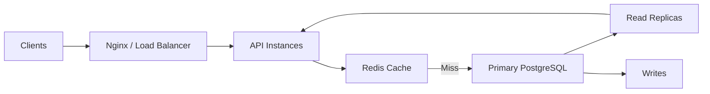
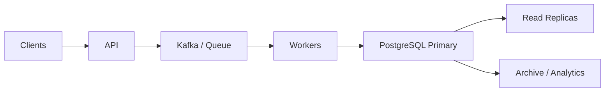
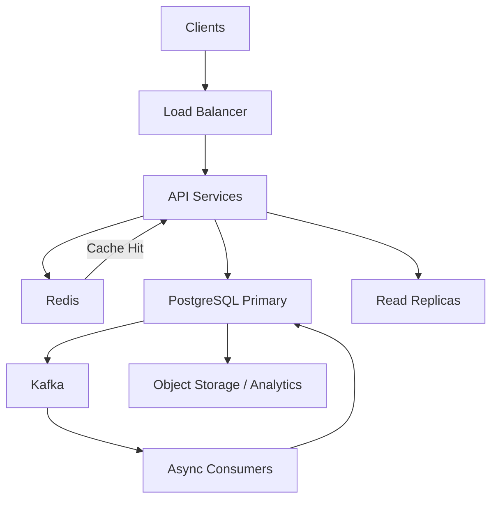
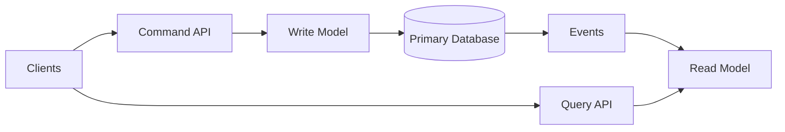
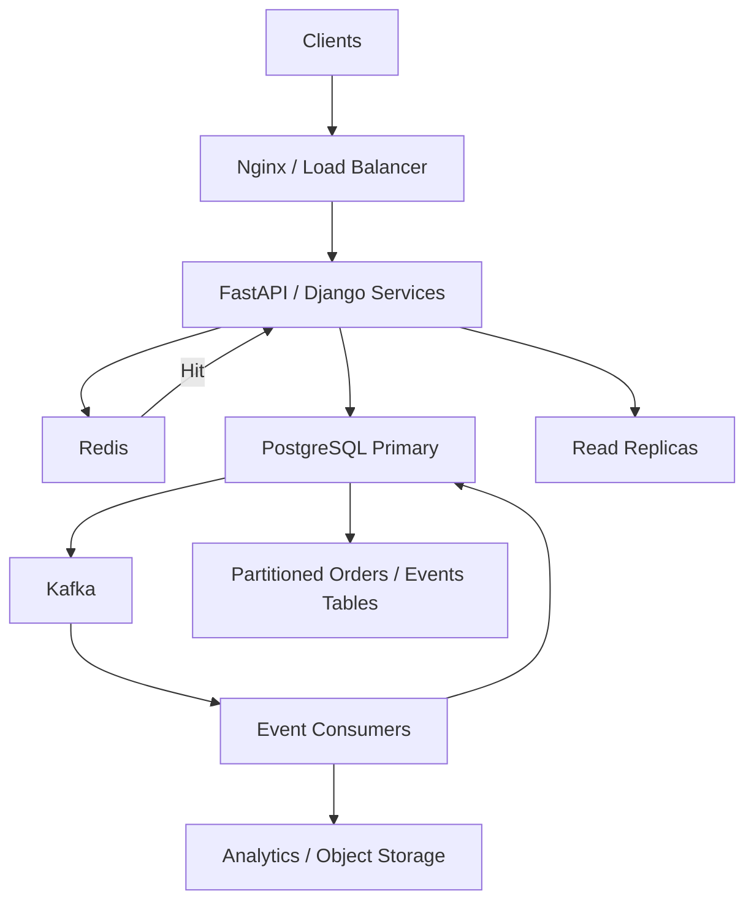

# 11- Read Heavy vs Write Heavy Database Architecture

## Overview

Database architecture should reflect the workload it is expected to serve.

A **read-heavy** system spends most of its database capacity serving queries, while a **write-heavy** system spends a significant portion of its capacity ingesting, updating, or deleting data.

The distinction affects almost every database design decision:

```text
Workload
   │
   ├── Read-heavy
   │      ├── Read replicas
   │      ├── Caching
   │      ├── Read-optimized indexes
   │      └── Query optimization
   │
   └── Write-heavy
          ├── Minimize indexes
          ├── Batch writes
          ├── Partitioning
          ├── Queue-based ingestion
          └── Reduce contention
```

Most production systems are not purely one or the other. A typical backend may have:

```text
High-volume writes
        +
Frequent reads
        +
Occasional analytical queries
```

The architectural goal is to identify the dominant workload and optimize the database around its actual bottlenecks.

---

## Understanding Database Workload

A database workload is influenced by:

- Read/write ratio
- Queries per second
- Rows read per query
- Rows modified per transaction
- Transaction duration
- Query complexity
- Data size
- Index count
- Concurrency
- Replication
- Cache hit rate
- Storage characteristics

A simple workload classification is:

| Workload | Typical Characteristics |
|---|---|
| Read-heavy | Many `SELECT`s, relatively fewer writes |
| Write-heavy | High insert/update/delete rate |
| Mixed OLTP | Significant reads and writes |
| Analytical | Large scans, aggregations, historical data |
| Append-heavy | Mostly inserts, limited updates/deletes |
| Hot-key workload | Many operations target the same rows/keys |

The read/write ratio alone is insufficient. Two systems with an identical ratio can have completely different bottlenecks.

---

## Read-Heavy Architecture

A read-heavy system prioritizes efficient retrieval of existing data.

Typical architecture:



A mature architecture may separate:

```text
Write path
→ Primary

Read path
→ Cache
→ Read replicas
→ Primary when strong consistency is required
```

---

## Read-Heavy Optimization Priorities

Typical priorities include:

1. Query optimization
2. Appropriate indexing
3. Caching
4. Read replicas
5. Connection pooling
6. Efficient pagination
7. Denormalization where justified
8. Materialized views for expensive repeated queries
9. Reducing unnecessary columns and rows
10. Protecting the database from unbounded reads

The exact order depends on the bottleneck.

---

## Indexing in Read-Heavy Systems

Read-heavy systems can justify more indexes because reads benefit directly from efficient access paths.

For example:

```sql
CREATE INDEX orders_customer_created_idx
ON orders(customer_id, created_at DESC);
```

This can support:

```sql
SELECT id, status, created_at
FROM orders
WHERE customer_id = $1
ORDER BY created_at DESC
LIMIT 50;
```

However, more indexes are not free.

Even in read-heavy systems they increase:

- Storage
- Write cost
- Vacuum work
- WAL generation
- Cache pressure

Index only real access patterns.

---

## Read Replicas

Read replicas distribute read workloads across database instances.

```text
                    ┌── Read Replica 1
                    │
Primary ── WAL ─────┼── Read Replica 2
                    │
                    └── Read Replica 3
```

Application routing:

```text
Writes → Primary

Reads → Replica pool
```

This can increase read capacity without moving writes away from the primary.

---

## Read Replica Trade-offs

Read replicas introduce replication lag.

Example:

```text
Primary
order.status = "confirmed"

       │
       │ replication
       ▼

Replica
order.status = "pending"
```

A user may write to the primary and immediately read from a replica that has not replayed the change yet.

This creates **read-after-write consistency** concerns.

---

## When to Use Read Replicas

Read replicas are useful when:

- Read volume is much higher than write volume.
- The primary is CPU or I/O constrained by reads.
- Some workloads tolerate replication lag.
- The application can route reads appropriately.
- Additional read capacity is required.

They are not a solution for:

- Write bottlenecks
- Poor queries
- Missing indexes
- Hot-row contention
- Long-running transactions

---

## Read Routing

A typical service can separate database operations:

```python
def get_order(order_id: int):
    return Order.objects.using("replica").get(id=order_id)


def create_order(data: dict):
    return Order.objects.using("default").create(**data)
```

The exact routing strategy should be centralized rather than scattered throughout application code.

A Django database router or service-layer abstraction can make routing behavior easier to reason about.

---

## Read-After-Write Consistency

Suppose:

```text
POST /orders
    ↓
Primary
    ↓
Order created
```

Immediately followed by:

```text
GET /orders/123
    ↓
Replica
    ↓
Order not yet visible
```

Possible strategies include:

- Read the critical request from primary.
- Use session/request-level primary stickiness.
- Route reads to a sufficiently caught-up replica.
- Return authoritative state from the write response.
- Use application-level consistency tokens where justified.

Do not blindly route every read to replicas.

---

## Caching in Read-Heavy Systems

Redis can absorb frequently repeated reads.

```text
Request
   │
   ▼
Redis
   │
   ├── Hit → Response
   │
   └── Miss
        │
        ▼
    PostgreSQL
        │
        ▼
      Redis
```

Caching is particularly useful for:

- Frequently requested objects
- Configuration
- Reference data
- Product/catalog data
- Expensive computed results
- Session-like application state

---

## Cache-Aside Pattern

A common pattern is cache-aside:

```python
def get_product(product_id: int):
    key = f"product:{product_id}"

    cached = redis.get(key)
    if cached is not None:
        return deserialize(cached)

    product = load_from_database(product_id)

    redis.set(
        key,
        serialize(product),
        ex=300,
    )

    return product
```

The application owns cache population and invalidation.

The database remains the source of truth.

---

## Cache Invalidation

Caching creates another consistency problem.

Suppose:

```text
Database
price = 100

Redis
price = 100
```

After an update:

```text
Database
price = 120

Redis
price = 100
```

Possible strategies include:

- Delete cache on successful update.
- Write-through caching.
- Short TTLs.
- Versioned cache keys.
- Event-driven invalidation.

For critical data, define the acceptable staleness window explicitly.

---

## Cache Stampede

A cache miss during a traffic spike can cause many requests to query the database simultaneously.

```text
1000 requests
      │
      ▼
Cache miss
      │
      ▼
1000 database queries
```

Mitigation techniques include:

- Request coalescing
- Locking
- Jittered TTLs
- Early refresh
- Background refresh
- Rate limiting

Caching should reduce database load without introducing a new synchronization bottleneck.

---

## Materialized Views

For expensive repeated queries, a materialized view can move computation away from request time.

```text
Raw tables
    │
    ▼
Expensive aggregation
    │
    ▼
Materialized view
    │
    ▼
Fast reads
```

Example:

```sql
CREATE MATERIALIZED VIEW daily_sales AS
SELECT
    date_trunc('day', created_at) AS day,
    SUM(total_amount) AS revenue
FROM orders
GROUP BY 1;
```

Refresh strategy must account for staleness and refresh cost.

---

## Denormalization for Read-Heavy Systems

Normalization reduces duplication and improves consistency.

However, read-heavy workloads may justify carefully controlled denormalization.

For example:

```text
Normalized:

orders
customers
addresses
products
```

A read-optimized representation might contain:

```text
order_summary
 ├── order_id
 ├── customer_name
 ├── shipping_city
 ├── total_amount
 └── status
```

The trade-off is additional write/update complexity.

Denormalization should be driven by measured query cost rather than used as a default optimization.

---

## Write-Heavy Architecture

Write-heavy systems prioritize:

- High ingestion throughput
- Low write latency
- Efficient transaction handling
- Reduced lock contention
- Reduced index maintenance
- Efficient storage
- Partitioning
- Batching

A conceptual architecture is:



The queue is not mandatory, but it can decouple ingestion from database write processing when asynchronous processing is acceptable.

---

## Write-Heavy Optimization Priorities

Typical priorities include:

1. Minimize unnecessary indexes.
2. Reduce transaction duration.
3. Batch writes where possible.
4. Reduce lock contention.
5. Partition large tables.
6. Avoid unnecessary updates.
7. Use efficient bulk ingestion.
8. Tune connection pools.
9. Separate asynchronous workloads.
10. Monitor WAL and storage throughput.

---

## Index Cost in Write-Heavy Systems

Every index can increase write work.

For:

```sql
INSERT INTO events (...)
```

PostgreSQL may need to update:

```text
Heap
  +
Index A
  +
Index B
  +
Index C
  +
Index D
```

A write-heavy table with excessive indexes can therefore become substantially slower.

For high-ingestion tables:

```text
Index only what the workload actually needs.
```

---

## Append-Heavy Workloads

Append-heavy workloads are a common form of write-heavy architecture.

Examples:

- Application events
- Audit logs
- Clickstreams
- Metrics
- IoT telemetry
- Kafka-consumer ingestion

Typical characteristics:

```text
INSERT → very frequent
UPDATE → rare
DELETE → lifecycle-driven
SELECT → time-range based
```

This workload is a strong candidate for:

- Time-based partitioning
- BRIN indexes
- Batch inserts
- Retention policies
- Object-storage archival

---

## Batch Writes

Writing rows individually:

```text
INSERT
INSERT
INSERT
INSERT
...
```

can create significant transaction and network overhead.

Batching can reduce round trips:

```sql
INSERT INTO events (event_type, occurred_at, payload)
VALUES
    ('login', '2026-09-03T10:00:00Z', '{}'),
    ('purchase', '2026-09-03T10:01:00Z', '{}'),
    ('logout', '2026-09-03T10:02:00Z', '{}');
```

For very high ingestion workloads, PostgreSQL's bulk-loading facilities can provide additional throughput.

---

## Batch Size Trade-offs

Bigger batches are not always better.

Very large transactions can cause:

- Higher memory usage
- Large WAL bursts
- Longer locks
- Longer rollback
- Replication lag
- Larger failure domains

A practical batch strategy balances:

```text
Throughput
+
Transaction duration
+
Memory
+
WAL
+
Recovery time
```

Benchmark with realistic workloads.

---

## Bulk Ingestion

For large data-loading workflows, PostgreSQL's `COPY` protocol is often much more efficient than issuing individual inserts.

Example:

```sql
COPY events (event_type, occurred_at, payload)
FROM STDIN
WITH (FORMAT csv);
```

Application drivers and PostgreSQL tooling provide APIs for streaming bulk data through `COPY`.

Use this for controlled ingestion pipelines rather than ordinary request/response CRUD operations.

---

## Write Contention

Write-heavy systems often encounter hot rows.

Example:

```text
1000 workers
     │
     ▼
same account balance
     │
     ▼
row-level lock
     │
     ▼
serialization
```

Potential solutions include:

- Atomic updates
- Optimistic concurrency
- Queue serialization
- Partitioning by key
- Data-model changes
- Reducing shared mutable state

Adding more application replicas does not solve a database serialization point.

---

## Atomic Updates

Instead of:

```text
SELECT balance
UPDATE balance
```

use atomic SQL when the business rule permits it:

```sql
UPDATE accounts
SET balance = balance + $1
WHERE id = $2;
```

For conditional updates:

```sql
UPDATE inventory
SET available = available - 1
WHERE product_id = $1
  AND available > 0;
```

Then use the affected-row count to determine whether the operation succeeded.

This reduces round trips and can reduce locking complexity.

---

## Transactions in Write-Heavy Systems

Write-heavy systems benefit from short, focused transactions.

Prefer:

```text
BEGIN
  validate
  write
COMMIT
```

Avoid:

```text
BEGIN
  database read
  HTTP request
  external API
  complex processing
  sleep
  multiple unrelated writes
COMMIT
```

Long transactions can increase:

- Lock duration
- MVCC retention
- WAL pressure
- Replica lag
- Connection utilization

---

## Queue-Based Write Architecture

A queue can decouple user-facing requests from database ingestion.

```text
API
 │
 ▼
Kafka
 │
 ▼
Consumer Group
 │
 ├── Worker 1
 ├── Worker 2
 └── Worker 3
 │
 ▼
PostgreSQL
```

Benefits include:

- Traffic smoothing
- Backpressure
- Burst absorption
- Controlled concurrency
- Retry handling

Trade-offs include:

- Eventual consistency
- Operational complexity
- Duplicate delivery
- Ordering constraints
- Consumer lag

Use asynchronous writes only when the business operation permits delayed persistence.

---

## Idempotent Write Processing

Queue-based ingestion should assume duplicate delivery can happen.

A consumer should make processing idempotent where possible.

Example:

```sql
INSERT INTO processed_events (event_id, processed_at)
VALUES ($1, NOW())
ON CONFLICT (event_id) DO NOTHING;
```

This can provide a database-backed deduplication mechanism.

For business writes, use unique constraints and transactional patterns rather than relying only on application memory.

---

## Kafka and Write-Heavy Systems

Kafka can absorb high event volumes before persistence.

```text
Producers
   │
   ▼
Kafka
   │
   ▼
Consumer group
   │
   ▼
PostgreSQL
```

Kafka partitions can increase consumer parallelism.

However:

```text
Kafka throughput
≠
PostgreSQL write capacity
```

The database remains a downstream bottleneck if consumers produce writes faster than PostgreSQL can sustainably process them.

Use consumer concurrency and batching to match database capacity.

---

## Read-Heavy vs Write-Heavy Comparison

| Dimension | Read-Heavy | Write-Heavy |
|---|---|---|
| Primary bottleneck | Query CPU/I/O | Write CPU/I/O/WAL |
| Index strategy | More read-oriented indexes | Minimize unnecessary indexes |
| Cache | Often highly valuable | Useful for reducing read load |
| Replicas | Strong scaling mechanism | Limited impact on write capacity |
| Partitioning | Useful for large datasets | Often highly valuable |
| Batching | Helpful | Critical for high ingestion |
| Lock contention | Usually lower | Often significant |
| WAL | Moderate | Potentially very high |
| Query optimization | Critical | Critical for read paths |
| Denormalization | Often useful | Adds write complexity |
| Queueing | Optional | Often useful |
| Retention | Important | Often critical |

---

## Mixed Workload Architecture

Most real systems are mixed.

For example:

```text
E-commerce Platform

Writes:
  Orders
  Payments
  Inventory
  Events

Reads:
  Product pages
  Order history
  Catalog search
  Customer dashboards
```

A possible architecture:



The key is to optimize individual workload paths rather than labeling the entire system simply "read-heavy" or "write-heavy."

---

## Separating Read and Write Paths

A mature architecture can explicitly model:

```text
Command path
→ validates and changes state

Query path
→ retrieves state efficiently
```

For example:

```text
POST /orders
    ↓
Primary database

GET /orders/{id}
    ↓
Cache → Replica → Primary
```

This separation makes consistency requirements explicit.

---

## CQRS

Command Query Responsibility Segregation, or CQRS, separates models or execution paths for writes and reads.

Conceptually:



CQRS is useful when read and write workloads have substantially different requirements.

It introduces:

- More infrastructure
- Event propagation
- Eventual consistency
- Multiple models
- More operational complexity

Do not introduce CQRS simply because an application has both reads and writes.

---

## Read Models

A read model can be optimized for a specific query.

For example:

```text
Normalized write model
        │
        ▼
Domain events
        │
        ▼
Read projection
        │
        ▼
Fast API query
```

This can be implemented with:

- PostgreSQL tables
- Redis
- Elasticsearch/OpenSearch
- Dedicated analytical systems

The read model becomes derived state and must have a recovery/rebuild strategy.

---

## PostgreSQL and Read-Heavy Workloads

For read-heavy PostgreSQL systems, focus on:

- Appropriate B-tree indexes
- Composite indexes
- Covering indexes
- Query plans
- Connection pooling
- Redis caching
- Read replicas
- Efficient pagination
- Partition pruning
- Materialized views where justified

Use:

```sql
EXPLAIN (ANALYZE, BUFFERS)
```

to validate actual query behavior.

---

## PostgreSQL and Write-Heavy Workloads

For write-heavy PostgreSQL systems, focus on:

- Index count
- Transaction duration
- Lock contention
- WAL throughput
- Checkpoint behavior
- Autovacuum
- Table/index bloat
- Partitioning
- Batch size
- Connection utilization
- Replica lag

The write path should be measured as a complete pipeline:

```text
Application
→ network
→ connection
→ transaction
→ WAL
→ storage
→ replication
→ commit
```

---

## Connection Pool Architecture

Connection pools matter for both workloads.

Too many connections can cause:

```text
Application
  │
  ▼
Hundreds of database connections
  │
  ▼
CPU / memory contention
```

Too few connections can underutilize available database capacity.

Use application pooling and, where appropriate, a pooler such as PgBouncer.

The optimal pool size depends on database capacity, query duration, concurrency, and application architecture.

---

## Read-Heavy Connection Strategy

For read-heavy workloads:

```text
API instances
      │
      ├── Primary pool
      │
      └── Replica pool
             ├── Replica A
             ├── Replica B
             └── Replica C
```

This prevents read traffic from consuming all primary connections.

Connection routing should remain consistent with the application's consistency requirements.

---

## Write-Heavy Connection Strategy

For write-heavy workloads, increasing connections indefinitely can make performance worse.

```text
More connections
      │
      ▼
More concurrent writes
      │
      ▼
More contention
      │
      ▼
Lower throughput
```

Database throughput often reaches a point where additional concurrency only increases waiting.

Measure throughput as concurrency increases rather than assuming more connections are always better.

---

## Storage Architecture

Read-heavy systems may benefit from:

- Large memory
- Fast storage
- Strong cache hit rate
- Read replicas

Write-heavy systems may be constrained by:

- WAL throughput
- Storage write IOPS
- Transaction latency
- Checkpoint activity
- Replication bandwidth

On AWS, select storage and database instance characteristics based on measured CPU, memory, I/O, and workload patterns rather than choosing the largest instance by default.

---

## Monitoring Read-Heavy Systems

Important metrics include:

- Read QPS
- Query latency
- Cache hit ratio
- Buffer cache behavior
- CPU
- I/O
- Replica lag
- Connection utilization
- Slow-query frequency
- Index usage

A common alert pattern is:

```text
Replica lag
+
High read latency
+
Increasing connection utilization
```

which can indicate that the read layer is exceeding available capacity.

---

## Monitoring Write-Heavy Systems

Track:

- Write QPS
- Transaction latency
- WAL generation
- WAL retention
- Checkpoint activity
- Lock waits
- Deadlocks
- Autovacuum activity
- Dead tuples
- Storage latency
- Replica lag
- Connection utilization

For high-ingestion systems, WAL and storage throughput are often more important than raw query count.

---

## Backpressure

Write-heavy systems need explicit backpressure.

Without it:

```text
Incoming traffic
      │
      ▼
Queue grows
      │
      ▼
Consumers increase
      │
      ▼
Database overloaded
      │
      ▼
Latency increases
      │
      ▼
Retries increase
      │
      ▼
Database becomes even more overloaded
```

Backpressure mechanisms include:

- Queue limits
- Consumer concurrency limits
- Rate limiting
- Batch-size control
- Retry backoff
- Circuit breakers
- Load shedding

---

## Retry Storms

Retries can amplify both read and write workloads.

Example:

```text
Database latency increases
        │
        ▼
Requests timeout
        │
        ▼
Clients retry
        │
        ▼
Database receives more traffic
```

Production retries should be:

- Bounded
- Exponential
- Jittered
- Applied only to transient failures
- Compatible with idempotency

---

## High Availability

Read-heavy systems can scale reads through replicas, but the primary remains an important dependency for writes and strongly consistent reads.

Write-heavy systems should prioritize:

- Reliable primary failover
- Durable WAL
- Replica health
- Storage resilience
- Connection recovery
- Idempotent retry behavior

Application behavior during failover should be tested rather than assumed.

---

## Disaster Recovery

The dominant workload affects recovery planning.

Read-heavy systems may have large read replicas and caches that can be reconstructed.

Write-heavy systems may generate substantial amounts of durable state and WAL.

Define:

- RPO
- RTO
- Backup frequency
- Point-in-time recovery
- Replica strategy
- Archive strategy
- Restore testing

For large event datasets, partitioning plus object-storage archival can simplify long-term retention.

---

## Security Considerations

Read-heavy systems can be vulnerable to resource-exhaustion attacks through expensive queries.

Protect them with:

- Authentication
- Authorization
- Pagination
- Query limits
- Rate limiting
- Statement timeouts
- API-level filtering

Write-heavy systems require additional protection against ingestion abuse:

- Request size limits
- Rate limiting
- Authentication
- Queue limits
- Payload validation
- Idempotency
- Controlled consumer concurrency

Database performance protection is part of application security.

---

## Cost Optimization

For read-heavy systems:

```text
Caching
+
Query optimization
+
Appropriate replicas
```

can be more cost-effective than continually increasing primary database capacity.

For write-heavy systems:

```text
Fewer unnecessary indexes
+
Batching
+
Partition lifecycle management
+
Efficient ingestion
```

can reduce database resource consumption.

Avoid scaling infrastructure before eliminating avoidable database work.

---

## Common Mistakes

### Treating Every Database as Read-Heavy

Many systems have significant write bottlenecks even when API traffic is mostly reads.

**Better:** measure database workload directly.

### Adding Read Replicas to Fix Write Bottlenecks

Replicas primarily increase read capacity.

**Better:** optimize the primary's write path, reduce contention, batch writes, and redesign the workload where necessary.

### Adding More Indexes to a Write-Heavy Table

Indexes accelerate reads but increase write amplification.

**Better:** maintain only indexes justified by production query patterns.

### Using Redis as the Source of Truth

Caching does not replace durable database state.

**Better:** treat PostgreSQL as authoritative unless the system intentionally adopts another durable source of truth.

### Ignoring Replica Lag

Routing every read to replicas can produce stale reads.

**Better:** classify requests according to their consistency requirements.

### Assuming More Connections Mean More Throughput

Excessive concurrency can increase CPU, memory, lock contention, and context switching.

**Better:** benchmark throughput across different pool sizes.

### Using Huge Write Transactions

Large transactions can increase WAL, locking, memory, replication lag, and rollback time.

**Better:** use controlled batching and appropriate transaction boundaries.

### Introducing Kafka Without a Backpressure Strategy

A queue can absorb traffic temporarily but cannot make an undersized database infinitely scalable.

**Better:** control consumer concurrency and match ingestion to sustainable database capacity.

### Introducing CQRS Too Early

CQRS solves specific architectural problems but adds substantial complexity.

**Better:** introduce separate read models only when the workload and consistency requirements justify them.

### Ignoring Cache Failure

If all requests hit PostgreSQL when Redis fails, the database may become overloaded.

**Better:** design and test cache-miss and cache-outage behavior.

---

## Production Decision Framework

When optimizing a database workload, use:

```text
Measure
   │
   ▼
Identify bottleneck
   │
   ├── Read CPU/I/O
   │       ├── Query optimization
   │       ├── Indexing
   │       ├── Cache
   │       └── Read replicas
   │
   └── Write CPU/I/O/WAL
           ├── Reduce indexes
           ├── Batch writes
           ├── Reduce contention
           ├── Partition
           └── Queue / async processing
```

Do not begin with infrastructure changes.

First identify what resource is actually limiting throughput.

---

## Architecture Selection Guide

| Problem | First Strategies to Consider |
|---|---|
| Slow point reads | Indexes, query plans, caching |
| Repeated expensive reads | Redis, materialized views |
| Too many reads on primary | Read replicas |
| Stale replica reads | Primary routing / consistency strategy |
| High insert rate | Batching, `COPY`, fewer indexes |
| Hot-row contention | Atomic SQL, serialization, data-model changes |
| Large historical dataset | Partitioning |
| Retention-heavy workload | Time partitions, archival |
| Burst writes | Kafka/queue + controlled consumers |
| Expensive analytical queries | Read model / analytical database |
| Excessive DB connections | Pool tuning / PgBouncer |
| Retry amplification | Backoff, jitter, idempotency, rate limiting |

---

## Practical Architecture Example

Consider a high-traffic order platform.

### Workload

```text
Reads:
  Product pages       → very high
  Order history       → high
  Customer profile    → high

Writes:
  Orders              → high
  Payments            → medium
  Events              → very high
```

A suitable architecture might be:



Design principles:

```text
Product reads
→ cache first

General reads
→ replicas when consistency permits

Writes
→ primary

High-volume events
→ Kafka + controlled consumers

Historical data
→ partitions + retention/archive

Critical state
→ PostgreSQL source of truth
```

---

## Production Checklist

Before scaling a database workload, verify:

- [ ] Read/write workload has been measured.
- [ ] Slow queries have been identified using actual production SQL.
- [ ] Query plans have been inspected.
- [ ] Indexes match real access patterns.
- [ ] Unused and redundant indexes have been reviewed.
- [ ] Transaction duration is understood.
- [ ] Lock contention is monitored.
- [ ] Connection pool sizes are appropriate.
- [ ] Replica lag is monitored when replicas are used.
- [ ] Read-after-write requirements are explicitly defined.
- [ ] Cache invalidation behavior is documented.
- [ ] Cache outage behavior has been tested.
- [ ] Write-heavy workloads use appropriate batching.
- [ ] High-volume ingestion has backpressure.
- [ ] Queue consumers have controlled concurrency.
- [ ] Retry behavior is bounded and idempotent.
- [ ] Partitioning is justified by data volume or lifecycle requirements.
- [ ] WAL, storage, and replication capacity are monitored.
- [ ] Backup and disaster-recovery procedures are tested.
- [ ] Scaling decisions are based on measured bottlenecks.

## Interview Traps

### Is a read-heavy database simply a database with more `SELECT` statements?

Not necessarily. Query complexity, rows scanned, caching, concurrency, and I/O matter more than a simple read/write count.

### Do read replicas solve database scalability?

They primarily scale read capacity. They do not solve primary write bottlenecks, hot rows, poor queries, or excessive write contention.

### Why can more indexes hurt a write-heavy workload?

Every index adds maintenance work during writes and consumes storage and memory.

### Why is Redis useful for read-heavy systems?

It can serve frequently requested data without repeatedly executing database queries, reducing database CPU and I/O.

### Does caching eliminate the need for indexes?

No. Cache misses, invalidation, cold starts, and failures still reach the database.

### Why is replica lag important?

A replica may temporarily contain older state than the primary, producing stale reads and breaking read-after-write expectations.

### How do you handle read-after-write consistency with replicas?

Route consistency-sensitive reads to the primary or use an explicit mechanism that ensures the selected replica has caught up sufficiently.

### Why can increasing database connections reduce throughput?

Excessive concurrency can increase CPU pressure, memory usage, context switching, lock contention, and internal database contention.

### Why are queues useful for write-heavy workloads?

They provide buffering, backpressure, burst absorption, and controlled consumer concurrency when asynchronous persistence is acceptable.

### Can Kafka make PostgreSQL infinitely scalable?

No. Kafka can absorb and distribute events, but PostgreSQL remains limited by its sustainable write capacity.

### Why is batching useful for write-heavy systems?

It reduces network round trips and per-transaction overhead, improving throughput when batch sizes are controlled appropriately.

### Why can very large transactions be harmful?

They can increase WAL volume, lock duration, memory usage, replication lag, and rollback/recovery cost.

### When is CQRS appropriate?

When read and write workloads have sufficiently different scaling, data-model, or consistency requirements to justify separate models and the additional operational complexity.

### Is partitioning primarily a read optimization?

No. Partitioning can improve query performance through pruning, but it is also valuable for lifecycle management, retention, maintenance, and large-table operations.

### What should you optimize first: infrastructure or queries?

Identify the bottleneck first. Eliminating inefficient queries, unnecessary indexes, excessive transactions, or avoidable database work is usually preferable to immediately scaling infrastructure.

## Key Takeaways

- Read-heavy architectures typically benefit from query optimization, targeted indexes, caching, and read replicas, while write-heavy architectures prioritize batching, low contention, efficient indexing, partitioning, and controlled ingestion.
- Read replicas increase read capacity but introduce replication lag and do not solve primary write bottlenecks; consistency requirements must determine read routing.
- Write throughput is affected by indexes, transaction duration, WAL, locking, connection concurrency, and storage, so simply adding more application workers or database connections can reduce rather than increase throughput.
- Kafka, Redis, CQRS, partitioning, and read replicas are architectural tools rather than universal solutions; introduce them only when measured workload characteristics justify their complexity.
- Production database scaling should begin with workload measurement and bottleneck identification, followed by targeted query, schema, transaction, caching, and infrastructure changes.