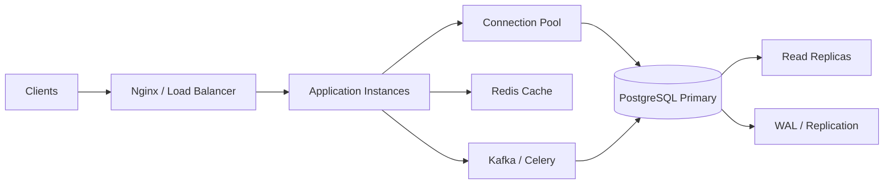
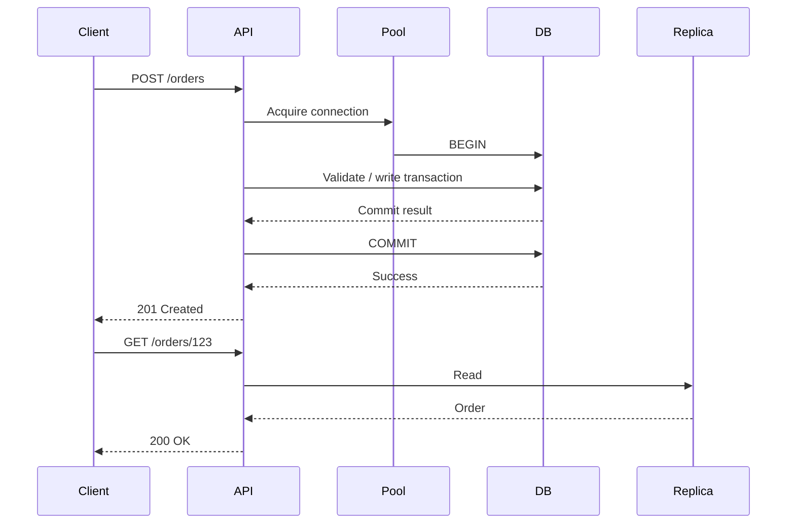
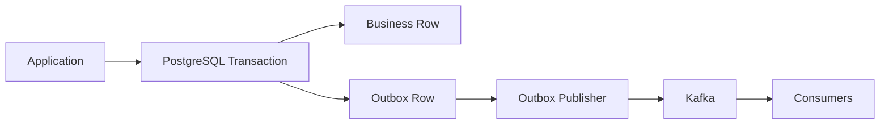

# 12- OLTP Architecture

## Overview

Online Transaction Processing (OLTP) architecture is designed for systems that execute large numbers of short, concurrent transactions while maintaining strong data consistency.

Typical OLTP workloads include:

- User registration
- Order creation
- Payments
- Inventory updates
- Account transfers
- Booking systems
- Authentication
- Customer management
- SaaS application state

The defining characteristic is not simply "many transactions." A production OLTP system combines:

```text
High concurrency
      +
Short transactions
      +
Predictable latency
      +
Strong consistency
      +
Frequent reads and writes
      +
Transactional integrity
```

A typical architecture looks like:



The database is usually the authoritative system of record, while caching, queues, and replicas are used to improve scalability without compromising transactional correctness.

---

## OLTP Characteristics

OLTP systems typically exhibit:

| Characteristic | Typical OLTP Behavior |
|---|---|
| Transaction size | Small |
| Transaction duration | Short |
| Concurrency | High |
| Query pattern | Predictable |
| Data access | Point lookups / small ranges |
| Writes | Frequent |
| Reads | Frequent |
| Consistency | Strong requirements |
| Latency | Usually milliseconds |
| Data model | Usually normalized |
| Indexing | Query-driven |
| Storage | Row-oriented relational databases |

The exact workload varies by application, but OLTP is fundamentally optimized around **concurrent state changes and low-latency transactions**.

---

## OLTP vs OLAP

OLTP and OLAP optimize for different workloads.

| Dimension | OLTP | OLAP |
|---|---|---|
| Primary purpose | Operational transactions | Analysis |
| Query pattern | Small, predictable | Large, complex |
| Writes | Frequent | Often batch-oriented |
| Reads | Small result sets | Large scans |
| Schema | Usually normalized | Often denormalized |
| Latency target | Low | Higher |
| Concurrency | High | Moderate |
| Indexing | Important | Workload-specific |
| Typical database | PostgreSQL, MySQL | Data warehouse / analytical DB |
| Example | Create order | Analyze yearly revenue |

Do not optimize an OLTP database like an analytical warehouse.

A query scanning hundreds of millions of rows may be appropriate for analytics but dangerous on the primary database serving user transactions.

---

## Core OLTP Architecture

A production OLTP system can be viewed as several layers:

```text
Client
  │
  ▼
Load Balancer / Nginx
  │
  ▼
Application Layer
  │
  ├── Authentication
  ├── Business Logic
  ├── Validation
  └── Transaction Management
  │
  ▼
Connection Pool
  │
  ▼
PostgreSQL
  │
  ├── Query Processing
  ├── MVCC
  ├── Locking
  ├── WAL
  ├── Buffer Cache
  └── Storage
```

Each layer contributes to latency, reliability, and scalability.

---

## Request Lifecycle

A typical transaction request follows:



The exact routing depends on consistency requirements. A read immediately following a write may need to use the primary if replica lag could produce an unacceptable stale result.

---

## Transaction Boundaries

Transaction boundaries should match business operations.

For example:

```text
Create Order
    │
    ├── Create order row
    ├── Create order items
    ├── Reserve inventory
    └── Record payment intent
         │
         ▼
       COMMIT
```

These operations should be in one transaction when they must succeed or fail as one atomic business operation.

Avoid unnecessarily large transactions containing unrelated work.

---

## Django Transaction Management

Django applications commonly use:

```python
from django.db import transaction


@transaction.atomic
def create_order(customer_id: int, product_id: int) -> int:
    order = Order.objects.create(customer_id=customer_id)

    OrderItem.objects.create(
        order=order,
        product_id=product_id,
    )

    return order.id
```

The transaction boundary should normally be defined around the business operation rather than around arbitrary low-level database calls.

Django uses autocommit by default, while `transaction.atomic()` provides an explicit transaction boundary.

---

## FastAPI Transaction Management

With SQLAlchemy, transaction ownership should be explicit.

A typical service boundary is:

```python
from sqlalchemy.orm import Session


def create_order(
    session: Session,
    customer_id: int,
    product_id: int,
) -> int:
    order = Order(
        customer_id=customer_id,
    )

    session.add(order)
    session.flush()

    item = OrderItem(
        order_id=order.id,
        product_id=product_id,
    )

    session.add(item)
    session.commit()

    return order.id
```

In larger systems, transaction ownership is often better centralized at the request or service boundary so that multiple repository operations participate in the same transaction.

---

## ACID in OLTP

OLTP systems depend heavily on ACID properties.

| Property | OLTP Meaning |
|---|---|
| Atomicity | Transaction succeeds completely or rolls back |
| Consistency | Constraints and business invariants remain valid |
| Isolation | Concurrent transactions interact according to defined rules |
| Durability | Committed data survives failures according to durability guarantees |

ACID is not merely a database feature. Application transaction boundaries, constraints, retries, and concurrency control must all be designed consistently.

---

## MVCC

PostgreSQL uses Multi-Version Concurrency Control.

Conceptually:

```text
Concurrent transaction A
        │
        ├── sees version 1

Concurrent transaction B
        │
        └── creates version 2
```

Readers can often continue without blocking writers because PostgreSQL determines row visibility using transaction snapshots.

MVCC improves concurrency but introduces maintenance requirements around:

- Dead tuples
- Vacuum
- Transaction age
- Table bloat
- Long-running transactions

---

## Isolation Levels

PostgreSQL provides transaction isolation levels with different concurrency guarantees.

| Level | General Behavior |
|---|---|
| Read Uncommitted | Treated as Read Committed by PostgreSQL |
| Read Committed | Each statement gets an appropriate snapshot |
| Repeatable Read | Transaction-level snapshot semantics |
| Serializable | Prevents non-serializable outcomes and may abort transactions |

Most OLTP applications use Read Committed unless stronger guarantees are required.

Do not increase isolation globally without understanding its effect on contention and retries.

---

## Locking

OLTP systems frequently modify shared state.

Example:

```sql
BEGIN;

SELECT available
FROM inventory
WHERE product_id = 42
FOR UPDATE;

UPDATE inventory
SET available = available - 1
WHERE product_id = 42;

COMMIT;
```

The row lock prevents conflicting transactions from modifying the protected row concurrently.

Use locking only when necessary. Excessive locking can turn high-concurrency OLTP workloads into serialized workloads.

---

## Atomic Updates

A single atomic statement is often preferable to explicit read-lock-write logic.

For inventory:

```sql
UPDATE inventory
SET available = available - 1
WHERE product_id = $1
  AND available > 0;
```

The affected-row count determines success:

```text
1 row affected
→ reservation succeeded

0 rows affected
→ reservation failed
```

This minimizes round trips and can reduce lock duration.

---

## Optimistic Concurrency

Optimistic concurrency is useful when conflicts are relatively rare.

Example:

```sql
UPDATE accounts
SET
    balance = $1,
    version = version + 1
WHERE id = $2
  AND version = $3;
```

If zero rows are affected, another transaction modified the account.

The application can then:

- Retry
- Return a conflict
- Reload the state
- Apply a business-specific resolution

The version check must be part of the same atomic database statement.

---

## Constraints as OLTP Protection

Database constraints are essential for enforcing invariants close to the data.

Examples:

```sql
CREATE TABLE users (
    id bigint PRIMARY KEY,
    email text NOT NULL UNIQUE
);
```

Foreign keys:

```sql
customer_id bigint NOT NULL
    REFERENCES customers(id)
```

Check constraints:

```sql
CHECK (amount >= 0)
```

Constraints protect against invalid state even when bugs exist in application code or multiple services access the same database.

---

## Normalization

OLTP databases are commonly normalized because normalized models:

- Reduce duplication
- Improve consistency
- Make transactional updates predictable
- Represent relationships clearly

Example:

```text
customers
    │
    └── orders
          │
          └── order_items
                 │
                 └── products
```

The objective is not maximum normalization at all costs.

For high-value read paths, controlled denormalization can be justified when its consistency and maintenance costs are understood.

---

## Index Strategy

OLTP indexes should be based on actual query patterns.

Example:

```sql
CREATE INDEX orders_customer_created_idx
ON orders(customer_id, created_at DESC);
```

This can support:

```sql
SELECT id, status, created_at
FROM orders
WHERE customer_id = $1
ORDER BY created_at DESC
LIMIT 50;
```

Avoid indexing every column.

Each index increases:

- Write cost
- Storage
- WAL
- Maintenance
- Cache pressure

Write-heavy OLTP systems require particularly careful index management.

---

## Primary Keys

OLTP primary keys should provide efficient identification and appropriate uniqueness semantics.

Common options include:

```text
BIGINT
UUID
Application-generated sortable IDs
```

The choice depends on:

- Distribution
- Replication
- External exposure
- Index size
- Insert locality
- Multi-service architecture

Do not expose internal sequential identifiers automatically if resource enumeration creates a security concern.

Authorization must still be enforced regardless of identifier type.

---

## Hot Rows

A hot row can become an OLTP bottleneck.

Example:

```text
1000 concurrent requests
        │
        ▼
account balance row
        │
        ▼
serialization
```

Solutions may include:

- Atomic updates
- Optimistic concurrency
- Queue serialization
- Partitioning state
- Redesigning the data model
- Reducing shared mutable state

Horizontal application scaling cannot eliminate a database-level serialization point.

---

## Connection Pooling

Every application process should not independently create unlimited database connections.

Conceptually:

```text
Kubernetes
 ├── API Pod 1 ─┐
 ├── API Pod 2 ─┤
 ├── API Pod 3 ─┼── Connection Pool ── PostgreSQL
 └── API Pod N ─┘
```

Connection pool size should be based on:

- Database capacity
- Query duration
- Application concurrency
- CPU
- Memory
- Lock contention

Too many connections can reduce overall throughput.

---

## PgBouncer

PgBouncer can provide connection pooling between application clients and PostgreSQL.

Conceptually:

```text
Many application connections
          │
          ▼
       PgBouncer
          │
          ▼
Fewer PostgreSQL connections
          │
          ▼
      PostgreSQL
```

Transaction pooling can improve connection utilization for workloads where session-level state is not required.

Applications using prepared statements, temporary objects, session variables, or other session-specific features must be designed with the selected pooling mode in mind.

---

## Read Scaling

OLTP workloads often have substantial read traffic.

A typical architecture is:

```text
                  ┌── Replica 1
                  │
Primary ── WAL ───┼── Replica 2
                  │
                  └── Replica 3
```

Reads that tolerate replication lag can be routed to replicas.

Strongly consistent operations can remain on the primary.

---

## Read-After-Write

Consider:

```text
POST /orders
    │
    ▼
Primary
    │
    ▼
Order created

GET /orders/123
    │
    ▼
Replica
    │
    ▼
Potential stale result
```

Production OLTP systems must explicitly define consistency requirements.

Possible strategies include:

- Primary reads after writes
- Request-level primary stickiness
- Replica lag checks
- Returning authoritative write results
- Consistency-aware routing

---

## Caching

Redis can reduce read pressure:

```text
API
 │
 ▼
Redis
 │
 ├── Hit → Response
 │
 └── Miss
      │
      ▼
 PostgreSQL
      │
      ▼
    Cache
```

Caching is useful for:

- Reference data
- Product information
- Frequently accessed objects
- Expensive derived values

The database remains authoritative unless the architecture explicitly defines another durable source of truth.

---

## Cache Consistency

OLTP systems should define what stale data is acceptable.

For critical transactional state such as:

```text
Account balance
Inventory
Payment status
```

blindly serving stale cache values can create incorrect business behavior.

Use caching primarily where stale reads are acceptable or where cache invalidation is carefully coordinated.

---

## Asynchronous Processing

Not every operation belongs inside the synchronous OLTP transaction.

For example:

```text
Create Order
   │
   ├── PostgreSQL transaction
   │       └── Commit order
   │
   └── Asynchronous work
           ├── Email
           ├── Notification
           ├── Analytics
           └── Search indexing
```

Kafka or Celery can process secondary effects asynchronously.

This keeps the critical transaction small.

---

## Transactional Outbox

A common OLTP pattern is the transactional outbox.



The business state and outbox event are committed atomically.

Example:

```sql
BEGIN;

INSERT INTO orders (...);

INSERT INTO outbox_events (
    event_type,
    aggregate_id,
    payload
)
VALUES (
    'order.created',
    $1,
    $2
);

COMMIT;
```

A separate publisher can safely deliver the event later.

---

## Why External Calls Should Not Be Inside OLTP Transactions

Avoid:

```text
BEGIN
  update database
  call payment provider
  call email provider
  call HTTP service
COMMIT
```

External calls can:

- Take unpredictable time
- Timeout
- Retry
- Fail independently
- Hold database connections and locks

Prefer:

```text
Short database transaction
        │
        ▼
Commit durable state
        │
        ▼
Asynchronous side effects
```

Use state machines and outbox/event patterns when external workflows require reliable coordination.

---

## OLTP and Kafka

Kafka is useful for decoupling secondary workloads:

```text
PostgreSQL
    │
    ▼
Outbox
    │
    ▼
Kafka
    │
    ├── Notification Service
    ├── Search Service
    ├── Analytics
    └── Audit Pipeline
```

Kafka should not be introduced merely to move every database write out of the request path.

Core transactional state often benefits from remaining synchronous and strongly consistent.

---

## OLTP and Celery

Celery is useful for asynchronous tasks such as:

- Sending emails
- Generating reports
- Processing uploaded files
- Retrying external integrations
- Non-critical notifications

Do not assume a Celery task automatically provides transactional guarantees.

Use database state and idempotency to coordinate task execution safely.

---

## Idempotency

Payment and order APIs often need idempotency.

Example:

```http
POST /payments
Idempotency-Key: 9f4d...
```

The database can store the key:

```sql
CREATE UNIQUE INDEX payment_idempotency_key_idx
ON payments(idempotency_key);
```

A repeated request can then return the existing result rather than creating a second payment operation.

Idempotency is especially important when clients retry after timeouts or network failures.

---

## Retry Architecture

Transient database failures may be retryable.

Examples include:

- Deadlocks
- Serialization failures
- Temporary connection failures
- Certain failover conditions

Do not retry:

```text
Unique constraint violation
Invalid input
Authorization failure
```

as if they were transient failures.

A production retry policy should use:

```text
Error classification
      │
      ▼
Retryable?
      │
      ├── No → fail
      │
      └── Yes
           │
           ▼
      bounded retry
           │
           ▼
     backoff + jitter
```

---

## Large Transactions

Large OLTP transactions can cause:

- Long lock durations
- High WAL generation
- Replica lag
- Memory pressure
- Slow rollback
- MVCC cleanup delays

Prefer controlled batches for large data-processing operations.

For example:

```text
10 million rows

Instead of:
one 10-million-row transaction

Prefer:
controlled batches
```

The correct batch size depends on workload and operational constraints.

---

## OLTP and Partitioning

Partitioning becomes useful when OLTP tables become very large or have clear lifecycle boundaries.

For example:

```text
orders
├── 2026_01
├── 2026_02
├── 2026_03
└── 2026_04
```

Benefits include:

- Partition pruning
- Smaller physical units
- Easier retention
- Faster lifecycle operations
- More manageable indexes

Partitioning does not automatically solve database capacity limits.

---

## OLTP and Analytical Queries

Avoid running expensive analytical queries against the primary OLTP database.

Bad:

```text
Production PostgreSQL Primary
      │
      ├── Order writes
      ├── API reads
      └── Large analytical scan
```

Better:

```text
PostgreSQL
   │
   ├── OLTP workload
   │
   └── Replication / CDC
          │
          ▼
      Analytics system
```

This protects transactional latency from analytical workloads.

---

## Change Data Capture

Change Data Capture can move database changes to downstream systems.

Conceptually:

```text
PostgreSQL
    │
    ▼
WAL / CDC
    │
    ▼
Kafka
    │
    ├── Analytics
    ├── Search
    └── Data Platform
```

CDC can reduce direct analytical queries against the OLTP database.

However, downstream systems become eventually consistent with the source database.

---

## Observability

OLTP monitoring should cover the entire request-to-database path.

Important metrics include:

### Application

- Request latency
- Error rate
- Throughput
- Timeout rate
- Retry count

### Database

- Query latency
- Transactions per second
- CPU
- Memory
- I/O
- Buffer cache behavior
- Lock waits
- Deadlocks
- Connection usage

### Replication

- Replica lag
- WAL generation
- WAL retention
- Replication failures

### Maintenance

- Autovacuum activity
- Dead tuples
- Table bloat
- Index bloat
- Checkpoint activity

---

## Query Observability

Use PostgreSQL tooling such as:

```sql
EXPLAIN (ANALYZE, BUFFERS)
SELECT *
FROM orders
WHERE customer_id = 42
ORDER BY created_at DESC
LIMIT 50;
```

For workload-level analysis, `pg_stat_statements` can help identify:

- High-total-time queries
- Frequently executed queries
- Queries with high average latency
- I/O-heavy queries

Do not optimize based only on one slow query.

Look for workload-level patterns.

---

## Lock Monitoring

Identify blocked sessions:

```sql
SELECT
    blocked.pid AS blocked_pid,
    blocked.query AS blocked_query,
    blocking.pid AS blocking_pid,
    blocking.query AS blocking_query
FROM pg_stat_activity AS blocked
JOIN LATERAL unnest(
    pg_blocking_pids(blocked.pid)
) AS blocker_pid(pid)
    ON true
JOIN pg_stat_activity AS blocking
    ON blocking.pid = blocker_pid.pid;
```

This is particularly useful when application latency rises without an obvious CPU or I/O bottleneck.

---

## Long-Running Transactions

Long-running transactions are dangerous in MVCC systems.

They can:

- Prevent cleanup of old row versions
- Increase table bloat
- Hold locks
- Increase resource usage
- Delay maintenance

Monitor:

```sql
SELECT
    pid,
    usename,
    xact_start,
    state,
    query
FROM pg_stat_activity
WHERE xact_start IS NOT NULL
ORDER BY xact_start;
```

Investigate long-lived transactions rather than simply increasing database capacity.

---

## Security Considerations

OLTP systems contain authoritative business state and frequently sensitive data.

Protect them through:

- Strong authentication
- Least-privilege database roles
- Parameterized queries
- Encryption in transit
- Encryption at rest
- Secret management
- Network isolation
- Audit logging
- Input validation

Never construct SQL by concatenating untrusted input.

Prefer parameterized queries:

```python
cursor.execute(
    "SELECT id FROM users WHERE email = %s",
    [email],
)
```

---

## Multi-Tenant OLTP

Multi-tenant systems require explicit tenant isolation.

A common model is:

```text
tenant_id
    │
    ├── customers
    ├── orders
    ├── payments
    └── events
```

Queries should consistently scope access by tenant.

Partitioning can sometimes complement tenant isolation, but physical partition placement must never be treated as an authorization boundary.

---

## High Availability

A production OLTP database should generally avoid having a single untested failure point.

A common architecture is:

```text
                ┌── Read Replica
                │
Primary ────────┼── Standby
                │
                └── Backup / Recovery
```

Depending on requirements, use:

- Managed PostgreSQL
- Multi-AZ deployment
- Synchronous or asynchronous standby strategies
- Automated failover
- Connection recovery
- Regular restore testing

AWS managed database services can reduce operational burden, but HA does not eliminate application-level retry and failover handling.

---

## Disaster Recovery

Define explicit:

```text
RPO
RTO
```

For OLTP systems, disaster recovery should include:

- Automated backups
- Point-in-time recovery
- Replication
- Backup retention
- Restore testing
- Schema/version compatibility
- Recovery runbooks

A backup that has never been restored should not be treated as proven recovery capability.

---

## Deployment and CI/CD

Database changes should be compatible with application deployment strategy.

Prefer:

```text
Expand
   ↓
Deploy compatible application
   ↓
Migrate data
   ↓
Switch behavior
   ↓
Contract
```

For example:

```text
Old application
→ reads old column

Migration
→ adds new column

New application
→ writes both

Backfill
→ populate new data

New application
→ reads new column

Later
→ remove old column
```

This reduces deployment-time coupling between application and schema changes.

---

## Zero-Downtime OLTP Changes

Production schema changes should account for:

- Lock duration
- Table size
- Index build time
- Replica lag
- Application compatibility
- Rollback strategy

For large tables, operations such as:

```sql
CREATE INDEX CONCURRENTLY ...
```

may be preferable to standard index creation when operational requirements demand reduced blocking.

Always understand the specific PostgreSQL operation and its locking behavior before deploying it.

---

## Scaling OLTP Systems

OLTP scaling usually happens in layers:

```text
1. Optimize queries
        ↓
2. Optimize indexes
        ↓
3. Optimize transactions
        ↓
4. Add caching
        ↓
5. Add read replicas
        ↓
6. Partition large tables
        ↓
7. Separate analytical workloads
        ↓
8. Introduce queues / async processing
        ↓
9. Consider sharding when necessary
```

Do not jump directly to distributed databases when a query or transaction design problem is causing the bottleneck.

---

## Vertical vs Horizontal Scaling

### Vertical Scaling

Increase:

```text
CPU
Memory
Storage
IOPS
```

Advantages:

- Simple
- Low application complexity
- Strong transactional semantics remain local

Limitations:

- Hardware limits
- Cost increases
- Eventually reaches a ceiling

### Horizontal Scaling

Use:

```text
Read replicas
Partitioning
Sharding
Distributed services
```

Advantages:

- Greater potential capacity
- Workload isolation

Limitations:

- More operational complexity
- Consistency challenges
- Distributed failure modes

OLTP systems should generally maximize the useful capacity of a single well-designed transactional database before introducing distributed transactional complexity.

---

## Cost Considerations

OLTP cost is influenced by:

- Database instance size
- Storage
- IOPS
- Backups
- Replicas
- Network traffic
- Cache infrastructure
- Monitoring
- Data retention

Cost optimization should focus on reducing unnecessary database work.

Examples:

```text
Bad:
Repeated expensive query

Better:
Correct index + cache

Bad:
Huge transaction

Better:
Controlled batch

Bad:
Analytical scan on primary

Better:
Dedicated analytical path
```

---

## Common Mistakes

### Treating OLTP as an Analytical Database

Large scans and complex aggregations can interfere with transactional latency.

**Better:** move analytical workloads to replicas or dedicated analytical systems.

### Using Long Transactions

Long transactions hold resources and interfere with MVCC cleanup.

**Better:** keep critical OLTP transactions short.

### Performing External Calls Inside Transactions

Network calls increase transaction duration unpredictably.

**Better:** commit durable state first and use outbox/event-driven processing for asynchronous side effects.

### Adding Too Many Indexes

Indexes improve reads but increase write overhead.

**Better:** design indexes from actual query patterns.

### Assuming Read Replicas Are Strongly Consistent

Replicas can lag.

**Better:** explicitly classify reads according to consistency requirements.

### Using Redis as the Transactional Source of Truth

Cache state can be lost or become stale.

**Better:** keep authoritative transactional state in PostgreSQL unless the architecture explicitly requires another durable system.

### Scaling Connections Indefinitely

More connections do not guarantee more throughput.

**Better:** benchmark connection-pool sizes against database capacity.

### Retrying Every Database Error

Permanent errors do not become valid after retries.

**Better:** classify transient and permanent failures.

### Retrying Non-Idempotent Operations

A network timeout does not prove that the original operation failed.

**Better:** use idempotency keys and database constraints where appropriate.

### Using Kafka for Every Transaction

Moving all writes asynchronously can introduce unnecessary eventual consistency.

**Better:** keep critical transactional state synchronous unless the business model explicitly supports asynchronous consistency.

### Ignoring Hot Rows

A single shared row can become a serialization bottleneck.

**Better:** identify contention and consider atomic operations, optimistic concurrency, queue serialization, or data-model changes.

### Running Unbounded Queries

An endpoint such as:

```text
GET /orders
```

without pagination can become an OLTP resource-exhaustion problem.

**Better:** enforce pagination, filtering, limits, and appropriate indexes.

---

## Production Architecture Checklist

Before declaring an OLTP architecture production-ready, verify:

- [ ] Transaction boundaries match business operations.
- [ ] Database constraints enforce critical invariants.
- [ ] Isolation levels are intentionally selected.
- [ ] Locking strategy has been tested under concurrency.
- [ ] Deadlocks and serialization failures have bounded retry handling.
- [ ] Critical operations are idempotent.
- [ ] External calls are not unnecessarily held inside transactions.
- [ ] Indexes are based on actual workload.
- [ ] Connection pools are sized appropriately.
- [ ] Read replica consistency requirements are documented.
- [ ] Cache invalidation behavior is defined.
- [ ] High-volume asynchronous work has backpressure.
- [ ] Large tables have an appropriate partitioning strategy where justified.
- [ ] Analytical workloads are isolated from transactional workloads.
- [ ] Query and lock monitoring is enabled.
- [ ] Long-running transactions are monitored.
- [ ] Autovacuum and database maintenance are healthy.
- [ ] Backups and point-in-time recovery are configured.
- [ ] Restore procedures are tested.
- [ ] HA/failover behavior is tested.
- [ ] Database migrations support zero-downtime deployment where required.
- [ ] Security follows least privilege and network isolation principles.

## Interview Traps

### What makes a database workload OLTP?

High-concurrency, low-latency transactional operations involving relatively small, predictable reads and writes against operational data.

### Why is PostgreSQL a strong OLTP database?

It provides mature transactions, MVCC, constraints, locking, indexes, WAL-based durability, replication capabilities, and a rich SQL model suitable for complex transactional workloads.

### Should OLTP databases always be normalized?

Normalization is generally preferred for transactional consistency and reduced duplication, but controlled denormalization can be justified for important read paths when its consistency and write costs are understood.

### Why are transactions usually short in OLTP systems?

Long transactions increase lock duration, MVCC cleanup pressure, WAL accumulation, connection utilization, and rollback cost.

### Why shouldn't an external API call happen inside an OLTP transaction?

The external call can block or fail unpredictably while the database transaction holds connections and potentially locks.

### How do you reliably publish an event after a database transaction?

A transactional outbox is a common solution: commit the business state and event record in the same database transaction, then publish the event asynchronously.

### Do read replicas solve OLTP write scaling?

No. They primarily increase read capacity. The primary remains responsible for writes.

### Why can Redis not replace PostgreSQL for critical transactional state?

Redis can be used as a cache or as a deliberately designed data store, but cached data alone does not provide the same relational transactional semantics and durable business-state guarantees expected from a PostgreSQL OLTP system.

### How do you handle concurrent inventory updates?

Depending on the invariant and contention level, use an atomic conditional update, row-level locking, optimistic concurrency, or a stronger serialization strategy.

### Why are indexes a trade-off in OLTP?

Indexes improve reads but add write amplification, storage consumption, WAL activity, and maintenance work.

### What happens if the database becomes the bottleneck despite optimized queries?

Identify the bottleneck category first. Possible next steps include caching, connection tuning, read replicas, partitioning, workload isolation, batching, asynchronous processing, or eventually sharding.

### Why can more application pods make the database slower?

More pods can increase concurrent connections, query execution, lock contention, and database CPU pressure. Application horizontal scaling must be coordinated with database capacity.

### What is the difference between OLTP and OLAP?

OLTP handles concurrent operational transactions with low-latency reads and writes. OLAP performs large-scale analytical queries and aggregations.

### Why should analytics be separated from OLTP?

Large analytical scans can consume CPU, memory, I/O, and connections needed by latency-sensitive transactional operations.

### What is the most important OLTP design principle?

Protect transactional correctness first, then optimize the workload around measured bottlenecks while keeping transactions, contention, and operational complexity under control.

## Key Takeaways

- OLTP architecture is optimized for high-concurrency, low-latency transactional workloads where correctness, isolation, and predictable response times are critical.
- PostgreSQL provides the core OLTP primitives through transactions, MVCC, constraints, indexes, locking, and WAL, while application architecture must use them with deliberate transaction and concurrency boundaries.
- Keep critical transactions short and atomic, avoid external calls inside them, and use idempotency, outbox patterns, and bounded retries for reliable asynchronous workflows.
- Read replicas, Redis, Kafka, partitioning, and queues solve specific scaling problems but introduce consistency and operational trade-offs; they should follow measured bottlenecks rather than precede them.
- A production OLTP architecture must protect transactional workloads from excessive queries, lock contention, analytical scans, connection saturation, replication lag, and untested failure or recovery paths.