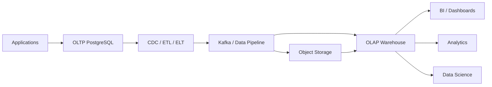
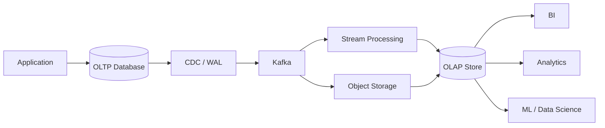
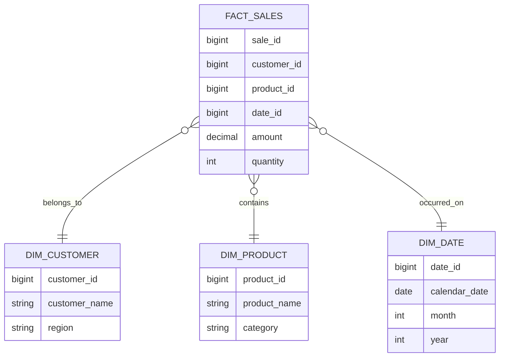
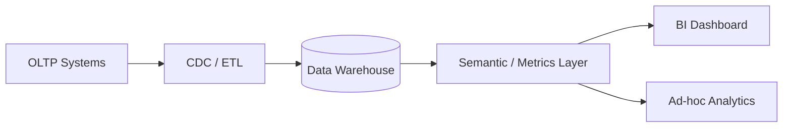
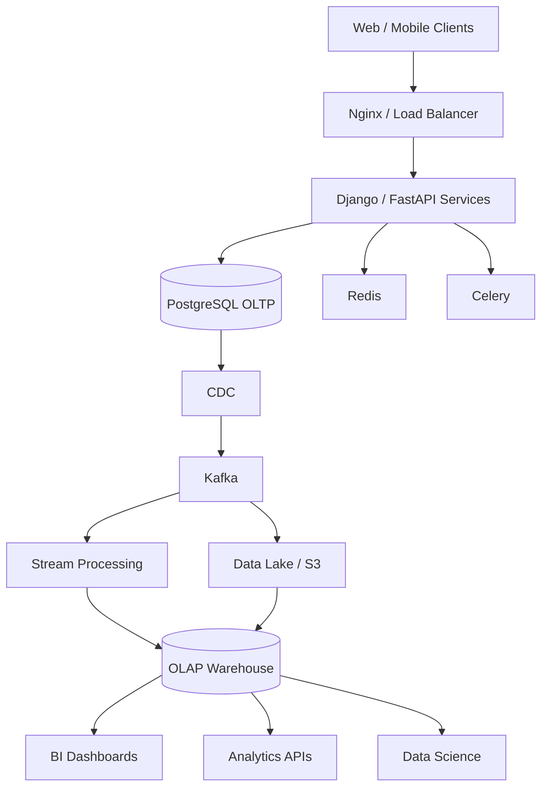

# 13- OLAP Architecture

## Overview

Online Analytical Processing (OLAP) architecture is designed for workloads that analyze large volumes of historical and aggregated data rather than execute short, high-concurrency transactional operations.

Typical OLAP workloads include:

- Revenue and sales analytics
- Customer behavior analysis
- Business intelligence dashboards
- Financial reporting
- Product analytics
- Operational reporting
- Time-series analysis
- Data science and machine learning feature generation
- Executive dashboards

The fundamental difference from OLTP is the shape of the workload:

```text
OLTP
Small transactions
      ↓
Frequent reads/writes
      ↓
Low latency
      ↓
Operational state

OLAP
Large analytical queries
      ↓
Large scans and aggregations
      ↓
Historical data
      ↓
Analytical insight
```

A production analytics architecture commonly separates the transactional system from the analytical system:



The goal is to prevent expensive analytical workloads from competing with latency-sensitive transactional operations.

---

## OLAP Characteristics

OLAP workloads typically have these characteristics:

| Characteristic | Typical OLAP Behavior |
|---|---|
| Query size | Large |
| Data scanned | Millions to billions of rows |
| Query duration | Seconds to minutes |
| Writes | Batch / streaming ingestion |
| Reads | Large scans and aggregations |
| Concurrency | Lower than OLTP, workload-dependent |
| Data volume | Large |
| Schema | Dimensional / denormalized |
| Primary operation | Aggregation |
| Storage | Often column-oriented |
| Typical use | Analytics and reporting |

These are workload characteristics rather than strict requirements. Modern analytical systems can support interactive queries with very low latency while processing extremely large datasets.

---

## OLTP vs OLAP

| Dimension | OLTP | OLAP |
|---|---|---|
| Purpose | Operational transactions | Analytics |
| Query pattern | Point lookups / small ranges | Scans / aggregations |
| Transaction size | Small | Often large or batch-oriented |
| Latency | Milliseconds | Seconds to minutes |
| Data | Current operational state | Historical / analytical |
| Schema | Normalized | Often dimensional |
| Storage | Row-oriented commonly | Column-oriented commonly |
| Writes | Frequent | Batch / streaming |
| Indexing | Important | Often secondary to partitioning/storage layout |
| Scaling | Vertical + replicas + partitioning | Distributed compute/storage |
| Example | Create order | Monthly revenue by region |

A PostgreSQL database can support both workloads at smaller scale, but separating them becomes increasingly important as analytical volume grows.

---

## Why Separate OLAP from OLTP

Consider a production application:

```text
PostgreSQL Primary
       │
       ├── POST /orders
       ├── GET /customers
       ├── Payment updates
       │
       └── Revenue report
             ↓
       Scan 500M rows
```

The analytical query can consume:

- CPU
- Memory
- Disk bandwidth
- Buffer cache
- Database connections
- I/O capacity

This can increase latency for operational requests.

A better architecture is:

```text
PostgreSQL
    │
    ├── OLTP workload
    │
    └── CDC / replication
             │
             ▼
       Analytical Store
             │
             ├── BI
             ├── Reporting
             └── Data Science
```

The analytical system can then optimize its storage and compute specifically for large scans and aggregations.

---

## OLAP Data Flow

A typical modern pipeline looks like:



The exact implementation depends on freshness requirements.

For example:

```text
Real-time dashboard
→ streaming ingestion

Hourly operational report
→ micro-batch

Daily financial report
→ batch ETL/ELT
```

---

## ETL vs ELT

### ETL

```text
Extract
   ↓
Transform
   ↓
Load
```

Data is transformed before entering the analytical store.

### ELT

```text
Extract
   ↓
Load
   ↓
Transform
```

Raw data is loaded first and transformed inside the analytical platform.

Modern cloud architectures commonly favor ELT because scalable analytical engines can perform transformations efficiently after ingestion.

| Approach | Advantages | Limitations |
|---|---|---|
| ETL | Controlled data shape before loading | Transformation pipeline becomes a bottleneck |
| ELT | Flexible, scalable transformations | Requires capable analytical storage/compute |
| Streaming | Low latency | More operational complexity |
| Batch | Simpler and efficient | Higher data freshness delay |

---

## Data Warehouse

A data warehouse is an analytical data store designed for structured business analysis.

Typical architecture:

```text
Operational Systems
       │
       ▼
 Data Ingestion
       │
       ▼
 Data Warehouse
       │
       ├── Fact Tables
       ├── Dimension Tables
       └── Aggregations
       │
       ▼
 BI / Reporting
```

Common warehouse workloads include:

```sql
SELECT
    region,
    DATE_TRUNC('month', order_date) AS month,
    SUM(revenue) AS revenue
FROM fact_orders
GROUP BY region, DATE_TRUNC('month', order_date);
```

This type of query is fundamentally different from:

```sql
SELECT *
FROM orders
WHERE id = $1;
```

The first benefits from analytical scan and aggregation capabilities; the second is a classic OLTP query.

---

## Data Lake

A data lake stores large amounts of raw or semi-structured data, commonly in object storage.

Example:

```text
S3
├── raw/
│   ├── orders/
│   ├── customers/
│   └── events/
├── curated/
│   ├── orders/
│   └── customers/
└── analytics/
```

AWS S3 is commonly used as durable, inexpensive analytical storage.

Data lakes are useful when organizations need to retain:

- Raw events
- JSON
- Logs
- Application data
- CDC streams
- Historical datasets
- Machine learning data

A data lake is not automatically an analytics solution. Query engines, metadata, governance, partitioning, file formats, and data quality still need to be designed.

---

## Lakehouse Architecture

A lakehouse combines characteristics of data lakes and warehouses.

Conceptually:

```text
              Object Storage
                    │
          ┌─────────┴─────────┐
          │                   │
      Raw Data          Transactional Tables
          │                   │
          └─────────┬─────────┘
                    │
             Query Engines
                    │
          ┌─────────┼─────────┐
          ▼         ▼         ▼
         BI     Analytics     ML
```

The objective is to use low-cost object storage while providing reliable table semantics and analytical querying.

---

## Columnar Storage

Many OLAP systems use columnar storage.

Instead of:

```text
Row 1: id, customer, amount, status
Row 2: id, customer, amount, status
Row 3: id, customer, amount, status
```

Columnar storage conceptually groups values:

```text
id:       1, 2, 3, ...
customer: A, B, C, ...
amount:   10, 20, 30, ...
status:   paid, paid, pending, ...
```

A query requesting only:

```sql
SELECT SUM(amount)
FROM orders;
```

does not need to read unrelated columns.

Benefits include:

- Reduced I/O
- Better compression
- Efficient analytical scans
- Improved aggregation performance

This is one reason columnar engines are well suited to OLAP workloads.

---

## Compression

Analytical systems can achieve strong compression because columns contain values of similar types and often similar distributions.

For example:

```text
status:
paid
paid
paid
pending
paid
paid
```

Compresses efficiently.

Compression reduces:

- Storage cost
- Disk I/O
- Network transfer
- Scan cost

However, compression also consumes CPU during encoding and decoding. The optimal strategy depends on the workload.

---

## Partitioning

Large analytical datasets should often be partitioned by a useful pruning dimension.

For time-series data:

```text
events
├── 2026-01
├── 2026-02
├── 2026-03
└── 2026-04
```

A query such as:

```sql
SELECT COUNT(*)
FROM events
WHERE event_date >= DATE '2026-04-01'
  AND event_date < DATE '2026-05-01';
```

can potentially scan only the relevant partition.

This is known as partition pruning.

Partitioning should follow actual query patterns rather than arbitrary organizational preferences.

---

## Partition Pruning

The ideal flow is:

```text
Query
  │
  ▼
Filter on partition key
  │
  ▼
Partition pruning
  │
  ├── Skip irrelevant partitions
  │
  ▼
Scan required partitions
  │
  ▼
Aggregate
```

Without pruning:

```text
Scan all historical data
```

With effective pruning:

```text
Scan only relevant data
```

For very large analytical datasets, reducing the amount of data scanned can be more important than adding traditional indexes.

---

## Star Schema

A common OLAP modeling pattern is the star schema.



The central fact table contains measurable business events, while dimension tables provide descriptive attributes.

---

## Fact Tables

Fact tables usually represent business events or measurements.

Examples:

```text
fact_sales
fact_orders
fact_payments
fact_page_views
fact_shipments
```

Typical columns include:

```text
event identifier
foreign keys to dimensions
timestamp/date
numeric measurements
quantities
amounts
```

For example:

```text
fact_sales

sale_id
customer_id
product_id
date_id
quantity
gross_amount
discount_amount
net_amount
```

Fact tables can become extremely large and therefore require careful partitioning, storage layout, and ingestion design.

---

## Dimension Tables

Dimensions describe entities associated with facts.

Examples:

```text
dim_customer
dim_product
dim_store
dim_region
dim_date
```

A dimension might contain:

```text
customer_id
name
country
region
customer_segment
```

Dimensions are typically much smaller than fact tables.

---

## Slowly Changing Dimensions

Business attributes change over time.

For example:

```text
Customer:
Region = East

Later:
Region = West
```

If historical reports need to preserve the original region, simply updating the row destroys historical context.

A common solution is Slowly Changing Dimension Type 2:

```text
customer_id | region | valid_from | valid_to
------------|--------|------------|----------
101         | East   | 2025-01-01 | 2026-04-01
101         | West   | 2026-04-01 | NULL
```

The analytical model can then reconstruct historical state.

---

## Denormalization

OLAP schemas often denormalize data to reduce join complexity.

For example:

```text
Fact
  │
  ├── customer_region
  ├── product_category
  ├── store_region
  └── sales_amount
```

Advantages:

- Fewer joins
- Simpler analytical queries
- Potentially faster scans

Limitations:

- More storage
- Data duplication
- More complex ingestion
- Risk of inconsistent derived data

Denormalization should be deliberate and pipeline-managed.

---

## Aggregations

Analytical workloads frequently perform:

```text
SUM
COUNT
AVG
MIN
MAX
GROUP BY
WINDOW FUNCTIONS
```

Example:

```sql
SELECT
    product_id,
    DATE_TRUNC('month', sold_at) AS month,
    SUM(amount) AS revenue,
    COUNT(*) AS orders
FROM sales
GROUP BY
    product_id,
    DATE_TRUNC('month', sold_at);
```

For frequently requested metrics, pre-aggregated tables or materialized views can reduce repeated computation.

---

## Materialized Views

A materialized view stores the result of a query.

Example:

```sql
CREATE MATERIALIZED VIEW monthly_sales AS
SELECT
    DATE_TRUNC('month', sold_at) AS month,
    SUM(amount) AS revenue
FROM sales
GROUP BY DATE_TRUNC('month', sold_at);
```

Advantages:

- Faster repeated queries
- Reduced computation
- Predictable dashboard latency

Limitations:

- Data becomes stale until refreshed
- Refresh consumes resources
- Concurrent refresh has operational considerations
- Complex dependency management

Use materialized views when the freshness requirement permits precomputation.

---

## OLAP Query Execution

An analytical query commonly follows:

```text
SQL
 │
 ▼
Parse / Analyze
 │
 ▼
Logical Plan
 │
 ▼
Physical Plan
 │
 ├── Scan
 ├── Filter
 ├── Join
 ├── Aggregate
 └── Sort
 │
 ▼
Parallel Execution
 │
 ▼
Result
```

Distributed OLAP engines may execute these operations across many workers.

---

## Parallel Query Execution

Analytical queries are often highly parallelizable.

Conceptually:

```text
             Query
               │
          Coordinator
               │
      ┌────────┼────────┐
      ▼        ▼        ▼
   Worker 1 Worker 2 Worker 3
      │        │        │
   Scan A   Scan B   Scan C
      │        │        │
      └────────┼────────┘
               ▼
           Aggregate
               │
               ▼
             Result
```

Parallelism can significantly reduce latency but increases:

- CPU usage
- Memory usage
- Network traffic
- Concurrency pressure

A query that is individually fast can still overload a shared analytical cluster if concurrency is uncontrolled.

---

## Distributed Aggregation

Distributed aggregation commonly follows:

```text
Raw Data
   │
   ▼
Local Aggregation
   │
   ▼
Partial Results
   │
   ▼
Network Shuffle
   │
   ▼
Global Aggregation
```

Reducing data before network exchange can dramatically improve performance.

This is why query engines optimize execution plans rather than simply scanning and transferring all raw rows.

---

## Joins in OLAP

Analytical queries frequently join large datasets.

Common strategies include:

- Broadcast joins
- Hash joins
- Sort-merge joins
- Partitioned joins

The optimal strategy depends on:

- Table size
- Cardinality
- Distribution
- Available memory
- Data locality
- Statistics

A small dimension table may be broadcast to workers rather than repartitioning a huge fact table.

---

## Data Skew

Distributed OLAP systems can suffer from skew.

Example:

```text
Partition A → 1 billion rows
Partition B → 10 million rows
Partition C → 8 million rows
Partition D → 5 million rows
```

One worker becomes the bottleneck.

Skew can result from:

- Popular customers
- Large tenants
- Hot event types
- Poor partition keys

Monitor distribution rather than assuming evenly sized partitions.

---

## Query Performance

For analytical queries, focus on:

```text
Amount of data scanned
        ↓
Partition pruning
        ↓
Column projection
        ↓
Compression
        ↓
Join strategy
        ↓
Aggregation strategy
        ↓
Parallelism
```

A useful rule is:

> The fastest analytical row is the row that never needs to be scanned.

Avoid:

```sql
SELECT *
FROM events;
```

when only a few columns are required.

Prefer:

```sql
SELECT event_date, event_type, customer_id
FROM events
WHERE event_date >= CURRENT_DATE - INTERVAL '7 days';
```

---

## Query Concurrency

OLAP systems can support concurrent queries, but analytical queries consume significantly more resources than typical OLTP requests.

Use workload controls such as:

- Resource queues
- Query priorities
- Concurrency limits
- Workload isolation
- Dedicated compute
- Query timeouts

A dashboard should not be able to consume an entire shared analytical cluster.

---

## BI Architecture

A common BI architecture is:



A semantic layer can standardize definitions such as:

```text
Revenue
Active Customer
Conversion Rate
Gross Margin
```

Without standardized definitions, different dashboards may calculate the same metric differently.

---

## Real-Time Analytics

Not all analytics needs to be batch-based.

A streaming architecture can look like:

```text
Application
    │
    ▼
Kafka
    │
    ▼
Stream Processor
    │
    ▼
OLAP Store
    │
    ▼
Real-Time Dashboard
```

Use streaming when the business requires low-latency data freshness.

Do not introduce streaming merely because "real-time" sounds more advanced. It increases system complexity and operational requirements.

---

## Batch Analytics

Batch processing remains appropriate for many workloads.

Example:

```text
00:00
  │
  ▼
Daily extraction
  │
  ▼
Transform
  │
  ▼
Load warehouse
  │
  ▼
Morning dashboards
```

Batch processing can be:

- Easier to operate
- Cheaper
- Easier to replay
- Easier to validate

Choose the freshness SLA first.

---

## Python and OLAP

Python services commonly interact with analytical systems for:

- Data processing
- Scheduled reporting
- Feature generation
- Analytics APIs
- Data quality checks

A backend API should generally not execute an expensive analytical query directly on every user request.

Instead:

```text
User
 │
 ▼
API
 │
 ├── Cached / precomputed result
 │
 └── Analytical query with limits
```

For expensive reports:

```text
API
 │
 ▼
Job Queue
 │
 ▼
Celery Worker
 │
 ▼
OLAP Query
 │
 ▼
Object Storage / Report
```

---

## Django and FastAPI

Django and FastAPI applications can expose analytical APIs, but analytical workloads should have explicit resource boundaries.

Example:

```text
GET /analytics/revenue?from=2026-01-01&to=2026-03-31
```

The service should enforce:

- Maximum date range
- Pagination where applicable
- Query timeouts
- Authorization
- Tenant isolation
- Result-size limits
- Caching for repeated reports

Do not allow arbitrary user-provided SQL.

---

## REST and gRPC Analytics APIs

For external consumers, REST is usually sufficient:

```http
GET /analytics/sales?period=monthly
```

gRPC can be useful for high-throughput internal service-to-service analytical APIs.

Neither protocol solves analytical query efficiency. The primary performance characteristics remain:

```text
Data volume
Query plan
Storage layout
Compute
Concurrency
```

---

## OLAP and Kafka

Kafka is often used as an ingestion backbone:

```text
Microservices
    │
    ▼
Kafka Topics
    │
    ├── orders
    ├── payments
    ├── customers
    └── events
    │
    ▼
Stream / Batch Consumers
    │
    ▼
OLAP
```

Kafka provides durable event transport and decoupling, but it is not itself a replacement for an analytical query engine.

---

## Data Freshness

Every analytical system should define a freshness SLA.

| Requirement | Suitable Pattern |
|---|---|
| Seconds | Streaming |
| Minutes | Micro-batch / streaming |
| Hourly | Scheduled ELT |
| Daily | Batch |
| Weekly | Batch |

Do not design a streaming architecture when the business only requires daily reporting.

---

## Data Quality

OLAP systems amplify upstream data-quality problems.

Important checks include:

- Null validation
- Duplicate detection
- Referential integrity
- Row-count reconciliation
- Freshness checks
- Schema validation
- Aggregate reconciliation
- Missing partition detection

For financial reporting, validate totals against the source system.

Example:

```text
OLTP total
     │
     ▼
$10,000,000
     │
     ├── compare
     ▼
Warehouse total
     │
     ▼
$10,000,000
```

Differences should be investigated before reports are published.

---

## Idempotent Data Pipelines

Pipelines should tolerate retries.

A robust ingestion process should avoid:

```text
Batch runs
   ↓
Loads data
   ↓
Fails halfway
   ↓
Retry
   ↓
Duplicate data
```

Use:

- Deterministic event identifiers
- Upserts where supported
- Batch identifiers
- Deduplication
- Exactly-once-like application semantics where required
- Checkpointing

Exactly-once processing is a system-level property and should not be assumed merely because an individual component advertises exactly-once behavior.

---

## Backfills

Analytical systems frequently require historical backfills.

Example:

```text
Bug discovered
     │
     ▼
Transformation fixed
     │
     ▼
Reprocess 12 months
     │
     ▼
Validate
     │
     ▼
Publish corrected data
```

Backfills should be isolated from normal ingestion where possible.

Design pipelines so that historical data can be recomputed deterministically.

---

## Schema Evolution

Event and analytical schemas evolve.

Example:

```text
v1:
customer_id
amount

v2:
customer_id
amount
currency
```

Prefer backward-compatible evolution where possible.

For Kafka-based systems:

- Add optional fields
- Avoid breaking consumers
- Version incompatible contracts
- Maintain schema compatibility policies

For warehouse tables:

- Add columns safely
- Backfill separately
- Validate downstream dependencies
- Remove obsolete columns only after consumers migrate

---

## Data Retention

OLAP datasets can grow rapidly.

Define retention policies:

```text
Hot data
→ Fast analytical access

Warm data
→ Lower-cost storage

Cold data
→ Object storage / archive

Expired data
→ Deleted
```

Retention should be driven by:

- Business requirements
- Compliance
- Cost
- Query frequency
- Recovery requirements

Keeping every event forever in expensive analytical compute storage is rarely optimal.

---

## Security

Analytical systems frequently contain broad historical datasets and therefore require strong access controls.

Important controls include:

- IAM
- Role-based access
- Row-level security where appropriate
- Column-level security for sensitive fields
- Encryption
- Network isolation
- Audit logging
- Secret management
- Data masking

Avoid copying sensitive production data into analytics without a defined access and retention policy.

---

## Multi-Tenant Analytics

Multi-tenant SaaS systems need explicit tenant isolation.

A typical model is:

```text
fact_events
    │
    └── tenant_id
```

Queries should enforce:

```sql
WHERE tenant_id = :tenant_id
```

At scale, consider:

- Partitioning
- Row-level security
- Separate schemas
- Separate datasets
- Dedicated analytical resources for large tenants

Physical partitioning alone is not an authorization mechanism.

---

## High Availability

Analytical systems have different HA requirements from OLTP systems.

For a dashboard system:

```text
Temporary analytics outage
        ↓
May be acceptable

Transactional database outage
        ↓
May stop business operations
```

Define HA according to business impact.

Important capabilities include:

- Replicated storage
- Multiple compute nodes
- Automatic recovery
- Durable object storage
- Rebuildable datasets
- Pipeline checkpointing

Because analytical data is often derived, recovery may involve recomputation from durable source data.

---

## Disaster Recovery

A good analytical DR strategy should answer:

```text
Where is raw data?
How is the warehouse rebuilt?
How far back can data be replayed?
How are transformations versioned?
How long does reconstruction take?
```

Object storage is particularly useful as a durable source for reconstruction.

Do not depend exclusively on a derived warehouse copy if the raw source data is recoverable.

---

## Cost Optimization

OLAP cost is heavily influenced by data volume and compute.

Major cost drivers include:

- Storage
- Query execution
- Data scanned
- Compute nodes
- Streaming infrastructure
- Data transfer
- Retention period

Useful optimizations include:

- Partition pruning
- Column projection
- Compression
- Pre-aggregation
- Query caching
- Workload isolation
- Lifecycle policies
- Autoscaling
- Right-sized compute

A query that scans terabytes unnecessarily is both a performance and cost problem.

---

## Monitoring

Monitor the entire analytical pipeline.

### Ingestion

- Events per second
- Consumer lag
- Failed records
- Batch duration
- Pipeline throughput

### Storage

- Dataset size
- Partition size
- File count
- Storage growth
- Small-file accumulation

### Queries

- Query latency
- Data scanned
- CPU
- Memory
- Queue time
- Spill-to-disk activity
- Failed queries

### Data Quality

- Freshness
- Missing records
- Duplicate records
- Reconciliation failures
- Schema violations

---

## Small Files Problem

Object-storage-based analytical systems can suffer from excessive small files.

Bad:

```text
10 million files
×
1 KB each
```

Better:

```text
Fewer appropriately sized files
```

Small files increase:

- Metadata overhead
- Query planning time
- Network requests
- Object-store operations

Compaction should be part of the operational design where the platform requires it.

---

## PostgreSQL as an OLAP Database

PostgreSQL can support analytical workloads, particularly when:

- Data volume is moderate
- Query concurrency is controlled
- Analytics are operational in nature
- Existing infrastructure is sufficient

Useful techniques include:

- Materialized views
- Partitioning
- Appropriate indexes
- Aggregation tables
- Read replicas
- Query optimization

However, PostgreSQL is not automatically the best choice for very large distributed analytical workloads.

---

## PostgreSQL Read Replica for Analytics

A read replica can isolate some analytical reads:

```text
                 ┌── Application reads
Primary ─────────┤
                 └── Replica
                       │
                       └── Analytics
```

This is useful as an intermediate architecture.

However, analytical queries can still overwhelm the replica.

For large workloads, a dedicated analytical platform provides stronger workload isolation.

---

## OLAP Architecture Evolution

A system may evolve through stages:

```text
Stage 1
PostgreSQL
    ↓

Stage 2
PostgreSQL + Read Replica
    ↓

Stage 3
PostgreSQL + Analytics Replica / Reporting DB
    ↓

Stage 4
CDC + Data Warehouse
    ↓

Stage 5
Data Lake / Lakehouse + Warehouse
    ↓

Stage 6
Distributed Analytical Platform
```

Do not introduce the final architecture before the workload requires it.

---

## Production Architecture Example

A mature backend platform might look like:



The important architectural boundary is:

```text
Operational system
        │
        │ controlled data movement
        ▼
Analytical system
```

rather than allowing arbitrary analytical workloads to compete with production transactions.

---

## Common Mistakes

### Running Analytics on the OLTP Primary

Large scans compete with transactional traffic.

**Better:** use a read replica, reporting database, warehouse, or analytical platform.

### Selecting Every Column

```sql
SELECT *
```

causes unnecessary I/O in analytical systems.

**Better:** project only required columns.

### Ignoring Partition Pruning

Partitioning without queries that can eliminate partitions provides limited benefit.

**Better:** align partitioning with real filtering patterns.

### Creating Excessive Partitions

Too many tiny partitions increase metadata and planning overhead.

**Better:** choose partition granularity based on data volume and query patterns.

### Assuming More Workers Always Means Faster Queries

Parallelism can increase resource contention and network overhead.

**Better:** benchmark concurrency and parallelism together.

### Ignoring Data Skew

One oversized partition can dominate distributed execution time.

**Better:** inspect distribution and choose keys carefully.

### Treating Kafka as an OLAP Database

Kafka is an event transport/log system, not a general-purpose analytical query engine.

**Better:** use Kafka to feed an analytical store.

### Building Real-Time Pipelines Without a Freshness Requirement

Streaming introduces substantial operational complexity.

**Better:** define the required freshness SLA first.

### Allowing Arbitrary Analytical Queries from APIs

A user-controlled query can exhaust the analytical cluster.

**Better:** expose constrained queries and enforce limits, authorization, and timeouts.

### Copying Sensitive Production Data Without Governance

Analytics systems often have more users and longer retention.

**Better:** apply masking, access controls, retention policies, and auditing.

### Ignoring Backfills

Analytical pipelines eventually require historical corrections.

**Better:** design deterministic, replayable transformations from the beginning.

### Ignoring Small Files

Object-storage query performance can degrade when datasets contain enormous numbers of tiny files.

**Better:** use appropriate file sizes and compaction.

---

## Production Design Checklist

- [ ] OLTP and OLAP workloads are appropriately isolated.
- [ ] Data freshness requirements are explicitly defined.
- [ ] ETL, ELT, or streaming architecture is justified by those requirements.
- [ ] Raw data is retained appropriately for replay and recovery.
- [ ] Fact and dimension models are designed around analytical access patterns.
- [ ] Partitioning supports effective pruning.
- [ ] Queries project only required columns.
- [ ] Large joins have been tested with production-scale data.
- [ ] Data skew is monitored.
- [ ] Analytical concurrency is controlled.
- [ ] Expensive dashboards use caching or pre-aggregation where appropriate.
- [ ] Data pipelines are idempotent and replayable.
- [ ] Backfills are supported.
- [ ] Schema evolution is controlled.
- [ ] Data quality and freshness are monitored.
- [ ] Sensitive data has appropriate access controls.
- [ ] Retention and lifecycle policies are defined.
- [ ] Query cost and scanned data are monitored.
- [ ] High availability matches business requirements.
- [ ] Raw data and pipeline definitions support disaster recovery.
- [ ] Analytical workloads cannot unexpectedly degrade transactional systems.

## Interview Traps

### Why is OLAP usually column-oriented?

Analytical queries often read a small subset of columns across many rows. Columnar storage reduces unnecessary I/O and generally improves compression and analytical scan performance.

### Why should OLAP be separated from OLTP?

Large analytical queries consume significant CPU, memory, I/O, and connections. Separating workloads prevents analytics from degrading transactional latency.

### Why is partitioning important in OLAP?

Partitioning can reduce the amount of data scanned when queries filter on the partition key, improving both performance and cost.

### Is partitioning the same as sharding?

No. Partitioning divides data within a logical database/table architecture, while sharding distributes data across independent database nodes or database instances.

### Why are star schemas common in OLAP?

They provide a simple analytical model with large fact tables connected to descriptive dimensions, making common reporting and aggregation queries easier to express and optimize.

### What is a fact table?

A fact table stores measurable business events or observations, such as sales, orders, payments, or page views.

### What is a dimension table?

A dimension table stores descriptive attributes used to analyze facts, such as customer, product, date, store, or region.

### What is a Slowly Changing Dimension?

It is a technique for preserving historical changes to dimension attributes so that historical facts can be analyzed according to the dimension state that existed at the time.

### Why can OLAP queries benefit from columnar storage?

Only required columns need to be read, and similar values within columns often compress efficiently.

### Why isn't a PostgreSQL read replica always sufficient for analytics?

It isolates reads from the primary but still shares the underlying database architecture and can become overloaded by large analytical scans.

### What is the difference between ETL and ELT?

ETL transforms data before loading it into the target system. ELT loads data first and performs transformations inside the analytical platform.

### Why is data freshness important?

It determines whether batch, micro-batch, or streaming ingestion is appropriate. Architecture should be driven by the business freshness SLA rather than technology preference.

### How do you prevent analytical queries from overwhelming a cluster?

Use workload isolation, query limits, concurrency controls, resource management, pre-aggregation, caching, and appropriately sized compute.

### Why is data skew dangerous in distributed OLAP?

A highly uneven distribution can cause one worker or partition to process much more data than others, making the entire query wait for the slowest worker.

### Why is object storage useful in analytical architecture?

It provides durable, scalable, relatively inexpensive storage that can retain raw and historical data independently of analytical compute.

### What makes an analytical pipeline production-ready?

It must be replayable, idempotent, observable, schema-aware, quality-checked, secure, cost-controlled, and capable of recovering from ingestion or processing failures.

## Key Takeaways

- OLAP is optimized for large-scale analytical scans, joins, and aggregations rather than the short, highly concurrent transactions characteristic of OLTP.
- Production systems commonly separate OLAP from OLTP using CDC, Kafka, object storage, warehouses, or dedicated analytical engines to protect transactional latency.
- Partition pruning, columnar storage, compression, projection, pre-aggregation, and controlled parallelism are fundamental techniques for reducing analytical query cost and latency.
- Analytical pipelines must be designed for freshness, idempotency, replayability, schema evolution, data quality, security, and backfills—not just query performance.
- Choose batch, streaming, PostgreSQL reporting, a warehouse, or a lakehouse according to actual data volume, query patterns, freshness requirements, reliability needs, and cost constraints.