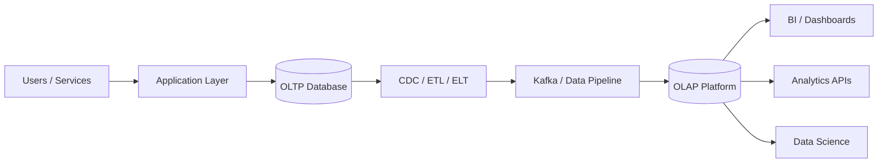
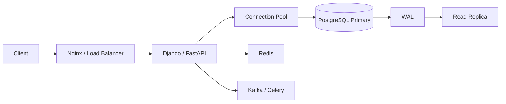
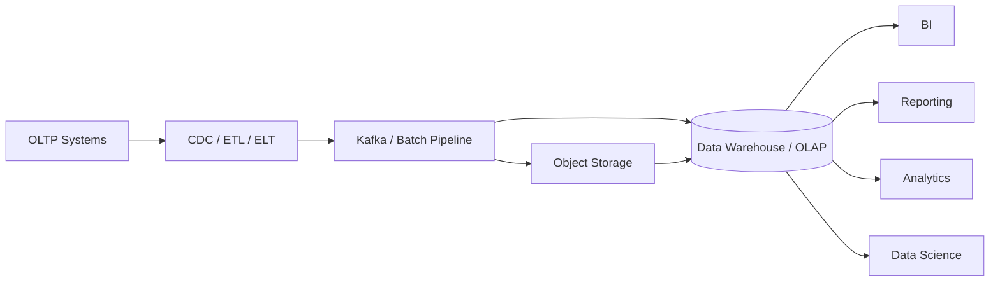
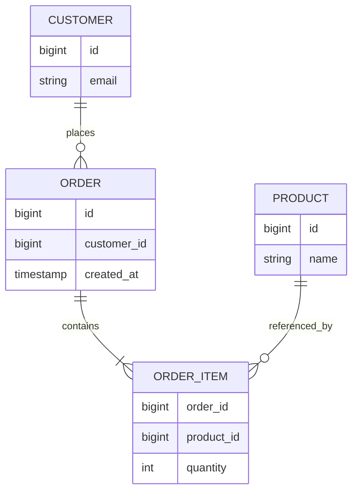
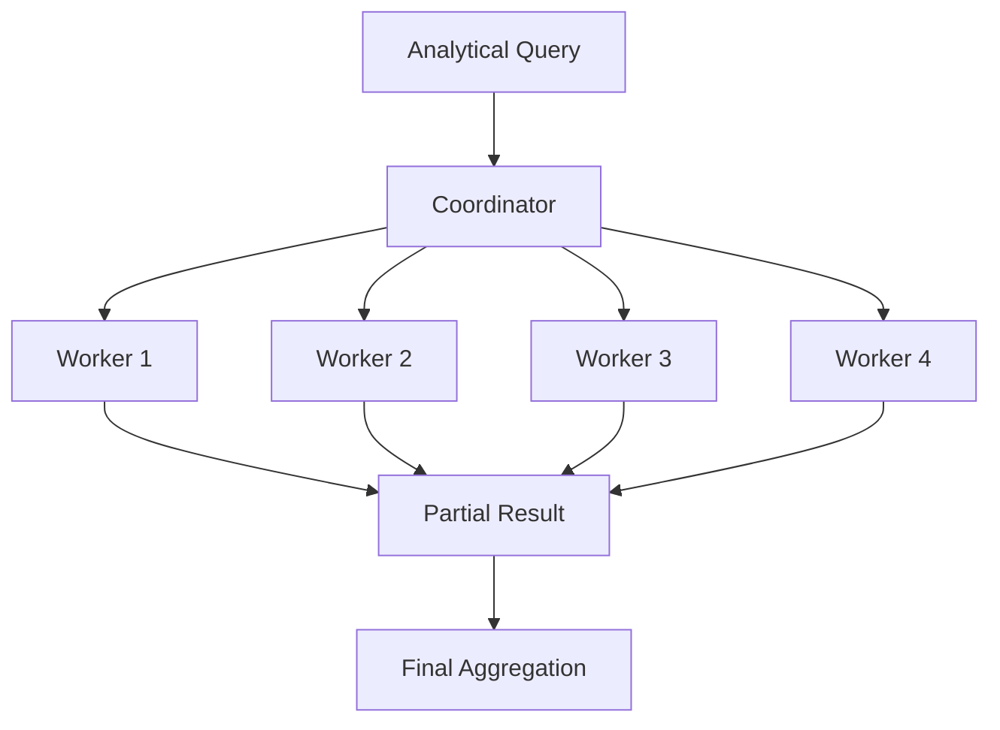
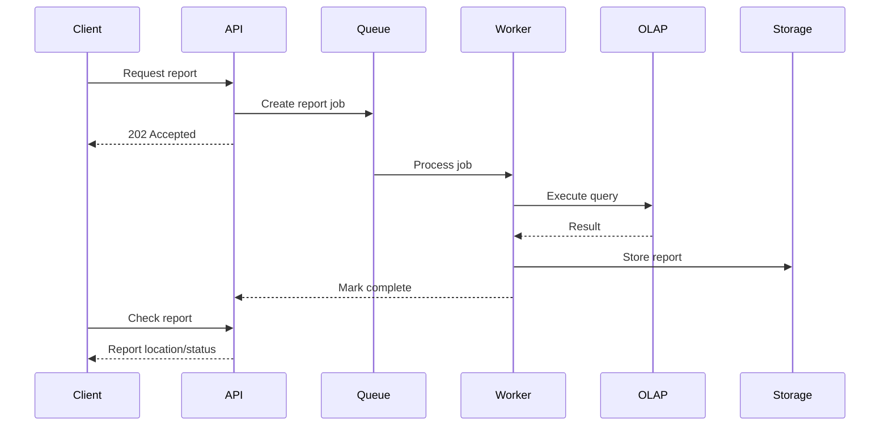

# 14- OLTP vs OLAP Architecture

## Overview

OLTP (Online Transaction Processing) and OLAP (Online Analytical Processing) represent two fundamentally different database workload patterns.

OLTP systems manage **current operational state** through many concurrent, short-lived transactions.

OLAP systems analyze **large volumes of historical data** through scans, joins, aggregations, and analytical queries.

The distinction is primarily about **workload characteristics and optimization goals**, not simply about which database product is being used.

```text
OLTP
Operational transactions
        │
        ├── Small reads
        ├── Small writes
        ├── High concurrency
        └── Low latency
                │
                ▼
          Current state


OLAP
Historical analysis
        │
        ├── Large scans
        ├── Aggregations
        ├── Complex joins
        └── Lower concurrency
                │
                ▼
          Analytical insight
```

A mature backend architecture often contains both:



The architectural objective is to allow each workload to use storage, compute, and execution strategies appropriate to its requirements.

---

## Fundamental Difference

The simplest distinction is:

```text
OLTP answers:
"What is the state of the system right now?"

OLAP answers:
"What has happened, why did it happen, and what patterns exist?"
```

For an e-commerce system:

### OLTP

```sql
SELECT *
FROM orders
WHERE id = $1;
```

or:

```sql
UPDATE inventory
SET available = available - 1
WHERE product_id = $1
  AND available > 0;
```

These operations need correctness and low latency.

### OLAP

```sql
SELECT
    region,
    DATE_TRUNC('month', order_date) AS month,
    SUM(amount) AS revenue
FROM orders
GROUP BY
    region,
    DATE_TRUNC('month', order_date);
```

This query may scan a large historical dataset and perform substantial aggregation.

The two queries should not necessarily execute on the same database infrastructure.

---

## Workload Comparison

| Dimension | OLTP | OLAP |
|---|---|---|
| Primary goal | Execute transactions | Analyze data |
| Data focus | Current operational state | Historical / analytical data |
| Query size | Small | Large |
| Query complexity | Usually predictable | Often complex |
| Reads | Small result sets | Large scans |
| Writes | Frequent | Batch / streaming ingestion |
| Transactions | Central | Less transaction-centric |
| Latency | Usually milliseconds | Seconds to minutes, workload-dependent |
| Concurrency | High | Often lower, but variable |
| Schema | Usually normalized | Often dimensional / denormalized |
| Storage | Commonly row-oriented | Commonly column-oriented |
| Indexing | Frequently important | Often less important than scan/storage layout |
| Scaling | Vertical, replicas, partitioning | Distributed compute/storage |
| Typical consumers | Applications | BI, analysts, data scientists |
| Example | Create order | Analyze yearly revenue |

These are common characteristics, not hard requirements. Modern analytical platforms can provide interactive latency, and modern OLTP databases can perform some analytical workloads effectively.

---

## OLTP Architecture

A typical OLTP architecture looks like:



The database is the authoritative source of operational state.

Typical operations include:

```text
Create customer
Create order
Update inventory
Process payment state
Update account balance
Create booking
Authenticate user
```

OLTP architecture prioritizes:

- Transactional correctness
- Concurrency
- Low latency
- Strong consistency where required
- Efficient point/range lookups
- Controlled write amplification

---

## OLAP Architecture

A typical OLAP architecture looks different:



The analytical platform is optimized for:

- Large scans
- Aggregations
- Complex joins
- Historical analysis
- Parallel execution
- Columnar storage
- Compression
- Distributed computation

---

## Why OLTP and OLAP Should Often Be Separated

Suppose an application has:

```text
1000 API requests/second
        │
        ▼
PostgreSQL
        │
        ├── Order transactions
        ├── Customer reads
        ├── Payment updates
        │
        └── Revenue query
                │
                ▼
          Scan 1 billion rows
```

The analytical query can consume significant:

- CPU
- Memory
- Disk I/O
- Buffer cache
- Database connections

This can increase application latency.

A better design is:

```text
                  PostgreSQL OLTP
                        │
                        │ CDC
                        ▼
                     Kafka
                        │
                        ▼
                 Analytical Store
                        │
              ┌─────────┼─────────┐
              ▼         ▼         ▼
             BI     Analytics     ML
```

The operational database remains focused on transactional workloads.

---

## Data Movement Between OLTP and OLAP

Data can move from OLTP to OLAP through several patterns.

| Pattern | Freshness | Complexity | Typical Use |
|---|---|---|---|
| Batch ETL | Hours / days | Low | Periodic reporting |
| Scheduled ELT | Hours / daily | Moderate | Warehousing |
| CDC | Seconds / minutes | Moderate | Near-real-time analytics |
| Kafka streaming | Seconds | High | Real-time analytics |
| Read replica | Near-real-time | Low | Operational reporting |

The correct choice depends on the business freshness requirement.

Do not introduce streaming merely because the platform supports it.

---

## Batch vs Streaming

### Batch

```text
OLTP
  │
  ▼
Extract
  │
  ▼
Transform
  │
  ▼
Load
  │
  ▼
OLAP
```

Batch processing is appropriate when:

```text
"Data can be one day old."
```

Advantages:

- Simpler operations
- Easier replay
- Often cheaper
- Straightforward validation

Limitations:

- Higher data latency
- Large periodic workloads
- Potentially slower error recovery

### Streaming

```text
Application
     │
     ▼
   Kafka
     │
     ▼
Stream Processor
     │
     ▼
   OLAP
```

Streaming is appropriate when:

```text
"Dashboard data must be available within seconds."
```

Advantages:

- Low latency
- Continuous processing
- Near-real-time analytics

Limitations:

- More operational complexity
- Consumer lag management
- Schema evolution challenges
- Replay and deduplication requirements

---

## Storage Architecture

OLTP databases commonly optimize around rows.

```text
Row:
[id, customer_id, amount, status, created_at]
```

OLAP systems often use columnar storage:

```text
id:          1, 2, 3, 4, ...
amount:      10, 20, 50, 80, ...
status:      paid, paid, pending, paid, ...
created_at:  ...
```

An analytical query such as:

```sql
SELECT SUM(amount)
FROM sales;
```

only needs the `amount` column.

Columnar storage can therefore reduce I/O and improve compression for analytical workloads.

---

## Indexing Differences

Indexes are central to many OLTP query patterns.

For example:

```sql
CREATE INDEX orders_customer_created_idx
ON orders(customer_id, created_at DESC);
```

This is useful for:

```sql
SELECT id, status, created_at
FROM orders
WHERE customer_id = $1
ORDER BY created_at DESC
LIMIT 50;
```

OLAP systems often rely more heavily on:

- Partition pruning
- Columnar storage
- Compression
- Data clustering
- Sorting
- Distribution
- Parallel execution
- Pre-aggregation

This does not mean indexes are useless in OLAP systems. It means indexing is only one part of a much larger analytical optimization strategy.

---

## Schema Design

### OLTP Schema

OLTP commonly favors normalization:



Normalization helps:

- Reduce duplication
- Protect consistency
- Represent transactional relationships
- Simplify updates

### OLAP Schema

OLAP commonly uses dimensional modeling:

```text
                dim_customer
                     │
                     │
dim_product ─── fact_sales ─── dim_date
                     │
                     │
                dim_region
```

The fact table contains measurable events while dimensions provide descriptive context.

---

## Fact Tables

A fact table represents measurable events.

Examples:

```text
fact_sales
fact_orders
fact_payments
fact_page_views
fact_shipments
```

A sales fact might contain:

```text
sale_id
customer_id
product_id
date_id
quantity
gross_amount
discount_amount
net_amount
```

Fact tables can become extremely large and should be designed around the most common analytical access patterns.

---

## Dimension Tables

Dimension tables provide descriptive context.

Examples:

```text
dim_customer
dim_product
dim_date
dim_store
dim_region
```

A query can then combine:

```text
Fact:
How much was sold?

Dimension:
To whom?
Where?
When?
For which product?
```

This structure is particularly effective for BI and reporting workloads.

---

## Normalization vs Denormalization

| Concern | OLTP | OLAP |
|---|---|---|
| Duplication | Usually minimized | Often acceptable |
| Joins | Controlled | Often optimized for analytical patterns |
| Updates | Frequent | Less frequent / batch |
| Consistency | Immediate | Can be pipeline-managed |
| Modeling | Normalized | Dimensional / denormalized |

Denormalization in OLAP can reduce join complexity and improve query performance.

However, duplicated data creates pipeline and data-quality responsibilities.

---

## Historical Data

OLTP databases usually emphasize current state:

```text
customer.status = "active"
```

OLAP systems often preserve historical states:

```text
Customer was:
2024 → Bronze
2025 → Silver
2026 → Gold
```

Historical data allows questions such as:

```text
What was revenue last year?
What customer segment existed at purchase time?
How did inventory change?
What was the conversion rate by month?
```

This historical perspective is a major reason analytical systems require different data models.

---

## Slowly Changing Dimensions

Suppose:

```text
Customer 101
Region = East
```

Later:

```text
Region = West
```

An OLTP update may simply change:

```text
East → West
```

An analytical model may need to preserve both states.

Type 2 slowly changing dimensions can represent:

```text
customer_id | region | valid_from | valid_to
------------|--------|------------|----------
101         | East   | 2025-01-01 | 2026-04-01
101         | West   | 2026-04-01 | NULL
```

This allows historical reports to use the correct dimension state.

---

## Query Execution Differences

### OLTP

```text
Query
  │
  ▼
Index lookup
  │
  ▼
Few rows
  │
  ▼
Return quickly
```

### OLAP

```text
Query
  │
  ▼
Partition pruning
  │
  ▼
Large scan
  │
  ▼
Parallel processing
  │
  ▼
Join
  │
  ▼
Aggregate
  │
  ▼
Return result
```

The optimizer's priorities differ because the workloads are fundamentally different.

---

## OLTP Concurrency

OLTP systems typically have many concurrent operations:

```text
Request 1 ──┐
Request 2 ──┤
Request 3 ──┤
Request 4 ──┼── PostgreSQL
Request 5 ──┤
Request N ──┘
```

Concurrency control is therefore critical.

PostgreSQL uses:

- MVCC
- Row-level locking
- Transaction isolation
- WAL
- Constraints

The architecture must prevent conflicting transactions from producing invalid state.

---

## OLAP Concurrency

OLAP queries are usually heavier:

```text
Query A → 50 GB scanned
Query B → 200 GB scanned
Query C → 10 GB scanned
```

Running many such queries simultaneously can exhaust:

- CPU
- Memory
- I/O
- Network bandwidth

Analytical systems therefore commonly need:

- Query queues
- Resource groups
- Concurrency limits
- Workload isolation
- Dedicated compute
- Query timeouts

A single dashboard query should not be capable of consuming the entire analytical cluster.

---

## Parallelism

OLAP workloads are often highly parallelizable.



Parallel execution reduces latency by distributing work.

However, excessive parallelism can increase resource contention.

The goal is not maximum parallelism; it is appropriate parallelism for the workload.

---

## Joins

OLTP joins typically operate on relatively small result sets.

Example:

```sql
SELECT o.id, c.email
FROM orders AS o
JOIN customers AS c
    ON c.id = o.customer_id
WHERE o.id = $1;
```

OLAP joins may involve millions or billions of rows.

Analytical engines can use strategies such as:

- Hash joins
- Broadcast joins
- Sort-merge joins
- Distributed joins

The optimal strategy depends on table sizes, statistics, distribution, memory, and data locality.

---

## Aggregations

Aggregation is central to OLAP.

Example:

```sql
SELECT
    product_id,
    DATE_TRUNC('month', sold_at) AS month,
    SUM(amount) AS revenue,
    COUNT(*) AS orders
FROM sales
GROUP BY
    product_id,
    DATE_TRUNC('month', sold_at);
```

For frequently requested reports, pre-aggregation can reduce repeated work.

```text
Raw facts
    │
    ▼
Daily aggregate
    │
    ▼
Monthly aggregate
    │
    ▼
Dashboard
```

The trade-off is additional storage and pipeline complexity.

---

## Partitioning

Partitioning can benefit both OLTP and OLAP, but the motivations differ.

### OLTP

Partitioning may help with:

- Very large tables
- Data lifecycle
- Retention
- Hot/cold data
- Partition-level maintenance

### OLAP

Partitioning is frequently used to reduce scanned data.

For time-based analytics:

```text
events
├── 2025
├── 2026-01
├── 2026-02
├── 2026-03
└── 2026-04
```

A query constrained to April can potentially avoid scanning older partitions.

---

## Partition Pruning

The important distinction is:

```text
Partitioning
     ≠
Automatically faster queries
```

The query must provide predicates that allow the engine to eliminate irrelevant partitions.

For example:

```sql
SELECT COUNT(*)
FROM events
WHERE event_date >= DATE '2026-04-01'
  AND event_date < DATE '2026-05-01';
```

If `event_date` is the partitioning dimension, the engine can potentially scan only the relevant partition.

---

## Caching

Caching is valuable in both architectures, but for different purposes.

### OLTP

Redis may cache:

- Frequently accessed objects
- Sessions
- Product data
- Configuration
- Hot application state

### OLAP

Caching can store:

- Dashboard results
- Frequently requested aggregates
- Report results
- Metadata

Analytical caching is particularly useful when thousands of users repeatedly request the same dashboard.

---

## Materialized Views

Materialized views are useful when analytical results do not need to be computed from raw data for every request.

Example:

```sql
CREATE MATERIALIZED VIEW monthly_sales AS
SELECT
    DATE_TRUNC('month', sold_at) AS month,
    SUM(amount) AS revenue
FROM sales
GROUP BY DATE_TRUNC('month', sold_at);
```

Advantages:

- Faster repeated queries
- Lower compute cost
- Predictable dashboard latency

Limitations:

- Results can become stale
- Refresh consumes resources
- Refresh scheduling must be managed

---

## Application Architecture

A backend service should treat OLTP and OLAP access differently.

### OLTP API

```text
POST /orders
GET /orders/123
PATCH /orders/123
```

These usually require low latency and transactional consistency.

### Analytics API

```text
GET /analytics/revenue
GET /analytics/customer-growth
GET /analytics/product-performance
```

These may execute expensive analytical queries.

For expensive reports, asynchronous execution is often better:



Celery can be appropriate for application-managed asynchronous report generation.

---

## OLTP and OLAP in Microservices

Microservices may generate operational data independently:

```text
Order Service ─────┐
Payment Service ───┤
User Service ──────┼── Kafka / CDC ──→ OLAP
Inventory Service ─┤
Shipping Service ──┘
```

This provides a consolidated analytical view without forcing analytical joins across operational service databases.

The analytical model should be treated as a separate data product rather than as a collection of arbitrary production tables.

---

## OLTP and OLAP Consistency

The systems generally have different consistency expectations.

```text
OLTP
Strong correctness
      │
      ▼
Committed operational state


OLAP
Eventual analytical consistency
      │
      ▼
Data arrives after ingestion
```

For example:

```text
Order created at 10:00:00

OLTP:
Immediately visible

OLAP:
May become visible at 10:00:05
or 10:05
or after the next batch
```

The acceptable delay must be explicitly defined.

---

## Read Replicas as an Intermediate Architecture

Before introducing a dedicated warehouse, an application may use:

```text
PostgreSQL Primary
       │
       ├── Application reads/writes
       │
       └── Read Replica
              │
              └── Reporting
```

This can be effective for moderate analytical workloads.

However, a read replica is not a dedicated OLAP system.

Large analytical queries can still consume substantial resources and may interfere with replication or other read workloads.

---

## Data Warehouse

A data warehouse provides structured analytical storage.

Typical flow:

```text
OLTP
 │
 ▼
Ingestion
 │
 ▼
Warehouse
 │
 ├── Fact tables
 ├── Dimensions
 └── Aggregates
 │
 ▼
BI / Analytics
```

Warehouses are particularly suitable for:

- Structured reporting
- Business intelligence
- Historical analysis
- SQL-based analytics
- Large-scale aggregation

---

## Data Lake

A data lake generally stores raw or semi-structured data in scalable object storage.

Example:

```text
S3
├── raw/
├── curated/
├── events/
├── cdc/
└── snapshots/
```

This is useful for:

- Raw event retention
- Historical data
- Machine learning
- Data science
- Reprocessing
- Archival

The data lake should not be treated as automatically query-efficient. File formats, partitioning, compaction, metadata, and query engines remain important.

---

## Lakehouse

A lakehouse architecture combines object-storage economics with analytical table semantics.

```text
              S3 / Object Storage
                       │
             ┌─────────┴─────────┐
             ▼                   ▼
          Raw Data          Analytical Tables
             │                   │
             └─────────┬─────────┘
                       ▼
                  Query Engine
                       │
          ┌────────────┼────────────┐
          ▼            ▼            ▼
         BI        Analytics        ML
```

This architecture can support large analytical datasets while retaining raw data for replay and recovery.

---

## Data Freshness

Architecture should begin with a freshness requirement.

| Requirement | Typical Architecture |
|---|---|
| Sub-second | Specialized streaming / serving layer |
| Seconds | Streaming |
| Minutes | Streaming / micro-batch |
| Hours | Scheduled ELT |
| Daily | Batch |
| Weekly | Batch |

The requirement should come from the business.

A daily finance report does not justify a complex real-time streaming platform.

---

## Reliability

OLTP reliability focuses heavily on:

- Transaction durability
- Failover
- Locking
- Recovery
- Data correctness

OLAP reliability additionally requires:

- Pipeline replay
- Backfills
- Data validation
- Source-of-truth preservation
- Schema compatibility
- Pipeline checkpointing

Because OLAP data is often derived, the ability to rebuild it can be as important as traditional database failover.

---

## Data Quality

An OLTP database may enforce correctness through:

```text
PRIMARY KEY
FOREIGN KEY
UNIQUE
CHECK
NOT NULL
```

Analytical systems need additional pipeline-level validation.

Examples:

```text
Source row count
        ↓
Warehouse row count

Source revenue
        ↓
Warehouse revenue

Expected freshness
        ↓
Actual freshness
```

Useful checks include:

- Duplicate detection
- Missing records
- Null thresholds
- Aggregate reconciliation
- Freshness checks
- Schema validation
- Referential checks

---

## Idempotency

Analytical pipelines must handle retries safely.

Bad:

```text
Batch
  ↓
Insert
  ↓
Failure
  ↓
Retry
  ↓
Duplicate rows
```

Better:

```text
Event ID
   +
Batch ID
   +
Deduplication
   +
Idempotent transformation
```

Exactly-once processing should not be assumed automatically across a multi-system pipeline.

---

## Backfills

OLAP systems must support historical corrections.

Example:

```text
Transformation bug
      │
      ▼
Fix transformation
      │
      ▼
Reprocess historical range
      │
      ▼
Validate
      │
      ▼
Publish corrected data
```

Design transformations to be deterministic and replayable.

If the only way to correct historical data is manually editing warehouse tables, the pipeline architecture is fragile.

---

## Security Comparison

| Concern | OLTP | OLAP |
|---|---|---|
| Data sensitivity | High | Often very high due to historical aggregation |
| Primary control | DB roles | IAM / roles / policies |
| Tenant isolation | Critical | Critical |
| Encryption | Required | Required |
| Auditing | Important | Important |
| Data retention | Operational | Often longer |
| Data masking | Selective | Frequently important |
| Access scope | Application-focused | Often broader |

OLAP systems can expose a much larger historical dataset to analysts and therefore require careful governance.

---

## Multi-Tenant Systems

A SaaS platform might store:

```text
fact_events
    │
    └── tenant_id
```

Analytical queries must enforce tenant boundaries.

For example:

```sql
SELECT
    DATE_TRUNC('day', event_time) AS day,
    COUNT(*) AS events
FROM fact_events
WHERE tenant_id = $1
GROUP BY DATE_TRUNC('day', event_time);
```

For large tenants, workload isolation may become necessary.

Possible approaches include:

- Partitioning
- Row-level security
- Separate datasets
- Separate schemas
- Dedicated analytical resources

Partitioning alone is never an authorization mechanism.

---

## Monitoring

OLTP monitoring emphasizes:

```text
Request latency
Query latency
Locks
Connections
Transactions
CPU
I/O
Replication lag
```

OLAP monitoring additionally emphasizes:

```text
Data scanned
Query queue time
Query latency
Spill-to-disk
Worker utilization
Pipeline lag
Data freshness
Partition size
Storage growth
```

Monitor both systems independently.

---

## Cost Considerations

OLTP cost is often driven by:

- Database instance capacity
- IOPS
- Storage
- Replicas
- Connections
- Backup requirements

OLAP cost is often driven by:

- Data scanned
- Compute
- Storage
- Streaming infrastructure
- Data transfer
- Query concurrency
- Retention

For analytical systems:

```text
Less data scanned
       ↓
Less compute
       ↓
Lower cost
```

Partition pruning, projection, compression, pre-aggregation, and caching therefore improve both performance and cost.

---

## Disaster Recovery

### OLTP

Recovery typically focuses on:

```text
Database backups
Point-in-time recovery
Standby
Failover
WAL
```

### OLAP

Recovery should additionally consider:

```text
Raw data
Pipeline definitions
Transformation code
Schema definitions
Checkpoints
Reprocessing capability
```

A derived analytical warehouse can often be reconstructed from durable source data, provided the pipeline is reproducible.

---

## High Availability

OLTP usually requires stronger availability because an outage can directly stop business operations.

For OLAP:

```text
Dashboard unavailable
       ↓
Business impact

Database unavailable
       ↓
Potentially stops transactions
```

The appropriate SLA depends on the business.

Do not spend the same availability budget on a non-critical dashboard as on the system processing payments.

---

## Deployment and Schema Evolution

OLTP schema changes require strong application compatibility.

For analytical pipelines, schema evolution must also consider:

```text
Producer
   ↓
Kafka / CDC
   ↓
Transformation
   ↓
Warehouse
   ↓
BI
   ↓
Downstream consumers
```

A seemingly harmless source-column change can break multiple analytical dependencies.

Use:

- Backward-compatible contracts
- Versioned schemas where necessary
- Migration testing
- Data quality checks
- CI/CD validation
- Dependency tracking

---

## Choosing Between OLTP, OLAP, and Both

Use primarily **OLTP** when:

- The system is operational
- Transactions dominate
- Current state matters
- Low latency is critical
- Data volume is manageable

Use primarily **OLAP** when:

- Historical analysis dominates
- Queries scan large datasets
- Aggregations are frequent
- Transactional updates are not the main workload

Use **both** when:

- An application requires transactional operations
- Historical analytics is also important
- Analytical workloads would interfere with operational workloads
- Different storage and compute characteristics are required

Most mature business platforms eventually use both.

---

## Practical Architecture Decision

A useful decision sequence is:

```text
Start with workload
      │
      ▼
How many reads/writes?
      │
      ▼
How large are queries?
      │
      ▼
What latency is required?
      │
      ▼
How fresh must analytics be?
      │
      ▼
How much historical data?
      │
      ▼
Can PostgreSQL handle both safely?
      │
      ├── Yes → Keep architecture simple
      │
      └── No
           │
           ▼
      Separate workloads
           │
           ├── Replica
           ├── Reporting DB
           ├── Warehouse
           └── Lakehouse
```

This prevents premature architectural complexity.

---

## Common Mistakes

### Treating OLTP and OLAP as Database Products

OLTP and OLAP describe workload patterns.

**Better:** reason about query shape, concurrency, storage, latency, and data volume before choosing technology.

### Running Large Reports on the OLTP Primary

Analytical queries can consume resources needed by operational transactions.

**Better:** isolate analytical workloads.

### Assuming a Read Replica Is an OLAP System

A replica separates reads but may still be unsuitable for large analytical workloads.

**Better:** use a dedicated analytical platform when scale requires it.

### Designing OLAP with Only OLTP Normalization

Highly normalized schemas can create expensive analytical join patterns.

**Better:** use dimensional modeling or deliberate denormalization where appropriate.

### Denormalizing Without Data Governance

Duplicated analytical data can become inconsistent.

**Better:** make transformations deterministic and validate derived data.

### Ignoring Data Freshness

A system may be over-engineered for real-time analytics when hourly data would be sufficient.

**Better:** define the freshness SLA first.

### Selecting Too Many Partitions

Millions of tiny partitions create metadata and planning overhead.

**Better:** choose partition granularity based on data volume and access patterns.

### Ignoring Data Skew

Distributed analytical execution can be dominated by one oversized partition or tenant.

**Better:** monitor distribution and select partition/distribution keys carefully.

### Allowing Unlimited Dashboard Queries

One expensive dashboard can consume an analytical cluster.

**Better:** apply query limits, concurrency controls, caching, and pre-aggregation.

### Ignoring Backfills

Historical corrections are inevitable.

**Better:** design replayable pipelines from the beginning.

### Copying Sensitive Data Without Controls

OLAP systems often contain broader historical datasets.

**Better:** apply IAM, masking, tenant isolation, auditing, and retention policies.

### Using Kafka as the Analytical Store

Kafka provides durable event transport but is not a general-purpose analytical query engine.

**Better:** use Kafka to feed an appropriate analytical system.

---

## Production Checklist

### OLTP

- [ ] Transactions are short and well-defined.
- [ ] Critical invariants are enforced by database constraints.
- [ ] Indexes match actual query patterns.
- [ ] Connection pools are appropriately sized.
- [ ] Lock contention is monitored.
- [ ] Replica lag is monitored.
- [ ] Read-after-write requirements are defined.
- [ ] Backups and point-in-time recovery are tested.

### OLAP

- [ ] Analytical workloads are isolated from OLTP where necessary.
- [ ] Data freshness requirements are explicit.
- [ ] Partitioning supports pruning.
- [ ] Queries avoid unnecessary columns.
- [ ] Large joins are tested at realistic scale.
- [ ] Query concurrency is controlled.
- [ ] Data quality checks are automated.
- [ ] Pipelines are idempotent and replayable.
- [ ] Backfills are supported.
- [ ] Retention policies are defined.
- [ ] Analytical query costs are monitored.

### Shared Architecture

- [ ] Data movement is observable.
- [ ] Schema evolution is controlled.
- [ ] Sensitive data is protected.
- [ ] Tenant isolation is enforced.
- [ ] Failure and retry behavior is documented.
- [ ] Disaster recovery can rebuild derived data.
- [ ] CI/CD validates application and data-pipeline changes.
- [ ] Architecture complexity is justified by actual workload requirements.

## Interview Traps

### Is OLTP always row-oriented and OLAP always column-oriented?

No. These are common implementation patterns, not strict definitions. OLTP and OLAP describe workload characteristics, while storage format is an architectural optimization.

### Can PostgreSQL be used for both OLTP and OLAP?

Yes, particularly at moderate scale. The question is whether the combined workload can meet latency, concurrency, and operational requirements.

### Why not run analytics directly against PostgreSQL?

You can for some workloads. The problem occurs when analytical scans compete with transactional operations for CPU, memory, I/O, cache, and connections.

### Is a read replica an OLAP system?

No. A read replica can isolate some read workloads but does not automatically provide the storage, compute, distribution, or workload-management capabilities of a dedicated analytical system.

### Why are OLTP schemas usually normalized?

Frequent transactional updates benefit from reduced duplication and stronger consistency.

### Why are OLAP schemas often denormalized?

Analytical queries frequently scan and aggregate large datasets. Dimensional models can reduce join complexity and provide predictable analytical access patterns.

### Why is columnar storage useful for OLAP?

Analytical queries often need only a subset of columns across many rows. Columnar storage can reduce I/O and improve compression for these workloads.

### Why is partition pruning important?

It prevents the analytical engine from scanning irrelevant partitions, potentially reducing both query latency and compute cost.

### Does partitioning automatically make queries faster?

No. Partitioning only helps when the query and partition design allow the engine to eliminate irrelevant partitions or otherwise benefit from the physical organization.

### Why shouldn't every analytical query run in real time?

Real-time processing increases infrastructure and operational complexity. The architecture should match the business freshness requirement.

### How do OLTP and OLAP differ in consistency?

OLTP typically requires immediate transactional correctness. OLAP often accepts eventual consistency because data is copied or transformed from operational systems.

### How do you move OLTP data into OLAP?

Common approaches include batch ETL/ELT, CDC, Kafka-based streaming, and replication-based reporting architectures.

### Why is idempotency important in analytical pipelines?

Pipelines fail and retry. Without idempotency or deduplication, retries can create duplicate analytical data.

### Why are backfills important?

Transformations, business definitions, and source data can change. A production analytical system must be able to recompute historical data reliably.

### How should an analytics API protect the database?

Apply authorization, tenant isolation, query limits, timeouts, controlled query shapes, caching, and asynchronous execution for expensive reports.

### When should a team introduce a dedicated OLAP platform?

When analytical workloads create unacceptable pressure on OLTP infrastructure or when data volume, query complexity, concurrency, freshness, or historical retention exceeds what the operational database can safely support.

### What is the most important architectural principle?

Keep transactional and analytical workloads aligned with their respective performance and consistency requirements, and introduce separation only when the workload justifies the additional complexity.

## Key Takeaways

- OLTP and OLAP are workload patterns with different optimization goals: OLTP prioritizes transactional correctness and low latency, while OLAP prioritizes large-scale scans, aggregation, and analytical throughput.
- Mature systems commonly separate OLTP and OLAP through CDC, ETL/ELT, Kafka, object storage, warehouses, or dedicated analytical platforms to prevent workload interference.
- OLTP favors transactional modeling, indexes, concurrency control, and short transactions; OLAP commonly benefits from dimensional models, columnar storage, partition pruning, compression, and parallel execution.
- Analytical systems must be designed around freshness, data quality, idempotency, replayability, backfills, security, workload isolation, and cost—not merely query speed.
- Start with measured workload requirements and use the simplest architecture that satisfies them; a PostgreSQL database may be sufficient initially, while larger or more demanding analytical workloads justify dedicated OLAP infrastructure.