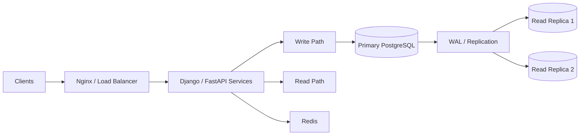
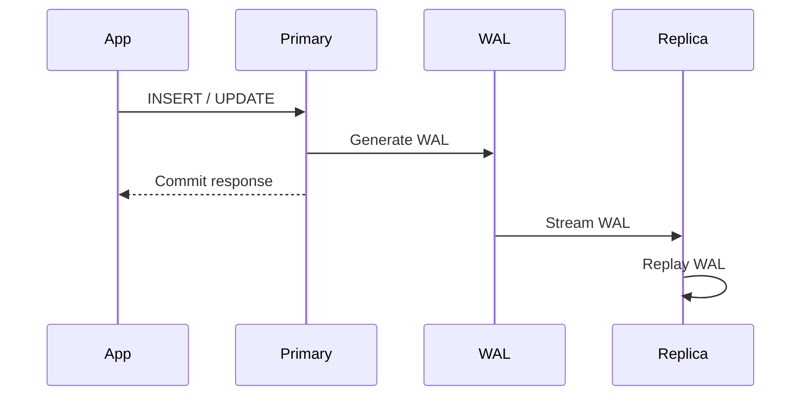
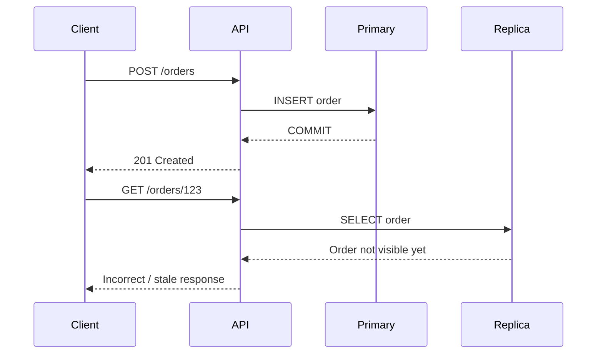
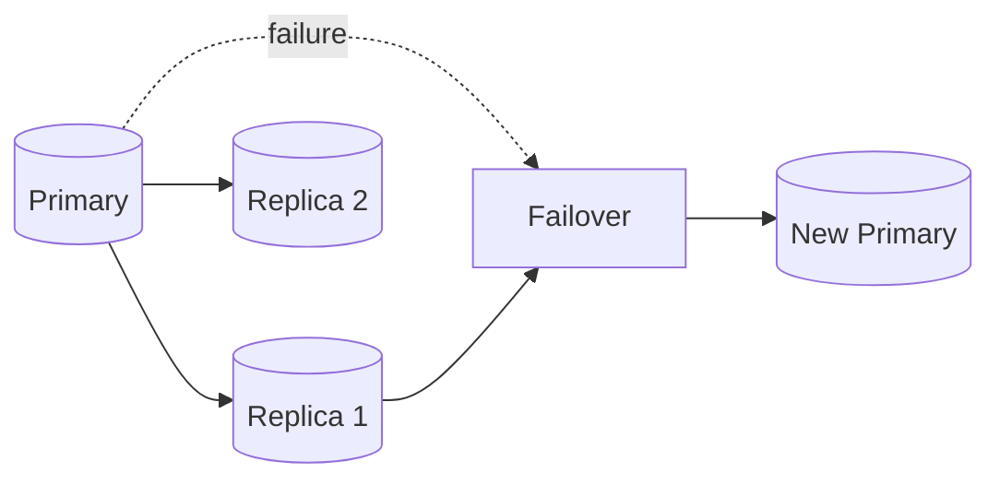
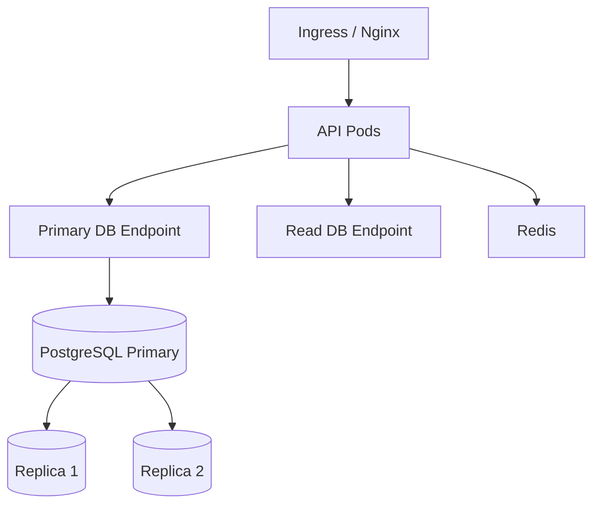

# 15- Primary Database and Read Replica Architecture

## Overview

A primary database and read replica architecture separates database responsibilities between:

- A **primary** that accepts authoritative writes and usually serves strongly consistent reads.
- One or more **read replicas** that replay changes from the primary and serve read workloads that can tolerate replication lag.

This architecture is one of the most common ways to scale a read-heavy PostgreSQL application without immediately introducing sharding or a distributed database.



The key architectural constraint is:

```text
Primary
  └── authoritative write source

Read Replicas
  └── replicated read copies
```

Read replicas increase **read capacity**, not write capacity. They also introduce an important distributed-systems problem: **replication lag and consistency**.

---

## Why Read Replicas Exist

A single PostgreSQL primary can eventually become constrained by read traffic.

For example:

```text
1000 requests/sec

700 reads
300 writes

             PostgreSQL Primary
                    │
              1000 operations
```

If the application is read-heavy, moving some reads to replicas can reduce pressure:

```text
                    ┌── Replica 1
                    │
Application ────────┼── Replica 2
                    │
                    └── Primary
                         │
                       Writes
```

The primary can focus more of its resources on:

- Writes
- Transaction processing
- Critical reads
- WAL generation

Replicas can absorb:

- List endpoints
- Search
- Reporting
- Catalog reads
- Historical queries
- Other eventually consistent reads

---

## Primary vs Read Replica

| Concern | Primary | Read Replica |
|---|---|---|
| Writes | Yes | No |
| Reads | Yes | Yes |
| Source of truth | Yes | No |
| WAL generation | Yes | No |
| WAL replay | No | Yes |
| Replication lag | N/A | Possible |
| Failover candidate | Yes | Often |
| Application role | Write / authoritative reads | Scalable reads |
| Consistency | Authoritative | Potentially stale |

A replica should generally be treated as a **copy of the primary's state at some earlier point in time**.

---

## PostgreSQL Streaming Replication

PostgreSQL commonly uses physical streaming replication for read replicas.

Conceptually:

```text
Primary PostgreSQL
      │
      ├── WAL generated
      │
      ▼
 WAL Sender
      │
      ▼
 Network
      │
      ▼
 WAL Receiver
      │
      ▼
 Replica PostgreSQL
      │
      ▼
 WAL Replay
```

The replica continuously receives WAL records and replays them locally.

The application does not replicate SQL statements such as:

```sql
UPDATE orders SET status = 'paid';
```

Instead, physical replication transfers changes represented in PostgreSQL's WAL.

---

## Replication Data Flow

A simplified flow is:



The important implication is that:

```text
Application commit
       ↓
Primary durable state
       ↓
WAL replication
       ↓
Replica replay
```

There can be a period during which the primary contains data that the replica does not yet expose to queries.

---

## Replication Lag

Replication lag is the delay between the primary's state and the state visible on a replica.

Example:

```text
10:00:00
Primary:
order.status = "paid"

Replica:
order.status = "pending"
```

If the application immediately reads from the replica, it may see stale data.

Lag can be caused by:

- High write volume
- Network latency
- Replica I/O pressure
- Replica CPU pressure
- Long-running queries
- WAL replay delays
- Replica resource saturation

Replication lag must therefore be treated as an architectural concern rather than an unusual failure.

---

## Asynchronous Replication

Most read-replica architectures use asynchronous replication.

The simplified behavior is:

```text
Primary
  │
  ├── Commit
  │
  └── Respond to application
          │
          ▼
      Replica catches up later
```

Advantages:

- Low write latency
- Good geographic flexibility
- Read scaling
- Replica can temporarily fall behind without blocking every primary transaction

Limitation:

```text
Commit on primary
≠
Immediately visible on every replica
```

This is the fundamental consistency trade-off.

---

## Synchronous Replication

PostgreSQL can also be configured for synchronous replication.

Conceptually:

```text
Application
    │
    ▼
Primary
    │
    ├── WAL
    │
    ▼
Synchronous Standby
    │
    ▼
Commit acknowledgment
```

Synchronous replication can provide stronger durability guarantees but may increase write latency and make primary availability dependent on standby behavior.

It is primarily a **durability/HA decision**, not simply a read-scaling mechanism.

---

## Read Routing

The application needs a policy for deciding where a query executes.

A common strategy is:

```text
Write
  ↓
Primary

Strongly consistent read
  ↓
Primary

Eventually consistent read
  ↓
Replica
```

Example:

```text
POST /orders
    → Primary

GET /orders/123 immediately after creation
    → Primary

GET /product-catalog
    → Replica
```

Routing should be based on **consistency requirements**, not simply on whether a query is a `SELECT`.

---

## Read-After-Write Consistency

Consider:



This is a common production bug.

The write succeeded, but the subsequent read was routed to a replica that had not replayed the corresponding WAL yet.

---

## Strategies for Read-After-Write

### Primary Read After Write

Route reads to the primary for a period after a successful write.

```text
Write
 ↓
Primary
 ↓
Mark request/session as primary-consistent
 ↓
Subsequent reads → Primary
```

This is simple but can reduce replica utilization.

### LSN-Based Routing

PostgreSQL exposes WAL positions such as LSNs.

A write can establish a required WAL position, and a replica can be considered suitable once it has replayed at least that position.

Conceptually:

```text
Write on Primary
      │
      ▼
Required LSN
      │
      ▼
Replica replay position
      │
      ├── behind → wait / use primary
      │
      └── caught up → read replica
```

This provides stronger control than an arbitrary time-based stickiness mechanism.

### Application-Level Consistency Policy

The application can classify endpoints:

```text
Strong consistency:
    Primary

Eventual consistency:
    Replica
```

This is often easier to reason about than trying to automatically classify every SQL query.

---

## Connection Configuration

Applications should maintain separate connection targets.

For example:

```text
DATABASE_PRIMARY
DATABASE_REPLICA
```

A Django deployment might conceptually use:

```python
DATABASES = {
    "default": {
        "ENGINE": "django.db.backends.postgresql",
        "NAME": "app",
        "HOST": "primary.db.internal",
        "USER": "app",
        "PASSWORD": "...",
    },
    "replica": {
        "ENGINE": "django.db.backends.postgresql",
        "NAME": "app",
        "HOST": "replica.db.internal",
        "USER": "app_readonly",
        "PASSWORD": "...",
    },
}
```

Credentials should come from a secret-management mechanism rather than being hardcoded.

---

## Django Read Routing

Django supports database routers.

A simplified example:

```python
class ReadReplicaRouter:
    def db_for_read(self, model, **hints):
        return "replica"

    def db_for_write(self, model, **hints):
        return "default"
```

This can provide a baseline routing policy.

However, blindly sending every read to replicas is unsafe.

Critical operations may need:

```python
Order.objects.using("default").get(pk=order_id)
```

The routing policy should be explicit for consistency-sensitive operations.

---

## Django Transactions and Replicas

A transaction containing writes and subsequent reads should generally use the primary.

For example:

```python
from django.db import transaction


@transaction.atomic
def create_order(customer_id: int) -> int:
    order = Order.objects.create(
        customer_id=customer_id,
    )

    OrderAudit.objects.create(
        order_id=order.id,
        event="created",
    )

    return order.id
```

Do not accidentally route a transaction's read queries to a replica when those reads depend on writes performed in the same transaction.

---

## FastAPI and SQLAlchemy

A FastAPI service can maintain separate database engines or sessions.

Conceptually:

```text
Primary Session
    └── Writes / strong reads

Replica Session
    └── Eventual-consistency reads
```

The service layer should make routing decisions based on the operation's consistency requirements.

Avoid hiding replica routing so deeply inside a generic repository that developers cannot tell whether a read is authoritative or eventually consistent.

---

## Connection Pools

Each database target generally needs its own connection pool.

```text
Application
   │
   ├── Primary Pool ──→ Primary
   │
   └── Replica Pool ──→ Replica
```

Pool sizing matters.

If an application has:

```text
20 pods
×
20 primary connections
=
400 primary connections
```

the database may become connection-saturated before CPU becomes the bottleneck.

Replica pools should also be sized according to replica capacity.

More application connections do not automatically produce more throughput.

---

## Load Balancing Across Replicas

With multiple replicas:

```text
Application
    │
    ▼
Read Router
    │
    ├── Replica 1
    ├── Replica 2
    └── Replica 3
```

Possible strategies include:

- Round robin
- Least connections
- Weighted routing
- Health-aware routing
- Lag-aware routing

A replica with high lag should generally not receive the same traffic as a healthy replica.

---

## Lag-Aware Routing

A more mature architecture considers:

```text
Replica health
+
Replica lag
+
Connection capacity
+
Query latency
```

Conceptually:

```text
Read request
    │
    ▼
Replica candidates
    │
    ├── Healthy + caught up → eligible
    ├── Healthy + lagging → lower priority
    └── Unhealthy → exclude
```

This prevents a degraded replica from becoming a latency sink.

---

## Read Replica Failures

A replica can become:

- Unreachable
- Too far behind
- CPU saturated
- I/O saturated
- Temporarily unavailable

The application should handle replica failure without making the entire service unavailable when the operation can safely fall back to the primary.

```text
Read
 │
 ▼
Replica
 │
 ├── Success → return
 │
 └── Failure
       │
       ▼
  Primary fallback
```

Fallback should be used carefully because a replica outage can suddenly redirect a large amount of traffic to the primary.

---

## Failover

A replica may also become the new primary during failure.



Failover involves more than changing a hostname.

The system must consider:

- Which replica has the latest data
- Promotion
- DNS/service endpoint changes
- Connection pool recovery
- Application retries
- In-flight transactions
- Potential data loss with asynchronous replication
- Rebuilding old primary as a replica

---

## Split-Brain Risk

A serious HA failure occurs when two database instances are simultaneously treated as writable primaries.

```text
Application A
    │
    ▼
Primary A ← writes

Application B
    │
    ▼
Primary B ← writes
```

This can create divergent state.

Production failover systems must prevent or minimize split-brain through appropriate orchestration, fencing, consensus, or managed database mechanisms.

Never implement database failover as simply:

```text
"If connection fails, make replica primary."
```

---

## Failover and Application Connections

Existing connections may still point to the failed primary.

Applications need to handle:

- Connection errors
- TCP resets
- Transaction failures
- DNS changes
- Pool invalidation
- Reconnection

A typical recovery sequence is:

```text
Database failure
      │
      ▼
Connection error
      │
      ▼
Failover
      │
      ▼
New primary endpoint
      │
      ▼
Connection pool refresh
      │
      ▼
Retry safe operation
```

Retries must be designed carefully because a connection failure does not prove whether the original transaction committed.

---

## Uncertain Commit

Consider:

```text
Application
    │
    ▼
COMMIT
    │
    ▼
Database commits
    │
    X
Network failure
    │
    ▼
Application sees timeout
```

The application cannot automatically conclude:

```text
"Transaction failed."
```

The transaction may have committed successfully.

For non-idempotent operations, blindly retrying can create duplicates.

Use:

- Idempotency keys
- Unique constraints
- Transaction identifiers
- Reconciliation
- Safe retry semantics

---

## Replica Consistency and Business Requirements

Not all reads need the same consistency.

| Operation | Typical Target |
|---|---|
| Create order | Primary |
| Payment status immediately after payment | Primary |
| Account balance | Primary |
| Product catalog | Replica |
| Public product search | Replica |
| Historical report | Replica / OLAP |
| Admin dashboard | Replica, depending on requirements |
| User profile immediately after update | Primary or consistency-aware routing |

The correct target depends on business semantics.

---

## Read Replicas and Caching

Redis and read replicas solve different problems.

```text
Redis
  → Reduce database reads

Read Replica
  → Add database read capacity
```

A typical architecture is:

```text
API
 │
 ▼
Redis
 │
 ├── Hit → Response
 │
 └── Miss
      │
      ▼
   Replica
      │
      ▼
   Cache
```

Caching should not hide serious replica-lag problems for data that requires strong consistency.

---

## Read Replicas and OLAP

A read replica can be a useful intermediate reporting architecture:

```text
Primary
   │
   ▼
Read Replica
   │
   └── Reporting
```

However, a replica is still a PostgreSQL database with the same underlying resource constraints.

Large analytical queries can overwhelm it.

For large-scale analytics, prefer:

```text
Primary
   │
   ▼
CDC / ETL
   │
   ▼
Warehouse / OLAP
```

---

## Read Replicas and Microservices

Microservices can share a database cluster while separating read traffic.

```text
Order Service ──┐
Payment Service ─┼── Primary
User Service ────┘

Read-heavy services
        │
        ▼
     Replicas
```

However, replica routing does not solve service ownership problems.

If multiple services directly modify the same tables, database consistency and ownership boundaries can become difficult to manage.

Read replicas are a scaling mechanism, not a substitute for good service boundaries.

---

## Kubernetes Architecture

A Kubernetes deployment may look like:



The database should generally be operated as a managed service or through a mature database operator rather than treating PostgreSQL as a stateless container.

Application pods should be able to recover connections after database failover.

---

## AWS Architecture

A managed AWS deployment can provide a similar architecture:

```text
                    Application
                        │
              ┌─────────┴─────────┐
              ▼                   ▼
        Writer Endpoint      Reader Endpoint
              │                   │
              ▼                   ▼
         DB Primary          Read Replicas
```

Managed database services can simplify:

- Provisioning
- Backups
- Monitoring
- Failover
- Replica creation
- Maintenance

The exact behavior depends on the selected AWS service and configuration.

The application still needs explicit consistency and retry policies.

---

## Monitoring

Read-replica architecture requires more than monitoring CPU.

### Primary

Monitor:

- CPU
- Memory
- I/O
- Connections
- Transaction rate
- WAL generation
- Query latency
- Lock contention

### Replicas

Monitor:

- CPU
- Memory
- I/O
- Connections
- Replay lag
- WAL receiver status
- WAL replay rate
- Query latency

### Application

Monitor:

- Read/write request rate
- Primary traffic
- Replica traffic
- Replica fallback rate
- Query latency
- Connection-pool utilization
- Error rate

---

## Measuring Replication Lag

PostgreSQL provides replication information through system views and functions.

On a primary, for example:

```sql
SELECT
    application_name,
    client_addr,
    state,
    sync_state,
    write_lsn,
    flush_lsn,
    replay_lsn
FROM pg_stat_replication;
```

On a replica:

```sql
SELECT
    pg_is_in_recovery(),
    pg_last_wal_receive_lsn(),
    pg_last_wal_replay_lsn(),
    now() - pg_last_xact_replay_timestamp()
        AS replay_delay;
```

The exact metric used should match the consistency property you need to measure.

A timestamp-based replay delay can be misleading when the primary has little recent write activity, so LSN positions and workload-aware monitoring are often more informative.

---

## Alerting

Useful alerts include:

```text
Replica lag > SLA
Replica disconnected
Replica disk nearly full
WAL retention growing unexpectedly
Primary connection saturation
Replica CPU saturation
Replica I/O saturation
High primary fallback rate
```

Do not alert only on absolute lag.

A lag of a few seconds may be harmless for one application and unacceptable for another.

Define thresholds from business consistency requirements.

---

## Long-Running Queries on Replicas

Long-running queries can interfere with replay behavior depending on PostgreSQL configuration and workload.

For example:

```text
Replica
 │
 ├── Large reporting query
 │
 └── WAL replay
```

The query and recovery process can compete for resources or interact through recovery conflict behavior.

For heavy reporting, a dedicated reporting/OLAP system may be preferable.

---

## Replica Lag and Kubernetes Autoscaling

A common mistake is to scale API pods based solely on request traffic:

```text
Traffic increases
    ↓
Kubernetes adds pods
    ↓
More replica connections
    ↓
Replica overloaded
    ↓
Lag increases
```

Application autoscaling must be considered alongside database capacity.

Useful signals include:

- Request rate
- Application latency
- Connection utilization
- Database CPU
- Replica lag

Horizontal application scaling can make a database bottleneck worse if database capacity is not considered.

---

## Security

Read replicas still contain the application's data.

Protect them with:

- TLS
- Network isolation
- Security groups
- Private subnets
- Least-privilege credentials
- Read-only database roles where appropriate
- Auditing
- Encryption at rest

A replica should not be considered less sensitive simply because applications cannot write to it.

---

## Read-Only Roles

A dedicated replica credential can reduce accidental writes.

For example:

```sql
CREATE ROLE app_readonly LOGIN PASSWORD 'managed-secret';

GRANT CONNECT ON DATABASE app TO app_readonly;
GRANT USAGE ON SCHEMA public TO app_readonly;
GRANT SELECT ON ALL TABLES IN SCHEMA public TO app_readonly;
```

In production, credentials should be managed through a secret-management system, and privileges should be scoped according to actual requirements.

Read-only database access is a defense-in-depth mechanism, not a replacement for application authorization.

---

## Cost Considerations

Each replica adds:

- Compute cost
- Storage cost
- I/O cost
- Monitoring cost
- Backup considerations
- Operational complexity

Do not add replicas simply because they are available.

A useful progression is:

```text
Optimize queries
      ↓
Optimize indexes
      ↓
Add caching
      ↓
Tune connections
      ↓
Add read replica
      ↓
Add additional replicas
```

If replicas remain saturated, the workload may require a different architecture.

---

## High Availability vs Read Scaling

A critical distinction:

```text
Read replica
     ≠
Only a read-scaling component
```

A replica can serve two architectural purposes:

### Read Scaling

```text
Primary
   │
   ├── Replica 1 → Reads
   └── Replica 2 → Reads
```

### High Availability

```text
Primary
   │
   └── Standby
          │
          └── Promotion after failure
```

A replica optimized for analytical queries may not be the ideal failover target.

HA and read-scaling requirements should be designed separately even when they use the same underlying replication mechanism.

---

## Disaster Recovery

Read replicas are not a replacement for backups.

A replica can replicate:

- Accidental deletes
- Application bugs
- Corrupted logical state

For example:

```text
Application bug
     │
     ▼
DELETE millions of rows
     │
     ▼
Primary
     │
     ▼
Replica
     │
     ▼
Deletion replicated
```

Maintain independent backups and point-in-time recovery.

For disaster recovery, also consider replicas in another availability zone or region where appropriate.

---

## Geographic Replicas

Read replicas can support geographically distributed applications.

```text
                   Primary
                      │
             ┌────────┴────────┐
             ▼                 ▼
        Replica Region A   Replica Region B
             │                 │
          Users A           Users B
```

Benefits:

- Lower read latency
- Regional resilience
- Disaster recovery options

Limitations:

- Network latency
- Replication lag
- More complex failover
- Cross-region data transfer costs

Do not route consistency-sensitive reads to a distant asynchronous replica simply to optimize latency.

---

## Production Read Routing Strategy

A practical policy might be:

```text
                Query
                  │
          Is it a write?
             /        \
           Yes         No
           │            │
        Primary     Needs strong
                    consistency?
                    /       \
                  Yes        No
                  │           │
               Primary      Replica
                              │
                        Healthy + lag OK?
                          /          \
                        Yes           No
                        │              │
                     Replica        Primary
```

This is much safer than:

```text
SELECT → Replica
INSERT → Primary
UPDATE → Primary
```

because SQL operation type alone does not determine consistency requirements.

---

## Production Best Practices

- Treat the primary as the authoritative source of transactional state.
- Route writes exclusively to the primary.
- Route only consistency-tolerant reads to replicas.
- Define a measurable replication-lag SLA.
- Monitor lag continuously.
- Make replica routing health-aware.
- Have controlled primary fallback behavior.
- Keep primary and replica connection pools separate.
- Test failover with realistic application traffic.
- Make retry behavior idempotent.
- Monitor connection saturation as well as CPU.
- Keep backups independent of replicas.
- Use replicas for read scaling, not as a substitute for analytical architecture.
- Document which APIs require strong consistency.
- Test read-after-write behavior explicitly.

---

## Common Mistakes

### Sending Every SELECT to a Replica

A `SELECT` may depend on a previous write.

**Better:** route according to consistency requirements.

### Assuming Replication Is Instantaneous

Asynchronous replication can lag.

**Better:** monitor lag and design for stale reads.

### Using Time-Based Sleep to Wait for Replication

For example:

```python
time.sleep(1)
read_from_replica()
```

This is unreliable because replication latency varies.

**Better:** use a consistency-aware strategy such as primary reads or LSN-aware routing.

### Treating a Replica as a Backup

Replicas reproduce changes, including destructive changes.

**Better:** maintain independent backups and point-in-time recovery.

### Adding Too Many Replicas

Replicas consume resources and operational budget.

**Better:** measure read pressure and add capacity based on workload.

### Ignoring Replica Fallback Traffic

If one replica fails and all traffic moves to the primary, the primary can become overloaded.

**Better:** capacity-plan for degraded modes.

### Retrying Failed Writes Blindly

A network timeout does not prove that the original transaction failed.

**Better:** use idempotency and reconciliation.

### Using a Replica for Critical Financial State

Stale account balances or payment status can produce incorrect business decisions.

**Better:** use authoritative primary reads for consistency-sensitive state.

### Running Heavy Analytics on a Read Replica

A replica can become overloaded and develop significant lag.

**Better:** use a dedicated analytical system when workload scale requires it.

### Treating Kubernetes Scaling as Database Scaling

Adding application pods can increase database connections and query load.

**Better:** coordinate application and database capacity planning.

### Failing Over Without Fencing

Two writable primaries can create split-brain.

**Better:** use a mature HA mechanism with controlled promotion and fencing.

### Assuming Read Replicas Solve Write Scaling

Replication copies writes; it does not distribute writes.

**Better:** address write bottlenecks through query optimization, batching, partitioning, data-model changes, or sharding when genuinely required.

---

## Interview Traps

### What is a read replica?

A read replica is a database instance that continuously receives and replays changes from a primary database and is typically used for read scaling and, depending on the architecture, high availability.

### Does a read replica accept writes?

A normal PostgreSQL physical read replica is read-only while it is in recovery. It is not an independent writable database.

### Why can a read replica return stale data?

Because replication and WAL replay can happen after the primary has already committed a transaction.

### What is replication lag?

It is the difference between the primary's current state and the state that has been received or replayed by a replica.

### How do you solve read-after-write consistency?

Possible approaches include routing the subsequent read to the primary, using session/request stickiness, or using an LSN-aware mechanism to ensure the replica has replayed the required WAL position.

### Why not just sleep for one second after a write?

Replication latency is variable. A fixed delay can be unnecessarily slow when replicas are caught up and insufficient when they are not.

### Does synchronous replication eliminate all consistency problems?

No. It can strengthen durability/replication guarantees, but application-level read routing and transaction semantics still need to be designed correctly.

### Does a read replica improve write throughput?

Not directly. The primary still processes the writes and generates WAL that replicas replay.

### Can a read replica be used for HA?

Yes. A replica can be promoted during primary failure, but promotion, fencing, endpoint management, connection recovery, and application retry semantics must all be designed.

### Why aren't replicas backups?

Because destructive or incorrect changes on the primary are also replicated.

### What happens if a replica becomes unavailable?

Traffic should be rerouted according to the application's consistency policy, potentially to another replica or the primary. The resulting load on the remaining database infrastructure must be capacity-planned.

### How should multiple replicas be load-balanced?

Use health-aware and, where appropriate, lag-aware routing rather than blindly distributing requests equally.

### Can Django automatically send reads to replicas?

Django supports multiple databases and database routers, but application architecture must still determine which reads are safe to execute against eventually consistent replicas.

### Why can more read replicas sometimes make the system more expensive without solving the problem?

The bottleneck may be query inefficiency, application connection pressure, a hot primary, or an unsuitable workload. Replicas only help when read capacity is the actual limiting factor.

### When should you use a dedicated OLAP system instead of a read replica?

When analytical queries become large, expensive, highly concurrent, or operationally disruptive enough that even an isolated replica cannot provide the required performance.

### What is the biggest design mistake with read replicas?

Treating replication as transparent. Replicas introduce an explicit consistency boundary, so the application must understand which reads require authoritative data and which can tolerate stale results.

## Key Takeaways

- A primary database is the authoritative transactional source, while read replicas primarily provide additional read capacity and can also serve as HA candidates.
- Asynchronous replication introduces lag, so read routing must be based on consistency requirements rather than simply routing every `SELECT` to a replica.
- Production systems should monitor replica lag, health, connection utilization, query latency, and fallback traffic, with controlled behavior when replicas become unhealthy.
- Read replicas are not backups and do not solve write scaling; independent backups, point-in-time recovery, query optimization, and appropriate scaling strategies remain necessary.
- A mature architecture treats primary, replicas, caching, and OLAP as separate mechanisms with explicit consistency, reliability, performance, and operational responsibilities.