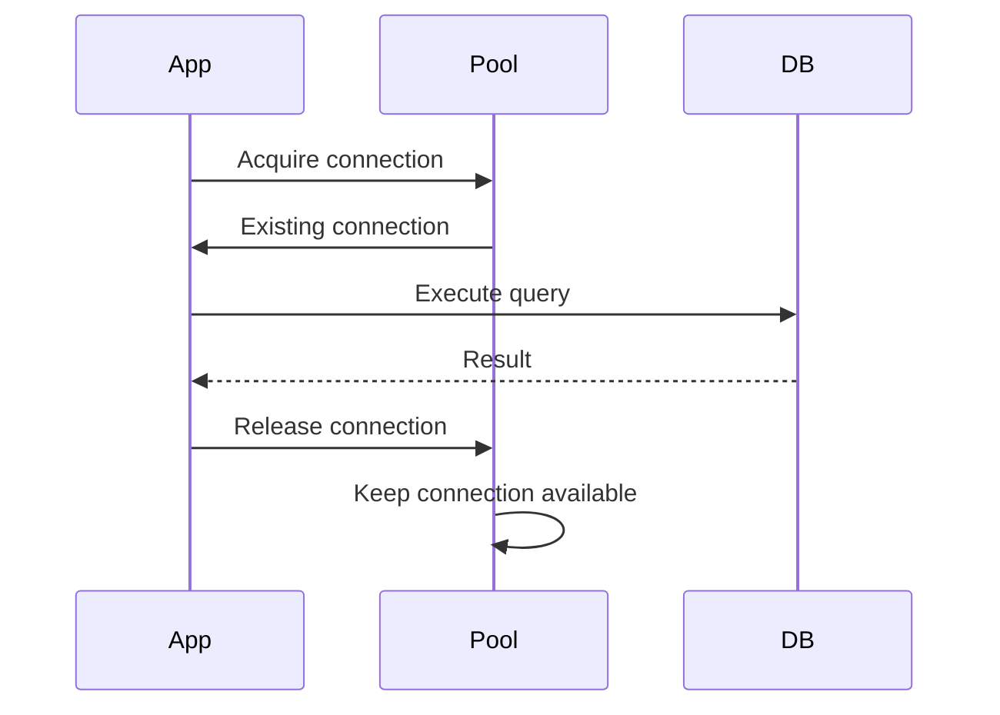
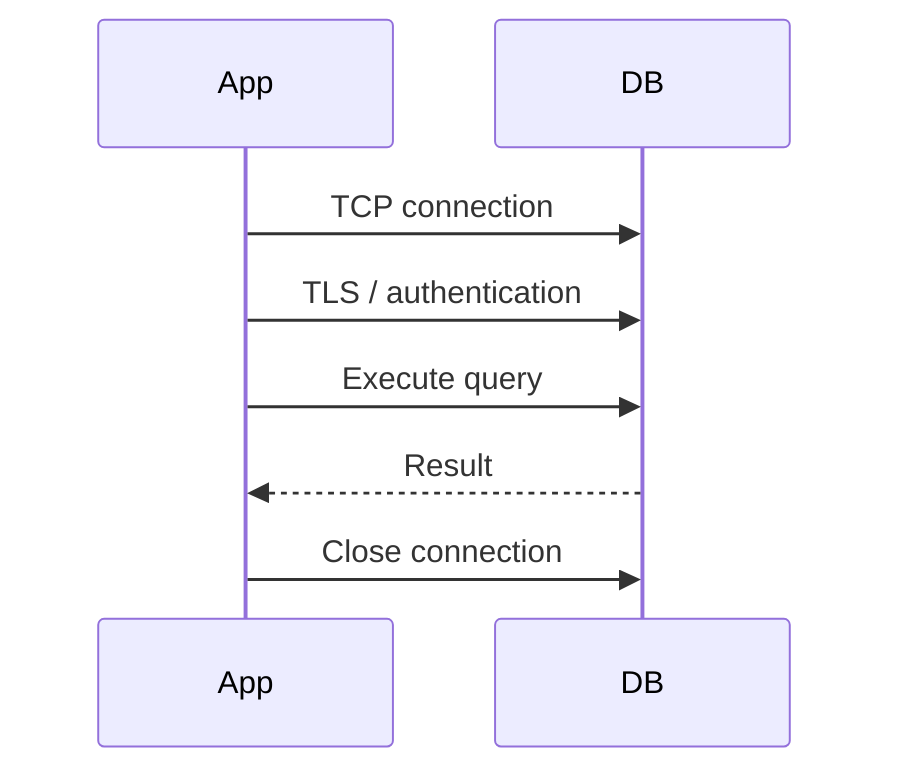
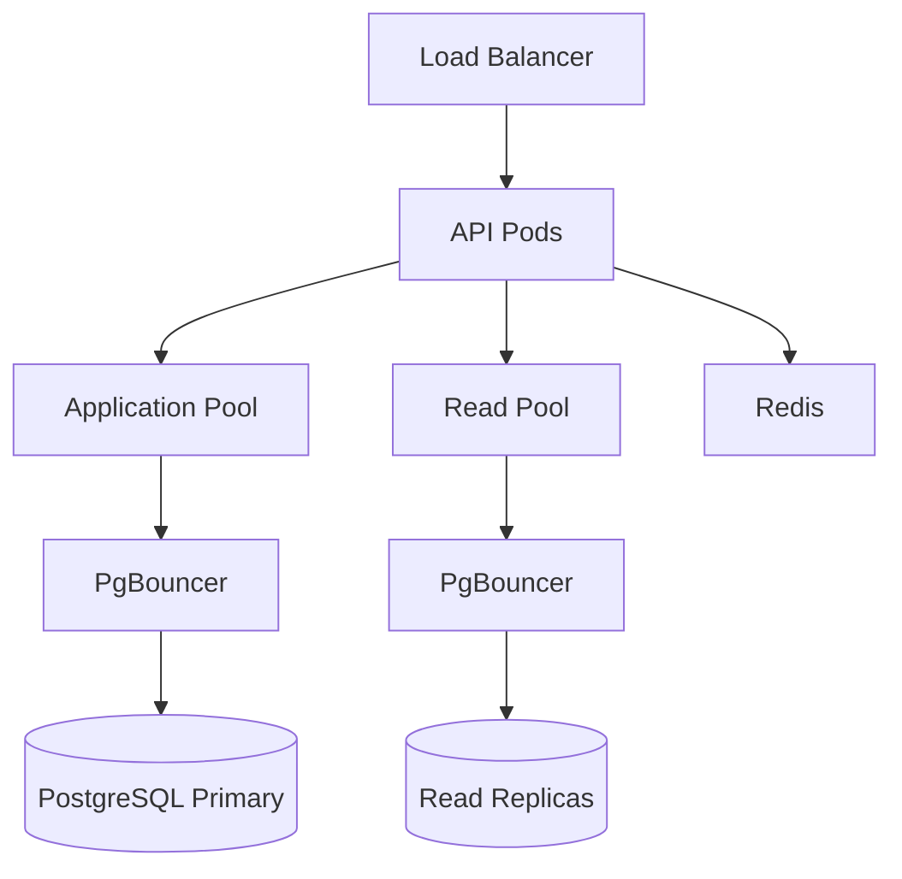

# 16- Connection Pooling Architecture

## Overview

Connection pooling is the practice of maintaining a reusable set of database connections so application requests do not repeatedly establish and tear down database connections.

In a backend service, the expensive lifecycle is typically:

```text
Request
   │
   ▼
Create TCP connection
   │
   ▼
TLS handshake
   │
   ▼
Database authentication
   │
   ▼
Session initialization
   │
   ▼
Execute query
   │
   ▼
Close connection
```

Without pooling, high request concurrency can create unnecessary connection overhead.

With pooling:

```text
Application
     │
     ▼
Connection Pool
     │
     ├── Existing connection ──→ PostgreSQL
     ├── Existing connection ──→ PostgreSQL
     └── Existing connection ──→ PostgreSQL
```

The application borrows a connection, uses it, and returns it to the pool.

Connection pooling primarily improves **connection reuse and database resource management**. It does not make individual SQL queries faster.

---

## Why Connection Pooling Exists

Creating a database connection involves significantly more work than executing a simple query.

A simplified connection lifecycle is:



Without pooling:



At high request rates, repeatedly establishing connections can consume CPU, network resources, and database backend processes.

---

## What a Connection Pool Contains

A pool generally manages:

```text
Pool
├── Idle connections
├── In-use connections
├── Maximum connection limit
├── Minimum idle connections
├── Connection timeout
├── Idle timeout
├── Lifetime / recycling policy
└── Health / validation behavior
```

Conceptually:

```text
                    Connection Pool
                 ┌───────────────────┐
Request A ──────→│ Connection 1      │
Request B ──────→│ Connection 2      │
Request C ──────→│ Connection 3      │
                 │ Connection 4 idle │
                 │ Connection 5 idle │
                 └───────────────────┘
                         │
                         ▼
                    PostgreSQL
```

The exact implementation depends on the driver, framework, pool library, and whether an external pooler such as PgBouncer is used.

---

## Connection Lifecycle

A typical pooled request follows:

```text
HTTP Request
    │
    ▼
Application Worker
    │
    ▼
Acquire connection
    │
    ├── Available → use immediately
    │
    └── Pool exhausted → wait / timeout
    │
    ▼
Execute SQL
    │
    ▼
Commit / rollback
    │
    ▼
Return connection
    │
    ▼
Connection becomes idle
```

The connection is returned to the pool, not necessarily closed.

---

## Pool States

A useful mental model is:

```text
                ┌───────────────┐
                │     Idle      │
                └───────┬───────┘
                        │ acquire
                        ▼
                ┌───────────────┐
                │    In Use     │
                └───────┬───────┘
                        │ release
                        ▼
                ┌───────────────┐
                │     Idle      │
                └───────────────┘

                In Use
                   │
                   │ invalid / expired
                   ▼
                 Closed
                   │
                   ▼
             New connection
```

A robust pool removes broken or expired connections and replaces them according to its configuration.

---

## Pool Size

Pool size determines how many database connections a process can use concurrently.

For example:

```text
Application:
10 pods

Pool per pod:
20 connections

Potential database connections:
10 × 20 = 200
```

This calculation is critical.

A database does not see:

```text
10 Kubernetes pods
```

It may see:

```text
200 PostgreSQL client connections
```

if every pool reaches its maximum.

---

## Why Bigger Pools Are Not Always Better

A common misconception is:

```text
More connections
      ↓
More throughput
```

The actual relationship is closer to:

```text
More connections
      ↓
More concurrent database work
      ↓
Higher CPU / memory / I/O / lock pressure
      ↓
Potentially lower throughput
```

If PostgreSQL can efficiently execute only a certain amount of concurrent work, creating hundreds of additional sessions can increase contention rather than capacity.

Connection pools should therefore be sized based on workload and database capacity, not application thread count alone.

---

## Connection Pool Capacity Planning

Consider:

```text
20 application pods
10 connections/pod
```

Potential maximum:

```text
20 × 10 = 200 connections
```

If PostgreSQL has a connection limit of 150, the architecture is already unsafe.

A production design should account for:

```text
Application pools
+
Background workers
+
Migration jobs
+
Administrative connections
+
Monitoring
+
Failover / headroom
```

Do not allocate 100% of the database's connection capacity to application pools.

---

## Queueing When the Pool Is Exhausted

If all connections are busy:

```text
Request
   │
   ▼
Acquire connection
   │
   ▼
Pool exhausted
   │
   ▼
Wait
   │
   ├── Connection released → continue
   │
   └── Timeout → fail request
```

This waiting behavior is important.

A pool can act as a form of **backpressure**.

Instead of allowing unlimited database concurrency, it limits the number of simultaneous database operations.

---

## Pool Timeout

A pool acquisition timeout determines how long a request waits for a connection.

Example:

```text
Pool size = 20
20 connections busy

Request 21
    │
    ▼
Wait for connection
    │
    ├── Connection available → proceed
    │
    └── Timeout → return failure
```

A finite timeout is generally safer than waiting indefinitely.

Otherwise, a database slowdown can cause application requests to accumulate until application workers, threads, or event-loop resources are exhausted.

---

## Connection Timeout vs Query Timeout

These are different.

| Timeout | Protects Against |
|---|---|
| Connection timeout | Unable to establish database connection |
| Pool acquisition timeout | Waiting too long for an available pooled connection |
| Statement/query timeout | SQL execution taking too long |
| Transaction timeout | Transaction remaining open too long |
| Idle timeout | Unused connection remaining in pool |
| Connection lifetime | Connections becoming excessively long-lived |

For production systems, these controls should be designed together.

---

## Connection Pool vs Database Connection Limit

PostgreSQL has a server-side connection limit.

The application pool has a client-side limit.

```text
Application
 ├── Pool A: 10
 ├── Pool B: 10
 └── Pool C: 10
        │
        ▼
PostgreSQL
 max_connections = 100
```

The application must account for all clients.

A database connection limit is not equivalent to useful query concurrency.

---

## PostgreSQL Process Model

PostgreSQL traditionally uses a server process architecture where client sessions are represented by backend processes.

Therefore:

```text
100 PostgreSQL connections
```

are not equivalent to:

```text
100 lightweight application threads
```

Each connection consumes database resources.

Memory usage, session state, background work, and query concurrency all contribute to the cost.

This is one reason connection control is important for PostgreSQL.

---

## Application-Level Pooling

Many database drivers and frameworks support client-side connection pooling.

The architecture is:

```text
Application Process
        │
        ▼
Application Pool
        │
        ▼
PostgreSQL
```

Advantages:

- Simple deployment
- Low connection acquisition latency
- Reuses connections within a process
- No additional infrastructure

Limitations:

- Each application process maintains its own pool
- Kubernetes scaling can multiply connections
- Multiple services can independently consume database connections
- Pool sizing becomes a distributed capacity-planning problem

---

## External Pooling

An external pooler such as PgBouncer can sit between applications and PostgreSQL.

```text
Application Pods
 ├── Pod 1 ─┐
 ├── Pod 2 ─┤
 ├── Pod 3 ─┼──→ PgBouncer ──→ PostgreSQL
 └── Pod N ─┘
```

This allows many client-side connections to share a smaller number of PostgreSQL server connections, depending on the pooling mode.

---

## PgBouncer Pooling Modes

PgBouncer supports different pooling models.

| Mode | Connection Lifetime | Session State Compatibility |
|---|---|---|
| Session pooling | Client keeps server connection for session | Highest |
| Transaction pooling | Server connection assigned per transaction | Lower |
| Statement pooling | Server connection assigned per statement | Lowest |

Transaction pooling is often useful for high connection churn, but applications must not depend on session state that persists across transactions.

---

## Session Pooling

In session pooling:

```text
Client
  │
  ▼
PgBouncer
  │
  └── PostgreSQL connection held for client session
```

Advantages:

- Strong compatibility with session-level behavior
- Easier application semantics

Limitations:

- Less efficient connection sharing
- Long-lived clients can occupy server connections

---

## Transaction Pooling

In transaction pooling:

```text
Client A
   │
   ├── BEGIN → Server Connection 1
   ├── Queries
   └── COMMIT
          │
          ▼
Connection returned to pool

Client B
   │
   └── Can use Server Connection 1
```

This can dramatically improve server-connection utilization.

However, session-specific state can become problematic.

Examples include:

- Temporary tables
- Session variables
- Session-level prepared statements
- Session-specific advisory locks
- Certain driver features

Applications using transaction pooling must be compatible with this behavior.

---

## Application Pool vs PgBouncer

| Feature | Application Pool | PgBouncer |
|---|---|---|
| Location | Application process | Separate service/process |
| Connection reuse | Per process | Across clients |
| Kubernetes scaling impact | High | Lower server connection pressure |
| Operational complexity | Low | Moderate |
| Transaction pooling | Depends on library | Supported |
| Session semantics | Usually straightforward | Depends on pooling mode |
| Failure domain | Application | Additional infrastructure |
| Best use | Most applications | High connection counts / many clients |

These mechanisms can also be used together, but unnecessary layers increase complexity.

---

## Pooling in Django

Django's PostgreSQL connection behavior is influenced by its database configuration.

A common production configuration controls persistent connections using:

```python
DATABASES = {
    "default": {
        "ENGINE": "django.db.backends.postgresql",
        "NAME": "app",
        "USER": "app",
        "PASSWORD": "...",
        "HOST": "postgres.internal",
        "PORT": "5432",
        "CONN_MAX_AGE": 60,
    }
}
```

`CONN_MAX_AGE` controls how long Django may reuse persistent database connections.

This is not the same thing as a full general-purpose connection pool with configurable maximum concurrent connections.

For deployments requiring explicit pooling across many application processes, an external pooler such as PgBouncer may be more appropriate.

---

## Django and Persistent Connections

With persistent connections:

```text
Request 1
   │
   ▼
Existing DB connection
   │
   ▼
Request completes
   │
   ▼
Connection remains reusable
```

Without persistence:

```text
Request
   │
   ▼
Open connection
   │
   ▼
Query
   │
   ▼
Close connection
```

Persistent connections reduce connection setup overhead but consume database connections for longer.

The correct configuration depends on:

- Traffic pattern
- Number of workers
- Database capacity
- Deployment model
- Connection lifetime

---

## FastAPI and SQLAlchemy

SQLAlchemy provides connection pooling through its `Engine`.

A typical configuration is:

```python
from sqlalchemy import create_engine

engine = create_engine(
    "postgresql+psycopg://user:password@db:5432/app",
    pool_size=10,
    max_overflow=5,
    pool_timeout=10,
    pool_recycle=1800,
    pool_pre_ping=True,
)
```

Important parameters include:

| Parameter | Purpose |
|---|---|
| `pool_size` | Persistent pooled connections |
| `max_overflow` | Temporary connections beyond pool size |
| `pool_timeout` | Wait time for a connection |
| `pool_recycle` | Recycle older connections |
| `pool_pre_ping` | Validate connections before use |

The exact settings should be benchmarked against workload and database capacity.

---

## Pooling and Async Applications

Async applications do not eliminate database connection constraints.

For example:

```text
FastAPI
 ├── Request 1 ─┐
 ├── Request 2 ─┤
 ├── Request 3 ─┼── Async DB Pool
 ├── Request 4 ─┤
 └── Request N ─┘
```

An async server can handle many concurrent requests while having only a limited number of database connections.

This is often desirable.

```text
1000 concurrent HTTP requests
        │
        ▼
20 database connections
```

Requests that require database access are bounded by pool capacity.

---

## Async Pooling and Event Loops

A critical rule is:

> Asynchronous application concurrency and database concurrency are separate dimensions.

For example:

```text
10,000 concurrent HTTP requests
        │
        ▼
50 DB connections
        │
        ▼
PostgreSQL
```

The application can handle many waiting requests without opening 10,000 database connections.

However, if each request performs long-running SQL, the 50 connections may become fully occupied.

The bottleneck then moves to query execution and database capacity.

---

## Connection Pooling with Celery

Celery workers can create their own database connections.

Consider:

```text
10 Celery workers
×
5 DB connections
=
50 potential connections
```

These connections are in addition to API connections.

A common production mistake is sizing the API pool correctly while ignoring worker pools.

Capacity planning must include:

```text
API
+
Celery
+
Management commands
+
Migrations
+
Scheduled jobs
```

---

## Connection Leaks

A connection leak occurs when application code acquires a connection and fails to return it appropriately.

Symptoms include:

```text
Pool usage → 100%
        ↓
Requests wait
        ↓
Pool timeout
        ↓
Application errors
```

Common causes include:

- Incorrect session lifecycle
- Exceptions bypassing cleanup
- Manually managed connections
- Long-running transactions
- Connections held by background tasks
- Improper framework integration

Use context managers and framework-managed lifecycle mechanisms where appropriate.

---

## Transaction Leaks

A connection can be returned to a pool while its transaction state is not properly reset only if the pooling/framework integration is incorrect.

The dangerous pattern is:

```text
Acquire
  ↓
BEGIN
  ↓
UPDATE
  ↓
Exception
  ↓
Connection not rolled back
  ↓
Connection reused incorrectly
```

Always ensure transactions are committed or rolled back before a connection becomes available for unrelated work.

Framework-managed transaction contexts are strongly preferred.

---

## Long-Lived Connections

Persistent connections are not automatically bad.

They become problematic when:

- Database capacity is limited
- Many application workers exist
- Connections remain idle for long periods
- Network infrastructure drops idle sessions
- Database failovers occur
- Pool size is oversized

A production strategy may include connection recycling and health checks.

---

## Stale Connections

Long-lived connections can become invalid because of:

- Database restart
- Failover
- Network interruption
- Load balancer behavior
- Firewall idle timeouts
- Infrastructure maintenance

A pool should detect and discard broken connections.

Health-check mechanisms such as SQLAlchemy's `pool_pre_ping` can help.

Framework-specific behavior should also be understood during failover.

---

## Connection Lifetime

Long-lived connections can accumulate stale session state or encounter infrastructure-level idle timeouts.

Recycling connections periodically can reduce this risk.

Conceptually:

```text
Connection created
      │
      ▼
Used repeatedly
      │
      ▼
Maximum lifetime reached
      │
      ▼
Graceful close
      │
      ▼
Replacement connection
```

Connection lifetime should not be so aggressive that the pool constantly creates new connections.

---

## Connection Initialization

Connections may require session initialization.

Examples include:

```text
search_path
timezone
statement timeout
application_name
role
```

For example:

```sql
SET statement_timeout = '5s';
```

If session-level settings are used, understand how they interact with pooling.

This is particularly important with transaction-level poolers because a server connection may be reused by another client after the transaction ends.

---

## Session State

Potential session state includes:

- Temporary tables
- Prepared statements
- Session variables
- `SET` configuration
- Advisory locks
- Current role
- Search path

With session pooling:

```text
Client A
  ↓
Server connection
  ↓
Session state persists
```

With transaction pooling:

```text
Transaction A
  ↓
Server connection
  ↓
Released

Transaction B
  ↓
Same server connection
```

Applications must not assume session state belongs exclusively to one client when using transaction pooling.

---

## Prepared Statements and Pooling

Prepared statements can be useful for repeated queries, but pooling mode matters.

With session pooling:

```text
Prepare
  ↓
Connection retained
  ↓
Execute
```

With transaction pooling, the next transaction may receive a different server connection.

Therefore, session-level prepared-statement behavior must be compatible with the pooler and driver configuration.

Modern drivers and poolers have different capabilities and compatibility constraints, so this should be validated rather than assumed.

---

## Connection Pooling and Read Replicas

Primary and replica connections should generally have separate pools.

```text
Application
   │
   ├── Write Pool ──→ Primary
   │
   └── Read Pool ───→ Replica
```

This provides isolation.

If replica connections become saturated:

```text
Read Pool
   │
   ▼
Replica saturation
```

the primary pool remains independently protected.

However, fallback routing from replica to primary must be carefully controlled.

---

## Pooling with Multiple Replicas

A service may have:

```text
Write Pool
    │
    ▼
Primary

Read Pool
    │
    ├── Replica 1
    ├── Replica 2
    └── Replica 3
```

A routing layer can distribute reads.

Pool capacity must be considered per target.

For example:

```text
3 replicas
10 connections each
=
30 possible replica connections
```

Do not accidentally create:

```text
10 connections ×
20 application pods ×
3 replicas
=
600 connections
```

without verifying database capacity.

---

## Connection Pooling and Kubernetes

Kubernetes makes pool sizing particularly important.

Suppose:

```text
Current:
10 pods
10 connections/pod
= 100 connections

Autoscaled:
50 pods
10 connections/pod
= 500 connections
```

The application may scale successfully while PostgreSQL becomes unavailable because of connection saturation.

Database-aware autoscaling should therefore consider:

- Pool size
- Pod count
- Worker count
- Database connection limit
- Database CPU
- Query latency

---

## Connection Pooling Architecture in Kubernetes

A common architecture is:



Whether both application-level pooling and PgBouncer are needed depends on the workload.

For smaller systems, a direct application pool may be simpler.

---

## Connection Pooling and Nginx

Nginx controls HTTP traffic; it does not normally pool PostgreSQL connections.

The layers are different:

```text
Client
  │
  ▼
Nginx
  │
  ▼
Application
  │
  ▼
DB Pool
  │
  ▼
PostgreSQL
```

Nginx connection reuse and database connection pooling solve different resource-management problems.

---

## Connection Pooling and gRPC

gRPC channels and database connections are different resources.

A service may have:

```text
gRPC connection/channel
        │
        ▼
Service process
        │
        ▼
Database connection pool
```

One long-lived gRPC connection can generate many concurrent database operations.

Therefore, gRPC connection count cannot be used to estimate database connection requirements.

---

## Connection Pooling and Microservices

Each microservice may maintain its own pool:

```text
Order Service ── Pool ──┐
Payment Service ─ Pool ─┼── PostgreSQL
User Service ─── Pool ──┤
Search Service ─ Pool ──┘
```

The database sees the aggregate:

```text
All service pools
+
All replicas
+
All workers
```

This is a common source of unexpected connection exhaustion.

A centralized connection pooler can reduce server-side connection pressure.

---

## Connection Pooling and Serverless

Serverless workloads create a special challenge.

```text
Traffic spike
    │
    ▼
Many short-lived instances
    │
    ▼
Many database connections
    │
    ▼
Connection exhaustion
```

Traditional per-process pools may not work well when the number of application instances can scale rapidly.

Common approaches include:

- Managed connection pooling
- PgBouncer
- Proxy-based database connectivity
- Serverless-aware database services

The exact solution depends on the platform and workload.

---

## Pool Exhaustion vs Database Exhaustion

These are different failure modes.

### Pool Exhaustion

```text
Application
   │
   ▼
Pool max reached
   │
   ▼
Requests waiting
```

The database may still have available capacity.

### Database Exhaustion

```text
Application
   │
   ▼
Pool
   │
   ▼
PostgreSQL overloaded
```

The pool may be functioning correctly, but the database cannot efficiently process additional work.

Monitoring must distinguish these cases.

---

## Pooling and Backpressure

Connection pools can provide useful backpressure.

Without a pool:

```text
Traffic spike
    ↓
Unlimited connection attempts
    ↓
Database overload
    ↓
System-wide failure
```

With bounded pooling:

```text
Traffic spike
    ↓
Pool reaches capacity
    ↓
Requests queue briefly
    ↓
Timeout / controlled failure
```

This can prevent the database from becoming completely overwhelmed.

However, application-level queues must also be bounded. An unlimited request queue simply moves the overload elsewhere.

---

## Pooling and Query Latency

Suppose:

```text
Pool size = 20

Average query = 10 ms
```

The database can process substantial concurrency.

Now:

```text
Average query = 2 seconds
```

The same pool can become saturated quickly.

Therefore:

```text
Pool capacity
≈
Concurrent DB work
```

and concurrent database work depends heavily on query duration.

Improving SQL performance can increase effective pool throughput without increasing connection count.

---

## Little's Law

A useful capacity-planning relationship is:

```text
Concurrency ≈ Throughput × Latency
```

For example:

```text
500 database operations/sec
×
0.020 sec average latency
=
10 concurrent operations
```

A pool of 10 may theoretically support this average concurrency, but production systems require headroom for:

- Latency variation
- Bursts
- Slow queries
- Lock waits
- Failures
- Background work

Do not size pools directly from averages without considering tail latency.

---

## Tail Latency

Suppose:

```text
Average query latency = 20 ms
p99 latency           = 500 ms
```

During a burst, many connections can remain occupied much longer than the average suggests.

This can cause:

```text
p99 query latency
      ↓
Connections occupied longer
      ↓
Pool saturation
      ↓
Request queueing
      ↓
Higher API latency
```

This feedback loop is why p95/p99 database latency should be monitored alongside pool utilization.

---

## Connection Pool Metrics

Important metrics include:

### Pool

- Active connections
- Idle connections
- Maximum connections
- Acquisition wait time
- Acquisition timeout count
- Connection creation rate
- Connection destruction rate

### Database

- Active sessions
- Idle sessions
- CPU
- Memory
- I/O
- Lock waits
- Query latency

### Application

- Request latency
- Request queueing
- Database wait time
- Timeout rate
- Error rate

---

## PostgreSQL Connection Monitoring

A useful query is:

```sql
SELECT
    state,
    COUNT(*) AS connections
FROM pg_stat_activity
GROUP BY state
ORDER BY connections DESC;
```

To inspect sessions:

```sql
SELECT
    pid,
    usename,
    application_name,
    client_addr,
    state,
    wait_event_type,
    wait_event,
    query_start
FROM pg_stat_activity
ORDER BY query_start;
```

This helps distinguish:

```text
Active work
Idle connections
Waiting sessions
Long-running queries
```

---

## Idle Connections

Idle connections are not necessarily a problem.

For example:

```text
Pool size = 20
Active = 5
Idle = 15
```

This can be perfectly healthy if the application expects bursts.

The problem is excessive idle connections consuming database capacity that other services need.

Pool sizing should therefore account for aggregate idle capacity.

---

## Idle in Transaction

This state is more dangerous.

```text
BEGIN
  ↓
Query
  ↓
Application stops doing work
  ↓
Transaction remains open
```

PostgreSQL can show:

```text
idle in transaction
```

Long-lived idle transactions can:

- Hold locks
- Delay vacuum cleanup
- Increase bloat
- Keep snapshots alive

Monitor and terminate the underlying application behavior rather than merely increasing the pool size.

---

## Transaction Scope and Pooling

A transaction should generally be:

```text
Acquire connection
      │
      ▼
BEGIN
      │
      ▼
Required SQL
      │
      ▼
COMMIT / ROLLBACK
      │
      ▼
Release connection
```

Avoid:

```text
Acquire
  ↓
BEGIN
  ↓
HTTP call
  ↓
Wait
  ↓
External service
  ↓
COMMIT
```

Long transactions occupy pooled connections and potentially locks for the entire duration.

---

## Security Considerations

Connection pooling does not remove the need for database security.

Use:

- TLS
- Strong authentication
- Secret management
- Least-privilege roles
- Private networking
- Network access controls
- Read-only roles for read replicas
- Auditing

Connection strings should not be hardcoded into application source code.

For example:

```text
DATABASE_URL
```

should normally be supplied through an appropriate secret-management mechanism.

---

## Reliability Considerations

A production pool should handle:

- Database restart
- Failover
- Network interruption
- Broken connections
- Timeouts
- Authentication failures
- Pool exhaustion

The desired behavior is:

```text
Database failure
      │
      ▼
Connections become invalid
      │
      ▼
Pool discards invalid connections
      │
      ▼
Database becomes available
      │
      ▼
Pool establishes replacements
```

Recovery behavior should be tested rather than assumed.

---

## High Availability

During database failover:

```text
Primary
   X
   │
   ▼
Failover
   │
   ▼
New Primary
```

Existing connections to the old primary may become invalid.

The application must recover through:

- Connection invalidation
- DNS/service endpoint refresh
- Pool recycling
- Safe retries

A connection pool should not indefinitely retain connections to a failed database.

---

## Retry Considerations

Connection acquisition or connection establishment failures may be transient.

However, database operation retries are more complicated.

```text
BEGIN
UPDATE
COMMIT
   │
   X network failure
```

The application may not know whether the transaction committed.

Therefore:

```text
Connection failure
≠
Transaction definitely failed
```

Use idempotency and transaction-safe retry strategies.

Never blindly retry non-idempotent operations.

---

## Pooling and Transactions

A pooled connection should be returned in a clean state.

Important requirements include:

```text
No open transaction
No unexpected session state
No temporary objects that violate pooling assumptions
No unreleased locks
No unhandled errors
```

Connection pools and frameworks normally provide mechanisms to reset connections.

Production systems should understand those reset semantics, particularly when using an external pooler.

---

## Pooling and Advisory Locks

PostgreSQL advisory locks can be session-level or transaction-level.

This distinction matters when pooling is used.

A session-level advisory lock can remain associated with a server connection longer than the application expects.

With transaction pooling, the next transaction may receive a different server connection.

Use transaction-scoped mechanisms where appropriate and understand the pooler's semantics before relying on session ownership.

---

## Pooling and Temporary Tables

Temporary tables are session-scoped.

This can cause problems with transaction pooling:

```text
Transaction A
  ↓
CREATE TEMP TABLE
  ↓
Commit

Transaction B
  ↓
Different server connection
  ↓
TEMP TABLE does not exist
```

Applications that depend heavily on temporary tables should carefully evaluate whether transaction pooling is compatible.

---

## Pooling and Migrations

Database migrations should generally not compete with a large application connection pool.

During deployments:

```text
New application pods
       +
Migration process
       +
Old application pods
       ↓
PostgreSQL
```

The aggregate connection count can temporarily increase.

Deployment architecture should account for:

- Migration connections
- Rolling deployments
- Pod overlap
- Health checks
- Connection pool warm-up

---

## Deployment Strategy

A rolling deployment can temporarily create more pods than expected:

```text
Old:
20 pods

Deployment:
20 old + 20 new

Potential:
40 × pool_size
```

If:

```text
pool_size = 10
```

the database may temporarily see:

```text
400 connections
```

even though the steady-state architecture uses only 200.

Capacity planning must account for deployment overlap.

---

## Connection Pool Warm-Up

Pools can either create connections lazily or eagerly depending on the implementation.

### Lazy

```text
Pod starts
  ↓
No connections
  ↓
Requests arrive
  ↓
Connections created as needed
```

### Eager

```text
Pod starts
  ↓
Create pool connections
  ↓
Ready
```

Eager creation can increase startup pressure during autoscaling or deployments.

Lazy creation reduces startup cost but may introduce connection-creation latency during traffic spikes.

---

## Production Sizing Example

Consider:

```text
PostgreSQL max_connections = 300

API:
20 pods × 8 connections = 160

Celery:
10 workers × 4 connections = 40

Admin / migrations / monitoring:
20

Reserved headroom:
40
```

Total planned:

```text
160 + 40 + 20 + 40 = 260
```

This leaves some capacity for unexpected connections.

The exact numbers should come from workload measurements, not a universal formula.

---

## When to Use PgBouncer

PgBouncer becomes particularly valuable when:

- Many application processes create connections
- Kubernetes pod count changes frequently
- Multiple services share PostgreSQL
- Server connection limits are becoming a bottleneck
- Connection setup overhead is significant
- Transaction pooling is compatible with the application

It may be unnecessary for a small service with a manageable number of long-lived connections.

---

## When Not to Add a Pooler

Avoid introducing another layer merely because it is common.

A pooler adds:

- Another component
- Another failure mode
- Another operational surface
- Configuration complexity
- Pooling-mode compatibility concerns

If the application-level pool already provides sufficient connection reuse and database capacity is healthy, a pooler may not provide meaningful value.

---

## Common Mistakes

### Setting Pool Size Equal to Request Concurrency

```text
1000 concurrent requests
→ 1000 DB connections
```

This can overwhelm PostgreSQL.

**Better:** bound database concurrency independently from HTTP concurrency.

### Setting Pool Size Too High

Large pools can increase database contention.

**Better:** benchmark throughput and latency at different pool sizes.

### Ignoring Kubernetes Pod Count

```text
10 connections/pod
×
50 pods
=
500 connections
```

**Better:** calculate aggregate maximum connections.

### Ignoring Celery Workers

Background workers often create their own database connections.

**Better:** include every process in connection capacity planning.

### Ignoring Deployment Overlap

Rolling deployments temporarily increase pod count.

**Better:** calculate connection capacity for peak deployment topology.

### Waiting Forever for a Connection

Unlimited pool waits can cause request pileups.

**Better:** use bounded acquisition timeouts.

### Confusing Pool Exhaustion with Database Exhaustion

The application may be waiting for a pool connection even though PostgreSQL has available capacity, or PostgreSQL itself may be overloaded.

**Better:** monitor both layers.

### Leaking Connections

A missing cleanup path can eventually exhaust the pool.

**Better:** use framework-managed lifecycle and context-managed database access.

### Holding Connections During External Calls

```text
Acquire DB connection
→ HTTP request
→ wait 5 seconds
→ database update
```

**Better:** perform external work outside the database transaction when possible.

### Using Transaction Pooling with Session State

Session-level assumptions can break.

**Better:** verify application and driver compatibility with the selected pooler mode.

### Using Huge Connection Pools to Hide Slow Queries

A slow query occupying connections remains slow.

**Better:** optimize SQL, indexes, locking, and transaction scope.

### Assuming Async Means Unlimited Database Concurrency

An async application can still have only 10 or 20 database connections.

**Better:** treat database concurrency as an independently bounded resource.

### Using Read Replicas Without Separate Capacity Planning

Replica pools can also become saturated.

**Better:** size and monitor primary and replica pools independently.

---

## Production Checklist

### Pool Configuration

- [ ] Maximum pool size is explicitly configured.
- [ ] Pool acquisition timeout is bounded.
- [ ] Connection lifetime/recycling is configured where appropriate.
- [ ] Idle connection behavior is understood.
- [ ] Broken connections are detected and removed.
- [ ] Pool behavior during database failover is tested.

### Capacity

- [ ] Aggregate connections across all pods are calculated.
- [ ] Celery/background workers are included.
- [ ] Migration and administrative connections are included.
- [ ] Rolling-deployment overlap is included.
- [ ] Database connection headroom is reserved.
- [ ] Pool sizing is based on measured workload.

### Application

- [ ] Connections are always released.
- [ ] Transactions are committed or rolled back.
- [ ] External calls do not unnecessarily hold database connections.
- [ ] Slow queries are monitored.
- [ ] Long-running transactions are monitored.
- [ ] `idle in transaction` sessions are investigated.

### Architecture

- [ ] Primary and replica pools are separated where needed.
- [ ] Read routing accounts for consistency.
- [ ] Replica lag is monitored.
- [ ] PgBouncer is used only when its benefits justify the complexity.
- [ ] Pooling mode is compatible with application session behavior.

### Operations

- [ ] Pool utilization is observable.
- [ ] Connection acquisition latency is monitored.
- [ ] Pool timeout errors are alerted on.
- [ ] PostgreSQL connection usage is monitored.
- [ ] Database failover has been tested.
- [ ] Deployment connection spikes are understood.

## Interview Traps

### What problem does connection pooling solve?

It avoids repeatedly creating and destroying database connections and provides a bounded amount of database concurrency.

### Does connection pooling make SQL queries faster?

Not directly. It reduces connection setup overhead and improves connection reuse. Query execution performance still depends on SQL, indexes, plans, locking, storage, and database capacity.

### Why isn't a huge connection pool better?

Too many concurrent database sessions can increase CPU, memory, I/O, and lock contention. Throughput can decrease beyond an optimal concurrency level.

### How do you calculate maximum database connections from Kubernetes?

Approximately:

```text
maximum pods
×
maximum connections per process
×
number of application processes per pod
```

Then add connections from workers and other clients.

### Why is pool sizing difficult in Kubernetes?

Because pod count can change dynamically, and rolling deployments can temporarily run old and new pods simultaneously.

### What happens when a pool is exhausted?

New requests attempting to acquire connections wait according to pool configuration and eventually fail if the acquisition timeout is reached.

### What is the difference between connection timeout and pool timeout?

A connection timeout limits how long establishing a database connection may take. A pool timeout limits how long an application waits for an available pooled connection.

### What is PgBouncer?

PgBouncer is a lightweight PostgreSQL connection pooler that can multiplex client connections onto a smaller number of PostgreSQL server connections depending on its pooling mode.

### What is transaction pooling?

A PostgreSQL server connection is assigned to a client for the duration of a transaction and can then be reused by another client.

### Why can transaction pooling break applications?

Applications may rely on session-specific state such as temporary tables, session variables, prepared statements, or session-level advisory locks.

### Should Django always use PgBouncer?

No. Django's persistent connections may be sufficient for some deployments. PgBouncer becomes useful when aggregate connection pressure or connection churn justifies an additional pooling layer.

### Why can async applications still need small database pools?

Async HTTP concurrency and database concurrency are different resources. Thousands of requests can share a bounded set of database connections.

### How do you prevent a slow database from exhausting the application?

Use bounded pools, acquisition timeouts, query timeouts, transaction limits, backpressure, and appropriate database scaling.

### Why shouldn't a database connection remain open during an external HTTP call?

It unnecessarily occupies a scarce database resource and may hold a transaction or locks while waiting on an unrelated network dependency.

### What is connection leakage?

It occurs when connections acquired from a pool are not correctly returned or closed, eventually exhausting available pool capacity.

### What is `idle in transaction`?

It indicates a session has an open transaction but is currently not executing a query. Long-lived instances can hold snapshots or locks and interfere with PostgreSQL maintenance.

### Why should primary and replica pools often be separate?

Separating them prevents replica traffic from consuming all connections needed for writes and strong-consistency operations on the primary.

### Can a connection pool replace database scaling?

No. Pooling controls connection reuse and concurrency. It cannot compensate indefinitely for insufficient CPU, memory, I/O, poor queries, lock contention, or inadequate database capacity.

### What is the most important connection-pooling design principle?

Treat database connections as a scarce shared resource: bound concurrency, size pools using aggregate deployment capacity, keep connection and transaction lifetimes short, and monitor both pool behavior and database health.

## Key Takeaways

- Connection pooling reduces connection-establishment overhead and, more importantly, provides a bounded concurrency boundary between application workloads and PostgreSQL.
- Pool size must be calculated across all application pods, workers, replicas, and deployment states; increasing connections beyond database capacity can reduce rather than improve throughput.
- Pool exhaustion, database exhaustion, query latency, and lock contention are different failure modes and should be monitored independently.
- PgBouncer can reduce PostgreSQL server-connection pressure, but transaction pooling introduces session-state constraints that must be explicitly understood.
- Production pooling requires bounded acquisition timeouts, clean transaction handling, connection recycling/health checks, failover behavior, and workload-aware capacity planning.