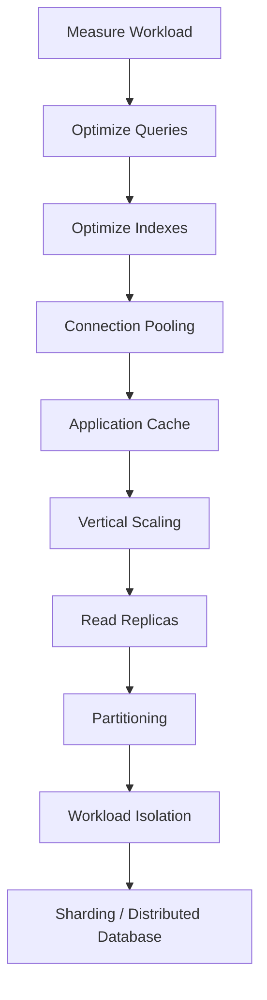
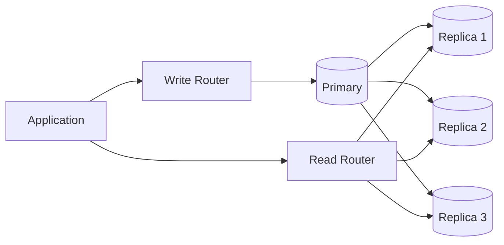
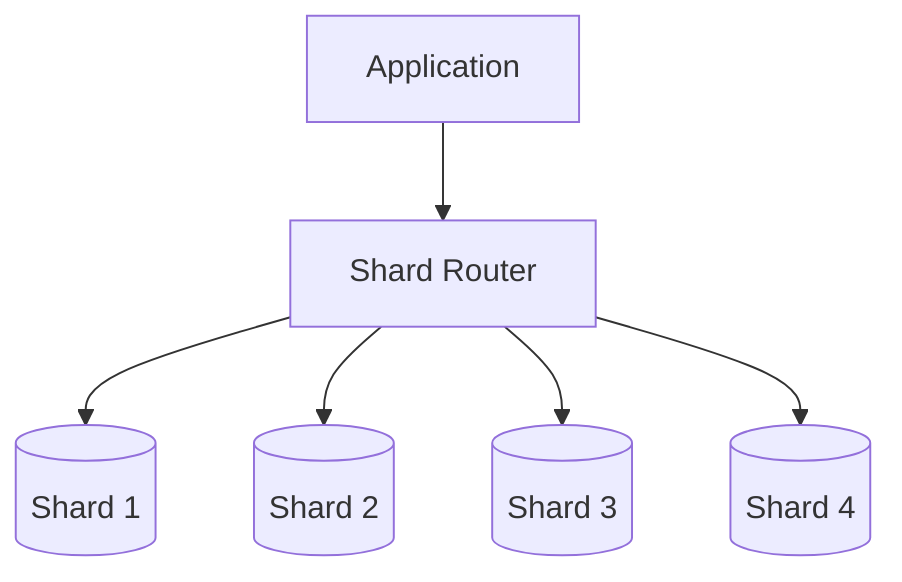
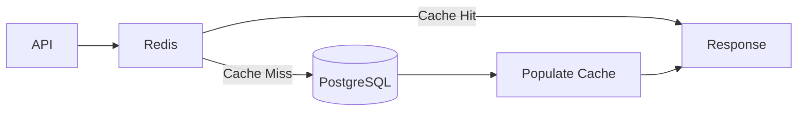
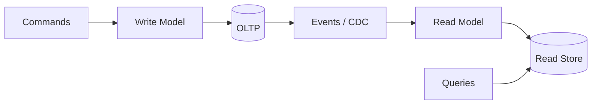
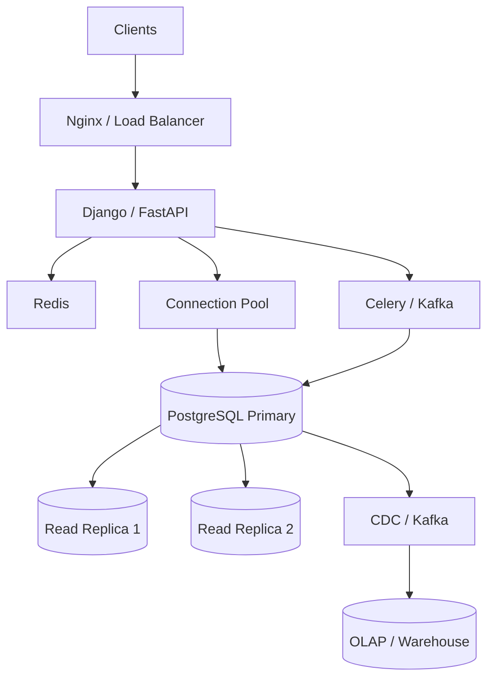

# 17- Database Scaling Architecture

## Overview

Database scaling is the process of increasing a database system's ability to handle higher:

- Read traffic
- Write traffic
- Data volume
- Query complexity
- Concurrent transactions
- Availability requirements

A production database rarely scales through a single mechanism. A mature architecture usually progresses through increasingly complex strategies:

```text
Query optimization
       ↓
Index optimization
       ↓
Connection pooling
       ↓
Caching
       ↓
Vertical scaling
       ↓
Read replicas
       ↓
Partitioning
       ↓
Workload isolation
       ↓
Sharding / distributed databases
```

The key engineering principle is:

> Scale the actual bottleneck, not the database simply because traffic increased.

A database can be CPU-bound, I/O-bound, memory-bound, connection-bound, lock-bound, storage-bound, or limited by inefficient queries. Each bottleneck requires a different solution.

---

## Database Scaling Dimensions

Database scaling is multidimensional.

| Dimension | Example Bottleneck | Typical Solutions |
|---|---|---|
| Read throughput | Too many SELECTs | Cache, replicas, query optimization |
| Write throughput | Too many INSERT/UPDATE operations | Batching, partitioning, data-model changes, sharding |
| Storage | Dataset too large | Storage scaling, partitioning, archival |
| CPU | Expensive queries | Query optimization, indexes, more compute |
| Memory | Working set exceeds RAM | More memory, caching, query optimization |
| I/O | Disk saturation | Faster storage, indexes, partitioning |
| Connections | Too many sessions | Pooling, PgBouncer, workload isolation |
| Lock contention | Hot rows | Atomic operations, data-model changes |
| Availability | Single failure domain | Replicas, failover, multi-AZ |
| Geographic latency | Users far from database | Regional replicas, distributed architecture |

Scaling should begin by identifying which dimension is actually constrained.

---

## Scaling vs Performance Optimization

These are related but different.

### Performance Optimization

Makes existing work cheaper.

```text
Bad query
   ↓
Better query
   ↓
Less CPU / I/O
```

### Scaling

Adds capacity or distributes workload.

```text
Current workload
      ↓
More compute / replicas / partitions
      ↓
Higher capacity
```

Optimization should usually precede scaling.

Adding hardware to compensate for an inefficient query can temporarily hide the problem while increasing infrastructure cost.

---

## The Scaling Progression

A practical progression for a PostgreSQL-backed service is:



The sequence is not mandatory.

For example, partitioning may be necessary before adding replicas if table size and maintenance are the primary bottlenecks.

---

## Vertical Scaling

Vertical scaling increases the resources available to a database instance.

```text
Database
   │
   ├── More CPU
   ├── More RAM
   ├── Faster storage
   └── Higher IOPS
```

For example:

```text
8 vCPU / 32 GB RAM
        ↓
32 vCPU / 128 GB RAM
```

Advantages:

- Simple operational model
- No application-level data distribution
- No replication routing
- Usually minimal code changes

Limitations:

- Hardware has an upper bound
- Larger instances cost more
- A single primary can remain a failure domain
- Does not inherently solve poor query design

Vertical scaling is often the simplest first infrastructure scaling step.

---

## CPU Scaling

CPU becomes a bottleneck when database operations spend most of their time computing.

Typical causes include:

- Complex joins
- Aggregations
- Sorting
- Expression evaluation
- JSON processing
- Poor query plans
- Excessive concurrent queries

Useful diagnostics include:

```text
High CPU
+
High query latency
+
CPU-intensive query plans
```

Adding CPU can help, but first identify which queries consume it.

---

## Memory Scaling

Database memory is important for:

- Buffer/cache effectiveness
- Sort operations
- Hash joins
- Aggregations
- Working sets
- Connection overhead

If frequently accessed data fits in memory:

```text
Query
  ↓
Memory/cache
  ↓
Fast access
```

If it repeatedly requires disk I/O:

```text
Query
  ↓
Disk
  ↓
Higher latency
```

More memory can therefore improve performance substantially for workloads with a favorable working set.

---

## Storage Scaling

Storage requirements grow with:

```text
Data
+
Indexes
+
WAL
+
Temporary files
+
Vacuum / maintenance overhead
+
Backups
```

Storage capacity and storage performance are different concerns.

A database may have sufficient disk space but insufficient IOPS.

```text
Capacity:
"Do I have enough space?"

Performance:
"Can storage process enough operations per second?"
```

Both should be monitored.

---

## Query Optimization Before Scaling

A query such as:

```sql
SELECT *
FROM orders
WHERE customer_id = $1
ORDER BY created_at DESC
LIMIT 50;
```

may become much more efficient with:

```sql
CREATE INDEX orders_customer_created_idx
ON orders(customer_id, created_at DESC);
```

Before scaling infrastructure, inspect:

```sql
EXPLAIN (ANALYZE, BUFFERS)
SELECT *
FROM orders
WHERE customer_id = 123
ORDER BY created_at DESC
LIMIT 50;
```

Look for:

- Sequential scans
- Incorrect row estimates
- Large sort operations
- Excessive buffers
- Expensive joins
- Poor selectivity
- Unexpected nested loops
- Disk spills

---

## Connection Scaling

Database connections are a separate scalability dimension.

Consider:

```text
20 Kubernetes pods
×
10 DB connections
=
200 connections
```

Increasing pods can therefore increase database pressure even if request traffic scales correctly.

Use:

- Bounded application pools
- PgBouncer when appropriate
- Connection timeouts
- Separate primary/replica pools
- Database-aware autoscaling

A database connection is a resource, not merely a socket.

---

## Read Scaling

Read-heavy systems can scale horizontally using read replicas.



This increases read capacity without distributing writes.

The architecture must account for:

- Replication lag
- Read-after-write consistency
- Replica health
- Connection capacity
- Failover

---

## Write Scaling

Writes are harder to scale horizontally.

A primary database typically remains the authority for a dataset:

```text
Application
     │
     ▼
Primary
     │
     ├── WAL → Replica
     ├── WAL → Replica
     └── WAL → Replica
```

Adding replicas does not distribute the write workload.

Write scaling may require:

- Query optimization
- Batching
- Reducing unnecessary indexes
- Partitioning
- Queue-based ingestion
- Data-model changes
- Sharding
- Separating workloads

---

## Batch Writes

Individual transactions can introduce significant overhead.

Instead of:

```text
INSERT
INSERT
INSERT
INSERT
...
```

use appropriate batch operations.

For PostgreSQL, application-level bulk inserts or `COPY` can substantially improve ingestion throughput for suitable workloads.

Example:

```sql
COPY events (event_id, occurred_at, event_type)
FROM STDIN
WITH (FORMAT csv);
```

Batching reduces per-row and per-transaction overhead.

However, very large transactions can create:

- Large WAL bursts
- Long locks
- Large rollback costs
- Replication pressure
- Vacuum delays

Batch size should therefore be bounded.

---

## Write Contention

High write volume does not necessarily mean high database throughput.

A workload such as:

```sql
UPDATE accounts
SET balance = balance - 10
WHERE id = 42;
```

can become limited by contention if thousands of transactions repeatedly update the same row.

This is a **hot-row** problem.

Possible solutions include:

- Atomic SQL
- Better data partitioning
- Queue serialization
- Sharding the workload
- Append-only event recording
- Reducing shared mutable state

The correct solution depends on the business invariant.

---

## Partitioning

Partitioning divides a large logical table into smaller physical partitions.

Example:

```text
events
├── events_2026_01
├── events_2026_02
├── events_2026_03
└── events_2026_04
```

Partitioning can improve:

- Partition pruning
- Data lifecycle management
- Maintenance
- Archival
- Large-table management

It does not automatically improve every query.

---

## Partition Key Selection

A good partition key should align with:

- Common filtering predicates
- Data lifecycle
- Retention policies
- Data distribution
- Operational maintenance

Time-based partitioning is common:

```text
created_at
```

For multi-tenant workloads:

```text
tenant_id
```

may be relevant.

However, partitioning by a highly skewed key can create uneven partitions.

---

## Partitioning vs Sharding

These are different.

### Partitioning

Usually occurs within one database system.

```text
Database
   │
   ├── Partition A
   ├── Partition B
   └── Partition C
```

### Sharding

Distributes data across independent database instances.

```text
Shard 1
   └── Tenants A-D

Shard 2
   └── Tenants E-H

Shard 3
   └── Tenants I-L
```

Sharding introduces much greater application and operational complexity.

---

## Sharding

Sharding distributes data across multiple database nodes.



The application or routing layer determines where a record belongs.

Possible shard keys include:

- Tenant ID
- Customer ID
- Account ID
- Geographic region

The shard key is one of the most important decisions in a sharded architecture.

---

## Shard Key Requirements

A good shard key should generally provide:

- Even distribution
- Predictable routing
- High cardinality
- Stable ownership
- Alignment with access patterns

A poor key can create hotspots.

For example:

```text
Shard by country
```

may produce:

```text
US → 70%
IN → 15%
GB → 5%
Others → 10%
```

This creates significant skew.

---

## Sharding Trade-offs

| Benefit | Cost |
|---|---|
| Horizontal write scaling | Routing complexity |
| Larger total dataset | Cross-shard queries |
| Failure isolation | More operational work |
| Independent scaling | Rebalancing |
| Reduced per-node load | Distributed transactions |
| Tenant isolation options | More difficult debugging |

Sharding should usually be introduced only when simpler scaling strategies are insufficient.

---

## Cross-Shard Queries

Suppose:

```sql
SELECT *
FROM orders
WHERE customer_id = ?;
```

If `customer_id` is the shard key:

```text
Customer ID
    ↓
Known shard
    ↓
Single-shard query
```

This is efficient.

But:

```sql
SELECT SUM(amount)
FROM orders;
```

may require:

```text
Shard 1 ─┐
Shard 2 ─┤
Shard 3 ─┼── Aggregate
Shard 4 ─┘
```

Cross-shard queries increase latency and complexity.

Analytics should often be separated into an OLAP architecture instead of repeatedly querying every shard.

---

## Application-Level Sharding

A service might implement:

```python
def shard_for_customer(customer_id: int, shard_count: int) -> int:
    return customer_id % shard_count
```

This illustrates the concept, but production sharding requires more than modulo routing.

Important concerns include:

- Shard rebalancing
- Consistent routing
- Data migration
- Hotspots
- Failure handling
- Schema migrations
- Cross-shard operations

A routing algorithm that makes future resharding difficult can become a long-term architectural constraint.

---

## Hash vs Range Sharding

### Hash Sharding

```text
hash(key) → shard
```

Advantages:

- Usually good distribution
- Simple routing

Limitations:

- Range queries are difficult
- Rebalancing can be complex

### Range Sharding

```text
A-M → Shard 1
N-Z → Shard 2
```

Advantages:

- Efficient range queries
- Predictable locality

Limitations:

- Hotspots
- Uneven distribution

Neither strategy is universally better.

---

## Caching as a Scaling Layer

Redis can reduce database read traffic.



Caching is particularly useful for:

- Frequently accessed data
- Expensive computations
- Read-heavy endpoints
- Stable reference data

Caching should not be used to hide fundamentally inefficient database access patterns.

---

## Cache Stampede

A common failure occurs when many requests simultaneously miss the cache.

```text
Cache expires
     │
     ▼
1000 requests miss
     │
     ▼
1000 DB queries
     │
     ▼
Database overload
```

Mitigation strategies include:

- TTL jitter
- Request coalescing
- Distributed locking where appropriate
- Background refresh
- Stale-while-revalidate patterns

The correct strategy depends on freshness requirements.

---

## Workload Isolation

A single database can host conflicting workloads:

```text
OLTP
 ├── API transactions
 ├── Background jobs
 └── User reads

Analytics
 ├── Large scans
 └── Aggregations
```

Separating workloads prevents one class of traffic from consuming resources needed by another.

Possible architecture:

```text
PostgreSQL Primary
      │
      ├── Read Replicas → Operational reads
      │
      └── CDC → OLAP → Analytics
```

---

## Queue-Based Write Scaling

For workloads where immediate synchronous processing is unnecessary:

```text
API
 │
 ▼
Kafka
 │
 ▼
Consumers
 │
 ▼
Database
```

This can absorb bursts.

For example:

```text
Traffic:
50,000 events/sec

Consumers:
Process at sustainable rate
```

The queue becomes a buffer.

However, asynchronous processing changes system semantics.

The API may return:

```text
202 Accepted
```

rather than:

```text
200 OK with completed database state
```

Idempotency, ordering, retries, and consumer lag must be designed explicitly.

---

## Write Coalescing

Sometimes many updates can be combined.

Instead of:

```text
UPDATE product SET view_count = view_count + 1
```

for every individual event, a high-volume system may aggregate events and periodically persist:

```text
+10,000 views
```

This reduces write amplification.

However, this changes the precision and freshness characteristics of the data.

Do not use coalescing where every individual transaction has business significance.

---

## CQRS

Command Query Responsibility Segregation separates write and read models.



This can provide highly optimized read models while preserving a transactional source of truth.

The trade-off is eventual consistency and increased architectural complexity.

---

## Database Scaling with Microservices

A microservice architecture can distribute database ownership:

```text
Order Service
    │
    ▼
Order DB

Payment Service
    │
    ▼
Payment DB

User Service
    │
    ▼
User DB
```

This can scale organizationally and operationally.

However, it also introduces:

- Data duplication
- Distributed transactions
- Event-driven consistency
- Cross-service queries
- Operational overhead

Splitting a database per service is not automatically a performance optimization.

---

## Read Models

For complex application queries, a dedicated read model can be more efficient than repeatedly joining operational tables.

Example:

```text
Normalized OLTP
      │
      ▼
Event / CDC
      │
      ▼
Denormalized Read Model
      │
      ▼
API
```

This is useful when the same complex query is executed frequently.

---

## Scaling Search Workloads

Database scaling is not always the correct solution.

For complex text search:

```text
PostgreSQL
    │
    └── Search index / OpenSearch
```

For large analytics:

```text
PostgreSQL
    │
    └── Warehouse / OLAP
```

For caching:

```text
PostgreSQL
    │
    └── Redis
```

A mature architecture assigns each workload to an appropriate system rather than forcing PostgreSQL to perform every task.

---

## Replication and Scaling

Replication can support:

- Read scaling
- High availability
- Disaster recovery
- Geographic distribution

But replication introduces:

```text
Replication lag
+
Operational complexity
+
Additional storage
+
Network traffic
```

Asynchronous replicas should not be assumed to provide strongly consistent reads.

---

## High Availability

Scaling and availability are related but different.

A database can be:

```text
Highly available
but not highly scalable
```

or:

```text
Highly scalable
but poorly available
```

A production architecture should explicitly define:

- RPO
- RTO
- Failover requirements
- Read capacity
- Write capacity
- Regional requirements

---

## Multi-AZ Architecture

A common AWS-style deployment is:

```text
                 Application
                      │
                      ▼
                Writer Endpoint
                      │
                      ▼
                 Primary DB
                  /       \
                 /         \
                ▼           ▼
           Standby AZ     Read Replica
```

The exact architecture depends on the managed database service.

The key principle is to avoid placing all database availability into one failure domain.

---

## Multi-Region Scaling

For globally distributed systems:

```text
             Global Traffic
                   │
       ┌───────────┴───────────┐
       ▼                       ▼
   Region A                 Region B
       │                       │
       ▼                       ▼
   DB Primary             DB Replica
```

Challenges include:

- Cross-region latency
- Replication lag
- Conflict resolution
- Data sovereignty
- Failover
- Network partitions
- Higher operational cost

Multi-region databases should be introduced only when latency, availability, or regulatory requirements justify the complexity.

---

## Monitoring Database Scaling

Scaling decisions should be driven by measurements.

### Infrastructure Metrics

Monitor:

- CPU utilization
- Memory utilization
- Disk utilization
- IOPS
- Storage throughput
- Network throughput

### Database Metrics

Monitor:

- Query latency
- Transactions/sec
- Rows read
- Rows returned
- Cache hit ratio
- Connections
- Lock waits
- Deadlocks
- Replication lag
- WAL generation

### Application Metrics

Monitor:

- Request latency
- Database wait time
- Pool wait time
- Error rate
- Cache hit rate
- Queue depth

---

## Scaling Signals

Useful relationships include:

```text
High CPU
+
Expensive queries
→ Query optimization / CPU scaling

High read traffic
+
Healthy primary writes
→ Read replicas / caching

High write contention
→ Data-model / transaction optimization

High storage growth
→ Partitioning / archival

High connection count
→ Pooling / PgBouncer

Large analytical queries
→ OLAP separation

Single dataset exceeds practical node limits
→ Sharding / distributed storage
```

Avoid responding to every alert with:

```text
Increase instance size
```

---

## Capacity Planning

Capacity planning should consider:

```text
Current workload
+
Growth rate
+
Peak traffic
+
Seasonality
+
Failure scenarios
+
Deployment spikes
```

For example:

```text
Normal:
2,000 req/sec

Peak:
8,000 req/sec

Projected:
15,000 req/sec
```

The architecture should be tested against realistic peak conditions rather than average traffic.

---

## Headroom

Running infrastructure at 100% utilization is unsafe.

For example:

```text
Normal CPU: 40%
Peak CPU:   70%
```

provides more resilience than:

```text
Normal CPU: 80%
Peak CPU:   98%
```

Headroom allows the system to absorb:

- Traffic spikes
- Slow queries
- Failures
- Maintenance
- Deployment overlap

The correct headroom depends on workload and SLOs.

---

## Load Testing

Database scaling decisions should be validated with realistic workloads.

Test:

- Read/write ratios
- Query distributions
- Concurrency
- Large datasets
- Cache hit/miss behavior
- Replica lag
- Connection limits
- Failure scenarios

Synthetic benchmarks that execute only one query type can produce misleading conclusions.

---

## Benchmarking Example

Compare:

```text
Configuration A
8 vCPU
32 GB RAM
1 primary

Configuration B
16 vCPU
64 GB RAM
1 primary + replica
```

Measure:

```text
p50 latency
p95 latency
p99 latency
transactions/sec
CPU
I/O
connections
replication lag
error rate
```

Choose based on business requirements and total cost, not just maximum throughput.

---

## Cost Optimization

Database scaling can become expensive if capacity is added without addressing inefficient workloads.

A useful optimization sequence is:

```text
Measure
  ↓
Optimize queries
  ↓
Remove unnecessary indexes
  ↓
Cache hot data
  ↓
Reduce database traffic
  ↓
Right-size infrastructure
  ↓
Scale horizontally where justified
```

For cloud deployments, also consider:

- Storage cost
- IOPS cost
- Replica cost
- Data transfer
- Cross-region traffic
- Backup storage
- Managed-service pricing

---

## Disaster Recovery

Scaling architecture should preserve recovery capabilities.

Maintain:

- Automated backups
- Point-in-time recovery
- Tested restore procedures
- Replication where appropriate
- Cross-region recovery where required

Do not confuse:

```text
Read replica
```

with:

```text
Backup
```

A replica can replicate accidental deletes and application corruption.

---

## Security at Scale

Scaling increases the number of infrastructure components and network paths.

Maintain:

- Private database networking
- TLS
- Least-privilege database roles
- Secret management
- Network access controls
- Audit logging
- Encryption at rest
- Encryption in transit

When introducing shards or replicas, security policies must remain consistent across all database nodes.

---

## Operational Complexity

Every scaling layer adds operational cost.

```text
Single PostgreSQL
      ↓
Primary + Replica
      ↓
Multiple Replicas
      ↓
Partitioned Database
      ↓
CDC / OLAP
      ↓
Sharded Database
```

Complexity grows with:

- Deployment coordination
- Schema migrations
- Monitoring
- Incident response
- Testing
- Data movement
- Backup/restore
- Debugging

A senior engineer should optimize for **sufficient capacity with minimum necessary complexity**.

---

## Production Architecture Example

A mature read-heavy backend might use:



Responsibilities:

```text
Primary
→ Transactional writes

Replicas
→ Operational reads

Redis
→ Hot data / caching

Kafka
→ Asynchronous events

Celery
→ Background processing

OLAP
→ Historical analytics
```

This separation prevents one workload from unnecessarily consuming resources needed by another.

---

## Scaling Decision Framework

Before choosing a scaling strategy, ask:

1. What resource is actually saturated?
2. Is the bottleneck caused by inefficient SQL?
3. Is the workload read-heavy or write-heavy?
4. Can caching remove database traffic?
5. Can indexes reduce work?
6. Can vertical scaling solve the problem?
7. Can replicas isolate reads?
8. Can partitioning reduce data scanned or maintenance cost?
9. Can asynchronous processing absorb write bursts?
10. Does the workload genuinely require sharding?

The answers should determine the architecture.

---

## Common Mistakes

### Scaling Before Measuring

Increasing database capacity without identifying the bottleneck wastes resources.

**Better:** correlate database metrics, query plans, and application latency.

### Adding Read Replicas for a Write Bottleneck

Replicas do not distribute writes.

**Better:** optimize writes, batch operations, reduce contention, partition, or shard when necessary.

### Increasing Connection Pool Size Indefinitely

More connections can increase contention.

**Better:** find the optimal concurrency level through measurement.

### Using Caching to Hide Bad SQL

Caching may reduce frequency but does not fix an inefficient miss path.

**Better:** optimize the underlying query first.

### Sharding Too Early

Sharding introduces substantial operational complexity.

**Better:** exhaust simpler scaling mechanisms unless requirements clearly demand distribution.

### Ignoring Replica Lag

Reads from asynchronous replicas can be stale.

**Better:** explicitly define consistency requirements.

### Using One Database for Every Workload

OLTP, search, caching, and analytics have different characteristics.

**Better:** isolate workloads when justified.

### Creating Huge Transactions

Large transactions can increase WAL volume, locks, replication lag, and rollback cost.

**Better:** use bounded batches.

### Ignoring Hot Partitions

Partitioning can create uneven workload distribution.

**Better:** monitor partition sizes and access patterns.

### Choosing a Poor Shard Key

A skewed shard key creates hotspots.

**Better:** evaluate cardinality, distribution, access patterns, and future growth before committing to the key.

### Ignoring Cross-Shard Operations

A sharded design can make previously simple queries expensive.

**Better:** design APIs and data ownership around shard-local operations.

### Scaling Application Pods Without Database Planning

More pods can create more database connections and query traffic.

**Better:** include database capacity in Kubernetes autoscaling design.

### Ignoring Deployment Spikes

Rolling deployments can temporarily double application instances.

**Better:** calculate connection and query load during deployment overlap.

### Treating Replicas as Backups

Replicas reproduce changes, including destructive changes.

**Better:** maintain independent backups and test recovery.

---

## Production Checklist

### Diagnosis

- [ ] Database bottlenecks are measured.
- [ ] Query-level performance is understood.
- [ ] Read/write ratios are known.
- [ ] Connection utilization is monitored.
- [ ] Lock contention is monitored.
- [ ] Storage and I/O behavior are measured.

### Optimization

- [ ] Expensive queries have been optimized.
- [ ] Indexes match actual access patterns.
- [ ] Unnecessary indexes have been removed.
- [ ] Transactions are appropriately scoped.
- [ ] Batch operations are used where appropriate.
- [ ] Caching is applied to suitable workloads.

### Scaling

- [ ] Vertical scaling has been evaluated.
- [ ] Read replicas are used where read capacity is the bottleneck.
- [ ] Partitioning is based on access and lifecycle requirements.
- [ ] OLTP and OLAP workloads are isolated where necessary.
- [ ] Sharding is introduced only when simpler options are insufficient.
- [ ] Connection pools are sized against aggregate deployment capacity.

### Reliability

- [ ] Primary failure behavior is tested.
- [ ] Replica lag is monitored.
- [ ] Failover procedures are documented.
- [ ] Backups are independent of replicas.
- [ ] Point-in-time recovery is tested.
- [ ] RPO and RTO are defined.

### Operations

- [ ] Scaling thresholds are tied to SLOs.
- [ ] Capacity headroom is maintained.
- [ ] Load tests use realistic workloads.
- [ ] Database connection usage is monitored during deployments.
- [ ] Data migrations are tested at production scale.
- [ ] Scaling changes are documented and reversible where possible.

## Interview Traps

### What is the first thing you do when a database is slow?

Measure the workload and identify the bottleneck. Inspect query latency, execution plans, CPU, I/O, locks, connections, and workload distribution before choosing a scaling strategy.

### What is the difference between vertical and horizontal database scaling?

Vertical scaling increases resources on a database node. Horizontal scaling distributes workload across multiple nodes, such as read replicas or shards.

### Do read replicas scale writes?

No. Replicas primarily scale reads and can provide HA/DR capabilities.

### Why can't you simply add more database connections?

Connections consume database resources and can increase contention. Beyond an optimal concurrency level, additional connections can reduce throughput.

### When should you use caching?

When frequently requested data can tolerate the cache's consistency and freshness semantics. Caching should reduce avoidable database work rather than compensate for fundamentally poor SQL.

### When should you introduce partitioning?

When table size, query pruning, data lifecycle, or maintenance requirements justify it. Partitioning is particularly useful when queries commonly filter on the partition key.

### What is the difference between partitioning and sharding?

Partitioning divides data within a database system. Sharding distributes data across independent database nodes and introduces routing and distributed-system concerns.

### Why is write scaling harder than read scaling?

Read replicas can independently replay the same writes and serve reads, while writes require coordination around authoritative state, constraints, transactions, and conflicts.

### How can Kafka help database scaling?

Kafka can absorb asynchronous workloads and decouple producers from consumers, allowing database writes to be processed at a sustainable rate. It does not remove the need for database capacity planning.

### When would you choose CQRS?

When read and write workloads have sufficiently different access patterns that independently optimized models provide meaningful benefits. CQRS introduces eventual consistency and additional operational complexity.

### What makes a good shard key?

A good shard key provides balanced distribution, predictable routing, high cardinality, stable ownership, and alignment with the application's dominant access patterns.

### Why are cross-shard queries problematic?

They require contacting multiple database nodes and combining results, increasing latency, network traffic, failure modes, and implementation complexity.

### Why isn't a read replica a backup?

Because changes are replicated, including accidental or malicious changes. Independent backups and point-in-time recovery are still required.

### How does Kubernetes affect database scaling?

Scaling application pods can multiply database connections and query concurrency. Database capacity must therefore be considered when configuring autoscaling and deployment strategies.

### How do you know whether to add a replica or increase CPU?

If read traffic is saturating the primary while write capacity remains healthy, replicas may help. If queries are CPU-bound and cannot be optimized further, additional CPU may be more appropriate.

### What is a hot partition or hot shard?

It is a partition or shard receiving a disproportionate amount of traffic or writes. This can make the distributed system bottleneck on one node despite having substantial unused capacity elsewhere.

### What is the most important database scaling principle?

Identify the actual bottleneck first, optimize unnecessary work, and introduce the simplest scaling mechanism that satisfies the required throughput, latency, consistency, availability, and cost objectives.

## Key Takeaways

- Database scaling should begin with measurement and bottleneck identification; query optimization, indexing, transaction tuning, pooling, and caching can often eliminate the need for more complex infrastructure.
- Vertical scaling and read replicas are usually simpler than sharding, while partitioning, workload isolation, and asynchronous processing address specific data, maintenance, and workload constraints.
- Read scaling is significantly easier than write scaling; write-heavy systems may require batching, contention reduction, data-model changes, queues, partitioning, or eventually sharding.
- Every horizontal scaling mechanism introduces consistency, routing, failure, monitoring, migration, and operational complexity, so architecture should evolve only when workload requirements justify it.
- Production database scaling must be designed together with capacity planning, Kubernetes deployment behavior, HA/DR, observability, security, cost, and explicit RPO/RTO/SLO requirements.