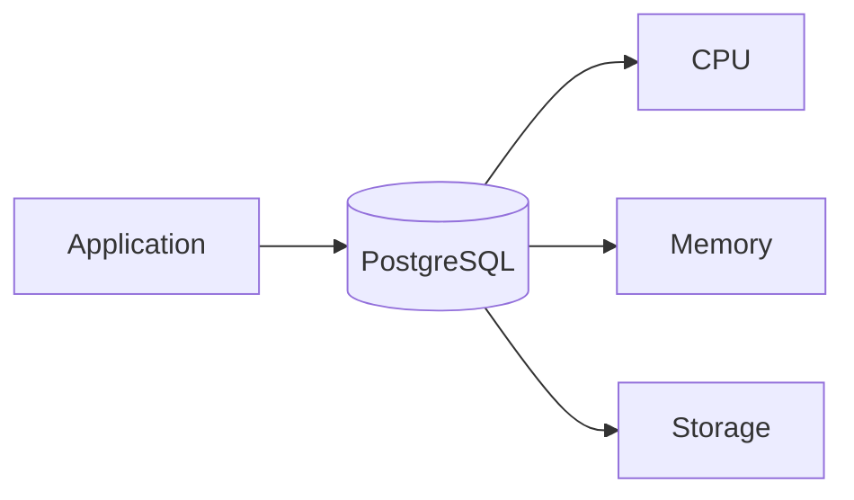
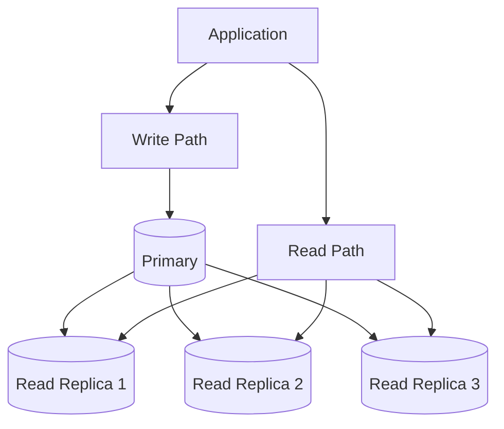
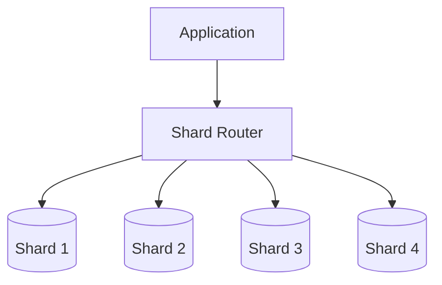
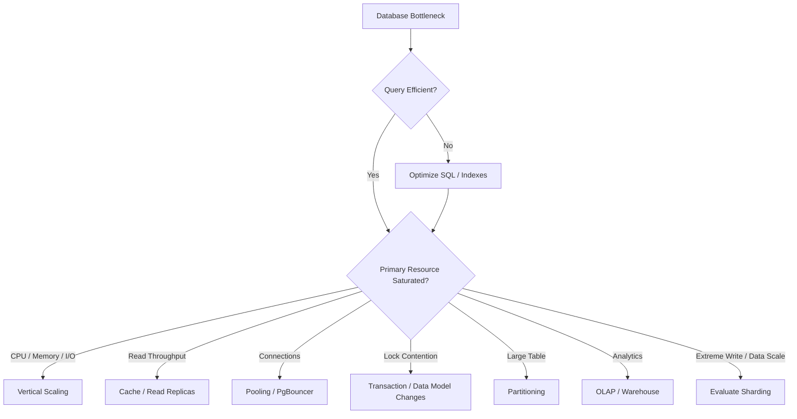
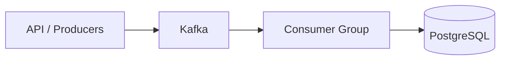
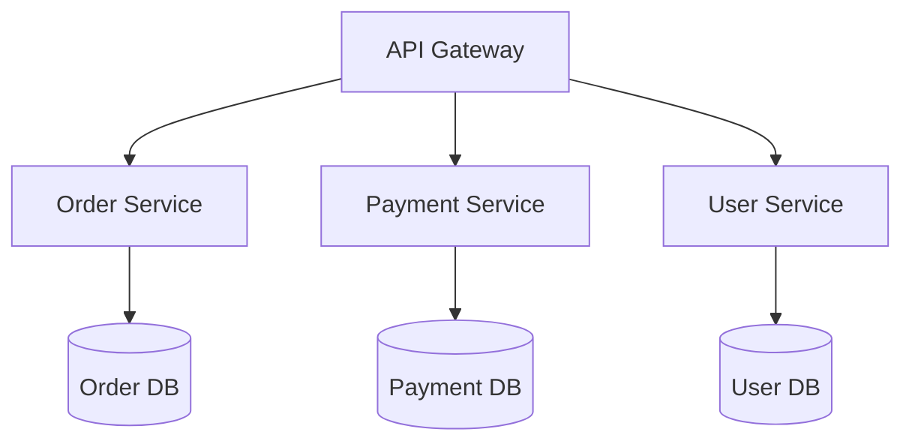

# 18- Vertical vs Horizontal Database Scaling

## Overview

Database scaling determines how a database architecture increases capacity as application traffic, data volume, and concurrency grow.

Two fundamental approaches are:

- **Vertical scaling (scale up):** increase the resources of an existing database node.
- **Horizontal scaling (scale out):** distribute workload across multiple database nodes.

```text
                    Database Scaling
                          │
              ┌───────────┴───────────┐
              │                       │
        Vertical Scaling       Horizontal Scaling
          "Scale Up"             "Scale Out"
              │                       │
       More CPU / RAM          Replicas / Shards
       Faster storage          Distributed workload
```

Neither approach is universally better. The correct choice depends on the bottleneck, workload characteristics, consistency requirements, availability objectives, operational maturity, and cost.

For most PostgreSQL-backed backend systems, a sensible progression is:

```text
Optimize SQL
    ↓
Optimize indexes
    ↓
Connection pooling
    ↓
Caching
    ↓
Vertical scaling
    ↓
Read replicas
    ↓
Partitioning / workload isolation
    ↓
Sharding when genuinely required
```

The most important principle is:

> Scale the bottleneck, not the database by default.

---

## Why Database Scaling Matters

A backend system can outgrow a database in several different ways.

| Scaling Dimension | Typical Symptom | Potential Solution |
|---|---|---|
| CPU | High CPU, expensive queries | Query optimization, more CPU |
| Memory | Poor cache effectiveness | More RAM, caching |
| Storage I/O | High IOPS/latency | Faster storage, indexes |
| Storage capacity | Dataset approaching limits | Larger storage, partitioning, archival |
| Read throughput | Primary overloaded by SELECTs | Replicas, caching |
| Write throughput | Primary saturated | Batching, optimization, partitioning, sharding |
| Connections | Pool exhaustion | Pool tuning, PgBouncer |
| Locking | High lock waits | Transaction redesign, atomic operations |
| Data volume | Large-table queries/maintenance | Partitioning, archival |
| Availability | Single-node failure | HA replicas/failover |
| Geographic latency | Remote users experience latency | Regional replicas/distributed architecture |

The same database may experience several of these bottlenecks simultaneously.

---

## Vertical Scaling

Vertical scaling increases the resources available to a database instance.

For example:

```text
Before

PostgreSQL
├── 8 vCPU
├── 32 GB RAM
└── Standard storage


After

PostgreSQL
├── 32 vCPU
├── 128 GB RAM
└── Higher-performance storage
```

The database remains logically and physically centered around one primary node.

### Why Vertical Scaling Exists

Vertical scaling is attractive because it preserves a relatively simple architecture.

The application still connects to:

```text
Application
     │
     ▼
PostgreSQL
```

There is no requirement to introduce:

- Shard routing
- Cross-node query coordination
- Distributed transactions
- Replica routing
- Cross-shard data movement

---

## How Vertical Scaling Works

A managed database service such as an AWS relational database offering can typically provide larger instance classes or storage configurations.

The database process itself continues to manage:

- Buffer/cache memory
- Query execution
- Transactions
- Locks
- WAL
- Indexes
- Storage
- Connections

The increased hardware provides greater capacity for these operations.



Increasing CPU helps CPU-bound workloads.

Increasing memory can improve cache effectiveness and reduce disk reads.

Faster storage can improve I/O-bound workloads.

---

## Advantages of Vertical Scaling

### Simplicity

The application usually requires little or no architectural change.

### Strong Consistency

There is no additional read replica consistency problem simply because the database was scaled vertically.

### Easier Transactions

Transactions remain local to one database.

### Easier Operations

There are fewer nodes to:

- Monitor
- Upgrade
- Back up
- Diagnose
- Secure
- Fail over

### Easier Migrations

Schema changes do not need to be coordinated across many independent database shards.

---

## Limitations of Vertical Scaling

Vertical scaling has physical and economic limits.

```text
Small Instance
      ↓
Medium Instance
      ↓
Large Instance
      ↓
Very Large Instance
      ↓
Maximum Practical Size
```

Eventually:

- Larger instances become disproportionately expensive.
- Hardware capacity reaches an upper bound.
- A single primary remains a major workload concentration point.
- Vertical scaling does not inherently distribute read traffic.
- Vertical scaling does not fix inefficient queries.

A query performing a massive sequential scan may remain inefficient on a much larger instance.

---

## When Vertical Scaling Is Appropriate

Vertical scaling is often appropriate when:

- The database is still comfortably within a single-node architecture.
- CPU or memory is the primary bottleneck.
- The workload is not sufficiently large to justify distribution.
- Strong consistency is important.
- Operational simplicity is valuable.
- The application has not exhausted simpler optimization techniques.

For many production systems, vertical scaling can support substantial workloads before horizontal database scaling becomes necessary.

---

## Horizontal Scaling

Horizontal scaling adds multiple database nodes and distributes workload or data between them.

```text
                 Application
                      │
             ┌────────┴────────┐
             │                 │
          Primary           Replicas
             │             ┌────┴────┐
             │             │         │
             ▼             ▼         ▼
          Writes         Read 1    Read 2
```

Horizontal scaling can mean several different things:

- Read replicas
- Multi-primary architectures
- Partitioning
- Sharding
- Distributed databases
- Workload-specific database nodes

These mechanisms solve different problems.

---

## Horizontal Read Scaling

The most common horizontal scaling strategy for PostgreSQL is adding read replicas.



The primary handles writes.

Replicas handle eligible reads.

This can significantly reduce read pressure on the primary.

---

## Read Replica Data Flow

A simplified PostgreSQL replication flow is:

```text
Application
    │
    ├── Writes ──→ Primary
    │                 │
    │                 ▼
    │                WAL
    │                 │
    │                 ▼
    │            Replication
    │                 │
    │        ┌────────┼────────┐
    │        ▼        ▼        ▼
    │    Replica 1 Replica 2 Replica 3
    │
    └── Reads ───────→ Replicas
```

With asynchronous replication, replicas may temporarily lag behind the primary.

Therefore:

```text
Write → Primary
Read  → Replica
```

does not necessarily guarantee that the read immediately observes the write.

---

## Read-After-Write Consistency

Consider:

```text
POST /orders
```

The order is written to the primary.

Immediately afterward:

```text
GET /orders/123
```

If the GET is routed to a lagging replica, it may not find the order yet.

Possible strategies include:

- Route recently written entities to the primary.
- Use primary reads for consistency-sensitive operations.
- Use LSN-aware routing where appropriate.
- Maintain a short-lived consistency window.
- Use caching carefully.

The architecture should define consistency requirements per operation rather than assuming replicas are interchangeable with the primary.

---

## Horizontal Write Scaling

Horizontal write scaling is considerably harder.

With one primary:

```text
All writes
    ↓
Primary
```

Adding read replicas does not change this:

```text
All writes
    ↓
Primary
    ├── Replica 1
    ├── Replica 2
    └── Replica 3
```

The replicas consume replicated changes but do not independently accept arbitrary writes to the same authoritative dataset.

To distribute writes, the architecture usually requires:

- Partitioning
- Sharding
- Multiple independent databases
- Distributed database technology
- Workload decomposition

---

## Database Sharding

Sharding distributes data across independent database nodes.



For example:

```text
Customer IDs 1-1M       → Shard 1
Customer IDs 1M-2M      → Shard 2
Customer IDs 2M-3M      → Shard 3
Customer IDs 3M-4M      → Shard 4
```

Or:

```text
hash(customer_id) → shard
```

The application or routing layer determines where data belongs.

---

## Why Sharding Is Harder

Sharding changes the problem from:

```text
How do I optimize one database?
```

to:

```text
How do I operate a distributed data system?
```

New problems include:

- Shard key selection
- Data distribution
- Hot shards
- Rebalancing
- Cross-shard queries
- Cross-shard transactions
- Schema migrations
- Backup/restore coordination
- Operational debugging
- Failure handling

Sharding should therefore not be treated as simply "adding more PostgreSQL instances."

---

## Shard Key Design

The shard key is one of the most important decisions.

A good shard key should generally provide:

- High cardinality
- Even distribution
- Predictable routing
- Stable ownership
- Alignment with common queries

For a multi-tenant SaaS platform:

```text
tenant_id
```

may be a strong candidate if most operations are tenant-local.

Then:

```text
Request
   ↓
tenant_id
   ↓
Shard Router
   ↓
Correct Database
```

A poor shard key can create severe imbalance.

---

## Vertical vs Horizontal Scaling

| Characteristic | Vertical Scaling | Horizontal Scaling |
|---|---|---|
| Basic idea | Bigger node | More nodes |
| Architecture | Simple | Distributed |
| Application changes | Usually minimal | Often required |
| Read scaling | Limited | Strong with replicas |
| Write scaling | Limited by node | Possible with sharding/distribution |
| Transactions | Simple | More complex across nodes |
| Consistency | Easier | More difficult |
| Operational complexity | Lower | Higher |
| Failure isolation | Limited | Potentially better |
| Maximum capacity | Hardware-limited | Potentially much larger |
| Cost model | Larger instance | Multiple nodes |
| Debugging | Easier | More complex |
| Data movement | Usually unnecessary | Often required |
| Best use case | Single-node capacity | Distributed workload/data |

---

## Scaling Reads vs Scaling Writes

A critical distinction is:

```text
Read Scaling
→ Replicas / caching

Write Scaling
→ Batching / partitioning / sharding / data-model changes
```

For example, suppose a service handles:

```text
10,000 requests/sec

95% reads
5% writes
```

Adding read replicas may provide significant value.

But for:

```text
10,000 requests/sec

20% reads
80% writes
```

the primary may remain the bottleneck.

The solution cannot simply be "add more replicas."

---

## Database Scaling Decision Tree



This prevents premature adoption of distributed database architecture.

---

## Vertical Scaling with PostgreSQL

PostgreSQL benefits from additional resources when the workload can use them effectively.

### CPU

Useful for:

- Complex queries
- Joins
- Aggregations
- Sorting
- Parallel execution

### Memory

Useful for:

- Buffer cache
- Hash operations
- Sorts
- Larger working sets

### Storage Performance

Useful for:

- Random I/O
- WAL-heavy workloads
- Large scans
- Index access

### Storage Capacity

Useful when:

- Tables grow rapidly
- Indexes consume significant space
- WAL and backup requirements increase

Hardware should be matched to the actual resource bottleneck.

---

## Horizontal Scaling with PostgreSQL

PostgreSQL commonly participates in horizontal architectures through:

- Streaming replication
- Read replicas
- Partitioning
- Logical replication
- CDC pipelines
- Independent databases
- Sharded deployments

These mechanisms have different semantics.

For example:

```text
Read replica
→ Same logical dataset, additional read capacity

Partitioning
→ One logical table divided into partitions

Sharding
→ Dataset distributed across independent databases

CDC
→ Changes streamed to another system/workload
```

They should not be treated as interchangeable scaling mechanisms.

---

## Partitioning as an Intermediate Strategy

Partitioning can solve some problems before sharding is required.

Example:

```text
orders
├── orders_2026_01
├── orders_2026_02
├── orders_2026_03
└── orders_2026_04
```

Benefits include:

- Partition pruning
- Smaller indexes
- Easier retention
- Easier archival
- More manageable maintenance

Partitioning still operates within the database architecture and therefore avoids many distributed-system problems associated with sharding.

---

## Caching and Horizontal Scaling

Redis can reduce the database workload without modifying database topology.

```text
                    ┌───────────┐
                    │   Redis   │
                    └─────┬─────┘
                          │
Application ──────────────┤
                          │
                          ▼
                    PostgreSQL
```

For highly cacheable workloads:

```text
10,000 reads/sec
     ↓
8,000 served by Redis
     ↓
2,000 reach PostgreSQL
```

The exact numbers are workload-dependent, but the principle is important:

> Reducing database work is often better than merely adding database capacity.

---

## Connection Scaling

Horizontal application scaling can unintentionally overload the database.

Suppose:

```text
50 Kubernetes pods
×
10 database connections
=
500 potential connections
```

If the database cannot efficiently support 500 active sessions, adding more application pods can make the system worse.

Use:

- Bounded connection pools
- PgBouncer where appropriate
- Pool timeout limits
- Separate read/write pools when justified
- Database-aware autoscaling

Application scaling and database scaling must be planned together.

---

## Kubernetes Considerations

Kubernetes makes application horizontal scaling easy:

```text
3 pods
  ↓
10 pods
  ↓
30 pods
```

But database capacity does not automatically scale with the number of pods.

Each pod can create:

```text
Connections
Queries
Transactions
Background jobs
```

Therefore:

```text
Kubernetes Autoscaling
        ↓
More application concurrency
        ↓
More database pressure
```

HPA configuration should consider database capacity and connection limits.

---

## Celery and Database Scaling

Background workers can generate substantial database traffic.

For example:

```text
API
 │
 ▼
Celery Queue
 │
 ├── Worker 1 ──┐
 ├── Worker 2 ──┤
 ├── Worker 3 ──┼──→ PostgreSQL
 └── Worker 4 ──┘
```

Increasing Celery workers may increase:

- Database connections
- Write concurrency
- Lock contention
- WAL generation
- CPU consumption

Worker autoscaling must therefore be coordinated with database capacity.

---

## Kafka and Database Scaling

Kafka can decouple high-volume ingestion from database writes.



This provides:

- Burst absorption
- Backpressure
- Asynchronous processing
- Independent producer/consumer scaling

But Kafka does not magically increase database write capacity.

If consumers produce writes faster than PostgreSQL can process:

```text
Kafka lag
    ↑
    │
Database capacity
    ↓
```

The queue becomes a buffer rather than a solution to the underlying throughput limit.

---

## Multi-Database Service Architecture

Horizontal scaling can also happen at the service boundary.



Each service owns its workload.

This can reduce contention between unrelated domains.

However, service-level database separation introduces:

- Distributed transactions
- Data duplication
- Eventual consistency
- Cross-service query complexity

It is an architectural ownership decision, not merely a database performance technique.

---

## Multi-Primary Architectures

Some distributed systems support writes to multiple nodes.

Conceptually:

```text
             Application
                  │
        ┌─────────┴─────────┐
        ▼                   ▼
   Database A          Database B
        │                   │
        └──── Replication ──┘
```

This can improve geographic write locality and availability.

However, concurrent writes introduce conflict management and consistency challenges.

Possible problems include:

- Write conflicts
- Conflict resolution
- Replication topology complexity
- Divergent state
- Operational complexity

Multi-primary architectures require substantially stronger distributed-systems reasoning than ordinary primary/replica deployments.

---

## Availability vs Scalability

These concepts should not be confused.

### High Availability

Focuses on surviving failures.

```text
Primary
   │
   ▼
Standby
```

### Scalability

Focuses on handling increasing workload.

```text
Primary
 ├── Replica 1
 ├── Replica 2
 └── Replica 3
```

A standby may improve availability without serving application reads.

A read replica may improve read scalability but may not by itself provide the desired failover guarantees.

---

## Failure Considerations

### Vertical Scaling Failure

A single database node remains a major failure domain.

HA typically requires an additional standby or replica.

### Horizontal Scaling Failure

The system can potentially continue operating if one node fails, but the behavior depends on the architecture.

For example:

```text
Replica 1 fails
→ Route reads to Replica 2
```

For sharding:

```text
Shard 2 fails
→ Data belonging to Shard 2 may become unavailable
```

Horizontal scaling therefore does not automatically mean fault tolerance.

---

## Deployment Implications

Database scaling changes can affect deployment strategy.

Vertical scaling may involve:

- Instance modification
- Storage changes
- Potential restart or maintenance event

Horizontal scaling may involve:

- Replica provisioning
- Routing changes
- Health checks
- Connection pool changes
- Failover configuration
- Schema coordination

Schema changes become particularly important when multiple database nodes are involved.

Use backward-compatible migration strategies such as:

```text
Expand
  ↓
Deploy compatible application
  ↓
Backfill
  ↓
Switch reads/writes
  ↓
Contract
```

---

## Security Considerations

Horizontal architectures increase the number of database endpoints and network paths.

Maintain:

- Private networking
- TLS
- Least-privilege roles
- Secret management
- Security groups/network policies
- Encryption at rest
- Encryption in transit
- Audit logging

For sharded architectures, ensure security controls are consistent across every shard.

A scaling architecture that accidentally exposes replicas publicly is a security regression, not an architectural improvement.

---

## Monitoring Vertical Scaling

Track:

- CPU utilization
- Memory utilization
- Disk IOPS
- Storage latency
- Network throughput
- Database connections
- Query latency
- Lock waits
- Transactions/sec
- WAL generation

A useful signal is whether the larger instance actually reduces the bottleneck.

If CPU drops from 95% to 45% but p99 latency remains unchanged, CPU may not have been the dominant problem.

---

## Monitoring Horizontal Scaling

For replicas, monitor:

- Replication lag
- Replica health
- Read throughput
- Connection utilization
- Query latency
- Replay conflicts
- WAL retention

For sharding, additionally monitor:

- Per-shard CPU
- Per-shard storage
- Per-shard query latency
- Data distribution
- Hot shards
- Cross-shard query frequency
- Rebalancing progress

Aggregate metrics can hide individual-node hotspots.

---

## Cost Comparison

Vertical scaling generally concentrates cost into a larger instance.

Horizontal scaling distributes cost across multiple nodes.

```text
Vertical:

1 × Very Large Database


Horizontal:

1 × Primary
+
2 × Read Replicas
+
Additional routing/monitoring
```

Horizontal architectures can become more expensive because they add:

- Database instances
- Storage
- Network traffic
- Monitoring
- Operational tooling
- Engineering complexity

The cheapest architecture is not necessarily the one with the fewest database nodes.

Engineering time and incident complexity are also costs.

---

## Practical Decision Matrix

| Situation | Preferred First Approach |
|---|---|
| Inefficient query | SQL optimization |
| Missing/poor index | Index optimization |
| CPU-bound primary | Vertical scaling |
| Memory-bound workload | Vertical scaling |
| Storage I/O bottleneck | Storage optimization/scaling |
| Too many repeated reads | Redis/cache |
| Read-heavy workload | Read replicas |
| Large time-series table | Partitioning |
| Large analytical queries | OLAP separation |
| Connection exhaustion | Pooling/PgBouncer |
| Write contention | Transaction/data-model optimization |
| Bursty asynchronous writes | Kafka/Celery |
| Dataset exceeds practical single-node limits | Evaluate sharding |
| Global write locality required | Evaluate distributed architecture |

---

## Production Example

Consider an e-commerce API:

```text
Traffic:
15,000 requests/sec

Workload:
90% reads
10% writes
```

The initial architecture:

```text
Django / FastAPI
       │
       ▼
PostgreSQL Primary
```

The database reaches high CPU utilization.

First:

```text
EXPLAIN (ANALYZE, BUFFERS)
```

is used to identify inefficient queries.

After query and index optimization, the system still experiences heavy read pressure.

Next:

```text
Application
    │
    ├── Writes → Primary
    │
    └── Reads  → Redis / Replicas
```

If read traffic continues increasing:

```text
Primary
 ├── Replica 1
 ├── Replica 2
 └── Replica 3
```

If writes eventually become the bottleneck, adding more read replicas will not solve the problem.

At that point, evaluate:

```text
Batching
+
Contention reduction
+
Partitioning
+
Asynchronous ingestion
+
Workload decomposition
+
Sharding
```

The architecture evolves according to the bottleneck.

---

## Production Pitfalls

### Choosing Horizontal Scaling Too Early

Distributed architectures create complexity before the workload requires it.

**Better:** optimize the existing system and scale vertically when appropriate.

### Assuming Vertical Scaling Solves Everything

A larger instance does not fix:

- N+1 queries
- Missing indexes
- Lock contention
- Excessive connections
- Poor transaction boundaries

### Treating Read Replicas as Write Scaling

Replicas primarily distribute reads.

**Better:** analyze the write path independently.

### Ignoring Replica Lag

Replica-based reads can be stale.

**Better:** classify operations according to consistency requirements.

### Oversizing Connection Pools

More connections can increase database contention.

**Better:** calculate aggregate connection capacity across all application and worker instances.

### Ignoring Hot Shards

A sharded cluster can have large unused capacity while one shard is saturated.

**Better:** monitor per-shard utilization and distribution.

### Choosing the Shard Key Based Only on Distribution

A perfectly balanced key can still be a poor choice if common queries require cross-shard operations.

**Better:** optimize for both distribution and access locality.

### Assuming Horizontal Means Highly Available

A sharded system can still lose access to an entire dataset if a critical shard fails.

**Better:** explicitly design replication and failover for every shard.

### Ignoring Operational Cost

More nodes mean more monitoring, migrations, backups, incidents, and debugging.

**Better:** include operational complexity in architecture decisions.

---

## Interview Traps

### Is horizontal scaling always better than vertical scaling?

No. Horizontal scaling provides greater distribution potential but introduces significantly more complexity. Vertical scaling is often the correct choice while a workload remains comfortably within a single database node.

### Can read replicas solve a write bottleneck?

No. Read replicas primarily distribute reads. The primary generally remains responsible for the authoritative write workload.

### Why is write scaling harder?

Writes require coordination around transactions, constraints, indexes, locks, and authoritative state. Distributing writes introduces data ownership and consistency problems.

### When would you choose vertical scaling?

When a single database node is approaching a CPU, memory, storage, or I/O limit and the workload can still be efficiently served by one node.

### When would you choose horizontal scaling?

When workload or data volume can be effectively distributed, such as read-heavy workloads using replicas or very large datasets requiring sharding.

### Is partitioning horizontal scaling?

Partitioning distributes table data across physical partitions, but it is not equivalent to sharding across independent database nodes. It can improve query pruning and maintenance without introducing the full complexity of distributed databases.

### Why doesn't adding more replicas always improve performance?

Replica reads can still be limited by:

- Application routing
- Connection pools
- Load imbalance
- Replica capacity
- Query inefficiency
- Network latency

Adding replicas without distributing traffic correctly provides little benefit.

### What happens if you double Kubernetes pods?

Potentially double the database connections and query concurrency.

The database can become the bottleneck even though application-level metrics appear healthy.

### Why is sharding difficult?

Because queries, transactions, migrations, backups, routing, data movement, and failures now span multiple independent database nodes.

### What is a hot shard?

A shard receiving disproportionately high traffic or writes. It becomes a bottleneck despite unused capacity on other shards.

### How do you decide between replicas and sharding?

Use replicas when the primary's read workload is the bottleneck. Consider sharding when data volume or write workload exceeds what a single database node can practically handle and simpler techniques are insufficient.

### Does horizontal scaling guarantee high availability?

No. Horizontal scaling can improve fault isolation, but availability requires explicit replication, failover, health checking, recovery, and operational design.

### What should you do before scaling the database?

Measure the workload, inspect query plans, analyze CPU/I/O/memory/connections/locks, optimize inefficient queries, and determine whether the bottleneck is reads, writes, storage, or concurrency.

### What is the senior-level answer to "How would you scale PostgreSQL?"

Start with workload characterization and bottleneck measurement. Optimize SQL and indexes first, then use pooling, caching, vertical scaling, replicas, partitioning, workload isolation, and eventually sharding only when the measured workload requires it. The design must also account for consistency, HA/DR, migrations, observability, cost, and operational complexity.

## Key Takeaways

- **Vertical scaling** is usually the simplest way to increase single-node PostgreSQL capacity and should remain a viable strategy until hardware, cost, or workload characteristics justify distribution.
- **Horizontal scaling** is workload-specific: read replicas scale reads, partitioning manages large tables, and sharding distributes data and potentially writes across independent database nodes.
- **Read scaling and write scaling are fundamentally different**; adding replicas does not solve a primary write bottleneck.
- **Sharding is a distributed-systems decision**, introducing routing, rebalancing, cross-shard queries, consistency, migration, and operational complexity.
- **The correct scaling strategy starts with measurement**: identify the actual bottleneck, optimize unnecessary work, then choose the simplest architecture that satisfies throughput, latency, consistency, availability, and cost requirements.