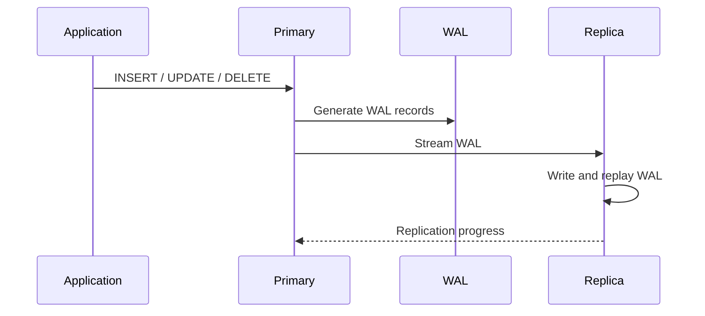
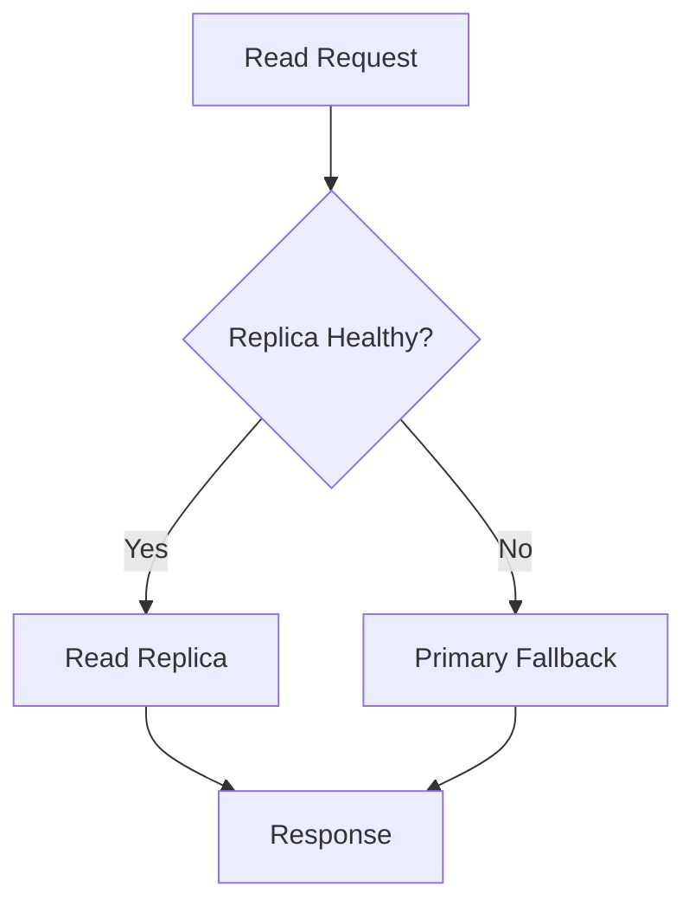
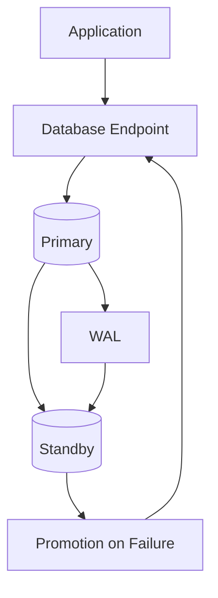
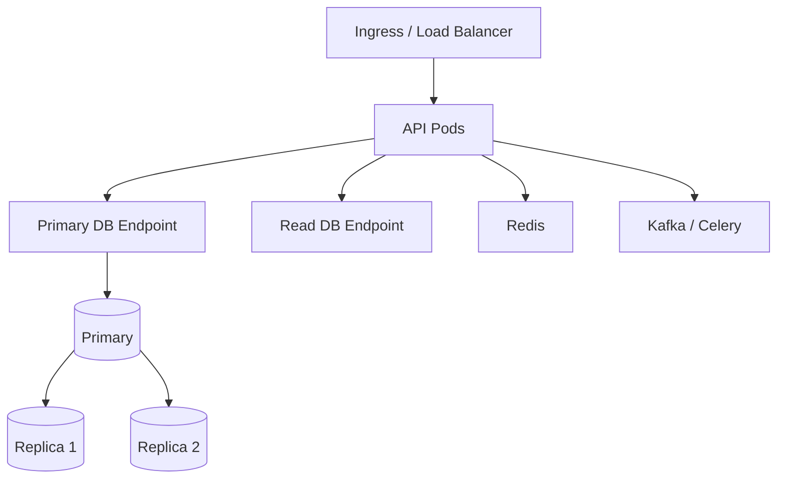

# 19- Replication Architecture

## Overview

Database replication maintains copies of database state across multiple database nodes.

A typical PostgreSQL replication architecture looks like:

```text
                    Application
                         │
              ┌──────────┴──────────┐
              │                     │
           Writes                  Reads
              │                     │
              ▼                     ▼
        ┌───────────┐        ┌──────────────┐
        │  Primary  │───────▶│   Replica    │
        └───────────┘  WAL    └──────────────┘
```

Replication is used primarily for:

- High availability
- Read scaling
- Disaster recovery
- Backup/recovery support
- Geographic distribution
- Workload isolation

Replication does **not** automatically mean:

- Strong consistency
- Higher write throughput
- Zero data loss
- Automatic failover
- A replacement for backups

The architecture must explicitly define replication mode, consistency requirements, failure behavior, routing, monitoring, and recovery procedures.

---

## Why Replication Exists

A single database instance creates several architectural limitations:

```text
                 PostgreSQL
                     │
        ┌────────────┼────────────┐
        │            │            │
      Reads        Writes       Failure
        │            │            │
     Limited      Limited      Single
     capacity     capacity     failure domain
```

Replication addresses some of these limitations by maintaining additional database nodes.

For example:

```text
                    Primary
                       │
                 WAL replication
                       │
            ┌──────────┴──────────┐
            ▼                     ▼
        Replica A             Replica B
```

The replicas can provide additional read capacity and can potentially take over if the primary fails.

---

## Primary and Replica Roles

### Primary

The primary is the authoritative database node for the replicated dataset.

Typical responsibilities:

- Accept writes
- Execute transactions
- Generate WAL
- Maintain authoritative state
- Stream changes to replicas

### Replica

A replica receives and replays changes generated by the primary.

Typical responsibilities:

- Serve read-only workloads
- Provide HA capacity
- Support disaster recovery
- Maintain a synchronized copy of data

A replica is generally not an independent writable copy of the same logical dataset.

---

## PostgreSQL Replication Data Flow

PostgreSQL physical streaming replication is based on WAL.

Simplified flow:



The important principle is:

> Replicas reproduce database changes rather than independently executing the original SQL statements.

This allows the replica to reconstruct the primary's database state from WAL.

---

## Write-Ahead Logging

WAL stands for **Write-Ahead Log**.

Before database changes are considered durable, PostgreSQL records the necessary change information in WAL.

Conceptually:

```text
Transaction
    │
    ▼
WAL records
    │
    ├── Local durability
    │
    └── Replication stream
             │
             ▼
          Replica
```

WAL is therefore central to:

- Crash recovery
- Physical replication
- Point-in-time recovery
- Replication monitoring

---

## Physical Replication

Physical replication transfers WAL changes representing the physical state of the database cluster.

```text
Primary
   │
   │ WAL
   ▼
Replica
   │
   ▼
Replay database changes
```

Advantages:

- Efficient
- Low-level and fast
- Suitable for HA and read replicas
- Maintains a close copy of the primary

Limitations:

- Replica generally follows the same PostgreSQL major-version compatibility requirements for physical replication
- Replication operates at the database-cluster level
- Selective table-level replication is not its primary purpose

Physical replication is a common foundation for PostgreSQL HA architectures.

---

## Logical Replication

Logical replication works at a logical change level.

```text
Publisher
    │
    │ Logical changes
    ▼
Subscriber
```

It can replicate selected tables and is useful for:

- Data integration
- Migration
- Selective replication
- Cross-system pipelines
- Version migration strategies
- CDC-style architectures

Logical replication provides more flexibility than physical replication, but the consistency and operational model differs.

---

## Physical vs Logical Replication

| Characteristic | Physical Replication | Logical Replication |
|---|---|---|
| Replication unit | Physical/WAL state | Logical row changes |
| Typical use | HA/read replicas | Integration/migration/CDC |
| Selective tables | No | Yes |
| Cluster-level copy | Yes | No |
| Read replica | Common | Possible but different semantics |
| Cross-version migration | More constrained | More flexible |
| Complexity | Lower for HA | Higher |
| CDC use cases | Limited | Strong |

The choice should follow the intended workload rather than the assumption that one mechanism is universally superior.

---

## Synchronous Replication

With synchronous replication, a transaction can be configured to wait for acknowledgment from one or more synchronous standbys before completing.

Conceptually:

```text
Application
    │
    ▼
Primary
    │
    ├── WAL → Replica
    │          │
    │          ▼
    │       ACK
    │          │
    └──────────┘
         │
         ▼
    Transaction completes
```

This can reduce the amount of acknowledged data that might be lost if the primary fails.

### Advantages

- Stronger durability guarantees
- Lower potential data loss during primary failure
- Useful for strict durability requirements

### Limitations

- Higher write latency
- Replica availability can affect primary transactions
- Network latency becomes part of write latency
- Incorrect configuration can reduce availability

Synchronous replication should be selected based on RPO and latency requirements.

---

## Asynchronous Replication

With asynchronous replication, the primary does not generally wait for replica replay before acknowledging the transaction.

```text
Application
    │
    ▼
Primary
    │
    ├── Commit
    │
    └── WAL ─────→ Replica
```

Advantages:

- Lower write latency
- Primary remains less dependent on replica responsiveness
- Good fit for read scaling

Limitations:

- Replica lag
- Potential data loss during failover
- Stale reads

Asynchronous replication is common for read replicas.

---

## Synchronous vs Asynchronous Replication

| Property | Synchronous | Asynchronous |
|---|---|---|
| Write latency | Higher | Lower |
| Replica acknowledgment | Required according to configuration | Not required for commit |
| Potential data loss | Lower | Non-zero |
| Availability sensitivity | Higher | Lower |
| Read scaling | Yes | Yes |
| Typical use | Strong durability | Read scaling / DR |

Neither mode is inherently better.

The correct question is:

> What RPO and latency does the system require?

---

## Replication Lag

Replication lag occurs when a replica has not yet caught up with the primary.

```text
Primary WAL position
        │
        │ 100 MB
        ▼
Replica replay position
        │
        │ 20 MB behind
        ▼
     Replica lag
```

Lag can be caused by:

- Network latency
- Replica CPU saturation
- Slow storage
- Long-running queries
- High WAL generation
- Replay conflicts
- Replica resource constraints

---

## Why Replication Lag Matters

Suppose:

```text
POST /orders/123
    ↓
Primary
    ↓
Transaction committed
```

Immediately afterward:

```text
GET /orders/123
    ↓
Replica
```

If the replica has not replayed the relevant WAL yet:

```text
Order exists on primary
Order not visible on replica
```

This creates a read-after-write consistency problem.

---

## Read Routing

Applications often route traffic according to operation type.

```text
                   Application
                  /           \
                 /             \
             Writes           Reads
                │               │
                ▼               ▼
            Primary         Replicas
```

For Django, routing can be implemented through database routers.

For FastAPI applications using SQLAlchemy, separate engines or sessions can be configured for primary and replica connections.

The important architectural principle is to make routing explicit.

---

## Consistency-Aware Routing

Not every read needs the same consistency.

Example:

| Operation | Preferred Database |
|---|---|
| Create order | Primary |
| Immediately view created order | Primary |
| Account balance after payment | Primary |
| Product catalog | Replica/cache |
| Historical reporting | Replica/OLAP |
| Search results | Search/read model |
| Analytics dashboard | OLAP |

This avoids sending every query to the primary while protecting consistency-sensitive operations.

---

## Primary Fallback

A production read router should consider replica health.



However, primary fallback can increase primary load unexpectedly.

Therefore, failover policies should account for:

- Primary capacity
- Number of replicas
- Connection pools
- Traffic volume
- Failure duration

A replica outage should not accidentally overload the primary and create a cascading failure.

---

## Multiple Read Replicas

A larger read-heavy system may use multiple replicas.

```text
                    Primary
                  /    |     \
                 /     |      \
                ▼      ▼       ▼
             Replica Replica Replica
                │      │       │
                └──────┴───────┘
                       │
                   Read Traffic
```

Read routing can use:

- Load balancing
- Weighted routing
- Health checks
- Lag-aware routing
- Connection-level distribution

A replica that is alive but significantly behind may not be suitable for every read workload.

---

## Lag-Aware Routing

A more mature system considers replica freshness.

```text
Replica A → 5 ms lag
Replica B → 20 ms lag
Replica C → 4 seconds lag
```

A latency-sensitive read path may prefer A or B and avoid C.

However, lag thresholds must be tied to application semantics.

For example:

```text
Catalog browsing:
Accept several seconds of lag

Payment status:
Require current state
```

---

## Replication and Transactions

Transactions are committed on the primary.

Replication distributes their resulting changes.

Consider:

```sql
BEGIN;

UPDATE accounts
SET balance = balance - 100
WHERE id = 1;

UPDATE accounts
SET balance = balance + 100
WHERE id = 2;

COMMIT;
```

The replica replays the WAL corresponding to the committed changes.

Applications should not assume that a replica can independently reproduce arbitrary transaction behavior with the same timing.

The important guarantee is about replicated state, not identical query execution timing.

---

## Replication and MVCC

PostgreSQL uses MVCC.

Long-running transactions can interact with replication and cleanup behavior.

For example:

```text
Long-running transaction
        │
        ▼
Old row versions remain relevant
        │
        ▼
Vacuum cleanup delayed
        │
        ▼
Table/index growth
```

On replicas, long-running queries can also interfere with WAL replay in situations where replay conflicts with snapshots or locks held by the query.

Therefore, replica workload management matters.

---

## Replica Replay Conflicts

A replica must replay primary changes.

Suppose a replica query holds a snapshot that conflicts with a cleanup-related WAL record.

The replica may need to:

- Delay replay
- Cancel the conflicting query
- Apply configured conflict-handling behavior

This is one reason read replicas should not automatically be treated as unlimited reporting databases.

Long-running analytical queries are often better isolated into OLAP systems.

---

## Replication Slots

Replication slots allow PostgreSQL to retain WAL required by a replica or logical subscriber.

Conceptually:

```text
Primary WAL
    │
    ├── Replica A slot
    ├── Replica B slot
    └── Logical subscriber slot
```

Replication slots protect consumers from losing required WAL.

However, an inactive or broken slot can cause WAL to accumulate on the primary.

Therefore:

> Replication slots are a reliability mechanism that can become a storage risk if not monitored.

---

## WAL Retention Risk

Consider:

```text
Replica offline
      ↓
Replication slot retains WAL
      ↓
WAL directory grows
      ↓
Storage fills
      ↓
Primary becomes unhealthy
```

This is a classic operational failure mode.

Monitor:

- Replication slot lag
- WAL retention
- Disk usage
- Replica connectivity

Do not create replication slots without an operational plan for inactive consumers.

---

## Replication Monitoring

Important PostgreSQL views include:

```sql
SELECT
    application_name,
    client_addr,
    state,
    sync_state,
    sent_lsn,
    write_lsn,
    flush_lsn,
    replay_lsn
FROM pg_stat_replication;
```

For a replica, useful information can be obtained from:

```sql
SELECT
    pg_is_in_recovery(),
    pg_last_wal_receive_lsn(),
    pg_last_wal_replay_lsn();
```

These values help determine whether a node is currently operating as a standby and how far WAL reception/replay has progressed.

---

## Measuring Replication Lag

A production monitoring system should distinguish between different forms of lag:

```text
Primary WAL generation
        ↓
Network transfer
        ↓
Replica WAL receive
        ↓
Replica WAL flush
        ↓
Replica WAL replay
```

A replica can receive WAL quickly but replay it slowly.

Therefore, simply measuring network transfer is insufficient.

Track:

- Write lag
- Flush lag
- Replay lag
- WAL byte distance
- Time-based lag where meaningful

---

## High Availability Architecture

Replication can provide the foundation for automatic failover.



A complete HA system requires more than replication.

It also needs:

- Failure detection
- Leader election or orchestration
- Promotion
- Endpoint/DNS changes
- Connection recovery
- Split-brain prevention
- Client retry behavior

Replication is a component of HA, not the entire HA solution.

---

## Failover

When the primary fails:

```text
Primary failure
      ↓
Failure detection
      ↓
Standby promotion
      ↓
Writer endpoint updated
      ↓
Application reconnects
```

Potential problems include:

- Lost transactions under asynchronous replication
- In-flight transaction uncertainty
- Stale connections
- DNS/endpoint caching
- Connection pool recovery
- Application retry storms

Failover must be tested rather than assumed to work.

---

## Split Brain

Split brain occurs when multiple nodes incorrectly believe they are the authoritative writer.

```text
        Application Traffic
          /           \
         ▼             ▼
     Primary A      Primary B
         │             │
         └── Conflict ─┘
```

This can cause data divergence and corruption.

Production HA systems need mechanisms that prevent or rapidly resolve multiple-writer authority.

---

## Failover and Application Behavior

Database failover can invalidate existing connections.

Applications should have:

- Connection timeouts
- Pool health checks
- Retry policies
- Transaction boundaries
- Idempotent operations

A retry must be designed carefully.

If the client receives a timeout after sending:

```sql
COMMIT;
```

the client may not know whether the transaction committed.

This is an **uncertain commit outcome**.

Blindly retrying a non-idempotent operation can duplicate business effects.

---

## Replication and Idempotency

Consider:

```text
POST /payments
```

The client sends a request.

The database commits successfully.

The connection fails before the client receives the response.

The client retries.

Without idempotency:

```text
Payment 1
Payment 2
```

may be created.

Use application-level idempotency keys where appropriate:

```text
Idempotency-Key: 7f9c...
```

and enforce uniqueness in the database.

Replication does not solve application-level duplicate request semantics.

---

## Replication and Backups

Replication is not a substitute for backups.

```text
Primary
   │
   ├── Replica
   │
   └── Backup System
```

A replica can reproduce:

- Accidental deletes
- Bad updates
- Application bugs
- Malicious modifications

Backups provide a separate recovery mechanism.

Production systems should consider:

- Automated backups
- Point-in-time recovery
- Restore testing
- Retention policies
- Cross-region copies

---

## Replication and Disaster Recovery

A remote replica can reduce recovery time and potentially reduce data loss.

For example:

```text
Region A
Primary
   │
   │ replication
   ▼
Region B
Standby
```

This can protect against regional failures.

However, cross-region replication introduces:

- Network latency
- Replication lag
- Data transfer cost
- More complex failover
- Regional consistency concerns

RPO and RTO should determine whether the added complexity is justified.

---

## Geographic Replication

Global applications may use geographically distributed replicas.

```text
                 Global Users
                      │
          ┌───────────┴───────────┐
          ▼                       ▼
       Region A                Region B
          │                       │
       Primary                  Replica
```

Regional replicas can reduce read latency.

They do not automatically provide globally consistent writes.

For workloads requiring local writes in multiple regions, a distributed or multi-primary architecture may be necessary.

---

## Replication for Read Scaling

Replication works particularly well for read-heavy workloads.

Example:

```text
10,000 requests/sec
    │
    ├── 9,000 reads
    └── 1,000 writes
```

Architecture:

```text
              Application
               /       \
              /         \
        1,000 writes   9,000 reads
             │             │
             ▼             ▼
          Primary      Read Replicas
```

The read workload can be distributed while writes remain centralized.

---

## Replication Does Not Scale Writes

Consider:

```text
Primary
 ├── Replica 1
 ├── Replica 2
 ├── Replica 3
 └── Replica 4
```

This increases read capacity.

It does not turn:

```text
1 primary write capacity
```

into:

```text
5 independent write capacities
```

For write scaling, evaluate:

- Batch writes
- Query optimization
- Reduced indexes
- Hot-row reduction
- Partitioning
- Asynchronous processing
- Sharding

---

## Replication and Caching

Redis and database replicas solve different problems.

```text
                 Application
                /           \
               ▼             ▼
            Redis         PostgreSQL
                            │
                            ▼
                         Replicas
```

Redis is useful for:

- Very hot data
- Low-latency reads
- Cacheable responses

Replicas are useful for:

- Database-consistent read access within replica freshness
- Operational read scaling
- HA/DR

They can be combined.

---

## Django Integration

A Django application can define multiple databases:

```python
DATABASES = {
    "default": {
        "ENGINE": "django.db.backends.postgresql",
        "NAME": "app",
        "HOST": "primary-db",
    },
    "replica": {
        "ENGINE": "django.db.backends.postgresql",
        "NAME": "app",
        "HOST": "read-replica-db",
    },
}
```

A database router can direct selected operations to the replica.

However, routing should not blindly send all reads to replicas.

Consistency-sensitive operations may need:

```python
using("default")
```

to read from the primary.

The application architecture should make consistency decisions explicit.

---

## FastAPI and SQLAlchemy

A FastAPI service can maintain separate database engines for primary and replica workloads.

Conceptually:

```text
Primary Engine
    ↓
Writes / consistency-sensitive reads

Replica Engine
    ↓
Read-heavy traffic
```

The routing layer should account for:

- Replica health
- Lag
- Pool capacity
- Request type
- Consistency requirements

Do not select a replica purely because it is reachable.

---

## Connection Pooling with Replicas

Each database node has its own connection capacity.

For example:

```text
Application
   │
   ├── Primary pool: 20
   │
   ├── Replica A: 20
   │
   └── Replica B: 20
```

Adding replicas can therefore increase total available database connections.

But each application pod may create its own pool.

For:

```text
30 pods
×
20 connections
```

the potential connection count is:

```text
600
```

Connection capacity must be planned across the entire deployment.

---

## Kubernetes Architecture

A production Kubernetes deployment may look like:



Database endpoints should normally be abstracted from application pods rather than hard-coding individual database instance addresses.

Managed database services can simplify failover and endpoint management.

---

## Health Checks

A replica health check should consider more than TCP connectivity.

A database may be:

```text
Network reachable
but
Replication severely behind
```

or:

```text
PostgreSQL running
but
Storage nearly full
```

Health evaluation should consider:

- Connection availability
- Recovery state
- Replication status
- Lag
- Storage
- Query responsiveness

---

## Schema Changes with Replication

Schema migrations must be compatible with the replication mechanism and deployment sequence.

For primary/replica architectures, a typical application migration strategy is:

```text
Expand schema
     ↓
Deploy compatible application
     ↓
Backfill data
     ↓
Switch application behavior
     ↓
Contract old schema
```

Large migrations can generate substantial WAL.

For example:

```text
Large UPDATE
    ↓
Large WAL generation
    ↓
Replication traffic increases
    ↓
Replica lag increases
```

Avoid unbounded production migrations when possible.

---

## Large Backfills

A large backfill such as:

```sql
UPDATE orders
SET normalized_status = lower(status);
```

across hundreds of millions of rows can produce substantial:

- WAL
- I/O
- Locking
- CPU usage
- Replica lag

Prefer controlled batches where possible:

```text
Batch
  ↓
Commit
  ↓
Observe lag
  ↓
Continue
```

Operational migration tooling should include the ability to pause or throttle work.

---

## Replication and Long-Running Queries

Long-running queries can create operational problems on both primary and replica nodes.

On replicas, they may conflict with WAL replay.

On primaries, long transactions can delay cleanup and increase table bloat.

Therefore:

- Set appropriate statement timeouts.
- Avoid unnecessary long transactions.
- Isolate analytical workloads.
- Monitor transaction age.
- Monitor replica replay behavior.

---

## Replication Security

Replication traffic contains database state and must be protected.

Use:

- TLS where appropriate
- Strong authentication
- Restricted network access
- Least-privilege replication roles
- Private networking
- Secret management
- Encryption at rest

Replication endpoints should not be unnecessarily exposed to the public internet.

---

## Observability

A production replication system should expose:

### Primary Metrics

- WAL generation rate
- Active replication connections
- Replica state
- Replication slot retention
- Disk usage

### Replica Metrics

- Receive lag
- Flush lag
- Replay lag
- Replay rate
- Query latency
- Storage utilization

### Application Metrics

- Primary vs replica request ratio
- Read-after-write errors
- Replica fallback rate
- Connection pool utilization
- Database error rate
- p95/p99 latency

A particularly useful application metric is:

```text
Percentage of reads routed to primary because replicas
were unhealthy, stale, or unsuitable.
```

A sudden increase can indicate replication degradation.

---

## Cost Considerations

Each replica introduces additional cost:

```text
Replica
+
Storage
+
Network transfer
+
Monitoring
+
Backups
+
Operational overhead
```

Cross-region replication can add significant network transfer costs.

Do not create replicas simply because they are available.

A replica should have a defined purpose:

- Read scaling
- HA
- DR
- Geographic latency reduction
- Workload isolation

---

## Production Failure Scenarios

### Replica Failure

```text
Replica fails
   ↓
Health check detects failure
   ↓
Remove replica from routing
   ↓
Route reads elsewhere
```

### Primary Failure

```text
Primary fails
   ↓
Detect failure
   ↓
Promote standby
   ↓
Update writer endpoint
   ↓
Reconnect application
```

### Replica Lag

```text
WAL generation > replay capacity
        ↓
Replica lag increases
        ↓
Lag-aware router removes replica
```

### Replication Slot Growth

```text
Consumer unavailable
       ↓
WAL retained
       ↓
Storage grows
       ↓
Alert / remediation
```

Each scenario should be tested through controlled failure exercises.

---

## Common Mistakes

### Treating Replicas as Strongly Consistent

Asynchronous replicas can be stale.

**Better:** classify reads according to consistency requirements.

### Assuming Replicas Scale Writes

They primarily scale reads.

**Better:** address write bottlenecks separately.

### Ignoring Replica Lag

A healthy TCP connection does not mean a fresh replica.

**Better:** monitor replay lag and route traffic accordingly.

### Using Replicas as Backups

Replicas reproduce bad changes.

**Better:** maintain independent backups and test restores.

### Unlimited Replication Slots

Inactive slots can retain large amounts of WAL.

**Better:** monitor slot activity and retained WAL.

### Sending Analytics to Production Replicas

Large analytical queries can interfere with replay and consume substantial resources.

**Better:** isolate analytics into an OLAP system when workload size justifies it.

### Blind Primary Fallback

If all replicas fail and every read moves to the primary, the primary may become overloaded.

**Better:** define fallback capacity and overload protection.

### Retrying Transactions Blindly During Failover

A transaction may have committed even if the client did not receive the response.

**Better:** use idempotency and reconciliation for uncertain outcomes.

### Ignoring Connection Pools

Every application pod can maintain connections to multiple database nodes.

**Better:** calculate aggregate pool capacity across the deployment.

### Assuming Replication Equals HA

Replication alone does not provide failure detection, promotion, endpoint management, or split-brain prevention.

**Better:** design and test the complete failover system.

---

## Production Best Practices

- Define RPO and RTO before selecting replication mode.
- Use asynchronous replicas for common read-scaling workloads unless stronger durability is required.
- Use synchronous replication selectively when the durability benefit justifies added latency and availability coupling.
- Monitor replication lag continuously.
- Make read routing consistency-aware.
- Keep independent backups even when replicas exist.
- Monitor replication slots and WAL retention.
- Use separate workloads for OLTP and large analytics.
- Size connection pools across all application and worker instances.
- Test replica failure and primary failover regularly.
- Make write operations idempotent where retries are possible.
- Use expand-and-contract migration strategies.
- Throttle large backfills to protect replication health.
- Keep replication traffic private and authenticated.
- Treat failover as a distributed-systems problem, not merely a database configuration setting.

## Interview Traps

### What is database replication?

Replication maintains copies of database state on multiple nodes so that additional nodes can support availability, read scaling, disaster recovery, or other workloads.

### What is the difference between synchronous and asynchronous replication?

Synchronous replication can require acknowledgment from configured synchronous standbys before a transaction is considered committed. Asynchronous replication allows the primary to commit without waiting for replica replay, resulting in lower latency but potential replica lag and data loss during failover.

### Does replication improve write throughput?

Not by itself. Primary/replica replication usually preserves a single authoritative write path. Write scaling requires different techniques such as batching, partitioning, workload decomposition, or sharding.

### What is replication lag?

Replication lag is the gap between changes generated by the primary and the point reached by a replica, which can involve WAL transmission, flushing, and replay.

### Why is replication lag a problem?

Reads from an asynchronous replica may return stale data. It can also indicate that the replica is falling behind and may become unsuitable for read traffic or failover.

### Is a replica a backup?

No. A replica can replicate accidental deletes, corrupt updates, and other unwanted changes. Independent backups and point-in-time recovery remain necessary.

### What is physical replication?

Physical replication transfers WAL representing the physical database state and is commonly used for PostgreSQL HA and read replicas.

### What is logical replication?

Logical replication transfers logical changes and can selectively replicate tables or data, making it useful for migrations, integration, and CDC-style workloads.

### How would you implement read scaling?

Route writes and consistency-sensitive reads to the primary, route eligible reads to healthy replicas, monitor replica lag, and provide controlled fallback behavior.

### How do you solve read-after-write problems?

Use primary reads for consistency-sensitive operations, or implement an explicit consistency mechanism such as LSN-aware routing where appropriate.

### What happens when a primary fails?

A complete HA system detects the failure, promotes an appropriate standby, updates the writer endpoint, and reconnects application clients. The exact behavior depends on the HA implementation.

### Why can replication slots be dangerous?

Replication slots retain WAL needed by consumers. If a consumer remains unavailable, WAL can accumulate and eventually exhaust primary storage.

### Why can long-running queries be problematic on replicas?

Replica queries can conflict with WAL replay, potentially delaying replay or causing query cancellation depending on configuration and circumstances.

### How does replication interact with Kubernetes?

Application scaling can multiply connections and database traffic. Replica routing, connection pools, health checks, and failover endpoints must therefore be designed together with Kubernetes deployment behavior.

### What happens to transactions during failover?

In-flight transactions may fail, while a transaction whose commit result was not observed by the client may have either committed or not. Applications must therefore handle uncertain outcomes carefully.

### How would you design PostgreSQL replication for a read-heavy API?

Use one authoritative primary, multiple read replicas, connection pools per workload, consistency-aware routing, Redis for highly cacheable hot data, replica-lag monitoring, controlled primary fallback, independent backups, and tested failover procedures.

### What is the senior-level answer to "Does replication provide high availability?"

Replication provides an important mechanism for maintaining another copy of database state, but HA additionally requires failure detection, safe promotion, endpoint management, connection recovery, split-brain prevention, monitoring, and tested operational procedures.

## Key Takeaways

- **Replication maintains additional copies of database state**, primarily enabling read scaling, high availability, disaster recovery, and workload isolation.
- **Synchronous and asynchronous replication make different durability and latency trade-offs**; the appropriate choice should follow explicit RPO, RTO, consistency, and performance requirements.
- **Replication does not automatically scale writes or provide strong read consistency**; asynchronous replicas can lag and require consistency-aware application routing.
- **Replication is not a backup and is not the complete HA solution**; independent backups, failover orchestration, monitoring, recovery procedures, and split-brain protection are essential.
- **Production replication is an operational system**, requiring continuous monitoring of lag, WAL, replication slots, connections, failures, migrations, and application behavior during failover.